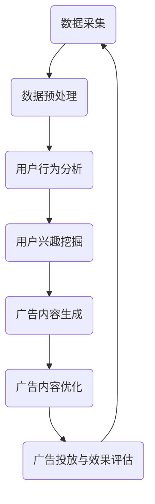

                 

# AI驱动的智能广告内容个性化：提高用户参与度

## 关键词
- AI
- 广告个性化
- 智能广告
- 用户参与度
- 数据分析
- 机器学习

## 摘要
本文将探讨如何利用AI技术实现广告内容的个性化，从而提高用户的参与度。我们将从背景介绍、核心概念与原理、算法原理与数学模型、项目实战和最佳实践等多个方面进行深入分析，以期帮助广告从业者和技术开发人员更好地理解和应用AI驱动的智能广告内容个性化技术。

## 引言

### 1.1 AI与广告行业

人工智能（AI）技术的快速发展，已经对各行各业产生了深远的影响，广告行业也不例外。传统的广告模式往往依赖于广泛的受众覆盖和大规模的广告投放，而随着互联网和大数据技术的普及，个性化广告逐渐成为主流。个性化广告能够根据用户的行为和兴趣进行精准推送，从而提高广告的投放效果和用户参与度。

#### 1.1.1 AI的发展背景

AI技术起源于20世纪50年代，经历了多次起伏和发展。随着深度学习、神经网络等技术的突破，AI在近年来的发展速度尤为迅猛。特别是随着计算能力的提升和大数据的积累，AI的应用场景越来越广泛，从语音识别、图像识别到自然语言处理，AI已经渗透到我们的日常生活和工作中。

#### 1.1.2 广告行业现状

广告行业一直处于快速发展的阶段，随着互联网的普及，线上广告已经逐渐取代了传统广告。然而，传统的广告投放方式往往存在精准度不高、用户参与度低等问题。为了解决这些问题，广告行业开始寻求更加精准、高效的投放方式，个性化广告因此应运而生。

#### 1.1.3 AI在广告行业中的应用前景

随着AI技术的不断进步，其在广告行业中的应用前景也十分广阔。通过用户行为分析和兴趣挖掘，AI可以精准地定位目标用户，从而提高广告的投放效果。同时，AI还可以实现广告内容的自动生成和优化，大大降低广告制作成本。未来，AI驱动的智能广告有望成为广告行业的主流。

### 1.2 智能广告内容个性化概述

#### 1.2.1 个性化广告的定义

个性化广告是指根据用户的行为、兴趣、历史记录等数据，为每个用户定制个性化的广告内容。与传统广告相比，个性化广告能够更好地满足用户的需求，提高广告的投放效果。

#### 1.2.2 个性化广告的优势

个性化广告具有以下优势：
- **提高用户参与度**：个性化广告能够更好地吸引用户的注意力，提高用户点击率和转化率。
- **降低广告成本**：通过精准投放，个性化广告可以降低广告成本，提高投资回报率。
- **提升用户体验**：个性化广告能够为用户提供更加符合其兴趣的内容，提升用户体验。

#### 1.2.3 智能广告内容个性化的关键技术

实现智能广告内容个性化需要以下关键技术：
- **用户行为分析**：通过对用户行为数据的收集和分析，了解用户的兴趣和行为模式。
- **用户兴趣挖掘**：基于用户行为数据，挖掘用户的潜在兴趣，为广告内容生成提供依据。
- **广告内容生成与优化**：利用机器学习和深度学习等技术，实现广告内容的自动生成和优化。

## 核心概念与原理

### 2.1 AI驱动的核心概念

#### 2.1.1 数据驱动与模型驱动

AI驱动的智能广告内容个性化可以分为数据驱动和模型驱动两个阶段。数据驱动阶段主要依赖于用户行为数据和广告内容数据，通过统计分析等方法进行初步的用户兴趣挖掘和广告内容优化。模型驱动阶段则通过机器学习和深度学习等技术，建立更加复杂和精确的模型，实现更高质量的广告内容个性化。

#### 2.1.2 机器学习与深度学习

机器学习是AI的核心技术之一，它能够通过数据训练，让计算机自动学习和改进。深度学习是机器学习的一种特殊形式，通过多层神经网络的结构，实现更加复杂的特征提取和模型训练。

#### 2.1.3 强化学习在广告中的应用

强化学习是一种通过试错和反馈来学习策略的机器学习方法。在广告投放中，强化学习可以通过不断地调整广告策略，以最大化广告效果（如点击率、转化率等）。

### 2.2 广告内容个性化原理

#### 2.2.1 用户行为分析

用户行为分析是广告内容个性化的基础。通过分析用户的浏览记录、搜索历史、购买行为等数据，可以了解用户的行为模式和兴趣偏好。

#### 2.2.2 用户兴趣挖掘

用户兴趣挖掘是通过对用户行为数据的分析，挖掘用户的潜在兴趣点。这些兴趣点可以用来指导广告内容的生成和优化。

#### 2.2.3 广告内容生成与优化

广告内容生成与优化是广告内容个性化的关键步骤。通过机器学习和深度学习等技术，可以自动生成符合用户兴趣的广告内容，并通过持续优化，提高广告的投放效果。

### 2.3 AI驱动的智能广告内容个性化架构

#### 2.3.1 架构概述

AI驱动的智能广告内容个性化架构通常包括以下几个部分：
- 数据采集与存储
- 数据预处理
- 用户行为分析
- 用户兴趣挖掘
- 广告内容生成与优化
- 广告投放与效果评估

#### 2.3.2 数据流与处理流程

在AI驱动的智能广告内容个性化架构中，数据流和处理流程通常如下：
1. 数据采集：收集用户的浏览记录、搜索历史、购买行为等数据。
2. 数据预处理：清洗和整合数据，为后续分析做准备。
3. 用户行为分析：分析用户行为数据，了解用户行为模式和兴趣偏好。
4. 用户兴趣挖掘：基于用户行为数据，挖掘用户的潜在兴趣点。
5. 广告内容生成：利用机器学习和深度学习技术，生成符合用户兴趣的广告内容。
6. 广告内容优化：通过A/B测试等方法，持续优化广告内容。
7. 广告投放与效果评估：将广告内容投放给用户，并评估广告效果。

#### 2.3.3 关键技术关联

在AI驱动的智能广告内容个性化架构中，各个关键技术之间相互关联，共同作用。例如，用户行为分析可以为用户兴趣挖掘提供数据支持，而用户兴趣挖掘又可以指导广告内容生成与优化。同时，广告内容优化还可以反馈给用户行为分析，形成一个闭环，进一步提高广告的投放效果。

## Mermaid流程图：AI驱动的智能广告内容个性化架构

## 核心算法原理与数学模型

### 3.1 广告内容个性化算法原理

#### 3.1.1 协同过滤算法

协同过滤算法是一种常见的广告内容个性化算法，它通过分析用户之间的相似性，为用户提供个性化的推荐。协同过滤算法主要分为以下两种：

##### 1. 基于用户的协同过滤

基于用户的协同过滤算法通过分析用户之间的相似性，找到与目标用户兴趣相似的已用户，然后根据这些已用户的偏好为当前用户推荐广告内容。

##### 2. 基于物品的协同过滤

基于物品的协同过滤算法通过分析物品之间的相似性，找到与目标物品兴趣相似的物品，然后根据这些物品为当前用户推荐广告内容。

#### 3.1.2 内容推荐算法

内容推荐算法通过分析广告内容的特点，为用户提供个性化的推荐。常见的内容推荐算法包括以下几种：

##### 1. 基于文本的推荐

基于文本的推荐算法通过对广告文本进行分析，提取关键词和主题，然后根据关键词和主题为用户提供个性化的推荐。

##### 2. 基于内容的协同过滤

基于内容的协同过滤算法结合了协同过滤和内容推荐的特点，通过分析用户和物品之间的兴趣重叠，为用户提供个性化的推荐。

#### 3.1.3 强化学习算法

强化学习算法通过不断试错和优化，找到最优的广告投放策略。常见的强化学习算法包括以下几种：

##### 1. Q-Learning算法

Q-Learning算法通过更新Q值，找到最优的动作策略。

##### 2. Deep Q-Networks (DQN)

DQN算法通过深度神经网络，对Q值进行预测，实现更复杂的策略学习。

##### 3. 策略梯度算法

策略梯度算法通过直接优化策略参数，实现快速策略优化。

### 3.2 数学模型与公式详解

在广告内容个性化算法中，常用的数学模型包括矩阵与向量操作、概率论基础和优化算法等。以下是这些模型的简要介绍和公式：

#### 3.2.1 矩阵与向量操作

- **矩阵乘法**：\(C = A \times B\)
- **向量加法**：\(V = U + W\)
- **向量减法**：\(V = U - W\)
- **向量点积**：\(V \cdot W = U \cdot W + V \cdot W\)
- **向量叉积**：\(V \times W = U \times W + V \times W\)

#### 3.2.2 概率论基础

- **条件概率**：\(P(A|B) = \frac{P(A \cap B)}{P(B)}\)
- **贝叶斯公式**：\(P(A|B) = \frac{P(B|A) \cdot P(A)}{P(B)}\)
- **马尔可夫链**：\(P(X_n|X_{n-1}, X_{n-2}, ...) = P(X_n|X_{n-1})\)

#### 3.2.3 优化算法

- **梯度下降**：\(x_{\text{new}} = x_{\text{current}} - \alpha \cdot \nabla f(x_{\text{current}})\)
- **牛顿法**：\(x_{\text{new}} = x_{\text{current}} - \frac{f(x_{\text{current}})}{f'(x_{\text{current}})}\)

### 3.3 Mermaid流程图：广告内容个性化算法流程

## 项目实战与案例分析

### 4.1 项目实战一：基于协同过滤的用户兴趣挖掘

#### 4.1.1 实战目标

本项目的目标是实现一个基于协同过滤算法的用户兴趣挖掘系统，通过对用户的历史行为数据进行挖掘，为用户推荐个性化的广告内容。

#### 4.1.2 数据预处理

1. **数据清洗**：去除缺失值、重复值和异常值。
2. **数据转换**：将用户行为数据转换为矩阵形式，便于后续处理。

#### 4.1.3 模型搭建与训练

1. **基于用户的协同过滤**：
   - 计算用户之间的相似度矩阵。
   - 利用相似度矩阵为用户生成推荐列表。

2. **基于物品的协同过滤**：
   - 计算物品之间的相似度矩阵。
   - 利用相似度矩阵为用户生成推荐列表。

#### 4.1.4 模型评估与优化

1. **评估指标**：准确率、召回率、F1值等。
2. **模型优化**：通过调整参数，提高模型性能。

### 4.2 项目实战二：基于内容推荐的广告内容生成

#### 4.2.1 实战目标

本项目的目标是实现一个基于内容推荐的广告内容生成系统，通过对广告内容进行分析，生成符合用户兴趣的广告。

#### 4.2.2 数据收集与预处理

1. **数据收集**：收集广告文本、用户行为等数据。
2. **数据预处理**：清洗和转换数据，为后续处理做准备。

#### 4.2.3 模型选择与实现

1. **文本分类与主题建模**：使用词袋模型、TF-IDF等文本特征提取方法，进行文本分类和主题建模。
2. **广告内容生成**：利用生成对抗网络（GAN）等技术，生成符合用户兴趣的广告内容。

#### 4.2.4 广告内容生成与展示

1. **广告内容生成**：根据用户兴趣，生成个性化的广告内容。
2. **广告内容展示**：将广告内容展示给用户，并评估广告效果。

### 4.3 项目实战三：基于强化学习的广告投放优化

#### 4.3.1 实战目标

本项目的目标是实现一个基于强化学习的广告投放优化系统，通过对广告投放策略的不断调整，提高广告投放效果。

#### 4.3.2 数据处理与模型设计

1. **数据处理**：收集广告投放数据，包括广告展示次数、点击次数等。
2. **模型设计**：设计一个基于Q-Learning的强化学习模型，用于优化广告投放策略。

#### 4.3.3 强化学习算法实现

1. **Q-Learning算法**：实现Q-Learning算法，用于优化广告投放策略。
2. **Deep Q-Networks (DQN)**：实现DQN算法，用于处理更复杂的广告投放问题。

#### 4.3.4 模型评估与优化

1. **评估指标**：点击率、转化率等。
2. **模型优化**：通过调整参数，提高模型性能。

## 最佳实践 tips、小结、注意事项、拓展阅读

### 最佳实践 tips

- 在进行用户行为分析和兴趣挖掘时，要确保数据的质量和完整性。
- 在设计广告内容生成模型时，要充分考虑广告的展示效果和用户体验。
- 在应用强化学习算法时，要合理设置奖励机制，以最大化广告投放效果。

### 小结

本文从背景介绍、核心概念与原理、算法原理与数学模型、项目实战和最佳实践等多个方面，探讨了AI驱动的智能广告内容个性化技术。通过本文的学习，读者可以了解到如何利用AI技术实现广告内容的个性化，从而提高用户的参与度。

### 注意事项

- 在实际应用中，要充分了解用户的需求和兴趣，以确保广告内容的个性化。
- 要注意保护用户的隐私，遵守相关的法律法规。

### 拓展阅读

- [《深度学习》](https://book.douban.com/subject/26708156/)：由Ian Goodfellow、Yoshua Bengio和Aaron Courville所著，是深度学习的经典教材。
- [《机器学习》](https://book.douban.com/subject/26707243/)：由周志华教授所著，是机器学习的经典教材。
- [《广告系统架构设计与优化实践》](https://book.douban.com/subject/31226916/)：由陈鹤所著，详细介绍了广告系统的架构设计和优化实践。

## 作者信息

作者：AI天才研究院/AI Genius Institute & 禅与计算机程序设计艺术 /Zen And The Art of Computer Programming

## 附录

### 附录A：常用工具与资源

- **数据处理工具**：Pandas、NumPy、SciPy等。
- **机器学习框架**：Scikit-learn、TensorFlow、PyTorch等。
- **深度学习框架**：TensorFlow、PyTorch、Keras等。

### 附录B：参考文献

- [《深度学习》](https://book.douban.com/subject/26708156/)
- [《机器学习》](https://book.douban.com/subject/26707243/)
- [《广告系统架构设计与优化实践》](https://book.douban.com/subject/31226916/)

