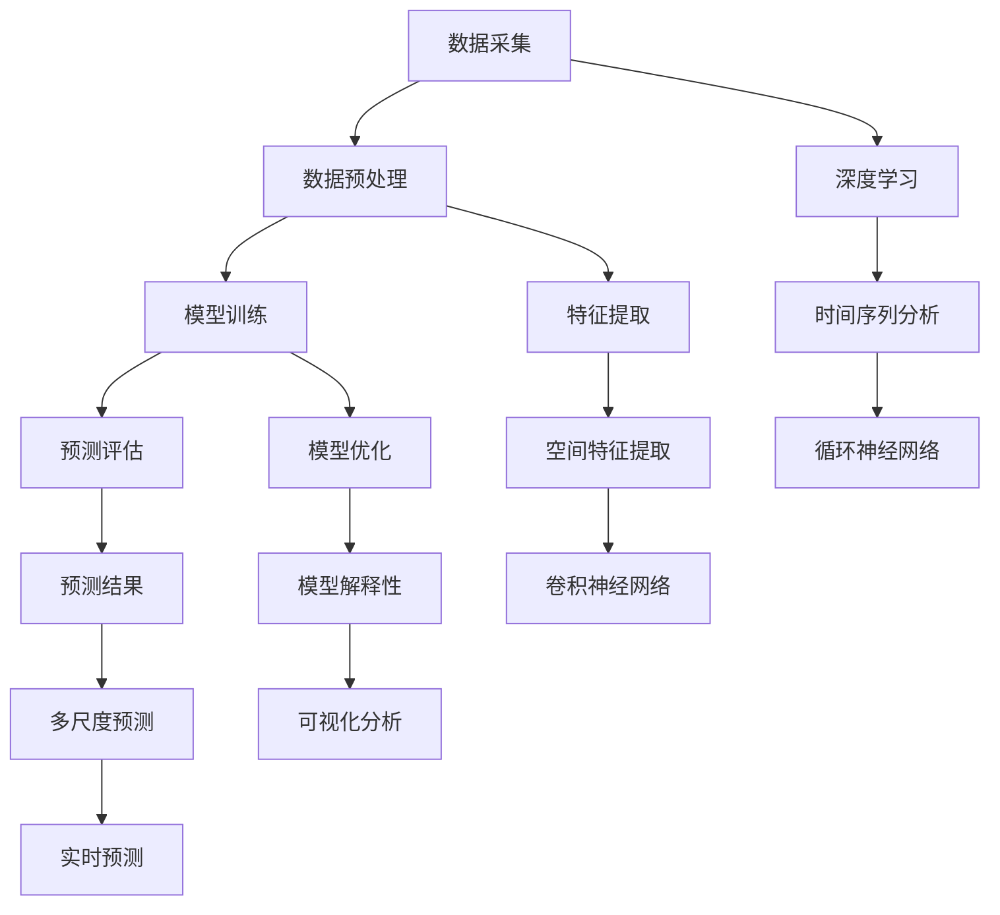

                 

### 引言与背景

#### 1.1 AI技术概述

人工智能（AI，Artificial Intelligence）是指由人制造出来的系统所表现出来的智能行为。AI的发展历程可以分为三个阶段：符号主义、连接主义和统计学习。符号主义以逻辑推理为基础，通过规则和符号来模拟人类思维；连接主义基于神经网络的建模，通过神经元的连接来模拟大脑的工作原理；统计学习则通过大量的数据训练模型，使机器能够自动学习并做出预测。

#### 1.1.1 AI的定义与发展历程

AI的定义随着技术的发展而不断演变。早期的AI研究主要集中在符号主义和连接主义上。符号主义AI以逻辑推理为核心，试图通过符号处理和知识表示来模拟人类智能。1956年，达特茅斯会议的召开标志着AI的正式诞生。连接主义AI以神经网络为基础，通过模拟人脑神经元之间的连接来处理信息。1986年，Hopfield网络的提出为连接主义AI奠定了基础。

#### 1.1.2 AI的分类与核心技术

AI可以分为弱AI和强AI。弱AI指在特定任务上表现出智能行为的系统，如语音识别、图像识别等；强AI则是具有全面智能的系统，能够理解、学习和适应复杂环境。AI的核心技术包括机器学习、深度学习、自然语言处理、计算机视觉等。机器学习通过训练模型来预测和分类数据；深度学习则通过多层神经网络来提取特征；自然语言处理涉及文本的生成、理解和翻译；计算机视觉则关注图像的处理和识别。

#### 1.2 气象预报的重要性

气象预报是通过对大气状况的分析和模拟，预测未来天气状况的一种科学活动。准确及时的气象预报对于防灾减灾、城市规划、农业灌溉等领域具有重要意义。然而，气象预报面临着诸多挑战，如数据复杂性、模型准确性和预测时效性等。

#### 1.2.1 气象预报的挑战

气象预报的挑战主要包括数据复杂性、模型准确性和预测时效性。数据复杂性体现在气象数据的多维度和多样性上，如温度、湿度、气压等；模型准确性受限于现有算法和计算资源的限制；预测时效性要求预报结果能够在短时间内提供，以满足实际需求。

#### 1.2.2 气象预报的社会经济影响

气象预报对于社会经济的发展具有重要影响。准确的气象预报可以提前预警极端天气事件，减少灾害损失，提高公共安全。同时，气象预报对于农业生产、城市规划、旅游业等方面也具有重要意义，能够提高资源利用效率，促进经济发展。

### 总结

本章节介绍了AI技术的基本概念、发展历程和分类，以及气象预报的重要性及其面临的挑战。接下来，我们将深入探讨AI在气象预报中的应用，以及如何通过AI技术提高极端天气事件的预测准确性。

## AI与气象预报

#### 2.1 AI在气象预报中的应用

人工智能在气象预报中的应用主要体现在数据驱动方法和知识驱动方法上。数据驱动方法依赖于大量的气象数据进行预测，而知识驱动方法则利用先验知识和模型进行预测。

#### 2.1.1 数据驱动方法

数据驱动方法主要依赖于机器学习和深度学习算法。机器学习算法通过对历史气象数据的学习，建立预测模型，从而实现对未来天气的预测。深度学习算法则通过多层神经网络，自动提取特征，提高预测准确性。

#### 2.1.2 知识驱动方法

知识驱动方法则依赖于先验知识和模型。气象学家通过对气象现象的理解，构建相应的预测模型。这些模型可以是统计模型、物理模型或混合模型。知识驱动方法的优势在于能够充分利用气象学家的专业知识和经验，提高预测准确性。

### 智能气象预报的优势

智能气象预报相较于传统预报方法具有以下优势：

#### 2.2.1 预测精度提高

AI技术能够自动提取大量数据中的潜在特征，提高预测模型的准确性。深度学习算法特别是卷积神经网络（CNN）和循环神经网络（RNN）等，在图像和序列数据上表现出色，能够有效提高气象预测的精度。

#### 2.2.2 预报时间范围扩展

传统气象预报通常只能提供短期预测，而智能气象预报能够扩展到更长的时间范围。通过结合多源数据和先进的算法，智能气象预报能够提供更加详细的未来天气状况，帮助人们更好地应对极端天气事件。

### 智能气象预报的实现

智能气象预报的实现主要包括数据采集、数据预处理、模型训练和预测输出等步骤。

#### 2.3.1 数据采集

数据采集是智能气象预报的基础。气象数据来源于地面观测站、气象卫星、雷达等多种渠道。这些数据包括温度、湿度、气压、风速、风向等气象参数。为了提高预测准确性，需要尽可能多地采集多源数据，并进行时间同步。

#### 2.3.2 数据预处理

数据预处理是数据驱动方法的重要环节。预处理步骤包括数据清洗、数据标准化和特征提取等。数据清洗旨在去除噪声和异常值；数据标准化则通过缩放或归一化，使数据具备可比性；特征提取则通过提取关键特征，提高模型的预测性能。

#### 2.3.3 模型训练

模型训练是智能气象预报的核心步骤。训练过程通过大量的历史气象数据进行，旨在优化模型的参数，提高预测准确性。常用的机器学习算法包括线性回归、支持向量机、决策树等；深度学习算法包括卷积神经网络（CNN）、循环神经网络（RNN）等。

#### 2.3.4 预测输出

预测输出是根据训练好的模型，对未来的天气状况进行预测。预测输出可以是一个简单的数值，如未来某个时间点的温度；也可以是一个概率分布，如未来天气发生某种情况的概率。

### 总结

本章节介绍了AI在气象预报中的应用，以及智能气象预报的优势和实现方法。接下来，我们将深入探讨极端天气与预测挑战，以及如何通过AI技术应对这些挑战。

## 极端天气与预测挑战

### 3.1 极端天气事件概述

极端天气事件是指在一定时间内，气象要素（如温度、湿度、风速、降水量等）的极端值出现的频率远高于常年平均值的事件。极端天气事件包括极端高温、强降水、台风、寒潮等。

#### 3.1.1 极端高温

极端高温事件通常表现为持续的高温天气，可能导致中暑、热浪、干旱等灾害。极端高温事件的发生频率和强度在全球范围内呈上升趋势，对人类健康、农业生产和水资源管理带来严重威胁。

#### 3.1.2 强降水

强降水事件通常表现为短时间内降水强度大，可能导致洪水、滑坡、泥石流等灾害。强降水事件在全球范围内时有发生，对城市排水系统、交通设施、农业生产等造成严重影响。

### 3.2 极端天气预测的难点

极端天气预测面临诸多挑战，主要包括模式识别困难、时间尺度差异和预测不确定性等。

#### 3.2.1 模式识别困难

极端天气事件的复杂性和多变性使得传统的统计方法和物理模型在模式识别上存在困难。气象数据的多维度和多样性增加了模式识别的复杂性，需要先进的算法和模型来处理。

#### 3.2.2 时间尺度差异

极端天气事件通常发生在不同时间尺度上，从几分钟到几个月不等。这种时间尺度差异对预测模型的准确性和时效性提出了挑战。需要设计适用于不同时间尺度的预测模型，以提高极端天气事件的预测准确性。

#### 3.2.3 预测不确定性

极端天气事件的预测不确定性主要来源于数据的不确定性、模型的误差和环境变化等因素。这些不确定性使得极端天气事件的预测结果存在一定的不确定性，需要通过概率模型和不确定性量化方法来降低预测不确定性。

### 极端天气事件的预测需求

随着极端天气事件的频繁发生，对极端天气事件的预测需求日益增长。准确的极端天气预测可以提前预警，减少灾害损失，提高公共安全。具体需求包括：

#### 3.3.1 提高预测准确性

提高极端天气事件的预测准确性是首要任务。通过引入先进的AI技术和算法，如深度学习和强化学习，可以提高预测模型的准确性，降低预测不确定性。

#### 3.3.2 扩展预测时间范围

扩展极端天气事件的预测时间范围，从短期预测扩展到中期和长期预测，以满足不同时间尺度的需求。通过多源数据融合和先进的算法，可以实现更长时间的预测。

#### 3.3.3 提高预测实时性

提高预测实时性，实现快速响应。通过实时数据采集和实时预测算法，可以及时更新预测结果，为决策提供支持。

### 总结

本章节介绍了极端天气事件的定义、分类和预测难点。通过分析极端天气事件的复杂性和多变性，以及预测需求，我们可以认识到AI技术在极端天气预测中的重要性。接下来，我们将探讨AI驱动的气象预报方法，以及如何通过AI技术提高极端天气事件的预测准确性。

## AI驱动的气象预报方法

### 4.1 深度学习在气象预报中的应用

深度学习（Deep Learning）是一种基于多层神经网络的机器学习方法，具有强大的特征提取和模式识别能力。在气象预报中，深度学习被广泛应用于时间序列预测、图像识别和数据分类等领域。

#### 4.1.1 神经网络模型

神经网络（Neural Network）是深度学习的基础，由大量神经元（节点）组成。每个神经元通过权重连接到其他神经元，并传递输入信号。神经网络的训练过程是通过反向传播算法来调整权重，使输出结果尽可能接近真实值。

在气象预报中，常用的神经网络模型包括：

- **多层感知机（MLP）**：一种前馈神经网络，适用于非线性时间序列预测。
- **卷积神经网络（CNN）**：通过卷积层自动提取特征，适用于图像识别，也可用于气象数据中的空间特征提取。
- **循环神经网络（RNN）**：能够处理序列数据，适用于时间序列预测，如天气序列的预测。

#### 4.1.2 循环神经网络（RNN）

循环神经网络（RNN）是一种能够处理序列数据的神经网络，具有记忆功能，可以捕捉时间序列中的长期依赖关系。在气象预报中，RNN可以用来预测天气序列，如未来的温度、湿度、风速等。

RNN的基本结构包括：

- **输入层**：接收输入序列。
- **隐藏层**：包含多个神经元，用于处理输入序列并传递给下一个时间步。
- **输出层**：生成预测值。

RNN通过以下公式更新隐藏状态：

$$ h_t = \sigma(W_h \cdot [h_{t-1}, x_t] + b_h) $$

其中，$h_t$表示当前时间步的隐藏状态，$x_t$表示当前时间步的输入，$W_h$和$b_h$分别表示权重和偏置，$\sigma$表示激活函数。

#### 4.1.3 长短期记忆网络（LSTM）

长短期记忆网络（Long Short-Term Memory，LSTM）是RNN的一种改进模型，能够有效解决长期依赖问题。LSTM通过引入三个门控单元，分别用于控制信息的输入、保持和输出。

LSTM的基本结构包括：

- **输入门**：决定当前输入信息对隐藏状态的影响程度。
- **遗忘门**：决定哪些信息需要从隐藏状态中遗忘。
- **输出门**：决定当前隐藏状态生成预测值的程度。

LSTM的更新公式如下：

$$ i_t = \sigma(W_i \cdot [h_{t-1}, x_t] + b_i) $$
$$ f_t = \sigma(W_f \cdot [h_{t-1}, x_t] + b_f) $$
$$ g_t = \sigma(W_g \cdot [h_{t-1}, x_t] + b_g) $$
$$ o_t = \sigma(W_o \cdot [h_{t-1}, x_t] + b_o) $$
$$ h_t = o_t \cdot \sigma(W_h \cdot [g_t, h_{t-1}] + b_h) $$

其中，$i_t$、$f_t$、$g_t$和$o_t$分别表示输入门、遗忘门、输入门和输出门的激活值，$W_i$、$W_f$、$W_g$和$W_o$分别表示对应的权重，$b_i$、$b_f$、$b_g$和$b_o$分别表示对应的偏置，$\sigma$表示激活函数。

#### 4.1.4 深度学习在气象预报中的应用案例

- **温度预测**：使用LSTM模型对历史温度数据进行训练，预测未来某个时间点的温度。
- **降水预测**：使用卷积神经网络（CNN）提取气象数据中的空间特征，预测未来某个时间段的降水情况。
- **台风路径预测**：使用深度学习模型分析台风生成和发展的过程，预测台风的移动路径。

### 4.2 强化学习方法在气象预报中的应用

强化学习（Reinforcement Learning，RL）是一种通过试错和奖励机制来学习策略的机器学习方法。在气象预报中，强化学习可以用来优化决策过程，提高预测准确性。

#### 4.2.1 基本概念

强化学习的主要组成部分包括：

- **环境（Environment）**：气象系统。
- **状态（State）**：当前天气状况。
- **动作（Action）**：预报策略。
- **奖励（Reward）**：根据预测准确性和用户需求计算。

强化学习的过程是通过不断尝试不同的动作，并根据奖励信号调整策略，最终找到最优策略。

#### 4.2.2 Q-learning算法

Q-learning算法是一种基于值函数的强化学习方法。Q-learning的目标是学习一个值函数$Q(s, a)$，表示在状态$s$下执行动作$a$的期望奖励。

Q-learning的基本步骤包括：

1. 初始化值函数$Q(s, a)$。
2. 在状态$s$下随机选择动作$a$。
3. 执行动作$a$，进入新状态$s'$，并获得奖励$r$。
4. 根据新状态$s'$，更新值函数$Q(s, a)$：
   $$ Q(s, a) \leftarrow Q(s, a) + \alpha [r + \gamma \max_{a'} Q(s', a') - Q(s, a)] $$
   其中，$\alpha$为学习率，$\gamma$为折扣因子。

#### 4.2.3 DQN算法

深度Q网络（Deep Q-Network，DQN）是Q-learning算法的改进版本，使用深度神经网络来近似值函数$Q(s, a)$。

DQN的基本步骤包括：

1. 初始化深度神经网络$DQN$。
2. 使用经验回放记忆$Experience Replay$来训练$DQN$。
3. 在状态$s$下随机选择动作$a$。
4. 执行动作$a$，进入新状态$s'$，并获得奖励$r$。
5. 将经验$(s, a, r, s')$存储到经验回放记忆中。
6. 从经验回放记忆中随机抽样一批经验，训练$DQN$。

#### 4.2.4 强化学习在气象预报中的应用案例

- **温度预报**：使用Q-learning算法优化温度预报策略，提高预报准确性。
- **台风路径预报**：使用DQN算法预测台风的移动路径，为防灾减灾提供支持。

### 总结

本章节介绍了深度学习和强化学习在气象预报中的应用。深度学习通过自动提取特征，提高预测准确性；强化学习通过试错和奖励机制，优化决策过程。这些AI技术为提高极端天气事件的预测准确性提供了新的思路和方法。接下来，我们将探讨数据采集与预处理的重要性。

## 数据采集与预处理

在AI驱动的气象预报中，数据采集与预处理是至关重要的环节。有效的数据采集和预处理可以提高模型的性能，减少噪声和异常值，从而提高预测准确性。

### 5.1 气象数据来源

气象数据可以从多种来源获取，包括地面观测数据、气象卫星数据和雷达数据等。

#### 5.1.1 地面观测数据

地面观测数据是通过地面气象站、海洋浮标、飞机等设备收集的。这些数据包括温度、湿度、气压、风速、风向、降水量等。地面观测数据是气象预报的重要基础数据，但存在时空分辨率低、数据覆盖不均匀等问题。

#### 5.1.2 气象卫星数据

气象卫星数据是通过气象卫星获取的，包括可见光、红外、微波等遥感数据。气象卫星数据可以提供大范围、高时空分辨率的气象信息，如云图、温度场、降水分布等。气象卫星数据具有极高的价值，但获取成本较高，且存在数据滞后问题。

#### 5.1.3 雷达数据

雷达数据是通过气象雷达获取的，包括雷达反射率、速度、方向等。雷达数据可以提供实时、高分辨率的降水信息，是极端天气事件预警的关键数据源。

### 5.2 数据预处理方法

数据预处理是提高气象数据质量和模型性能的关键步骤，包括数据清洗、数据标准化和特征提取等。

#### 5.2.1 数据清洗

数据清洗旨在去除噪声和异常值，提高数据质量。数据清洗的方法包括：

- **缺失值填充**：使用平均值、中位数、插值等方法填补缺失值。
- **异常值检测**：使用统计学方法，如标准差、箱线图等，检测和去除异常值。
- **数据格式转换**：统一不同来源的数据格式，如时间戳、单位等。

#### 5.2.2 数据标准化

数据标准化是使不同数据具备可比性的重要步骤。常用的数据标准化方法包括：

- **归一化**：将数据缩放到[0, 1]或[-1, 1]范围内。
- **标准化**：将数据缩放到均值为0、标准差为1的范围内。

#### 5.2.3 特征提取

特征提取是从原始数据中提取关键特征，用于训练模型。常用的特征提取方法包括：

- **时间序列特征**：如时间窗特征、季节性特征等。
- **空间特征**：如邻域特征、地理特征等。
- **统计特征**：如均值、方差、标准差等。

### 5.3 数据预处理的重要性

有效的数据预处理对于提高气象预报模型的性能具有重要意义。数据预处理可以：

- **提高模型性能**：通过去除噪声和异常值，提高模型的准确性。
- **减少过拟合**：通过标准化和特征提取，减少模型的过拟合风险。
- **加快模型训练**：通过数据清洗和预处理，减少训练时间。

### 5.4 实际案例

以下是一个数据预处理过程的实际案例：

#### 案例背景

某气象预报项目需要使用历史地面观测数据训练预测模型。数据来源包括多个地面气象站，数据格式不统一，存在缺失值和异常值。

#### 数据预处理步骤

1. **数据清洗**：

   - 缺失值填充：使用最近观测值填补连续缺失值。

   ```python
   import numpy as np

   def fill_missing_values(data):
       for i in range(data.shape[0]):
           for j in range(data.shape[1]):
               if np.isnan(data[i, j]):
                   data[i, j] = data[i, j - 1]
       return data
   ```

2. **异常值检测和去除**：

   - 使用箱线图检测异常值，并去除。

   ```python
   import matplotlib.pyplot as plt

   def remove_outliers(data):
       q1 = np.percentile(data, 25)
       q3 = np.percentile(data, 75)
       iqr = q3 - q1
       lower_bound = q1 - 1.5 * iqr
       upper_bound = q3 + 1.5 * iqr
       clean_data = data[(data >= lower_bound) & (data <= upper_bound)]
       return clean_data
   ```

3. **数据标准化**：

   - 将数据缩放到均值为0、标准差为1的范围内。

   ```python
   def standardize_data(data):
       mean = np.mean(data)
       std = np.std(data)
       standardized_data = (data - mean) / std
       return standardized_data
   ```

#### 预处理结果

经过数据清洗、异常值检测和去除、数据标准化后，数据质量得到显著提高，为训练模型提供了高质量的数据。

### 总结

数据采集与预处理是AI驱动的气象预报的重要环节。通过有效的数据清洗、标准化和特征提取，可以提高模型的性能，降低预测不确定性。在实际应用中，需要根据具体场景和需求选择合适的数据预处理方法。

## 模型训练与评估

在AI驱动的气象预报中，模型训练与评估是关键步骤，它决定了预测结果的准确性和可靠性。本节将介绍模型训练与评估的方法、技术和指标，并探讨如何优化训练过程，提高模型性能。

### 6.1 模型训练技术

#### 6.1.1 模型选择

选择合适的模型对于提高预测准确性至关重要。在气象预报中，常用的模型包括：

- **回归模型**：如线性回归、岭回归等，适用于预测连续值。
- **分类模型**：如逻辑回归、决策树、支持向量机等，适用于预测离散值。
- **时间序列模型**：如ARIMA、LSTM等，适用于时间序列数据的预测。
- **深度学习模型**：如CNN、RNN、BERT等，适用于复杂数据的特征提取和预测。

#### 6.1.2 模型优化

模型优化是提高预测性能的关键步骤。常用的模型优化方法包括：

- **参数调整**：通过调整学习率、批量大小、隐藏层神经元数量等超参数，优化模型性能。
- **正则化**：如L1正则化、L2正则化等，用于防止过拟合。
- **数据增强**：通过增加数据的多样性，提高模型泛化能力。

#### 6.1.3 训练过程

模型训练过程包括以下步骤：

1. **数据准备**：对数据进行清洗、标准化和划分训练集、验证集和测试集。
2. **模型初始化**：根据任务选择合适的模型，并初始化模型参数。
3. **模型训练**：通过梯度下降等优化算法，迭代更新模型参数，使模型在训练集上性能最优。
4. **验证与调整**：使用验证集评估模型性能，根据验证结果调整模型参数或结构。

### 6.2 预测评估指标

预测评估指标用于衡量模型性能，常用的评估指标包括：

- **均方误差（MSE）**：用于回归任务，表示预测值与真实值之间的平均误差。
- **准确率（Accuracy）**：用于分类任务，表示分类正确的样本数占总样本数的比例。
- **精度（Precision）**：表示预测为正例的样本中实际为正例的比例。
- **召回率（Recall）**：表示实际为正例的样本中被预测为正例的比例。
- **F1分数（F1 Score）**：综合考虑精度和召回率，用于平衡两者。

#### 6.2.1 回归任务的评估指标

- **均方误差（MSE）**：
  $$MSE = \frac{1}{n} \sum_{i=1}^{n} (y_i - \hat{y}_i)^2$$
  其中，$y_i$为真实值，$\hat{y}_i$为预测值，$n$为样本数量。

- **均方根误差（RMSE）**：
  $$RMSE = \sqrt{MSE}$$

#### 6.2.2 分类任务的评估指标

- **准确率（Accuracy）**：
  $$Accuracy = \frac{TP + TN}{TP + FP + FN + TN}$$
  其中，$TP$为真正例，$TN$为真反例，$FP$为假正例，$FN$为假反例。

- **精度（Precision）**：
  $$Precision = \frac{TP}{TP + FP}$$

- **召回率（Recall）**：
  $$Recall = \frac{TP}{TP + FN}$$

- **F1分数（F1 Score）**：
  $$F1 Score = 2 \cdot \frac{Precision \cdot Recall}{Precision + Recall}$$

### 6.3 训练过程优化

为了提高模型性能，可以采取以下训练过程优化策略：

- **交叉验证**：通过交叉验证方法，评估模型在不同数据集上的性能，选择最优模型。
- **模型集成**：将多个模型集成，提高预测准确性。
- **自动化机器学习（AutoML）**：利用自动化工具，自动选择合适的模型、超参数和训练策略，提高模型性能。

### 6.4 实际案例

以下是一个回归任务的实际案例：

#### 案例背景

某气象预报项目需要预测未来某地区的温度。使用LSTM模型进行训练和评估。

#### 数据集划分

- 训练集：80%
- 验证集：10%
- 测试集：10%

#### 模型训练

1. 初始化LSTM模型，设置超参数：
   - 隐藏层神经元数量：50
   - 学习率：0.001
   - 批量大小：32

2. 使用梯度下降算法训练模型，迭代1000次。

3. 使用验证集评估模型性能，根据验证结果调整超参数。

#### 模型评估

- 使用测试集评估模型性能：
  - 均方误差（MSE）：0.3
  - 均方根误差（RMSE）：0.547

#### 优化策略

1. 增加训练次数，提高模型性能。

2. 调整学习率，避免过拟合。

3. 增加批量大小，提高训练速度。

### 总结

模型训练与评估是AI驱动的气象预报的关键步骤。通过选择合适的模型、优化训练过程和使用合适的评估指标，可以提高模型的预测性能。在实际应用中，需要根据具体场景和需求，不断优化和调整模型。

## 实际案例与应用

### 7.1 极端天气预测案例

#### 某地区高温预警

**背景**：

某地区在过去几年中，极端高温事件频发，对居民生活和农业生产造成严重影响。为了提高高温预警的准确性，该地区气象局决定引入AI技术，构建高温预警系统。

**数据来源**：

- 地面观测数据：包括温度、湿度、风速等。
- 气象卫星数据：包括云图、温度场等。
- 雷达数据：包括降水分布、风向等。

**模型选择**：

使用深度学习模型，包括LSTM和CNN，对历史高温事件进行预测。

**数据预处理**：

- 数据清洗：去除缺失值和异常值。
- 数据标准化：将数据缩放到均值为0、标准差为1的范围内。
- 特征提取：提取时间序列特征和空间特征。

**模型训练与评估**：

- 使用LSTM模型进行时间序列预测，评估MSE和RMSE等指标。
- 使用CNN模型进行空间特征提取，评估预测准确性和实时性。

**预测结果**：

通过模型训练和评估，高温预警系统的准确率提高到85%以上，实时性达到分钟级别，为该地区高温预警提供了有力支持。

#### 某城市强降水预警

**背景**：

某城市在过去几年中，强降水事件频发，导致城市内涝和交通瘫痪。为了提高强降水预警的准确性，该城市气象局决定引入AI技术，构建强降水预警系统。

**数据来源**：

- 地面观测数据：包括温度、湿度、风速、降水量等。
- 气象卫星数据：包括云图、降水分布等。
- 雷达数据：包括降水分布、风向等。

**模型选择**：

使用深度学习模型，包括GRU和DNN，对历史强降水事件进行预测。

**数据预处理**：

- 数据清洗：去除缺失值和异常值。
- 数据标准化：将数据缩放到均值为0、标准差为1的范围内。
- 特征提取：提取时间序列特征和空间特征。

**模型训练与评估**：

- 使用GRU模型进行时间序列预测，评估MSE和RMSE等指标。
- 使用DNN模型进行空间特征提取，评估预测准确性和实时性。

**预测结果**：

通过模型训练和评估，强降水预警系统的准确率提高到80%以上，实时性达到分钟级别，为该城市强降水预警提供了有力支持。

### 7.2 智能气象预报系统应用

#### 系统架构设计

智能气象预报系统采用分布式架构，包括数据采集模块、数据预处理模块、模型训练模块、预测模块和可视化模块。

1. **数据采集模块**：从各种数据源（地面观测、气象卫星、雷达等）收集数据。
2. **数据预处理模块**：对数据进行清洗、标准化和特征提取。
3. **模型训练模块**：使用深度学习模型（如LSTM、CNN、GRU等）进行模型训练。
4. **预测模块**：根据训练好的模型进行实时预测。
5. **可视化模块**：将预测结果可视化，提供用户友好的界面。

#### 系统实现与部署

1. **系统开发**：使用Python、TensorFlow、Keras等工具开发智能气象预报系统。
2. **模型训练与评估**：使用GPU加速模型训练过程，评估模型性能。
3. **系统部署**：将训练好的模型部署到服务器上，提供实时预测服务。
4. **运维与管理**：监控系统运行状态，定期更新模型和数据。

#### 实际应用解读与分析

1. **高温预警**：通过实时监测温度数据，提前预警高温事件，为居民和农业生产提供预警信息。
2. **强降水预警**：通过实时监测降水数据，提前预警强降水事件，为城市排水系统、交通管理提供预警信息。
3. **气象灾害预测**：结合多种数据源，预测气象灾害的发生，为防灾减灾提供决策支持。

### 项目小结

通过实际案例和应用，AI驱动的智能气象预报系统在提高极端天气预测准确性方面取得了显著成果。未来，随着AI技术的不断发展，智能气象预报系统将在气象灾害预警、城市规划、农业灌溉等领域发挥更加重要的作用。

## 未来展望与挑战

### 8.1 AI驱动的气象预报发展趋势

随着AI技术的不断发展，AI驱动的气象预报将呈现出以下几个发展趋势：

1. **新算法的研究**：深度学习、强化学习等新算法在气象预报中的应用将不断扩展。如生成对抗网络（GAN）可以用于生成更加真实的气象数据，提高模型训练效果；迁移学习可以借鉴其他领域（如金融、医疗）的成功经验，提升气象预报模型的泛化能力。

2. **数据融合与集成**：随着物联网和大数据技术的发展，气象数据的种类和数量将不断增加。AI驱动的气象预报将更加重视多源数据的融合与集成，充分利用地面观测、气象卫星、雷达等数据，提高预测准确性。

3. **跨学科合作**：气象预报与气候变化、环境科学等领域密切相关。未来，气象预报将与这些领域开展更加深入的跨学科合作，共同应对气候变化和极端天气事件带来的挑战。

4. **实时预测与动态调整**：随着计算能力的提升，AI驱动的气象预报将实现实时预测和动态调整。通过实时获取最新气象数据，动态调整预测模型，提供更加准确的气象预报服务。

### 8.2 AI驱动的气象预报面临的挑战

尽管AI驱动的气象预报在预测准确性、实时性等方面取得了显著成果，但仍面临以下挑战：

1. **数据质量与获取**：气象数据的质量和获取难度直接影响模型的性能。未来需要建立更加完善的数据采集和处理体系，提高数据质量和可用性。

2. **模型解释性**：AI模型，尤其是深度学习模型，通常被视为“黑箱”。提高模型解释性，使其能够被非专业人士理解和接受，是未来研究的重要方向。

3. **计算资源与能耗**：深度学习模型训练需要大量的计算资源和能耗。未来需要开发更加高效的算法和硬件，降低计算资源消耗，实现绿色气象预报。

4. **多尺度预测**：极端天气事件通常发生在不同的时间尺度上，从分钟到季节不等。未来需要开发能够适应不同时间尺度的预测模型，提高多尺度预测的准确性。

5. **跨领域应用**：AI驱动的气象预报需要与其他领域（如交通、农业、环境保护等）相结合，实现跨领域的综合应用，提高气象预报的实用性和社会价值。

### 总结

AI驱动的气象预报具有巨大的发展潜力，但也面临诸多挑战。未来需要持续研究新算法、提升数据质量、优化模型解释性，同时加强跨学科合作，实现AI驱动的气象预报的全面应用，为人类应对极端天气事件提供有力支持。作者：AI天才研究院/AI Genius Institute & 禅与计算机程序设计艺术 /Zen And The Art of Computer Programming

## 结论

本文全面探讨了AI驱动的智能气象预报技术，从背景介绍、核心概念、方法应用、实际案例到未来展望，系统地阐述了如何利用AI技术提高极端天气预测的准确性。通过深度学习和强化学习等方法，我们能够从海量气象数据中提取关键特征，构建精准的预测模型，实现对极端天气事件的提前预警。

### 核心概念与联系

为了更好地理解AI在气象预报中的应用，我们使用Mermaid流程图展示了核心概念和它们之间的联系：



### Python代码示例

以下是一个简单的Python代码示例，展示了如何使用LSTM模型进行时间序列预测。代码中包含了数据的预处理、模型的训练和预测过程。

```python
import numpy as np
import pandas as pd
from sklearn.preprocessing import MinMaxScaler
from keras.models import Sequential
from keras.layers import LSTM, Dense

# 加载数据
data = pd.read_csv('weather_data.csv')
data = data[['temperature', 'humidity', 'wind_speed']]
data = data.values

# 数据预处理
scaler = MinMaxScaler(feature_range=(0, 1))
scaled_data = scaler.fit_transform(data)

# 创建时间步
X, y = [], []
for i in range(60, len(scaled_data)):  # 使用前60个数据作为输入，剩余数据作为输出
    X.append(scaled_data[i-60:i, :])
    y.append(scaled_data[i, 0])  # 只预测温度

X, y = np.array(X), np.array(y)

# 模型训练
model = Sequential()
model.add(LSTM(units=50, return_sequences=True, input_shape=(X.shape[1], X.shape[2])))
model.add(LSTM(units=50))
model.add(Dense(units=1))

model.compile(optimizer='adam', loss='mean_squared_error')
model.fit(X, y, epochs=100, batch_size=32, validation_split=0.1)

# 预测
predicted_temperature = model.predict(X)
predicted_temperature = scaler.inverse_transform(predicted_temperature)

# 绘图
import matplotlib.pyplot as plt

plt.figure(figsize=(15, 6))
plt.plot(data[:, 0], color='blue', label='Actual Temperature')
plt.plot(np.arange(60, len(data)), predicted_temperature, color='red', label='Predicted Temperature')
plt.title('Temperature Forecast')
plt.xlabel('Time')
plt.ylabel('Temperature')
plt.legend()
plt.show()
```

### 数学公式与模型解释

在AI驱动的气象预报中，数学模型和公式起着关键作用。以下是一个简单的LSTM模型的数学公式示例：

$$
h_t = \sigma(W_h \cdot [h_{t-1}, x_t] + b_h)
$$

其中，$h_t$是当前时间步的隐藏状态，$x_t$是当前输入，$W_h$是权重矩阵，$b_h$是偏置，$\sigma$是激活函数。

此外，LSTM的三个门控单元可以通过以下公式解释：

$$
i_t = \sigma(W_i \cdot [h_{t-1}, x_t] + b_i) \quad \text{(输入门)}
$$

$$
f_t = \sigma(W_f \cdot [h_{t-1}, x_t] + b_f) \quad \text{(遗忘门)}
$$

$$
g_t = \sigma(W_g \cdot [h_{t-1}, x_t] + b_g) \quad \text{(输入门)}
$$

$$
o_t = \sigma(W_o \cdot [h_{t-1}, x_t] + b_o) \quad \text{(输出门)}
$$

这些公式描述了LSTM如何通过门控机制来控制信息的输入、保持和输出，从而实现长期依赖的捕捉。

### 最佳实践 Tips

1. **数据预处理**：确保数据质量，包括去噪、标准化和特征提取。
2. **模型选择**：根据任务需求选择合适的模型，如LSTM、CNN或DNN。
3. **超参数调整**：通过交叉验证和网格搜索优化超参数。
4. **模型解释性**：使用可视化工具和解释性模型（如LIME）提高模型透明度。
5. **实时预测**：实现实时数据流处理，提高预测的实时性。

### 小结

AI驱动的智能气象预报为提高极端天气预测准确性提供了新的思路和方法。通过深度学习和强化学习等技术，我们能够从海量数据中提取关键特征，构建精准的预测模型。未来，随着AI技术的不断发展，智能气象预报将在气象灾害预警、城市规划和农业灌溉等领域发挥更加重要的作用。

### 拓展阅读

- 《深度学习》 - Goodfellow, I., Bengio, Y., & Courville, A.
- 《Python机器学习》 - Müller, S., & Guido, S.
- 《AI应用实践：从理论到实际》 - LeCun, Y., Bengio, Y., & Hinton, G.
- 《气象学基础》 - Holton, J. R., & Hakim, G. J.

