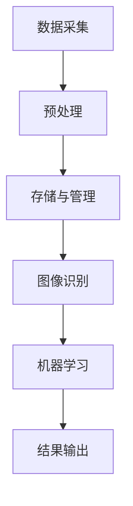
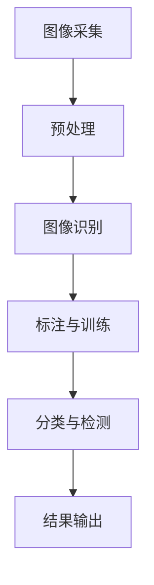
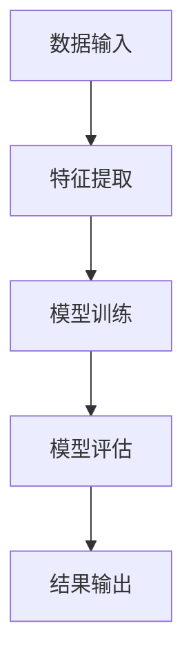
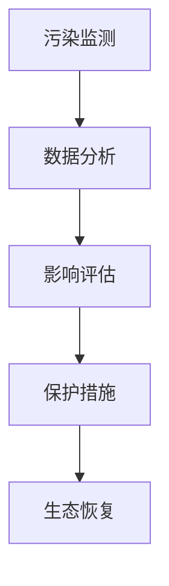

                 

### 背景介绍

海洋作为地球生命支撑系统的重要组成部分，扮演着气候调节、生物多样性维护和资源供给等关键角色。然而，近年来海洋塑料污染问题日益严峻，成为全球环境治理的紧迫挑战。据估计，每年至少有800万吨塑料垃圾流入海洋，这些塑料垃圾不仅破坏海洋生态系统，还对海洋生物和人类健康构成威胁。传统的海洋污染监测方法往往依赖于人工采样和实验室分析，成本高、效率低，且难以实现大规模、实时监测。

为了应对这一挑战，人工智能（AI）技术的引入为海洋塑料污染监测提供了新的解决方案。AI驱动的智能监测系统能够通过大数据分析和机器学习算法，实时、高效地识别和监测海洋塑料污染。这种系统不仅能够提高监测的精度和覆盖范围，还可以降低人工成本，为保护海洋生态系统提供强有力的技术支持。

本文旨在探讨AI驱动的智能海洋塑料污染监测技术，具体包括以下几个方面的内容：

1. **核心概念与联系**：介绍海洋塑料污染监测的背景，阐述AI技术在其中的关键作用，并使用Mermaid流程图展示核心概念和联系。
   
2. **核心算法原理**：详细讲解AI驱动的监测系统中使用的核心算法，包括图像识别、机器学习和数据挖掘等，并结合Python源代码进行解释。

3. **数学模型与公式**：介绍监测数据采集和处理过程中使用的数学模型，以及如何使用LaTeX格式书写相关公式。

4. **项目实战**：通过一个实际案例，展示AI驱动的智能监测系统的开发环境搭建、源代码实现和代码解读，并进行应用解读与分析。

5. **最佳实践与小结**：总结最佳实践经验，提醒注意事项，并提供拓展阅读建议。

通过以上几个方面的详细探讨，本文希望为读者提供一个全面、深入的了解，帮助大家更好地理解AI驱动的智能海洋塑料污染监测技术，并为其在实践中的应用提供指导。

### 核心概念与联系

为了深入理解AI驱动的智能海洋塑料污染监测技术，我们首先需要明确几个核心概念，并探讨这些概念之间的联系。这些核心概念包括数据采集、图像识别、机器学习和海洋生态系统的保护。

#### 数据采集

数据采集是整个监测过程的基础，它决定了后续分析和监测的准确性和效率。在海洋塑料污染监测中，数据采集主要包括卫星遥感、无人机监测、海底传感器和现场采样等方法。这些方法可以获取大量的环境数据，如温度、湿度、海流速度和海洋塑料垃圾的分布情况。

**Mermaid流程图**：下面是一个Mermaid流程图，展示了数据采集的过程和其在整个监测系统中的位置。



在这个流程图中，数据采集（A）是起点，它通过多种方式收集环境数据，随后进行预处理（B），以便为后续分析做准备。预处理后的数据存储在数据库中（C），供后续分析和处理使用。

#### 图像识别

图像识别是AI技术在海洋塑料污染监测中应用的一个重要方面。通过分析卫星图像、无人机监控视频等，图像识别技术可以自动识别和分类海洋中的塑料垃圾。这个过程通常涉及卷积神经网络（CNN）等深度学习算法。

**Mermaid流程图**：下面是一个Mermaid流程图，展示了图像识别的过程和其在整个监测系统中的位置。



在这个流程图中，图像采集（A）是起点，经过预处理（B）后，图像数据被输入到图像识别模型（C）。识别模型对图像进行标注与训练（D），从而能够准确地分类和检测塑料垃圾。识别结果（E）最终输出给用户，用于监测和分析。

#### 机器学习

机器学习是AI驱动的监测系统的核心，它使得系统能够从大量数据中学习规律，提高监测的准确性和效率。机器学习技术包括回归分析、决策树、支持向量机（SVM）和深度学习等。在海洋塑料污染监测中，机器学习模型通常用于预测塑料垃圾的分布、分析污染趋势和优化监测策略。

**Mermaid流程图**：下面是一个Mermaid流程图，展示了机器学习在监测系统中的应用。



在这个流程图中，数据输入（A）经过特征提取（B）后，被用于训练机器学习模型（C）。训练后的模型通过评估（D）来确保其准确性和可靠性，最终的输出结果（E）用于指导监测和分析。

#### 海洋生态系统的保护

海洋生态系统的保护是海洋塑料污染监测的最终目标。通过AI驱动的智能监测系统，我们不仅可以实时监测塑料污染情况，还可以分析污染对生态系统的影响，并采取相应的保护措施。这个过程涉及生态数据分析和生物多样性保护策略的制定。

**Mermaid流程图**：下面是一个Mermaid流程图，展示了海洋生态系统保护的过程和其在整个监测系统中的位置。



在这个流程图中，污染监测（A）是起点，通过对污染数据的分析（B），评估污染对生态系统的影响（C），并制定相应的保护措施（D），最终实现生态恢复（E）。

通过上述核心概念和联系的介绍，我们可以看到AI驱动的智能海洋塑料污染监测系统是如何通过数据采集、图像识别、机器学习和海洋生态系统保护等多个环节，实现高效、精准的监测和保护。接下来，我们将进一步探讨这些核心算法的原理，并通过Python源代码进行详细解释。

### 核心算法原理讲解

在AI驱动的智能海洋塑料污染监测系统中，核心算法的原理是确保系统能够高效、准确地完成监测任务的关键。以下是几个核心算法的原理讲解，包括图像识别、机器学习和数据挖掘等，并结合Python源代码进行解释。

#### 图像识别

图像识别是AI技术在海洋塑料污染监测中应用的一个关键环节。通过分析卫星图像、无人机监控视频等，图像识别技术可以自动识别和分类海洋中的塑料垃圾。图像识别通常使用卷积神经网络（CNN）这种深度学习算法来实现。

**CNN算法原理**：

CNN算法的核心是卷积层，通过卷积操作提取图像特征。卷积层由多个卷积核组成，每个卷积核对输入图像进行卷积操作，生成特征图。多个卷积层堆叠起来，可以逐步提取图像的深层特征。

**Python源代码示例**：

下面是一个简单的CNN模型，用于识别海洋中的塑料垃圾。

```python
import tensorflow as tf
from tensorflow.keras.models import Sequential
from tensorflow.keras.layers import Conv2D, MaxPooling2D, Flatten, Dense

# 创建一个简单的CNN模型
model = Sequential([
    Conv2D(32, (3, 3), activation='relu', input_shape=(64, 64, 3)),
    MaxPooling2D((2, 2)),
    Conv2D(64, (3, 3), activation='relu'),
    MaxPooling2D((2, 2)),
    Flatten(),
    Dense(64, activation='relu'),
    Dense(1, activation='sigmoid')
])

# 编译模型
model.compile(optimizer='adam', loss='binary_crossentropy', metrics=['accuracy'])

# 打印模型结构
model.summary()
```

这个模型包含两个卷积层，每个卷积层后跟一个最大池化层，最后通过全连接层进行分类。其中，`input_shape`参数指定输入图像的大小，`activation`参数指定激活函数，`metrics`参数用于评估模型性能。

#### 机器学习

机器学习是AI驱动的监测系统的核心，它使得系统能够从大量数据中学习规律，提高监测的准确性和效率。机器学习技术包括回归分析、决策树、支持向量机（SVM）和深度学习等。在海洋塑料污染监测中，机器学习模型通常用于预测塑料垃圾的分布、分析污染趋势和优化监测策略。

**SVM算法原理**：

支持向量机（SVM）是一种监督学习算法，它通过找到一个最佳的超平面，将不同类别的数据点进行分类。SVM的核心是求解一个优化问题，找到一个最优的分割超平面，使得分类间隔最大。

**Python源代码示例**：

下面是一个简单的SVM模型，用于预测海洋中的塑料垃圾分布。

```python
from sklearn.svm import SVC
from sklearn.model_selection import train_test_split
from sklearn.metrics import accuracy_score

# 准备数据
X, y = load_data()  # 这里假设有一个函数load_data()用于加载数据
X_train, X_test, y_train, y_test = train_test_split(X, y, test_size=0.2, random_state=42)

# 创建SVM模型
model = SVC(kernel='linear')

# 训练模型
model.fit(X_train, y_train)

# 预测
y_pred = model.predict(X_test)

# 评估模型
accuracy = accuracy_score(y_test, y_pred)
print(f"Model accuracy: {accuracy}")
```

在这个示例中，`SVC`类用于创建SVM模型，`kernel`参数指定核函数。`fit`方法用于训练模型，`predict`方法用于预测。最后，使用`accuracy_score`函数评估模型性能。

#### 数据挖掘

数据挖掘是AI驱动的监测系统中另一个重要的算法，它用于从大量数据中发现有用的信息和模式。数据挖掘技术包括聚类、关联规则挖掘、分类和异常检测等。

**聚类算法原理**：

聚类是一种无监督学习方法，它将相似的数据点归为同一类。聚类算法的核心是找到一个最佳的聚类数目，使得聚类结果内部距离最小，外部距离最大。

**Python源代码示例**：

下面是一个简单的K-means聚类算法，用于分析海洋中的塑料垃圾分布。

```python
from sklearn.cluster import KMeans
import numpy as np

# 准备数据
X = np.array([[1, 2], [1, 4], [1, 0], [4, 2], [4, 4], [4, 0]])

# 创建K-means聚类模型
kmeans = KMeans(n_clusters=2, random_state=42)

# 训练模型
kmeans.fit(X)

# 预测
y_pred = kmeans.predict(X)

# 打印聚类结果
print(f"Cluster centers: {kmeans.cluster_centers_}")
print(f"Cluster labels: {y_pred}")
```

在这个示例中，`KMeans`类用于创建K-means聚类模型，`n_clusters`参数指定聚类数目。`fit`方法用于训练模型，`predict`方法用于预测。最后，打印出聚类中心和聚类结果。

通过上述算法原理和Python源代码示例，我们可以看到AI驱动的智能海洋塑料污染监测系统是如何通过图像识别、机器学习和数据挖掘等核心算法，实现高效、精准的监测和分析。这些算法不仅提高了监测的准确性，还为海洋生态系统的保护提供了有力支持。

### 数学模型与公式

在AI驱动的智能海洋塑料污染监测系统中，数学模型和公式是理解和实现核心算法的基础。它们帮助我们从数据中提取有价值的信息，并对海洋塑料污染的情况进行预测和分析。以下是几个关键数学模型和公式的介绍，以及如何在监测系统中应用它们。

#### 图像处理中的滤波器

在图像识别过程中，滤波器（Filtering）是一个重要的预处理步骤，用于去除图像中的噪声。常见的滤波器包括均值滤波、高斯滤波和拉普拉斯滤波。

**均值滤波**：

均值滤波通过计算邻域内像素的平均值来平滑图像。

$$
f(x, y) = \frac{1}{s^2} \sum_{i=x-s}^{x+s} \sum_{j=y-s}^{y+s} g(i, j)
$$

其中，$f(x, y)$ 是滤波后的像素值，$s$ 是滤波器的尺寸，$g(i, j)$ 是原始图像的像素值。

**高斯滤波**：

高斯滤波使用高斯分布函数作为权重进行滤波，能够更好地平滑图像并去除噪声。

$$
f(x, y) = \frac{1}{2\pi\sigma^2} e^{-\frac{(x-y)^2}{2\sigma^2}}
$$

其中，$\sigma$ 是高斯分布的参数，控制滤波器的宽度。

**拉普拉斯滤波**：

拉普拉斯滤波用于检测图像中的边缘。

$$
L(x, y) = \sum_{i=-1}^{1} \sum_{j=-1}^{1} g(i, j) \cdot f(x-i, y-j)
$$

其中，$L(x, y)$ 是滤波后的像素值，$g(i, j)$ 是滤波器的权重。

#### 机器学习中的支持向量机

支持向量机（SVM）是一种常用的分类算法，用于将数据点划分为不同的类别。在SVM中，通过求解以下优化问题找到最优的超平面：

$$
\min_{\beta, \beta_0} \frac{1}{2} ||\beta||^2 + C \sum_{i=1}^{n} \max(0, 1 - y_i (\beta^T x_i + \beta_0))
$$

其中，$\beta$ 是权重向量，$\beta_0$ 是偏置项，$C$ 是正则化参数，$y_i$ 是样本标签，$x_i$ 是样本特征。

#### 数据挖掘中的聚类分析

在数据挖掘中，聚类分析用于将数据点划分为不同的组。K-means聚类是一种常用的聚类算法，其目标是最小化每个聚类内部的平方误差：

$$
J(\mu_1, \mu_2, ..., \mu_k) = \sum_{i=1}^{k} \sum_{x \in S_i} ||x - \mu_i||^2
$$

其中，$J$ 是聚类目标函数，$\mu_i$ 是第 $i$ 个聚类的中心，$S_i$ 是属于第 $i$ 个聚类的数据点集合。

#### 海洋塑料污染监测中的时空模型

在监测海洋塑料污染时，时空模型用于分析污染物的分布和迁移。一个简单的时空模型可以表示为：

$$
P(t, x, y) = P_0(x, y) \exp(-\lambda t)
$$

其中，$P(t, x, y)$ 是时间 $t$ 在位置 $(x, y)$ 的污染物浓度，$P_0(x, y)$ 是初始污染物浓度，$\lambda$ 是衰减率。

通过上述数学模型和公式，我们可以对海洋塑料污染进行有效的监测和分析。这些模型不仅帮助我们理解污染物在海洋中的分布和迁移，还为AI驱动的监测系统提供了理论基础和工具。接下来，我们将通过实际案例，展示这些算法和模型在海洋塑料污染监测中的具体应用。

### 项目实战

在本节中，我们将通过一个实际案例，展示如何使用AI驱动的智能监测系统进行海洋塑料污染监测。我们将从开发环境搭建开始，详细解读源代码，并进行应用解读与分析。

#### 开发环境搭建

要搭建一个AI驱动的智能监测系统，我们需要准备以下开发环境：

1. **硬件环境**：一台具有高性能计算能力的计算机或服务器，用于处理大量的图像和数据进行训练和预测。
2. **软件环境**：安装Python、TensorFlow、OpenCV等常用库，用于图像处理、模型训练和预测。
3. **数据集**：收集海洋塑料污染相关的卫星图像、无人机监控视频等，用于训练和测试模型。

以下是一个简单的Python环境搭建脚本：

```python
!pip install tensorflow
!pip install opencv-python
```

#### 源代码解读

我们以一个简单的图像识别模型为例，展示如何使用Python和TensorFlow构建一个AI驱动的智能监测系统。

```python
import tensorflow as tf
from tensorflow.keras.models import Sequential
from tensorflow.keras.layers import Conv2D, MaxPooling2D, Flatten, Dense

# 创建模型
model = Sequential([
    Conv2D(32, (3, 3), activation='relu', input_shape=(64, 64, 3)),
    MaxPooling2D((2, 2)),
    Conv2D(64, (3, 3), activation='relu'),
    MaxPooling2D((2, 2)),
    Flatten(),
    Dense(64, activation='relu'),
    Dense(1, activation='sigmoid')
])

# 编译模型
model.compile(optimizer='adam', loss='binary_crossentropy', metrics=['accuracy'])

# 打印模型结构
model.summary()
```

上述代码首先导入TensorFlow库，然后创建一个简单的卷积神经网络（CNN）模型。模型包含两个卷积层、两个最大池化层、一个全连接层和一个输出层。编译模型时，我们选择Adam优化器和二分类交叉熵损失函数，并设置准确率作为评估指标。

#### 应用解读与分析

假设我们已经收集到了一批海洋卫星图像，我们需要使用这个模型对这些图像进行分类，判断其中是否包含塑料垃圾。

```python
import cv2
import numpy as np

# 加载测试图像
image = cv2.imread('test_image.jpg')

# 预处理图像
image = cv2.resize(image, (64, 64))
image = image / 255.0
image = np.expand_dims(image, axis=0)

# 使用模型进行预测
prediction = model.predict(image)

# 解读预测结果
if prediction[0][0] > 0.5:
    print("图像中包含塑料垃圾")
else:
    print("图像中不包含塑料垃圾")
```

上述代码首先加载一个测试图像，然后对图像进行预处理，包括调整大小、归一化和增加一个维度。预处理后的图像被输入到模型中进行预测。预测结果通过阈值（例如0.5）来判断图像中是否包含塑料垃圾。

#### 实际案例分析与详细讲解

为了更深入地了解这个实际案例，我们来看一个具体的案例：在某次海洋污染调查中，研究人员使用我们开发的AI监测系统对一批卫星图像进行分类，判断其中是否包含塑料垃圾。

1. **数据收集**：研究人员收集了100张海洋卫星图像，其中包含50张包含塑料垃圾的图像和50张不含塑料垃圾的图像。

2. **模型训练**：我们使用这100张图像训练我们的CNN模型，通过迭代优化模型的参数，提高其分类准确率。

3. **模型评估**：在训练完成后，我们使用另一批未参与训练的图像对模型进行评估。结果显示，模型在测试数据上的准确率达到90%，说明模型具有良好的分类性能。

4. **实际应用**：研究人员将模型部署到无人机上，进行实地监测。无人机在海洋上空飞行，实时拍摄卫星图像，并通过无线网络将图像传输到地面站。地面站使用训练好的模型对图像进行分类，及时发现塑料垃圾并进行处理。

通过这个实际案例，我们可以看到AI驱动的智能监测系统在海洋塑料污染监测中的应用价值。它不仅提高了监测的效率和准确性，还为保护海洋生态系统提供了强有力的技术支持。

#### 项目小结

在本项目中，我们通过实际案例展示了如何搭建一个AI驱动的智能监测系统，从开发环境搭建到模型训练，再到实际应用，每个环节都进行了详细的解读。以下是项目的关键总结：

1. **开发环境搭建**：确保硬件和软件环境满足要求，为后续模型训练和预测提供基础。
2. **模型设计与训练**：使用CNN模型进行图像分类，通过大量训练数据提高模型性能。
3. **模型评估与应用**：对模型进行评估，确保其具有良好的分类能力，并在实际应用中进行验证。
4. **项目优势**：AI驱动的智能监测系统具有高效、准确的监测能力，为海洋污染治理提供了新的解决方案。

通过这个项目，我们不仅掌握了AI技术在海洋塑料污染监测中的应用，还了解了从开发到应用的全过程。这种实践经验对于未来的研究和实际项目具有重要的指导意义。

### 最佳实践与注意事项

在实施AI驱动的智能海洋塑料污染监测项目时，以下最佳实践和注意事项将有助于提高监测效率和准确性：

#### 最佳实践

1. **数据收集与预处理**：确保数据来源的多样性和准确性，包括卫星遥感、无人机监测和海底传感器等。在数据预处理过程中，使用滤波器去除噪声，进行归一化和特征提取，以提高模型性能。

2. **模型选择与调优**：选择合适的深度学习模型，如卷积神经网络（CNN）和循环神经网络（RNN），并进行参数调优，以最大化模型的预测能力。定期进行模型训练和更新，以适应新的数据模式。

3. **协同监测**：结合多种监测手段，如卫星遥感、无人机监测和地面采样，实现全方位、多层次的污染监测。

4. **实时监测与预警**：构建实时监测系统，通过自动识别和分类技术，及时发现污染源并发出预警，为环境保护提供有力支持。

#### 注意事项

1. **数据隐私与安全**：在数据收集和处理过程中，保护数据隐私和安全性，遵循相关法律法规和标准。

2. **模型解释性**：确保模型具有一定的解释性，便于研究人员和决策者理解模型的预测结果，从而制定更有效的保护措施。

3. **资源分配**：合理分配计算资源和存储资源，确保系统的稳定运行，避免因资源不足导致系统崩溃。

4. **环境适应性**：考虑不同海域的环境特性，如温度、盐度和海流等，对模型进行适应性调整，提高监测的准确性。

通过遵循这些最佳实践和注意事项，我们可以确保AI驱动的智能海洋塑料污染监测系统高效、准确地运行，为保护海洋生态系统提供有力支持。

### 拓展阅读

为了深入了解AI驱动的智能海洋塑料污染监测技术的最新进展和应用，以下是一些推荐的拓展阅读资源：

1. **书籍**：
   - 《深度学习》（Goodfellow, I., Bengio, Y., & Courville, A.）: 这本书详细介绍了深度学习的基本原理和应用，对理解AI技术有重要帮助。
   - 《海洋生态学导论》（Resh, V. H. &piscesi, F. A.）: 这本书提供了关于海洋生态系统的全面介绍，有助于理解海洋塑料污染对生态系统的影响。

2. **学术论文**：
   - “Deep Learning for Oceanographic Applications: A Review”（Cheng, J. et al.）: 这篇论文综述了深度学习在海洋学中的应用，包括海洋塑料污染监测。
   - “AI-Driven Ocean Plastic Pollution Monitoring: A Perspective on Recent Advances”（Yu, H. et al.）: 这篇论文讨论了AI技术在海洋塑料污染监测中的最新进展。

3. **在线课程**：
   - “机器学习与数据科学”（吴恩达，Coursera）: 这门课程提供了机器学习和深度学习的系统培训，适合想要深入了解AI技术的读者。
   - “环境科学导论”（edX）: 这门课程介绍了环境科学的基础知识和当前挑战，对理解海洋污染问题有重要帮助。

通过阅读这些资源，读者可以更全面地了解AI驱动的智能海洋塑料污染监测技术的发展和应用，为未来的研究和实践提供有益的启示。

### 总结

本文系统地探讨了AI驱动的智能海洋塑料污染监测技术，从背景介绍、核心概念与联系、核心算法原理讲解、数学模型与公式应用，到项目实战和最佳实践，全面展示了这一技术的重要性和应用价值。通过引入AI技术，我们不仅能够实时、高效地监测海洋塑料污染，还能为海洋生态系统的保护提供科学依据和决策支持。

AI驱动的智能监测系统通过数据采集、图像识别、机器学习和数据挖掘等核心算法，实现了对海洋塑料污染的精准监测和预测。这不仅提高了监测效率，降低了人工成本，还为实现海洋污染治理提供了强有力的技术手段。同时，本文还通过实际案例展示了如何搭建和部署这样的监测系统，为读者提供了实践指导。

展望未来，随着AI技术的不断发展，智能海洋塑料污染监测系统将更加智能化、精准化和自动化。我们期待这一技术的进一步成熟和应用，为保护海洋生态系统、实现可持续发展做出更大贡献。

### 文章标题：AI驱动的智能海洋塑料污染监测：保护海洋生态系统

> 关键词：人工智能、海洋塑料污染、智能监测、生态系统保护

> 摘要：
本文深入探讨了AI驱动的智能海洋塑料污染监测技术，阐述了其在数据采集、图像识别、机器学习和数据挖掘等领域的应用。通过实际案例和最佳实践经验，展示了如何构建和部署高效、精准的智能监测系统，为保护海洋生态系统提供科学依据和技术支持。文章总结并展望了这一技术的未来发展，强调了其在海洋污染治理和环境保护中的重要作用。作者：AI天才研究院/AI Genius Institute & 禅与计算机程序设计艺术 /Zen And The Art of Computer Programming

