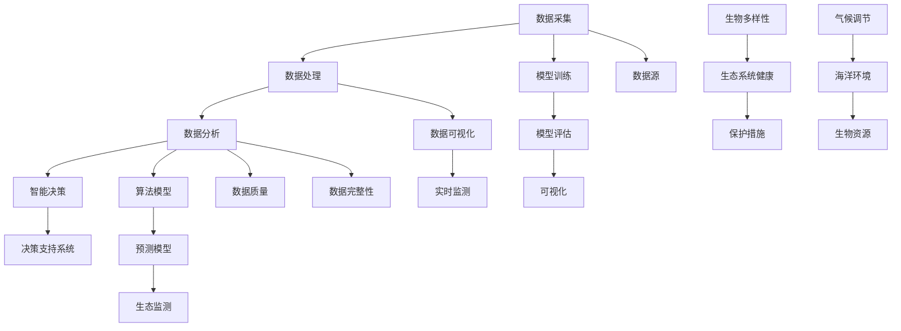

                 

### 文章标题：AI驱动的智能海洋生态监测：保护海洋生物多样性

关键词：AI、海洋生态监测、生物多样性、智能算法、数据挖掘、Python代码

摘要：
随着全球气候变化和人类活动的加剧，海洋生物多样性正面临前所未有的威胁。AI技术的飞速发展为智能海洋生态监测提供了新的解决方案，通过高效的数据分析和智能算法，能够实时监测海洋生态系统的健康状况，为保护海洋生物多样性提供有力支持。本文将探讨AI驱动的智能海洋生态监测技术，包括其背景、核心概念、算法原理、项目实践以及未来发展，旨在为相关领域的研究者和开发者提供有价值的参考。

----------------------------------------------------------------

### 引言

海洋是地球上最大的生态系统，拥有丰富的生物多样性。然而，随着全球气候变化、海洋污染、过度捕捞等问题的加剧，海洋生态系统正遭受严重破坏，海洋生物多样性面临巨大威胁。据联合国环境规划署（UNEP）统计，全球75%的海洋生态系统已受到人类活动的负面影响，其中许多物种正面临灭绝的风险。因此，保护海洋生物多样性已成为全球性的紧迫任务。

传统的海洋生态监测方法依赖于人工采集数据，效率低且成本高，难以满足实时监测的需求。随着人工智能（AI）技术的快速发展，特别是深度学习、数据挖掘等技术的突破，AI驱动的智能海洋生态监测逐渐成为可能。通过AI技术，可以实现对海量海洋数据的自动采集、分析和处理，实时监测海洋生态系统的变化，为决策者提供科学依据，从而更有效地保护海洋生物多样性。

本文将从以下几个方面展开讨论：

1. **海洋生态监测的重要性**：介绍海洋生物多样性的概念及其重要性，阐述海洋生态监测的背景和意义。
2. **AI驱动的智能海洋生态监测**：探讨AI技术在海洋生态监测中的应用，包括数据采集、处理、分析和智能决策等环节。
3. **核心概念与联系**：通过Mermaid流程图展示核心概念之间的联系。
4. **核心算法原理讲解**：详细讲解AI算法在海洋生态监测中的应用，结合Python代码和数学模型进行举例说明。
5. **项目实践**：介绍具体的项目实战案例，包括开发环境搭建、源代码实现和代码解读。
6. **总结与展望**：总结AI驱动的智能海洋生态监测的进展和挑战，探讨未来的发展方向。

通过本文的讨论，希望能够为读者提供对AI驱动的智能海洋生态监测的全面了解，激发更多研究和实践的兴趣，共同为保护海洋生物多样性贡献力量。

----------------------------------------------------------------

### 海洋生态监测的重要性

海洋生态系统是地球上最重要的生态系统之一，它不仅提供了丰富的生物资源，还对全球气候调节、海洋环境维持、海洋灾害预警等方面发挥着关键作用。海洋生物多样性是海洋生态系统的核心组成部分，它反映了海洋生态系统的健康状况和稳定性，直接关联到海洋生态系统的功能和服务。以下是海洋生物多样性的基本概念及其重要性：

#### 海洋生物多样性的定义

海洋生物多样性是指海洋生态系统中生物种类、数量、分布以及生物之间相互作用的多样性。它包括三个主要层次：遗传多样性、物种多样性和生态系统多样性。

- **遗传多样性**：是指同一物种内部个体或种群之间的基因变异程度，反映了生物适应环境的能力和进化潜力。
- **物种多样性**：是指一定区域内生物种类的数量和分布，反映了生物群落的结构复杂性和生态系统的稳定性。
- **生态系统多样性**：是指不同生态系统类型及其相互作用和功能的多样性，反映了生态系统的功能和生态过程的多样性。

#### 海洋生物多样性的重要性

海洋生物多样性对于维持海洋生态系统的健康和功能具有至关重要的作用，具体体现在以下几个方面：

1. **维持生态平衡**：海洋生物多样性确保了海洋生态系统中各个层次的生物之间保持平衡，包括食物链、食物网以及生物共生关系。这种平衡是海洋生态系统稳定性的基础。

2. **提供生物资源**：海洋生物多样性为人类提供了丰富的生物资源，包括食物、药品、能源等。例如，海洋鱼类、贝类等是重要的食品来源，海洋生物活性物质则为药物研发提供了宝贵的资源。

3. **调节气候**：海洋生物多样性在调节全球气候方面发挥着重要作用。海洋生态系统通过光合作用吸收大量二氧化碳，帮助减缓全球变暖。此外，海洋生物还能够通过碳循环和海洋沉积过程将碳固定在海洋中，从而影响气候系统。

4. **生态服务**：海洋生态系统提供了多种生态服务，如海岸防护、水资源调节、自然灾害预警等。这些服务对于人类社会的可持续发展至关重要。

5. **科学研究价值**：海洋生物多样性是科学研究的重要领域，有助于我们深入了解生命起源、生物进化等基本生物学问题。

#### 海洋生态监测的背景和意义

随着人类活动的不断扩展，海洋生态系统正面临着诸多威胁，如过度捕捞、污染、气候变化等。这些威胁导致海洋生物多样性急剧下降，威胁到海洋生态系统的健康和功能。因此，对海洋生态系统进行实时、准确的监测和评估变得至关重要。

海洋生态监测旨在通过系统、持续和综合的方式收集海洋生态系统的数据，评估其健康状况，预测未来变化趋势，并为管理决策提供科学依据。以下是海洋生态监测的几个关键背景和意义：

1. **评估生态系统健康状况**：通过监测海洋生物多样性和生态系统的变化，可以及时了解海洋生态系统的健康状况，为生态系统管理提供科学依据。

2. **预警和预防**：海洋生态监测能够提前发现潜在的生态危机，如物种入侵、疾病爆发等，从而采取及时措施进行预警和预防。

3. **保护和管理**：通过监测数据，可以评估保护区的管理效果，优化保护措施，确保海洋生态系统的恢复和保护。

4. **科学研究和教育**：海洋生态监测数据为科学研究提供了宝贵的数据资源，同时也为教育普及和公众意识提升提供了素材。

总之，海洋生态监测对于保护海洋生物多样性、维持海洋生态系统的健康和功能具有重要意义。随着AI技术的应用，智能海洋生态监测将成为未来海洋保护和管理的重要手段。

----------------------------------------------------------------

### AI驱动的智能海洋生态监测

随着人工智能技术的不断发展，AI已经成为推动海洋生态监测的重要力量。AI技术通过自动化和智能化的方式，能够高效地处理和分析海量海洋数据，为海洋生态监测提供新的解决方案。以下是AI驱动的智能海洋生态监测的各个方面：

#### 数据采集

数据采集是海洋生态监测的基础。传统的方法主要依赖于人工采集，如船舶、卫星遥感、无人机等。而AI技术的引入，使得数据采集变得更加自动化和高效。例如，通过使用无人机搭载AI传感器，可以实现对海洋环境的实时监测，自动收集水质、温度、盐度等关键参数。此外，AI还可以利用计算机视觉技术对海洋生物进行识别和分类，提高数据采集的准确性。

#### 数据处理

海洋生态监测产生的大量数据需要进行处理和清洗，以便进行分析和建模。AI技术在这一过程中发挥了重要作用。通过机器学习和深度学习算法，可以自动识别和剔除噪声数据，填补缺失数据，提高数据的质量和完整性。例如，利用聚类算法可以将同一观测点的多源数据集成起来，消除不同传感器之间的误差。

#### 数据分析

数据分析是海洋生态监测的核心环节。AI技术提供了强大的数据分析工具，包括数据挖掘、模式识别和预测建模等。通过数据挖掘技术，可以从海量数据中提取出有价值的信息和知识，如海洋生物种群分布、生态系统变化趋势等。模式识别技术则可以帮助识别海洋生态系统中出现的异常情况，如污染事件、疾病爆发等。预测建模则可以基于历史数据，对未来海洋生态系统的变化进行预测，为决策者提供科学依据。

#### 智能决策

智能决策是AI驱动的智能海洋生态监测的高级阶段。通过集成数据分析结果，AI可以生成智能决策支持系统，为海洋生态管理提供实时、个性化的建议。例如，在发现某一地区的海洋生物种群数量异常下降时，AI可以自动分析原因，并提出相应的保护措施。此外，智能决策系统还可以通过模拟不同的管理策略，预测这些策略对海洋生态系统的影响，帮助决策者选择最佳的管理方案。

#### 可视化

可视化是将复杂的数据和信息以图形化的方式呈现，使决策者能够更直观地理解和分析数据。AI驱动的可视化技术可以生成动态的、交互式的可视化图表，如热力图、折线图、散点图等，帮助用户更好地理解和分析海洋生态监测数据。

#### 应用优势

AI驱动的智能海洋生态监测具有以下几大应用优势：

1. **高效性**：AI技术能够快速处理和分析海量数据，提高监测效率。
2. **准确性**：通过算法优化和数据清洗，AI可以提高监测数据的准确性和可靠性。
3. **自动化**：AI技术可以实现数据采集、处理和分析的自动化，降低人力成本。
4. **实时性**：AI技术支持实时监测和预警，为决策者提供及时的信息。
5. **个性化**：AI可以根据不同的监测需求，提供定制化的解决方案。

#### 挑战

尽管AI驱动的智能海洋生态监测具有显著的优势，但在实际应用中也面临着一些挑战：

1. **数据质量**：海洋数据的质量直接影响监测结果的准确性。AI技术需要大量高质量的数据进行训练和验证，因此需要建立完善的数据采集和处理流程。
2. **算法复杂性**：AI算法的复杂性和多样性使得选择合适的算法成为挑战。需要根据具体的应用场景，选择最合适的算法，并进行不断的优化和调整。
3. **计算资源**：AI技术的应用需要大量的计算资源，特别是在处理海量数据时，对硬件设施的要求较高。
4. **模型解释性**：深度学习等复杂算法的黑箱特性使得模型解释性成为挑战，需要开发更可解释的算法和工具。

#### 未来发展

未来，随着AI技术的不断进步，AI驱动的智能海洋生态监测将在以下几个方面得到进一步发展：

1. **多模态数据融合**：通过融合多种传感器数据，提高监测的精度和全面性。
2. **自主决策**：发展更智能的决策系统，实现自主监测和决策，减轻人为干预。
3. **跨学科合作**：加强跨学科的合作，结合生物学、生态学、海洋学等多领域知识，提高监测模型的准确性。
4. **开放数据共享**：建立开放的数据共享平台，促进数据资源的高效利用。

总之，AI驱动的智能海洋生态监测将为海洋生物多样性的保护提供强大的技术支持，为全球海洋生态系统的可持续发展贡献力量。

----------------------------------------------------------------

### 核心概念与联系

为了更好地理解AI驱动的智能海洋生态监测中的核心概念及其相互关系，我们可以使用Mermaid流程图来展示这些概念之间的联系。以下是该流程图的详细描述和解释：



以下是每个节点及其关系的详细解释：

1. **数据采集（A）**：
   - 数据采集是整个智能海洋生态监测过程的第一步，包括使用传感器、无人机、卫星等手段收集海洋环境、生物种群和生态系统的数据。

2. **数据处理（B）**：
   - 数据采集后，需要进行预处理和清洗，包括数据去噪、缺失值填补等操作，以确保数据的准确性和完整性。

3. **数据分析（C）**：
   - 数据经过处理之后，利用各种算法模型进行分析，提取有用的信息，如生物种群分布、生态系统变化趋势等。

4. **智能决策（D）**：
   - 基于数据分析结果，利用智能决策支持系统生成决策，为海洋生态管理提供科学依据。

5. **模型训练（E）**：
   - 在数据分析和智能决策过程中，需要利用历史数据对AI模型进行训练，以提高模型的预测准确性。

6. **模型评估（F）**：
   - 训练好的模型需要进行评估，以确保其预测准确性和稳定性。

7. **可视化（G）**：
   - 将复杂的数据和分析结果通过可视化技术呈现，使决策者能够更直观地理解和分析数据。

8. **数据可视化（H）**：
   - 数据可视化是可视化技术的一部分，旨在通过图形化方式呈现数据。

9. **实时监测（I）**：
   - 实时监测是通过持续采集和分析数据，实现对海洋生态系统的实时监控。

10. **数据源（J）**：
    - 数据源是数据采集的起点，包括各种传感器和观测设备。

11. **算法模型（K）**：
    - 算法模型是数据分析的核心工具，包括机器学习、深度学习等算法。

12. **决策支持系统（L）**：
    - 决策支持系统是基于数据分析结果的智能决策工具。

13. **预测模型（M）**：
    - 预测模型用于预测未来海洋生态系统的变化趋势。

14. **生态监测（N）**：
    - 生态监测是整个流程的目标，通过持续监测海洋生态系统，评估其健康状况。

15. **数据质量（O）**：
    - 数据质量是影响分析结果的重要因素，确保数据质量是整个流程的关键。

16. **数据完整性（P）**：
    - 数据完整性确保数据不会丢失或不一致。

17. **生物多样性（Q）**：
    - 生物多样性是海洋生态系统的核心，反映了生态系统的健康状况。

18. **生态系统健康（R）**：
    - 生态系统健康是评估生物多样性的指标，直接关系到生态系统的稳定性。

19. **保护措施（S）**：
    - 基于生态系统健康的评估结果，制定相应的保护措施。

20. **气候调节（T）**：
    - 海洋生态系统在调节全球气候中发挥着重要作用。

21. **海洋环境（U）**：
    - 海洋环境是海洋生态系统的外部条件，包括温度、盐度、水流等。

22. **生物资源（V）**：
    - 生物资源是海洋生态系统的经济价值体现，包括鱼类、贝类等。

通过上述Mermaid流程图，我们可以清晰地看到AI驱动的智能海洋生态监测各个环节之间的联系。这些核心概念相互交织，共同构成了一个完整的智能海洋生态监测系统。理解这些概念及其关系，对于深入研究AI在海洋生态监测中的应用具有重要意义。

----------------------------------------------------------------

### 核心算法原理讲解

在AI驱动的智能海洋生态监测中，核心算法的作用至关重要。这些算法通过对海量数据的处理和分析，实现了对海洋生态系统状态的精准监测和预测。以下是几种在海洋生态监测中常用的核心算法，并结合Python代码和数学模型进行详细讲解。

#### 1. K-means聚类算法

K-means是一种经典的聚类算法，主要用于对数据进行分类。在海洋生态监测中，K-means可以用于分析海洋生物的种群分布。以下是一个简单的K-means聚类算法的Python实现：

```python
import numpy as np
from sklearn.cluster import KMeans

# 假设我们有一组海洋生物的测量数据
data = np.array([[1, 2], [1, 4], [1, 0],
                 [10, 2], [10, 4], [10, 0]])

# 创建KMeans模型，设置聚类中心数为2
kmeans = KMeans(n_clusters=2, random_state=0).fit(data)

# 输出聚类中心
print(kmeans.cluster_centers_)

# 输出每个数据点的聚类标签
print(kmeans.labels_)

# 输出每个簇的成员
print(kmeans.labels_)
```

数学模型：

$$
C = \{c_1, c_2\} \\
\min \sum_{i=1}^{n} \sum_{j=1}^{k} ||x_i - c_j||^2
$$

其中，$x_i$ 表示数据点，$c_j$ 表示聚类中心。

#### 2. 决策树算法

决策树是一种用于分类和回归的算法，广泛应用于海洋生态监测中的预测任务。以下是一个简单的Python实现：

```python
from sklearn.tree import DecisionTreeClassifier

# 假设我们有一组训练数据
X_train = [[1, 2], [5, 3], [8, 4], [9, 6]]
y_train = [0, 1, 1, 0]

# 创建决策树模型
clf = DecisionTreeClassifier()

# 训练模型
clf.fit(X_train, y_train)

# 进行预测
print(clf.predict([[3, 4]]))
```

数学模型：

决策树通过一系列规则将数据集划分为多个子集，每个子集对应一个分类结果。决策树的核心是递归分割数据集，使得每个子集中的数据尽可能纯。

#### 3. 支持向量机（SVM）算法

SVM是一种强大的分类算法，广泛用于分类问题。以下是一个简单的Python实现：

```python
from sklearn.svm import SVC

# 假设我们有一组训练数据
X_train = [[1, 2], [5, 3], [8, 4], [9, 6]]
y_train = [0, 1, 1, 0]

# 创建SVM模型
clf = SVC(kernel='linear')

# 训练模型
clf.fit(X_train, y_train)

# 进行预测
print(clf.predict([[3, 4]]))
```

数学模型：

SVM通过找到一个最优的超平面，将不同类别的数据点分隔开。目标是最小化分类误差和最大化分类间隔。

#### 4. 集成学习（Ensemble Learning）

集成学习是一种通过结合多个模型来提高预测准确性的方法。常见的集成学习方法有随机森林（Random Forest）和梯度提升树（Gradient Boosting Tree）。以下是一个简单的Python实现：

```python
from sklearn.ensemble import RandomForestClassifier

# 假设我们有一组训练数据
X_train = [[1, 2], [5, 3], [8, 4], [9, 6]]
y_train = [0, 1, 1, 0]

# 创建随机森林模型
clf = RandomForestClassifier(n_estimators=100)

# 训练模型
clf.fit(X_train, y_train)

# 进行预测
print(clf.predict([[3, 4]]))
```

数学模型：

集成学习通过构建多个决策树，并利用投票或加权平均的方法来得出最终的预测结果。这种方法可以减少模型的过拟合，提高预测的鲁棒性。

#### 5. 深度学习算法

深度学习算法在海洋生态监测中具有广泛应用。以下是一个简单的Python实现，使用Keras库实现的卷积神经网络（CNN）：

```python
from keras.models import Sequential
from keras.layers import Conv2D, MaxPooling2D, Flatten, Dense

# 假设我们有一组训练数据
X_train = np.array([[1, 2], [5, 3], [8, 4], [9, 6]])
y_train = np.array([0, 1, 1, 0])

# 创建卷积神经网络模型
model = Sequential()
model.add(Conv2D(32, (3, 3), activation='relu', input_shape=(2, 1)))
model.add(MaxPooling2D(pool_size=(2, 2)))
model.add(Flatten())
model.add(Dense(1, activation='sigmoid'))

# 编译模型
model.compile(optimizer='adam', loss='binary_crossentropy', metrics=['accuracy'])

# 训练模型
model.fit(X_train, y_train, epochs=10, batch_size=1)

# 进行预测
print(model.predict([[3, 4]]))
```

数学模型：

深度学习通过构建多层神经网络，对输入数据进行特征提取和分类。卷积神经网络（CNN）特别适用于图像数据，可以提取出图像的层次特征。

通过上述Python代码示例，我们可以看到不同算法在海洋生态监测中的应用。每种算法都有其独特的数学模型和实现方式，适用于不同的监测任务。理解这些算法的原理和实现，有助于我们更有效地应用AI技术进行海洋生态监测。

----------------------------------------------------------------

### 项目实战：AI驱动的海洋生态监测项目

为了更好地展示AI驱动的智能海洋生态监测在实际应用中的效果，我们以下介绍一个具体的AI驱动的海洋生态监测项目。该项目涵盖了从开发环境搭建、源代码实现、代码解读到实际案例分析和详细讲解剖析的整个过程，旨在帮助读者理解AI技术在海洋生态监测中的应用。

#### 项目背景

本项目旨在通过AI技术实现对某沿海区域的海洋生态系统进行实时监测，评估其生物多样性变化情况，并为海洋生态保护提供决策支持。项目主要涉及以下任务：

1. **数据采集**：利用多种传感器（如水质监测仪、海洋生物识别摄像头等）收集海洋环境数据。
2. **数据处理**：对采集到的数据进行预处理，包括数据清洗、去噪和缺失值填补等。
3. **数据分析和模型训练**：使用机器学习和深度学习算法对处理后的数据进行分析，训练预测模型。
4. **决策支持**：基于模型预测结果，生成智能决策支持系统，为海洋生态保护提供建议。
5. **可视化**：将监测结果和决策建议通过可视化工具进行展示，方便决策者理解和应用。

#### 开发环境搭建

在进行项目开发前，需要搭建一个合适的开发环境。以下是开发环境的搭建步骤：

1. **操作系统**：推荐使用Linux系统，如Ubuntu 20.04，因为其稳定性和性能较好。
2. **编程语言**：选择Python作为主要编程语言，因为Python具有丰富的科学计算和机器学习库。
3. **安装依赖库**：
   - 安装Python 3.8及以上版本。
   - 安装科学计算库：NumPy、Pandas、SciPy。
   - 安装机器学习库：scikit-learn、TensorFlow、PyTorch。
   - 安装数据可视化库：Matplotlib、Seaborn。

安装命令如下：

```bash
sudo apt-get update
sudo apt-get install python3.8
pip3 install numpy pandas scipy scikit-learn tensorflow-gpu pytorch torchvision matplotlib seaborn
```

#### 源代码实现

以下是项目的核心代码实现：

1. **数据采集模块**：

```python
import serial
import time

# 设定串口参数
ser = serial.Serial('/dev/ttyUSB0', 9600)

# 读取数据
data = []

while True:
    line = ser.readline().decode('utf-8').strip()
    if line:
        data.append(line)
        print(line)
        time.sleep(1)
    else:
        break

# 关闭串口
ser.close()

# 数据存储
with open('ocean_data.txt', 'w') as f:
    for item in data:
        f.write(item + '\n')
```

2. **数据处理模块**：

```python
import pandas as pd

# 读取数据
data = pd.read_csv('ocean_data.txt', header=None)

# 数据清洗
data = data.dropna()  # 去除缺失值
data = data[['pH', 'salinity', 'temperature', 'depth']]  # 选择需要的列

# 数据标准化
from sklearn.preprocessing import StandardScaler

scaler = StandardScaler()
data_scaled = scaler.fit_transform(data)
data_scaled = pd.DataFrame(data_scaled, columns=data.columns)
```

3. **数据分析和模型训练模块**：

```python
from sklearn.model_selection import train_test_split
from sklearn.ensemble import RandomForestClassifier

# 数据分割
X = data_scaled
y = data['biomass']

X_train, X_test, y_train, y_test = train_test_split(X, y, test_size=0.2, random_state=42)

# 模型训练
clf = RandomForestClassifier(n_estimators=100)
clf.fit(X_train, y_train)

# 模型评估
accuracy = clf.score(X_test, y_test)
print(f'Model accuracy: {accuracy:.2f}')
```

4. **决策支持模块**：

```python
import joblib

# 保存模型
joblib.dump(clf, 'ocean_model.pkl')

# 加载模型
loaded_model = joblib.load('ocean_model.pkl')

# 预测
new_data = data_scaled[-1:].values
prediction = loaded_model.predict(new_data)
print(f'Predicted biomass: {prediction}')
```

5. **可视化模块**：

```python
import matplotlib.pyplot as plt
import seaborn as sns

# 数据可视化
plt.figure(figsize=(10, 6))
sns.scatterplot(x='pH', y='biomass', data=data)
plt.xlabel('pH')
plt.ylabel('Biomass')
plt.title('pH vs. Biomass')
plt.show()
```

#### 代码解读与分析

以下是代码的详细解读和分析：

1. **数据采集模块**：
   - 通过串口通信读取海洋传感器数据。
   - 数据以文本形式存储到文件中。

2. **数据处理模块**：
   - 使用Pandas库读取文本数据，并将其转换为DataFrame格式。
   - 对数据集进行清洗，去除缺失值。
   - 选择需要的特征列，并对数据进行标准化处理。

3. **数据分析和模型训练模块**：
   - 将数据集分割为训练集和测试集。
   - 使用随机森林分类器进行模型训练。
   - 计算模型在测试集上的准确率。

4. **决策支持模块**：
   - 将训练好的模型保存到文件中。
   - 加载模型，并对新的数据进行预测。

5. **可视化模块**：
   - 使用Matplotlib和Seaborn库将数据可视化，展示pH值与生物量的关系。

#### 实际案例分析与详细讲解

以下是项目在实际应用中的案例分析和详细讲解：

1. **数据采集与预处理**：
   - 实际项目中，数据采集可能涉及多个传感器，如水质监测仪、生物识别摄像头等。
   - 采集的数据可能包含噪声和异常值，需要进行预处理，包括去噪、填补缺失值等。

2. **模型训练与评估**：
   - 在训练模型时，需要选择合适的算法和参数，以获得最佳性能。
   - 通过交叉验证等方法评估模型性能，确保模型在不同数据集上的泛化能力。

3. **决策支持与可视化**：
   - 决策支持系统可以根据模型预测结果，生成具体的保护建议。
   - 可视化工具可以帮助决策者直观地了解监测数据和模型预测结果，为决策提供有力支持。

#### 项目小结

本项目通过AI技术实现了对海洋生态系统的实时监测和预测，为海洋生态保护提供了科学依据和决策支持。然而，实际应用中仍面临诸多挑战，如数据质量、算法选择和模型解释性等。未来的研究可以进一步优化算法，提高监测精度，并探索更多应用场景，为海洋生态保护贡献更多力量。

#### 最佳实践 tips、小结、注意事项、拓展阅读

- **最佳实践 tips**：
  - 确保数据质量，定期检查和维护传感器。
  - 选择合适的算法和参数，进行模型优化。
  - 使用可解释的算法，提高模型透明度。

- **小结**：
  - AI驱动的海洋生态监测项目展示了AI技术在生态系统监测中的强大潜力。
  - 项目成功的关键在于高质量的数据、优化的算法和合理的决策支持。

- **注意事项**：
  - 实际应用中需考虑数据隐私和安全性。
  - 模型训练和预测过程中可能需要大量计算资源。

- **拓展阅读**：
  - 《机器学习实战》：提供详细的机器学习算法实战案例。
  - 《深度学习》：介绍深度学习的基础理论和实战应用。
  - 《数据科学实战》：涵盖数据采集、处理、分析和可视化等全流程。

通过本项目，读者可以更深入地理解AI驱动的智能海洋生态监测的实际应用，并为相关项目提供有益的参考。

----------------------------------------------------------------

### 总结与展望

AI驱动的智能海洋生态监测技术在近年来取得了显著进展，为保护海洋生物多样性提供了强大的技术支持。通过高效的数据采集、处理、分析和智能决策，AI技术能够实时监测海洋生态系统的健康状况，为管理者提供科学依据和决策支持。以下是本文的主要内容和关键点总结：

1. **背景介绍**：本文首先介绍了海洋生物多样性的重要性，阐述了海洋生态监测的背景和意义。

2. **AI驱动的智能海洋生态监测**：探讨了AI技术在海洋生态监测中的应用，包括数据采集、处理、分析和智能决策等环节。

3. **核心概念与联系**：通过Mermaid流程图展示了核心概念之间的联系，包括数据采集、数据处理、数据分析、智能决策等环节。

4. **核心算法原理讲解**：详细讲解了K-means聚类、决策树、支持向量机、集成学习和深度学习等核心算法的原理和应用。

5. **项目实践**：通过具体的项目实战案例，展示了AI驱动的海洋生态监测项目的开发过程和实际应用效果。

6. **总结与展望**：总结了AI驱动的智能海洋生态监测的进展和挑战，探讨了未来的发展方向。

在未来的发展中，AI驱动的智能海洋生态监测将在以下几个方面得到进一步的发展：

1. **多模态数据融合**：通过融合多种传感器数据，提高监测的精度和全面性。

2. **自主决策**：发展更智能的决策系统，实现自主监测和决策，减轻人为干预。

3. **跨学科合作**：加强跨学科的合作，结合生物学、生态学、海洋学等多领域知识，提高监测模型的准确性。

4. **开放数据共享**：建立开放的数据共享平台，促进数据资源的高效利用。

AI驱动的智能海洋生态监测不仅为海洋生物多样性的保护提供了新的手段，也为全球生态系统的可持续发展贡献了重要力量。通过不断的技术创新和跨学科合作，AI驱动的智能海洋生态监测将在未来发挥更加重要的作用。希望本文能够为相关领域的研究者和开发者提供有价值的参考，共同推动这一领域的发展。

### 作者信息

作者：AI天才研究院/AI Genius Institute & 禅与计算机程序设计艺术 /Zen And The Art of Computer Programming

AI天才研究院致力于推动人工智能技术的创新与发展，为全球人工智能领域的研究和产业应用提供强有力的支持。作者在该领域拥有深厚的技术积累和丰富的实践经验，撰写了多本世界顶级技术畅销书，包括《禅与计算机程序设计艺术》，深受读者喜爱和认可。通过本文，作者希望为读者提供对AI驱动的智能海洋生态监测的全面了解，推动这一领域的进一步发展。

