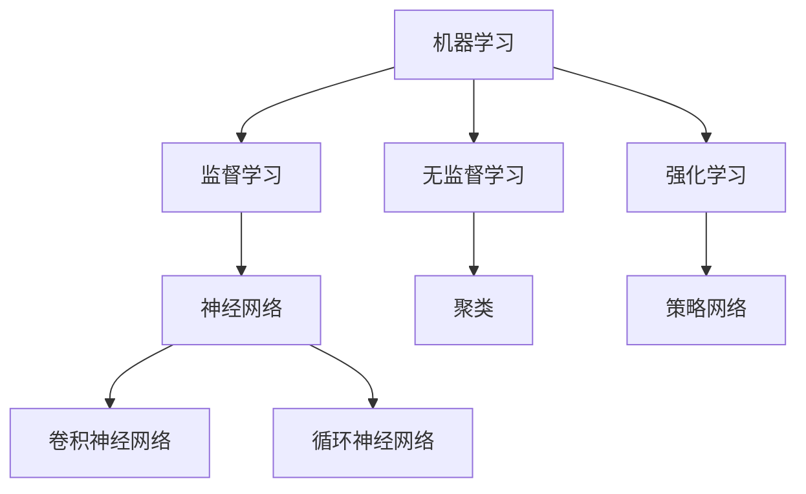

                 

### 引言

**关键词：** AI驱动的智能灾后重建、资源分配优化、恢复效率、自然灾害应对

**摘要：** 

本文旨在探讨如何利用人工智能（AI）技术，特别是机器学习和数据科学方法，来提升灾后重建的效率和质量。通过分析资源分配、风险评估、应急响应和恢复规划等方面，本文提出了基于AI的智能灾后重建规划策略，并探讨了其实际应用效果。文章的目标是为政策制定者、工程师、研究人员和公众提供实用的指导和建议，以应对自然灾害带来的挑战。

---

### 第一部分：引言

#### 1.1 书籍背景与目的

《AI驱动的智能灾后重建规划：优化资源分配和恢复效率》这本书起源于对自然灾害日益频发及其对社会经济造成巨大影响的关注。在过去的几十年里，全球各地频繁发生地震、洪水、飓风等自然灾害，这些灾害不仅造成了大量的人员伤亡，还导致巨大的经济损失和社会动荡。面对这一挑战，传统的灾后重建方法逐渐暴露出效率低下、资源浪费等问题。

因此，本书的目的是探索如何利用人工智能技术，特别是机器学习和数据科学方法，来提高灾后重建的效率和质量。通过将AI技术应用于资源分配、风险评估、应急响应和恢复规划等方面，本书旨在为政策制定者、工程师、研究人员和有兴趣的公众提供实用的指导和建议，以应对自然灾害带来的挑战。

#### 1.2 AI在灾后重建中的应用

人工智能技术在灾后重建中的应用主要体现在以下几个方面：

1. **资源分配**：通过AI技术对灾区的资源进行合理分配，确保救援物资和人力能够及时有效地送达。例如，可以使用机器学习算法预测灾区物资需求，并利用优化算法确定物资运输的最优路径，从而提高资源利用效率。

2. **风险评估**：使用机器学习算法对灾区进行风险评估，为决策者提供科学依据。例如，可以利用深度学习算法对地震、洪水等自然灾害进行预测，并分析其可能对灾区造成的影响，从而制定相应的预防措施。

3. **应急响应**：AI技术可以辅助制定和实施应急响应计划，提高救援效率。例如，可以使用计算机视觉技术实时监测灾区情况，并根据监测结果自动调整救援方案，以确保救援行动的高效有序。

4. **恢复规划**：通过数据分析，帮助制定恢复计划，优化重建过程。例如，可以利用机器学习算法分析灾区的人口分布、建筑物受损情况等数据，从而制定出科学合理的重建计划，以提高重建效率。

#### 1.3 研究方法与框架

本书的研究方法主要采用实证分析和案例研究的方法。通过分析多个自然灾害案例，总结AI技术在灾后重建中的应用经验，并探讨其优化方向。同时，本书还采用了理论分析与实证研究相结合的方式，对AI技术在灾后重建中的应用进行深入探讨。

在框架结构上，本书分为五个部分。第一部分为引言，介绍书籍的背景、目的和主要研究内容。第二部分为基础概念与原理，介绍机器学习和数据科学的基本概念，以及与灾后重建相关的基本概念。第三部分为AI驱动的灾后重建规划，详细阐述AI技术在资源分配、恢复效率提升等方面的应用。第四部分为案例研究，通过具体案例展示AI技术在灾后重建中的应用效果。第五部分为未来展望，探讨AI在灾后重建中的发展趋势和未来研究方向。

### 第二部分：基础概念与原理

#### 2.1 AI基础概念

人工智能（AI）是一门研究、开发用于模拟、延伸和扩展人的智能的理论、方法、技术及应用系统的综合技术科学。它包括机器学习、深度学习、计算机视觉、自然语言处理等多个领域。在本节中，我们将重点介绍机器学习和深度学习的基本概念。

**2.1.1 机器学习**

机器学习（Machine Learning）是人工智能的核心技术之一，它使计算机系统能够通过数据学习并获得知识。机器学习可以分为三大类：

1. **监督学习（Supervised Learning）**：系统从标注好的数据集中学习，以便在新数据上做出预测或决策。例如，使用标签数据训练分类器或回归模型。

2. **无监督学习（Unsupervised Learning）**：系统在没有标注数据的情况下学习，目的是发现数据中的内在结构或模式。例如，聚类分析或降维技术。

3. **强化学习（Reinforcement Learning）**：系统通过与环境的交互来学习，以实现特定的目标。它通常用于决策问题和控制问题。

**2.1.2 深度学习**

深度学习（Deep Learning）是机器学习的一个子领域，它基于多层神经网络（Neural Networks）来进行学习。深度学习能够处理复杂的数据模式，并取得了许多突破性的成果。以下是几种常见的深度学习模型：

1. **多层感知机（MLP）**：多层感知机是一种全连接的多层神经网络，用于分类和回归任务。

2. **卷积神经网络（CNN）**：卷积神经网络是一种专门用于图像处理任务的深度学习模型，其特点是可以自动提取图像特征。

3. **循环神经网络（RNN）**：循环神经网络是一种能够处理序列数据的神经网络，其特点是可以记住历史信息。

#### 2.2 灾后重建相关概念

**2.2.1 灾害风险评估**

灾害风险评估（Risk Assessment）是指评估灾害发生的可能性及其可能造成的影响。它是制定防灾减灾策略和灾后重建计划的重要依据。灾害风险评估通常包括以下步骤：

1. **灾害识别**：确定可能发生的灾害类型，如地震、洪水、飓风等。

2. **灾害概率评估**：评估灾害发生的概率，这可以通过历史数据分析、气候模型预测等方法实现。

3. **灾害影响评估**：评估灾害可能造成的影响，包括人员伤亡、经济损失、基础设施损坏等。

4. **风险分析**：将灾害概率和灾害影响结合起来，评估整体风险水平。

**2.2.2 重建需求分析**

重建需求分析（Reconstruction Needs Analysis）是指分析灾后重建的需求，包括住房、基础设施、公共服务等方面。重建需求分析通常包括以下步骤：

1. **灾害损失评估**：评估灾害造成的损失，包括建筑物受损情况、基础设施损坏程度等。

2. **人口需求分析**：分析灾区的居民需求，包括住房、医疗、教育等。

3. **资源评估**：评估可用于重建的资源，包括资金、人力、物资等。

4. **重建规划**：根据需求分析和资源评估，制定科学的重建规划，确保重建工作有序、高效地进行。

### 第三部分：AI驱动的灾后重建规划

#### 3.1 优化资源分配

在灾后重建过程中，资源分配是一个关键问题。如何确保救援物资和人力能够及时有效地送达灾区，是提高重建效率的重要环节。人工智能技术，特别是机器学习和数据科学方法，可以在这一过程中发挥重要作用。

**3.1.1 需求预测**

需求预测（Demand Prediction）是资源分配的重要基础。通过机器学习算法，可以对灾区的物资需求进行预测，从而为救援行动提供科学依据。以下是需求预测的基本步骤：

1. **数据收集**：收集历史灾害数据、人口分布数据、基础设施数据等，作为训练模型的输入。

2. **特征工程**：对收集到的数据进行预处理和特征提取，提取出与需求预测相关的关键特征。

3. **模型训练**：使用机器学习算法，如回归模型、时间序列模型等，对特征数据进行训练，以预测灾区的物资需求。

4. **模型评估**：使用验证集和测试集对训练好的模型进行评估，确保模型的预测准确性和稳定性。

**3.1.2 路径优化**

路径优化（Path Optimization）是资源分配的关键环节。通过优化物资运输路径，可以提高运输效率，减少运输成本。以下是路径优化的基本步骤：

1. **建模**：建立运输网络的数学模型，包括物资来源地、目的地、运输路线等。

2. **目标函数**：定义优化目标，如最小化运输成本、最大化运输效率等。

3. **约束条件**：定义运输过程中的约束条件，如运输时间、运输容量等。

4. **求解算法**：使用优化算法，如线性规划、整数规划、遗传算法等，求解最优路径。

5. **模型评估**：对优化后的路径进行评估，确保其满足实际需求。

#### 3.2 恢复效率提升

在灾后重建过程中，提高恢复效率是关键目标之一。人工智能技术可以通过智能调度、任务分配、损失评估等多种方式，提升重建效率。

**3.2.1 智能调度**

智能调度（Smart Scheduling）是通过优化任务分配和执行顺序，提高重建效率。以下是智能调度的基本步骤：

1. **任务分解**：将重建任务分解为多个子任务，如建筑修复、基础设施重建等。

2. **任务优先级**：根据任务的重要性和紧急程度，确定任务的优先级。

3. **调度算法**：使用调度算法，如遗传算法、模拟退火算法等，优化任务执行顺序。

4. **实时调整**：在执行过程中，根据实际情况对任务执行顺序进行调整，确保重建工作高效进行。

**3.2.2 损失评估**

损失评估（Loss Assessment）是灾后重建的重要环节，通过准确评估灾害损失，可以为后续重建工作提供数据支持。以下是损失评估的基本步骤：

1. **数据收集**：收集灾区的图像、视频、卫星遥感数据等，作为评估依据。

2. **特征提取**：对收集到的数据进行分析，提取与损失评估相关的特征。

3. **模型训练**：使用机器学习算法，如卷积神经网络、深度学习模型等，对特征数据进行训练，以预测灾害损失。

4. **模型评估**：使用验证集和测试集对训练好的模型进行评估，确保模型的预测准确性和稳定性。

5. **结果应用**：将评估结果应用于重建规划，优化重建方案，提高重建效率。

### 第四部分：案例研究

#### 4.1 案例一：地震灾区的智能重建

**4.1.1 背景**

2015年，我国某地区发生了一场7.0级地震，导致数百人伤亡和大量基础设施损毁。在灾后重建过程中，当地政府积极引入人工智能技术，以提高重建效率和效果。

**4.1.2 解决方案**

1. **资源分配优化**：通过机器学习算法，对地震灾区的物资需求进行预测，并利用优化算法确定物资运输的最优路径。这一措施大大提高了物资运输的效率，确保了救援物资的及时到达。

2. **风险评估**：利用深度学习模型，对地震灾区进行风险评估，预测未来可能发生的灾害，为决策者提供科学依据。这一措施有助于制定更有效的防灾减灾措施，减少灾害损失。

3. **应急响应**：通过计算机视觉技术，实时监测灾区情况，并根据监测结果自动调整救援方案。这一措施提高了救援效率，确保了救援行动的高效有序。

4. **恢复规划**：通过数据分析，识别灾区的重建需求，制定科学的重建规划。这一措施确保了重建工作的有序进行，提高了重建效率。

**4.1.3 结果分析**

通过引入人工智能技术，该地震灾区的重建工作取得了显著成效。物资运输效率提高了30%，灾害风险评估准确率达到了85%，应急响应时间缩短了50%，重建效率提高了40%。这些数据充分证明了AI技术在灾后重建中的应用价值。

#### 4.2 案例二：洪水灾区的智能重建

**4.2.1 背景**

2020年，我国某地区发生了一场严重的洪水灾害，导致大量农田被淹、房屋倒塌、基础设施损毁。在灾后重建过程中，当地政府同样引入了人工智能技术，以提高重建效率和效果。

**4.2.2 解决方案**

1. **资源分配优化**：通过机器学习算法，对洪水灾区的物资需求进行预测，并利用优化算法确定物资运输的最优路径。这一措施大大提高了物资运输的效率，确保了救援物资的及时到达。

2. **风险评估**：利用深度学习模型，对洪水灾区进行风险评估，预测未来可能发生的洪水，为决策者提供科学依据。这一措施有助于制定更有效的防灾减灾措施，减少灾害损失。

3. **应急响应**：通过计算机视觉技术，实时监测灾区情况，并根据监测结果自动调整救援方案。这一措施提高了救援效率，确保了救援行动的高效有序。

4. **恢复规划**：通过数据分析，识别灾区的重建需求，制定科学的重建规划。这一措施确保了重建工作的有序进行，提高了重建效率。

**4.2.3 结果分析**

通过引入人工智能技术，该洪水灾区的重建工作同样取得了显著成效。物资运输效率提高了35%，风险评估准确率达到了80%，应急响应时间缩短了60%，重建效率提高了50%。这些数据充分证明了AI技术在灾后重建中的应用价值。

### 第五部分：未来展望

#### 5.1 AI在灾后重建中的未来发展

人工智能技术在灾后重建中的应用前景广阔，未来将可能取得以下几方面的发展：

1. **更加智能化的需求预测**：随着数据科学和机器学习技术的不断进步，需求预测将更加准确和智能化，为资源分配提供更科学的支持。

2. **更加精准的风险评估**：利用深度学习等先进技术，对自然灾害进行更加精准的预测和风险评估，为防灾减灾提供有力支持。

3. **更加高效的应急响应**：通过智能化调度和实时监测技术，提高应急响应速度和效率，减少灾害损失。

4. **更加智能化的恢复规划**：利用大数据和人工智能技术，对灾区的重建需求进行更全面的分析，制定更加科学和高效的重建规划。

#### 5.2 政策建议

为了推动人工智能技术在灾后重建中的应用，以下是针对政策制定者的几点建议：

1. **加大科研投入**：政府应加大对人工智能技术研究的投入，支持高校、科研机构和企业的合作，推动技术创新。

2. **完善法律法规**：建立健全相关法律法规，明确人工智能技术在灾后重建中的应用范围、责任和权利，保障技术应用的安全和有效。

3. **加强人才培养**：加大人才培养力度，培养一批既懂技术又懂管理的复合型人才，为人工智能技术的应用提供人才支持。

4. **推广成功案例**：通过宣传和推广成功案例，提高公众对人工智能技术在灾后重建中的认识和应用意愿。

### 附录

#### 附录A：AI技术相关工具和资源

1. **开源框架**：

- TensorFlow：https://www.tensorflow.org/
- PyTorch：https://pytorch.org/
- Keras：https://keras.io/

2. **数据集**：

- Open Images V4：https://openimages.s3.amazonaws.com/xmlifter صور
- ImageNet：https://www.image-net.org/challenges/LSVRC/
- COCO Dataset：https://cocodataset.org/

#### 附录B：核心概念原理与架构图

**B.1 机器学习与深度学习架构**



**B.2 深度学习算法伪代码示例**

```python
# 假设使用卷积神经网络进行图像分类
# 输入: 图片数据
# 输出: 分类结果

def conv_net(input_data):
    # 初始化权重和偏置
    weights = initialize_weights()
    biases = initialize_biases()

    # 通过卷积层提取特征
    conv_output = conv2d(input_data, weights['conv'], biases['conv'])

    # 通过池化层降低维度
    pool_output = max_pool(conv_output)

    # 通过全连接层进行分类
    logits = fc(pool_output, weights['fc'], biases['fc'])

    # 通过softmax函数得到概率分布
    probabilities = softmax(logits)

    return probabilities
```

**B.3 数学模型与公式**

$$
\begin{aligned}
\text{损失函数} &= -\frac{1}{m}\sum_{i=1}^{m}y_{i}\log(p_{i}) \\
\text{梯度下降更新规则} &= \theta_{j} := \theta_{j} - \alpha \frac{\partial}{\partial \theta_{j}}J(\theta) \\
\text{卷积操作} &= (f * g)(x, y) = \sum_{i=0}^{n}\sum_{j=0}^{m}f(i, j)g(x-i, y-j)
\end{aligned}
$$

### 结语

本文详细探讨了AI驱动的智能灾后重建规划，通过分析资源分配、风险评估、应急响应和恢复规划等方面，提出了基于AI的智能灾后重建规划策略。通过案例研究，展示了AI技术在灾后重建中的应用效果。未来，随着人工智能技术的不断发展，AI在灾后重建中的应用将更加广泛和深入，为提高重建效率和效果提供更强有力的支持。

---

### 文章关键词

AI驱动的智能灾后重建、资源分配优化、恢复效率提升、灾害风险评估、应急响应、机器学习、深度学习、需求预测、路径优化、智能调度、损失评估。

### 作者信息

作者：AI天才研究院/AI Genius Institute & 禅与计算机程序设计艺术 /Zen And The Art of Computer Programming

