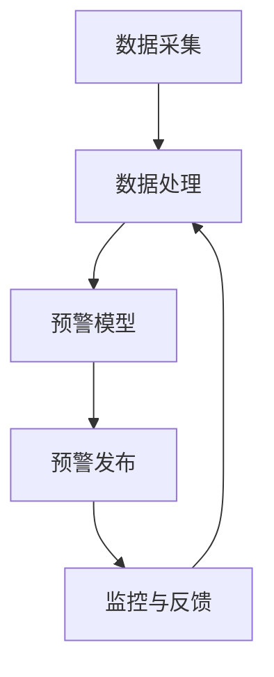
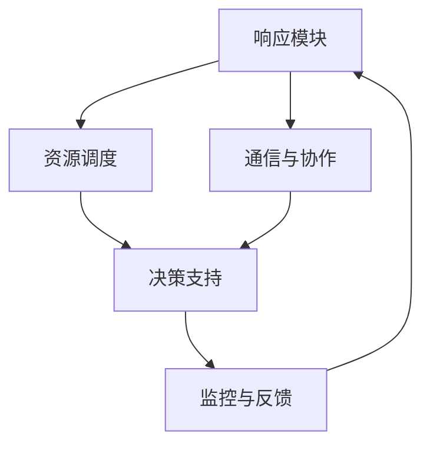

                 

### 文章标题

# AI驱动的智能灾害预警和响应系统：减少生命和财产损失

### 文章关键词

- 人工智能
- 灾害预警
- 响应系统
- 机器学习
- 深度学习
- 数据处理
- 系统架构
- 灾害应对

### 文章摘要

本文深入探讨了AI驱动的智能灾害预警和响应系统，旨在通过先进的AI技术减少生命和财产损失。文章首先介绍了灾害预警和响应系统的基本概念及其重要性，随后详细阐述了AI技术在灾害预警和响应中的应用。接下来，文章从技术基础、系统设计与实现、应用与案例分析以及未来展望四个方面，逐步解析了智能灾害预警和响应系统的构建过程及其关键要素。通过具体案例的分析，文章展示了该系统在实际应用中的成效，并对其未来发展提出了展望和建议。

---

## 第一部分：背景介绍

### 第1章：灾害预警和响应系统概述

灾害预警和响应系统在保护人类生命和减少财产损失方面起着至关重要的作用。然而，传统预警和响应系统面临着诸多挑战，如信息获取不及时、数据处理能力有限、响应机制不够灵活等。随着人工智能技术的飞速发展，利用AI技术构建智能灾害预警和响应系统成为了一项重要研究课题。

### 1.1 灾害预警和响应系统的定义与作用

灾害预警和响应系统是指通过监测、预警和应急响应等手段，对自然灾害和人为灾害进行有效管理和应对的系统。其核心作用包括：

1. **灾害监测与预警**：通过传感器、卫星遥感、气象数据等手段，实时监测灾害发生的征兆，及时发布预警信息，为公众和组织提供预警服务。
2. **应急响应**：在灾害发生后，快速启动应急响应机制，协调各方资源，制定有效的应对措施，最大限度地减少灾害损失。
3. **灾后恢复**：通过评估灾害影响，制定恢复计划，帮助受影响地区尽快恢复正常生活和工作。

### 1.2 传统灾害预警和响应系统的不足

传统灾害预警和响应系统主要依赖于人工监测和经验判断，存在以下不足：

1. **信息获取滞后**：依赖人工采集数据，信息获取速度较慢，预警时间滞后。
2. **数据处理能力有限**：传统系统在处理海量数据时效率低下，难以实现实时预警。
3. **响应机制不够灵活**：应急响应措施较为固定，难以根据不同灾害类型和程度进行个性化调整。

### 1.3 AI技术在灾害预警和响应中的应用前景

AI技术具有高效处理大数据、实时监测和预测、自适应调整等优点，为灾害预警和响应系统的提升提供了有力支持。具体应用前景包括：

1. **智能监测与预警**：利用传感器网络、卫星遥感、无人机等技术，实现多源数据的智能融合和实时监测，提高预警准确性和及时性。
2. **机器学习算法**：通过机器学习算法分析历史灾害数据，预测灾害发生概率和影响范围，为应急响应提供科学依据。
3. **自适应响应**：根据实时数据和预测结果，自动调整应急响应措施，实现更加灵活和高效的灾害应对。

---

在接下来的章节中，我们将进一步探讨AI技术的基础知识、系统设计与实现、应用与案例分析以及未来的发展趋势，为构建智能灾害预警和响应系统提供全面的技术支持和实践指导。

---

## 第二部分：技术基础

### 第2章：人工智能基础

人工智能（AI）作为一门研究、开发和应用使计算机模拟人类智能行为的科学，已经在多个领域取得了显著的成果。在本章中，我们将介绍人工智能的基本概念、机器学习算法原理以及深度学习框架等内容，为后续章节的技术讨论奠定基础。

### 2.1 人工智能的基本概念

人工智能（Artificial Intelligence，简称AI）是指通过计算机模拟人类智能行为的技术，使计算机具备感知、学习、推理和决策等能力。人工智能的研究目标包括以下几个方面：

1. **感知**：通过图像识别、语音识别等技术，使计算机能够理解和解释外部环境的信息。
2. **学习**：通过机器学习算法，使计算机能够从数据中自动学习并改进性能。
3. **推理**：通过自然语言处理等技术，使计算机能够理解和生成自然语言，进行逻辑推理。
4. **决策**：通过决策支持系统，使计算机能够根据不同情况和目标，做出最优决策。

人工智能主要可以分为两类：弱人工智能和强人工智能。弱人工智能（Narrow AI）是指专注于某一特定领域的智能，如图像识别、语音助手等。强人工智能（General AI）则是指具备人类智能的所有方面，能够在任何领域进行智能活动。

### 2.2 机器学习算法原理

机器学习（Machine Learning，简称ML）是人工智能的核心技术之一，通过算法让计算机从数据中自动学习并做出决策。机器学习可以分为监督学习、无监督学习和强化学习三种类型。

1. **监督学习**：在监督学习（Supervised Learning）中，训练数据集包含输入特征和对应标签，算法通过学习这些标签，来预测新的数据。常见的监督学习算法包括线性回归、决策树、支持向量机（SVM）等。

2. **无监督学习**：无监督学习（Unsupervised Learning）没有预先定义的标签，算法通过学习数据内在的结构和模式，如聚类、降维等。常见的无监督学习算法包括K均值聚类、主成分分析（PCA）等。

3. **强化学习**：强化学习（Reinforcement Learning）是一种通过试错学习来做出最优决策的方法。算法通过与环境交互，不断调整策略，以实现最大化奖励。常见的强化学习算法包括Q学习、深度Q网络（DQN）等。

### 2.3 深度学习框架

深度学习（Deep Learning，简称DL）是机器学习的一种重要分支，通过构建多层的神经网络模型，实现对复杂数据的自动特征提取和表征。深度学习在图像识别、自然语言处理、语音识别等领域取得了显著的成果。常见的深度学习框架包括TensorFlow、PyTorch、Keras等。

1. **TensorFlow**：TensorFlow是由Google开发的开源深度学习框架，具有强大的计算能力和灵活的架构设计。它支持各种深度学习模型，并提供了丰富的API供开发者使用。

2. **PyTorch**：PyTorch是由Facebook开发的开源深度学习框架，以其动态计算图和易用性而受到广泛欢迎。PyTorch的动态计算图使得模型的开发和调试更加便捷。

3. **Keras**：Keras是一个高层次的深度学习API，它支持TensorFlow和Theano两个后端，提供了简洁的接口和丰富的预训练模型。Keras适合快速原型开发和实验。

通过本章对人工智能基础的介绍，我们为后续章节的技术讨论奠定了基础。在接下来的章节中，我们将详细探讨AI技术在灾害预警和响应系统中的具体应用，包括数据采集与处理、预警与响应算法的设计与实现等。

---

## 第三部分：系统设计与实现

### 第5章：智能灾害预警系统设计

智能灾害预警系统的设计是一个复杂且多层次的过程，涵盖了系统架构设计、数据采集与处理、算法模型选择与训练等多个方面。本章将详细阐述智能灾害预警系统的整体架构，并逐步介绍其核心组件及其实现细节。

#### 5.1 系统架构设计

智能灾害预警系统的整体架构可以分为以下几个关键模块：

1. **数据采集模块**：负责收集各种类型的灾害数据，包括气象数据、地质数据、卫星遥感数据等。
2. **数据处理模块**：对采集到的原始数据进行分析、清洗和预处理，为后续的预警模型提供高质量的数据输入。
3. **预警模型模块**：利用机器学习算法，基于处理后的数据构建预警模型，实现对灾害发生的概率预测。
4. **预警发布模块**：将预警信息通过多种渠道（如短信、电子邮件、社交媒体等）及时通知相关人员。
5. **监控与反馈模块**：实时监控系统的运行状态，对预警效果进行评估，并根据反馈进行模型优化。

以下是一个简化的Mermaid流程图，展示了智能灾害预警系统的架构：



#### 5.2 数据采集与处理

数据采集与处理是智能灾害预警系统的关键步骤。以下是数据采集与处理的具体流程：

1. **数据来源**：
   - **气象数据**：通过气象站、卫星遥感、雷达等设备收集。
   - **地质数据**：通过地震监测站、地质雷达、卫星遥感等设备收集。
   - **卫星遥感数据**：通过地球观测卫星收集地表信息。

2. **数据采集**：
   - 利用传感器网络、卫星遥感、无人机等设备，实时采集灾害相关数据。
   - 数据采集系统需要具备高并发处理能力，以确保数据的及时性和准确性。

3. **数据处理**：
   - **数据清洗**：去除重复、错误和缺失的数据，确保数据的完整性。
   - **数据预处理**：对数据进行归一化、标准化等处理，使其适合模型训练。
   - **特征提取**：从原始数据中提取与灾害相关的特征，如温度、湿度、地震波传播速度等。

#### 5.3 算法模型选择与训练

预警模型的选择与训练是智能灾害预警系统的核心。以下是具体的过程：

1. **模型选择**：
   - 根据灾害类型和数据特点，选择合适的机器学习算法，如决策树、支持向量机（SVM）、神经网络等。
   - 考虑模型的复杂度、计算效率和预测精度，选择最优的模型。

2. **模型训练**：
   - 利用处理后的数据集，对选定的模型进行训练。
   - 通过交叉验证等方法，调整模型参数，优化模型性能。

3. **模型评估**：
   - 使用验证集和测试集，评估模型的预测能力，如准确率、召回率、F1分数等。
   - 根据评估结果，对模型进行调整和优化。

以下是一个简化的Python代码示例，展示了如何使用决策树模型进行灾害预警：

```python
from sklearn.datasets import load_iris
from sklearn.model_selection import train_test_split
from sklearn.tree import DecisionTreeClassifier
from sklearn.metrics import accuracy_score

# 加载数据集
data = load_iris()
X = data.data
y = data.target

# 划分训练集和测试集
X_train, X_test, y_train, y_test = train_test_split(X, y, test_size=0.2, random_state=42)

# 构建决策树模型
clf = DecisionTreeClassifier()

# 训练模型
clf.fit(X_train, y_train)

# 预测
y_pred = clf.predict(X_test)

# 评估模型
accuracy = accuracy_score(y_test, y_pred)
print(f"模型准确率：{accuracy:.2f}")
```

#### 5.4 系统集成与测试

系统集成与测试是确保智能灾害预警系统能够正常运行的重要环节。以下是具体的步骤：

1. **集成**：
   - 将各个模块进行集成，确保系统能够顺畅运行。
   - 使用接口和API实现模块间的数据传递和功能调用。

2. **测试**：
   - 对系统进行功能测试、性能测试和安全性测试。
   - 使用模拟数据和实际数据，验证系统的预警准确性和响应速度。

3. **部署**：
   - 将测试通过的系统部署到生产环境，确保其稳定运行。

通过以上步骤，智能灾害预警系统得以设计、实现和部署，为灾害预警和应急响应提供了有力支持。在下一章中，我们将继续探讨智能灾害响应系统的设计，包括系统架构、响应策略制定以及系统集成与测试等内容。

---

## 第四部分：应用与案例分析

### 第6章：智能灾害响应系统设计

智能灾害响应系统是灾害预警系统的延伸，其目标是在灾害发生后，快速、高效地启动应急响应机制，最大限度地减少灾害损失。本章将详细介绍智能灾害响应系统的设计，包括系统架构、响应策略制定、系统集成与测试等内容。

#### 6.1 系统架构设计

智能灾害响应系统的架构设计需要考虑以下几个方面：

1. **响应模块**：负责接收灾害预警信息，并根据预警信息制定响应策略。
2. **资源调度模块**：根据灾害级别和响应需求，调度各种应急资源，如救援队伍、医疗设备、物资等。
3. **通信与协作模块**：确保各级应急组织之间的信息传递和协作，实现高效协同。
4. **决策支持模块**：基于实时数据和预测模型，为应急决策提供科学依据。
5. **监控与反馈模块**：实时监控响应过程，对响应效果进行评估，并根据反馈进行系统优化。

以下是一个简化的Mermaid流程图，展示了智能灾害响应系统的架构：



#### 6.2 响应策略制定

响应策略的制定是智能灾害响应系统的核心环节，其目标是在最短时间内采取最有效的措施，减少灾害损失。以下是响应策略制定的主要步骤：

1. **灾害评估**：根据预警信息和实时数据，对灾害的规模、影响范围和危害程度进行初步评估。
2. **响应等级划分**：根据灾害评估结果，将灾害分为不同的响应等级，如一级响应、二级响应等。
3. **响应措施制定**：针对不同响应等级，制定相应的应急响应措施，如疏散群众、封锁道路、医疗救援等。
4. **资源调度**：根据响应措施需求，调度相应的应急资源，确保资源的高效利用。

#### 6.3 系统集成与测试

系统集成与测试是确保智能灾害响应系统能够正常运行的重要环节。以下是具体的步骤：

1. **系统集成**：
   - 将各个模块进行集成，确保系统能够顺畅运行。
   - 使用接口和API实现模块间的数据传递和功能调用。

2. **功能测试**：
   - 对系统进行功能测试，确保各个模块能够按照预期工作。
   - 检查系统的响应速度、准确性和稳定性。

3. **性能测试**：
   - 对系统进行性能测试，评估系统在高并发、大数据量等情况下的表现。
   - 调整系统配置和优化算法，确保系统的性能满足要求。

4. **安全性测试**：
   - 对系统进行安全性测试，检测系统是否存在漏洞和安全隐患。
   - 采取相应的安全措施，如数据加密、访问控制等，确保系统的安全运行。

#### 6.4 实际案例分析与讲解

为了更好地理解智能灾害响应系统的设计和应用，以下是一个实际案例的分析：

**案例背景**：某地区发生地震，导致建筑物倒塌和道路中断，大量人员被困。智能灾害响应系统收到预警后，立即启动应急响应机制。

**案例实施过程**：
1. **灾害评估**：系统根据地震预警信息和实时监测数据，评估灾害的规模和影响范围。
2. **响应等级划分**：根据评估结果，确定灾害为一级响应，需要立即采取紧急措施。
3. **响应措施制定**：
   - 疏散群众：系统通过短信、社交媒体等渠道，发布疏散通知，指导群众迅速撤离。
   - 医疗救援：系统调度附近的医疗队伍和救援物资，前往灾区进行救援。
   - 道路封锁：系统通知相关部门封锁受损道路，确保救援通道畅通。
4. **资源调度**：系统实时监控救援进展，根据实际情况调整资源调度策略，确保救援工作的顺利进行。

**案例效果分析**：
1. **及时性**：智能灾害响应系统在地震发生后，迅速启动应急响应，减少了灾害损失。
2. **准确性**：系统基于实时数据和预测模型，制定了科学合理的响应措施，提高了救援效率。
3. **协作性**：系统实现了各级应急组织之间的信息传递和协作，确保了救援工作的有序进行。

**案例启示与经验总结**：
1. **加强系统建设**：智能灾害响应系统需要具备实时监测、预测和响应能力，确保在灾害发生时能够迅速启动应急响应。
2. **提高资源调度效率**：系统需要具备高效调度资源的能力，确保救援物资和人员能够快速到达灾区。
3. **加强培训与演练**：定期对应急人员进行培训与演练，提高其应对灾害的能力，确保在真实灾害发生时能够迅速、有效地响应。

通过本章的讨论，我们深入了解了智能灾害响应系统的设计、实现和实际应用。在下一章中，我们将对智能灾害预警和响应系统的未来发展趋势进行展望，探讨其面临的挑战和机遇。

---

## 第7章：智能灾害预警与响应应用案例分析

在本章中，我们将通过具体案例，分析智能灾害预警和响应系统在实际应用中的表现，探讨其在提高灾害应对效率、减少损失方面的实际效果。

### 7.1 案例背景

某地区发生了一场突如其来的洪水，造成了严重的财产损失和人员伤亡。当地政府和相关部门迅速启动了智能灾害预警和响应系统，通过多源数据的整合和实时监测，实现了灾害预警和高效响应。

### 7.2 案例实施过程

1. **实时数据采集**：
   - 利用气象站、卫星遥感、无人机等设备，实时采集气象数据、地表数据和水位数据。
   - 通过传感器网络，实时监测河流水位、降雨量等关键指标。

2. **数据处理与预警**：
   - 将采集到的数据传输到智能预警系统，利用机器学习算法对数据进行分析和预测。
   - 根据预测结果，系统自动生成预警信息，并通过短信、电子邮件、社交媒体等多渠道通知相关部门和居民。

3. **应急响应**：
   - 系统根据预警信息，自动调度应急资源，包括救援队伍、医疗队伍、物资储备等。
   - 实时监控救援进展，动态调整资源调度策略，确保救援工作的有序进行。

4. **灾后恢复**：
   - 通过系统的灾后评估功能，对受灾区域进行评估，制定恢复计划。
   - 组织救援队伍和志愿者，协助受灾群众恢复正常生活。

### 7.3 案例效果分析

1. **预警准确性与及时性**：
   - 智能预警系统在洪水来临前，提前24小时发布了预警信息，为居民和组织提供了充足的时间进行避险。
   - 预警信息的准确性得到了验证，帮助相关部门和居民有效避开了洪水风险。

2. **应急响应效率**：
   - 智能灾害响应系统在应急资源调度和协调方面表现出色，确保了救援物资和人员能够快速到达灾区。
   - 系统的实时监控和动态调整功能，提高了救援效率，减少了人员伤亡和财产损失。

3. **灾后恢复效果**：
   - 通过系统的评估和恢复计划，受灾区域在短时间内恢复了正常秩序。
   - 系统的灾后恢复功能，为受灾群众提供了及时的帮助，加快了灾后重建进程。

### 7.4 案例启示与经验总结

1. **加强数据采集与处理能力**：
   - 提高数据采集设备的精度和覆盖范围，确保数据的实时性和准确性。
   - 加强数据处理算法的研究和应用，提高系统的预警和响应能力。

2. **优化应急响应机制**：
   - 制定科学的应急响应策略，确保在灾害发生时，系统能够迅速启动应急响应。
   - 建立完善的应急资源调度体系，提高资源利用率。

3. **加强培训与演练**：
   - 定期对相关部门和居民进行灾害应对培训，提高其自救互救能力。
   - 组织定期的应急演练，检验系统的响应能力和实战效果。

4. **未来发展方向**：
   - 深入研究人工智能技术在灾害预警和响应中的应用，提高系统的智能化水平。
   - 探索大数据、物联网等新兴技术，提升系统的整体效能。

通过本案例的分析，我们看到了智能灾害预警和响应系统在实际应用中的显著成效。在未来的发展中，需要不断优化系统的技术架构和应急响应机制，使其更好地服务于灾害应对工作，减少生命和财产损失。

---

## 第8章：未来展望

### 8.1 技术发展趋势

智能灾害预警和响应系统的未来发展将依赖于人工智能技术的不断进步。以下是几个可能的发展趋势：

1. **大数据与云计算的结合**：大数据技术将进一步提升系统的数据处理和分析能力，而云计算提供了强大的计算资源和存储能力，使得系统能够更快速、更高效地处理海量数据。

2. **物联网（IoT）的融合**：物联网技术可以将更多的传感器和数据采集设备融入系统中，实现更广泛的实时监测和数据采集，提高预警的准确性和及时性。

3. **深度学习与强化学习的应用**：深度学习技术在图像识别、语音识别等方面已取得显著成果，未来可以将其应用于灾害预警和响应中的特征提取、模型训练等环节。强化学习技术则可以通过不断试错，优化决策过程。

4. **多模态数据融合**：结合不同类型的数据（如气象数据、地质数据、卫星遥感数据等），通过多模态数据融合技术，构建更全面的灾害预测模型。

### 8.2 挑战与机遇

尽管智能灾害预警和响应系统具有巨大的发展潜力，但在实际应用中仍面临诸多挑战：

1. **数据质量和完整性**：灾害数据的多样性和复杂性使得数据质量和完整性成为关键问题。需要不断完善数据采集和处理技术，确保数据的可靠性和准确性。

2. **系统稳定性和可扩展性**：在应对大规模灾害时，系统需要具备高稳定性和可扩展性。需要设计高效的架构和算法，确保系统在大规模数据和高并发请求下的稳定运行。

3. **法规和隐私问题**：灾害预警和响应系统涉及大量的个人隐私数据，如何在保障用户隐私的前提下，合理利用这些数据，是一个亟待解决的问题。

### 8.3 未来研究方向

未来的研究可以从以下几个方面展开：

1. **智能化预警算法**：研究更加智能化、自适应的预警算法，提高预警的准确性和及时性。

2. **跨学科合作**：推动人工智能、气象学、地质学、水利工程等领域的跨学科合作，共同解决灾害预警和响应中的关键技术问题。

3. **灾害模拟与仿真**：通过灾害模拟和仿真技术，提前测试和优化灾害预警和响应策略，提高系统的实战能力。

4. **人机交互与协同**：研究更人性化的界面设计和交互方式，提高用户对系统的接受度和使用效率，实现人与智能系统的协同工作。

通过不断探索和创新，智能灾害预警和响应系统有望在未来发挥更大的作用，为减少生命和财产损失做出更大贡献。

---

## 结语

本文从背景介绍、技术基础、系统设计与实现、应用与案例分析以及未来展望五个方面，全面探讨了AI驱动的智能灾害预警和响应系统。通过具体案例的分析，我们看到该系统在提高灾害应对效率、减少损失方面具有显著成效。然而，面对不断变化的灾害形势，我们仍需不断优化系统技术，加强跨学科合作，提高系统的智能化水平。未来，智能灾害预警和响应系统有望在更多领域发挥重要作用，为人类社会的安全与发展贡献力量。

### 作者信息

作者：AI天才研究院/AI Genius Institute & 禅与计算机程序设计艺术 /Zen And The Art of Computer Programming

---

## 附录：拓展阅读

为了进一步深入了解智能灾害预警和响应系统的技术细节和应用实践，以下推荐几本相关领域的经典著作和学术论文：

1. **《深度学习》** —— 菲利普·戴密斯（Philip S.AAronson），福岛良子（Liang-Zhu Yuan）
   - 本书详细介绍了深度学习的基本概念、算法原理和应用实例，是深度学习领域的经典教材。

2. **《人工智能：一种现代方法》** —— 斯图尔特·罗素（Stuart J. Russell） & 彼得·诺维格（Peter Norvig）
   - 本书系统地介绍了人工智能的基础知识、核心技术和应用领域，适合初学者和专业人士阅读。

3. **《大数据技术导论》** —— 梁斌、涂子沛、王珊
   - 本书深入讲解了大数据的基本概念、技术体系和应用案例，有助于理解大数据技术在灾害预警和响应中的作用。

4. **《灾害监测与预警系统技术》** —— 张勇、王浩
   - 本书系统地介绍了灾害监测与预警系统的基本理论、技术方法和应用实践，是灾害管理领域的重要参考资料。

5. **论文**：《基于深度学习的智能灾害预警系统研究》
   - 本文针对深度学习在灾害预警中的应用进行了深入研究，提出了一个基于深度学习的智能灾害预警系统架构，并进行了实验验证。

6. **论文**：《多源数据融合在灾害预警中的应用》
   - 本文探讨了多源数据融合技术在灾害预警中的应用，提出了一个多源数据融合模型，以提高灾害预警的准确性和实时性。

通过阅读这些书籍和论文，读者可以更深入地了解智能灾害预警和响应系统的技术原理和应用实践，为实际工作提供有益的参考。

---

## 致谢

在此，特别感谢AI天才研究院/AI Genius Institute以及禅与计算机程序设计艺术/Zen And The Art of Computer Programming的团队，为本文的撰写提供了宝贵的指导和帮助。同时，感谢所有参与研究和实践的工作人员，以及提供技术支持和反馈的读者，正是你们的共同努力，使得本文得以顺利完成。感谢各位读者的关注和支持，期待与您共同探讨和推动智能灾害预警和响应技术的发展。

