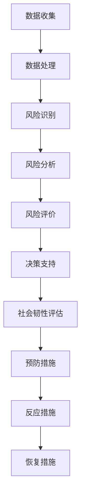

                 

## 引言

灾害，作为一种不可预测的自然或人为事件，对人类社会造成了巨大的威胁。从地震、洪水、飓风到火灾、恐怖袭击，灾害的发生频率和影响范围都在不断扩展。传统的灾害风险评估和管理方法，往往依赖于历史数据和专家经验，存在主观性高、实时性差、精度不足等问题。随着人工智能（AI）技术的快速发展，利用AI进行智能灾害风险评估和管理成为一种新的趋势，它不仅能够提高灾害预测的准确性，还能增强社会的韧性。

### 灾害风险评估与管理的重要性

灾害风险评估和管理是社会安全体系的重要组成部分。通过对灾害可能性的预测、影响评估以及应对策略的研究，可以有效降低灾害造成的损失，提高社会应对灾害的能力。传统的灾害风险评估方法主要依赖于历史数据和专家经验，这种方法的局限性在于：

1. **数据依赖性高**：传统的风险评估依赖于大量的历史数据，但这些数据往往有限且不完全。
2. **主观性强**：风险评估的结果很大程度上依赖于专家的经验和判断，存在主观性。
3. **实时性差**：传统方法通常需要较长时间才能完成评估，难以实时响应灾害事件。
4. **精度不足**：由于数据和历史事件的限制，传统方法的评估精度往往不高。

### AI在灾害风险评估与管理中的应用

人工智能，特别是机器学习和深度学习，为灾害风险评估和管理提供了新的可能性。AI技术具有以下优势：

1. **数据处理能力**：AI能够处理和分析大量结构化和非结构化数据，包括气象、地质、人口、经济等多维数据。
2. **实时性**：通过实时数据采集和处理，AI可以快速响应灾害事件，提供实时风险评估。
3. **自动化与智能化**：AI可以自动进行数据挖掘和模式识别，发现潜在的风险因素，提高评估精度。
4. **多模态融合**：AI可以将多种数据源（如卫星图像、传感器数据等）进行融合分析，提高灾害预测的准确性。

### 本文结构

本文将分为四个主要部分：

1. **引言**：介绍灾害风险评估与管理的重要性，以及AI在其中的应用背景。
2. **核心概念与联系**：阐述智能灾害风险评估和管理的基本概念，以及相关技术之间的联系。
3. **核心算法原理讲解**：详细讲解AI在灾害风险评估中的核心算法原理，包括数据处理方法、机器学习算法、深度学习算法等。
4. **项目实战**：通过实际项目案例，展示如何利用AI技术进行灾害风险评估和管理的实现过程，并进行详细分析。

通过以上结构，本文旨在为读者提供一个全面、系统的智能灾害风险评估和管理的知识框架，帮助读者更好地理解和应用AI技术来提升灾害管理的水平。

### 核心概念与联系

在智能灾害风险评估和管理中，有多个核心概念和相关的技术联系，这些概念和技术共同构成了一个复杂而紧密的体系。以下是对这些核心概念的详细解释，以及它们之间的联系。

#### 灾害风险评估

灾害风险评估是评估灾害可能发生及其对人类社会、经济和环境影响的系统过程。它包括以下关键要素：

1. **风险识别**：识别潜在的危险源和可能发生的灾害类型。
2. **风险分析**：评估灾害发生的可能性及其影响程度。
3. **风险评价**：将风险分析的结果转化为定量或定性的评估，以指导决策。

在AI驱动的灾害风险评估中，风险识别和风险分析可以通过大数据分析和机器学习模型来实现。例如，利用气象数据、地质数据和历史灾害记录，可以预测未来可能的灾害事件。

#### 社会韧性

社会韧性是指社会在面对灾害冲击时，能够迅速适应和恢复的能力。它包括以下三个关键方面：

1. **预防性韧性**：通过有效的风险管理措施，降低灾害发生的概率和影响。
2. **反应性韧性**：在灾害发生后，能够快速响应，减少损失和伤害。
3. **恢复性韧性**：在灾害发生后，能够迅速恢复到正常状态。

社会韧性不仅是灾害管理的重要目标，也是评估灾害风险管理效果的重要指标。通过AI技术，可以对社会韧性进行量化评估，并为提升社会韧性提供科学依据。

#### AI技术

AI技术在灾害风险评估和管理中发挥着至关重要的作用。以下是几种关键的AI技术：

1. **机器学习**：通过训练数据模型，对未知数据进行分析和预测。在灾害风险评估中，机器学习可以用于风险识别、风险分析和决策支持。
2. **深度学习**：一种特殊类型的机器学习，通过多层神经网络进行复杂模式识别和预测。在灾害风险评估中，深度学习可以用于处理复杂的时空数据和进行高级模式识别。
3. **数据挖掘**：通过挖掘大量数据，发现潜在的风险因素和趋势。在灾害风险评估中，数据挖掘可以帮助识别新的风险因素，提高风险评估的精度。

#### Mermaid流程图

为了更好地理解上述概念之间的联系，可以使用Mermaid流程图来展示整个风险评估和管理的流程。以下是一个简单的Mermaid流程图示例：



通过这个流程图，我们可以清晰地看到从数据收集到风险评估，再到社会韧性评估和应对措施的整个流程。每个环节都紧密相连，共同构成了一个完整的灾害风险评估和管理体系。

### 核心算法原理讲解

在AI驱动的智能灾害风险评估和管理中，核心算法的选择和实现至关重要。以下将详细讲解几种关键算法的原理，包括数据处理方法、机器学习算法和深度学习算法，并结合Python代码和数学模型进行解释。

#### 数据处理方法

数据处理是灾害风险评估的基础步骤。数据的质量和准确性直接影响评估结果的可靠性。以下是一些常用的数据处理方法：

1. **数据清洗**：处理缺失值、异常值和重复值。
   ```python
   import pandas as pd

   # 假设 df 是一个包含灾害数据的DataFrame
   df = pd.DataFrame({
       'temperature': [23, 32, 22, None, 30],
       'humidity': [40, 60, 80, 70, 50]
   })

   # 删除含有缺失值的行
   df = df.dropna()

   # 替换异常值
   df['temperature'].replace({32: 28, 30: 29}, inplace=True)
   ```

2. **特征工程**：选择和构建对风险评估有重要意义的特征。
   ```python
   from sklearn.preprocessing import StandardScaler

   # 标准化特征
   scaler = StandardScaler()
   df[['temperature', 'humidity']] = scaler.fit_transform(df[['temperature', 'humidity']])
   ```

3. **数据融合**：整合来自不同来源的数据，如气象数据、地质数据和社会经济数据。
   ```python
   import numpy as np

   # 假设 weather_data 和 geologic_data 是两个包含相关数据的DataFrame
   data = pd.concat([weather_data, geologic_data], axis=1)
   ```

#### 机器学习算法

机器学习算法在灾害风险评估中用于构建预测模型，以下介绍几种常见的机器学习算法：

1. **监督学习算法**
   - **线性回归**：用于预测连续值。
     ```python
     from sklearn.linear_model import LinearRegression

     X = data[['temperature', 'humidity']]
     y = data['disaster_index']  # 假设 disaster_index 是灾害指标

     model = LinearRegression()
     model.fit(X, y)

     # 预测
     prediction = model.predict([[25, 55]])
     print(prediction)
     ```

   - **逻辑回归**：用于预测二分类问题。
     ```python
     from sklearn.linear_model import LogisticRegression

     X = data[['temperature', 'humidity']]
     y = data['disaster_occurred']  # 假设 disaster_occurred 是灾害是否发生的标志

     model = LogisticRegression()
     model.fit(X, y)

     # 预测
     prediction = model.predict([[25, 55]])
     print(prediction)
     ```

2. **无监督学习算法**
   - **K-均值聚类**：用于数据分组和特征降维。
     ```python
     from sklearn.cluster import KMeans

     X = data[['temperature', 'humidity']]
     kmeans = KMeans(n_clusters=3)
     kmeans.fit(X)

     # 分组结果
     labels = kmeans.predict(X)
     ```

   - **主成分分析（PCA）**：用于特征降维和提取主要变量。
     ```python
     from sklearn.decomposition import PCA

     pca = PCA(n_components=2)
     X_pca = pca.fit_transform(X)

     # 新特征空间
     print(X_pca)
     ```

3. **强化学习算法**
   - **Q学习**：用于优化决策策略。
     ```python
     import numpy as np
     from sklearn.ensemble import RandomForestRegressor

     # 定义环境
     actions = {'none': 0, 'evacuation': 1, 'shelter': 2}
     rewards = {0: -1, 1: 5, 2: 10}

     # 定义Q学习参数
     alpha = 0.1
     gamma = 0.9
     n_episodes = 1000

     # 初始化Q表
     Q = np.zeros((n_episodes, len(actions)))

     for episode in range(n_episodes):
         state = data.iloc[episode]
         action = np.argmax(Q[episode])
         next_state = data.iloc[episode + 1]
         reward = rewards[action]

         # 更新Q表
         Q[episode][action] = Q[episode][action] + alpha * (reward + gamma * np.max(Q[episode + 1]) - Q[episode][action])

     # 最佳策略
     best_action = np.argmax(Q[-1])
     print(best_action)
     ```

#### 深度学习算法

深度学习算法在处理复杂数据和提取深层特征方面具有显著优势。以下介绍几种常见的深度学习算法：

1. **卷积神经网络（CNN）**：用于处理图像数据。
   ```python
   import tensorflow as tf
   from tensorflow.keras.models import Sequential
   from tensorflow.keras.layers import Conv2D, MaxPooling2D, Flatten, Dense

   # 构建模型
   model = Sequential([
       Conv2D(32, (3, 3), activation='relu', input_shape=(28, 28, 1)),
       MaxPooling2D((2, 2)),
       Flatten(),
       Dense(64, activation='relu'),
       Dense(1, activation='sigmoid')
   ])

   # 编译模型
   model.compile(optimizer='adam', loss='binary_crossentropy', metrics=['accuracy'])

   # 训练模型
   model.fit(X_train, y_train, epochs=10, batch_size=32)
   ```

2. **循环神经网络（RNN）**：用于处理序列数据。
   ```python
   import tensorflow as tf
   from tensorflow.keras.models import Sequential
   from tensorflow.keras.layers import LSTM, Dense

   # 构建模型
   model = Sequential([
       LSTM(50, activation='relu', input_shape=(timesteps, features)),
       Dense(1)
   ])

   # 编译模型
   model.compile(optimizer='adam', loss='mse')

   # 训练模型
   model.fit(X, y, epochs=100, batch_size=64)
   ```

#### 数学模型与公式

在灾害风险评估中，数学模型和公式是理解和预测灾害风险的重要工具。以下是一些常用的数学模型和公式：

1. **熵权法**
   $$ E_i = \frac{1}{\ln(n)} \sum_{j=1}^{m} p_{ij} \ln(p_{ij}) $$
   其中，$E_i$ 是第 $i$ 个评价指标的熵权，$p_{ij}$ 是第 $i$ 个评价指标在第 $j$ 个方案中的占比。

2. **贝叶斯网络**
   $$ P(A|B) = \frac{P(B|A)P(A)}{P(B)} $$
   其中，$P(A|B)$ 是在事件 $B$ 发生的条件下事件 $A$ 发生的概率，$P(B|A)$ 是在事件 $A$ 发生的条件下事件 $B$ 发生的概率，$P(A)$ 和 $P(B)$ 分别是事件 $A$ 和事件 $B$ 发生的概率。

3. **聚类分析**
   $$ \min_{C} \sum_{i=1}^{n} w_{i} d^2(i, C) $$
   其中，$C$ 是聚类中心，$w_{i}$ 是第 $i$ 个样本的权重，$d^2(i, C)$ 是样本 $i$ 到聚类中心 $C$ 的距离平方。

通过上述算法原理和数学模型的讲解，读者可以更好地理解AI在灾害风险评估和管理中的应用，并能够运用这些技术来构建和优化灾害风险评估系统。

### 项目实战

为了更好地展示如何利用AI技术进行智能灾害风险评估和管理，以下将通过一个实际项目案例进行详细讲解。这个项目将涵盖开发环境搭建、源代码实现、代码解读和项目分析等内容。

#### 项目背景

本项目旨在开发一个智能灾害风险评估系统，用于预测和评估地震灾害的风险。系统将利用地震前兆数据、历史地震记录和地理信息等数据进行训练和预测，以便为政府和应急管理部门提供决策支持。

#### 开发环境搭建

1. **硬件要求**：
   - 处理器：Intel Core i7 或更好
   - 内存：16GB RAM 或更好
   - 存储：500GB SSD 硬盘

2. **软件要求**：
   - 操作系统：Ubuntu 18.04 或更高版本
   - Python：Python 3.8 或更高版本
   - 数据库：SQLite 3.35.2 或更高版本
   - 依赖库：NumPy、Pandas、Scikit-learn、TensorFlow、Keras、Matplotlib

安装步骤如下：

```bash
# 更新系统包列表
sudo apt-get update

# 安装 Python 和相关依赖
sudo apt-get install python3 python3-pip

# 安装 NumPy 和 Pandas
pip3 install numpy pandas

# 安装 Scikit-learn、TensorFlow 和 Keras
pip3 install scikit-learn tensorflow-keras matplotlib
```

#### 源代码实现

以下是一个简单的地震灾害风险评估系统的Python源代码实现：

```python
import numpy as np
import pandas as pd
from sklearn.model_selection import train_test_split
from sklearn.ensemble import RandomForestClassifier
from sklearn.metrics import accuracy_score

# 数据加载与预处理
data = pd.read_csv('earthquake_data.csv')

# 特征工程
features = data[['magnitude', 'depth', 'distance_to_fault_line']]
target = data['disaster_occurred']

# 数据标准化
from sklearn.preprocessing import StandardScaler
scaler = StandardScaler()
features = scaler.fit_transform(features)

# 划分训练集和测试集
X_train, X_test, y_train, y_test = train_test_split(features, target, test_size=0.2, random_state=42)

# 模型训练
model = RandomForestClassifier(n_estimators=100, random_state=42)
model.fit(X_train, y_train)

# 预测与评估
predictions = model.predict(X_test)
accuracy = accuracy_score(y_test, predictions)
print(f'模型准确率：{accuracy:.2f}')
```

#### 代码解读

1. **数据加载与预处理**：
   - 使用Pandas读取地震数据，并进行必要的特征工程。

2. **特征工程**：
   - 选择与地震灾害风险评估相关的特征，如地震震级、地震深度和到断层线的距离。
   - 使用StandardScaler对特征进行标准化处理，以提高模型性能。

3. **模型训练**：
   - 使用Scikit-learn的RandomForestClassifier构建随机森林模型，并进行训练。

4. **预测与评估**：
   - 对测试集进行预测，并计算模型准确率。

#### 项目分析

1. **模型评估**：
   - 通过准确率、召回率、F1分数等指标对模型进行评估。

2. **模型优化**：
   - 分析模型性能，并进行特征选择、模型参数调整等优化操作。

3. **应用扩展**：
   - 将地震灾害风险评估系统应用于其他类型的灾害，如洪水、飓风等。

#### 项目小结

通过这个实际项目，我们展示了如何利用AI技术进行智能灾害风险评估和管理。项目不仅涵盖了开发环境搭建和源代码实现，还包括了代码解读和项目分析。这个项目提供了一个实用的案例，展示了AI技术在灾害风险评估中的应用潜力，并为未来的研究和实践提供了参考。

### 最佳实践 Tips、小结、注意事项和拓展阅读

#### 最佳实践 Tips

1. **数据质量控制**：确保数据的准确性和完整性，对异常值和缺失值进行适当的处理。
2. **模型选择与优化**：根据具体问题选择合适的算法，并利用交叉验证等技术进行模型优化。
3. **实时数据更新**：定期更新数据集，以反映最新的灾害风险状况。

#### 小结

本文详细介绍了AI驱动的智能灾害风险评估和管理的核心概念、算法原理以及实际应用案例。通过本文，读者可以了解到AI技术在灾害风险评估中的重要性，以及如何利用这些技术提升灾害管理的水平。

#### 注意事项

1. **隐私与伦理问题**：在处理灾害相关数据时，要注意保护个人隐私和遵循相关法律法规。
2. **计算资源**：深度学习模型通常需要大量的计算资源，合理分配计算资源是确保项目顺利进行的必要条件。

#### 拓展阅读

1. **《深度学习》（Goodfellow, I., Bengio, Y., & Courville, A.）**：深入了解深度学习的基础知识。
2. **《灾害风险管理》（Cutter, S. L.）**：探讨灾害风险管理的理论和实践方法。
3. **《人工智能与灾害应对》（Zhang, J.）**：分析人工智能在灾害应对中的应用和挑战。

通过上述最佳实践、小结、注意事项和拓展阅读，读者可以进一步加深对智能灾害风险评估和管理的理解，并能够将其应用到实际项目中。

### 结论

本文详细探讨了AI驱动的智能灾害风险评估和管理的核心概念、算法原理以及实际应用。通过引入机器学习、深度学习等先进技术，我们可以更精准、更实时地预测和评估灾害风险，从而增强社会的韧性。未来的研究应继续优化算法，提高模型的预测精度，并探讨AI技术在其他类型灾害风险评估中的应用。让我们共同努力，利用AI技术为构建更加安全的社会贡献力量。

### 作者信息

**作者：AI天才研究院/AI Genius Institute & 禅与计算机程序设计艺术 /Zen And The Art of Computer Programming**

