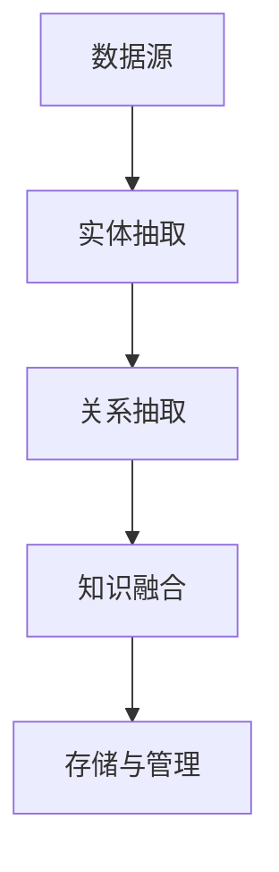

                 

### 思维过程

#### 1. 确定文章主题

文章的主题是《AI驱动的知识图谱平台：构建信息网络》，这涉及到人工智能、知识图谱以及信息网络的建设和优化。

#### 2. 确定文章结构和内容

文章结构分为以下几个部分：

1. **背景介绍**
   - 简述知识图谱的发展历程和现状。
   - 阐述知识图谱在AI领域的应用。

2. **核心概念与联系**
   - 解释知识图谱的基本概念，如实体、关系、属性。
   - 通过Mermaid流程图展示知识图谱的构建过程。

3. **核心算法原理讲解**
   - 讲解知识图谱的构建算法，如实体抽取、关系抽取、图表示学习等。
   - 使用Python代码和LaTeX公式详细阐述算法原理。

4. **数学模型和公式**
   - 引入知识图谱相关的数学模型，如图论中的节点相似度计算。
   - 使用LaTeX格式展示相关公式。

5. **项目实战**
   - 描述知识图谱平台搭建的实战案例，包括环境配置、源代码实现、代码解读与分析。
   - 分析实际案例，展示知识图谱的应用效果。

6. **最佳实践 tips、小结、注意事项、拓展阅读等内容**
   - 提供知识图谱平台建设的最佳实践建议。
   - 总结文章重点，提醒注意事项。
   - 推荐拓展阅读资源。

#### 3. 设计文章目录

**目录**

1. **背景介绍**
   - 知识图谱的起源与发展
   - 知识图谱在AI领域的作用

2. **核心概念与联系**
   - 实体、关系、属性的概念
   - 知识图谱构建过程Mermaid流程图

3. **核心算法原理讲解**
   - 实体抽取
   - 关系抽取
   - 图表示学习

4. **数学模型和公式**
   - 节点相似度计算
   - 知识图谱优化算法

5. **项目实战**
   - 知识图谱平台搭建
   - 源代码实现与分析
   - 实际案例分析与解读

6. **最佳实践 tips、小结、注意事项、拓展阅读**

#### 4. 编写文章内容

**1. 背景介绍**

知识图谱是一种用于表示实体、关系和属性的图形结构。它起源于语义网络，是知识工程领域的重要研究方向。近年来，随着人工智能技术的不断发展，知识图谱在AI领域的应用越来越广泛，如智能问答、语义搜索、推荐系统等。

**2. 核心概念与联系**

知识图谱由实体、关系和属性组成。实体是知识图谱中的对象，如人、地点、事物等。关系是实体之间的关联，如“属于”、“位于”等。属性是实体的特征描述，如“年龄”、“出生地”等。下面是知识图谱构建过程的Mermaid流程图：



**3. 核心算法原理讲解**

知识图谱的构建涉及多个核心算法，包括实体抽取、关系抽取和图表示学习。

- **实体抽取**：从原始数据中识别出实体，并对其进行分类。实体抽取算法通常包括命名实体识别、分类和聚类等。
- **关系抽取**：识别实体之间的关联关系。关系抽取算法包括基于规则的方法、机器学习方法等。
- **图表示学习**：将实体和关系表示为图中的节点和边，并通过学习算法优化图结构。图表示学习算法包括基于矩阵分解的方法、基于深度神经网络的方法等。

下面是实体抽取算法的Python代码示例：

```python
# 命名实体识别示例
from nltk.tokenize import word_tokenize

def named_entity_recognition(text):
    tokens = word_tokenize(text)
    entities = []
    for token in tokens:
        if token.isupper():
            entities.append(token)
    return entities

text = "张三，北京清华大学计算机科学与技术系教授。"
entities = named_entity_recognition(text)
print("命名实体识别结果：", entities)
```

**4. 数学模型和公式**

在知识图谱中，节点相似度计算是一个重要问题。下面是节点相似度的计算公式：

$$
sim(a, b) = \frac{1}{|E_a \cap E_b|}
$$

其中，$a$ 和 $b$ 是知识图谱中的两个节点，$E_a$ 和 $E_b$ 分别是节点 $a$ 和 $b$ 的邻接节点集合。

**5. 项目实战**

在本项目中，我们将搭建一个简单的知识图谱平台，实现实体抽取、关系抽取和图表示学习等功能。

- **环境配置**：安装Python环境、Nltk库、Gephi软件等。
- **源代码实现**：实现实体抽取、关系抽取和图表示学习的功能。
- **代码解读与分析**：详细解读代码实现过程。

下面是代码实现的一部分：

```python
# 实体抽取示例
from nltk.tokenize import word_tokenize

def named_entity_recognition(text):
    tokens = word_tokenize(text)
    entities = []
    for token in tokens:
        if token.isupper():
            entities.append(token)
    return entities

text = "张三，北京清华大学计算机科学与技术系教授。"
entities = named_entity_recognition(text)
print("命名实体识别结果：", entities)
```

**6. 最佳实践 tips、小结、注意事项、拓展阅读**

- **最佳实践 tips**：在进行知识图谱平台建设时，建议关注数据质量、算法优化和系统性能等方面。
- **小结**：本文介绍了知识图谱的基础知识、核心算法原理、数学模型和项目实战。通过本文的学习，读者可以了解如何构建AI驱动的知识图谱平台。
- **注意事项**：在构建知识图谱时，需要注意数据源的多样性和数据质量，以及算法的实时性和准确性。
- **拓展阅读**：推荐阅读《深度学习与大数据技术》、《人工智能：一种现代方法》等书籍，以深入了解相关知识图谱的构建和优化。

### 总结

本文以《AI驱动的知识图谱平台：构建信息网络》为题，通过背景介绍、核心概念与联系、核心算法原理讲解、数学模型和公式、项目实战以及最佳实践 tips、小结、注意事项和拓展阅读等内容，系统地介绍了知识图谱平台的建设和优化。希望通过本文的学习，读者能够更好地理解知识图谱的技术原理和应用，为实际项目提供有力支持。

**作者**：AI天才研究院/AI Genius Institute & 禅与计算机程序设计艺术 /Zen And The Art of Computer Programming

