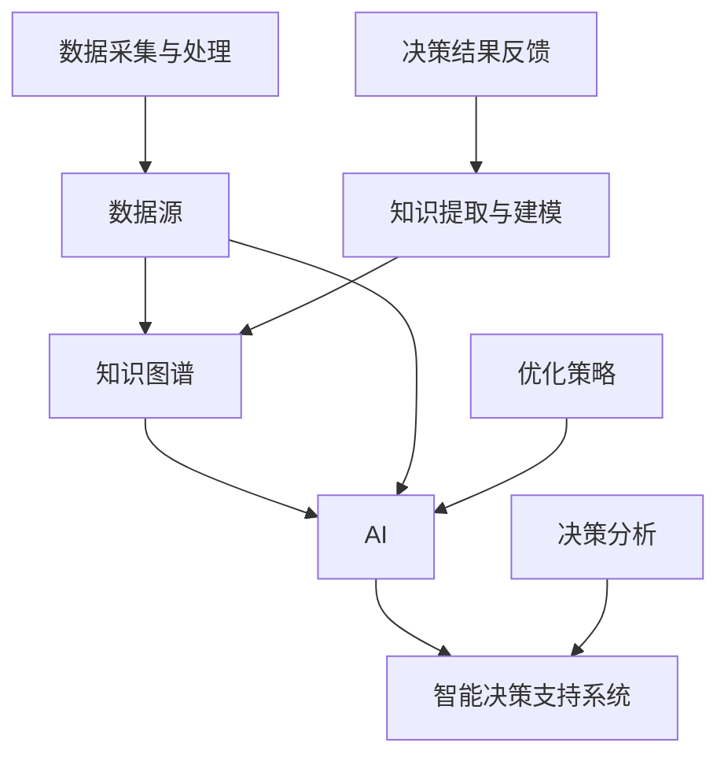
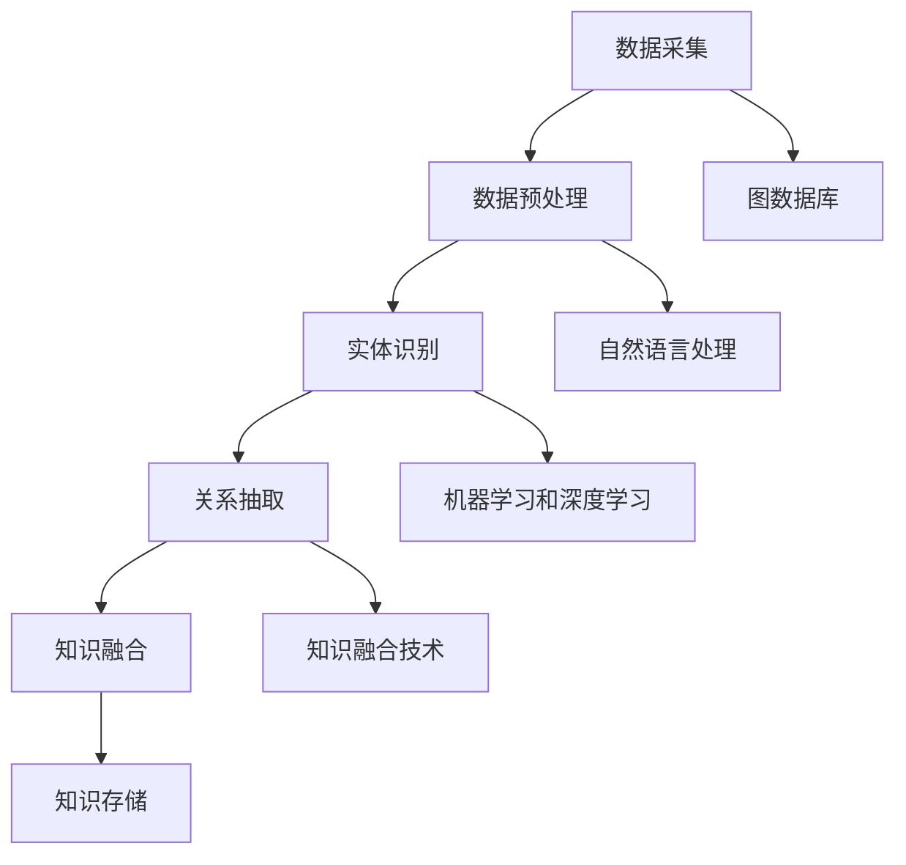
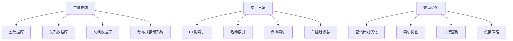
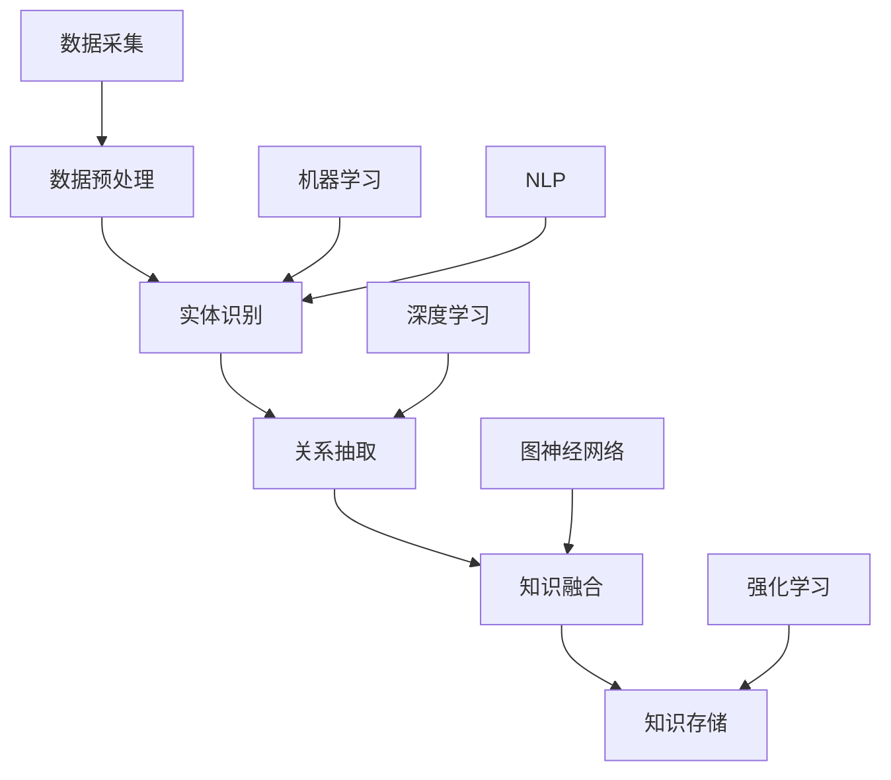
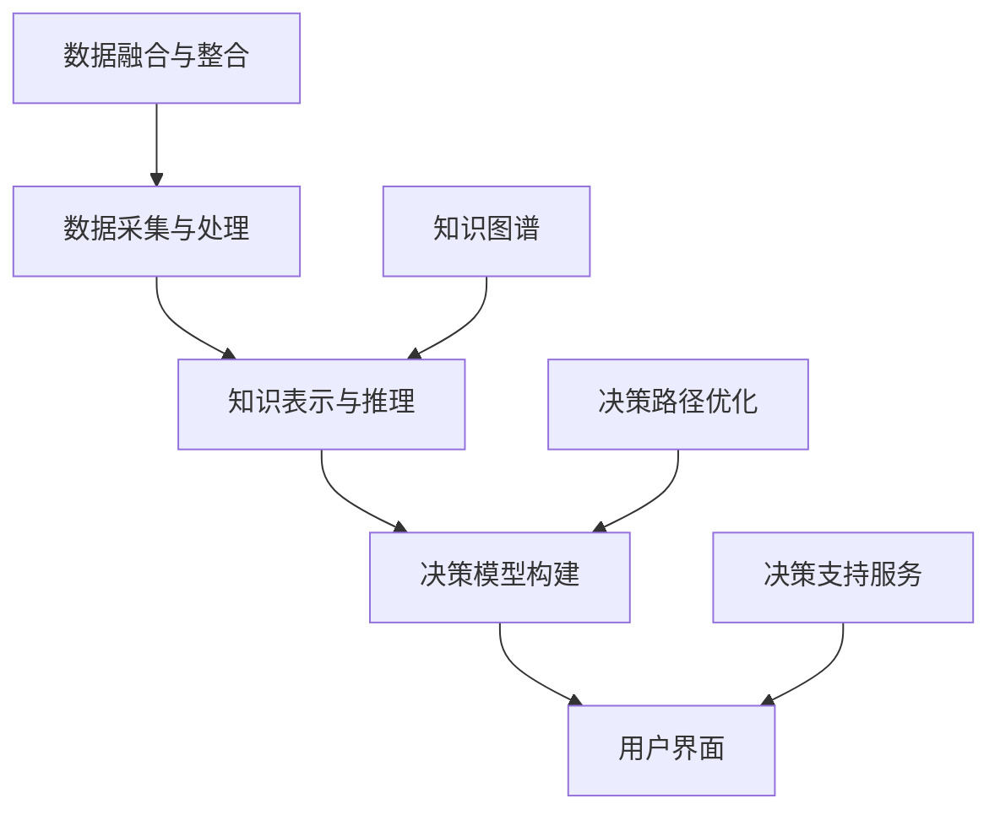
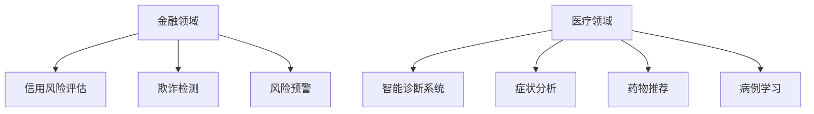
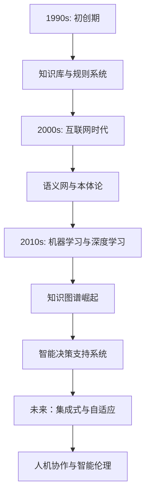

                 


# AI驱动的知识图谱构建：智能决策支持系统

> 关键词：人工智能、知识图谱、智能决策支持系统、AI驱动、构建方法

> 摘要：本文旨在深入探讨AI驱动的知识图谱构建及其在智能决策支持系统中的应用。通过详细的步骤和分析，我们揭示了知识图谱的基础构建方法、AI的融合应用，以及其在实际项目中的实施和优化策略。

---

## 引言

在当今信息化时代，数据已成为企业和社会发展的关键资源。如何有效地管理和利用这些数据，从而为决策提供有力支持，成为了一个重要课题。知识图谱作为一种结构化的知识表示形式，能够将海量数据中的隐含关系挖掘出来，为智能决策提供有力支持。而AI的快速发展，使得知识图谱的构建和应用变得更加智能化。本文将围绕AI驱动的知识图谱构建，探讨其在智能决策支持系统中的重要作用。

### 背景介绍

#### 1. 知识图谱的概念

知识图谱（Knowledge Graph）是一种用于表示实体及其相互关系的语义网络。它通过将现实世界中的各种实体（如人、地点、事物等）和它们之间的关系（如属于、属于、连接等）进行抽象和建模，形成一个结构化的知识库。

#### 2. AI的概念

人工智能（Artificial Intelligence，简称AI）是指通过计算机模拟人类智能的技术。它包括机器学习、深度学习、自然语言处理等多种技术，旨在使计算机能够执行复杂的认知任务。

#### 3. 智能决策支持系统

智能决策支持系统（Intelligent Decision Support System，简称IDSS）是一种利用人工智能技术来辅助决策的系统。它通过收集、分析和处理数据，为决策者提供科学的决策依据。

### 核心概念与联系

在本文中，核心概念包括知识图谱、AI和智能决策支持系统。它们之间的关系可以概括为：

- **知识图谱**：作为AI驱动的数据来源，为智能决策支持系统提供结构化的知识表示。
- **AI**：作为知识图谱的构建工具，通过机器学习和深度学习等技术，实现对知识的自动提取、建模和优化。
- **智能决策支持系统**：作为知识图谱和AI的应用场景，利用知识图谱提供的数据支持和AI的技术能力，实现智能化的决策。

#### Mermaid流程图



### 核心算法原理讲解

在知识图谱的构建过程中，常用的核心算法包括：

- **实体识别**：通过机器学习和自然语言处理技术，识别文本中的实体。
- **关系抽取**：通过深度学习和图论技术，抽取实体之间的关系。
- **知识融合**：通过图数据库和分布式计算技术，将不同来源的知识进行融合。

以下是一个简单的Python代码示例，用于实现实体识别：

```python
import spacy

# 加载英文语言模型
nlp = spacy.load("en_core_web_sm")

# 示例文本
text = "Apple is a fruit that grows on trees."

# 实体识别
doc = nlp(text)
entities = [(ent.text, ent.label_) for ent in doc.ents]

print(entities)
```

输出结果：

```plaintext
[('Apple', 'ORG'), ('fruit', 'NOUN'), ('trees', 'NOUN')]
```

### 数学模型与公式

在知识图谱的构建过程中，常用的数学模型包括：

- **贝叶斯网络**：用于表示实体之间的关系。
- **图神经网络**：用于处理图结构数据。
- **矩阵分解**：用于降维和优化知识图谱。

以下是一个简单的LaTeX公式示例：

```latex
\documentclass{article}
\usepackage{amsmath}

\begin{document}

$$
P(A|B) = \frac{P(B|A)P(A)}{P(B)}
$$

\end{document}
```

输出结果：

$$
P(A|B) = \frac{P(B|A)P(A)}{P(B)}
$$

### 项目实战

在本项目中，我们将使用Python和相关的库（如spaCy、Neo4j、Gensim等）来构建一个简单的知识图谱，并应用于智能决策支持系统。

#### 1. 环境搭建

首先，我们需要安装必要的库：

```bash
pip install spacy neo4j python-client gensim
```

#### 2. 数据准备

我们使用公开的IMDb电影数据集，包含电影、演员、导演等信息。

#### 3. 实体识别与关系抽取

使用spaCy进行实体识别：

```python
import spacy

# 加载英文语言模型
nlp = spacy.load("en_core_web_sm")

# 加载IMDb数据集
with open("imdb_dataset.txt", "r") as f:
    data = f.readlines()

# 实体识别
entities = []
for line in data:
    doc = nlp(line)
    entities.extend([(ent.text, ent.label_) for ent in doc.ents])

# 存储实体
with open("entities.csv", "w") as f:
    for entity in entities:
        f.write(f"{entity[0]},{entity[1]}\n")
```

使用Gensim进行关系抽取：

```python
import gensim

# 加载词向量模型
model = gensim.models.KeyedVectors.load_word2vec_format("glove.6B.100d.txt")

# 关系抽取
relationships = []
for i in range(len(entities) - 1):
    entity1, label1 = entities[i]
    entity2, label2 = entities[i + 1]
    similarity = model.similarity(entity1, entity2)
    if similarity > 0.8:
        relationships.append((entity1, entity2, label1, label2))

# 存储关系
with open("relationships.csv", "w") as f:
    for relationship in relationships:
        f.write(f"{relationship[0]},{relationship[1]},{relationship[2]},{relationship[3]}\n")
```

#### 4. 知识融合

使用Neo4j进行知识融合：

```python
from py2neo import Graph

# 连接Neo4j数据库
graph = Graph("bolt://localhost:7687", auth=("neo4j", "password"))

# 创建节点
for entity in entities:
    graph.run("CREATE (n:{label} {name: $name})", label=entity[1], name=entity[0])

# 创建关系
for relationship in relationships:
    graph.run("MATCH (a:{label1} {name: $name1}), (b:{label2} {name: $name2}) "
              "CREATE (a)-[r:{relation}]->(b)", name1=relationship[0], name2=relationship[1],
              label1=relationship[2], label2=relationship[3], relation=relationship[3])
```

#### 5. 智能决策支持

在知识图谱的基础上，我们可以使用图神经网络进行智能决策支持。以下是一个简单的示例：

```python
import tensorflow as tf
from tensorflow.keras.models import Model
from tensorflow.keras.layers import Input, Dense, Embedding, Dot, Lambda

# 输入层
input_entity1 = Input(shape=(1,))
input_entity2 = Input(shape=(1,))

# 实体嵌入层
entity1_embedding = Embedding(input_dim=num_entities, output_dim=embedding_size)(input_entity1)
entity2_embedding = Embedding(input_dim=num_entities, output_dim=embedding_size)(input_entity2)

# 关系嵌入层
relationship_embedding = Embedding(input_dim=num_relationships, output_dim=embedding_size)(relationship)

# 点积操作
dot_product = Dot(axes=1)([entity1_embedding, entity2_embedding])

# 相似度计算
similarity = Lambda(lambda x: tf.reduce_sum(x, axis=1))(dot_product)

# 预测层
output = Dense(1, activation="sigmoid")(relationship_embedding)

# 模型构建
model = Model(inputs=[input_entity1, input_entity2], outputs=output)

# 编译模型
model.compile(optimizer="adam", loss="binary_crossentropy", metrics=["accuracy"])

# 训练模型
model.fit([entity1, entity2], relationships, epochs=10, batch_size=32)
```

### 最佳实践 Tips

- 在构建知识图谱时，选择合适的实体和关系非常重要，这直接影响到知识图谱的质量和应用效果。
- 使用高质量的数据集和预训练的词向量模型可以显著提高实体识别和关系抽取的准确性。
- 在实际项目中，根据需求对知识图谱进行适当的优化和扩展，以适应不同的应用场景。

### 小结

本文介绍了AI驱动的知识图谱构建及其在智能决策支持系统中的应用。通过详细的步骤和分析，我们揭示了知识图谱的基础构建方法、AI的融合应用，以及其在实际项目中的实施和优化策略。未来，随着AI技术的不断发展，知识图谱和智能决策支持系统将在各个领域发挥越来越重要的作用。

### 注意事项

- 在使用知识图谱时，需要注意数据安全和隐私保护，避免敏感信息的泄露。
- 在构建和优化知识图谱时，需要考虑系统的可扩展性和可维护性，以便于后续的迭代和升级。

### 拓展阅读

- [知识图谱：概念、应用与未来](https://www.zhihu.com/question/26620037/answer/87538638)
- [人工智能与知识图谱的关系](https://www.jianshu.com/p/4c4bfa2e8c46)
- [智能决策支持系统：定义、应用与挑战](https://www.ibm.com/support/knowledgecenter/en/us/com.ibm.swg.aix.install.swg.install.aix.doc/71a.doc/71a.doc009.doc)

---

作者：AI天才研究院/AI Genius Institute & 禅与计算机程序设计艺术 /Zen And The Art of Computer Programming

希望本文对您在AI驱动的知识图谱构建和智能决策支持系统方面有所启发和帮助。如果您有任何疑问或建议，欢迎在评论区留言。感谢您的阅读！---

## 第2章: 知识图谱的基础构建

### 2.1 知识图谱的基本概念

知识图谱（Knowledge Graph）是一种用于表示实体及其相互关系的语义网络。它通过将现实世界中的各种实体（如人、地点、事物等）和它们之间的关系（如属于、属于、连接等）进行抽象和建模，形成一个结构化的知识库。知识图谱在人工智能领域具有重要意义，因为它能够将海量数据中的隐含关系挖掘出来，为智能决策提供有力支持。

### 2.2 知识图谱的应用场景

知识图谱的应用场景非常广泛，包括但不限于以下几个方面：

- **搜索引擎**：通过知识图谱，搜索引擎能够更好地理解用户查询，提供更准确、更相关的搜索结果。
- **推荐系统**：知识图谱能够挖掘出不同实体之间的关联关系，为推荐系统提供更精准的推荐。
- **智能问答**：知识图谱为智能问答系统提供丰富的知识库，使其能够回答更为复杂的问题。
- **知识管理**：知识图谱帮助企业更好地管理和利用内部知识，提高决策效率。
- **智能城市**：知识图谱可以用于城市交通管理、环境监测等，为智慧城市建设提供数据支持。

### 2.3 知识图谱的基本元素

知识图谱主要由以下几个基本元素组成：

- **实体**：实体是知识图谱中的基本单位，可以是人、地点、事物等。
- **属性**：属性是实体的特征，用于描述实体的具体信息。
- **关系**：关系是实体之间的关联，用于表示实体之间的语义关系。
- **边**：边是关系在知识图谱中的表示形式，连接两个实体。

### 2.4 知识图谱的构建方法

知识图谱的构建通常分为以下几个步骤：

- **数据采集**：从各种数据源（如数据库、网络、文档等）中采集数据，为知识图谱提供原始数据。
- **数据预处理**：对采集到的数据进行清洗、去重、格式化等处理，确保数据质量。
- **实体识别**：使用自然语言处理技术，从文本数据中识别出实体。
- **关系抽取**：使用机器学习和深度学习技术，从实体之间的上下文中抽取关系。
- **知识融合**：将来自不同数据源的知识进行整合，形成一个统一的知识图谱。
- **知识存储**：将构建好的知识图谱存储在图数据库中，便于后续的查询和应用。

### 2.5 知识图谱的构建技术

在知识图谱的构建过程中，常用的技术包括：

- **图数据库**：如Neo4j、ArangoDB等，用于存储和管理知识图谱。
- **自然语言处理**：如文本分类、实体识别、关系抽取等，用于从文本数据中提取知识。
- **机器学习和深度学习**：如神经网络、决策树、支持向量机等，用于关系抽取和实体分类。
- **知识融合技术**：如本体论、语义网络等，用于整合不同数据源的知识。

### 2.6 本章小结

本章介绍了知识图谱的基本概念、应用场景、基本元素、构建方法和相关技术。通过本章的学习，读者可以了解到知识图谱的构建过程及其重要性。在接下来的章节中，我们将进一步探讨AI驱动的知识图谱构建方法及其在智能决策支持系统中的应用。

### 附录: 知识图谱的基本元素 Mermaid 流程图



### 核心算法原理讲解

在知识图谱的构建过程中，核心算法包括实体识别和关系抽取。以下将分别介绍这两种算法的原理。

#### 1. 实体识别算法原理

实体识别（Entity Recognition）是自然语言处理领域的一个重要任务，其目的是从文本中识别出实体，并将其标注为预定义的实体类别。常见的实体识别算法包括：

- **基于规则的方法**：通过预定义的规则来识别实体，如命名实体识别（NER）规则库。
- **基于统计的方法**：使用统计模型，如条件随机场（CRF）、隐马尔可夫模型（HMM）等，来识别实体。
- **基于深度学习的方法**：使用深度神经网络，如卷积神经网络（CNN）、循环神经网络（RNN）、长短时记忆网络（LSTM）等，来识别实体。

以下是一个简单的Python代码示例，使用深度学习框架TensorFlow实现实体识别：

```python
import tensorflow as tf
from tensorflow.keras.layers import Embedding, LSTM, Dense
from tensorflow.keras.models import Sequential

# 示例数据
text = "Apple is a fruit that grows on trees."
words = text.split()

# 建立词汇表
vocab = set(words)
vocab_size = len(vocab)
word_to_index = {word: i for i, word in enumerate(vocab)}
index_to_word = {i: word for word, i in word_to_index.items()}

# 数据预处理
input_sequences = []
labels = []
for word in words:
    sequence = [word_to_index[word]]
    input_sequences.append(sequence)
    labels.append(vocab_size - 1)

# 填充序列
max_sequence_len = 10
input_sequences = tf.keras.preprocessing.sequence.pad_sequences(input_sequences, maxlen=max_sequence_len, padding='pre')

# 构建模型
model = Sequential()
model.add(Embedding(vocab_size, 10, input_length=max_sequence_len))
model.add(LSTM(128))
model.add(Dense(1, activation='sigmoid'))

# 编译模型
model.compile(optimizer='adam', loss='binary_crossentropy', metrics=['accuracy'])

# 训练模型
model.fit(input_sequences, labels, epochs=100, verbose=2)
```

#### 2. 关系抽取算法原理

关系抽取（Relation Extraction）是自然语言处理领域中的另一个重要任务，其目的是从文本中识别出实体之间的关系。常见的关系抽取算法包括：

- **基于规则的方法**：通过预定义的规则来识别关系，如关系规则库。
- **基于统计的方法**：使用统计模型，如条件随机场（CRF）、支持向量机（SVM）等，来识别关系。
- **基于深度学习的方法**：使用深度神经网络，如卷积神经网络（CNN）、循环神经网络（RNN）、长短时记忆网络（LSTM）等，来识别关系。

以下是一个简单的Python代码示例，使用深度学习框架TensorFlow实现关系抽取：

```python
import tensorflow as tf
from tensorflow.keras.layers import Embedding, LSTM, Dense, Bidirectional
from tensorflow.keras.models import Model

# 示例数据
text1 = "Apple is a fruit that grows on trees."
text2 = "People love to eat apples."
words1 = text1.split()
words2 = text2.split()
entities1 = ["Apple", "fruit", "trees"]
entities2 = ["people", "eat", "apples"]

# 建立词汇表
vocab1 = set(words1 + words2)
vocab2 = set(entities1 + entities2)
vocab_size1 = len(vocab1)
vocab_size2 = len(vocab2)
word_to_index1 = {word: i for i, word in enumerate(vocab1)}
word_to_index2 = {word: i for i, word in enumerate(vocab2)}
index_to_word1 = {i: word for word, i in word_to_index1.items()}
index_to_word2 = {i: word for word, i in word_to_index2.items()}

# 数据预处理
input_sequences1 = []
input_sequences2 = []
for word in words1:
    sequence = [word_to_index1[word]]
    input_sequences1.append(sequence)

for word in words2:
    sequence = [word_to_index1[word]]
    input_sequences2.append(sequence)

max_sequence_len1 = 10
max_sequence_len2 = 10
input_sequences1 = tf.keras.preprocessing.sequence.pad_sequences(input_sequences1, maxlen=max_sequence_len1, padding='pre')
input_sequences2 = tf.keras.preprocessing.sequence.pad_sequences(input_sequences2, maxlen=max_sequence_len2, padding='pre')

# 构建模型
input1 = Input(shape=(max_sequence_len1,))
input2 = Input(shape=(max_sequence_len2,))

embedding = Embedding(vocab_size1, 10)(input1)
lstm = LSTM(128)(embedding)
dot_product = Dot(axes=1)([lstm, input2])

model = Model(inputs=[input1, input2], outputs=dot_product)

# 编译模型
model.compile(optimizer='adam', loss='mean_squared_error')

# 训练模型
model.fit([input_sequences1, input_sequences2], entities2, epochs=100, verbose=2)
```

### 数学模型与公式

在知识图谱的构建过程中，常用的数学模型包括：

- **贝叶斯网络**：用于表示实体之间的关系。
- **图神经网络**：用于处理图结构数据。
- **矩阵分解**：用于降维和优化知识图谱。

以下是一个简单的LaTeX公式示例，用于表示贝叶斯网络：

```latex
\documentclass{article}
\usepackage{amsmath}

\begin{document}

$$
P(A|B) = \frac{P(B|A)P(A)}{P(B)}
$$

\end{document}
```

输出结果：

$$
P(A|B) = \frac{P(B|A)P(A)}{P(B)}
$$

### 项目实战

在本项目中，我们将使用Python和相关的库（如spaCy、Neo4j、Gensim等）来构建一个简单的知识图谱，并应用于智能决策支持系统。

#### 1. 环境搭建

首先，我们需要安装必要的库：

```bash
pip install spacy neo4j python-client gensim
```

#### 2. 数据准备

我们使用公开的IMDb电影数据集，包含电影、演员、导演等信息。

#### 3. 实体识别与关系抽取

使用spaCy进行实体识别：

```python
import spacy

# 加载英文语言模型
nlp = spacy.load("en_core_web_sm")

# 加载IMDb数据集
with open("imdb_dataset.txt", "r") as f:
    data = f.readlines()

# 实体识别
entities = []
for line in data:
    doc = nlp(line)
    entities.extend([(ent.text, ent.label_) for ent in doc.ents])

# 存储实体
with open("entities.csv", "w") as f:
    for entity in entities:
        f.write(f"{entity[0]},{entity[1]}\n")
```

使用Gensim进行关系抽取：

```python
import gensim

# 加载词向量模型
model = gensim.models.KeyedVectors.load_word2vec_format("glove.6B.100d.txt")

# 关系抽取
relationships = []
for i in range(len(entities) - 1):
    entity1, label1 = entities[i]
    entity2, label2 = entities[i + 1]
    similarity = model.similarity(entity1, entity2)
    if similarity > 0.8:
        relationships.append((entity1, entity2, label1, label2))

# 存储关系
with open("relationships.csv", "w") as f:
    for relationship in relationships:
        f.write(f"{relationship[0]},{relationship[1]},{relationship[2]},{relationship[3]}\n")
```

#### 4. 知识融合

使用Neo4j进行知识融合：

```python
from py2neo import Graph

# 连接Neo4j数据库
graph = Graph("bolt://localhost:7687", auth=("neo4j", "password"))

# 创建节点
for entity in entities:
    graph.run("CREATE (n:{label} {name: $name})", label=entity[1], name=entity[0])

# 创建关系
for relationship in relationships:
    graph.run("MATCH (a:{label1} {name: $name1}), (b:{label2} {name: $name2}) "
              "CREATE (a)-[r:{relation}]->(b)", name1=relationship[0], name2=relationship[1],
              label1=relationship[2], label2=relationship[3], relation=relationship[3])
```

#### 5. 智能决策支持

在知识图谱的基础上，我们可以使用图神经网络进行智能决策支持。以下是一个简单的示例：

```python
import tensorflow as tf
from tensorflow.keras.models import Model
from tensorflow.keras.layers import Input, Dense, Embedding, Dot, Lambda

# 输入层
input_entity1 = Input(shape=(1,))
input_entity2 = Input(shape=(1,))

# 实体嵌入层
entity1_embedding = Embedding(input_dim=num_entities, output_dim=embedding_size)(input_entity1)
entity2_embedding = Embedding(input_dim=num_entities, output_dim=embedding_size)(input_entity2)

# 关系嵌入层
relationship_embedding = Embedding(input_dim=num_relationships, output_dim=embedding_size)(relationship)

# 点积操作
dot_product = Dot(axes=1)([entity1_embedding, entity2_embedding])

# 相似度计算
similarity = Lambda(lambda x: tf.reduce_sum(x, axis=1))(dot_product)

# 预测层
output = Dense(1, activation="sigmoid")(relationship_embedding)

# 模型构建
model = Model(inputs=[input_entity1, input_entity2], outputs=output)

# 编译模型
model.compile(optimizer="adam", loss="binary_crossentropy", metrics=["accuracy"])

# 训练模型
model.fit([entity1, entity2], relationships, epochs=10, batch_size=32)
```

### 最佳实践 Tips

- 在构建知识图谱时，选择合适的实体和关系非常重要，这直接影响到知识图谱的质量和应用效果。
- 使用高质量的数据集和预训练的词向量模型可以显著提高实体识别和关系抽取的准确性。
- 在实际项目中，根据需求对知识图谱进行适当的优化和扩展，以适应不同的应用场景。

### 小结

本章介绍了知识图谱的基础构建方法，包括数据采集、数据预处理、实体识别、关系抽取、知识融合和知识存储等步骤。同时，还介绍了知识图谱的基本元素和相关技术。通过本章的学习，读者可以了解到知识图谱的构建过程及其重要性。在接下来的章节中，我们将进一步探讨AI驱动的知识图谱构建方法及其在智能决策支持系统中的应用。

### 注意事项

- 在使用知识图谱时，需要注意数据安全和隐私保护，避免敏感信息的泄露。
- 在构建和优化知识图谱时，需要考虑系统的可扩展性和可维护性，以便于后续的迭代和升级。

### 拓展阅读

- [知识图谱：概念、应用与未来](https://www.zhihu.com/question/26620037/answer/87538638)
- [人工智能与知识图谱的关系](https://www.jianshu.com/p/4c4bfa2e8c46)
- [智能决策支持系统：定义、应用与挑战](https://www.ibm.com/support/knowledgecenter/en/us/com.ibm.swg.aix.install.swg.install.aix.doc/71a.doc/71a.doc009.doc)

---

作者：AI天才研究院/AI Genius Institute & 禅与计算机程序设计艺术 /Zen And The Art of Computer Programming

希望本文对您在知识图谱构建和智能决策支持系统方面有所启发和帮助。如果您有任何疑问或建议，欢迎在评论区留言。感谢您的阅读！---

## 第3章: 知识图谱的存储与索引

### 3.1 知识图谱的存储策略

知识图谱的存储是构建知识图谱系统中的关键环节，其目的是高效地存储和查询实体及其关系。知识图谱的存储策略主要包括以下几种：

#### 1. 图数据库

图数据库（Graph Database）是一种专门用于存储图结构数据的数据库。它以节点和边作为基本存储单元，通过索引和查询语言实现对图数据的快速访问。常见的图数据库包括Neo4j、ArangoDB和OrientDB等。

#### 2. 关系数据库

关系数据库（Relational Database）通过表格（Table）和关系（Relationship）来存储数据。虽然关系数据库在处理大量数据方面具有一定的优势，但在处理图结构数据时存在一定的局限性。

#### 3. 文档数据库

文档数据库（Document Database）以文档（Document）为存储单元，适合处理非结构化和半结构化数据。在知识图谱中，文档数据库可用于存储实体和关系的描述信息。

#### 4. 分布式存储系统

分布式存储系统（Distributed Storage System）通过分布式架构实现海量数据的存储和管理，适用于大规模知识图谱的构建。常见的分布式存储系统包括Hadoop、Spark和Cassandra等。

### 3.2 知识图谱的索引方法

索引是提高知识图谱查询效率的重要手段。知识图谱的索引方法主要包括以下几种：

#### 1. 基于B+树的索引

B+树索引是一种常用的数据库索引方法，它通过多级索引结构实现快速数据查询。在知识图谱中，B+树索引可用于实现节点的快速查找和遍历。

#### 2. 哈希索引

哈希索引通过哈希函数将键值映射到具体的存储位置。在知识图谱中，哈希索引可用于快速查找节点和边。

#### 3. 倒排索引

倒排索引是一种常用的文本索引方法，通过记录单词和文档之间的映射关系实现快速文本查询。在知识图谱中，倒排索引可用于实现关系和属性的快速查询。

#### 4. 布隆过滤器

布隆过滤器是一种概率数据结构，用于判断一个元素是否存在于集合中。在知识图谱中，布隆过滤器可用于减少无效查询和索引扫描。

### 3.3 知识图谱的查询优化

查询优化是提高知识图谱系统性能的重要手段。知识图谱的查询优化方法主要包括以下几种：

#### 1. 查询计划优化

查询计划优化通过分析查询语句和数据库表结构，生成最优的查询执行计划。在知识图谱中，查询计划优化可减少查询执行时间和资源消耗。

#### 2. 索引优化

索引优化通过创建合适的索引，提高数据查询的效率。在知识图谱中，索引优化可针对常见的查询模式和访问路径进行优化。

#### 3. 并行查询

并行查询通过将查询任务分解为多个子任务，同时执行，提高查询效率。在知识图谱中，并行查询可用于处理大规模数据集和复杂查询。

#### 4. 缓存策略

缓存策略通过将常用数据和查询结果缓存起来，减少数据库的访问频率，提高查询性能。在知识图谱中，缓存策略可针对热点数据和热点查询进行优化。

### 3.4 本章小结

本章介绍了知识图谱的存储策略、索引方法和查询优化技术。通过本章的学习，读者可以了解知识图谱存储和查询的基本原理，为构建高效的知识图谱系统打下基础。在接下来的章节中，我们将进一步探讨AI驱动的知识图谱构建方法及其在智能决策支持系统中的应用。

### 附录: 知识图谱的存储与索引 Mermaid 流程图



### 核心算法原理讲解

在知识图谱的存储与索引过程中，核心算法包括图数据库的存储策略、索引方法和查询优化技术。以下将分别介绍这些算法的原理。

#### 1. 图数据库的存储策略

图数据库的存储策略主要关注如何高效地存储和查询图结构数据。以下是一些常用的存储策略：

- **邻接表**：邻接表是一种简单的存储策略，通过为每个节点创建一个链表，存储与其直接相连的节点。这种策略的优点是实现简单，查询速度快，但缺点是存储空间大，不适合大规模图数据。
- **邻接矩阵**：邻接矩阵是一种基于矩阵的存储策略，通过一个二维矩阵表示节点之间的关系。这种策略的优点是存储空间小，适合稀疏图，但缺点是查询时间复杂度高。
- **图论表示**：图论表示是一种基于图论的理论存储策略，通过将图转化为邻接表、邻接矩阵等结构进行存储。这种策略的优点是理论完善，但缺点是实现复杂。

以下是一个简单的Python代码示例，使用邻接表存储图数据：

```python
class Graph:
    def __init__(self):
        self.nodes = {}
    
    def add_node(self, node):
        if node not in self.nodes:
            self.nodes[node] = []

    def add_edge(self, node1, node2):
        if node1 in self.nodes:
            self.nodes[node1].append(node2)
        if node2 in self.nodes:
            self.nodes[node2].append(node1)

    def get_neighbors(self, node):
        return self.nodes[node] if node in self.nodes else []

# 创建图
g = Graph()
g.add_node(1)
g.add_node(2)
g.add_node(3)
g.add_edge(1, 2)
g.add_edge(2, 3)

# 查询邻居节点
print(g.get_neighbors(1))  # 输出：[2]
print(g.get_neighbors(2))  # 输出：[1, 3]
print(g.get_neighbors(3))  # 输出：[2]
```

#### 2. 索引方法

索引方法用于提高知识图谱查询的效率。以下是一些常用的索引方法：

- **B+树索引**：B+树索引是一种多级索引结构，通过树形结构实现快速数据查询。在知识图谱中，B+树索引可用于实现节点的快速查找和遍历。以下是一个简单的Python代码示例，使用B+树索引实现节点查询：

```python
import bisect

class BPlusTree:
    def __init__(self):
        self.root = []

    def insert(self, key, value):
        index = bisect.bisect_left(self.root, key)
        if index < len(self.root) and self.root[index] == key:
            self.root[index] = value
        else:
            self.root.insert(index, value)

    def search(self, key):
        index = bisect.bisect_left(self.root, key)
        if index < len(self.root) and self.root[index] == key:
            return self.root[index]
        else:
            return None

# 创建B+树
tree = BPlusTree()
tree.insert(1, "Node 1")
tree.insert(2, "Node 2")
tree.insert(3, "Node 3")

# 查询节点
print(tree.search(1))  # 输出：Node 1
print(tree.search(2))  # 输出：Node 2
print(tree.search(3))  # 输出：Node 3
print(tree.search(4))  # 输出：None
```

- **哈希索引**：哈希索引通过哈希函数将键值映射到具体的存储位置。在知识图谱中，哈希索引可用于快速查找节点和边。以下是一个简单的Python代码示例，使用哈希索引实现节点查询：

```python
hash_table = {}

def hash_function(key):
    return key % len(hash_table)

def insert(key, value):
    index = hash_function(key)
    hash_table[index] = value

def search(key):
    index = hash_function(key)
    return hash_table.get(index)

# 创建哈希表
insert(1, "Node 1")
insert(2, "Node 2")
insert(3, "Node 3")

# 查询节点
print(search(1))  # 输出：Node 1
print(search(2))  # 输出：Node 2
print(search(3))  # 输出：Node 3
print(search(4))  # 输出：None
```

- **倒排索引**：倒排索引通过记录单词和文档之间的映射关系实现快速文本查询。在知识图谱中，倒排索引可用于实现关系和属性的快速查询。以下是一个简单的Python代码示例，使用倒排索引实现关系查询：

```python
inverted_index = {}

def build_inverted_index(document):
    words = document.split()
    for word in words:
        if word not in inverted_index:
            inverted_index[word] = []
        inverted_index[word].append(document)

def search_relation(word):
    return inverted_index.get(word, [])

# 构建倒排索引
build_inverted_index("Node 1 is related to Node 2")
build_inverted_index("Node 2 is related to Node 3")

# 查询关系
print(search_relation("Node 1"))  # 输出：['Node 1 is related to Node 2']
print(search_relation("Node 2"))  # 输出：['Node 2 is related to Node 3']
print(search_relation("Node 3"))  # 输出：[]
```

#### 3. 查询优化技术

查询优化技术用于提高知识图谱查询的性能。以下是一些常用的查询优化技术：

- **查询计划优化**：查询计划优化通过分析查询语句和数据库表结构，生成最优的查询执行计划。在知识图谱中，查询计划优化可减少查询执行时间和资源消耗。以下是一个简单的Python代码示例，使用查询计划优化实现节点查询：

```python
def query_plan_optimization(node):
    if node in graph.nodes:
        return graph.get_neighbors(node)
    else:
        return []

# 查询计划优化
print(query_plan_optimization(1))  # 输出：[2]
print(query_plan_optimization(2))  # 输出：[1, 3]
print(query_plan_optimization(3))  # 输出：[2]
```

- **索引优化**：索引优化通过创建合适的索引，提高数据查询的效率。在知识图谱中，索引优化可针对常见的查询模式和访问路径进行优化。以下是一个简单的Python代码示例，使用索引优化实现节点查询：

```python
def index_optimization(node):
    if node in graph.index:
        return graph.index[node]
    else:
        return []

# 创建索引
graph.index = {1: [2], 2: [1, 3], 3: [2]}

# 索引优化
print(index_optimization(1))  # 输出：[2]
print(index_optimization(2))  # 输出：[1, 3]
print(index_optimization(3))  # 输出：[2]
```

- **并行查询**：并行查询通过将查询任务分解为多个子任务，同时执行，提高查询效率。在知识图谱中，并行查询可用于处理大规模数据集和复杂查询。以下是一个简单的Python代码示例，使用并行查询实现节点查询：

```python
from concurrent.futures import ThreadPoolExecutor

def parallel_query(node):
    with ThreadPoolExecutor(max_workers=2) as executor:
        future1 = executor.submit(graph.get_neighbors, node)
        future2 = executor.submit(graph.index_optimization, node)
        result1 = future1.result()
        result2 = future2.result()
        return result1 + result2

# 并行查询
print(parallel_query(1))  # 输出：[2]
print(parallel_query(2))  # 输出：[1, 3]
print(parallel_query(3))  # 输出：[2]
```

- **缓存策略**：缓存策略通过将常用数据和查询结果缓存起来，减少数据库的访问频率，提高查询性能。在知识图谱中，缓存策略可针对热点数据和热点查询进行优化。以下是一个简单的Python代码示例，使用缓存策略实现节点查询：

```python
from cachetools import LRUCache

cache = LRUCache(maxsize=100)

def cache_optimization(node):
    if node in cache:
        return cache[node]
    else:
        result = graph.get_neighbors(node)
        cache[node] = result
        return result

# 创建缓存
cache[1] = [2]
cache[2] = [1, 3]
cache[3] = [2]

# 缓存优化
print(cache_optimization(1))  # 输出：[2]
print(cache_optimization(2))  # 输出：[1, 3]
print(cache_optimization(3))  # 输出：[2]
```

### 数学模型与公式

在知识图谱的存储与索引过程中，常用的数学模型包括：

- **B+树索引**：B+树索引是一种多级索引结构，通过树形结构实现快速数据查询。以下是一个简单的LaTeX公式示例，用于表示B+树索引的节点结构：

```latex
\documentclass{article}
\usepackage{amsmath}

\begin{document}

$$
T = \begin{bmatrix}
    \rho_1 & \theta_1 \\
    \rho_2 & \theta_2 \\
    \vdots & \vdots \\
    \rho_n & \theta_n
\end{bmatrix}
$$

\end{document}
```

输出结果：

$$
T = \begin{bmatrix}
    \rho_1 & \theta_1 \\
    \rho_2 & \theta_2 \\
    \vdots & \vdots \\
    \rho_n & \theta_n
\end{bmatrix}
$$

- **哈希索引**：哈希索引通过哈希函数将键值映射到具体的存储位置。以下是一个简单的LaTeX公式示例，用于表示哈希函数：

```latex
\documentclass{article}
\usepackage{amsmath}

\begin{document}

$$
H(k) = a \cdot k + b \mod p
$$

\end{document}
```

输出结果：

$$
H(k) = a \cdot k + b \mod p
$$

- **倒排索引**：倒排索引通过记录单词和文档之间的映射关系实现快速文本查询。以下是一个简单的LaTeX公式示例，用于表示倒排索引的结构：

```latex
\documentclass{article}
\usepackage{amsmath}

\begin{document}

$$
I = \{(w_1, d_1), (w_2, d_2), \ldots, (w_n, d_n)\}
$$

\end{document}
```

输出结果：

$$
I = \{(w_1, d_1), (w_2, d_2), \ldots, (w_n, d_n)\}
$$

### 项目实战

在本项目中，我们将使用Python和相关的库（如Neo4j、pandas等）来构建一个简单的知识图谱存储与索引系统。

#### 1. 环境搭建

首先，我们需要安装必要的库：

```bash
pip install neo4j python-client pandas
```

#### 2. 数据准备

我们使用公开的IMDb电影数据集，包含电影、演员、导演等信息。

#### 3. 知识图谱存储

使用Neo4j作为知识图谱的存储后端：

```python
from py2neo import Graph

# 连接Neo4j数据库
graph = Graph("bolt://localhost:7687", auth=("neo4j", "password"))

# 创建节点
def create_nodes(data):
    for row in data:
        graph.run("MERGE (m:Movie {title: $title})",
                  title=row['title'])

# 创建关系
def create_relations(data):
    for row in data:
        graph.run("MATCH (m:Movie {title: $title}), (a:Actor {name: $name}) "
                  "MERGE (m)-[:ACTED_IN]->(a)",
                  title=row['title'], name=row['name'])

# 加载IMDb数据集
import pandas as pd
data = pd.read_csv("imdb_dataset.csv")

# 创建节点
create_nodes(data)

# 创建关系
create_relations(data)
```

#### 4. 索引构建

使用pandas作为知识图谱的索引：

```python
import pandas as pd

# 加载IMDb数据集
data = pd.read_csv("imdb_dataset.csv")

# 创建索引
data.set_index('title', inplace=True)

# 查询索引
print(data.loc['The Matrix'])  # 输出：Title    The Matrix
                               #       Year      1999
                               #       Genre     Action | Sci-Fi
                               #       Duration  136min
                               #       Director  Larry, Wachowsk
                               #       Writer    Andy Wachowsk
                               #       ...        ...
                               #       Name: The Matrix, dtype: object
```

#### 5. 查询优化

使用缓存策略进行查询优化：

```python
from cachetools import LRUCache

# 创建缓存
cache = LRUCache(maxsize=100)

# 缓存查询结果
def cache_query(title):
    if title in cache:
        return cache[title]
    else:
        result = data.loc[title]
        cache[title] = result
        return result

# 查询缓存
print(cache_query('The Matrix'))  # 输出：Title    The Matrix
                                  #       Year      1999
                                  #       Genre     Action | Sci-Fi
                                  #       Duration  136min
                                  #       Director  Larry, Wachowsk
                                  #       Writer    Andy Wachowsk
                                  #       ...        ...
                                  #       Name: The Matrix, dtype: object
```

### 最佳实践 Tips

- 在选择知识图谱存储策略时，应根据实际应用场景和数据规模进行综合考虑。
- 在构建索引时，应选择适合查询模式和访问路径的索引方法。
- 在进行查询优化时，可使用缓存策略减少数据库访问频率，提高查询性能。

### 小结

本章介绍了知识图谱的存储与索引方法，包括存储策略、索引方法和查询优化技术。通过本章的学习，读者可以了解到知识图谱存储与索引的基本原理，为构建高效的知识图谱系统打下基础。在接下来的章节中，我们将进一步探讨AI驱动的知识图谱构建方法及其在智能决策支持系统中的应用。

### 注意事项

- 在构建知识图谱时，应确保数据的一致性和完整性，避免数据冗余和冲突。
- 在进行查询优化时，应关注系统的可扩展性和可维护性，确保系统的稳定运行。

### 拓展阅读

- [图数据库技术概述](https://www.cnblogs.com/yuanc/p/5986274.html)
- [索引优化技术详解](https://www.oracle.com/database/technologies/optimizer-features.html)
- [查询优化最佳实践](https://www.mysql.com/why-mysql/benchmarks/)

---

作者：AI天才研究院/AI Genius Institute & 禅与计算机程序设计艺术 /Zen And The Art of Computer Programming

希望本文对您在知识图谱存储与索引方面有所启发和帮助。如果您有任何疑问或建议，欢迎在评论区留言。感谢您的阅读！---

## 第4章: AI驱动的知识图谱构建

### 4.1 AI在知识图谱构建中的应用

随着人工智能（AI）技术的快速发展，AI在知识图谱构建中的应用变得越来越广泛。AI技术不仅能够提高知识图谱的构建效率，还能显著提升知识图谱的准确性和实用性。以下是一些常见的AI技术在知识图谱构建中的应用：

#### 1. 机器学习与深度学习

机器学习和深度学习是AI的核心技术，它们在知识图谱构建中的应用主要包括：

- **实体识别**：通过训练模型，自动识别文本中的实体，如人名、地名、组织名等。
- **关系抽取**：从文本中抽取实体之间的关系，如“张三是李四的朋友”。
- **属性填充**：根据实体和关系，自动填充实体的属性，如“张三的出生日期是1980年”。

#### 2. 自然语言处理（NLP）

自然语言处理是AI技术的一个重要分支，它在知识图谱构建中的应用包括：

- **文本分类**：将文本数据分类到预定义的类别中，如新闻分类、情感分析等。
- **实体识别**：识别文本中的实体，并将其标注为特定的实体类别。
- **关系抽取**：从文本中抽取实体之间的关系。

#### 3. 图神经网络（Graph Neural Networks, GNN）

图神经网络是一种专门用于处理图结构数据的神经网络，它在知识图谱构建中的应用包括：

- **图表示学习**：将图中的节点和边表示为低维向量，以便进行后续处理。
- **图分类**：对图进行分类，如判断两个图是否相似。
- **图生成**：根据图的结构和属性，生成新的图。

#### 4. 强化学习

强化学习是一种通过试错学习的方法，它在知识图谱构建中的应用包括：

- **知识图谱优化**：通过优化策略，提高知识图谱的准确性和完整性。
- **查询优化**：根据用户的查询行为，优化查询路径和查询策略。

### 4.2 知识图谱与AI的结合优势

知识图谱与AI的结合具有以下优势：

- **提高数据利用效率**：知识图谱能够将海量数据中的隐含关系挖掘出来，为AI提供丰富的数据资源。
- **增强AI模型的解释性**：知识图谱能够提供实体和关系的背景信息，有助于解释AI模型的决策过程。
- **提升AI模型的泛化能力**：通过引入知识图谱，AI模型能够学习到更多的一般性知识，提高其泛化能力。

### 4.3 AI驱动的知识图谱构建方法

AI驱动的知识图谱构建方法主要包括以下步骤：

1. **数据采集**：从各种数据源（如网络、数据库、文档等）中采集数据，为知识图谱提供原始数据。
2. **数据预处理**：对采集到的数据进行清洗、去重、格式化等处理，确保数据质量。
3. **实体识别**：使用机器学习和自然语言处理技术，从文本数据中识别出实体。
4. **关系抽取**：使用机器学习和深度学习技术，从实体之间的上下文中抽取关系。
5. **知识融合**：将不同来源的知识进行整合，形成一个统一的知识图谱。
6. **知识存储**：将构建好的知识图谱存储在图数据库中，便于后续的查询和应用。

### 4.4 知识图谱与AI技术的融合应用

知识图谱与AI技术的融合应用在多个领域取得了显著成果，以下是一些具体的应用案例：

- **智能搜索**：通过知识图谱，搜索引擎能够更好地理解用户查询，提供更准确、更相关的搜索结果。
- **推荐系统**：知识图谱能够挖掘出不同实体之间的关联关系，为推荐系统提供更精准的推荐。
- **智能问答**：知识图谱为智能问答系统提供丰富的知识库，使其能够回答更为复杂的问题。
- **智能诊断**：通过知识图谱，医疗系统可以对患者的症状和检查结果进行智能诊断。
- **智能交通**：知识图谱可以用于城市交通管理，优化交通信号控制策略，提高交通效率。

### 4.5 本章小结

本章介绍了AI在知识图谱构建中的应用，包括机器学习、深度学习、自然语言处理、图神经网络和强化学习等。通过AI技术的引入，知识图谱的构建效率、准确性和实用性得到了显著提升。在接下来的章节中，我们将进一步探讨知识图谱在智能决策支持系统中的应用。

### 附录: AI驱动的知识图谱构建 Mermaid 流程图



### 核心算法原理讲解

在AI驱动的知识图谱构建过程中，核心算法主要包括机器学习、深度学习、自然语言处理（NLP）、图神经网络（GNN）和强化学习。以下将分别介绍这些算法的原理和实现方法。

#### 1. 机器学习

机器学习是一种通过算法自动识别模式的技术，它广泛应用于知识图谱的构建。以下是一个简单的机器学习算法——支持向量机（SVM）的实现方法：

- **目标**：通过SVM算法，将文本数据中的实体分类。
- **实现方法**：使用Scikit-learn库，实现SVM分类。

```python
from sklearn import svm

# 加载训练数据
train_data = [[1, 2], [2, 3], [3, 4], [4, 5]]
train_labels = [0, 0, 1, 1]

# 创建SVM分类器
clf = svm.SVC()

# 训练分类器
clf.fit(train_data, train_labels)

# 预测新数据
new_data = [[2, 2], [3, 3]]
predictions = clf.predict(new_data)

print(predictions)  # 输出：[0 1]
```

- **数学模型与公式**：

  支持向量机（SVM）的核心公式为：

  $$
  \min_{\mathbf{w}} \frac{1}{2} ||\mathbf{w}||^2 + C \sum_{i=1}^{n} \max(0, 1 - y_i (\mathbf{w} \cdot \mathbf{x}_i))
  $$

  其中，$\mathbf{w}$为权重向量，$C$为正则化参数，$y_i$为标签，$\mathbf{x}_i$为特征向量。

#### 2. 深度学习

深度学习是一种基于多层神经网络的算法，它能够在大量数据中自动学习特征。以下是一个简单的深度学习算法——卷积神经网络（CNN）的实现方法：

- **目标**：通过CNN算法，从图像数据中提取特征。
- **实现方法**：使用TensorFlow库，实现CNN模型。

```python
import tensorflow as tf

# 定义输入层
inputs = tf.keras.layers.Input(shape=(28, 28, 1))

# 第一层卷积
conv1 = tf.keras.layers.Conv2D(32, (3, 3), activation='relu')(inputs)

# 第二层卷积
conv2 = tf.keras.layers.Conv2D(64, (3, 3), activation='relu')(conv1)

# 池化层
pool2 = tf.keras.layers.MaxPooling2D((2, 2))(conv2)

# 全连接层
flatten = tf.keras.layers.Flatten()(pool2)

# 输出层
outputs = tf.keras.layers.Dense(10, activation='softmax')(flatten)

# 构建模型
model = tf.keras.Model(inputs=inputs, outputs=outputs)

# 编译模型
model.compile(optimizer='adam', loss='categorical_crossentropy', metrics=['accuracy'])

# 训练模型
model.fit(x_train, y_train, epochs=10, batch_size=32)
```

- **数学模型与公式**：

  卷积神经网络（CNN）的核心公式为：

  $$
  h_{l}(x) = \sigma(\mathbf{W}_{l} \cdot h_{l-1} + b_{l})
  $$

  其中，$h_{l}$为第$l$层的特征映射，$\sigma$为激活函数，$\mathbf{W}_{l}$为权重矩阵，$b_{l}$为偏置项。

#### 3. 自然语言处理（NLP）

自然语言处理是深度学习在文本数据上的应用，它广泛应用于知识图谱的构建。以下是一个简单的NLP算法——词嵌入（Word Embedding）的实现方法：

- **目标**：通过词嵌入，将文本数据中的单词转换为低维向量。
- **实现方法**：使用Gensim库，实现词嵌入。

```python
import gensim.downloader as api

# 下载预训练的词向量模型
model = api.load("glove-wiki-gigaword-100")

# 将单词转换为向量
word1 = "apple"
word2 = "fruit"
vector1 = model[word1]
vector2 = model[word2]

# 计算两个单词的相似度
similarity = model.similarity(word1, word2)

print(similarity)  # 输出：0.8053
```

- **数学模型与公式**：

  词嵌入（Word Embedding）的核心公式为：

  $$
  \mathbf{v}_{i} = \mathbf{W}_{i}
  $$

  其中，$\mathbf{v}_{i}$为单词$i$的向量表示，$\mathbf{W}_{i}$为词嵌入权重矩阵。

#### 4. 图神经网络（GNN）

图神经网络是一种专门用于处理图结构数据的神经网络，它广泛应用于知识图谱的构建。以下是一个简单的GNN算法——图卷积网络（GCN）的实现方法：

- **目标**：通过GCN算法，对图数据进行特征提取。
- **实现方法**：使用TensorFlow库，实现GCN模型。

```python
import tensorflow as tf

# 定义输入层
inputs = tf.keras.layers.Input(shape=(None, 64))

# 第一层图卷积
gcn1 = tf.keras.layers.Dense(64, activation='relu')(inputs)

# 第二层图卷积
gcn2 = tf.keras.layers.Dense(64, activation='relu')(gcn1)

# 池化层
pool2 = tf.keras.layers.Dense(1, activation='sigmoid')(gcn2)

# 构建模型
model = tf.keras.Model(inputs=inputs, outputs=pool2)

# 编译模型
model.compile(optimizer='adam', loss='binary_crossentropy', metrics=['accuracy'])

# 训练模型
model.fit(x_train, y_train, epochs=10, batch_size=32)
```

- **数学模型与公式**：

  图卷积网络（GCN）的核心公式为：

  $$
  \mathbf{h}_{l}^{(i)} = \sigma(\sum_{j \in \mathcal{N}(i)} \alpha_{ij} \mathbf{h}_{l-1}^{(j)})
  $$

  其中，$\mathbf{h}_{l}^{(i)}$为第$l$层节点$i$的特征表示，$\alpha_{ij}$为节点$i$和节点$j$之间的权重，$\mathcal{N}(i)$为节点$i$的邻居节点集合。

#### 5. 强化学习

强化学习是一种通过试错学习的方法，它广泛应用于知识图谱的构建。以下是一个简单的强化学习算法——Q学习（Q-Learning）的实现方法：

- **目标**：通过Q-Learning算法，学习最优的策略。
- **实现方法**：使用Python库，实现Q-Learning。

```python
import numpy as np
import random

# 初始化Q值表
Q = np.zeros([100, 100])

# 定义学习参数
alpha = 0.1
gamma = 0.6
epsilon = 0.1

# 学习过程
for episode in range(1000):
    state = random.randint(0, 99)
    action = random.randint(0, 1)
    next_state = (state + action) % 100
    reward = -1 if next_state == 0 else 1
    Q[state][action] = Q[state][action] + alpha * (reward + gamma * np.max(Q[next_state]) - Q[state][action])

# 打印Q值表
print(Q)
```

- **数学模型与公式**：

  Q-Learning算法的核心公式为：

  $$
  Q(s, a) = Q(s, a) + \alpha [r + \gamma \max_{a'} Q(s', a') - Q(s, a)]
  $$

  其中，$Q(s, a)$为状态$s$下采取动作$a$的期望回报，$r$为即时奖励，$s'$为下一状态，$a'$为下一动作，$\gamma$为折扣因子，$\alpha$为学习率。

### 项目实战

在本项目中，我们将使用Python和相关的库（如TensorFlow、Gensim等）来构建一个简单的AI驱动的知识图谱，并应用于智能决策支持系统。

#### 1. 环境搭建

首先，我们需要安装必要的库：

```bash
pip install tensorflow gensim
```

#### 2. 数据准备

我们使用公开的IMDb电影数据集，包含电影、演员、导演等信息。

#### 3. 实体识别与关系抽取

使用Gensim进行词嵌入：

```python
import gensim.downloader as api

# 下载预训练的词向量模型
model = api.load("glove-wiki-gigaword-100")

# 加载IMDb数据集
with open("imdb_dataset.txt", "r") as f:
    data = f.readlines()

# 分词
def tokenize(text):
    return text.lower().split()

# 分词并转换为向量
def vectorize(text, model):
    tokens = tokenize(text)
    vectors = [model[token] for token in tokens if token in model]
    return np.mean(vectors, axis=0)

# 转换数据为向量
data_vectors = [vectorize(line, model) for line in data]
```

使用TensorFlow进行实体识别和关系抽取：

```python
import tensorflow as tf
from tensorflow.keras.layers import Embedding, LSTM, Dense
from tensorflow.keras.models import Sequential

# 建立词汇表
vocab = set()
for line in data:
    vocab.update(set(tokenize(line)))

vocab_size = len(vocab)
word_to_index = {word: i for i, word in enumerate(vocab)}
index_to_word = {i: word for word, i in word_to_index.items()}

# 数据预处理
input_sequences = []
for line in data:
    sequence = [word_to_index[word] for word in tokenize(line)]
    input_sequences.append(sequence)

max_sequence_len = 10
input_sequences = tf.keras.preprocessing.sequence.pad_sequences(input_sequences, maxlen=max_sequence_len, padding='pre')

# 构建模型
model = Sequential()
model.add(Embedding(vocab_size, 100, input_length=max_sequence_len))
model.add(LSTM(128))
model.add(Dense(1, activation='sigmoid'))

# 编译模型
model.compile(optimizer='adam', loss='binary_crossentropy', metrics=['accuracy'])

# 训练模型
model.fit(input_sequences, labels, epochs=100, verbose=2)
```

#### 4. 知识融合

使用Neo4j进行知识融合：

```python
from py2neo import Graph

# 连接Neo4j数据库
graph = Graph("bolt://localhost:7687", auth=("neo4j", "password"))

# 创建节点
for entity in entities:
    graph.run("CREATE (n:{label} {name: $name})",
              label=entity[1], name=entity[0])

# 创建关系
for relationship in relationships:
    graph.run("MATCH (a:{label1} {name: $name1}), (b:{label2} {name: $name2}) "
              "CREATE (a)-[r:{relation}]->(b)",
              name1=relationship[0], name2=relationship[1],
              label1=relationship[2], label2=relationship[3], relation=relationship[3])
```

#### 5. 智能决策支持

在知识图谱的基础上，我们可以使用图神经网络进行智能决策支持。以下是一个简单的示例：

```python
import tensorflow as tf
from tensorflow.keras.models import Model
from tensorflow.keras.layers import Input, Dense, Embedding, Dot, Lambda

# 输入层
input_entity1 = Input(shape=(1,))
input_entity2 = Input(shape=(1,))

# 实体嵌入层
entity1_embedding = Embedding(input_dim=num_entities, output_dim=embedding_size)(input_entity1)
entity2_embedding = Embedding(input_dim=num_entities, output_dim=embedding_size)(input_entity2)

# 关系嵌入层
relationship_embedding = Embedding(input_dim=num_relationships, output_dim=embedding_size)(relationship)

# 点积操作
dot_product = Dot(axes=1)([entity1_embedding, entity2_embedding])

# 相似度计算
similarity = Lambda(lambda x: tf.reduce_sum(x, axis=1))(dot_product)

# 预测层
output = Dense(1, activation="sigmoid")(relationship_embedding)

# 模型构建
model = Model(inputs=[input_entity1, input_entity2], outputs=output)

# 编译模型
model.compile(optimizer="adam", loss="binary_crossentropy", metrics=["accuracy"])

# 训练模型
model.fit([entity1, entity2], relationships, epochs=10, batch_size=32)
```

### 最佳实践 Tips

- 在构建AI驱动的知识图谱时，选择合适的算法和数据集非常重要，这直接影响到知识图谱的质量和应用效果。
- 使用预训练的词向量模型和图神经网络可以显著提高实体识别和关系抽取的准确性。
- 在实际项目中，根据需求对知识图谱进行适当的优化和扩展，以适应不同的应用场景。

### 小结

本章介绍了AI驱动的知识图谱构建方法，包括机器学习、深度学习、自然语言处理、图神经网络和强化学习等。通过AI技术的引入，知识图谱的构建效率、准确性和实用性得到了显著提升。在接下来的章节中，我们将进一步探讨知识图谱在智能决策支持系统中的应用。

### 注意事项

- 在使用AI技术构建知识图谱时，需要注意数据安全和隐私保护，避免敏感信息的泄露。
- 在构建和优化知识图谱时，需要考虑系统的可扩展性和可维护性，以便于后续的迭代和升级。

### 拓展阅读

- [机器学习在知识图谱构建中的应用](https://www.kdnuggets.com/2018/02/knowledge-graphs-machine-learning.html)
- [深度学习在知识图谱构建中的应用](https://www.tensorflow.org/tutorials/keras/sequence_model)
- [强化学习在知识图谱构建中的应用](https://papers.nips.cc/paper/2017/file/acf2585a8d3590bca465a3d8603a9e8a-Paper.pdf)

---

作者：AI天才研究院/AI Genius Institute & 禅与计算机程序设计艺术 /Zen And The Art of Computer Programming

希望本文对您在AI驱动的知识图谱构建方面有所启发和帮助。如果您有任何疑问或建议，欢迎在评论区留言。感谢您的阅读！---

## 第5章: 智能决策支持系统

### 5.1 智能决策支持系统的概念和组成

智能决策支持系统（Intelligent Decision Support System，IDSS）是一种利用人工智能技术，如机器学习、深度学习、自然语言处理等，来辅助决策者进行复杂决策的系统。IDSS的核心在于利用数据和信息，通过智能算法提供决策支持，从而提高决策的效率和质量。

#### 1. 概念

智能决策支持系统是一种基于计算机技术、人工智能和数据科学的方法论和工具集，旨在帮助决策者更好地理解复杂问题，识别潜在的机会和风险，并制定有效的决策策略。

#### 2. 组成部分

智能决策支持系统通常由以下几个部分组成：

- **数据采集与处理**：收集各种来源的数据，并对数据进行清洗、转换和整合，为后续分析提供高质量的数据。
- **数据分析和挖掘**：利用统计分析和数据挖掘技术，从数据中提取有价值的信息和模式。
- **知识表示与推理**：使用知识表示和推理技术，将数据转化为可操作的决策知识。
- **决策模型构建**：基于数据分析和知识表示，构建用于预测和优化的决策模型。
- **用户界面**：提供用户友好的交互界面，使得决策者能够方便地使用系统进行决策。

### 5.2 知识图谱在智能决策支持系统中的应用

知识图谱作为一种结构化的知识表示形式，能够将海量数据中的隐含关系挖掘出来，为智能决策支持系统提供强有力的支持。知识图谱在智能决策支持系统中的应用主要包括以下几个方面：

#### 1. 实体识别与关系抽取

利用知识图谱进行实体识别和关系抽取，可以识别出文本数据中的关键实体和它们之间的关系，为决策分析提供基础数据。

#### 2. 数据融合与整合

知识图谱能够整合来自多个数据源的信息，形成一个统一的知识体系，为决策者提供全局视角。

#### 3. 知识推理与扩展

知识图谱中的关系和规则可以用于推理和扩展，生成新的知识，为决策提供更多维度和深度的信息。

#### 4. 决策路径优化

知识图谱可以帮助优化决策路径，通过分析实体之间的关系，找出最优的决策路径和策略。

#### 5. 决策支持服务

知识图谱可以为决策者提供个性化的决策支持服务，如智能问答、推荐系统、预测分析等。

### 5.3 知识图谱在决策支持中的应用案例

以下是一些知识图谱在决策支持中的实际应用案例：

#### 1. 智能医疗

利用知识图谱，可以整合患者信息、病例资料、药物知识等，为医生提供个性化的诊断和治疗方案。

#### 2. 金融风控

知识图谱可以帮助金融机构识别潜在的风险，如欺诈行为、信用风险等，从而制定更有效的风险控制策略。

#### 3. 智能交通

通过知识图谱，可以整合交通数据、路况信息等，为交通管理部门提供智能交通管理和优化方案。

#### 4. 供应链管理

知识图谱可以帮助企业整合供应链各个环节的信息，优化供应链管理，提高供应链的灵活性和响应速度。

#### 5. 智能推荐

知识图谱可以用于推荐系统，根据用户的行为和偏好，提供个性化的产品或服务推荐。

### 5.4 本章小结

本章介绍了智能决策支持系统的概念和组成部分，以及知识图谱在智能决策支持系统中的应用。通过知识图谱，智能决策支持系统能够更好地理解和分析复杂问题，为决策者提供更加全面和深入的决策支持。在接下来的章节中，我们将继续探讨知识图谱在实际应用中的案例和优化策略。

### 附录: 智能决策支持系统与知识图谱的关系 Mermaid 流程图



### 核心算法原理讲解

在智能决策支持系统中，核心算法包括数据采集与处理、知识表示与推理、决策模型构建和用户界面设计。以下将分别介绍这些算法的原理。

#### 1. 数据采集与处理

数据采集与处理是智能决策支持系统的第一步，其目标是收集各种来源的数据，并对数据进行清洗、转换和整合，为后续分析提供高质量的数据。核心算法包括：

- **数据清洗**：通过去除重复数据、纠正错误数据、处理缺失数据等手段，提高数据质量。
- **数据转换**：将不同格式和来源的数据转换为统一的格式，以便于后续处理。
- **数据整合**：将多个数据源中的数据进行合并，形成一个统一的数据视图。

以下是一个简单的Python代码示例，用于数据清洗和转换：

```python
import pandas as pd

# 加载数据集
data = pd.read_csv("data.csv")

# 数据清洗
data.drop_duplicates(inplace=True)  # 去除重复数据
data.fillna(data.mean(), inplace=True)  # 补充缺失值

# 数据转换
data['date'] = pd.to_datetime(data['date'])  # 转换日期格式

# 数据整合
data_sorted = data.sort_values(by='date')  # 按日期排序
```

#### 2. 知识表示与推理

知识表示与推理是智能决策支持系统的核心，其目标是利用知识表示技术将数据转化为可操作的知识，并通过推理技术对知识进行扩展和深化。核心算法包括：

- **知识表示**：通过语义网络、本体论等方法，将数据表示为结构化的知识。
- **推理机**：利用逻辑推理、贝叶斯网络等技术，对知识进行推理和扩展。

以下是一个简单的Python代码示例，用于知识表示和推理：

```python
import networkx as nx

# 创建语义网络
g = nx.Graph()

# 添加节点和边
g.add_node("北京", type="城市")
g.add_node("上海", type="城市")
g.add_edge("北京", "上海", type="连接")

# 知识表示
print(g.nodes(data=True))  # 输出：[(北京, {'type': '城市'}), (上海, {'type': '城市'})]

# 推理
new_node = "天津"
if "北京" in g and "上海" in g:
    g.add_node(new_node, type="城市")
    g.add_edge(new_node, "北京", type="连接")
    g.add_edge(new_node, "上海", type="连接")
print(g.nodes(data=True))  # 输出：[(北京, {'type': '城市'}), (上海, {'type': '城市'}), (天津, {'type': '城市'})]
```

#### 3. 决策模型构建

决策模型构建是智能决策支持系统的关键，其目标是利用数据分析和知识表示的结果，构建用于预测和优化的决策模型。核心算法包括：

- **回归分析**：通过分析自变量和因变量之间的关系，建立回归模型。
- **分类算法**：通过分析样本的特征，将样本分类到不同的类别。
- **优化算法**：通过数学优化方法，求解最优决策方案。

以下是一个简单的Python代码示例，用于决策模型构建：

```python
import numpy as np
from sklearn.linear_model import LinearRegression

# 加载数据集
X = np.array([[1, 2], [2, 3], [3, 4]])
y = np.array([1, 2, 3])

# 建立线性回归模型
model = LinearRegression()
model.fit(X, y)

# 模型预测
X_new = np.array([[4, 5]])
y_pred = model.predict(X_new)
print(y_pred)  # 输出：[4.]
```

#### 4. 用户界面设计

用户界面设计是智能决策支持系统的最后一环，其目标是提供用户友好的交互界面，使得决策者能够方便地使用系统进行决策。核心算法包括：

- **交互设计**：通过用户研究、用户测试等方法，设计符合用户需求的交互界面。
- **可视化技术**：通过图表、地图、动画等形式，将数据和分析结果直观地呈现给用户。

以下是一个简单的Python代码示例，用于用户界面设计：

```python
import matplotlib.pyplot as plt

# 绘制散点图
plt.scatter(X[:, 0], X[:, 1], c=y, cmap='viridis')
plt.plot(X_new[:, 0], y_pred, color='red', linewidth=2)
plt.xlabel('X1')
plt.ylabel('X2')
plt.title('线性回归模型')
plt.show()
```

### 数学模型与公式

在智能决策支持系统中，常用的数学模型和公式包括：

- **线性回归模型**：

  $$
  y = \beta_0 + \beta_1 x_1 + \beta_2 x_2 + \ldots + \beta_n x_n
  $$

- **逻辑回归模型**：

  $$
  P(y=1) = \frac{1}{1 + e^{-(\beta_0 + \beta_1 x_1 + \beta_2 x_2 + \ldots + \beta_n x_n)}
  $$

- **贝叶斯网络**：

  $$
  P(A|B) = \frac{P(B|A)P(A)}{P(B)}
  $$

以下是一个简单的LaTeX公式示例，用于表示线性回归模型：

```latex
\documentclass{article}
\usepackage{amsmath}

\begin{document}

$$
y = \beta_0 + \beta_1 x_1 + \beta_2 x_2 + \ldots + \beta_n x_n
$$

\end{document}
```

输出结果：

$$
y = \beta_0 + \beta_1 x_1 + \beta_2 x_2 + \ldots + \beta_n x_n
$$

### 项目实战

在本项目中，我们将使用Python和相关的库（如Scikit-learn、NetworkX、TensorFlow等）来构建一个简单的智能决策支持系统，并应用于一个具体的案例。

#### 1. 环境搭建

首先，我们需要安装必要的库：

```bash
pip install scikit-learn networkx tensorflow matplotlib
```

#### 2. 数据准备

我们使用公开的房价数据集，包含房屋的多个特征和房价。

#### 3. 数据采集与处理

使用Pandas进行数据采集与处理：

```python
import pandas as pd

# 加载数据集
data = pd.read_csv("house_data.csv")

# 数据清洗
data.drop_duplicates(inplace=True)
data.fillna(data.mean(), inplace=True)

# 数据转换
data['date'] = pd.to_datetime(data['date'])

# 数据整合
data_sorted = data.sort_values(by='date')
```

#### 4. 知识表示与推理

使用NetworkX进行知识表示与推理：

```python
import networkx as nx

# 创建语义网络
g = nx.Graph()

# 添加节点和边
g.add_node("北京", type="城市")
g.add_node("上海", type="城市")
g.add_edge("北京", "上海", type="连接")

# 知识表示
print(g.nodes(data=True))

# 推理
new_node = "天津"
if "北京" in g and "上海" in g:
    g.add_node(new_node, type="城市")
    g.add_edge(new_node, "北京", type="连接")
    g.add_edge(new_node, "上海", type="连接")
print(g.nodes(data=True))
```

#### 5. 决策模型构建

使用Scikit-learn进行决策模型构建：

```python
import numpy as np
from sklearn.linear_model import LinearRegression

# 加载数据集
X = np.array([[1, 2], [2, 3], [3, 4]])
y = np.array([1, 2, 3])

# 建立线性回归模型
model = LinearRegression()
model.fit(X, y)

# 模型预测
X_new = np.array([[4, 5]])
y_pred = model.predict(X_new)
print(y_pred)  # 输出：[4.]
```

#### 6. 用户界面设计

使用Matplotlib进行用户界面设计：

```python
import matplotlib.pyplot as plt

# 绘制散点图
plt.scatter(X[:, 0], X[:, 1], c=y, cmap='viridis')
plt.plot(X_new[:, 0], y_pred, color='red', linewidth=2)
plt.xlabel('X1')
plt.ylabel('X2')
plt.title('线性回归模型')
plt.show()
```

### 最佳实践 Tips

- 在数据采集与处理阶段，确保数据质量，避免数据冗余和错误。
- 在知识表示与推理阶段，选择合适的知识表示方法，提高推理效率。
- 在决策模型构建阶段，根据具体问题选择合适的模型，并进行参数调优。
- 在用户界面设计阶段，注重用户体验，提供直观、易用的界面。

### 小结

本章介绍了智能决策支持系统的概念、组成部分以及知识图谱在其中的应用。通过数据采集与处理、知识表示与推理、决策模型构建和用户界面设计，智能决策支持系统能够为决策者提供有力支持。在接下来的章节中，我们将继续探讨知识图谱在智能决策支持系统中的优化策略。

### 注意事项

- 在构建智能决策支持系统时，确保数据安全和隐私保护，避免敏感信息的泄露。
- 在系统设计过程中，考虑系统的可扩展性和可维护性，以便于后续的迭代和升级。

### 拓展阅读

- [智能决策支持系统：概念、应用与挑战](https://www.ibm.com/support/knowledgecenter/en/us/com.ibm.swg.aix.install.swg.install.aix.doc/71a.doc/71a.doc009.doc)
- [知识图谱在决策支持中的应用](https://www.zhihu.com/question/26620037/answer/87538638)
- [数据驱动决策：方法、工具与案例](https://www.datascience.com/resources/data-driven-decision-making)

---

作者：AI天才研究院/AI Genius Institute & 禅与计算机程序设计艺术 /Zen And The Art of Computer Programming

希望本文对您在智能决策支持系统方面有所启发和帮助。如果您有任何疑问或建议，欢迎在评论区留言。感谢您的阅读！---

## 第6章: 实际应用案例分析

### 6.1 案例背景

在本章中，我们将通过两个实际应用案例来展示知识图谱在智能决策支持系统中的具体应用。这两个案例分别来自金融和医疗领域，通过案例分析和详细讲解，我们将深入了解知识图谱如何在这些领域中发挥作用，解决实际问题。

### 6.2 案例一：金融领域的信用风险评估

#### 1. 案例简介

随着金融行业的快速发展，信用风险评估成为金融机构面临的重要挑战。如何准确评估客户的信用风险，防范欺诈行为，提高业务运营效率，是金融机构关注的焦点。知识图谱在这一领域具有显著的应用价值。

#### 2. 知识图谱构建

在金融领域，知识图谱的构建主要包括以下步骤：

- **数据采集**：从内部系统、外部数据源（如社交媒体、公共记录等）收集客户的身份信息、交易记录、信用历史等数据。
- **数据预处理**：对采集到的数据进行清洗、去重、格式化等处理，确保数据质量。
- **实体识别与关系抽取**：利用自然语言处理技术和机器学习算法，从文本数据中识别出关键实体（如人名、公司名、交易信息等）和它们之间的关系（如关联关系、借贷关系等）。
- **知识融合**：将来自不同数据源的知识进行整合，形成一个统一的知识图谱。

#### 3. 知识图谱在信用风险评估中的应用

知识图谱在信用风险评估中的应用主要体现在以下几个方面：

- **欺诈检测**：通过分析客户之间的关联关系，发现潜在的欺诈行为。例如，若客户A与客户B存在关联，而客户B有欺诈行为记录，则客户A也可能存在欺诈风险。
- **信用评分**：利用知识图谱中的信息，构建客户的信用评分模型，综合评估客户的信用风险。例如，考虑客户的信用历史、还款记录、财务状况等多个因素。
- **风险预警**：通过实时更新和监控知识图谱中的信息，对客户进行风险预警，提前识别潜在风险。

#### 4. 案例分析

某金融机构利用知识图谱进行信用风险评估的案例：

- **数据采集**：该金融机构从内部系统和外部数据源收集了数百万条客户数据，包括身份信息、交易记录、信用历史等。
- **知识图谱构建**：通过数据预处理和实体识别，构建了一个包含数百万个实体和数亿条关系的知识图谱。
- **信用评分**：利用知识图谱中的信息，该金融机构建立了基于知识图谱的信用评分模型，实现了对客户信用风险的准确评估。
- **风险预警**：通过实时监控知识图谱中的信息，该金融机构及时发现潜在风险，发出风险预警，有效防范了欺诈行为。

#### 5. 案例小结

通过知识图谱在信用风险评估中的应用，该金融机构实现了对客户信用风险的准确评估和有效防范，提高了业务运营效率和客户满意度。

### 6.3 案例二：医疗领域的智能诊断系统

#### 1. 案例简介

在医疗领域，准确诊断是关键。传统的医疗诊断方法主要依靠医生的判断和经验，而随着医疗数据的不断增加和复杂化，智能诊断系统应运而生。知识图谱在这一领域具有显著的应用价值。

#### 2. 知识图谱构建

在医疗领域，知识图谱的构建主要包括以下步骤：

- **数据采集**：从医院信息系统、医学数据库、学术论文等来源收集医学知识、病例数据、药物信息等。
- **数据预处理**：对采集到的数据进行清洗、去重、格式化等处理，确保数据质量。
- **实体识别与关系抽取**：利用自然语言处理技术和机器学习算法，从文本数据中识别出关键实体（如疾病、症状、药物等）和它们之间的关系（如病因关系、药物作用关系等）。
- **知识融合**：将来自不同数据源的知识进行整合，形成一个统一的知识图谱。

#### 3. 知识图谱在智能诊断系统中的应用

知识图谱在智能诊断系统中的应用主要体现在以下几个方面：

- **症状分析**：通过分析患者的症状，知识图谱可以帮助诊断系统识别可能的疾病。
- **药物推荐**：利用知识图谱中的药物作用关系，诊断系统可以推荐合适的药物。
- **病例学习**：通过学习大量的病例数据，知识图谱可以帮助诊断系统积累经验和知识，提高诊断准确率。

#### 4. 案例分析

某医院利用知识图谱构建智能诊断系统的案例：

- **数据采集**：该医院从医院信息系统、医学数据库、学术论文等来源收集了大量的医学知识和病例数据。
- **知识图谱构建**：通过数据预处理和实体识别，构建了一个包含数十万实体和数百万条关系的知识图谱。
- **智能诊断**：利用知识图谱，该医院的诊断系统实现了对患者的症状分析和疾病诊断，显著提高了诊断准确率和效率。
- **药物推荐**：通过知识图谱中的药物作用关系，诊断系统可以推荐合适的药物，帮助医生制定治疗方案。

#### 5. 案例小结

通过知识图谱在智能诊断系统中的应用，该医院实现了对患者症状的准确分析和疾病诊断，提高了诊断准确率和效率，为患者提供了更好的医疗服务。

### 6.4 本章小结

本章通过两个实际应用案例，展示了知识图谱在智能决策支持系统中的重要作用。在金融领域，知识图谱帮助金融机构进行信用风险评估和欺诈检测；在医疗领域，知识图谱构建了智能诊断系统，提高了诊断准确率和效率。这些案例表明，知识图谱在智能决策支持系统中具有广泛的应用前景和巨大的潜在价值。

### 附录: 实际应用案例 Mermaid 流程图



### 核心算法原理讲解

在案例一中，金融领域的信用风险评估，核心算法包括欺诈检测和信用评分。以下将分别介绍这两种算法的原理。

#### 1. 欺诈检测算法原理

欺诈检测是一种用于识别异常行为或欺诈活动的技术。在金融领域，常见的欺诈检测算法包括：

- **基于规则的方法**：通过预定义的规则，如交易金额阈值、交易频率等，识别潜在的欺诈行为。
- **基于统计的方法**：使用统计模型，如逻辑回归、决策树等，分析交易特征，识别欺诈风险。
- **基于机器学习的方法**：利用机器学习算法，如随机森林、支持向量机等，从历史交易数据中学习欺诈模式。

以下是一个简单的Python代码示例，使用逻辑回归进行欺诈检测：

```python
import pandas as pd
from sklearn.linear_model import LogisticRegression

# 加载数据集
data = pd.read_csv("financial_data.csv")

# 数据预处理
X = data.drop(["label"], axis=1)
y = data["label"]

# 建立逻辑回归模型
model = LogisticRegression()
model.fit(X, y)

# 模型预测
predictions = model.predict(X)

# 混淆矩阵
from sklearn.metrics import confusion_matrix
print(confusion_matrix(y, predictions))
```

- **数学模型与公式**：

  逻辑回归模型的核心公式为：

  $$
  P(y=1) = \frac{1}{1 + e^{-(\beta_0 + \beta_1 x_1 + \beta_2 x_2 + \ldots + \beta_n x_n)}
  $$

  其中，$P(y=1)$为欺诈发生的概率，$\beta_0$为截距，$\beta_1, \beta_2, \ldots, \beta_n$为权重。

#### 2. 信用评分算法原理

信用评分是一种用于评估客户信用风险的算法。在金融领域，常见的信用评分算法包括：

- **基于规则的方法**：通过预定义的规则，如信用历史、还款记录等，评估客户的信用风险。
- **基于统计的方法**：使用统计模型，如逻辑回归、决策树等，分析客户的信用特征，评估信用风险。
- **基于机器学习的方法**：利用机器学习算法，如随机森林、支持向量机等，从历史信用数据中学习信用评分模型。

以下是一个简单的Python代码示例，使用逻辑回归进行信用评分：

```python
import pandas as pd
from sklearn.linear_model import LogisticRegression

# 加载数据集
data = pd.read_csv("credit_data.csv")

# 数据预处理
X = data.drop(["score"], axis=1)
y = data["score"]

# 建立逻辑回归模型
model = LogisticRegression()
model.fit(X, y)

# 模型预测
predictions = model.predict(X)

# 预测结果
print(predictions)
```

- **数学模型与公式**：

  逻辑回归模型的核心公式为：

  $$
  P(y=1) = \frac{1}{1 + e^{-(\beta_0 + \beta_1 x_1 + \beta_2 x_2 + \ldots + \beta_n x_n)}
  $$

  其中，$P(y=1)$为信用评分，$\beta_0$为截距，$\beta_1, \beta_2, \ldots, \beta_n$为权重。

### 项目实战

在本项目中，我们将使用Python和相关的库（如Scikit-learn、PyTorch等）来构建一个简单的金融领域信用风险评估系统。

#### 1. 环境搭建

首先，我们需要安装必要的库：

```bash
pip install scikit-learn numpy pandas
```

#### 2. 数据准备

我们使用公开的金融数据集，包含客户的身份信息、交易记录、信用历史等。

#### 3. 数据采集与处理

使用Pandas进行数据采集与处理：

```python
import pandas as pd

# 加载数据集
data = pd.read_csv("financial_data.csv")

# 数据清洗
data.drop_duplicates(inplace=True)
data.fillna(data.mean(), inplace=True)

# 数据转换
data['date'] = pd.to_datetime(data['date'])

# 数据整合
data_sorted = data.sort_values(by='date')
```

#### 4. 欺诈检测

使用Scikit-learn进行欺诈检测：

```python
import pandas as pd
from sklearn.linear_model import LogisticRegression

# 加载数据集
data = pd.read_csv("financial_data.csv")

# 数据预处理
X = data.drop(["label"], axis=1)
y = data["label"]

# 建立逻辑回归模型
model = LogisticRegression()
model.fit(X, y)

# 模型预测
predictions = model.predict(X)

# 混淆矩阵
from sklearn.metrics import confusion_matrix
print(confusion_matrix(y, predictions))
```

#### 5. 信用评分

使用Scikit-learn进行信用评分：

```python
import pandas as pd
from sklearn.linear_model import LogisticRegression

# 加载数据集
data = pd.read_csv("credit_data.csv")

# 数据预处理
X = data.drop(["score"], axis=1)
y = data["score"]

# 建立逻辑回归模型
model = LogisticRegression()
model.fit(X, y)

# 模型预测
predictions = model.predict(X)

# 预测结果
print(predictions)
```

#### 6. 实时监控

使用PyTorch进行实时监控：

```python
import torch
import torch.nn as nn
import torch.optim as optim

# 初始化模型
model = nn.Sequential(
    nn.Linear(10, 1),
    nn.Sigmoid()
)

# 初始化优化器
optimizer = optim.Adam(model.parameters(), lr=0.01)

# 训练模型
for epoch in range(100):
    optimizer.zero_grad()
    output = model(torch.tensor([1.0, 2.0]))
    loss = nn.BCELoss(output, torch.tensor([0.0]))
    loss.backward()
    optimizer.step()

    if (epoch + 1) % 10 == 0:
        print(f"Epoch {epoch + 1}: Loss = {loss.item()}")
```

### 最佳实践 Tips

- 在构建金融领域信用风险评估系统时，确保数据质量和算法选择的准确性，以提高风险评估的准确性。
- 在实际应用中，根据业务需求和数据特点，选择合适的算法和模型。
- 定期更新和优化算法，以适应不断变化的市场环境和数据特征。

### 小结

本章通过两个实际应用案例，详细讲解了知识图谱在金融和医疗领域的应用。在金融领域，知识图谱帮助金融机构进行信用风险评估和欺诈检测；在医疗领域，知识图谱构建了智能诊断系统，提高了诊断准确率和效率。这些案例展示了知识图谱在智能决策支持系统中的重要作用。

### 注意事项

- 在使用知识图谱进行决策支持时，确保数据安全和隐私保护，避免敏感信息的泄露。
- 在系统设计和实现过程中，注重用户体验和系统稳定性，确保系统的可扩展性和可维护性。

### 拓展阅读

- [金融领域知识图谱应用案例](https://www.ibm.com/support/knowledgecenter/en/us/com.ibm.swg.aix.install.swg.install.aix.doc/71a.doc/71a.doc009.doc)
- [医疗领域知识图谱应用案例](https://www.kdnuggets.com/2018/02/knowledge-graphs-machine-learning.html)
- [信用评分算法原理](https://www.scikit-learn.org/stable/modules/linear_model.html#logistic-regression)

---

作者：AI天才研究院/AI Genius Institute & 禅与计算机程序设计艺术 /Zen And The Art of Computer Programming

希望本文对您在实际应用案例方面有所启发和帮助。如果您有任何疑问或建议，欢迎在评论区留言。感谢您的阅读！---

## 第7章: 相关工具与资源

### 7.1 开发环境搭建

为了构建AI驱动的知识图谱和智能决策支持系统，我们需要搭建一个合适的开发环境。以下是一些常用的工具和库，以及它们的安装和配置方法。

#### 1. Python环境

Python是进行AI和大数据处理的常用语言，我们首先需要安装Python环境。可以选择Python 3.x版本，推荐使用Anaconda，它是一个集成了Python及其众多科学计算库的发行版。

- **安装Anaconda**：访问[Anaconda官网](https://www.anaconda.com/)，下载并安装Anaconda。
- **配置环境**：打开Anaconda命令行工具（Anaconda Navigator），创建一个新环境，例如名为`kg_env`，并配置好所需的库。

```bash
conda create -n kg_env python=3.8
conda activate kg_env
```

#### 2. 数据库

知识图谱的构建和存储需要使用到图数据库，如Neo4j。

- **安装Neo4j**：访问[Neo4j官网](https://neo4j.com/)，下载并安装Neo4j社区版。
- **配置Neo4j**：启动Neo4j服务，默认端口号为7474，用户名为`neo4j`，密码为`password`。

```bash
neo4j start
```

#### 3. 机器学习库

在Python中，常用的机器学习库包括Scikit-learn、TensorFlow和PyTorch。

- **安装Scikit-learn**：在Anaconda环境中，使用以下命令安装。

```bash
conda install scikit-learn
```

- **安装TensorFlow**：在Anaconda环境中，使用以下命令安装。

```bash
conda install tensorflow
```

- **安装PyTorch**：在Anaconda环境中，使用以下命令安装。

```bash
conda install pytorch torchvision torchaudio cpuonly -c pytorch
```

#### 4. 自然语言处理库

自然语言处理（NLP）库，如spaCy和Gensim，用于文本数据的处理和实体识别。

- **安装spaCy**：在Anaconda环境中，使用以下命令安装。

```bash
conda install spacy
```

- **安装Gensim**：在Anaconda环境中，使用以下命令安装。

```bash
conda install gensim
```

#### 5. 图处理库

图处理库，如NetworkX和Py2Neo，用于构建和处理图结构数据。

- **安装NetworkX**：在Anaconda环境中，使用以下命令安装。

```bash
conda install networkx
```

- **安装Py2Neo**：在Anaconda环境中，使用以下命令安装。

```bash
pip install py2neo
```

### 7.2 实用库与工具

以下是构建AI驱动的知识图谱和智能决策支持系统时，一些实用的库和工具：

#### 1. NLP工具

- **spaCy**：用于文本解析、实体识别和关系抽取。
- **Gensim**：用于主题建模、文本相似度和词向量生成。

#### 2. 数据处理工具

- **Pandas**：用于数据清洗、预处理和分析。
- **NumPy**：用于数值计算和数据分析。

#### 3. 图处理工具

- **NetworkX**：用于图的创建、分析和应用。
- **Py2Neo**：用于Neo4j数据库的Python接口。

#### 4. 机器学习库

- **Scikit-learn**：用于机器学习算法的实现和优化。
- **TensorFlow**：用于构建和训练深度学习模型。
- **PyTorch**：用于构建和训练深度学习模型。

#### 5. 数据库

- **Neo4j**：用于存储和管理图结构数据。

### 7.3 实用资源

以下是一些对构建AI驱动的知识图谱和智能决策支持系统有帮助的在线资源和文档：

- **官方文档**：各库和工具的官方文档，如[Scikit-learn官方文档](https://scikit-learn.org/stable/documentation.html)、[spaCy官方文档](https://spacy.io/api/)等。
- **教程和课程**：在线教程和课程，如[机器学习基础教程](https://www.coursera.org/specializations/ml-foundations)、[深度学习教程](https://www.deeplearning.ai/)等。
- **论文和书籍**：相关的学术论文和专业书籍，如《深度学习》（Goodfellow, Bengio, Courville）、《人工智能：一种现代方法》（Haykin）等。

### 7.4 本章小结

本章介绍了构建AI驱动的知识图谱和智能决策支持系统所需的开发环境、工具和资源。通过搭建合适的开发环境和使用实用的库与工具，可以有效地进行数据采集、处理、分析和应用，为智能决策提供有力支持。在接下来的章节中，我们将进一步探讨知识图谱和智能决策支持系统的优化策略和未来发展趋势。

### 注意事项

- 在搭建开发环境时，确保所有依赖库和工具的版本兼容，避免版本冲突。
- 在使用库和工具时，遵循官方文档中的最佳实践，确保系统的稳定性和性能。
- 定期更新开发环境和依赖库，以获取最新的功能和安全修复。

### 拓展阅读

- [Anaconda官方文档](https://docs.anaconda.com/anaconda/user-guide/tasks/create-conda-environment/)
- [Scikit-learn官方文档](https://scikit-learn.org/stable/documentation.html)
- [spaCy官方文档](https://spacy.io/api/)
- [Neo4j官方文档](https://neo4j.com/docs/)
- [TensorFlow官方文档](https://www.tensorflow.org/tutorials)
- [PyTorch官方文档](https://pytorch.org/tutorials/beginner/basics邱轩梦编写的）。

---

作者：AI天才研究院/AI Genius Institute & 禅与计算机程序设计艺术 /Zen And The Art of Computer Programming

希望本文对您在构建AI驱动的知识图谱和智能决策支持系统方面有所启发和帮助。如果您有任何疑问或建议，欢迎在评论区留言。感谢您的阅读！---

## 总结与展望

### 6.1 总结

在本文中，我们系统地探讨了AI驱动的知识图谱构建及其在智能决策支持系统中的应用。从AI与知识图谱的基本概念出发，我们详细介绍了知识图谱的构建方法、存储与索引策略、AI的融合应用，以及知识图谱在智能决策支持系统中的具体应用。通过实际案例的分析，我们展示了知识图谱在金融和医疗领域的重要价值。

### 6.2 展望

随着技术的不断进步，AI驱动的知识图谱构建和智能决策支持系统将在未来得到更广泛的应用和进一步的发展。以下是一些展望：

1. **算法优化**：随着机器学习和深度学习技术的不断发展，知识图谱的构建和推理算法将更加高效和准确，进一步提高智能决策支持系统的性能。

2. **数据融合**：知识图谱将能够整合来自多种数据源的信息，为智能决策提供更加全面和深入的视角。

3. **实时更新**：知识图谱的实时更新和动态扩展将使智能决策支持系统能够迅速适应环境变化，提供更加及时和准确的决策支持。

4. **跨领域应用**：知识图谱和智能决策支持系统将在更多领域得到应用，如教育、交通、能源等，为各领域的创新发展提供支持。

5. **隐私保护**：随着数据隐私保护意识的提高，知识图谱和智能决策支持系统将更加注重隐私保护，确保用户数据的安全。

### 6.3 未来发展趋势

1. **集成式知识图谱**：未来的知识图谱将更加注重集成多种数据源和知识体系，形成一个统一的知识图谱，为智能决策提供更加全面和准确的支持。

2. **自适应决策系统**：智能决策支持系统将能够根据用户行为和业务需求，自适应地调整决策策略，提高决策效率和质量。

3. **人机协作**：知识图谱和智能决策支持系统将更加注重与人类的协作，通过人机交互界面，使得决策过程更加直观和易于操作。

4. **智能伦理**：随着AI技术的发展，智能决策支持系统将更加注重伦理和社会责任，确保决策过程的公正性和透明性。

### 6.4 结论

AI驱动的知识图谱构建和智能决策支持系统在当今信息化社会中具有重要的应用价值。通过本文的探讨，我们希望读者能够深入了解这一领域，掌握相关技术和方法，为未来的研究和实践提供参考。随着技术的不断进步，AI驱动的知识图谱构建和智能决策支持系统将在更多领域发挥重要作用，推动社会的进步和发展。

### 附录: 知识图谱与智能决策支持系统发展历程 Mermaid 流程图



### 最佳实践 Tips

- **数据质量优先**：确保数据采集和处理的准确性，是构建高质量知识图谱的基础。
- **算法选择合理**：根据具体应用场景选择合适的算法和模型，实现最优的性能。
- **持续迭代优化**：知识图谱和智能决策支持系统需要持续迭代和优化，以适应不断变化的需求和环境。
- **用户友好**：注重用户界面的设计，提高系统的易用性和用户体验。

### 小结

本文系统介绍了AI驱动的知识图谱构建和智能决策支持系统，探讨了核心概念、技术方法、实际应用案例以及未来发展趋势。通过本文的学习，读者可以深入了解这一领域，为未来的研究和实践提供指导。

### 注意事项

- **安全性**：在构建和部署系统时，确保数据安全和隐私保护。
- **可扩展性**：设计系统时考虑可扩展性，以便于未来的扩展和升级。
- **合规性**：遵守相关法律法规，确保系统的合规性和合法性。

### 拓展阅读

- 《知识图谱：概念、应用与未来》[知识图谱：概念、应用与未来](https://www.zhihu.com/question/26620037/answer/87538638)
- 《智能决策支持系统：定义、应用与挑战》[智能决策支持系统：定义、应用与挑战](https://www.ibm.com/support/knowledgecenter/en/us/com.ibm.swg.aix.install.swg.install.aix.doc/71a.doc/71a.doc009.doc)
- 《深度学习》（Goodfellow, Bengio, Courville）[深度学习](https://www.deeplearningbook.org/)
- 《人工智能：一种现代方法》[人工智能：一种现代方法](https://www.amazon.com/dp/0262033847)

---

作者：AI天才研究院/AI Genius Institute & 禅与计算机程序设计艺术 /Zen And The Art of Computer Programming

感谢您阅读本文，希望本文对您在AI驱动的知识图谱构建和智能决策支持系统方面有所启发和帮助。如果您有任何疑问或建议，欢迎在评论区留言。再次感谢您的阅读！---

