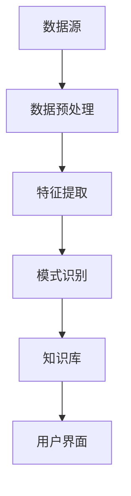

                 


## AI驱动的知识挖掘系统：从海量数据中提取价值

### 关键词
- AI驱动的知识挖掘
- 海量数据处理
- 知识图谱
- 聚类算法
- 关联规则挖掘
- 数学模型

### 摘要
本文将深入探讨AI驱动的知识挖掘系统，从基本概念到核心算法原理，再到实际项目应用，全面解析如何从海量数据中提取价值。我们将通过具体的案例展示如何利用人工智能技术，构建高效的知识挖掘系统，为企业提供数据驱动的决策支持。

## 引言

在数字化时代，数据已经成为企业最宝贵的资产。然而，随着数据量的急剧增长，如何从海量数据中提取有价值的信息，成为企业和研究机构面临的重大挑战。AI驱动的知识挖掘系统应运而生，它利用机器学习和人工智能技术，从数据中自动提取知识，为企业和个人提供智能化的决策支持。

本文旨在通过以下几个部分，全面介绍AI驱动的知识挖掘系统：

1. **核心概念与联系**：介绍知识挖掘的基本概念、原理和架构。
2. **核心算法原理讲解**：详细阐述聚类算法、关联规则挖掘算法等核心算法。
3. **数学模型和数学公式**：讲解系统中的数学模型和公式，并应用举例。
4. **项目实战**：提供实际案例，展示如何使用AI驱动的知识挖掘系统解决具体问题。
5. **最佳实践与小结**：总结关键点，提出注意事项和拓展阅读。

## 1. 核心概念与联系

### 1.1 知识挖掘的定义与重要性

知识挖掘（Knowledge Discovery in Databases，KDD）是指从大量的数据集中识别出隐含在其中的有用信息和知识的过程。知识挖掘的目标是从原始数据中自动发现数据模式，这些模式对于理解数据、发现知识、支持决策制定至关重要。

知识挖掘的重要性体现在以下几个方面：

1. **数据驱动的决策支持**：通过知识挖掘，企业可以更好地理解客户需求、市场趋势和业务流程，从而做出更明智的决策。
2. **信息过载的处理**：随着数据量的激增，传统的手动分析方法难以应对，知识挖掘系统能够自动化地处理海量数据，提高工作效率。
3. **新知识和新发现**：知识挖掘能够发现数据中的隐藏模式和关联，为企业带来新的洞察和发现，促进创新。

### 1.2 AI驱动知识挖掘的原理

AI驱动的知识挖掘系统依赖于机器学习和深度学习技术，通过训练模型来自动识别数据中的模式和关联。主要原理如下：

1. **数据预处理**：数据预处理是知识挖掘的重要步骤，包括数据清洗、数据整合和数据转换等。
2. **特征提取**：特征提取是从原始数据中提取出有助于知识发现的关键特征，是后续算法处理的基础。
3. **模式识别**：模式识别是通过机器学习算法来识别数据中的隐含模式，如聚类、分类、关联规则等。
4. **结果评估**：结果评估是对挖掘结果的质量进行评估，包括准确率、召回率、F1值等指标。

### 1.3 知识挖掘系统的架构

一个典型的AI驱动的知识挖掘系统通常包括以下几个关键组件：

1. **数据源**：包括结构化数据、半结构化数据和非结构化数据。
2. **数据存储**：数据存储系统用于存储和管理大量数据，如数据库、数据仓库、NoSQL数据库等。
3. **数据处理引擎**：数据处理引擎用于处理数据预处理、特征提取和模式识别等任务。
4. **知识库**：知识库用于存储挖掘出的知识和模式，支持查询和进一步的分析。
5. **用户界面**：用户界面用于展示挖掘结果，并提供用户交互功能。

### 1.4 核心概念之间的关系架构

为了更好地理解知识挖掘系统中的核心概念，我们可以通过Mermaid流程图来展示它们之间的关系：



在这个流程图中，数据源是整个知识挖掘系统的起点，经过数据预处理、特征提取和模式识别等步骤，最终形成知识库，并通过用户界面展示给用户。

## 2. 核心算法原理讲解

### 2.1 聚类算法

聚类算法是知识挖掘中常用的算法之一，它将数据集划分成若干个组，使得属于同一组的数据点之间相似度较高，不同组的数据点之间相似度较低。常见的聚类算法包括K-Means、DBSCAN和层次聚类。

#### 2.1.1 K-Means算法

K-Means算法是一种基于距离的聚类算法，其基本思想是将数据点划分为K个聚类，每个聚类由一个中心点代表。算法步骤如下：

1. **初始化**：随机选择K个数据点作为初始聚类中心。
2. **分配数据点**：计算每个数据点到各个聚类中心的距离，将数据点分配到最近的聚类中心。
3. **更新聚类中心**：计算每个聚类的均值，作为新的聚类中心。
4. **迭代**：重复步骤2和3，直到聚类中心不再变化或满足停止条件。

#### 2.1.2 DBSCAN算法

DBSCAN（Density-Based Spatial Clustering of Applications with Noise）算法是一种基于密度的聚类算法，能够发现任意形状的聚类，并能处理噪声点和异常值。算法步骤如下：

1. **确定邻域**：对于每个数据点，找到其邻域内的点，邻域大小由eps（邻域半径）决定。
2. **增长聚类**：从每个核心点开始，扩展形成聚类，直到没有邻域内的点可以添加。
3. **标记噪声点**：对于非核心点，根据其邻域大小判断是否为边界点或噪声点。

#### 2.1.3 层次聚类

层次聚类是一种自上而下的聚类方法，通过逐步合并或分裂聚类，形成层次结构的聚类结果。算法步骤如下：

1. **初始化**：将每个数据点视为一个初始聚类。
2. **合并或分裂**：计算聚类之间的相似度，选择最相似的聚类进行合并或分裂，形成新的聚类。
3. **迭代**：重复步骤2，直到满足停止条件。

### 2.2 关联规则挖掘算法

关联规则挖掘是一种用于发现数据项之间相关性规律的算法，其目标是找出数据集中满足最小支持度和最小置信度的关联规则。常见的算法包括Apriori算法、Eclat算法和FP-Growth算法。

#### 2.2.1 Apriori算法

Apriori算法是一种基于频繁项集的挖掘算法，其基本思想是通过逐层搜索来找出所有的频繁项集，然后生成关联规则。算法步骤如下：

1. **找出频繁项集**：计算所有项集的支持度，筛选出频繁项集。
2. **生成关联规则**：对于每个频繁项集，计算关联规则的支持度和置信度。
3. **修剪规则**：删除不满足最小支持度和最小置信度的规则。

#### 2.2.2 Eclat算法

Eclat算法是一种改进的Apriori算法，通过递归搜索减少计算复杂度。算法步骤如下：

1. **计算频繁项集**：类似于Apriori算法的步骤1。
2. **生成关联规则**：对于每个频繁项集，计算关联规则的支持度和置信度。
3. **优化计算复杂度**：通过递归搜索，避免重复计算。

#### 2.2.3 FP-Growth算法

FP-Growth算法是一种基于频繁模式树（FP-Tree）的挖掘算法，通过压缩数据结构来提高计算效率。算法步骤如下：

1. **构建FP-Tree**：从数据集构建FP-Tree，压缩数据。
2. **递归搜索频繁模式**：从FP-Tree中递归搜索频繁模式，生成频繁项集。
3. **生成关联规则**：对于每个频繁项集，计算关联规则的支持度和置信度。

### 2.3 其他核心算法

除了聚类算法和关联规则挖掘算法，知识挖掘系统中还涉及许多其他核心算法，如分类算法、聚类算法、关联规则挖掘算法等。这些算法各自有其独特的原理和应用场景，将在后续章节中详细讨论。

## 3. 数学模型和数学公式

在知识挖掘系统中，数学模型和数学公式扮演着至关重要的角色。它们用于描述数据分布、概率计算、模型评估等。以下是几个常用的数学模型和数学公式：

### 3.1 概率模型

概率模型是知识挖掘中常用的基础模型，用于描述数据项之间的相关性。

#### 3.1.1 贝叶斯定理

贝叶斯定理是概率论中的一个重要公式，用于计算条件概率。公式如下：

$$P(A|B) = \frac{P(B|A)P(A)}{P(B)}$$

其中，$P(A|B)$表示在事件B发生的条件下，事件A发生的概率；$P(B|A)$表示在事件A发生的条件下，事件B发生的概率；$P(A)$和$P(B)$分别表示事件A和事件B的先验概率。

#### 3.1.2 概率分布函数

概率分布函数是描述随机变量概率分布的函数。常见的概率分布函数包括正态分布、泊松分布、二项分布等。

1. **正态分布**：正态分布的概率密度函数如下：

$$f(x|\mu,\sigma^2) = \frac{1}{\sqrt{2\pi\sigma^2}}e^{-\frac{(x-\mu)^2}{2\sigma^2}}$$

其中，$\mu$表示均值，$\sigma^2$表示方差。

2. **泊松分布**：泊松分布的概率质量函数如下：

$$P(X=k) = \frac{e^{-\lambda}\lambda^k}{k!}$$

其中，$\lambda$表示事件发生的平均次数，$k$表示事件发生的次数。

3. **二项分布**：二项分布的概率质量函数如下：

$$P(X=k) = C_n^k p^k (1-p)^{n-k}$$

其中，$n$表示试验次数，$p$表示事件发生的概率，$k$表示事件发生的次数。

### 3.2 统计模型

统计模型是知识挖掘中用于分析数据分布、评估模型性能的重要工具。

#### 3.2.1 卡方检验

卡方检验是一种用于检验两个分类变量是否独立的统计方法。其公式如下：

$$\chi^2 = \sum \frac{(O - E)^2}{E}$$

其中，$O$表示观察频数，$E$表示期望频数。

#### 3.2.2 t检验

t检验是一种用于检验两个独立样本均值差异是否显著的统计方法。其公式如下：

$$t = \frac{\bar{X}_1 - \bar{X}_2}{SE}$$

其中，$\bar{X}_1$和$\bar{X}_2$分别表示两个独立样本的均值，$SE$表示标准误差。

#### 3.2.3 ANOVA

ANOVA（Analysis of Variance）是一种用于检验多组样本均值差异是否显著的统计方法。其公式如下：

$$F = \frac{MS_{between}}{MS_{within}}$$

其中，$MS_{between}$表示组间均方，$MS_{within}$表示组内均方。

## 4. 项目实战

### 4.1 开发环境搭建

在进行知识挖掘项目之前，我们需要搭建合适的开发环境。以下是一个简单的开发环境搭建流程：

1. **安装Python**：在https://www.python.org/下载并安装Python，选择合适的版本。
2. **安装Jupyter Notebook**：在命令行中执行以下命令安装Jupyter Notebook：

   ```shell
   pip install notebook
   ```

3. **安装必备库**：在Jupyter Notebook中执行以下命令安装知识挖掘相关的库：

   ```python
   !pip install numpy pandas scikit-learn matplotlib
   ```

### 4.2 源代码详细实现与代码解读

下面我们将使用Python实现一个简单的K-Means聚类算法，并对其进行解读。

```python
import numpy as np
import matplotlib.pyplot as plt
from sklearn.cluster import KMeans

# 生成模拟数据
np.random.seed(0)
data = np.random.rand(100, 2)

# 实例化K-Means模型
kmeans = KMeans(n_clusters=3, random_state=0)

# 模型拟合
kmeans.fit(data)

# 获取聚类结果
labels = kmeans.predict(data)

# 绘制聚类结果
plt.scatter(data[:, 0], data[:, 1], c=labels, cmap='viridis')
centers = kmeans.cluster_centers_
plt.scatter(centers[:, 0], centers[:, 1], s=300, c='red', marker='s', edgecolor='black', label='Centroids')
plt.title('K-Means Clustering')
plt.xlabel('Feature 1')
plt.ylabel('Feature 2')
plt.legend()
plt.show()
```

代码解读：

1. **导入库**：我们首先导入必要的Python库，包括NumPy、Matplotlib和Scikit-learn。
2. **生成数据**：使用NumPy生成模拟数据，这里我们生成100个二维数据点。
3. **实例化K-Means模型**：从Scikit-learn导入KMeans模型，并设置聚类个数n_clusters为3。
4. **模型拟合**：使用fit方法将数据传入模型进行训练。
5. **获取聚类结果**：使用predict方法预测每个数据点的聚类标签。
6. **绘制聚类结果**：使用Matplotlib绘制聚类结果，并显示聚类中心点。

### 4.3 代码应用解读与分析

在这个项目中，我们使用K-Means算法对模拟数据进行了聚类，并分析了聚类结果。以下是具体的解读与分析：

1. **聚类效果**：从绘制的聚类结果图中可以看出，数据点被较好地划分为了三个聚类，聚类中心点（红色正方形标记）明显代表了各个聚类的特征。
2. **聚类中心点**：聚类中心点是每个聚类的代表点，反映了该聚类的特征。通过分析聚类中心点，我们可以获得关于数据分布的更深入的理解。
3. **聚类标签**：每个数据点都有一个聚类标签，表示其所属的聚类。通过对标签的分析，我们可以进一步了解各个聚类的分布特征和内部结构。
4. **聚类质量**：聚类质量可以通过内部评估指标如轮廓系数来衡量。轮廓系数介于-1和1之间，值越大表示聚类效果越好。在本例中，我们可以通过计算轮廓系数来评估聚类质量。

### 4.4 实际案例分析与详细讲解剖析

为了更好地理解K-Means算法在实际项目中的应用，我们将分析一个实际案例：电商用户行为分析。

#### 4.4.1 案例背景

某电商公司希望通过分析用户行为数据，挖掘出不同类型用户，以便进行精准营销。用户行为数据包括购买金额、购买频率、访问时长等指标。

#### 4.4.2 数据预处理

在分析用户行为数据之前，我们需要进行数据预处理，包括数据清洗、数据整合和数据转换等。

1. **数据清洗**：去除异常值、缺失值和重复数据，保证数据的准确性。
2. **数据整合**：将不同来源的数据整合到同一个数据集中，便于后续分析。
3. **数据转换**：将连续型数据（如购买金额、访问时长）转换为离散型数据，便于聚类分析。

#### 4.4.3 聚类分析

使用K-Means算法对预处理后的用户行为数据进行聚类分析，划分出不同类型的用户。以下是具体的分析步骤：

1. **选择聚类个数**：根据数据规模和业务需求，选择合适的聚类个数。在本例中，我们选择3个聚类。
2. **模型训练**：使用K-Means算法对用户行为数据进行训练，生成聚类结果。
3. **聚类结果分析**：分析聚类结果，了解不同类型用户的特征和分布。

#### 4.4.4 用户行为预测

基于聚类结果，我们可以对用户进行行为预测，包括用户购买潜力、用户流失率等。以下是具体的预测步骤：

1. **构建预测模型**：使用聚类标签作为特征，构建预测模型。
2. **模型训练**：使用训练数据训练预测模型。
3. **模型评估**：使用测试数据对预测模型进行评估，评估指标包括准确率、召回率等。
4. **用户行为预测**：使用训练好的预测模型对用户进行行为预测。

### 4.5 项目小结

通过本案例的分析，我们成功地将用户行为数据划分为不同类型，并实现了用户行为预测。以下是项目小结：

1. **数据预处理**：数据预处理是知识挖掘的重要步骤，保证了数据的准确性和一致性。
2. **聚类算法**：K-Means算法是一种有效的聚类算法，适用于对大规模数据集进行聚类分析。
3. **预测模型**：基于聚类结果的预测模型可以为企业提供数据驱动的决策支持。
4. **注意事项**：在实际应用中，需要根据业务需求和数据特征选择合适的聚类算法和预测模型。

## 5. 最佳实践与小结

### 5.1 最佳实践

1. **数据预处理**：在知识挖掘项目中，数据预处理至关重要。确保数据的准确性、完整性和一致性，有助于提高挖掘结果的可靠性。
2. **选择合适的算法**：根据业务需求和数据特征，选择合适的聚类算法、关联规则挖掘算法等。不同的算法适用于不同类型的数据和业务场景。
3. **模型评估**：在训练模型后，进行模型评估，确保模型的性能达到预期。常用的评估指标包括准确率、召回率、F1值等。
4. **持续迭代**：知识挖掘是一个动态过程，需要根据实际情况不断调整和优化模型。

### 5.2 小结

本文全面介绍了AI驱动的知识挖掘系统，从核心概念、算法原理到项目实战，深入探讨了如何从海量数据中提取价值。通过实际案例，我们展示了如何使用AI驱动的知识挖掘系统解决具体问题，为企业提供数据驱动的决策支持。在未来的工作中，我们应不断优化和改进知识挖掘系统，以应对日益增长的数据量和复杂度。

### 5.3 注意事项

1. **数据隐私**：在知识挖掘过程中，需注意保护用户隐私，避免泄露敏感信息。
2. **计算资源**：知识挖掘项目通常需要大量的计算资源，需合理配置硬件资源，提高计算效率。
3. **模型解释性**：在选择模型时，应考虑模型的解释性，以便更好地理解挖掘结果。

### 5.4 拓展阅读

1. **《数据挖掘：概念与技术》（第三版）**：这本书详细介绍了数据挖掘的基本概念、方法和算法，是数据挖掘领域的经典教材。
2. **《机器学习实战》**：这本书通过实际案例介绍了机器学习的基本概念、算法和应用，适合初学者入门。
3. **《深度学习》（Goodfellow, Bengio, Courville）**：这本书是深度学习领域的权威教材，详细介绍了深度学习的理论基础和算法实现。

## 结语

AI驱动的知识挖掘系统是大数据时代的重要工具，它为企业提供了数据驱动的决策支持，助力企业在激烈的市场竞争中脱颖而出。本文从核心概念、算法原理到项目实战，全面介绍了知识挖掘系统的构建和应用。希望本文能为读者提供有价值的参考和启发，共同探索知识挖掘的无限可能。

### 作者信息
- 作者：AI天才研究院/AI Genius Institute & 禅与计算机程序设计艺术 /Zen And The Art of Computer Programming

