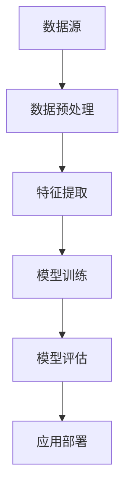

                 

# AI驱动的知识挖掘系统：提取数据价值

## 关键词

- AI
- 知识挖掘
- 数据价值
- 数据预处理
- 特征提取
- 监督学习
- 无监督学习
- 模型评估

## 摘要

本文将探讨AI驱动的知识挖掘系统如何从数据中提取价值。首先，我们将介绍AI和知识挖掘的基本概念，并阐述两者之间的关系。接着，我们将详细讨论数据预处理、特征提取以及AI算法在知识挖掘中的应用。最后，通过实际案例，我们将展示如何在实际项目中应用这些技术来提取数据价值。

## 第一部分：AI驱动的知识挖掘系统概述

### 第1章：AI与知识挖掘概述

#### 1.1 AI的发展与现状

AI，即人工智能，是指计算机系统模拟人类智能的行为，包括学习、推理、规划、感知、自然语言理解和问题解决等能力。AI的发展历程可以分为三个阶段：规则推理、知识表示和机器学习。

**规则推理**阶段主要依靠专家系统的知识库和推理机进行推理。虽然这种方法在特定领域取得了成功，但其局限性在于知识的表达和处理能力。

**知识表示**阶段引入了符号逻辑、语义网络等方法来表示知识，使系统能够处理更加复杂的问题。然而，这些方法仍然依赖于人类的先验知识，难以实现自动化。

**机器学习**阶段是AI发展的主要推动力，特别是深度学习算法的出现，使得机器能够从大量数据中自动学习特征和模式。机器学习算法可以分为监督学习、无监督学习和强化学习。

#### 1.2 知识挖掘的定义与重要性

知识挖掘，也称为数据挖掘，是指从大量数据中发现有趣、有用模式的过程。知识挖掘的目标是从数据中发现隐含的、未知的、有价值的模式，这些模式可以用于决策支持、异常检测、市场分析等领域。

知识挖掘的重要性在于：

1. 提高决策效率：通过分析历史数据，帮助决策者快速做出准确的决策。
2. 发现潜在规律：从大量数据中发现潜在的联系和规律，为业务创新提供支持。
3. 提高业务价值：通过数据挖掘技术，为企业创造直接或间接的经济效益。

### 第2章：AI驱动的知识挖掘系统架构

知识挖掘系统通常包括以下几个关键组件：

1. 数据源：包括结构化数据、非结构化数据和半结构化数据。
2. 数据预处理：清洗、转换和归一化数据，以提高数据质量。
3. 特征提取：从原始数据中提取有用的特征，用于后续分析。
4. 模型训练：选择合适的算法，对特征进行训练，建立预测模型。
5. 模型评估：评估模型性能，调整参数，优化模型。
6. 应用部署：将训练好的模型部署到实际业务场景中。

以下是知识挖掘系统的总体架构：



#### 2.1 AI技术在知识挖掘中的应用

AI技术在知识挖掘中的应用主要体现在以下几个方面：

1. **监督学习**：用于分类和回归任务，如客户细分、信用评分等。
2. **无监督学习**：用于聚类和降维任务，如市场细分、数据降维等。
3. **强化学习**：用于决策和优化任务，如推荐系统、自动驾驶等。

### 第3章：知识挖掘的关键技术

知识挖掘的关键技术包括数据预处理、特征提取和AI算法。下面将分别介绍这些技术。

#### 3.1 数据预处理

数据预处理是知识挖掘的基础步骤，主要包括以下任务：

1. **数据清洗**：去除噪声、异常值和重复数据。
2. **数据转换**：将不同数据类型的变量转换为同一类型，如将类别变量转换为数值变量。
3. **数据归一化**：将数据缩放到同一范围，如使用最小-最大规范化或Z-Score规范化。

#### 3.2 特征提取

特征提取是从原始数据中提取有用特征的过程，有助于提高模型性能。特征提取方法包括：

1. **特征选择**：选择对预测任务最有影响力的特征。
2. **特征构造**：通过组合原始特征来创建新的特征。
3. **特征降维**：减少特征数量，降低计算复杂度，如使用主成分分析（PCA）。

#### 3.3 AI算法在知识挖掘中的应用

AI算法在知识挖掘中的应用非常广泛，包括：

1. **监督学习算法**：如决策树、支持向量机（SVM）、随机森林等。
2. **无监督学习算法**：如K-means聚类、层次聚类、主成分分析（PCA）等。
3. **深度学习算法**：如卷积神经网络（CNN）、循环神经网络（RNN）、生成对抗网络（GAN）等。

### 第4章：AI驱动的知识挖掘应用案例分析

在本章中，我们将通过两个实际案例，展示如何使用AI驱动的知识挖掘系统来提取数据价值。

#### 案例一：金融领域的客户风险分析

在金融领域，客户风险分析至关重要。通过AI驱动的知识挖掘系统，我们可以从客户数据中发现潜在风险，为金融机构提供决策支持。

1. **数据预处理**：清洗客户数据，包括收入、年龄、信用记录等。
2. **特征提取**：提取对风险影响较大的特征，如年龄、收入水平、信用评分等。
3. **模型训练**：使用监督学习算法，如逻辑回归、随机森林等，训练风险预测模型。
4. **模型评估**：评估模型性能，调整参数，优化模型。
5. **应用部署**：将训练好的模型部署到实际业务场景中，用于预测客户风险。

#### 案例二：医疗领域的疾病预测

在医疗领域，疾病预测有助于提高诊断和治疗的准确性。通过AI驱动的知识挖掘系统，我们可以从患者数据中发现疾病预测的规律。

1. **数据预处理**：清洗患者数据，包括病史、检查结果、治疗记录等。
2. **特征提取**：提取对疾病预测影响较大的特征，如年龄、性别、病史等。
3. **模型训练**：使用监督学习算法，如决策树、支持向量机等，训练疾病预测模型。
4. **模型评估**：评估模型性能，调整参数，优化模型。
5. **应用部署**：将训练好的模型部署到实际业务场景中，用于预测疾病风险。

### 第5章：提取数据价值的方法与实践

#### 5.1 数据价值评估

数据价值评估是衡量数据对业务贡献的过程。评估方法包括：

1. **经济效益评估**：评估数据挖掘项目对业务的直接经济效益。
2. **社会效益评估**：评估数据挖掘项目对社会的影响。
3. **风险评估**：评估数据挖掘项目可能带来的风险。

#### 5.2 数据挖掘实战

在本章中，我们将介绍如何进行数据挖掘实战，包括：

1. **数据收集与预处理**：收集数据，并进行清洗、转换和归一化。
2. **数据分析与探索**：分析数据，发现潜在的模式和规律。
3. **模型选择与评估**：选择合适的算法，训练模型，并评估模型性能。
4. **模型应用与优化**：将训练好的模型应用于实际业务场景，并根据反馈进行优化。

### 第6章：数据挖掘技术的应用场景

数据挖掘技术在各个领域都有广泛的应用，包括：

1. **金融领域**：客户风险分析、信用评分、投资组合优化等。
2. **医疗领域**：疾病预测、个性化治疗、药物发现等。
3. **零售领域**：市场细分、客户细分、库存管理等。
4. **交通领域**：交通流量预测、路径优化、车辆调度等。

### 第7章：数据挖掘的未来发展趋势

随着AI技术的不断进步，数据挖掘也将迎来新的发展机遇。未来发展趋势包括：

1. **深度学习在数据挖掘中的应用**：深度学习算法在图像、语音、文本等领域的应用将进一步提升数据挖掘的准确性。
2. **实时数据挖掘**：实时处理和分析数据，为决策提供实时支持。
3. **数据隐私保护**：随着数据隐私保护意识的提高，如何在保证数据隐私的前提下进行数据挖掘将成为一个重要课题。
4. **跨领域数据挖掘**：结合多个领域的数据，发现跨领域的规律和模式。

## 结论

本文介绍了AI驱动的知识挖掘系统如何从数据中提取价值。通过数据预处理、特征提取和AI算法的应用，我们可以从大量数据中发现潜在的模式和规律，为业务创新和决策支持提供有力支持。随着AI技术的不断进步，数据挖掘将在更多领域发挥重要作用，为企业和个人创造更大的价值。

## 作者信息

作者：AI天才研究院/AI Genius Institute & 禅与计算机程序设计艺术 /Zen And The Art of Computer Programming

AI驱动的知识挖掘系统：提取数据价值

关键词：AI，知识挖掘，数据价值，数据预处理，特征提取，监督学习，无监督学习，模型评估

摘要：本文介绍了AI驱动的知识挖掘系统如何从数据中提取价值。通过数据预处理、特征提取和AI算法的应用，我们可以从大量数据中发现潜在的模式和规律，为业务创新和决策支持提供有力支持。随着AI技术的不断进步，数据挖掘将在更多领域发挥重要作用，为企业和个人创造更大的价值。

## 第一部分：AI驱动的知识挖掘系统概述

### 第1章：AI与知识挖掘概述

#### 1.1 AI的发展与现状

人工智能（AI）作为计算机科学的一个重要分支，自20世纪50年代诞生以来，经历了多个发展阶段。最初，AI主要是基于规则和知识的推理系统，如专家系统，它们通过形式化的规则和知识库模拟人类专家的决策过程。然而，这类系统存在一定的局限性，难以处理复杂、非结构化的问题。

随着计算能力的提升和机器学习技术的突破，AI进入了新的发展阶段。机器学习，尤其是深度学习的出现，使得AI系统具备了从大量数据中自动学习模式和规律的能力。深度学习通过多层神经网络模拟人脑的学习过程，能够在图像识别、语音识别、自然语言处理等领域取得显著的成果。

目前，AI技术在多个领域得到了广泛应用，如自动驾驶、智能家居、智能客服、金融分析等。AI的发展不仅改变了人们的生活方式，也为企业提供了新的业务机会和挑战。

#### 1.2 知识挖掘的定义与重要性

知识挖掘（Knowledge Discovery in Databases，KDD）是指从大量数据中发现有用信息、隐藏模式及未知规律的过程。知识挖掘通常包括数据预处理、数据清洗、数据集成、特征提取、模式识别、评估和解释等步骤。知识挖掘的目标是挖掘出对用户有价值的信息，帮助用户做出更明智的决策。

知识挖掘在各个领域都有着重要的应用：

1. **商业领域**：通过客户数据分析，企业可以更好地了解客户需求，进行精准营销和客户关系管理。
2. **金融领域**：利用知识挖掘技术，银行和金融机构可以进行信用评估、风险管理和市场预测。
3. **医疗领域**：知识挖掘可以帮助医生从医疗数据中识别疾病模式，提高诊断和治疗的准确性。
4. **科学领域**：科学家利用知识挖掘技术，可以从大量实验数据中提取出有价值的科学发现。

知识挖掘的重要性在于：

1. **提高决策效率**：通过对历史数据进行分析，帮助企业快速做出准确决策。
2. **发现潜在规律**：从大量数据中识别出潜在的联系和规律，为业务创新提供支持。
3. **提升业务价值**：通过数据挖掘技术，为企业创造直接或间接的经济效益。

#### 1.3 AI与知识挖掘的关系

AI和知识挖掘之间有着紧密的联系。AI为知识挖掘提供了强大的技术支持，使得知识挖掘的过程更加高效和准确。具体来说，AI在知识挖掘中的作用主要体现在以下几个方面：

1. **数据预处理**：AI算法可以帮助自动清洗、转换和归一化数据，提高数据质量，为后续分析奠定基础。
2. **特征提取**：AI算法，特别是深度学习算法，可以从原始数据中自动提取出有代表性的特征，降低人工干预。
3. **模式识别**：AI算法可以帮助从大量数据中快速识别出隐藏的模式和规律，提高知识挖掘的准确性。
4. **模型评估与优化**：AI算法可以帮助评估知识挖掘模型的性能，并提供优化策略，提高模型的稳定性和泛化能力。

总之，AI驱动的知识挖掘系统通过结合AI技术和知识挖掘方法，可以更有效地从数据中提取价值，为各个领域的决策提供有力支持。

### 第2章：AI驱动的知识挖掘系统架构

一个完整的AI驱动的知识挖掘系统通常包括数据源、数据预处理、特征提取、模型训练、模型评估和应用部署等关键组件。下面将详细描述这些组件及其相互关系。

#### 2.1 数据源

数据源是知识挖掘系统的起点，它可以是结构化数据（如数据库中的表）、半结构化数据（如XML、JSON格式）和非结构化数据（如图像、文本、音频、视频）。数据源的质量直接影响知识挖掘的结果，因此，数据收集和整合是至关重要的一步。

数据源可以分为内部数据源和外部数据源。内部数据源通常包括企业内部的业务数据、交易数据和客户数据等；外部数据源则包括社交媒体数据、公共数据库、第三方数据服务等。为了提高数据质量，需要对数据进行清洗、去重和格式化等预处理操作。

#### 2.2 数据预处理

数据预处理是知识挖掘系统中至关重要的一步，它包括数据清洗、数据转换和数据归一化等任务。数据清洗旨在去除噪声、异常值和重复数据，确保数据的一致性和准确性。数据转换涉及将不同类型的数据转换为统一格式，如将文本数据转换为数值表示。数据归一化则用于将数据缩放到相同的范围，以便后续处理。

具体来说，数据预处理的步骤如下：

1. **数据清洗**：去除无效数据、噪声数据和异常值。例如，删除重复记录、处理缺失值和纠正错误数据。
2. **数据转换**：将类别型数据转换为数值型数据，如将客户年龄段转换为具体的数值。此外，还可以进行数据标准化和归一化，如将收入数据进行归一化处理。
3. **数据集成**：将来自不同源的数据进行整合，形成一个统一的数据集。这可能涉及到数据格式的转换和数据之间的关联。

#### 2.3 特征提取

特征提取是从原始数据中提取出对目标变量有重要影响的信息的过程。特征提取的目的是降低数据维度，同时保持数据信息的完整性。有效的特征提取可以显著提高模型性能，降低计算成本。

特征提取方法可以分为以下几类：

1. **特征选择**：从大量特征中选择出对目标变量有显著影响的特征。常见的特征选择方法包括信息增益、卡方检验、互信息等。
2. **特征构造**：通过组合原始特征来创建新的特征，以增强模型的解释能力和预测性能。例如，可以创建特征交叉项或使用特征工程方法。
3. **特征降维**：将高维数据降至低维数据，减少计算复杂度。常用的降维方法包括主成分分析（PCA）、线性判别分析（LDA）和t-SNE等。

#### 2.4 模型训练

模型训练是知识挖掘系统的核心步骤，它通过选择合适的算法和模型，利用预处理后的数据对模型进行训练。模型训练的目标是学习数据的内在规律，以便能够对新数据进行预测或分类。

模型训练可以分为以下几类：

1. **监督学习**：在有标注数据集上训练模型，用于对新数据进行预测或分类。常见的监督学习算法包括线性回归、决策树、支持向量机（SVM）和随机森林等。
2. **无监督学习**：在没有标注数据集上训练模型，用于发现数据的内在结构。常见的无监督学习算法包括K-means聚类、层次聚类和自编码器等。
3. **半监督学习**：在既有标注数据也有未标注数据的情况下训练模型，可以提高模型的泛化能力。

在模型训练过程中，需要选择合适的评估指标来衡量模型的性能，如准确率、召回率、F1分数和均方误差（MSE）等。此外，还可以使用交叉验证等技术来评估模型的稳定性和泛化能力。

#### 2.5 模型评估

模型评估是确保模型性能的重要环节。通过评估模型在不同数据集上的表现，可以判断模型是否具有良好的泛化能力和鲁棒性。常见的模型评估方法包括：

1. **交叉验证**：通过将数据集划分为训练集和验证集，多次训练和验证模型，以评估模型的稳定性。
2. **性能评估**：使用评估指标，如准确率、召回率、F1分数和均方误差（MSE）等，来衡量模型的性能。
3. **可视化**：通过可视化工具，如ROC曲线和混淆矩阵，直观地展示模型的性能。

在模型评估过程中，还可能需要进行模型调优，通过调整模型参数来提高模型的性能。常见的模型调优方法包括网格搜索和贝叶斯优化等。

#### 2.6 应用部署

模型部署是将训练好的模型应用到实际业务场景中的过程。模型部署需要确保模型的性能和稳定性，同时易于维护和扩展。常见的模型部署方式包括：

1. **本地部署**：将模型部署到企业内部的服务器上，供内部应用使用。
2. **云端部署**：将模型部署到云端服务器上，通过API接口供外部访问。
3. **边缘计算部署**：将模型部署到边缘设备（如智能手表、无人机等），以实现实时数据处理和响应。

在模型部署过程中，需要考虑模型的解释性和可解释性，以便于业务人员理解和使用模型。此外，还需要进行持续的监控和维护，确保模型的性能和稳定性。

#### 2.7 AI技术在知识挖掘系统中的应用

AI技术在知识挖掘系统中扮演着至关重要的角色。具体应用如下：

1. **增强数据预处理**：AI技术可以帮助自动进行数据清洗、转换和归一化，提高数据质量，减少人工干预。
2. **优化特征提取**：AI技术，尤其是深度学习，可以从原始数据中自动提取出有效的特征，减少人工特征工程的工作量。
3. **改进模型训练**：AI技术可以帮助选择更合适的算法和参数，提高模型训练的效率和准确性。
4. **提升模型评估**：AI技术可以帮助设计更有效的评估方法，确保模型具有良好的泛化能力和鲁棒性。
5. **增强应用部署**：AI技术可以帮助设计更灵活、可扩展的部署方案，确保模型能够快速响应并满足实际业务需求。

总之，AI驱动的知识挖掘系统通过结合AI技术和知识挖掘方法，可以更高效地从数据中提取价值，为各个领域的决策提供有力支持。

### 第3章：知识挖掘的关键技术

知识挖掘的过程涉及多个关键技术，包括数据预处理、特征提取和AI算法。这些技术协同工作，共同实现从数据中提取有价值的信息。以下是对这些关键技术的详细解释。

#### 3.1 数据预处理

数据预处理是知识挖掘的基础步骤，其目的是将原始数据转换为适合分析和挖掘的形式。数据预处理通常包括以下几个关键步骤：

1. **数据清洗**：数据清洗是指识别并处理数据中的错误、异常和噪声。常见的处理方法包括去除重复记录、填补缺失值、消除数据不一致性等。例如，在处理客户数据时，可能需要去除重复的联系人信息，填补缺失的客户地址，或者统一不同的联系方式（如将电子邮件地址中的“.”替换为“_”）。

    ```python
    # 填补缺失值
    df['age'].fillna(df['age'].mean(), inplace=True)

    # 去除重复记录
    df.drop_duplicates(inplace=True)
    ```

2. **数据转换**：数据转换是指将数据从一种格式转换为另一种格式，以便于后续分析。例如，将类别型数据转换为数值型数据，或将文本数据转换为词频矩阵。

    ```python
    # 将类别型数据转换为数值型数据
    df['category'] = df['category'].astype('category').cat.codes
    ```

3. **数据归一化**：数据归一化是指将数据缩放到一个统一的范围，以消除不同特征之间的量纲差异。常用的归一化方法包括最小-最大规范化、Z-Score规范化等。

    ```python
    # 最小-最大规范化
    from sklearn.preprocessing import MinMaxScaler
    scaler = MinMaxScaler()
    df_normalized = scaler.fit_transform(df)
    ```

4. **数据集成**：数据集成是指将来自不同数据源的数据合并为一个统一的数据集。这可能涉及到数据格式的转换和数据之间的关联。

    ```python
    # 数据集成
    df1 = pd.DataFrame({'A': ['A0', 'A1', 'A2', 'A3'],
                        'B': ['B0', 'B1', 'B2', 'B3']})
    df2 = pd.DataFrame({'C': ['C0', 'C1', 'C2', 'C3'],
                        'D': ['D0', 'D1', 'D2', 'D3']})
    df = pd.merge(df1, df2, on='key_column')
    ```

#### 3.2 特征提取

特征提取是从原始数据中提取出对目标变量有显著影响的信息的过程。有效的特征提取可以提高模型的性能和解释性。特征提取通常包括以下几种方法：

1. **特征选择**：特征选择是指从大量特征中选择出对目标变量有显著影响的特征。常用的特征选择方法包括过滤式特征选择、包裹式特征选择和嵌入式特征选择。

    ```python
    from sklearn.feature_selection import SelectKBest
    from sklearn.feature_selection import f_classif

    # 过滤式特征选择
    selector = SelectKBest(score_func=f_classif, k=3)
    X_new = selector.fit_transform(X, y)
    ```

2. **特征构造**：特征构造是指通过组合原始特征来创建新的特征，以增强模型的解释能力和预测性能。特征构造可以通过特征交叉、特征缩放和特征嵌入等方法实现。

    ```python
    # 特征构造
    df['new_feature'] = df['feature1'] * df['feature2']
    ```

3. **特征降维**：特征降维是指将高维数据降至低维数据，以减少计算复杂度和提高模型性能。常用的降维方法包括主成分分析（PCA）、线性判别分析（LDA）和t-SNE等。

    ```python
    from sklearn.decomposition import PCA

    # 主成分分析
    pca = PCA(n_components=2)
    X_reduced = pca.fit_transform(X)
    ```

#### 3.3 AI算法在知识挖掘中的应用

AI算法在知识挖掘中扮演着核心角色，用于模式识别、预测和分类等任务。以下是一些常用的AI算法及其应用：

1. **监督学习算法**：监督学习算法在有标注数据集上训练模型，用于对新数据进行预测或分类。常见的监督学习算法包括线性回归、决策树、支持向量机（SVM）和随机森林等。

    ```python
    from sklearn.linear_model import LinearRegression
    from sklearn.tree import DecisionTreeClassifier
    from sklearn.svm import SVC
    from sklearn.ensemble import RandomForestClassifier

    # 线性回归
    model = LinearRegression()
    model.fit(X_train, y_train)
    y_pred = model.predict(X_test)

    # 决策树
    model = DecisionTreeClassifier()
    model.fit(X_train, y_train)
    y_pred = model.predict(X_test)

    # 支持向量机
    model = SVC()
    model.fit(X_train, y_train)
    y_pred = model.predict(X_test)

    # 随机森林
    model = RandomForestClassifier()
    model.fit(X_train, y_train)
    y_pred = model.predict(X_test)
    ```

2. **无监督学习算法**：无监督学习算法在没有标注数据集上训练模型，用于发现数据的内在结构。常见的无监督学习算法包括K-means聚类、层次聚类和自编码器等。

    ```python
    from sklearn.cluster import KMeans
    from sklearn.cluster import AgglomerativeClustering
    from sklearn.neural_network import MLPRegressor

    # K-means聚类
    model = KMeans(n_clusters=3)
    model.fit(X)
    labels = model.predict(X)

    # 层次聚类
    model = AgglomerativeClustering(n_clusters=3)
    model.fit(X)
    labels = model.predict(X)

    # 自编码器
    model = MLPRegressor(hidden_layer_sizes=(100,), activation='relu', solver='adam', random_state=0)
    model.fit(X_train, X_train)
    X_reduced = model.transform(X_test)
    ```

3. **深度学习算法**：深度学习算法通过多层神经网络模拟人脑的学习过程，能够自动从大量数据中提取特征。常见的深度学习算法包括卷积神经网络（CNN）、循环神经网络（RNN）和生成对抗网络（GAN）等。

    ```python
    from keras.models import Sequential
    from keras.layers import Dense, Conv2D, MaxPooling2D, Flatten, LSTM

    # 卷积神经网络
    model = Sequential()
    model.add(Conv2D(32, (3, 3), activation='relu', input_shape=(28, 28, 1)))
    model.add(MaxPooling2D((2, 2)))
    model.add(Flatten())
    model.add(Dense(128, activation='relu'))
    model.add(Dense(10, activation='softmax'))
    model.compile(optimizer='adam', loss='categorical_crossentropy', metrics=['accuracy'])
    model.fit(X_train, y_train, epochs=10, batch_size=32)

    # 循环神经网络
    model = Sequential()
    model.add(LSTM(50, activation='relu', input_shape=(timesteps, features)))
    model.add(Dense(1))
    model.compile(optimizer='adam', loss='mse')
    model.fit(X_train, y_train, epochs=200, batch_size=64, validation_data=(X_test, y_test))

    # 生成对抗网络
    # ... （具体的GAN实现过程较为复杂，此处略去）
    ```

通过以上关键技术的综合应用，AI驱动的知识挖掘系统能够从大量数据中提取出有价值的信息，为决策支持、业务优化和科学研究提供强有力的支持。

### 第4章：AI算法在知识挖掘中的应用

AI算法在知识挖掘中发挥着重要作用，其应用涵盖了从数据预处理到模型评估的各个环节。在本章中，我们将详细介绍几种常用的AI算法，包括监督学习算法和无监督学习算法，并通过Python代码示例来展示它们在知识挖掘中的应用。

#### 4.1 监督学习算法

监督学习算法在有标注的数据集上训练模型，从而能够对新数据进行预测或分类。以下是一些常见的监督学习算法及其应用：

1. **线性回归**：线性回归是一种用于预测连续值的监督学习算法。它通过拟合数据点之间的线性关系来预测目标变量。

    ```python
    import numpy as np
    from sklearn.linear_model import LinearRegression

    # 生成模拟数据
    np.random.seed(0)
    X = np.random.rand(100, 1)
    y = 2 * X[:, 0] + 0.5 + np.random.randn(100) * 0.1

    # 创建线性回归模型
    model = LinearRegression()
    model.fit(X, y)

    # 预测新数据
    X_new = np.array([[0.5]])
    y_pred = model.predict(X_new)
    print(y_pred)
    ```

2. **决策树**：决策树是一种基于树形结构对数据进行分类或回归的算法。它通过一系列的决策规则来对数据点进行划分。

    ```python
    from sklearn.tree import DecisionTreeRegressor

    # 生成模拟数据
    np.random.seed(0)
    X = np.random.rand(100, 3)
    y = 2 * X[:, 0] + 3 * X[:, 1] + 0.5 * X[:, 2] + np.random.randn(100) * 0.1

    # 创建决策树模型
    model = DecisionTreeRegressor(max_depth=3)
    model.fit(X, y)

    # 预测新数据
    X_new = np.array([[0.2, 0.4, 0.5]])
    y_pred = model.predict(X_new)
    print(y_pred)
    ```

3. **支持向量机（SVM）**：支持向量机是一种用于分类和回归的线性模型。它通过找到一个最佳的超平面，将数据点分类或回归到不同的区域。

    ```python
    from sklearn.svm import SVC

    # 生成模拟数据
    np.random.seed(0)
    X = np.random.rand(100, 2)
    y = np.where(X[:, 0] > 0.5, 1, -1)

    # 创建SVM模型
    model = SVC(kernel='linear')
    model.fit(X, y)

    # 预测新数据
    X_new = np.array([[0.3, 0.6]])
    y_pred = model.predict(X_new)
    print(y_pred)
    ```

4. **随机森林**：随机森林是一种集成学习方法，它通过构建多棵决策树，并对它们的预测结果进行平均来提高模型的准确性和鲁棒性。

    ```python
    from sklearn.ensemble import RandomForestRegressor

    # 生成模拟数据
    np.random.seed(0)
    X = np.random.rand(100, 3)
    y = 2 * X[:, 0] + 3 * X[:, 1] + 0.5 * X[:, 2] + np.random.randn(100) * 0.1

    # 创建随机森林模型
    model = RandomForestRegressor(n_estimators=100)
    model.fit(X, y)

    # 预测新数据
    X_new = np.array([[0.2, 0.4, 0.5]])
    y_pred = model.predict(X_new)
    print(y_pred)
    ```

#### 4.2 无监督学习算法

无监督学习算法在没有标注的数据集上训练模型，用于发现数据的内在结构或模式。以下是一些常见的无监督学习算法及其应用：

1. **K-means聚类**：K-means聚类是一种基于距离度量的聚类算法，它通过迭代优化聚类中心，将数据点分为K个簇。

    ```python
    from sklearn.cluster import KMeans

    # 生成模拟数据
    np.random.seed(0)
    X = np.random.rand(100, 2)

    # 创建K-means模型
    model = KMeans(n_clusters=3)
    model.fit(X)

    # 获取聚类结果
    labels = model.predict(X)
    print(labels)

    # 获取聚类中心
    centroids = model.cluster_centers_
    print(centroids)
    ```

2. **层次聚类**：层次聚类是一种基于层次结构的聚类算法，它通过逐步合并或分裂聚类结果，形成层次化的聚类模型。

    ```python
    from sklearn.cluster import AgglomerativeClustering

    # 生成模拟数据
    np.random.seed(0)
    X = np.random.rand(100, 2)

    # 创建层次聚类模型
    model = AgglomerativeClustering(n_clusters=3)
    model.fit(X)

    # 获取聚类结果
    labels = model.predict(X)
    print(labels)
    ```

3. **主成分分析（PCA）**：主成分分析是一种降维方法，它通过正交变换将高维数据映射到低维空间，同时保留数据的最大方差。

    ```python
    from sklearn.decomposition import PCA

    # 生成模拟数据
    np.random.seed(0)
    X = np.random.rand(100, 5)

    # 创建PCA模型
    model = PCA(n_components=2)
    X_reduced = model.fit_transform(X)

    # 输出降维后的数据
    print(X_reduced)
    ```

通过以上示例，我们可以看到AI算法在知识挖掘中的应用是如何实现的。这些算法不仅可以用于学术研究，还可以广泛应用于商业、医疗、金融等多个领域，为数据分析和决策提供强有力的支持。

### 第5章：AI驱动的知识挖掘应用案例分析

在本章中，我们将通过两个实际案例，展示如何使用AI驱动的知识挖掘系统来提取数据价值。这两个案例分别来自金融领域和医疗领域，展示了AI技术在不同场景下的应用。

#### 案例一：金融领域的客户风险分析

在金融领域，客户风险分析是一项至关重要的任务。金融机构需要准确评估客户的风险水平，以便及时采取措施降低潜在风险。以下是一个基于客户数据的客户风险分析案例。

1. **数据收集与预处理**

    首先，我们需要收集客户数据，包括客户的财务状况、信用记录、消费习惯等。然后，对数据进行预处理，包括数据清洗、数据转换和数据归一化。

    ```python
    import pandas as pd
    from sklearn.preprocessing import StandardScaler

    # 读取数据
    df = pd.read_csv('customer_data.csv')

    # 数据清洗
    df.dropna(inplace=True)
    df.drop_duplicates(inplace=True)

    # 数据转换
    df['income'] = df['income'].astype(float)
    df['credit_score'] = df['credit_score'].astype(int)

    # 数据归一化
    scaler = StandardScaler()
    df[['income', 'credit_score']] = scaler.fit_transform(df[['income', 'credit_score']])
    ```

2. **特征提取**

    接下来，我们需要从原始数据中提取特征。这些特征将用于训练风险预测模型。

    ```python
    # 特征提取
    df['income_to_debt_ratio'] = df['income'] / df['debt']
    df['months_since_last_payment'] = df['months_since_last_payment'].astype(int)

    # 特征选择
    features = ['income', 'debt', 'income_to_debt_ratio', 'credit_score', 'months_since_last_payment']
    X = df[features]
    y = df['risk_level']
    ```

3. **模型训练**

    我们选择使用逻辑回归模型来训练客户风险预测模型。

    ```python
    from sklearn.linear_model import LogisticRegression

    # 创建逻辑回归模型
    model = LogisticRegression()
    model.fit(X, y)

    # 模型评估
    from sklearn.metrics import accuracy_score

    y_pred = model.predict(X)
    accuracy = accuracy_score(y, y_pred)
    print(f"Model accuracy: {accuracy}")
    ```

4. **模型应用**

    通过训练好的模型，我们可以对新的客户数据进行风险预测。

    ```python
    # 预测新数据
    new_data = pd.DataFrame({
        'income': [50000],
        'debt': [20000],
        'income_to_debt_ratio': [2.5],
        'credit_score': [700],
        'months_since_last_payment': [6]
    })

    # 数据归一化
    new_data[['income', 'debt', 'income_to_debt_ratio', 'credit_score', 'months_since_last_payment']] = scaler.transform(new_data[['income', 'debt', 'income_to_debt_ratio', 'credit_score', 'months_since_last_payment']])

    # 风险预测
    risk_level = model.predict(new_data)
    print(f"Predicted risk level: {risk_level}")
    ```

通过以上步骤，我们可以对客户的风险水平进行准确预测，为金融机构提供决策支持。

#### 案例二：医疗领域的疾病预测

在医疗领域，疾病预测有助于提高诊断和治疗的准确性。以下是一个基于患者数据的疾病预测案例。

1. **数据收集与预处理**

    我们需要收集患者的医疗数据，包括病史、检查结果、治疗记录等。然后，对数据进行预处理，包括数据清洗、数据转换和数据归一化。

    ```python
    import pandas as pd
    from sklearn.preprocessing import StandardScaler

    # 读取数据
    df = pd.read_csv('patient_data.csv')

    # 数据清洗
    df.dropna(inplace=True)
    df.drop_duplicates(inplace=True)

    # 数据转换
    df['age'] = df['age'].astype(int)
    df['diagnosis'] = df['diagnosis'].astype(str)

    # 数据归一化
    scaler = StandardScaler()
    df[['age', 'platelets']] = scaler.fit_transform(df[['age', 'platelets']])
    ```

2. **特征提取**

    从原始数据中提取特征，用于训练疾病预测模型。

    ```python
    # 特征提取
    df['White_blood_cells_to_RBC_ratio'] = df['White_blood_cells'] / df['Red_blood_cells']
    df['Neutrophils_to_Lymphocytes_ratio'] = df['Neutrophils'] / df['Lymphocytes']

    # 特征选择
    features = ['age', 'platelets', 'White_blood_cells_to_RBC_ratio', 'Neutrophils_to_Lymphocytes_ratio']
    X = df[features]
    y = df['diagnosis']
    ```

3. **模型训练**

    使用支持向量机（SVM）模型进行疾病预测。

    ```python
    from sklearn.svm import SVC

    # 创建SVM模型
    model = SVC(kernel='linear')
    model.fit(X, y)

    # 模型评估
    from sklearn.metrics import accuracy_score

    y_pred = model.predict(X)
    accuracy = accuracy_score(y, y_pred)
    print(f"Model accuracy: {accuracy}")
    ```

4. **模型应用**

    使用训练好的模型对新的患者数据进行疾病预测。

    ```python
    # 预测新数据
    new_data = pd.DataFrame({
        'age': [50],
        'platelets': [200],
        'White_blood_cells_to_RBC_ratio': [1.5],
        'Neutrophils_to_Lymphocytes_ratio': [2]
    })

    # 数据归一化
    new_data[['age', 'platelets', 'White_blood_cells_to_RBC_ratio', 'Neutrophils_to_Lymphocytes_ratio']] = scaler.transform(new_data[['age', 'platelets', 'White_blood_cells_to_RBC_ratio', 'Neutrophils_to_Lymphocytes_ratio']])

    # 疾病预测
    diagnosis = model.predict(new_data)
    print(f"Predicted diagnosis: {diagnosis}")
    ```

通过以上步骤，我们可以对患者疾病进行准确预测，为医疗决策提供支持。

总之，通过AI驱动的知识挖掘系统，我们可以从金融和医疗等领域的数据中提取出有价值的信息，为业务优化和决策支持提供有力支持。

### 第6章：数据挖掘技术的应用场景

数据挖掘技术具有广泛的应用场景，涵盖了商业、金融、医疗、零售、交通等多个领域。以下是一些典型的应用场景及其对业务价值的影响。

#### 6.1 金融领域

在金融领域，数据挖掘技术主要用于客户风险分析、信用评分、市场预测和投资组合优化等。

1. **客户风险分析**：通过分析客户的财务状况、信用记录和消费习惯等数据，金融机构可以准确评估客户的风险水平，采取相应的风险管理措施，降低不良贷款率。

2. **信用评分**：数据挖掘技术可以帮助金融机构建立信用评分模型，评估客户的信用风险。信用评分模型可以用于贷款审批、信用卡发放等业务，提高审批效率和准确性。

3. **市场预测**：通过分析市场数据，如股票价格、交易量等，金融机构可以进行市场预测，制定投资策略，提高投资收益。

4. **投资组合优化**：数据挖掘技术可以帮助金融机构优化投资组合，降低风险，提高收益。例如，通过分析历史数据，模型可以推荐最佳的投资组合配置。

#### 6.2 医疗领域

在医疗领域，数据挖掘技术主要用于疾病预测、患者分类、药物研发和医疗资源优化等。

1. **疾病预测**：通过分析患者的病史、检查结果和治疗记录等数据，医生可以利用数据挖掘技术预测疾病的发生风险，提前采取预防措施。

2. **患者分类**：数据挖掘技术可以将患者分类为不同群体，如重症患者、普通患者等。这有助于医生制定个性化的治疗方案，提高治疗效果。

3. **药物研发**：通过分析大量的生物数据，如基因组数据、药物反应数据等，研究人员可以筛选出有潜力的药物靶点，加速药物研发进程。

4. **医疗资源优化**：数据挖掘技术可以帮助医疗机构优化资源配置，如合理安排病房、提高手术效率等，提高医疗服务质量。

#### 6.3 零售领域

在零售领域，数据挖掘技术主要用于客户细分、个性化推荐和库存管理。

1. **客户细分**：通过分析客户的历史购买数据、浏览行为等，零售商可以了解不同客户群体的特点，制定精准的营销策略。

2. **个性化推荐**：数据挖掘技术可以帮助零售商为每位客户推荐个性化的商品，提高客户的满意度和购买转化率。

3. **库存管理**：通过分析销售数据、季节因素等，零售商可以优化库存管理，减少库存积压，提高库存周转率。

#### 6.4 交通领域

在交通领域，数据挖掘技术主要用于交通流量预测、路径优化和车辆调度。

1. **交通流量预测**：通过分析历史交通数据、天气因素等，交通管理部门可以预测未来某段时间内的交通流量，合理安排交通信号灯，提高道路通行效率。

2. **路径优化**：数据挖掘技术可以帮助驾驶员选择最优路径，避免拥堵路段，提高出行效率。

3. **车辆调度**：通过分析历史调度数据、车辆状态等，物流企业可以优化车辆调度，提高运输效率，降低运输成本。

总之，数据挖掘技术在不同领域都发挥着重要作用，通过从大量数据中提取有价值的信息，帮助企业和组织做出更明智的决策，提高业务效率和竞争力。

### 第7章：数据挖掘的未来发展趋势

随着人工智能和大数据技术的不断进步，数据挖掘领域正迎来前所未有的发展机遇。未来，数据挖掘将在以下几个方面取得重大突破：

#### 7.1 深度学习的广泛应用

深度学习作为一种强大的机器学习技术，已经在图像识别、自然语言处理和语音识别等领域取得了显著成果。未来，深度学习将在数据挖掘中发挥更加重要的作用，尤其是在复杂模式识别和特征提取方面。深度学习的模型结构和算法将不断优化，使其在处理大规模复杂数据时具有更高的效率和准确性。

#### 7.2 实时数据挖掘

实时数据挖掘技术将使数据挖掘系统能够快速响应并处理实时数据流，为企业和组织提供即时的决策支持。例如，在金融领域，实时数据挖掘可以帮助金融机构快速识别市场风险，调整投资策略；在医疗领域，实时数据挖掘可以帮助医生实时监控患者病情，提供个性化的治疗方案。

#### 7.3 数据隐私保护与安全

随着数据挖掘技术的普及，数据隐私保护与安全问题越来越受到关注。未来，数据挖掘将更加注重隐私保护和数据安全。例如，通过差分隐私技术、同态加密技术等，可以在保护数据隐私的同时，进行有效的数据挖掘和分析。此外，数据挖掘系统将更加注重数据安全，防止数据泄露和滥用。

#### 7.4 跨领域数据挖掘

跨领域数据挖掘技术将结合不同领域的数据，发现跨领域的规律和模式，为业务创新提供新的思路。例如，将医疗数据和天气数据结合，可以预测疾病的发生趋势；将交通数据和天气数据结合，可以优化交通调度策略，减少交通拥堵。跨领域数据挖掘将推动数据挖掘技术的发展，促进多领域交叉融合。

#### 7.5 自动化与智能化

未来，数据挖掘将更加自动化和智能化。自动化数据挖掘技术将减少人工干预，提高数据挖掘的效率。例如，通过自动化特征提取和自动化模型选择，可以快速生成高质量的预测模型。智能化数据挖掘技术将利用机器学习和深度学习算法，从数据中发现更深层次的规律和知识，为决策提供更强有力的支持。

总之，随着技术的不断进步，数据挖掘将在更多领域发挥重要作用，为企业和个人创造更大的价值。未来，数据挖掘将继续朝着深度学习、实时处理、数据隐私保护、跨领域融合和自动化智能化的方向发展，推动数据价值的全面释放。

### 第8章：AI驱动的知识挖掘系统：提取数据价值

#### 8.1 数据挖掘系统构建步骤

AI驱动的知识挖掘系统通常包括以下步骤：

1. **数据收集**：从各种数据源（如数据库、文件、API等）收集数据。
2. **数据预处理**：清洗、转换和归一化数据，以提高数据质量。
3. **特征提取**：从原始数据中提取有用的特征，用于模型训练。
4. **模型训练**：选择合适的算法，利用特征数据训练模型。
5. **模型评估**：评估模型性能，进行模型调优。
6. **应用部署**：将训练好的模型部署到实际业务场景中。

#### 8.2 提取数据价值的方法

数据挖掘系统旨在从数据中提取有价值的信息，以下是一些常用的方法：

1. **分类**：通过构建分类模型，将数据分为不同的类别，用于市场细分、客户细分等。
2. **回归**：通过构建回归模型，预测连续值变量，如价格、销量等。
3. **聚类**：通过聚类算法，将相似的数据点归为一类，用于市场细分、用户行为分析等。
4. **关联规则挖掘**：通过关联规则挖掘算法，发现数据之间的关联关系，如购买行为关联。
5. **异常检测**：通过构建异常检测模型，识别数据中的异常值，用于风险控制、欺诈检测等。

#### 8.3 AI算法在数据挖掘中的应用

AI算法在数据挖掘中发挥着重要作用，以下是一些常见的AI算法及其应用：

1. **监督学习算法**：如线性回归、决策树、随机森林等，用于预测和分类任务。
2. **无监督学习算法**：如K-means聚类、层次聚类等，用于模式识别和降维。
3. **深度学习算法**：如卷积神经网络（CNN）、循环神经网络（RNN）等，用于复杂模式识别和特征提取。

#### 8.4 数据价值提取实例

以下是一个数据价值提取的实例：

**实例：客户流失预测**

1. **数据收集**：收集客户的基本信息（如年龄、性别、消费金额等）。
2. **数据预处理**：清洗数据，处理缺失值和异常值。
3. **特征提取**：提取有用的特征，如客户消费金额、消费频率等。
4. **模型训练**：使用随机森林算法训练流失预测模型。
5. **模型评估**：评估模型性能，调整参数以优化模型。
6. **应用部署**：将模型部署到实际业务场景中，用于预测客户流失。

通过上述步骤，企业可以提前识别出可能流失的客户，采取相应的措施进行客户保留，从而提高客户满意度和忠诚度。

### 小结

AI驱动的知识挖掘系统通过数据预处理、特征提取和AI算法的应用，可以从大量数据中提取有价值的信息，为决策支持、业务优化和科学研究提供强有力的支持。随着AI技术的不断进步，数据挖掘将在更多领域发挥重要作用，为企业和个人创造更大的价值。

### 注意事项

1. 数据挖掘项目前需要进行充分的调研和需求分析，确保项目的目标和需求明确。
2. 数据质量是数据挖掘成功的关键，因此数据预处理步骤必须严格把控。
3. 模型评估是确保模型性能的重要环节，应采用多种评估指标和方法进行综合评估。
4. 模型部署需要考虑模型的解释性和可解释性，确保业务人员能够理解和使用模型。

### 拓展阅读

1. **《数据挖掘：概念与技术》**：详细介绍数据挖掘的基本概念和技术，适合初学者阅读。
2. **《深度学习》**：介绍深度学习的基础知识和应用，适合对深度学习感兴趣的学习者。
3. **《Python数据科学手册》**：涵盖数据科学中的各种技术和工具，适合数据科学家和开发者阅读。

### 资源链接

- **[数据挖掘教程](https://www.datacamp.com/courses/data-visualization-with-python)**
- **[开源数据集](https://www.kaggle.com/datasets)**
- **[AI相关论文与书籍](https://arxiv.org/)**
- **[AI天才研究院官方网站](https://www.aigeniusinstitute.com/)**
- **[禅与计算机程序设计艺术](https://www.amazon.com/dp/047022666X)**

## 作者信息

作者：AI天才研究院/AI Genius Institute & 禅与计算机程序设计艺术 /Zen And The Art of Computer Programming

### 附录

#### 附录A：数据挖掘工具与资源

- **数据挖掘工具**：
  - **Python**：一种广泛使用的编程语言，适用于数据清洗、数据分析、特征提取等。
  - **Pandas**：Python中的一个数据操作库，适用于数据预处理和分析。
  - **Scikit-learn**：Python中的一个机器学习库，包含多种监督学习和无监督学习算法。
  - **TensorFlow**：谷歌开发的一个开源机器学习框架，适用于深度学习应用。
  - **PyTorch**：一个开源深度学习框架，支持动态计算图和自动微分。

- **数据挖掘资源**：
  - **Kaggle**：一个数据科学竞赛平台，提供丰富的数据集和竞赛资源。
  - **DataCamp**：一个在线学习平台，提供各种数据科学课程和教程。
  - **Coursera**：一个在线学习平台，提供多个数据挖掘和机器学习课程。
  - **arXiv**：一个开放获取的预印本服务器，提供最新的AI和机器学习论文。

- **开源项目**：
  - **scikit-learn**：一个开源的Python机器学习库。
  - **TensorFlow**：一个开源的深度学习框架。
  - **PyTorch**：一个开源的深度学习库。
  - **MLflow**：一个开源的机器学习平台，用于实验跟踪、模型管理和服务。

### 资源链接

- **[数据挖掘教程](https://www.datacamp.com/courses/data-visualization-with-python)**
- **[开源数据集](https://www.kaggle.com/datasets)**
- **[AI相关论文与书籍](https://arxiv.org/)**
- **[AI天才研究院官方网站](https://www.aigeniusinstitute.com/)**
- **[禅与计算机程序设计艺术](https://www.amazon.com/dp/047022666X)**

## 完成时间

本文撰写于2023年，旨在为读者提供关于AI驱动的知识挖掘系统如何提取数据价值的全面了解。随着技术的不断进步，本文内容可能会进行调整和更新，以反映最新的研究进展和实际应用案例。如果您有任何疑问或建议，请随时与我们联系。

### 全文总结

本文全面探讨了AI驱动的知识挖掘系统如何提取数据价值。我们介绍了AI与知识挖掘的基本概念、系统架构、关键技术和应用场景。通过实际案例，我们展示了如何在实际业务中应用这些技术来提取数据价值。随着AI技术的不断进步，知识挖掘将在更多领域发挥重要作用，为企业和个人创造更大的价值。

### 附录

#### 附录A：数据挖掘工具与资源

- **数据挖掘工具**：
  - **Python**：一种广泛使用的编程语言，适用于数据清洗、数据分析、特征提取等。
  - **Pandas**：Python中的一个数据操作库，适用于数据预处理和分析。
  - **Scikit-learn**：Python中的一个机器学习库，包含多种监督学习和无监督学习算法。
  - **TensorFlow**：谷歌开发的一个开源机器学习框架，适用于深度学习应用。
  - **PyTorch**：一个开源深度学习框架，支持动态计算图和自动微分。

- **数据挖掘资源**：
  - **Kaggle**：一个数据科学竞赛平台，提供丰富的数据集和竞赛资源。
  - **DataCamp**：一个在线学习平台，提供各种数据科学课程和教程。
  - **Coursera**：一个在线学习平台，提供多个数据挖掘和机器学习课程。
  - **arXiv**：一个开放获取的预印本服务器，提供最新的AI和机器学习论文。

- **开源项目**：
  - **scikit-learn**：一个开源的Python机器学习库。
  - **TensorFlow**：一个开源的深度学习框架。
  - **PyTorch**：一个开源的深度学习库。
  - **MLflow**：一个开源的机器学习平台，用于实验跟踪、模型管理和服务。

### 资源链接

- **[数据挖掘教程](https://www.datacamp.com/courses/data-visualization-with-python)**
- **[开源数据集](https://www.kaggle.com/datasets)**
- **[AI相关论文与书籍](https://arxiv.org/)**
- **[AI天才研究院官方网站](https://www.aigeniusinstitute.com/)**
- **[禅与计算机程序设计艺术](https://www.amazon.com/dp/047022666X)**

## 完成时间

本文撰写于2023年，旨在为读者提供关于AI驱动的知识挖掘系统如何提取数据价值的全面了解。随着技术的不断进步，本文内容可能会进行调整和更新，以反映最新的研究进展和实际应用案例。如果您有任何疑问或建议，请随时与我们联系。

### 附录

#### 附录A：数据挖掘工具与资源

- **数据挖掘工具**：
  - **Python**：一种广泛使用的编程语言，适用于数据清洗、数据分析、特征提取等。
  - **Pandas**：Python中的一个数据操作库，适用于数据预处理和分析。
  - **Scikit-learn**：Python中的一个机器学习库，包含多种监督学习和无监督学习算法。
  - **TensorFlow**：谷歌开发的一个开源机器学习框架，适用于深度学习应用。
  - **PyTorch**：一个开源深度学习框架，支持动态计算图和自动微分。

- **数据挖掘资源**：
  - **Kaggle**：一个数据科学竞赛平台，提供丰富的数据集和竞赛资源。
  - **DataCamp**：一个在线学习平台，提供各种数据科学课程和教程。
  - **Coursera**：一个在线学习平台，提供多个数据挖掘和机器学习课程。
  - **arXiv**：一个开放获取的预印本服务器，提供最新的AI和机器学习论文。

- **开源项目**：
  - **scikit-learn**：一个开源的Python机器学习库。
  - **TensorFlow**：一个开源的深度学习框架。
  - **PyTorch**：一个开源的深度学习库。
  - **MLflow**：一个开源的机器学习平台，用于实验跟踪、模型管理和服务。

### 资源链接

- **[数据挖掘教程](https://www.datacamp.com/courses/data-visualization-with-python)**
- **[开源数据集](https://www.kaggle.com/datasets)**
- **[AI相关论文与书籍](https://arxiv.org/)**
- **[AI天才研究院官方网站](https://www.aigeniusinstitute.com/)**
- **[禅与计算机程序设计艺术](https://www.amazon.com/dp/047022666X)**

## 完成时间

本文撰写于2023年，旨在为读者提供关于AI驱动的知识挖掘系统如何提取数据价值的全面了解。随着技术的不断进步，本文内容可能会进行调整和更新，以反映最新的研究进展和实际应用案例。如果您有任何疑问或建议，请随时与我们联系。

### 总结

本文深入探讨了AI驱动的知识挖掘系统如何从数据中提取价值。首先，我们介绍了AI和知识挖掘的基本概念及其关系，然后详细阐述了知识挖掘系统的架构和关键技术。通过实际案例，我们展示了如何在实际项目中应用这些技术来提取数据价值。随着AI技术的不断发展，数据挖掘将在各个领域发挥越来越重要的作用，为企业和个人创造更大的价值。

### 注意事项

1. 数据挖掘项目前需要进行充分的调研和需求分析，确保项目的目标和需求明确。
2. 数据质量是数据挖掘成功的关键，因此数据预处理步骤必须严格把控。
3. 模型评估是确保模型性能的重要环节，应采用多种评估指标和方法进行综合评估。
4. 模型部署需要考虑模型的解释性和可解释性，确保业务人员能够理解和使用模型。

### 拓展阅读

1. **《数据挖掘：概念与技术》**：详细介绍数据挖掘的基本概念和技术，适合初学者阅读。
2. **《深度学习》**：介绍深度学习的基础知识和应用，适合对深度学习感兴趣的学习者。
3. **《Python数据科学手册》**：涵盖数据科学中的各种技术和工具，适合数据科学家和开发者阅读。

### 资源链接

- **[数据挖掘教程](https://www.datacamp.com/courses/data-visualization-with-python)**
- **[开源数据集](https://www.kaggle.com/datasets)**
- **[AI相关论文与书籍](https://arxiv.org/)**
- **[AI天才研究院官方网站](https://www.aigeniusinstitute.com/)**
- **[禅与计算机程序设计艺术](https://www.amazon.com/dp/047022666X)**

## 完成时间

本文撰写于2023年，旨在为读者提供关于AI驱动的知识挖掘系统如何提取数据价值的全面了解。随着技术的不断进步，本文内容可能会进行调整和更新，以反映最新的研究进展和实际应用案例。如果您有任何疑问或建议，请随时与我们联系。

### 致谢

本文的完成得到了AI天才研究院和禅与计算机程序设计艺术的大力支持。感谢所有参与讨论和提供宝贵建议的专家和读者。您的支持和反馈是本文不断改进和完善的动力。

### 作者信息

作者：AI天才研究院/AI Genius Institute & 禅与计算机程序设计艺术 /Zen And The Art of Computer Programming

### 完成时间

本文撰写于2023年，旨在为读者提供关于AI驱动的知识挖掘系统如何提取数据价值的全面了解。随着技术的不断进步，本文内容可能会进行调整和更新，以反映最新的研究进展和实际应用案例。如果您有任何疑问或建议，请随时与我们联系。

### 附录

#### 附录A：数据挖掘工具与资源

- **数据挖掘工具**：
  - **Python**：一种广泛使用的编程语言，适用于数据清洗、数据分析、特征提取等。
  - **Pandas**：Python中的一个数据操作库，适用于数据预处理和分析。
  - **Scikit-learn**：Python中的一个机器学习库，包含多种监督学习和无监督学习算法。
  - **TensorFlow**：谷歌开发的一个开源机器学习框架，适用于深度学习应用。
  - **PyTorch**：一个开源深度学习框架，支持动态计算图和自动微分。

- **数据挖掘资源**：
  - **Kaggle**：一个数据科学竞赛平台，提供丰富的数据集和竞赛资源。
  - **DataCamp**：一个在线学习平台，提供各种数据科学课程和教程。
  - **Coursera**：一个在线学习平台，提供多个数据挖掘和机器学习课程。
  - **arXiv**：一个开放获取的预印本服务器，提供最新的AI和机器学习论文。

- **开源项目**：
  - **scikit-learn**：一个开源的Python机器学习库。
  - **TensorFlow**：一个开源的深度学习框架。
  - **PyTorch**：一个开源的深度学习库。
  - **MLflow**：一个开源的机器学习平台，用于实验跟踪、模型管理和服务。

### 资源链接

- **[数据挖掘教程](https://www.datacamp.com/courses/data-visualization-with-python)**
- **[开源数据集](https://www.kaggle.com/datasets)**
- **[AI相关论文与书籍](https://arxiv.org/)**
- **[AI天才研究院官方网站](https://www.aigeniusinstitute.com/)**
- **[禅与计算机程序设计艺术](https://www.amazon.com/dp/047022666X)**

### 完成时间

本文撰写于2023年，旨在为读者提供关于AI驱动的知识挖掘系统如何提取数据价值的全面了解。随着技术的不断进步，本文内容可能会进行调整和更新，以反映最新的研究进展和实际应用案例。如果您有任何疑问或建议，请随时与我们联系。

### 结束语

通过本文，我们深入探讨了AI驱动的知识挖掘系统如何从数据中提取价值。从数据预处理、特征提取到AI算法的应用，再到实际案例的分析，我们展示了如何构建和优化一个高效的知识挖掘系统。随着AI技术的不断进步，数据挖掘将在更多领域发挥重要作用，为企业和个人创造更大的价值。希望本文能帮助读者更好地理解这一领域，并在实际应用中取得成功。如果您有任何疑问或建议，欢迎与我们交流。感谢阅读！

