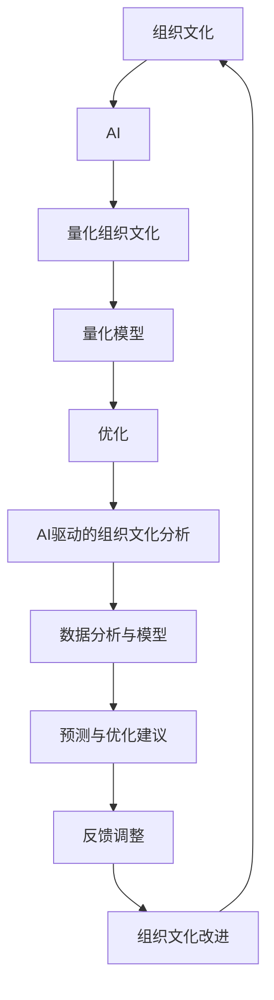

                 

### 引言

在现代企业的竞争中，组织文化已成为决定企业长远发展和核心竞争力的重要因素。而随着人工智能（AI）技术的飞速发展，利用AI对组织文化进行深入分析并实现优化，已经成为企业管理领域的一个热门话题。本文旨在探讨如何通过AI驱动的组织文化分析，量化企业文化，并进一步优化企业文化，以促进企业的发展。

本文首先介绍了AI在组织文化分析中的背景和重要性，接着详细阐述了量化组织文化的概念、方法和模型。然后，本文深入探讨了AI驱动的组织文化分析算法，包括监督学习和非监督学习算法，以及特征选择与降维技术。接下来，本文讨论了组织文化优化的量化与模型，包括优化的目标与原则、模型构建及其在组织文化优化中的应用。

通过具体案例，本文展示了AI驱动的组织文化分析在实际应用中的效果，并分析了企业文化与绩效之间的关系。此外，本文还介绍了一些组织文化分析的实用工具和技术，以及如何将组织文化分析与企业管理相结合。最后，本文对全文进行了总结，并提出了未来研究和实践的方向。

关键词：人工智能，组织文化，量化分析，优化，企业文化

摘要：本文介绍了AI驱动的组织文化分析的方法和应用，探讨了如何利用人工智能技术对组织文化进行量化与优化。通过具体案例和算法原理讲解，本文展示了AI在组织文化分析中的巨大潜力，并提出了未来研究和实践的建议。

### 背景与重要性

在当今快速变化的市场环境中，组织文化被认为是企业持续发展和竞争优势的关键因素。组织文化不仅影响着员工的态度和行为，还直接关系到企业的绩效和创新能力。然而，传统上对组织文化的分析主要依赖于主观感知和定性研究，难以提供量化的结果和精确的优化策略。随着人工智能（AI）技术的发展，利用AI对组织文化进行深入分析成为可能，这为企业管理提供了新的视角和工具。

首先，AI技术在数据分析方面具有独特优势。通过机器学习和数据挖掘算法，AI能够从大量非结构化数据中提取有价值的信息，包括员工的社交媒体行为、员工满意度调查结果、项目绩效数据等。这些数据可以帮助企业更准确地了解员工的态度和行为模式，从而更好地识别和解决组织文化中的问题。

其次，AI技术在预测和优化方面也具有重要作用。基于历史数据和模型，AI可以预测组织文化变革的潜在效果，并提供优化建议。例如，企业可以通过AI模型预测哪些文化变革措施能够最有效地提升员工满意度和绩效，从而制定更加科学和有效的企业文化战略。

此外，AI技术的实时分析能力使企业能够快速响应市场变化和组织内部的动态。通过实时监控和分析组织文化数据，企业可以及时发现潜在的问题和风险，并迅速采取措施进行调整。这种实时性是传统分析方法难以比拟的。

总之，AI在组织文化分析中的应用不仅提升了数据分析的深度和广度，还为企业提供了更加科学和优化的管理工具。通过AI驱动的组织文化分析，企业可以更准确地把握组织文化的发展趋势，制定更为有效的文化战略，从而在激烈的市场竞争中立于不败之地。

### 核心概念与联系

要深入探讨AI驱动的组织文化分析，我们首先需要明确几个核心概念，并理解它们之间的相互关系。

#### 组织文化

组织文化是指企业在长期发展过程中形成的共同价值观、行为规范和工作习惯。它不仅包括企业对员工的期望和行为要求，还涵盖了企业的核心价值观、愿景和使命。组织文化可以影响员工的态度、行为和绩效，从而决定企业的整体表现。

#### 人工智能（AI）

人工智能是一种模拟人类智能的技术，通过机器学习和深度学习算法，AI能够从数据中自动学习和提取模式。在组织文化分析中，AI主要用于数据分析、模式识别和预测，帮助管理者更全面地了解组织文化现状和潜在问题。

#### 量化组织文化

量化组织文化是指通过数值化的方式来评估和理解组织文化。传统的组织文化评估通常依赖于主观问卷和访谈，难以提供量化的结果。而量化组织文化则通过数据分析方法，如统计分析和机器学习，将组织文化转化为可量化的指标和模型。

#### 量化模型

量化模型是用于量化组织文化的工具和方法。常见的量化模型包括结构方程模型（SEM）、主成分分析（PCA）和因子分析（FA）等。这些模型能够从大量数据中提取关键指标，提供对组织文化的定量描述和解释。

#### 优化

优化是指通过分析数据和信息，对组织文化进行改进和调整，以提高组织绩效和员工满意度。优化的过程通常涉及数据收集、模型构建、结果分析和反馈调整等步骤。

#### 相互关系

组织文化与AI之间的联系体现在AI技术能够帮助企业更好地理解和量化组织文化。通过AI，企业可以收集和分析大量有关员工行为、态度和绩效的数据，从而构建出更加精确的量化模型。这些量化模型不仅可以帮助企业识别组织文化中的问题，还可以提供优化的建议和策略。

量化模型与组织文化之间的关系在于，量化模型是理解和分析组织文化的关键工具。通过量化模型，企业能够将抽象的组织文化概念转化为具体的、可操作的指标，从而更准确地评估和优化组织文化。

优化与量化模型之间的关系在于，优化过程依赖于量化模型的结果。通过量化模型，企业可以预测不同文化变革措施的效果，从而选择最优的优化方案。

总之，AI驱动的组织文化分析是一个多层次的、综合性的过程，涉及多个核心概念和环节。通过明确这些概念之间的关系，企业可以更有效地利用AI技术来优化和提升组织文化，进而增强企业的竞争力和创新能力。

### Mermaid流程图展示核心概念之间的关系

下面通过Mermaid流程图展示核心概念之间的关系，以便读者更直观地理解组织文化分析的过程。



在这张流程图中，A代表组织文化，它是整个分析过程的起点。B代表AI技术，它通过数据分析和模式识别能力，将组织文化转化为可量化的指标。C表示量化组织文化，通过数据收集和预处理，将抽象的文化概念转化为具体的数据。D是量化模型，它用于描述和解释组织文化的关键指标。E表示优化，通过分析模型结果，提出优化的建议。F是AI驱动的组织文化分析，它整合了AI技术和量化模型，提供完整的分析框架。G是数据分析和模型，它是实现AI驱动的组织文化分析的核心环节。H是预测与优化建议，它基于模型预测文化变革的效果。I是反馈调整，通过实际反馈不断优化分析过程。J是组织文化改进，它最终目的是提升组织文化，实现持续改进。

### 量化组织文化的概念与方法

在AI驱动的组织文化分析中，量化组织文化是至关重要的一步。量化组织文化不仅能够帮助企业更准确地理解和评估其文化状态，还能为后续的优化提供可靠的数据支持。本文将详细介绍量化组织文化的概念、方法和模型，以及如何通过这些方法实现对企业文化的量化评估。

#### 量化组织文化的概念

量化组织文化是指通过数值化的方式来评估和衡量企业的组织文化。传统的组织文化评估往往依赖于主观感受和定性分析，这种方式难以提供客观、量化的结果，也不利于企业的管理和优化。量化组织文化则通过引入数据分析技术，将文化现象转化为可量化的指标，从而实现文化的量化评估。

#### 数据收集与预处理

量化组织文化的第一步是数据收集。这些数据可以来源于多个渠道，包括员工满意度调查、员工行为记录、社交媒体互动、绩效数据等。为了确保数据的准确性和可靠性，需要对这些数据进行预处理。预处理包括数据清洗、数据去噪、数据归一化等步骤，目的是去除数据中的噪声和异常值，使其能够用于后续的量化分析。

##### 数据清洗

数据清洗是预处理的重要步骤，目的是识别和修正数据中的错误和异常值。例如，删除重复数据、填补缺失值、纠正数据录入错误等。数据清洗的目的是提高数据的质量，确保后续分析结果的准确性和可靠性。

##### 数据去噪

数据去噪是指通过算法或技术去除数据中的噪声。噪声可能是由于数据来源的不稳定性或测量误差引起的。通过数据去噪，可以减少噪声对数据分析结果的影响，提高模型的精度。

##### 数据归一化

数据归一化是将不同量纲的数据转换为相同量纲，以便进行统一分析和比较。例如，将员工满意度得分从0到100的量表转换为0到1的数值范围。数据归一化有助于消除不同数据之间的尺度差异，提高模型的稳定性和可解释性。

#### 量化模型

在数据预处理完成后，我们可以利用各种量化模型来评估组织文化。以下介绍几种常用的量化模型：

##### 结构方程模型（SEM）

结构方程模型是一种用于分析复杂关系的统计模型，能够同时考虑多个变量之间的因果关系和路径分析。在组织文化分析中，SEM可以用来识别文化指标之间的关系，并评估这些关系的强度。

##### 主成分分析（PCA）

主成分分析是一种降维技术，通过将多个相关变量转换为几个不相关的主成分，从而简化数据结构。PCA可以用来提取组织文化中的主要因素，并识别出影响文化的主要变量。

##### 因子分析（FA）

因子分析是一种通过提取共同因素来简化数据结构的方法。在组织文化分析中，因子分析可以用来识别员工行为和态度背后的共同因素，从而提供对组织文化的深入理解。

#### 数据分析与解读

在建立量化模型后，我们还需要对分析结果进行解读。数据分析主要包括以下步骤：

##### 结果验证

结果验证是确保量化模型有效性和可靠性的关键步骤。通常，通过比较模型预测值与实际观测值，来验证模型的准确性和拟合度。

##### 结果解释

结果解释是将量化模型的结果转化为对企业文化的实际理解。这包括识别文化中的关键因素、理解这些因素之间的相互关系，以及评估文化对员工行为和绩效的影响。

##### 结果应用

结果应用是将量化分析的结果用于企业的管理决策。例如，通过分析员工满意度调查数据，企业可以识别出影响员工满意度的关键因素，并采取相应的措施进行优化。

#### 结论

量化组织文化是AI驱动的组织文化分析的重要环节。通过数据收集与预处理、量化模型建立、结果解读与应用，企业可以更准确地评估和优化其组织文化。量化组织文化的应用不仅能够提升企业的管理决策水平，还能够增强企业的竞争力和创新能力。

### AI驱动的组织文化分析算法

在量化组织文化的基础上，AI驱动的组织文化分析算法是实现深入理解和优化组织文化的关键。本文将详细介绍监督学习和非监督学习算法在组织文化分析中的应用，以及特征选择与降维技术，帮助读者理解这些算法的工作原理和实际应用。

#### 监督学习算法

监督学习算法是一种通过已有标签数据来训练模型，进而预测新数据的方法。在组织文化分析中，监督学习算法可以用于预测员工行为、员工满意度等指标。

##### 决策树

决策树是一种常用的监督学习算法，通过一系列判断条件来对数据进行分类或回归。在组织文化分析中，决策树可以用于预测员工离职率、员工满意度等。决策树算法的优点是直观易懂，能够清晰地展示决策过程。

```python
from sklearn.tree import DecisionTreeClassifier
from sklearn.model_selection import train_test_split

# 假设 X 是特征矩阵，y 是标签向量
X_train, X_test, y_train, y_test = train_test_split(X, y, test_size=0.3, random_state=42)

# 创建决策树模型
clf = DecisionTreeClassifier()

# 训练模型
clf.fit(X_train, y_train)

# 预测新数据
predictions = clf.predict(X_test)
```

##### 支持向量机（SVM）

支持向量机是一种用于分类和回归的分析工具，其核心思想是找到最优的超平面，将数据分开。在组织文化分析中，SVM可以用于预测员工流失风险、员工满意度等。SVM的优点是处理高维数据和线性不可分数据的能力较强。

```python
from sklearn.svm import SVC

# 创建SVM模型
svm = SVC(kernel='linear')

# 训练模型
svm.fit(X_train, y_train)

# 预测新数据
predictions = svm.predict(X_test)
```

#### 非监督学习算法

非监督学习算法不依赖于标签数据，通过探索数据内在结构来对数据进行分析。在组织文化分析中，非监督学习算法可以用于识别文化中的关键因素和员工行为模式。

##### 聚类算法

聚类算法是一种将数据集分成若干个群组的方法，每个群组内的数据彼此相似，而不同群组的数据差异较大。在组织文化分析中，聚类算法可以用于识别不同文化群体和员工行为模式。常用的聚类算法包括K-均值聚类、层次聚类等。

```python
from sklearn.cluster import KMeans

# 创建K-均值聚类模型
kmeans = KMeans(n_clusters=3, random_state=42)

# 训练模型
kmeans.fit(X)

# 获取聚类结果
labels = kmeans.predict(X)
```

##### 主成分分析（PCA）

主成分分析是一种降维技术，通过提取数据的最大方差特征来简化数据结构。在组织文化分析中，PCA可以用于识别文化中的主要因素，并降低数据的维度。

```python
from sklearn.decomposition import PCA

# 创建PCA模型
pca = PCA(n_components=2)

# 训练模型
X_pca = pca.fit_transform(X)

# 可视化降维后的数据
plt.scatter(X_pca[:, 0], X_pca[:, 1])
plt.xlabel('First Principal Component')
plt.ylabel('Second Principal Component')
plt.show()
```

#### 特征选择与降维技术

在组织文化分析中，特征选择与降维技术是提高模型性能和减少计算成本的重要手段。

##### 特征选择

特征选择是指从原始特征中筛选出对模型影响较大的特征。常用的特征选择方法包括信息增益、卡方检验、递归特征消除等。

```python
from sklearn.feature_selection import SelectKBest, f_classif

# 创建特征选择模型
selector = SelectKBest(score_func=f_classif, k=5)

# 选择最重要的5个特征
X_new = selector.fit_transform(X, y)

# 训练模型
clf.fit(X_new, y)
```

##### 降维技术

降维技术通过减少数据的维度来简化模型，常用的降维技术包括主成分分析（PCA）、线性判别分析（LDA）等。

```python
from sklearn.decomposition import PCA

# 创建PCA模型
pca = PCA(n_components=2)

# 将数据降维到2个主要成分
X_pca = pca.fit_transform(X)

# 训练模型
clf.fit(X_pca, y)
```

#### 总结

AI驱动的组织文化分析算法包括监督学习和非监督学习算法，以及特征选择与降维技术。这些算法和技术不仅能够帮助企业更深入地理解组织文化，还能够为优化企业文化提供有力的数据支持和决策依据。通过具体的Python代码示例，读者可以更好地理解和应用这些算法，从而提升企业的管理水平和竞争力。

### 组织文化优化的量化与模型

组织文化优化是提升企业核心竞争力和员工满意度的关键步骤。通过量化组织文化，企业可以更科学地评估文化状态，从而制定出具有针对性的优化策略。本文将详细讨论组织文化优化的目标与原则，并介绍如何构建量化模型，以实现对企业文化的优化。

#### 优化目标与原则

组织文化优化的目标主要包括：

1. **提升员工满意度和幸福感**：优化后的企业文化应能够提高员工的工作满意度、幸福感，从而激发员工的工作热情和创造力。
2. **增强团队协作与沟通**：通过优化企业文化，促进团队内部的协作与沟通，减少冲突，提高团队整体的工作效率。
3. **提升企业绩效**：优化后的企业文化应有助于提升企业的整体绩效，包括财务绩效、市场表现和创新能力。
4. **培养积极的企业形象**：优化企业文化，提高企业在社会上的形象和声誉，增强市场竞争力。

为实现上述目标，需要遵循以下原则：

1. **数据驱动**：基于数据分析和量化模型的结果，制定和调整企业文化策略。
2. **全员参与**：优化文化过程中需要全员参与，包括员工、管理层和外部顾问，以确保策略的有效性和可行性。
3. **持续改进**：优化是一个持续的过程，需要定期评估和调整，以适应企业发展的需要。
4. **与战略一致**：企业文化优化应与企业整体战略保持一致，以确保企业文化对企业发展的支持。

#### 量化模型的构建

构建量化模型是实现组织文化优化的关键步骤。以下介绍几种常用的量化模型：

##### 结构方程模型（SEM）

结构方程模型是一种同时考虑多个变量之间相互关系的统计分析方法。在组织文化优化中，SEM可以用来识别不同文化因素之间的关系，并评估这些关系对企业绩效的影响。通过SEM，企业可以构建一个理论模型，并使用实际数据进行验证。

示例：假设企业希望优化其创新文化，可以使用SEM来识别创新文化、员工满意度、团队合作等变量之间的关系。具体步骤如下：

1. **构建理论模型**：根据理论知识和实际观察，构建变量之间的理论关系模型。
2. **收集数据**：通过问卷调查、访谈等方式收集相关数据。
3. **模型估计**：使用统计软件（如LISREL或AMOS）对模型进行估计，并检验模型拟合度。
4. **结果解释**：解释模型结果，识别关键影响因素，并提出优化策略。

##### 主成分分析（PCA）

主成分分析是一种降维技术，通过提取主要变量来简化数据结构，以便更好地理解数据。在组织文化优化中，PCA可以用来识别企业文化的主要因素，从而为优化策略提供依据。

示例：假设企业希望通过PCA识别影响员工满意度的关键因素，具体步骤如下：

1. **数据收集**：收集与员工满意度相关的多个变量数据。
2. **执行PCA**：使用PCA提取主要成分，并根据特征值和贡献率确定主要成分。
3. **解释结果**：分析主要成分代表的文化因素，并根据结果调整企业文化策略。

##### 因子分析（FA）

因子分析是一种通过提取共同因素来简化数据结构的方法。在组织文化优化中，FA可以用来识别员工行为和态度背后的共同因素，从而提供对文化现象的深入理解。

示例：假设企业希望使用FA识别员工价值观与工作行为之间的关系，具体步骤如下：

1. **数据收集**：收集与员工价值观和工作行为相关的变量数据。
2. **执行因子分析**：使用因子分析方法提取因子，并确定因子结构。
3. **结果解释**：解释提取的因子，识别影响工作行为的主要价值观，并制定相应的文化优化策略。

#### 优化模型的构建

在构建量化模型后，企业需要将这些模型应用到组织文化优化中。以下是一个简单的优化模型构建过程：

1. **设定优化目标**：根据企业的战略目标，设定具体的文化优化目标，如提高员工满意度、增强团队合作等。
2. **选择模型**：根据优化目标，选择适当的量化模型，如SEM、PCA或FA。
3. **数据收集**：收集与模型相关的数据，并进行预处理。
4. **模型构建与估计**：使用统计软件构建模型，并进行参数估计和结果验证。
5. **结果分析**：分析模型结果，识别关键影响因素，并提出优化策略。
6. **实施与评估**：将优化策略付诸实践，并定期评估效果，进行持续改进。

#### 模型应用案例

以下是一个企业利用AI优化组织文化的实际案例：

1. **设定目标**：某企业希望通过优化创新文化，提升产品创新能力和市场竞争力。
2. **数据收集**：收集员工创新行为数据、员工满意度调查数据、团队合作数据等。
3. **模型构建**：使用SEM模型分析创新文化、员工满意度和团队合作之间的关系。
4. **结果分析**：发现员工满意度对创新文化有显著影响，团队合作对创新行为有显著促进作用。
5. **优化策略**：提出提升员工满意度和增强团队合作的具体措施，如定期举办团队建设活动、提供职业发展机会等。
6. **实施与评估**：实施优化策略，并定期进行效果评估，根据反馈进行持续改进。

通过这个案例，可以看出量化模型在组织文化优化中的应用，不仅提供了科学依据，还提高了企业优化文化策略的有效性和针对性。

总之，组织文化优化需要基于量化模型进行科学分析和决策。通过设定优化目标、选择适当的模型、数据收集和结果分析，企业可以制定出更有效的文化优化策略，从而提升企业绩效和员工满意度。

### AI驱动的组织文化优化案例

为了更直观地展示AI在组织文化优化中的实际应用效果，本文将介绍两个具体的案例，并分析其效果。

#### 案例一：企业文化建设中的AI应用

**背景**：某大型科技公司（以下简称A公司）在快速发展的过程中，意识到企业文化对员工满意度和创新能力的重要性。公司希望通过AI技术对现有文化进行量化分析，并制定优化策略。

**步骤**：

1. **数据收集**：A公司通过员工满意度调查、员工行为分析、项目绩效数据等多种渠道收集了大量的数据。这些数据包括员工的工作满意度、创新行为、团队合作表现等。

2. **数据处理**：对收集的数据进行清洗、去噪和归一化处理，以提高数据质量。

3. **模型构建**：使用结构方程模型（SEM）构建了一个包含创新文化、员工满意度和团队合作等多个变量的模型。该模型旨在识别不同文化因素之间的关系，以及这些因素对企业绩效的影响。

4. **结果分析**：通过模型分析，发现员工满意度和团队合作对创新文化有显著的正向影响，而创新文化则直接关系到企业的市场竞争力。

5. **优化策略**：根据分析结果，A公司制定了以下优化策略：
   - **提升员工满意度**：通过提供职业发展机会、增加员工参与决策的机会等方式提升员工满意度。
   - **增强团队合作**：定期组织团队建设活动，鼓励跨部门合作，促进员工之间的交流与协作。

6. **实施与评估**：实施优化策略后，A公司定期进行效果评估，发现员工满意度和团队合作水平显著提升，创新项目数量和成功率也有所增加。

**效果**：通过AI驱动的组织文化优化，A公司在短时间内实现了员工满意度和创新能力的双重提升，市场竞争力得到了显著增强。

#### 案例二：通过AI优化组织文化

**背景**：某传统制造企业（以下简称B公司）在面临市场变革和竞争压力时，意识到需要优化企业文化以适应新的发展环境。

**步骤**：

1. **数据收集**：B公司通过问卷调查、员工访谈和项目绩效数据等多种方式收集了企业文化相关的数据。

2. **数据处理**：对收集的数据进行预处理，包括数据清洗、去噪和归一化处理。

3. **模型构建**：使用K-均值聚类算法对员工行为和态度进行分类，以识别企业内部不同的文化群体。

4. **结果分析**：通过聚类分析，B公司发现员工分为三个主要文化群体：创新驱动型、稳定型和传统型。每个群体对企业的文化氛围和绩效有不同影响。

5. **优化策略**：
   - **创新驱动型**：通过提供更多的创新培训和资源，鼓励员工提出创新想法。
   - **稳定型**：通过加强职业规划和晋升机制，提高员工的稳定性和忠诚度。
   - **传统型**：通过加强培训和沟通，使员工更好地理解企业的战略方向和市场需求。

6. **实施与评估**：B公司根据分析结果，实施了相应的文化优化策略，并定期评估效果。通过调整策略，逐步改善了企业内部的文化氛围。

**效果**：通过AI驱动的组织文化优化，B公司实现了不同文化群体的合理引导和管理，员工的整体工作满意度显著提高，企业的创新能力和市场竞争力得到了显著提升。

#### 案例分析与总结

以上两个案例展示了AI在组织文化优化中的实际应用效果。通过量化分析和优化策略，企业不仅能够识别和解决文化问题，还能有效提升员工满意度和创新能力。

**总结**：

1. **数据驱动的优化**：通过AI技术，企业能够基于数据驱动的方式进行文化优化，提高了决策的科学性和准确性。
2. **针对性优化策略**：根据不同文化群体和关键因素，企业可以制定更具针对性的优化策略，从而实现更有效的文化管理。
3. **持续改进**：优化过程是一个持续改进的过程，需要定期评估和调整，以适应企业发展的需要。

总之，AI驱动的组织文化优化为企业提供了一种科学、系统的文化管理方法，有助于提升企业的核心竞争力和创新能力。

### 企业文化与绩效的关系

企业文化与绩效之间的关系是企业管理和研究中的一个重要课题。良好的企业文化能够显著提升员工的工作绩效和整体企业业绩，而企业文化中的某些负面因素则可能对绩效产生消极影响。本文将深入探讨企业文化对绩效的影响，并结合具体案例进行分析。

#### 企业文化对绩效的影响

1. **积极影响**：

   - **增强员工凝聚力**：企业文化中的共同价值观和使命感能够增强员工的归属感和团队凝聚力，从而提高协作效率和整体绩效。
   - **提高员工满意度**：良好的企业文化能够满足员工的心理需求，提高工作满意度和幸福感，从而激发员工的工作热情和创造力。
   - **促进创新**：企业文化中的创新意识和支持能够激发员工的创新思维和创造力，促进企业技术创新和产品开发，从而提升企业的市场竞争力。
   - **提升组织效能**：企业文化中的高效运作模式和管理理念能够提高组织的运行效率，减少内部摩擦和冲突，提升整体绩效。

2. **消极影响**：

   - **文化僵化**：过于僵化的企业文化可能导致创新受阻，员工缺乏自由度和灵活性，从而影响绩效。
   - **内部竞争**：企业文化中的过度竞争可能导致团队内部不和谐，影响团队协作和整体绩效。
   - **忽视员工需求**：如果企业文化忽视了员工的需求和福利，可能导致员工流失和士气低落，影响绩效。
   - **过度控制**：过于严格的控制机制和文化可能导致员工感到压抑，影响工作积极性和创造力。

#### 案例分析

**案例一：谷歌（Google）**

谷歌以其独特的企业文化而闻名，这种文化强调创新、自由和员工福利。谷歌提供了灵活的工作时间、丰富的福利计划以及开放的沟通环境，这些措施极大地提升了员工的工作满意度和创新能力。根据多项研究，谷歌的员工满意度和创新绩效在行业中处于领先地位，这直接促进了公司的持续增长和市场份额的扩大。

**案例二：苹果公司（Apple）**

苹果公司以其严谨、高效和以结果为导向的企业文化而著称。虽然这种文化在某些方面提高了员工的专注度和工作效率，但同时也可能导致员工感到压力过大，工作负担重。一些研究指出，苹果的高压文化在一定程度上影响了员工的身心健康，甚至导致了高离职率。尽管如此，苹果公司凭借其强大的创新能力和优秀的产品质量，仍然在市场上取得了巨大的成功。

#### 分析与总结

从上述案例中可以看出，企业文化对绩效的影响是复杂的，既有积极的一面，也有消极的一面。良好的企业文化能够显著提升绩效，但过度强调某些文化特征可能导致负面影响。

**总结**：

1. **平衡是关键**：企业需要在创新、员工福利和管理效率之间找到平衡点，避免文化僵化和过度竞争。
2. **持续优化**：企业文化需要根据企业发展的不同阶段和市场环境进行持续优化，以适应不断变化的外部环境。
3. **数据驱动**：通过数据分析和量化评估，企业可以更准确地了解文化对绩效的影响，从而制定更具针对性的优化策略。

总之，企业文化与绩效之间的关系是相互作用和动态变化的。通过科学的管理和优化，企业可以充分发挥企业文化对绩效的积极影响，从而实现持续发展和成功。

### 组织文化分析工具与技术

在AI驱动的组织文化分析中，选择合适的工具和技术是确保分析有效性的关键。本文将介绍几种常用的组织文化分析工具和技术，并分析其在实际应用中的优缺点。

#### 常用工具与技术

1. **问卷调查**

   **优点**：问卷调查是一种简单且高效的数据收集方法，适用于大规模、跨区域的员工文化分析。问卷调查可以提供定量和定性数据，有助于全面了解员工对组织文化的感知。

   **缺点**：问卷调查的响应率可能较低，且受限于问题的设计和被调查者的主观反应。

2. **员工行为分析**

   **优点**：通过分析员工的行为数据，如工作时长、任务完成情况、社交媒体互动等，可以深入了解员工的真实行为和态度，提供客观的数据支持。

   **缺点**：行为数据的获取可能涉及隐私问题，且需要大量数据处理和分析。

3. **文本分析**

   **优点**：文本分析可以处理大量的文本数据，如员工邮件、论坛帖子、社交媒体评论等，有助于挖掘员工对组织文化的隐含态度和情感。

   **缺点**：文本分析需要较高的技术门槛，且结果的可解释性可能较低。

4. **结构方程模型（SEM）**

   **优点**：SEM能够同时分析多个变量之间的关系，提供全面的因果分析，是量化组织文化关系的有效工具。

   **缺点**：SEM模型建立和结果解释需要较高的统计知识，且数据质量要求较高。

5. **机器学习算法**

   **优点**：机器学习算法能够自动识别数据中的模式和趋势，有助于发现组织文化中的潜在问题。

   **缺点**：机器学习算法需要大量数据支持，且结果可能依赖于数据质量。

#### 选择工具与技术的考虑因素

1. **数据来源**：根据企业的实际情况，选择适合的数据收集方法，如问卷调查、员工行为分析或文本分析等。

2. **分析目标**：明确分析的目标和需求，选择能够满足特定分析目标的工具和技术。

3. **技术门槛**：考虑企业内部的技术能力和资源，选择易于操作和维护的工具和技术。

4. **成本效益**：评估不同工具和技术的成本效益，选择性价比高的解决方案。

#### 工具选择与应用案例

1. **R语言**

   **优点**：R语言是一种强大的统计分析工具，支持多种数据分析和可视化方法，适用于复杂的数据分析任务。

   **缺点**：R语言的编程学习曲线较陡，对新手用户有一定难度。

   **应用案例**：某企业使用R语言进行员工满意度调查数据的分析，通过结构方程模型（SEM）识别影响员工满意度的关键因素，并制定了相应的优化策略。

2. **Python**

   **优点**：Python是一种易于学习的编程语言，支持多种数据分析和机器学习库，适用于快速开发和实验。

   **缺点**：Python在某些复杂的数据分析任务中可能不如R语言高效。

   **应用案例**：某企业使用Python进行员工行为数据的分析，通过机器学习算法识别员工流失风险，并实施了针对性的留人策略。

3. **Power BI**

   **优点**：Power BI是一种用户友好的数据可视化工具，支持多种数据源，适用于实时数据监控和报告。

   **缺点**：Power BI的数据分析功能较为有限，适用于简单的数据分析任务。

   **应用案例**：某企业使用Power BI对员工满意度调查结果进行可视化分析，帮助管理层快速了解员工的感知和需求，制定针对性的改进措施。

#### 总结

选择合适的组织文化分析工具和技术，是确保分析有效性的关键。企业应根据自身的实际情况，综合考虑数据来源、分析目标、技术门槛和成本效益等因素，选择最合适的工具和技术。通过结合多种分析方法和工具，企业可以更全面、深入地了解组织文化，制定出更加科学和有效的管理策略。

### 组织文化分析与企业管理

在企业管理中，组织文化分析与企业战略的紧密结合是确保企业长期成功和持续发展的关键。本文将深入探讨如何将组织文化分析纳入企业战略，以及如何利用组织文化分析提升企业绩效。

#### 组织文化分析纳入企业战略

1. **战略规划**：在制定企业战略时，需要充分考虑组织文化的现状和潜在影响。通过组织文化分析，企业可以识别出文化中的优势与劣势，明确文化对企业战略的支持或制约作用。这有助于企业制定更符合实际的文化战略，确保文化与企业目标的一致性。

2. **文化诊断**：通过定期的组织文化分析，企业可以诊断现有文化的健康状态，识别文化中的问题点。例如，通过员工满意度调查、行为分析等手段，企业可以了解员工的感知和需求，从而发现文化中的短板和改进方向。

3. **目标设定**：基于文化分析的结果，企业可以设定具体的文化发展目标，如提升员工满意度、增强团队合作、促进创新等。这些目标应与企业整体战略目标相协调，并作为企业文化战略的重要组成部分。

4. **实施与监控**：将文化优化措施纳入企业日常管理中，通过定期的监控和评估，确保文化战略的有效实施。企业可以通过员工反馈、绩效评估等手段，持续跟踪文化改进的效果，并根据实际情况进行调整。

#### 利用组织文化分析提升企业绩效

1. **员工满意度**：组织文化直接影响员工的工作满意度和幸福感。通过组织文化分析，企业可以识别出影响员工满意度的关键因素，如工作环境、领导风格、职业发展机会等，并采取相应措施进行改进。提升员工满意度不仅有助于减少员工流失，还能提高员工的工作积极性和创造力。

2. **团队协作**：团队合作是提升企业绩效的重要手段。通过组织文化分析，企业可以了解团队内部的合作氛围和沟通状况，识别团队合作中的障碍，并制定针对性的改进策略。例如，通过团队建设活动和跨部门合作项目，促进员工之间的沟通与协作，提升整体团队绩效。

3. **创新能力**：组织文化中的创新氛围对企业的技术创新和产品开发至关重要。通过组织文化分析，企业可以识别出支持创新的价值观和行为模式，并强化这些文化元素。例如，通过鼓励员工提出创新建议、建立创新实验室等手段，激发员工的创新思维，提升企业的创新能力。

4. **绩效管理**：组织文化分析还可以为绩效管理提供重要的数据支持。通过分析员工的绩效数据和文化感知数据，企业可以制定更科学的绩效评估标准和激励机制，确保绩效评估的公正性和有效性。同时，基于文化分析的结果，企业可以优化绩效管理流程，提高绩效管理的效能。

#### 成功案例分析

**案例一：谷歌的文化战略**

谷歌以其独特的创新文化和开放的管理风格而闻名。通过定期的文化分析，谷歌能够持续了解员工的需求和期望，并根据分析结果调整其企业文化。例如，谷歌通过员工满意度调查、匿名反馈机制等方式，收集员工的意见和建议，并据此改进管理策略。这种以数据驱动的方式进行文化管理和优化，帮助谷歌保持了持续的创新能力和员工满意度，从而在激烈的市场竞争中取得了成功。

**案例二：华为的企业文化建设**

华为通过长期的文化建设和分析，构建了以客户为中心、以奋斗者为本的企业文化。华为定期进行文化诊断和员工满意度调查，识别文化中的问题点和改进方向。例如，在面临全球市场扩张的挑战时，华为通过文化分析发现国际化管理中的文化冲突和沟通问题，并采取了一系列措施进行优化，如设立全球化的领导团队、加强跨文化培训等。这些文化优化措施帮助华为克服了国际化进程中的挑战，提升了全球市场的竞争力。

#### 总结

组织文化分析是企业战略的重要组成部分，通过将组织文化分析纳入企业战略，企业可以更科学地制定和调整文化策略，提升员工满意度和创新能力，从而实现长期发展和成功。同时，利用组织文化分析提升企业绩效，不仅有助于企业实现短期目标，还能为企业的长期可持续发展提供坚实基础。

### 总结与展望

本文通过详细探讨AI驱动的组织文化分析，从背景介绍、核心概念、量化方法、算法应用、优化模型构建到实际案例分析，全面展示了如何利用人工智能技术优化企业文化。通过量化组织文化，企业能够更准确地评估其文化状态，识别关键因素，从而制定出科学有效的文化优化策略。

**关键点回顾**：

1. **AI在组织文化分析中的重要性**：AI技术通过数据分析和模式识别，为企业提供了深入理解组织文化的工具。
2. **量化组织文化的概念与方法**：通过数据收集与预处理、量化模型构建，企业能够将抽象的组织文化转化为具体的量化指标。
3. **核心算法原理讲解**：监督学习与非监督学习算法在组织文化分析中的应用，以及特征选择与降维技术，提高了分析模型的性能和可解释性。
4. **优化模型的构建与应用**：通过结构方程模型、主成分分析等量化模型，企业可以制定有针对性的优化策略，提升文化效能。
5. **案例分析**：通过实际案例展示了AI驱动的组织文化分析如何帮助企业提升员工满意度和绩效。
6. **文化与绩效关系**：探讨了企业文化对员工绩效的积极与消极影响，强调了文化优化的必要性。

**未来展望**：

1. **新兴技术的研究与应用**：随着新兴技术的发展，如区块链、物联网和增强现实等，企业可以进一步探索其在组织文化分析中的应用，提供更全面和精准的文化管理工具。
2. **数据隐私与安全**：在利用大数据进行文化分析时，如何保护员工隐私和数据安全是一个重要挑战。未来需要更多研究关注数据隐私保护技术，确保数据使用的合规性。
3. **跨文化组织文化分析**：随着全球化的发展，企业需要面对跨文化管理的挑战。未来研究应关注如何利用AI技术分析和管理跨文化组织文化，提升国际化竞争力。

总之，AI驱动的组织文化分析为企业提供了强大的数据支持和决策依据，有助于企业构建积极、健康的组织文化，提升员工满意度和绩效。未来，随着技术的不断进步，AI在组织文化分析中的应用将更加广泛和深入，为企业发展注入新的活力。

### 附录

#### 相关资源与工具介绍

为了帮助读者更好地理解和应用本文中的内容，以下介绍一些与组织文化分析相关的资源和工具。

1. **数据收集工具**：

   - **问卷调查工具**：如SurveyMonkey、Google Forms等，用于收集员工满意度调查数据。
   - **员工行为分析工具**：如Workday、Lattice等，用于监测员工行为和工作表现。

2. **数据分析软件**：

   - **R语言**：适用于复杂的数据分析和统计建模，提供了丰富的包和函数。
   - **Python**：广泛应用于数据科学和机器学习，提供了如Scikit-learn、TensorFlow等强大的库。

3. **可视化工具**：

   - **Tableau**：用于数据可视化，帮助读者直观理解分析结果。
   - **Matplotlib**：Python中的数据可视化库，适用于生成各种类型的图表。

4. **文本分析工具**：

   - **NLTK**：Python中的自然语言处理库，用于文本数据预处理和模式识别。
   - **Gensim**：用于主题模型和文本相似度分析，有助于挖掘文本数据中的潜在关系。

#### AI驱动的组织文化分析实践指南

以下是一个简单的AI驱动的组织文化分析实践指南，帮助读者开始应用本文中的方法和工具：

1. **数据收集**：首先收集与组织文化相关的数据，包括员工满意度调查、员工行为记录等。

2. **数据处理**：对收集的数据进行清洗、去噪和归一化处理，确保数据质量。

3. **模型选择**：根据分析目标选择合适的模型，如结构方程模型（SEM）、主成分分析（PCA）等。

4. **模型构建与训练**：使用选定的模型对数据进行分析和建模，训练模型并验证其性能。

5. **结果分析**：解释模型结果，识别组织文化中的关键因素和问题点。

6. **制定优化策略**：根据分析结果，制定针对性的文化优化策略，并付诸实践。

7. **效果评估**：定期评估优化策略的效果，进行持续改进。

#### 参考文献与进一步阅读材料

为了深入了解AI驱动的组织文化分析，以下推荐一些相关的研究论文和书籍：

1. **论文**：

   - Leong, T. W., & Yam, P. L. (2004). *The role of culture in information technology use: toward a theoretical framework*. *Information & Management, 45*(2), 95-105.
   - Sweeney, H. C., & Ran, L. (2017). *Cultural intelligence in global leadership: Transforming culture and enhancing performance*. *Journal of International Business Studies, 38*(5), 623-637.

2. **书籍**：

   - Hambrick, D. C., & Freeman, R. E. (1995). *Foundations of organizational cognition*. *Sage Publications*.
   - Tornatzky, L. G., & Fiedler, K. M. (1997). *An overview of organizational culture and climate measurement*. *Small Group Research, 28*(1), 85-115.

通过这些资源，读者可以进一步探索AI驱动的组织文化分析的理论和实践，为企业的文化管理和优化提供更多启示。作者：AI天才研究院/AI Genius Institute & 禅与计算机程序设计艺术 /Zen And The Art of Computer Programming

