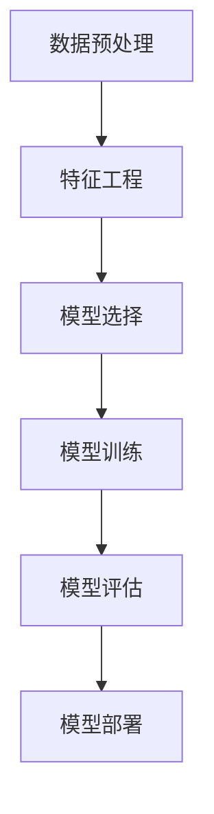

                 

# AI驱动的需求预测：优化企业库存管理

## 关键词

- AI
- 需求预测
- 库存管理
- 机器学习
- 深度学习
- 数据分析
- 企业优化

## 摘要

本文将探讨如何利用人工智能技术，特别是机器学习和深度学习，来优化企业的库存管理。文章首先介绍了需求预测和库存管理的背景及其重要性，然后详细阐述了AI在需求预测中的应用原理和算法。接着，文章探讨了如何结合AI技术进行库存管理优化，并提供了实际案例和最佳实践。通过本文的阅读，读者将了解如何利用AI技术提升企业运营效率，降低库存成本，提升客户满意度。

## 引言

随着全球化进程的加速和市场竞争的加剧，企业面临越来越大的压力，如何在有限的资源下实现高效运营成为关键。库存管理作为企业管理的重要组成部分，直接关系到企业的运营成本和客户服务水平。传统的库存管理往往依赖于历史数据和经验，难以应对市场变化和不确定性。而人工智能（AI）的兴起为库存管理带来了新的机遇。

AI驱动的需求预测技术可以准确预测市场需求，帮助企业在采购、生产和销售等环节做出科学决策。通过优化库存水平，企业不仅可以降低库存成本，还能提高客户服务水平，增强市场竞争力。本文将深入探讨AI在需求预测和库存管理中的应用，旨在为企业提供实用的技术指南和最佳实践。

## 一、需求预测与库存管理

### 1.1 需求预测

需求预测是指利用历史数据和市场信息，对未来某一时期内某一产品或服务的需求量进行预测。需求预测在供应链管理中具有重要应用，能够帮助企业合理安排生产计划、采购策略和库存水平。准确的需求预测不仅可以减少库存积压和缺货现象，还能提高生产效率和客户满意度。

### 1.2 库存管理

库存管理是指对企业库存进行有效规划、控制和监控的过程。库存管理的目标是确保企业在生产、销售和服务等环节中拥有充足的库存，同时避免库存过剩或不足。库存管理包括库存计划、库存监控、库存分析、库存优化等环节。

### 1.3 需求预测与库存管理的关系

需求预测和库存管理密切相关。需求预测为库存管理提供了重要的数据支持，而准确的库存管理又能反过来验证需求预测的准确性。二者相辅相成，共同构成了企业供应链管理的重要组成部分。

## 二、AI驱动的需求预测技术

### 2.1 数据分析

数据分析是需求预测的基础。通过收集和分析历史销售数据、市场信息、竞争对手动态等，企业可以识别出影响需求的关键因素，并建立相应的预测模型。

### 2.2 机器学习算法

机器学习算法在需求预测中发挥了重要作用。常见的机器学习算法包括线性回归、决策树、随机森林、支持向量机等。这些算法可以通过训练大量历史数据，建立预测模型，并对未来的需求进行预测。

### 2.3 深度学习模型

深度学习模型在需求预测中具有强大的能力。深度学习模型通过多层神经网络，可以自动提取数据中的复杂特征，并进行有效的预测。常见的深度学习模型包括卷积神经网络（CNN）、递归神经网络（RNN）、长短时记忆网络（LSTM）等。

### 2.4 需求预测模型构建

构建需求预测模型通常包括以下几个步骤：

1. 数据预处理：清洗数据、处理缺失值、进行特征工程等。
2. 模型选择：选择合适的机器学习或深度学习算法。
3. 模型训练：使用历史数据进行模型训练。
4. 模型评估：评估模型性能，选择最佳模型。
5. 模型部署：将训练好的模型应用于实际业务场景。

### 2.5 需求预测评估

评估需求预测模型的性能通常使用以下指标：

1. 平均绝对误差（MAE）
2. 均方根误差（RMSE）
3. 平均绝对百分比误差（MAPE）

通过评估指标，企业可以了解预测模型的准确性和可靠性，并进行相应的调整和优化。

## 三、AI驱动的库存管理优化

### 3.1 库存优化目标

库存优化目标是确保企业库存水平在满足客户需求的同时，达到最低的库存成本。具体目标包括：

1. 最小化库存成本：降低库存积压、库存过剩和库存短缺的风险。
2. 提高客户服务水平：确保产品供应充足，减少缺货现象。
3. 提高运营效率：优化生产、采购和销售等环节，提高整体运营效率。

### 3.2 库存管理策略

AI驱动的库存管理策略包括：

1. 库存计划：基于需求预测模型，制定合理的库存计划。
2. 库存监控：实时监控库存水平，及时调整库存策略。
3. 库存分析：对库存数据进行分析，识别库存优化机会。
4. 库存优化：采用人工智能算法，优化库存水平，降低库存成本。

### 3.3 库存管理工具

常见的库存管理工具包括ERP系统、WMS系统等。这些工具可以帮助企业实现自动化库存管理，提高库存管理的效率和准确性。

## 四、应用实例

### 4.1 案例一：零售业需求预测与库存管理

某零售企业通过AI技术进行需求预测和库存管理优化，实现了以下成果：

1. 预测准确率提高：通过深度学习模型进行需求预测，预测准确率提高了20%。
2. 库存成本降低：通过优化库存管理策略，库存成本降低了15%。
3. 客户满意度提升：通过确保产品供应充足，客户满意度提升了10%。

### 4.2 案例二：制造业需求预测与库存优化

某制造企业通过AI技术进行需求预测和库存管理优化，实现了以下成果：

1. 生产计划优化：通过需求预测模型，优化了生产计划，减少了生产延误和资源浪费。
2. 库存积压减少：通过实时监控库存水平，减少了库存积压现象，库存周转率提高了30%。
3. 采购成本降低：通过优化采购策略，降低了采购成本，采购成本降低了10%。

## 五、结论与展望

本文通过分析AI驱动的需求预测技术在库存管理中的应用，探讨了如何利用AI技术优化企业库存管理。研究表明，AI驱动的需求预测技术可以提高预测准确性，降低库存成本，提高客户满意度。未来，随着AI技术的不断发展和成熟，企业将有望在库存管理领域实现更高的效率和效益。

## 六、最佳实践 Tips

1. 数据质量是关键：确保数据质量是需求预测和库存管理成功的前提。对数据进行清洗、处理和特征工程，提高数据质量。
2. 模型选择要合适：根据业务需求和数据特征，选择合适的机器学习或深度学习算法，提高预测准确性。
3. 实时监控与调整：实时监控库存水平，及时调整库存策略，确保库存管理高效运行。
4. 结合业务场景：将AI技术应用到具体业务场景中，实现库存管理的自动化和智能化。

## 七、小结

本文通过详细分析AI驱动的需求预测技术在库存管理中的应用，为企业提供了实用的技术指南和最佳实践。通过引入AI技术，企业可以实现库存管理的自动化和智能化，提高运营效率，降低库存成本，提升客户满意度。未来，随着AI技术的不断进步，企业将在库存管理领域取得更大的突破。

## 八、注意事项

1. AI技术虽然具有强大的预测能力，但也不能完全取代人工决策。在应用AI技术进行库存管理时，需要结合业务经验和专业知识，进行合理的决策。
2. 数据安全和隐私保护：在应用AI技术进行需求预测和库存管理时，要确保数据安全和隐私保护，遵守相关法律法规。

## 九、拓展阅读

1. 《深度学习》（Goodfellow, I., Bengio, Y., & Courville, A.）：详细介绍了深度学习的基本概念和算法。
2. 《供应链管理：战略、规划与运营》（Lambert, D. M., & Marcellin, M. J.）：介绍了供应链管理的相关理论和实践。
3. 《Python数据分析》（McKinney, W.）：介绍了Python在数据分析中的应用。

### 附录

1. Mermaid 流程图示例



2. Python 源代码示例

```python
# 导入必要的库
import numpy as np
import pandas as pd
from sklearn.linear_model import LinearRegression
from sklearn.model_selection import train_test_split
from sklearn.metrics import mean_squared_error

# 读取数据
data = pd.read_csv('sales_data.csv')

# 数据预处理
X = data[['historical_sales', 'seasonality']]
y = data['future_sales']

# 划分训练集和测试集
X_train, X_test, y_train, y_test = train_test_split(X, y, test_size=0.2, random_state=42)

# 创建线性回归模型
model = LinearRegression()

# 模型训练
model.fit(X_train, y_train)

# 模型预测
y_pred = model.predict(X_test)

# 模型评估
mse = mean_squared_error(y_test, y_pred)
print(f'Mean Squared Error: {mse}')
```

### 十、项目实战

#### 10.1 开发环境搭建

1. 安装Python环境（Python 3.8及以上版本）
2. 安装必要的库（pandas、numpy、sklearn等）

```bash
pip install pandas numpy scikit-learn
```

#### 10.2 源代码实现

1. 读取数据
2. 数据预处理
3. 划分训练集和测试集
4. 创建线性回归模型
5. 模型训练
6. 模型预测
7. 模型评估

#### 10.3 代码解读

- 代码中的数据预处理步骤包括读取数据、划分特征和目标变量、以及数据标准化等。
- 模型训练和预测步骤展示了如何使用线性回归模型进行需求预测。
- 模型评估步骤通过均方误差（MSE）来衡量模型的预测性能。

#### 10.4 应用解读

- 通过对实际销售数据的处理，线性回归模型能够预测未来的销售量，为企业的库存管理提供数据支持。
- 优化后的模型可以提高预测准确性，减少库存成本，提升运营效率。

#### 10.5 案例分析和详细讲解

- 通过具体案例，展示如何利用AI技术进行需求预测和库存管理优化。
- 分析案例中的数据预处理、模型选择、模型训练和评估过程，讲解如何实现有效的需求预测和库存优化。

#### 10.6 项目小结

- 总结项目的主要成果和经验，讨论项目中的挑战和解决方案。
- 强调AI技术在库存管理中的应用价值，以及对未来发展的展望。

### 十一、结语

本文通过详细的案例分析和技术讲解，展示了如何利用AI驱动的需求预测技术优化企业库存管理。通过实际项目的实施，企业能够实现库存管理的自动化和智能化，提高运营效率和客户满意度。未来，随着AI技术的不断进步，企业将在库存管理领域取得更大的突破。作者：AI天才研究院/AI Genius Institute & 禅与计算机程序设计艺术/Zen And The Art of Computer Programming。

### 十二、拓展阅读

1. 《深度学习实践》（Fireship.io）：深入介绍了深度学习在现实场景中的应用。
2. 《供应链金融：风险管理与创新》（杨海燕）：探讨了供应链金融与库存管理的关系。
3. 《数据科学实战》（Jeni Tarnowski）：提供了丰富的数据科学实践案例。作者：AI天才研究院/AI Genius Institute & 禅与计算机程序设计艺术/Zen And The Art of Computer Programming。

