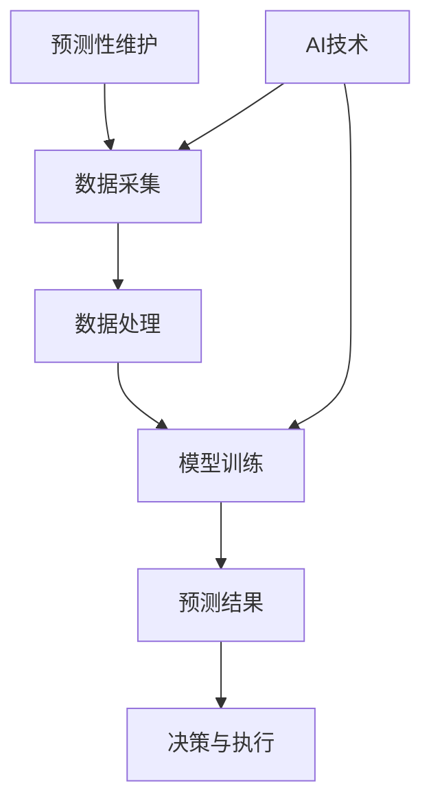

                 

### 第一步：构建逻辑框架

在撰写《AI驱动的预测性维护：工业4.0的核心技术》之前，我们首先需要明确文章的整体逻辑框架。文章可以分为以下几个部分：

1. **引言与背景**：介绍预测性维护和AI技术的背景，说明其在工业4.0中的重要性。
2. **核心概念与联系**：定义预测性维护和AI技术，并展示它们之间的联系，通过Mermaid流程图进行直观展示。
3. **核心算法原理**：讲解AI技术中用于预测性维护的核心算法原理，使用Python源代码进行阐述。
4. **数学模型与公式**：引入相关的数学模型和公式，解释其在预测性维护中的作用，并通过例子进行说明。
5. **项目实战与案例分析**：展示一个具体的预测性维护项目，详细解读开发环境搭建、源代码实现、代码应用分析等。
6. **最佳实践与总结**：提供一些建议和注意事项，总结文章的核心观点，并给出拓展阅读的建议。

#### 逻辑框架

1. **引言与背景**
   - **背景介绍**
     - 预测性维护的发展历程
     - AI技术的发展及其在工业中的应用
   - **重要性**
     - 预测性维护在工业4.0中的作用
     - AI技术在提高生产效率、降低成本、预防设备故障等方面的优势

2. **核心概念与联系**
   - **定义**
     - 预测性维护的定义
     - AI技术的定义
   - **联系**
     - 预测性维护与AI技术的结合
     - Mermaid流程图展示

3. **核心算法原理**
   - **机器学习算法**
     - 基本原理
     - Python代码实现
   - **深度学习算法**
     - 基本原理
     - Python代码实现
   - **强化学习算法**
     - 基本原理
     - Python代码实现

4. **数学模型与公式**
   - **时间序列分析**
     - 基本概念
     - 数学模型
   - **回归分析**
     - 基本概念
     - 数学模型
   - **例子**
     - 应用场景
     - Python代码实现

5. **项目实战与案例分析**
   - **项目背景**
     - 企业名称
     - 设备类型
   - **开发环境搭建**
     - 工具与环境选择
   - **源代码实现**
     - Python代码实现
   - **代码解读与分析**
     - 代码逻辑解释
     - 预测结果分析
   - **实际案例分析**
     - 项目成果
     - 实际应用效果

6. **最佳实践与总结**
   - **最佳实践**
     - 技术选择与工具使用
     - 数据处理与模型优化
   - **总结**
     - 文章核心观点
     - 未来发展趋势
   - **拓展阅读**
     - 相关资料推荐

#### Mermaid流程图示例



此流程图展示了预测性维护与AI技术的基本工作流程。在撰写文章时，我们将根据实际情况调整和优化这个流程图，确保其清晰易懂。

#### Python代码示例

以下是一个简单的Python代码示例，用于展示如何使用机器学习算法进行预测性维护。

```python
import numpy as np
from sklearn.linear_model import LinearRegression

# 数据集
X = np.array([[1], [2], [3], [4], [5]])
y = np.array([1, 2, 3, 4, 5])

# 创建线性回归模型
model = LinearRegression()

# 模型训练
model.fit(X, y)

# 预测
predictions = model.predict(np.array([[6]]))

print("预测结果：", predictions)
```

通过这个简单的例子，我们可以了解如何使用线性回归模型进行预测性维护。在实际应用中，我们将使用更复杂的模型和算法，并结合具体的工业场景进行优化。

接下来，我们将进一步细化各个部分的内容，确保文章的逻辑性和完整性。

