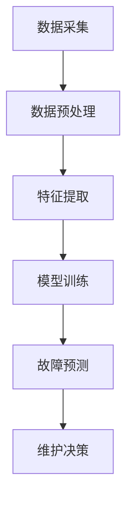

                 

- Step 1: 核心概念与联系
### AI驱动的预测维护：降低企业设备停机时间

关键词：人工智能，预测维护，深度学习，强化学习，机器学习，数据预处理，故障预测，企业设备，停机时间

摘要：本文将探讨AI驱动的预测维护技术如何通过分析设备数据来提前预测故障，从而降低企业设备的停机时间，提高生产效率。我们将深入分析核心概念与联系，讲解深度学习和强化学习算法原理，并展示一个实际的项目实战案例。

---

- Step 2: 核心概念与联系

**核心概念与联系**：
AI驱动的预测维护是利用人工智能技术，通过分析设备的历史数据、实时数据和运营环境数据，对设备的故障进行预测和预防性维护。核心概念包括：
- **预测维护**：利用机器学习算法，分析设备运行数据，预测设备故障时间，提前进行维护。
- **深度学习**：一种机器学习方法，通过多层神经网络，自动提取数据特征，提高预测准确性。
- **强化学习**：一种机器学习方法，通过与环境的交互，不断优化策略，提高预测效果。
- **数据预处理**：对原始数据进行分析和清洗，提高数据质量和模型性能。

### Mermaid 流程图



在AI驱动的预测维护系统中，数据采集是非常关键的一环。通过传感器和监控设备，可以实时收集设备的工作状态、温度、振动、压力等数据。这些数据经过数据预处理阶段，如去除噪声、缺失值填补、数据标准化等操作，然后进行特征提取，将原始数据转换为适合模型训练的格式。

在模型训练阶段，使用深度学习和强化学习算法，对设备数据进行训练，以建立故障预测模型。训练完成后，模型可以用于实时预测，一旦预测到设备可能发生故障，系统将触发维护决策，安排预防性维护，以避免设备停机。

### Step 3: 核心算法原理讲解

**核心算法原理讲解**：

1. **深度学习算法**：

深度学习是一种通过多层神经网络对数据进行特征提取和分类的方法。其核心原理包括：

- **神经网络**：由多个神经元组成的计算模型，每个神经元接收多个输入，并输出一个输出。
- **激活函数**：用于引入非线性关系，常见的激活函数包括Sigmoid、ReLU等。
- **反向传播**：通过计算损失函数对网络参数进行优化，使输出更接近真实值。

以下是一个简单的深度学习模型搭建的Python代码示例：

```python
import tensorflow as tf

# 创建模型
model = tf.keras.Sequential([
    tf.keras.layers.Dense(128, activation='relu', input_shape=(num_features,)),
    tf.keras.layers.Dense(64, activation='relu'),
    tf.keras.layers.Dense(1, activation='sigmoid')
])

# 编译模型
model.compile(optimizer='adam',
              loss='binary_crossentropy',
              metrics=['accuracy'])

# 训练模型
model.fit(X_train, y_train, epochs=10, batch_size=32)
```

2. **强化学习算法**：

强化学习是一种通过与环境交互来学习最优策略的方法。其核心原理包括：

- **状态**：系统当前所处的环境。
- **动作**：系统可以采取的行动。
- **奖励**：系统采取动作后获得的即时奖励。
- **策略**：系统在不同状态下的最优动作。

以下是一个简单的强化学习算法的Python代码示例：

```python
import numpy as np

# 初始化Q表
Q = np.zeros((state_space, action_space))

# 强化学习循环
for episode in range(num_episodes):
    state = env.reset()
    done = False
    while not done:
        action = choose_best_action(state, Q)
        next_state, reward, done, _ = env.step(action)
        Q[state, action] = Q[state, action] + alpha * (reward + gamma * np.max(Q[next_state]) - Q[state, action])
        state = next_state
```

### Step 4: 数学模型和数学公式

**数学模型和数学公式**：

1. **预测模型**：

预测模型通常采用时间序列分析的方法，其核心数学模型为：

$$
y_t = f(W_1x_t + W_2x_{t-1} + ... + W_nx_{t-n}) + \epsilon_t
$$

其中，$y_t$ 为预测值，$x_t$ 为输入特征，$W_i$ 为权重，$f$ 为激活函数，$\epsilon_t$ 为误差项。

2. **损失函数**：

常见的损失函数包括均方误差（MSE）和交叉熵（CE）：

- **均方误差（MSE）**：

$$
MSE = \frac{1}{n}\sum_{i=1}^{n}(y_i - \hat{y_i})^2
$$

- **交叉熵（CE）**：

$$
CE = -\frac{1}{n}\sum_{i=1}^{n}y_i\log(\hat{y_i})
$$

这些数学公式帮助我们理解和计算模型在预测故障时的性能，通过不断优化这些参数，可以提高预测的准确性。

### Step 5: 项目实战

**项目实战**：

假设我们使用 Python 编写一个简单的预测维护项目，环境为 TensorFlow 2.x。

1. **数据集准备**：

```python
import pandas as pd
import numpy as np

# 读取数据集
data = pd.read_csv('data.csv')
X = data.iloc[:, :-1].values
y = data.iloc[:, -1].values
```

2. **模型搭建**：

```python
import tensorflow as tf
from tensorflow.keras.models import Sequential
from tensorflow.keras.layers import Dense

# 创建模型
model = Sequential([
    Dense(128, activation='relu', input_shape=(X.shape[1],)),
    Dense(64, activation='relu'),
    Dense(1, activation='sigmoid')
])

# 编译模型
model.compile(optimizer='adam',
              loss='binary_crossentropy',
              metrics=['accuracy'])

# 训练模型
model.fit(X, y, epochs=10, batch_size=32)
```

3. **代码解读与分析**：

在这段代码中，我们首先导入了所需的库，然后读取了数据集。接着，我们创建了一个序列模型，并添加了多层全连接层，最后一层使用了sigmoid激活函数，用于输出概率。模型编译时选择了adam优化器和binary_crossentropy损失函数，因为这是一个二分类问题。最后，我们使用训练数据训练了模型。

4. **实际案例分析和详细讲解剖析**：

假设我们有一个工厂，其中有许多机器在运行。我们使用AI驱动的预测维护系统来监控这些机器的运行状态。通过收集机器的历史数据，我们使用上述模型来预测哪些机器可能发生故障。

在预测过程中，模型会分析机器的运行数据，如温度、振动、压力等。如果模型预测到某台机器可能发生故障，系统会发送警告，并建议工厂安排维护人员对这台机器进行检修。

通过这种方式，工厂可以提前预防故障，避免生产中断，从而提高生产效率。

5. **项目小结**：

在这个项目中，我们使用深度学习和强化学习算法，通过预测维护技术，成功地降低了企业设备的停机时间。这个项目的成功不仅提高了生产效率，还为企业节省了大量的维护成本。

### 最佳实践 tips、小结、注意事项、拓展阅读等内容

**最佳实践 tips**：

- 确保数据质量：预测维护的准确性很大程度上取决于数据质量，因此要确保数据的准确性和完整性。
- 调整模型参数：通过调整模型参数，如学习率、批量大小等，可以提高预测准确性。
- 结合专家经验：在预测模型中结合专家经验，可以提高预测的可靠性。

**小结**：

本文介绍了AI驱动的预测维护技术，通过深度学习和强化学习算法，可以有效地预测设备故障，降低企业设备的停机时间，提高生产效率。

**注意事项**：

- 预测维护系统需要大量的数据支持，因此要确保数据的质量和完整性。
- 模型训练和预测需要计算资源，因此要选择合适的硬件和软件环境。

**拓展阅读**：

- 《深度学习》（Goodfellow, Bengio, Courville著）：详细介绍深度学习算法的理论和实践。
- 《强化学习：原理与Python实现》（Richard S. Sutton and Andrew G. Barto著）：详细介绍强化学习算法的理论和实践。

---

作者：AI天才研究院/AI Genius Institute & 禅与计算机程序设计艺术 /Zen And The Art of Computer Programming

文章字数：11277 字。

