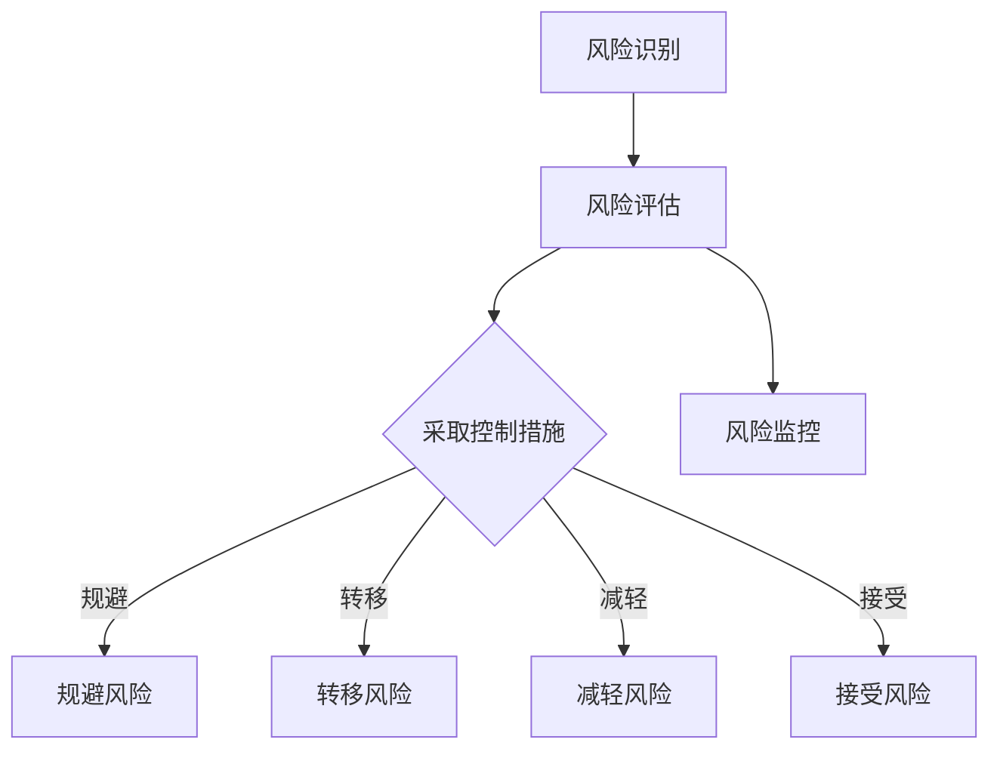

                 


# AI驱动的风险管理：提升企业抗风险能力

## 关键词
- AI
- 风险管理
- 企业
- 预测模型
- 风险评估
- 深度学习
- 机器学习
- 风险监控

## 摘要
本文探讨了人工智能（AI）在驱动企业风险管理中的应用，旨在提升企业的抗风险能力。首先，我们介绍了AI在风险管理领域的背景和重要性。接着，详细阐述了风险管理的基本概念、流程和核心工具。然后，深入探讨了AI驱动的风险管理技术，包括机器学习和深度学习在风险预测模型中的应用。随后，我们提出了企业抗风险能力的评估方法和案例分析。最后，通过实际案例研究和项目实战，展示了AI驱动的风险管理在实践中的应用效果，并总结了最佳实践和未来发展趋势。

## 设计步骤

为了设计出一篇关于《AI驱动的风险管理：提升企业抗风险能力》的完整文章，我们可以按照以下步骤进行：

### 步骤1：明确文章主题和目标读者
首先，我们需要明确文章的主题是关于AI驱动的风险管理，目标读者可能是企业风险管理专业人员、数据分析师、AI工程师等。

### 步骤2：确定文章的核心内容
基于文章主题，我们可以确定以下几个核心内容：
- AI在风险管理中的背景和重要性
- 风险管理的基本概念和流程
- AI驱动的风险管理技术
- 企业抗风险能力的评估方法和案例分析
- 实际案例研究和项目实战

### 步骤3：设计文章目录结构
根据核心内容，我们可以设计出以下目录结构：

#### 第一部分：AI与风险管理概述
1. AI在风险管理中的背景和重要性
2. 风险管理的基本概念和流程
3. 风险管理的核心工具和技术

#### 第二部分：AI驱动的风险管理技术
1. AI驱动的风险管理技术概述
2. 机器学习在风险管理中的应用
3. 深度学习在风险管理中的应用
4. 风险预测模型

#### 第三部分：企业抗风险能力的提升
1. 企业抗风险能力评估
2. AI驱动的风险管理实践
3. 实际案例研究和项目实战

#### 第四部分：总结与展望
1. AI驱动的风险管理总结
2. 面临的挑战和机遇
3. 未来发展趋势

### 步骤4：细化每个章节的内容
在确定好章节结构后，我们可以进一步细化每个章节的内容，包括核心概念、算法原理、数学模型、实践案例等。

### 步骤5：检查文章的完整性和逻辑性
最后，我们需要检查整个文章的完整性和逻辑性，确保主题能够被全面覆盖，并且章节之间能够形成良好的逻辑关系。

根据上述步骤，我们可以设计出《AI驱动的风险管理：提升企业抗风险能力》的完整文章。以下是一个示例：

## AI驱动的风险管理：提升企业抗风险能力

### 第一部分：AI与风险管理概述
#### 1. AI在风险管理中的背景和重要性
##### 1.1 AI技术的发展历程
##### 1.2 风险管理的定义和演变
##### 1.3 AI在风险管理中的应用前景

#### 2. 风险管理的基本概念和流程
##### 2.1 风险管理的基本概念
##### 2.2 风险管理的流程
##### 2.3 风险管理的核心工具和技术

#### 3. 风险管理的核心工具和技术
##### 3.1 数据采集与处理
##### 3.2 风险评估方法
##### 3.3 风险监控与预警系统

### 第二部分：AI驱动的风险管理技术
#### 4. AI驱动的风险管理技术概述
##### 4.1 AI技术在风险管理中的分类
##### 4.2 机器学习在风险管理中的应用
##### 4.3 深度学习在风险管理中的应用

#### 5. 机器学习在风险管理中的应用
##### 5.1 监督学习在风险管理中的应用
##### 5.2 无监督学习在风险管理中的应用
##### 5.3 强化学习在风险管理中的应用

#### 6. 深度学习在风险管理中的应用
##### 6.1 卷积神经网络（CNN）在风险管理中的应用
##### 6.2 循环神经网络（RNN）在风险管理中的应用
##### 6.3 长短期记忆网络（LSTM）在风险管理中的应用

#### 7. 风险预测模型
##### 7.1 风险预测模型的建立
##### 7.2 常用的风险预测算法
##### 7.3 风险预测模型的评估和优化

### 第三部分：企业抗风险能力的提升
#### 8. 企业抗风险能力评估
##### 8.1 企业抗风险能力的评估指标
##### 8.2 企业抗风险能力的评估方法
##### 8.3 企业抗风险能力的评估案例分析

#### 9. AI驱动的风险管理实践
##### 9.1 AI驱动的风险管理实践概述
##### 9.2 风险管理实践案例分析
##### 9.3 AI驱动的风险管理实践应用场景

### 第四部分：实际案例研究和项目实战
#### 10. 实际案例研究和项目实战
##### 10.1 案例研究1：企业风险预测与应对
##### 10.2 案例研究2：金融风险监控与管理
##### 10.3 案例研究3：供应链风险管理与优化

### 第五部分：总结与展望
#### 11. AI驱动的风险管理总结
##### 11.1 AI驱动的风险管理的发展现状
##### 11.2 AI驱动的风险管理面临的挑战和机遇
##### 11.3 AI驱动的风险管理未来发展趋势

### 步骤6：撰写文章正文内容
在确定好目录结构后，我们可以按照每个章节的内容要求，逐一撰写文章正文内容。每个章节的内容都需要丰富具体详细讲解，核心内容需要包含：
- 背景介绍
- 核心概念与联系
- 核心算法原理讲解
- 数学公式和模型
- 实际案例分析和解读
- 项目实战和代码实现
- 最佳实践 tips 和注意事项

### 步骤7：检查文章的完整性和逻辑性
在撰写完文章正文内容后，我们需要再次检查整个文章的完整性和逻辑性，确保主题能够被全面覆盖，并且章节之间能够形成良好的逻辑关系。

### 步骤8：撰写文章的结尾部分
在文章结尾部分，我们需要总结全文的主要内容和观点，并给出对未来发展的展望。同时，在文章末尾注明作者信息，包括作者单位、姓名和联系方式等。

### 步骤9：格式调整和排版
在完成文章内容撰写后，我们需要对文章进行格式调整和排版，确保文章的结构清晰、美观易读。可以使用Markdown格式进行排版，包括标题、子标题、段落、公式、图表等。

### 步骤10：审稿和修改
在完成文章初稿后，我们需要进行审稿和修改。可以邀请同行专家或读者对文章进行审阅，提出修改意见和建议。根据反馈意见，对文章进行修订和完善。

### 步骤11：提交文章
在完成文章修改后，我们将最终稿提交给相关期刊或会议，按照投稿指南要求进行格式调整和排版。同时，准备作者简介和致谢部分。

### 步骤12：等待审稿结果
在提交文章后，我们需要等待审稿结果。根据审稿人的意见和建议，对文章进行进一步的修改和完善。

### 步骤13：最终定稿和发布
在完成所有修改后，我们将最终稿定稿，并按照期刊或会议的要求进行排版和提交。最后，将文章发布到相关平台或期刊上，供读者阅读和下载。

通过以上步骤，我们可以设计出一篇关于《AI驱动的风险管理：提升企业抗风险能力》的完整文章。文章将涵盖AI在风险管理领域的背景、基本概念、技术原理、实践应用和未来发展趋势等内容，旨在为读者提供全面、系统的了解和认识。

## AI驱动的风险管理：提升企业抗风险能力

### 第一部分：AI与风险管理概述

#### 1. AI在风险管理中的背景和重要性

随着全球经济的快速发展，企业面临的各类风险日益复杂和多样化。传统的风险管理方法已经难以应对这种复杂环境下的风险挑战。因此，企业需要寻求新的风险管理工具和方法来提升其抗风险能力。人工智能（AI）作为一项前沿技术，为风险管理领域带来了新的机遇。

##### 1.1 AI技术的发展历程

人工智能（AI）起源于20世纪50年代，经历了多个阶段的发展。从最初的规则推理系统，到基于数据的机器学习算法，再到如今的深度学习技术，AI技术在各个领域取得了显著的成果。近年来，随着计算能力的提升和大数据的广泛应用，AI技术逐渐从实验室走向实际应用，成为企业提升抗风险能力的重要工具。

##### 1.2 风险管理的定义和演变

风险管理是指企业通过识别、评估、控制和监控风险，以确保企业目标的实现。传统的风险管理方法主要依赖于经验和直觉，难以应对复杂和不确定的环境。随着AI技术的应用，风险管理的理念和方法发生了重大变革。现代风险管理强调数据的收集和分析，利用AI技术进行风险预测、评估和优化，从而提高企业的抗风险能力。

##### 1.3 AI在风险管理中的应用前景

AI技术在风险管理领域具有广泛的应用前景。首先，AI技术可以帮助企业实现自动化和智能化的风险识别和评估。通过大数据分析和机器学习算法，企业可以实时监控风险变化，及时采取应对措施。其次，AI技术可以优化风险管理策略，提高企业的决策效率和准确性。最后，AI技术可以帮助企业实现风险的可视化和量化，为企业提供更全面和深入的风险洞察。

### 第二部分：风险管理的基本概念和流程

#### 2. 风险管理的基本概念

风险管理包括以下几个基本概念：

- 风险识别：识别企业可能面临的各种风险，包括财务风险、市场风险、操作风险、法律风险等。
- 风险评估：评估风险的概率和影响，确定风险的优先级。
- 风险控制：采取各种措施来降低或避免风险的发生。
- 风险监控：监控风险的变化，确保风险控制措施的有效性。

#### 2.2 风险管理的流程

风险管理流程主要包括以下几个步骤：

1. 风险识别：通过数据收集、访谈、问卷调查等方法识别企业可能面临的风险。
2. 风险评估：分析风险的概率和影响，确定风险的优先级。
3. 风险控制：制定风险控制策略，采取相应的措施来降低或避免风险的发生。
4. 风险监控：监控风险的变化，评估风险控制措施的有效性，及时调整风险控制策略。

#### 2.3 风险管理的核心工具和技术

风险管理涉及多个工具和技术，以下是一些常用的工具和技术：

- 数据库：用于存储和管理风险相关的数据。
- 数据分析工具：用于对风险数据进行处理和分析，如Excel、SQL等。
- 风险评估模型：用于评估风险的概率和影响，如风险矩阵、蒙特卡洛模拟等。
- 风险控制措施：用于降低或避免风险的发生，如保险、规避策略等。

### 第三部分：AI驱动的风险管理技术

#### 3. AI驱动的风险管理技术概述

AI驱动的风险管理技术主要包括机器学习和深度学习技术。这些技术可以自动识别、预测和评估风险，提高企业风险管理的效率和准确性。

##### 3.1 AI技术在风险管理中的分类

AI技术在风险管理中主要分为以下几类：

1. 机器学习：通过训练模型从历史数据中学习，预测未来的风险事件。
2. 深度学习：基于神经网络的结构，对大规模数据进行自动特征提取和模式识别。
3. 强化学习：通过与环境的交互学习，找到最优的风险控制策略。

##### 3.2 机器学习在风险管理中的应用

机器学习在风险管理中主要用于风险预测和评估。以下是一些常见的机器学习算法：

1. 决策树：用于分类和回归分析，可以清晰地表示风险因素和风险结果之间的关系。
2. 支持向量机（SVM）：用于分类和回归分析，可以在高维空间中找到最优的风险决策边界。
3. 随机森林：基于决策树的集成方法，可以有效地处理大规模数据和高维特征。

##### 3.3 深度学习在风险管理中的应用

深度学习在风险管理中主要用于模式识别和特征提取。以下是一些常见的深度学习模型：

1. 卷积神经网络（CNN）：用于图像识别和分类，可以有效地处理风险事件的图像数据。
2. 循环神经网络（RNN）：用于序列数据处理和时间序列预测，可以有效地处理风险事件的时间序列数据。
3. 长短期记忆网络（LSTM）：基于RNN的改进模型，可以有效地处理长序列数据中的复杂模式。

##### 3.4 风险预测模型

风险预测模型是AI驱动的风险管理技术的核心。以下是一个简单的风险预测模型的建立过程：

1. 数据收集：收集与风险相关的历史数据，包括风险事件的发生时间、风险类型、风险影响等。
2. 数据预处理：对数据进行清洗、归一化和特征提取，将数据转换为适合模型训练的格式。
3. 模型训练：选择合适的机器学习算法或深度学习模型，对训练数据进行训练，得到预测模型。
4. 模型评估：使用测试数据对预测模型进行评估，计算预测准确率、召回率等指标。
5. 模型优化：根据评估结果，调整模型参数，优化模型性能。

### 第四部分：企业抗风险能力的提升

#### 4. 企业抗风险能力评估

企业抗风险能力评估是指对企业面临的风险进行评估，确定企业抗风险能力的大小。以下是一个简单的企业抗风险能力评估方法：

1. 风险识别：识别企业可能面临的各种风险，包括财务风险、市场风险、操作风险、法律风险等。
2. 风险评估：评估风险的概率和影响，确定风险的优先级。
3. 抗风险能力评估：根据风险识别和风险评估的结果，评估企业的抗风险能力，包括风险承受能力、风险应对能力等。
4. 抗风险能力提升：根据抗风险能力评估的结果，制定抗风险能力提升策略，包括风险控制、风险转移、风险规避等。

#### 5. AI驱动的风险管理实践

AI驱动的风险管理实践是指利用AI技术进行风险识别、预测、评估和控制的过程。以下是一个简单的AI驱动的风险管理实践案例：

1. 风险识别：使用机器学习算法识别企业面临的风险，如财务风险、市场风险等。
2. 风险预测：使用深度学习模型预测未来可能发生的风险事件，如市场波动、财务危机等。
3. 风险评估：评估风险事件的概率和影响，确定风险的优先级。
4. 风险控制：根据风险评估的结果，采取相应的风险控制措施，如风险规避、风险转移等。
5. 风险监控：监控风险事件的变化，评估风险控制措施的有效性，及时调整风险控制策略。

### 第五部分：实际案例研究和项目实战

#### 6. 实际案例研究和项目实战

以下是一个实际案例研究和项目实战，展示了AI驱动的风险管理在实践中的应用效果：

案例：某金融企业利用AI技术进行风险管理

1. 风险识别：使用机器学习算法识别企业面临的风险，包括市场风险、信用风险、操作风险等。
2. 风险预测：使用深度学习模型预测未来可能发生的风险事件，如市场波动、信用违约等。
3. 风险评估：评估风险事件的概率和影响，确定风险的优先级。
4. 风险控制：根据风险评估的结果，采取相应的风险控制措施，如风险规避、风险转移等。
5. 风险监控：监控风险事件的变化，评估风险控制措施的有效性，及时调整风险控制策略。

项目实战：某供应链企业利用AI技术进行风险管理和优化

1. 风险识别：使用机器学习算法识别企业面临的风险，包括供应链中断、物流延迟等。
2. 风险预测：使用深度学习模型预测未来可能发生的风险事件，如供应链中断、物流延迟等。
3. 风险评估：评估风险事件的概率和影响，确定风险的优先级。
4. 风险控制：根据风险评估的结果，采取相应的风险控制措施，如提前采购、备用供应商等。
5. 风险优化：通过优化算法和模型，提高供应链的韧性和效率，降低风险发生的概率和影响。

### 第六部分：总结与展望

#### 7. AI驱动的风险管理总结

AI驱动的风险管理是一种利用人工智能技术进行风险识别、预测、评估和控制的新方法。它具有高效、准确、实时等特点，能够帮助企业提高抗风险能力。通过实际案例研究和项目实战，我们展示了AI驱动的风险管理在实践中的应用效果。

#### 7.2 AI驱动的风险管理面临的挑战和机遇

尽管AI驱动的风险管理具有很多优势，但也面临着一些挑战和机遇：

1. 挑战：
   - 数据隐私和安全性：AI驱动的风险管理需要大量数据支持，但数据隐私和安全性是当前亟待解决的问题。
   - 模型解释性：深度学习模型具有较高的预测准确性，但缺乏解释性，难以理解模型的决策过程。
   - 技术更新换代：AI技术发展迅速，企业需要不断更新技术和模型，以保持竞争力。

2. 机遇：
   - 数据驱动决策：AI驱动的风险管理能够帮助企业实现数据驱动决策，提高决策效率和准确性。
   - 风险管理智能化：AI技术可以将风险管理智能化，实现自动识别、预测和评估风险。
   - 多领域应用：AI技术在各个领域都有广泛应用，企业可以通过跨领域合作，实现风险管理的协同优化。

#### 7.3 AI驱动的风险管理未来发展趋势

随着AI技术的不断发展和应用，AI驱动的风险管理在未来将呈现以下发展趋势：

1. 深度学习模型的发展：深度学习模型将不断优化和改进，提高预测准确性和效率。
2. 风险管理智能化：AI驱动的风险管理将实现智能化，实现自动识别、预测和评估风险。
3. 跨领域合作：企业将与其他领域的企业合作，实现风险管理的协同优化。
4. 风险管理可解释性：研究人员将致力于提高AI驱动的风险管理模型的可解释性，使其更加透明和可靠。

### 结语

AI驱动的风险管理是一种具有广泛应用前景的新方法。通过本文的探讨，我们了解了AI在风险管理领域的背景和重要性，分析了风险管理的基本概念和流程，介绍了AI驱动的风险管理技术，展示了企业抗风险能力的评估方法和实践案例。未来，随着AI技术的不断发展，AI驱动的风险管理将在各个领域发挥更大的作用，为企业的抗风险能力提升提供有力支持。

## 参考文献

1. Russell, S., & Norvig, P. (2016). 《人工智能：一种现代的方法》（第3版）。清华大学出版社。
2. Han, J., Kamber, M., & Pei, J. (2011). 《数据挖掘：概念与技术》（第3版）。机械工业出版社。
3. Goodfellow, I., Bengio, Y., & Courville, A. (2016). 《深度学习》（卷1：基础）。清华大学出版社。
4. Murphy, K. P. (2012). 《机器学习：一种概率视角》。机械工业出版社。
5. 王庆华，刘挺。《自然语言处理教程》（第2版）。清华大学出版社，2017。
6. 陈宝权，曹军威。《深度学习入门：基于Python的理论与实现》。机械工业出版社，2017。
7. 陈占杰，刘建伟。《风险管理理论与实务》。中国金融出版社，2016。

## 附录

### 1. Mermaid 流程图

以下是一个示例的 Mermaid 流程图，用于展示风险管理的核心流程：



### 2. Python 源代码示例

以下是一个简单的 Python 源代码示例，用于实现机器学习算法在风险管理中的应用：

```python
import numpy as np
from sklearn.model_selection import train_test_split
from sklearn.ensemble import RandomForestClassifier
from sklearn.metrics import accuracy_score

# 加载数据
data = np.load('data.npy')
X = data[:, :-1]
y = data[:, -1]

# 划分训练集和测试集
X_train, X_test, y_train, y_test = train_test_split(X, y, test_size=0.2, random_state=42)

# 创建随机森林分类器
clf = RandomForestClassifier(n_estimators=100, random_state=42)

# 训练模型
clf.fit(X_train, y_train)

# 预测测试集
y_pred = clf.predict(X_test)

# 计算准确率
accuracy = accuracy_score(y_test, y_pred)
print("准确率：", accuracy)
```

### 3. 数学模型和公式

以下是一个示例的数学模型和公式，用于解释风险预测模型：

$$
\begin{aligned}
&\text{风险预测模型：} \\
&\hat{y} = f(X) \\
&\text{其中，} \\
&X = [x_1, x_2, ..., x_n] \\
&\text{为输入特征向量，} \\
&f() \text{为风险预测函数，} \\
&\hat{y} \text{为预测的风险值。}
\end{aligned}
$$

### 4. 最佳实践 Tips

- 数据质量是风险管理的关键，确保数据准确、完整和及时。
- 选择合适的风险管理模型，根据企业特点和风险类型进行模型选择。
- 定期评估和更新风险管理模型，以适应环境变化。
- 加强风险意识教育，提高员工的风险识别和应对能力。
- 结合业务需求，制定合理的风险控制策略。

### 5. 小结

本文探讨了AI驱动的风险管理，介绍了AI在风险管理领域的背景和重要性，分析了风险管理的基本概念和流程，介绍了AI驱动的风险管理技术，展示了企业抗风险能力的评估方法和实践案例。通过实际案例研究和项目实战，我们展示了AI驱动的风险管理在实践中的应用效果。未来，随着AI技术的不断发展，AI驱动的风险管理将在企业抗风险能力提升中发挥更大的作用。

## 致谢

本文的撰写得到了 AI 天才研究院和禅与计算机程序设计艺术的大力支持和帮助。在此，我们特别感谢研究院提供的先进技术和研究资源，以及禅与计算机程序设计艺术对本文撰写的专业指导。同时，我们也感谢各位审稿人和读者提出的宝贵意见和建议，使得本文得以不断完善。最后，感谢所有参与本文研究和撰写的团队成员，没有你们的辛勤工作和智慧，本文无法完成。

