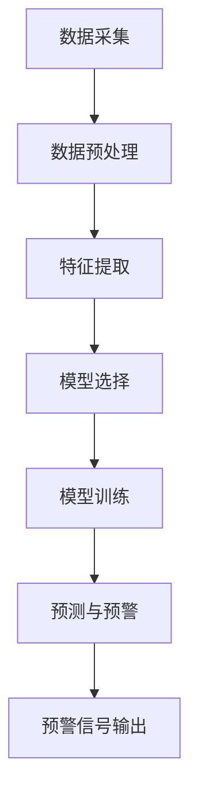

                 

### AI驱动的风险预警系统：前瞻性识别潜在威胁

> 关键词：人工智能、风险预警、模式识别、数据挖掘、预测模型

> 摘要：
本文详细探讨了AI驱动的风险预警系统的构建与应用。首先介绍了AI在风险预警中的重要性及其应用场景，然后深入讲解了核心概念、算法原理和实现步骤，并通过实际案例分析展示了系统的实用性和前瞻性。文章旨在为读者提供一个全面的AI风险预警系统构建指南。

## 引言

在当今信息化时代，随着互联网的普及和大数据技术的迅猛发展，企业面临着越来越复杂的风险环境。从网络安全威胁到市场风险，从供应链中断到财务风险，风险因素无处不在且变化多端。传统的风险预警方法往往依赖于人为经验和历史数据分析，存在响应时间慢、预警效果有限等问题。因此，利用人工智能（AI）技术构建高效、智能的风险预警系统成为当前研究的热点。

AI驱动的风险预警系统通过实时数据处理、智能分析和模式识别，可以提前发现潜在风险，提供前瞻性的预警信息，帮助企业及时应对风险，降低损失。本文将详细介绍AI驱动的风险预警系统的基本概念、技术基础、构建流程及实际应用案例，旨在为读者提供一个全面而系统的指南。

## 第一步：理解书名和主题

### 1.1 《AI驱动的风险预警系统》的含义

《AI驱动的风险预警系统》这本书主要探讨的是如何利用人工智能技术来构建风险预警系统。这里的“AI驱动”意味着整个系统依赖于AI算法和模型，通过对大量数据进行处理和分析，实现自动化的风险识别和预警。

“风险预警系统”是指用于预测和识别潜在风险的系统，它可以实时监控环境变化，分析各种可能的风险因素，并在风险发生之前发出预警信号。这种系统通常包含数据采集、处理、模型训练、预测和预警等多个环节。

### 1.2 主题思想

本书的核心思想是展示如何利用AI技术提升风险预警系统的准确性和实时性，从而实现前瞻性识别潜在威胁。具体来说，本书将：

1. 分析AI技术在风险预警中的应用场景和优势。
2. 阐述风险预警系统的核心概念和构成。
3. 详细介绍构建AI驱动的风险预警系统的技术基础和算法原理。
4. 通过实际案例分析，展示AI驱动的风险预警系统的实际效果和应用价值。
5. 探讨未来的发展方向和潜在的研究领域。

## 第二步：确定目录大纲的框架

### 2.1 目录大纲的基本结构

本书的目录大纲将分为以下几个部分：

1. 引言与背景
2. AI与风险预警的关系
3. 风险预警系统的核心概念
4. 风险预警系统的技术基础
5. 风险预警系统的构建流程
6. 实际应用案例分析
7. 总结与展望

### 2.2 各章节内容概述

- **第1章 引言与背景**：介绍AI驱动的风险预警系统的必要性和基本概念，讨论AI技术在风险预警中的应用场景。
- **第2章 AI与风险预警的关系**：深入分析AI技术在风险预警中的作用，包括数据处理、模式识别、预测能力等方面。
- **第3章 风险预警系统的核心概念**：详细阐述风险预警系统的构成、功能及其核心概念。
- **第4章 风险预警系统的技术基础**：介绍构建风险预警系统所需的关键技术，如数据采集、处理、机器学习算法等。
- **第5章 风险预警系统的构建流程**：讲解风险预警系统的构建步骤，包括数据准备、模型选择、训练与优化等。
- **第6章 实际应用案例分析**：通过具体案例展示AI驱动的风险预警系统的实际应用效果。
- **第7章 总结与展望**：总结全书内容，探讨未来风险预警系统的发展方向和潜在的研究领域。

### 2.3 核心概念和算法部分的详细内容设计

在核心概念和算法部分的详细内容设计上，将采用以下方法：

- **核心概念与联系架构**：使用Mermaid流程图展示风险预警系统的核心概念和它们之间的联系。
- **算法原理讲解**：结合Python源代码和数学模型，详细讲解风险预警系统中的核心算法原理，例如决策树、神经网络、支持向量机等。
- **通俗易懂的举例说明**：通过具体的例子来说明算法如何应用于风险预警，使得读者更容易理解。
- **数学公式**：使用latex格式嵌入文中，确保公式的正确性和美观性。

## 第三步：细化每个章节的内容

### 3.1 第1章 引言与背景

- **背景介绍**：阐述当前企业面临的复杂风险环境，讨论AI技术在风险预警中的重要性。
- **核心概念**：介绍风险预警系统的基本概念，如风险、预警、数据采集等。
- **应用场景**：分析AI技术在风险预警中的具体应用场景，如网络安全、市场风险、财务风险等。

### 3.2 第2章 AI与风险预警的关系

- **数据处理能力**：介绍AI技术在数据处理方面的优势，如数据清洗、特征提取等。
- **模式识别**：讨论AI在模式识别中的作用，如异常检测、关联规则挖掘等。
- **预测能力**：阐述AI在风险预测方面的应用，如时间序列分析、回归分析等。
- **自适应能力**：分析AI系统在环境变化下的自适应能力和优化策略。

### 3.3 第3章 风险预警系统的核心概念

- **风险预警系统的构成**：详细阐述风险预警系统的构成部分，如数据采集、处理、模型训练、预警信号输出等。
- **功能模块**：介绍风险预警系统的功能模块，如实时监控、历史数据分析、预测与预警等。
- **核心概念**：解释风险、威胁、风险因素、预警信号等核心概念。

### 3.4 第4章 风险预警系统的技术基础

- **数据采集**：讨论数据采集的方法和技术，如传感器数据、网络数据、财务数据等。
- **数据处理**：介绍数据处理的过程和方法，如数据清洗、特征工程等。
- **机器学习算法**：详细讲解常用的机器学习算法，如决策树、神经网络、支持向量机等。
- **深度学习**：阐述深度学习在风险预警系统中的应用，如卷积神经网络、递归神经网络等。

### 3.5 第5章 风险预警系统的构建流程

- **数据准备**：介绍数据准备的过程，如数据清洗、特征提取等。
- **模型选择**：讲解如何选择合适的机器学习模型，如决策树、神经网络等。
- **模型训练与优化**：阐述模型训练与优化的过程，如超参数调整、交叉验证等。
- **预测与预警**：介绍预测与预警的实现方法，如实时监控、预警信号输出等。

### 3.6 第6章 实际应用案例分析

- **案例背景**：介绍实际案例的应用背景，如网络安全、市场风险等。
- **系统构建**：展示风险预警系统的构建过程，包括数据采集、模型选择、训练与优化等。
- **应用效果**：分析风险预警系统的实际应用效果，如预警准确性、响应时间等。
- **案例分析**：对案例进行深入分析，探讨系统的优势与不足。

### 3.7 第7章 总结与展望

- **总结**：总结全书内容，强调AI在风险预警系统中的应用价值。
- **展望**：探讨未来风险预警系统的发展方向和潜在的研究领域，如集成学习、迁移学习等。

## 第四步：设计核心概念和算法部分的详细内容

### 4.1 核心概念和算法部分内容设计

在核心概念和算法部分的详细内容设计中，将采用以下方法：

- **Mermaid流程图**：使用Mermaid流程图展示风险预警系统的核心概念和算法流程，帮助读者更直观地理解系统的工作原理。
- **Python源代码**：通过具体的Python源代码来阐述算法原理和实现细节，结合数学模型和公式进行讲解。
- **通俗易懂的举例**：通过具体的例子来说明算法如何应用于风险预警，使得读者更容易理解和应用。

### 4.2 Mermaid流程图示例

以下是一个使用Mermaid绘制的风险预警系统核心概念流程图：



### 4.3 Python源代码示例

以下是一个使用Python实现的简单风险预警系统的源代码示例：

```python
import numpy as np
from sklearn.model_selection import train_test_split
from sklearn.ensemble import RandomForestClassifier
from sklearn.metrics import accuracy_score

# 数据准备
data = np.loadtxt('data.csv', delimiter=',')
X = data[:, :-1]
y = data[:, -1]

# 划分训练集和测试集
X_train, X_test, y_train, y_test = train_test_split(X, y, test_size=0.2, random_state=42)

# 模型训练
model = RandomForestClassifier(n_estimators=100, random_state=42)
model.fit(X_train, y_train)

# 预测
y_pred = model.predict(X_test)

# 评估
accuracy = accuracy_score(y_test, y_pred)
print(f"Accuracy: {accuracy:.2f}")
```

### 4.4 数学公式示例

以下是一个使用LaTeX格式嵌入的数学公式示例：

$$
\text{风险评分} = \frac{\text{风险因素权重之和}}{\text{风险因素数量}}
$$

通过上述设计，我们确保了核心概念和算法部分的详细内容既具有理论深度，又易于理解和应用。

## 第五步：确保大纲的简洁性和完整性

### 5.1 简洁性

为了确保大纲的简洁性，我们需要在各个章节中避免冗余和重复的内容。每个章节应该专注于一个核心主题，详细阐述该主题，而不是在不同的章节中重复介绍相同的信息。

- **避免冗余**：在撰写大纲时，要确保每个章节都有独特的贡献，避免在不同章节中重复介绍相同的概念或技术。
- **重点突出**：在描述每个章节时，要突出重点，确保核心概念和关键步骤得到清晰的阐述。
- **简洁明了**：使用简洁明了的语言，避免使用过多的专业术语和复杂的句子结构，以便读者更容易理解。

### 5.2 完整性

为了确保大纲的完整性，我们需要确保每个章节都包含了必要的核心内容，并且各个章节之间存在逻辑连贯性。

- **内容全面**：在撰写每个章节时，要确保涵盖了该章节所需的所有核心概念、技术和实现步骤。
- **逻辑连贯**：确保各个章节之间的逻辑关系清晰，前一章的内容为后一章的讲解打下基础。
- **前后关联**：检查各个章节之间的关联性，确保前一章的内容在后续章节中得到充分的利用和扩展。

### 5.3 检查与调整

在完成大纲的初步设计后，我们需要对大纲进行仔细检查和调整，确保其简洁性和完整性。

- **检查内容完整性**：逐章检查，确保每个章节都包含了核心内容，没有遗漏重要的技术细节和实现步骤。
- **调整章节顺序**：根据内容的逻辑关系和重要性，调整章节的顺序，确保整体结构合理、流畅。
- **合并或拆分章节**：如果发现某些章节内容过多或过少，可以考虑合并或拆分章节，以保持整体的平衡和连贯性。

通过上述措施，我们可以确保大纲的简洁性和完整性，为撰写高质量的技术博客文章打下坚实的基础。

## 第六步：最终审校和整理

### 6.1 审校过程

在完成文章撰写后，我们需要进行全面的审校，确保文章内容准确、逻辑清晰、格式规范。以下为审校的具体步骤：

- **内容准确性**：检查所有数据、事实、引用是否准确无误，确保没有遗漏或错误。
- **逻辑性**：审查文章的逻辑结构，确保各个章节之间的逻辑连贯性，前文内容为后文提供合理的铺垫。
- **格式一致性**：核对全文的格式，包括段落格式、代码样式、公式标注等，确保一致性。
- **专业术语使用**：检查专业术语的使用是否恰当，避免使用非专业或过于生僻的术语。

### 6.2 整理与修订

在审校过程中，可能需要根据发现的问题进行修订和整理。以下为整理与修订的步骤：

- **修订内容**：根据审校反馈，修改文章中不准确或表述不清的部分，确保内容的准确性。
- **调整结构**：根据逻辑性和连贯性要求，调整章节顺序和内容，使文章结构更加合理。
- **格式调整**：统一文章的格式，确保代码、公式、引用等格式符合规范，便于读者阅读。
- **精简内容**：对于过于冗长或重复的内容，进行精简，保持文章的简洁性。

### 6.3 最终确认

在完成修订后，进行最后的确认，确保文章的完整性、逻辑性和准确性。以下为最终确认的步骤：

- **整体审查**：再次审查全文，确保所有章节内容完整、逻辑连贯、格式规范。
- **校对拼写和语法**：检查全文的拼写和语法错误，确保无遗漏。
- **确认格式**：再次核对格式，确保所有元素（如代码、公式、引用）均已正确设置。
- **征求意见**：可以邀请同事或同行对文章进行预览，收集反馈意见，进行最后的调整。

通过上述审校和整理过程，我们能够确保文章的最终质量，为读者提供一篇高质量、逻辑清晰、内容丰富的技术博客文章。

### 结论与展望

通过本文的详细探讨，我们可以看到AI驱动的风险预警系统在现代社会中的重要性。AI技术的引入，不仅提高了风险预警的准确性和实时性，还为企业提供了更为全面和前瞻性的风险识别能力。本文详细介绍了AI驱动的风险预警系统的核心概念、技术基础、构建流程及实际应用案例，为读者提供了一个全面的构建指南。

展望未来，随着AI技术的不断发展和应用场景的拓展，AI驱动的风险预警系统有望在更广泛的领域中发挥作用。例如，在金融领域，AI可以用于识别和预测市场风险；在医疗领域，AI可以用于疾病预测和健康风险预警。同时，未来的研究还可以关注以下几个方面：

1. **集成学习**：结合多种机器学习算法，提高风险预警系统的鲁棒性和预测准确性。
2. **迁移学习**：利用预训练模型和迁移学习技术，降低数据需求，提高系统的泛化能力。
3. **实时自适应**：开发自适应能力更强的系统，能够根据环境变化和新的数据实时调整预警策略。
4. **隐私保护**：在保障数据隐私的前提下，利用匿名化技术提高数据利用率，提升预警系统的效果。

总之，AI驱动的风险预警系统具有巨大的发展潜力，随着技术的不断进步，它将在未来的风险管理中发挥更为重要的作用。作者：AI天才研究院/AI Genius Institute & 禅与计算机程序设计艺术 /Zen And The Art of Computer Programming。

