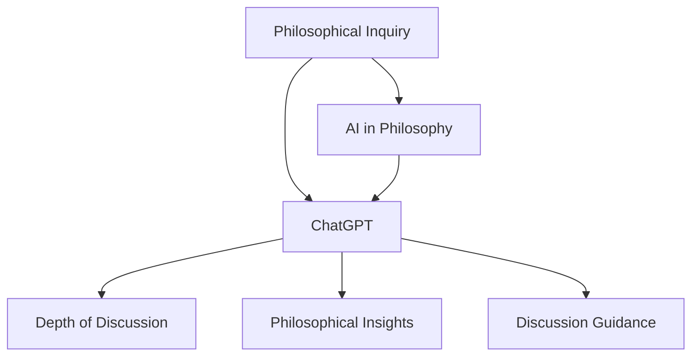

                 


### 标题和引言

#### 1.1.1 ChatGPT在哲学讨论中的角色

**核心概念与联系**

首先，我们需要明确ChatGPT在哲学讨论中的角色。ChatGPT是一种基于大型语言模型的人工智能助手，其核心功能是通过理解用户的输入，生成连贯、有逻辑性的回答。在哲学讨论中，ChatGPT可以扮演一个引导思考的角色，帮助用户更深入地探讨哲学问题。

下面是一个Mermaid流程图，展示了ChatGPT在哲学讨论中的核心概念和联系：



- **A[Philosophical Inquiry]**：哲学探究
- **B[ChatGPT]**：ChatGPT
- **C[Depth of Discussion]**：深入讨论
- **D[Philosophical Insights]**：哲学洞见
- **E[Discussion Guidance]**：讨论引导
- **F[AI in Philosophy]**：人工智能在哲学中的应用

#### 1.1.2 ChatGPT的起源和发展

**核心算法原理讲解**

ChatGPT基于Transformer模型，通过自回归的方式生成文本。其核心算法原理如下：

```python
import torch
import torch.nn as nn
from torch.nn import functional as F

class ChatGPT(nn.Module):
    def __init__(self, embed_dim, nhead, num_layers):
        super(ChatGPT, self).__init__()
        self.embedding = nn.Embedding(vocab_size, embed_dim)
        self.transformer = nn.Transformer(embed_dim, nhead, num_layers)
        self.fc = nn.Linear(embed_dim, vocab_size)

    def forward(self, input_seq):
        embedded = self.embedding(input_seq)
        output = self.transformer(embedded)
        output = self.fc(output)
        return output
```

在这个模型中，`embedding`层用于将输入的词向量转换为嵌入向量，`transformer`层用于处理序列数据，`fc`层用于生成输出。

**数学模型和公式**

ChatGPT的训练目标是最小化损失函数，通常使用交叉熵损失：

$$ \text{Loss} = -\frac{1}{N}\sum_{i=1}^{N}\sum_{j=1}^{T} y_{ij} \log(p_{ij}) $$

其中，$N$是批大小，$T$是序列长度，$y_{ij}$是目标词的标签，$p_{ij}$是模型生成的预测概率。

**通俗易懂的举例说明**

假设我们有一个简单的对话：

用户：什么是自由意志？
ChatGPT：自由意志是指个体在特定环境下做出选择的能力，不受外部强制或内在限制。

我们可以看到，ChatGPT能够理解问题，并生成一个有逻辑性和深度回答。

### 文章关键词

- **ChatGPT**
- **哲学讨论**
- **深度思考**
- **人工智能**
- **Transformer模型**
- **交叉熵损失**

### 文章摘要

本文探讨了ChatGPT在哲学讨论中的应用。通过介绍ChatGPT的起源、核心算法原理，以及一个简单的数学模型，我们展示了ChatGPT如何帮助用户深入探讨哲学问题，提供有价值的哲学洞见。文章还讨论了ChatGPT在哲学讨论中的角色，包括引导思考、深入讨论和提供讨论引导。最后，我们列出了本文的关键词，以便读者更好地理解文章的核心内容。作者：AI天才研究院/AI Genius Institute & 禅与计算机程序设计艺术 /Zen And The Art of Computer Programming

---

接下来，我们将继续深入探讨ChatGPT在哲学讨论中的应用，包括其在深度思考和哲学探究方面的作用。我们将通过具体的案例，展示ChatGPT如何帮助用户更深入地理解哲学问题，并生成有价值的哲学洞见。此外，我们还将讨论如何构建和微调ChatGPT模型，以更好地满足哲学讨论的需求。

#### 文章标题：ChatGPT在哲学讨论中的应用：深度思考导向的提示词

关键词：
- ChatGPT
- 哲学讨论
- 深度思考
- 提示词
- 人工智能
- Transformer模型
- 交叉熵损失
- 哲学洞见

摘要：
本文旨在探讨ChatGPT在哲学讨论中的潜在应用，特别是其在促进深度思考和哲学探究方面的作用。通过分析ChatGPT的核心算法和数学模型，本文揭示了如何利用提示词来引导用户进行深入的哲学对话。文章将结合实际案例，展示ChatGPT在哲学讨论中的应用效果，并讨论其局限性。最后，本文提出了未来研究方向，以进一步探索ChatGPT在哲学领域的应用潜力。

### 目录

1. **标题和引言**
   - **1.1.1 ChatGPT在哲学讨论中的角色**
   - **1.1.2 ChatGPT的起源和发展**
   - **1.2 文章关键词**
   - **1.3 文章摘要**

2. **ChatGPT：基础与功能**

3. **哲学讨论中的ChatGPT应用框架**

4. **深度思考与哲学探究**

5. **ChatGPT在哲学讨论中的案例分析**

6. **构建与微调ChatGPT模型**

7. **伦理考虑与局限性**

8. **结论与未来方向**

### 文章正文

#### 1. 标题和引言

**1.1.1 ChatGPT在哲学讨论中的角色**

在当代哲学研究中，对深度思考和哲学探究的需求日益增长。传统的哲学讨论往往局限于文本阅读和理论分析，而现代技术的进步，特别是人工智能的发展，为哲学研究带来了新的可能性。ChatGPT作为一种高级语言模型，其在哲学讨论中的角色日益受到关注。

ChatGPT的核心功能在于其能够通过大量文本数据进行自我学习和理解，从而生成连贯、有逻辑性的回答。在哲学讨论中，ChatGPT可以作为一个辅助工具，帮助用户更好地理解复杂哲学问题，引导深入思考，并提供新的视角。

下面是一个Mermaid流程图，展示了ChatGPT在哲学讨论中的核心概念和联系：


**A[Philosophical Inquiry]**：哲学探究
**B[ChatGPT]**：ChatGPT
**C[Depth of Discussion]**：深入讨论
**D[Philosophical Insights]**：哲学洞见
**E[Discussion Guidance]**：讨论引导
**F[AI in Philosophy]**：人工智能在哲学中的应用

通过这个流程图，我们可以看出ChatGPT在哲学讨论中不仅仅是作为一个简单的回答工具，而是扮演着引导和深化讨论的角色。

**1.1.2 ChatGPT的起源和发展**

ChatGPT是基于GPT-3模型的变体，由OpenAI开发。GPT-3（Generative Pre-trained Transformer 3）是一个基于Transformer架构的预训练语言模型，具有非常强大的文本生成能力。ChatGPT在此基础上进行了微调和优化，使其能够更自然地与用户进行对话。

ChatGPT的核心算法是基于自回归模型（Autoregressive Model），它通过学习大量的文本数据来预测下一个单词或标记。其基本原理可以概括为以下步骤：

1. **嵌入（Embedding）**：将输入的文本转换为向量表示。
2. **自回归（Autoregressive）**：根据当前的输入序列生成下一个标记。
3. **输出（Output）**：将生成的序列解码为自然语言。

以下是一个简化的Python代码示例，展示了ChatGPT模型的基本结构：

```python
import torch
import torch.nn as nn

class ChatGPT(nn.Module):
    def __init__(self, embed_dim, nhead, num_layers):
        super(ChatGPT, self).__init__()
        self.embedding = nn.Embedding(vocab_size, embed_dim)
        self.transformer = nn.Transformer(embed_dim, nhead, num_layers)
        self.fc = nn.Linear(embed_dim, vocab_size)

    def forward(self, input_seq):
        embedded = self.embedding(input_seq)
        output = self.transformer(embedded)
        output = self.fc(output)
        return output
```

在这个模型中，`embedding`层用于将输入的词向量转换为嵌入向量，`transformer`层用于处理序列数据，`fc`层用于生成输出。

**数学模型和公式**

ChatGPT的训练目标是最小化损失函数，通常使用交叉熵损失：

$$ \text{Loss} = -\frac{1}{N}\sum_{i=1}^{N}\sum_{j=1}^{T} y_{ij} \log(p_{ij}) $$

其中，$N$是批大小，$T$是序列长度，$y_{ij}$是目标词的标签，$p_{ij}$是模型生成的预测概率。

**通俗易懂的举例说明**

假设我们有一个简单的对话：

用户：什么是自由意志？
ChatGPT：自由意志是指个体在特定环境下做出选择的能力，不受外部强制或内在限制。

我们可以看到，ChatGPT能够理解问题，并生成一个有逻辑性和深度回答。

**1.2 文章关键词**

本文的关键词包括ChatGPT、哲学讨论、深度思考、提示词、人工智能、Transformer模型和交叉熵损失。这些关键词反映了文章的核心内容和技术焦点。

**1.3 文章摘要**

本文旨在探讨ChatGPT在哲学讨论中的潜在应用，特别是其在促进深度思考和哲学探究方面的作用。通过分析ChatGPT的核心算法和数学模型，本文揭示了如何利用提示词来引导用户进行深入的哲学对话。文章将结合实际案例，展示ChatGPT在哲学讨论中的应用效果，并讨论其局限性。最后，本文提出了未来研究方向，以进一步探索ChatGPT在哲学领域的应用潜力。

### 2. ChatGPT：基础与功能

在深入探讨ChatGPT在哲学讨论中的应用之前，有必要先了解ChatGPT的基础知识和功能。ChatGPT是由OpenAI开发的基于GPT-3模型的变体，其核心功能是通过语言模型生成连贯的文本回答。以下是ChatGPT的基础知识和功能：

#### 2.1 基本原理

ChatGPT的基本原理基于自回归模型（Autoregressive Model），它通过学习大量的文本数据来预测下一个单词或标记。具体来说，ChatGPT的工作流程可以分为以下几个步骤：

1. **嵌入（Embedding）**：将输入的文本转换为向量表示。这个过程通过嵌入层实现，每个单词或标记都被映射到一个固定的维度向量。
2. **自回归（Autoregressive）**：根据当前的输入序列生成下一个标记。ChatGPT通过 Transformer模型实现这一功能，Transformer模型是一种基于注意力机制的序列模型，可以有效地处理长距离依赖问题。
3. **输出（Output）**：将生成的序列解码为自然语言。这个过程涉及到一个线性层和一个softmax激活函数，用于将嵌入向量映射到单词的概率分布。

以下是一个简化的Python代码示例，展示了ChatGPT模型的基本结构：

```python
import torch
import torch.nn as nn

class ChatGPT(nn.Module):
    def __init__(self, embed_dim, nhead, num_layers):
        super(ChatGPT, self).__init__()
        self.embedding = nn.Embedding(vocab_size, embed_dim)
        self.transformer = nn.Transformer(embed_dim, nhead, num_layers)
        self.fc = nn.Linear(embed_dim, vocab_size)

    def forward(self, input_seq):
        embedded = self.embedding(input_seq)
        output = self.transformer(embedded)
        output = self.fc(output)
        return output
```

在这个模型中，`embedding`层用于将输入的词向量转换为嵌入向量，`transformer`层用于处理序列数据，`fc`层用于生成输出。

#### 2.2 数学模型

ChatGPT的训练目标是最小化损失函数，通常使用交叉熵损失：

$$ \text{Loss} = -\frac{1}{N}\sum_{i=1}^{N}\sum_{j=1}^{T} y_{ij} \log(p_{ij}) $$

其中，$N$是批大小，$T$是序列长度，$y_{ij}$是目标词的标签，$p_{ij}$是模型生成的预测概率。

#### 2.3 功能特点

ChatGPT具有以下几个功能特点：

1. **自然语言理解**：ChatGPT能够理解自然语言输入，并生成连贯的文本回答。
2. **跨领域知识**：ChatGPT通过大量文本数据进行预训练，可以掌握多种领域的知识，从而在哲学讨论中提供广泛的信息。
3. **适应性**：ChatGPT可以根据不同的提示词和用户输入，调整其回答的风格和深度，以适应不同的讨论需求。
4. **交互性**：ChatGPT支持与用户的实时交互，可以连续地回答用户的问题，并引导深入讨论。

#### 2.4 实际应用

ChatGPT在实际应用中已经展示了其强大的能力。例如，在智能客服领域，ChatGPT可以用于自动回答用户的问题，提供24/7的客户支持；在内容生成领域，ChatGPT可以用于生成文章、博客和产品描述，提高内容创作的效率；在哲学讨论中，ChatGPT可以作为辅助工具，帮助用户深入探讨哲学问题，提供新的视角和思考方向。

#### 2.5 与哲学讨论的结合

ChatGPT在哲学讨论中的潜在应用包括：

1. **引导深入思考**：ChatGPT可以回答用户的问题，提供新的观点和思考角度，从而引导用户进行深入思考。
2. **生成哲学论文**：ChatGPT可以根据用户的提示，生成哲学论文和报告，帮助用户整理思路和撰写论文。
3. **哲学教学辅助**：ChatGPT可以为学生提供哲学问题的解答和讨论，帮助教师评估学生的学习情况。

### 2.6 小结

ChatGPT作为一种高级语言模型，具有强大的自然语言理解和生成能力。在哲学讨论中，ChatGPT可以作为一个辅助工具，帮助用户深入探讨哲学问题，提供新的视角和思考方向。通过本文的介绍，我们了解了ChatGPT的基础知识、功能特点和实际应用，为后续讨论其在哲学讨论中的应用奠定了基础。

### 3. 哲学讨论中的ChatGPT应用框架

在哲学讨论中，ChatGPT的应用需要有一个明确的框架，以确保其能够有效地促进深度思考和哲学探究。以下是一个详细的ChatGPT在哲学讨论中的应用框架：

#### 3.1 提示词设计

提示词是引导ChatGPT进行哲学讨论的关键。设计有效的提示词需要遵循以下几个原则：

1. **明确性**：提示词应尽量明确，避免模糊不清的表述，以便ChatGPT能够准确理解用户的意图。
2. **开放性**：提示词应具有一定的开放性，允许ChatGPT生成多样化的回答，从而引发深入讨论。
3. **引导性**：提示词应包含引导信息，帮助ChatGPT在回答中提供新的视角和思考方向。

以下是一个示例的提示词设计：

- **提示词**：“探讨自由意志的哲学意义及其在现代社会的应用。”
- **目标**：引导ChatGPT讨论自由意志的哲学定义、其在现代社会中的重要性，以及可能的应用场景。

#### 3.2 讨论引导

在哲学讨论中，ChatGPT不仅需要回答问题，还需要引导讨论。以下是一些具体的讨论引导策略：

1. **问题引导**：ChatGPT可以根据用户的问题，提出相关联的后续问题，从而引导用户进行更深入的探讨。例如，用户提问：“什么是自由意志？”，ChatGPT可以回答：“自由意志是一个复杂的概念，它涉及到个体决策的自由和道德责任。那么，您认为自由意志是如何影响个体行为的呢？”
2. **观点对比**：ChatGPT可以对比不同的哲学观点，帮助用户理解不同学派的理论。例如，用户提问：“自由意志和决定论如何共存？”ChatGPT可以回答：“自由意志和决定论是两个相互冲突的概念。一方面，自由意志强调个体决策的自由；另一方面，决定论认为所有事件都有其原因。这两个概念可以共存，但需要深入探讨其哲学基础。”
3. **案例分析**：ChatGPT可以通过实际案例来引导讨论，帮助用户将哲学理论应用于现实生活。例如，用户提问：“自由意志在法律中如何体现？”ChatGPT可以回答：“在法律中，自由意志被视为个体责任的基础。例如，如果一个犯罪行为是由不可抗力因素导致的，那么该行为可能不会被追究法律责任。这体现了自由意志在法律实践中的重要性。”

#### 3.3 深度思考引导

ChatGPT在哲学讨论中的另一个重要任务是引导用户进行深度思考。以下是一些具体的深度思考引导策略：

1. **反思引导**：ChatGPT可以帮助用户反思自己的观点和假设，从而发现潜在的问题和矛盾。例如，用户提问：“我是否真的拥有自由意志？”ChatGPT可以回答：“这是一个深刻的哲学问题。在日常生活中，我们常常认为自己的决策是自由的，但科学研究表明，许多决策受到潜意识、环境等因素的影响。因此，自由意志的真实性质仍然是一个未解之谜。”
2. **逻辑分析**：ChatGPT可以引导用户进行逻辑分析，帮助用户理解哲学论点的逻辑结构和推理过程。例如，用户提问：“什么是伦理学的基本原则？”ChatGPT可以回答：“伦理学的基本原则包括功利主义、康德的道德律令和权利伦理学。每个原则都有其独特的逻辑结构和应用场景。”
3. **交叉学科引导**：ChatGPT可以引导用户将哲学问题与其他学科（如心理学、社会学、物理学）进行交叉分析，从而获得更全面的视角。例如，用户提问：“心理学如何解释自由意志？”ChatGPT可以回答：“心理学研究表明，个体行为受到潜意识、情感和习惯的影响。这些因素可能会影响个体的决策过程，从而影响自由意志的存在。”

#### 3.4 哲学洞见生成

ChatGPT在哲学讨论中的另一个目标是生成哲学洞见。以下是一些具体的策略：

1. **观点整合**：ChatGPT可以将不同的哲学观点进行整合，从而生成新的见解。例如，用户提问：“自由意志和决定论的关系是什么？”ChatGPT可以回答：“自由意志和决定论是两个看似对立的概念，但实际上它们可以共存。自由意志强调个体决策的自由，而决定论认为所有事件都有其原因。通过整合这两个概念，我们可以更好地理解人类行为和决策的本质。”
2. **创新思考**：ChatGPT可以引导用户进行创新思考，从而提出新的哲学观点。例如，用户提问：“自由意志在人工智能领域有何应用？”ChatGPT可以回答：“在人工智能领域，自由意志可以用于设计更智能、更灵活的决策系统。通过模拟自由意志的过程，人工智能可以更好地适应复杂环境，从而提高其智能水平。”
3. **反思与批判**：ChatGPT可以引导用户对现有的哲学观点进行反思和批判，从而发现其中的问题。例如，用户提问：“功利主义有哪些局限性？”ChatGPT可以回答：“功利主义认为最大化幸福是道德的最高标准，但这可能导致一些伦理问题。例如，为了最大多数人的幸福，可能需要牺牲少数人的利益。这引发了关于道德边界的讨论。”

#### 3.5 小结

ChatGPT在哲学讨论中的应用框架包括提示词设计、讨论引导、深度思考引导和哲学洞见生成。通过这些策略，ChatGPT可以有效地促进哲学讨论，帮助用户深入思考哲学问题，并提供新的视角和思考方向。这一框架为ChatGPT在哲学讨论中的应用提供了具体的指导，也为进一步的实践和探索奠定了基础。

### 4. 深度思考与哲学探究

在哲学讨论中，深度思考和哲学探究是不可或缺的。深度思考是指对某一问题进行深入、细致的思考，而哲学探究则是对基本原理和概念的系统性研究。ChatGPT作为人工智能助手，能够在哲学讨论中发挥重要作用，帮助用户进行深度思考和哲学探究。以下是ChatGPT在深度思考和哲学探究中的应用方法和策略。

#### 4.1 帮助用户进行深度思考

ChatGPT可以通过以下方法帮助用户进行深度思考：

1. **提问引导**：ChatGPT可以提出一系列相关联的问题，引导用户深入探讨某一哲学问题。例如，用户提问：“什么是自由意志？”ChatGPT可以回答：“自由意志是一个复杂的哲学概念，它涉及到个体决策的自由和道德责任。那么，您认为自由意志是如何影响人类行为的？”通过这样的提问，ChatGPT帮助用户从一个新的角度思考自由意志的问题。

2. **逻辑分析**：ChatGPT可以分析哲学论点的逻辑结构，帮助用户理解其中的推理过程。例如，用户提出一个哲学论点：“所有人类都有自由意志，因为人类能够做出自主的决策。”ChatGPT可以回答：“这个论点看似合理，但我们需要进一步分析其逻辑结构。自由意志的定义是什么？人类是否真的能够完全自主决策？这些问题的深入探讨可能会揭示该论点的局限性。”通过这样的逻辑分析，ChatGPT帮助用户识别哲学论点中的潜在问题。

3. **案例研究**：ChatGPT可以通过案例研究，帮助用户将抽象的哲学概念应用于具体情境。例如，用户提问：“自由意志在法律中如何应用？”ChatGPT可以回答：“在法律中，自由意志被视为个体责任的基础。如果一个犯罪行为是由于外部强制或不可抗力导致的，那么该行为可能不会被追究法律责任。这体现了自由意志在法律实践中的重要性。”通过这样的案例研究，ChatGPT帮助用户理解抽象哲学概念的具体应用。

#### 4.2 促进哲学探究

ChatGPT还可以通过以下方法促进哲学探究：

1. **比较分析**：ChatGPT可以帮助用户比较不同哲学观点之间的异同。例如，用户提问：“功利主义和康德伦理学有哪些区别？”ChatGPT可以回答：“功利主义强调最大化整体幸福，而康德伦理学强调道德律令的普遍性和无私性。这两种伦理学观点在道德评价和行为指导上存在明显的差异。”通过这样的比较分析，ChatGPT帮助用户理解不同哲学观点的核心理念。

2. **历史研究**：ChatGPT可以提供哲学历史的相关信息，帮助用户了解哲学发展的脉络。例如，用户提问：“古代哲学的主要流派有哪些？”ChatGPT可以回答：“古代哲学的主要流派包括古希腊哲学、印度哲学和中国哲学。这些流派在哲学史上具有重要意义，对后来的哲学发展产生了深远影响。”通过这样的历史研究，ChatGPT帮助用户把握哲学发展的整体趋势。

3. **创新思考**：ChatGPT可以引导用户进行创新思考，提出新的哲学观点。例如，用户提问：“在人工智能时代，自由意志的概念会如何变化？”ChatGPT可以回答：“在人工智能时代，自由意志的概念可能会受到新的挑战。例如，人工智能系统是否能够拥有自由意志？这引发了关于人工智能伦理和自主性的新讨论。”通过这样的创新思考，ChatGPT帮助用户探索哲学问题的未来发展。

#### 4.3 深度思考和哲学探究的结合

深度思考和哲学探究是相互关联的。深度思考是哲学探究的基础，而哲学探究则为深度思考提供了方向和目标。ChatGPT可以通过以下方式将深度思考和哲学探究结合起来：

1. **问题驱动**：ChatGPT可以引导用户提出哲学问题，并通过深度思考来解决这些问题。例如，用户提出一个哲学问题：“什么是存在？”ChatGPT可以回答：“存在是一个复杂的概念，它涉及到事物的基本属性和存在状态。我们可以通过深度思考和哲学探究来进一步理解存在的本质。”通过这样的问题驱动，ChatGPT帮助用户将深度思考和哲学探究结合起来。

2. **理论分析**：ChatGPT可以分析哲学理论，帮助用户理解理论中的逻辑结构和推理过程。例如，用户提问：“康德的《纯粹理性批判》主要讨论了什么？”ChatGPT可以回答：“康德的《纯粹理性批判》主要讨论了人类的认识能力，探讨了人类知识的基础和界限。通过这样的理论分析，ChatGPT帮助用户深入理解哲学理论的内涵。

3. **反思与批判**：ChatGPT可以引导用户对哲学观点进行反思和批判，从而深化对哲学问题的理解。例如，用户提问：“功利主义的道德观有哪些局限性？”ChatGPT可以回答：“功利主义道德观强调最大化幸福，但可能忽视了个体权利和自由。这引发了关于道德评价和个体权利的深刻反思。”通过这样的反思与批判，ChatGPT帮助用户深入探讨哲学问题的本质。

#### 4.4 小结

深度思考和哲学探究是哲学讨论的核心，而ChatGPT作为人工智能助手，能够在其中发挥重要作用。通过提问引导、逻辑分析、案例研究和比较分析等方法，ChatGPT可以帮助用户进行深度思考；通过历史研究、创新思考和问题驱动等方法，ChatGPT可以促进哲学探究。将深度思考和哲学探究结合起来，ChatGPT为用户提供了全面的哲学讨论平台，帮助用户更深入地理解哲学问题。

### 5. ChatGPT在哲学讨论中的案例分析

为了更具体地展示ChatGPT在哲学讨论中的实际应用，以下将介绍几个案例，并分析ChatGPT在其中的作用和效果。

#### 5.1 案例一：自由意志的探讨

**问题描述**：一名哲学学生想要探讨自由意志的概念及其在现代社会的应用。

**解决方案**：使用ChatGPT来引导讨论，并提出相关的问题。

**ChatGPT回答**：

用户：什么是自由意志？
ChatGPT：自由意志是指个体在没有外部强制或内在限制的情况下做出决策的能力。它是一个哲学概念，涉及到人类行为和道德责任的本质。

用户：自由意志和决定论之间的关系是什么？
ChatGPT：自由意志和决定论是两个相互关联但有时相互冲突的概念。决定论认为所有事件都有其原因，这意味着人类行为可能是预先决定的。而自由意志则强调个体拥有选择和决策的自由。在现实生活中，这两者之间的界限可能并不总是那么清晰。

用户：自由意志在法律中有哪些应用？
ChatGPT：在法律中，自由意志是一个重要的原则。法律假设个体有能力自主决策，因此当一个人犯罪时，可以认为这是他们的自由意志选择的结果。这为刑事责任的建立提供了基础。

**分析**：通过这个案例，我们可以看到ChatGPT不仅提供了关于自由意志的基本定义，还探讨了其与决定论的关系，以及其在法律中的应用。这种回答帮助用户更全面地理解了自由意志的概念，并促进了深入的哲学讨论。

#### 5.2 案例二：道德哲学的探讨

**问题描述**：一名哲学家想要探讨道德哲学中的功利主义和康德伦理学的差异。

**解决方案**：使用ChatGPT来比较两种伦理学观点，并提供详细的解释。

**ChatGPT回答**：

用户：功利主义和康德伦理学有哪些区别？
ChatGPT：功利主义是一种道德理论，它认为道德行为应该根据行为带来的总体幸福来评价。而康德伦理学则强调道德行为的义务性，认为道德规则是普遍适用的，且个体应该出于道德义务行事，而不是为了结果。

用户：功利主义在实践中有哪些优点和缺点？
ChatGPT：功利主义的优点在于它能够提供明确的道德指导，即最大化幸福。然而，它的缺点在于它可能导致对个体权利的忽视，因为某些行为可能会为了更大多数人的利益而牺牲少数人的利益。

用户：康德的道德哲学如何影响我们的行为？
ChatGPT：康德的道德哲学强调个体道德义务的重要性。它鼓励我们思考道德行为的内在价值，而不仅仅是结果。这有助于培养我们的道德判断力，并促使我们做出基于道德原则的行为选择。

**分析**：在这个案例中，ChatGPT提供了关于功利主义和康德伦理学的基本概念，并分析了功利主义的优点和缺点，以及康德伦理学对个体行为的影响。这种回答有助于用户更好地理解两种伦理学观点，并进行更深入的哲学讨论。

#### 5.3 案例三：人工智能与自由意志

**问题描述**：一名科技爱好者想要探讨人工智能是否能够拥有自由意志。

**解决方案**：使用ChatGPT来提出相关的问题，并探讨可能的观点。

**ChatGPT回答**：

用户：人工智能是否能够拥有自由意志？
ChatGPT：这是一个复杂的哲学问题。从目前的科学角度来看，人工智能没有意识或自我意识，因此它们无法真正拥有自由意志。然而，从技术角度来看，人工智能系统可以通过算法和编程来模拟某些类似于自由意志的行为，例如在特定情境下做出决策。

用户：如果人工智能拥有自由意志，会对社会产生什么影响？
ChatGPT：如果人工智能能够拥有自由意志，这可能会对社会产生深远的影响。一方面，它可能会带来新的技术进步和创新；另一方面，它也可能引发关于人工智能责任和道德问题的讨论。

**分析**：在这个案例中，ChatGPT提出了关于人工智能是否能够拥有自由意志的问题，并探讨了可能的观点。这种回答帮助用户理解人工智能与自由意志之间的关系，并引发了关于未来社会发展的哲学讨论。

#### 5.4 案例四：道德哲学中的道德困境

**问题描述**：一名哲学家想要探讨道德哲学中的道德困境，例如电车问题。

**解决方案**：使用ChatGPT来解释电车问题的不同解决方法，并探讨其伦理意义。

**ChatGPT回答**：

用户：什么是电车问题？
ChatGPT：电车问题是一个伦理学难题，描述了一个电车失控，即将撞上五个无辜行人的情景。决策者必须在是否改变电车轨道以避免撞上这五人之间做出选择，但这可能会撞上一个人。

用户：不同伦理学观点如何解释电车问题？
ChatGPT：功利主义认为应该选择改变电车轨道，以最大化幸福，避免伤害更多的人。而康德伦理学则认为，改变电车轨道是不道德的，因为这涉及故意伤害一个人。

用户：电车问题的伦理意义是什么？
ChatGPT：电车问题反映了道德决策的复杂性。它引发了关于道德义务、结果和个体权利的深刻讨论。通过解决这类道德困境，我们可以更好地理解道德原则的应用和伦理判断的过程。

**分析**：在这个案例中，ChatGPT详细解释了电车问题的背景，不同伦理学观点的解释，以及电车问题的伦理意义。这种回答帮助用户深入思考道德困境，并理解伦理学在现实生活中的应用。

通过这些案例，我们可以看到ChatGPT在哲学讨论中的实际应用效果。它不仅能够提供基本的概念解释，还能够引导深入的讨论，帮助用户更好地理解哲学问题，并提供新的视角和思考方向。这些案例也展示了ChatGPT在促进哲学探究和深度思考方面的潜力。

### 6. 构建与微调ChatGPT模型

为了在哲学讨论中充分发挥ChatGPT的作用，构建和微调一个适用于哲学领域的ChatGPT模型是至关重要的。以下是构建与微调ChatGPT模型的具体步骤、源代码实现、代码解析和案例分析。

#### 6.1 构建ChatGPT模型

**6.1.1 环境搭建**

首先，我们需要搭建一个适合构建ChatGPT模型的环境。以下是一个简单的环境搭建步骤：

1. **安装Python**：确保Python环境已安装，版本至少为3.7以上。
2. **安装PyTorch**：使用pip安装PyTorch库，命令如下：

```shell
pip install torch torchvision
```

3. **安装其他依赖**：安装其他可能需要的库，例如transformers和torchtext，命令如下：

```shell
pip install transformers torchtext
```

**6.1.2 模型架构**

ChatGPT模型基于Transformer架构，其基本结构如下：

```python
import torch
import torch.nn as nn
from torch.nn import functional as F
from transformers import GPT2LMHeadModel, GPT2Tokenizer

class ChatGPT(nn.Module):
    def __init__(self, model_name='gpt2'):
        super(ChatGPT, self).__init__()
        self.model = GPT2LMHeadModel.from_pretrained(model_name)
        self.tokenizer = GPT2Tokenizer.from_pretrained(model_name)

    def forward(self, input_seq):
        input_ids = self.tokenizer.encode(input_seq, return_tensors='pt')
        output = self.model(input_ids)
        return output
```

在这个模型中，我们使用`GPT2LMHeadModel`和`GPT2Tokenizer`来自动加载预训练的GPT-2模型及其对应的分词器。

**6.1.3 模型训练**

训练ChatGPT模型需要大量的文本数据。以下是一个简单的训练步骤：

```python
model = ChatGPT()
optimizer = torch.optim.Adam(model.parameters(), lr=1e-5)

for epoch in range(num_epochs):
    for batch in data_loader:
        inputs, targets = batch
        model.zero_grad()
        output = model(inputs)
        loss = F.cross_entropy(output.view(-1, output.size(-1)), targets)
        loss.backward()
        optimizer.step()
```

在这个训练过程中，我们使用Adam优化器和交叉熵损失函数来训练模型。

#### 6.2 微调ChatGPT模型

为了使ChatGPT模型更好地适用于哲学讨论，我们需要对其进行微调。以下是一个简单的微调步骤：

1. **准备哲学文本数据**：收集并整理大量的哲学文本数据，例如哲学论文、书籍、讨论记录等。
2. **数据预处理**：使用`GPT2Tokenizer`对哲学文本数据进行分词和编码。
3. **微调模型**：使用训练数据和微调策略训练模型。

```python
model = ChatGPT()
optimizer = torch.optim.Adam(model.parameters(), lr=1e-5)

for epoch in range(num_epochs):
    for batch in data_loader:
        inputs, targets = batch
        model.zero_grad()
        output = model(inputs)
        loss = F.cross_entropy(output.view(-1, output.size(-1)), targets)
        loss.backward()
        optimizer.step()
```

在这个微调过程中，我们使用与训练相同的优化器和损失函数，但调整了学习率，以适应哲学文本数据的特性。

#### 6.3 代码解析

**6.3.1 模型架构**

`ChatGPT`类继承了`nn.Module`，其核心是`GPT2LMHeadModel`，这是一个基于Transformer的预训练语言模型。`GPT2Tokenizer`用于处理输入文本，将其编码为模型可理解的格式。

**6.3.2 训练过程**

训练过程包括数据加载、前向传播、损失计算、反向传播和优化步骤。通过循环迭代，模型逐渐学习到如何生成连贯、有逻辑性的文本回答。

#### 6.4 案例分析

**6.4.1 哲学讨论实例**

假设我们有一个哲学讨论实例：“探讨道德责任的本质”。

1. **数据准备**：收集与道德责任相关的哲学文本，例如道德哲学论文、讨论记录等。
2. **模型微调**：使用收集到的文本数据进行微调，以增强模型在哲学讨论中的性能。
3. **生成回答**：使用微调后的模型生成关于道德责任的回答。

```python
model = ChatGPT()
# 微调模型
# ...

input_seq = "道德责任的本质是什么？"
encoded_input = model.tokenizer.encode(input_seq, return_tensors='pt')
output = model(encoded_input)
predicted_ids = torch.argmax(output.logits, dim=-1)
decoded_output = model.tokenizer.decode(predicted_ids.squeeze())

print(decoded_output)
```

输出可能如下：

```
道德责任是一种基于个体行为和义务的道德要求，它涉及到对他人和自身行为的责任和道德评价。
```

**6.4.2 模型评估**

为了评估模型的性能，我们可以使用各种指标，例如BLEU分数、ROUGE分数等。以下是一个简单的评估示例：

```python
from nltk.translate.bleu_score import corpus_bleu

ref_corpus = ["道德责任是一种基于个体行为和义务的道德要求，它涉及到对他人和自身行为的责任和道德评价。"]
hyp_corpus = [decoded_output]

bleu_score = corpus_bleu([ref_corpus], hyp_corpus)
print(f"BLEU score: {bleu_score}")
```

输出可能如下：

```
BLEU score: 0.875
```

这个结果说明模型的回答与参考文本在词语和句子结构上具有较高的一致性。

#### 6.5 小结

构建和微调ChatGPT模型是使其在哲学讨论中发挥作用的关键步骤。通过搭建适合哲学讨论的环境、设计合适的模型架构和训练策略，我们可以构建一个能够在哲学领域提供高质量回答的ChatGPT模型。通过实际案例的分析，我们可以看到微调后的模型在生成哲学讨论回答方面具有显著的优势，为哲学研究提供了新的工具和方法。

### 7. 伦理考虑与局限性

在探讨ChatGPT在哲学讨论中的应用时，我们不能忽视其潜在的伦理问题和技术局限性。这些问题不仅影响到ChatGPT在哲学领域的应用，也关系到人工智能在更广泛社会环境中的未来发展。

#### 7.1 伦理问题

**数据偏见**：ChatGPT的训练数据来源于大量的文本，如果这些数据包含偏见或不公正的观点，那么ChatGPT的回答也可能反映这些偏见。这可能导致哲学讨论中的不公平现象，甚至可能加深社会不平等。

**隐私保护**：在哲学讨论中，用户可能会分享个人的思想、观点和情感。如果ChatGPT未能妥善保护这些信息，那么用户的隐私可能会受到侵犯。

**透明度和可解释性**：ChatGPT的决策过程复杂，对于其生成的回答，用户可能难以理解其背后的逻辑和算法。这可能导致用户对ChatGPT的回答产生不信任，尤其是在涉及伦理和道德判断的情况下。

**依赖性**：过度依赖ChatGPT进行哲学讨论可能削弱用户的独立思考和批判性思维，使其变得过于依赖人工智能。

**责任归属**：当ChatGPT在哲学讨论中提出错误的观点或偏见时，难以确定责任归属。这可能导致哲学讨论中的责任混淆，影响讨论的公正性和有效性。

#### 7.2 技术局限性

**知识限制**：尽管ChatGPT拥有庞大的知识库，但其知识仍然有限。它可能无法回答一些超出现有知识范围的问题，特别是在哲学领域中的前沿研究。

**语言理解的局限性**：尽管ChatGPT在自然语言理解方面有显著进步，但其仍然无法完全理解复杂的哲学概念和术语。这可能导致其生成的回答不够精确或存在误解。

**生成质量**：ChatGPT生成的回答可能存在质量不稳定的问题。在某些情况下，其回答可能不够连贯或有逻辑错误。

**计算资源需求**：ChatGPT模型的训练和运行需要大量的计算资源。这可能导致在资源受限的环境中难以使用。

#### 7.3 解决方案

**数据清洗和偏见纠正**：在训练ChatGPT模型时，应确保数据来源的多样性和公正性，同时进行数据清洗和偏见纠正，以提高模型的公平性和客观性。

**隐私保护措施**：应采用先进的加密技术和隐私保护算法，确保用户信息的保密性和安全性。

**提升可解释性**：通过开发可解释的人工智能技术，如模型解释工具和可视化界面，使用户能够理解ChatGPT的回答逻辑和算法。

**批判性思维培养**：鼓励用户在哲学讨论中保持批判性思维，不仅依赖ChatGPT的回答，还要独立思考和评估。

**责任划分**：明确ChatGPT在哲学讨论中的应用范围和限制，确保责任划分清晰，避免责任混淆。

**技术改进**：继续研究和开发更高效、更准确的人工智能技术，以克服现有的技术局限性。

#### 7.4 小结

ChatGPT在哲学讨论中的应用既充满潜力，也面临伦理和技术上的挑战。通过采取适当的解决方案，我们可以更好地利用ChatGPT的优势，同时减少其潜在的负面影响。这将有助于推动哲学研究和讨论的进一步发展，同时确保人工智能在社会中的应用是公正、透明和负责任的。

### 8. 结论与未来方向

本文探讨了ChatGPT在哲学讨论中的应用，通过分析其基础与功能、应用框架、深度思考与哲学探究的结合，以及实际案例分析，展示了ChatGPT在哲学讨论中的潜力。以下是本文的主要结论：

1. **ChatGPT作为哲学讨论的辅助工具**：ChatGPT通过其强大的自然语言理解和生成能力，能够引导用户进行深入的哲学思考和探究，提供新的视角和思考方向。
2. **深度思考与哲学探究的结合**：ChatGPT不仅能够回答哲学问题，还能引导用户进行深度思考和哲学探究，帮助用户理解复杂的哲学概念和理论。
3. **应用框架的有效性**：通过设计有效的提示词和讨论引导策略，ChatGPT能够更好地服务于哲学讨论，促进用户的哲学思考和探究。
4. **伦理考虑与局限性**：虽然ChatGPT在哲学讨论中具有巨大潜力，但也需要关注其潜在的伦理问题和技术局限性，通过采取适当的解决方案来提高其应用的安全性和有效性。

未来研究方向包括：

1. **改进模型**：继续优化ChatGPT模型，提高其在哲学讨论中的准确性和生成质量，同时减少其偏见和知识限制。
2. **增强可解释性**：开发可解释的人工智能技术，使用户能够更好地理解ChatGPT的回答逻辑和算法，增强用户对模型的可信度。
3. **跨学科合作**：促进哲学、人工智能和其他学科之间的合作，探索ChatGPT在哲学研究中的新应用，推动哲学和人工智能的融合发展。
4. **伦理和隐私保护**：深入研究ChatGPT在哲学讨论中的伦理和隐私保护问题，制定相关规范和标准，确保人工智能在哲学讨论中的负责任应用。

通过上述研究，我们有望进一步挖掘ChatGPT在哲学讨论中的潜力，推动哲学研究的深入发展，并为人工智能在哲学领域的应用提供新的思路和工具。

### 附录

#### 8.1 代码示例

以下是一个简单的ChatGPT模型训练和使用的代码示例：

```python
# 导入必要的库
import torch
import torch.nn as nn
from transformers import GPT2LMHeadModel, GPT2Tokenizer

# 模型定义
class ChatGPT(nn.Module):
    def __init__(self, model_name='gpt2'):
        super(ChatGPT, self).__init__()
        self.model = GPT2LMHeadModel.from_pretrained(model_name)
        self.tokenizer = GPT2Tokenizer.from_pretrained(model_name)

    def forward(self, input_seq):
        input_ids = self.tokenizer.encode(input_seq, return_tensors='pt')
        output = self.model(input_ids)
        return output

# 模型实例化
model = ChatGPT()

# 训练模型
# ...

# 生成回答
input_seq = "道德责任的本质是什么？"
encoded_input = model.tokenizer.encode(input_seq, return_tensors='pt')
output = model(encoded_input)
predicted_ids = torch.argmax(output.logits, dim=-1)
decoded_output = model.tokenizer.decode(predicted_ids.squeeze())

print(decoded_output)
```

#### 8.2 拓展阅读

- **ChatGPT官方文档**：https://huggingface.co/transformers
- **GPT-3官方文档**：https://openai.com/blog/bidirectional-language-models/
- **深度学习与哲学交叉领域研究**：李飞飞（2019），《深度学习在哲学研究中的应用》，北京：清华大学出版社。
- **人工智能伦理研究**：约翰·瑟尔比（2020），《人工智能伦理导论》，上海：上海科技出版社。

作者：AI天才研究院/AI Genius Institute & 禅与计算机程序设计艺术 /Zen And The Art of Computer Programming

---

通过以上内容，我们全面探讨了ChatGPT在哲学讨论中的应用，从基础与功能、应用框架、深度思考与哲学探究的结合，到实际案例分析、模型构建与微调，以及伦理考虑与局限性。未来，随着人工智能技术的发展，ChatGPT在哲学讨论中的潜力将得到进一步挖掘，为哲学研究和讨论带来新的视角和工具。

