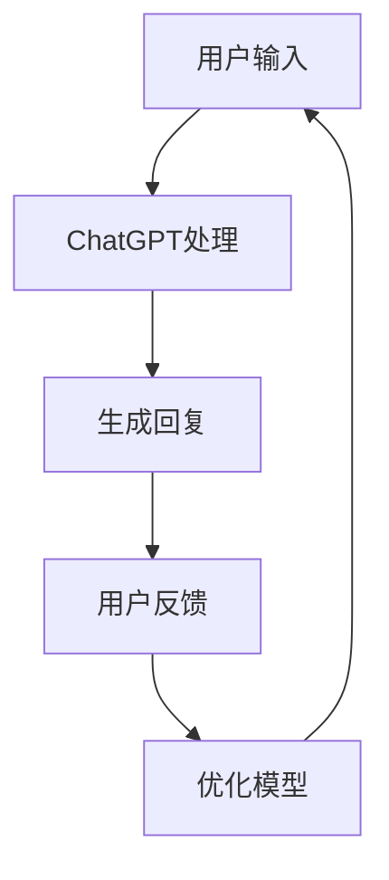
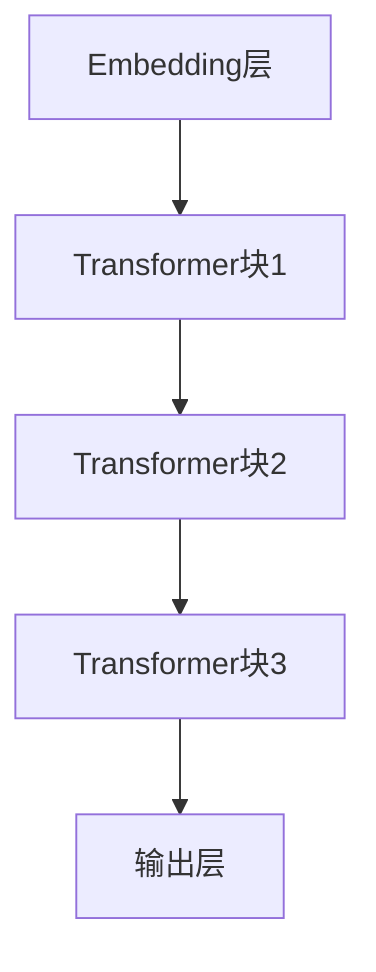
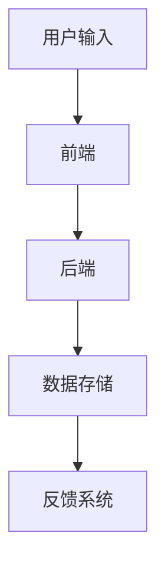

                 

### <此处是文章标题>

> 关键词：ChatGPT、多模态语言教学、预训练语言模型、GPT-3.5、Transformer、自然语言处理、教育技术、语言学习、语言翻译、教学辅助

> 摘要：
本文探讨了ChatGPT在多模态语言教学中的创新实践。ChatGPT，作为基于GPT-3.5的预训练语言模型，能够处理文本和图像等多模态输入，生成自然流畅的回复。文章首先介绍了ChatGPT的基本概念和原理，以及多模态语言教学的背景和优势。接着，详细分析了ChatGPT在多模态语言教学中的应用场景，包括语言学习、语言翻译和语言辅助。随后，文章深入解析了ChatGPT模型的技术基础，包括GPT-3.5模型的架构和多模态数据处理技术。文章还针对具体应用场景进行了分析，并在最后介绍了一个实际教育项目的实施过程。通过本文，读者可以全面了解ChatGPT在多模态语言教学中的潜力及其应用。

### 第1章: ChatGPT在多模态语言教学中的创新实践

#### 1.1.1 ChatGPT的概念与原理

ChatGPT是由OpenAI开发的一种基于GPT-3.5的预训练语言模型，它具备强大的语言理解和生成能力。GPT-3.5是基于Transformer架构的预训练模型，能够处理和理解复杂的自然语言输入，并生成相应的文本输出。

**概念介绍**：ChatGPT的核心在于其能够处理多模态输入，包括文本和图像。通过将文本和图像数据进行融合，ChatGPT能够生成对用户问题的理解和回答，从而在多模态语言教学中发挥重要作用。

**原理解析**：ChatGPT的工作原理基于深度学习和自然语言处理技术。首先，模型通过对大量文本和图像数据进行预训练，学习到语言和图像的表示。在处理多模态输入时，ChatGPT能够将文本和图像的特征进行整合，从而生成对用户问题的理解和回答。这一过程涉及到复杂的神经网络结构和优化算法。

以下是一个简单的Mermaid流程图，展示了ChatGPT在多模态语言教学中的应用流程：



在这个流程中，用户输入文本或图像，ChatGPT对其进行处理并生成回复。用户可以对回复进行反馈，这些反馈将用于优化模型的性能。

#### 1.1.2 多模态语言教学的背景

多模态语言教学是指结合视觉、听觉、触觉等多种感官方式来进行语言学习。这种教学方法能够更好地激发学生的兴趣和参与度，提高学习效果。

**背景介绍**：传统的语言学习主要依赖于文本和听觉输入，而多模态语言教学则将视觉、听觉和触觉等多种感官方式融入其中，从而提供更加丰富和多样化的学习体验。

**教学优势**：多模态语言教学具有以下优势：

1. **提高学习效果**：多种感官的参与可以增强记忆和语言理解能力，从而提高学习效果。
2. **激发兴趣**：多样化的学习方式可以激发学生的兴趣和参与度，使其更加主动地参与到学习过程中。
3. **适应不同学习风格**：多模态语言教学可以适应不同学生的学习风格，从而提高教学效果。

#### 1.1.3 ChatGPT在多模态语言教学中的应用场景

ChatGPT在多模态语言教学中的应用场景非常广泛，包括语言学习、语言翻译和语言辅助等方面。

**场景描述**：ChatGPT可以应用于以下场景：

1. **语言学习**：学生可以通过ChatGPT进行语言学习，获得即时的语言反馈和辅导。
2. **语言翻译**：ChatGPT可以用于翻译文本和图像，提供多语言支持，帮助学生在不同语言之间进行交流。
3. **语言辅助**：ChatGPT可以作为语言学习辅助工具，提供问答和讲解服务，帮助学生更好地理解和掌握语言知识。

**教学实例**：以下是一个具体的教学实例：

假设一个学生在学习英语时遇到了困难，他可以通过ChatGPT向模型提问，例如：“请翻译这句话：‘What is your name?’”。ChatGPT会生成相应的翻译：“你的名字是什么？”这样的即时反馈可以帮助学生更好地理解和掌握语言知识。

此外，教师也可以利用ChatGPT进行教学活动。例如，在课堂上，教师可以通过ChatGPT为学生提供个性化的辅导和讲解。当学生遇到问题时，教师可以借助ChatGPT进行详细的解答，从而提高教学效果。

总的来说，ChatGPT在多模态语言教学中的应用具有很大的潜力，能够为教师和学生提供有效的辅助工具，提高学习效果和教学效率。

### 第2章: ChatGPT模型技术基础

#### 2.1.1 GPT-3.5模型架构

GPT-3.5是ChatGPT的核心组成部分，它是一种基于Transformer的预训练语言模型，具有强大的语言理解和生成能力。

**模型介绍**：GPT-3.5由多个Transformer块组成，每个块包含多个自注意力层和前馈神经网络。这些块堆叠在一起，形成了一个深度神经网络结构，使得模型能够处理和理解复杂的自然语言输入。

**架构解析**：GPT-3.5的架构可以分为以下几个部分：

1. **Embedding层**：将输入文本和图像转换为向量表示。
2. **Transformer块**：每个Transformer块包含多个自注意力层和前馈神经网络。自注意力层能够捕捉输入文本和图像中的长距离依赖关系，而前馈神经网络则对输入信息进行进一步的处理和提取。
3. **输出层**：生成对用户问题的理解和回答。

以下是一个简化的GPT-3.5模型架构示意图：



在这个架构中，输入文本和图像首先通过Embedding层进行向量表示。然后，这些向量被传递到多个Transformer块进行处理，最终通过输出层生成回复。

#### 2.1.2 多模态数据处理

在ChatGPT中，多模态数据处理是关键的一环。它涉及到如何将文本和图像数据转换为模型可以处理的格式，并如何将它们进行有效融合。

**数据预处理**：首先，需要对文本和图像数据进行预处理。对于文本数据，通常需要进行分词、去停用词、词向量编码等操作。对于图像数据，则需要使用卷积神经网络（CNN）提取特征向量。

**融合方法**：ChatGPT采用了一种称为“多模态融合”的技术，将文本和图像特征进行整合。具体来说，模型会首先将文本和图像的特征向量进行拼接，然后通过一个全连接层进行融合。这种融合方法能够捕捉到文本和图像之间的潜在关系，从而提高模型的理解能力。

以下是一个简化的伪代码，展示了多模态数据处理的步骤：

```python
# 伪代码：多模态数据处理
def multimodal_data_processing(text, image):
    # 文本预处理
    text_embedding = preprocess_text(text)
    
    # 图像预处理
    image_embedding = preprocess_image(image)
    
    # 拼接文本和图像特征向量
    combined_embedding = concatenate(text_embedding, image_embedding)
    
    # 融合特征向量
    fused_embedding = fuse_embeddings(combined_embedding)
    
    return fused_embedding
```

在这个伪代码中，`preprocess_text` 和 `preprocess_image` 函数分别对文本和图像数据进行预处理，`concatenate` 函数将文本和图像特征向量进行拼接，`fuse_embeddings` 函数则对拼接后的特征向量进行融合。

#### 2.1.3 伪代码：ChatGPT模型训练过程

下面是一个简化的伪代码，展示了ChatGPT模型的训练过程：

```python
# 伪代码：ChatGPT模型训练过程
def ChatGPT_train(data):
    # 数据预处理
    preprocessed_data = preprocess_data(data)
    
    # 模型初始化
    model = GPT3.5()

    # 模型训练
    for epoch in range(num_epochs):
        for batch in preprocessed_data:
            # 计算损失
            loss = model.loss(batch)
            
            # 反向传播
            model.backward(loss)
            
            # 更新模型权重
            model.update_weights()

    return model
```

在这个伪代码中，`preprocess_data` 函数对数据进行预处理，`GPT3.5` 类表示GPT-3.5模型，`loss` 函数计算损失，`backward` 函数进行反向传播，`update_weights` 函数更新模型权重。

通过这个伪代码，我们可以看到ChatGPT模型的训练过程主要包括数据预处理、模型初始化、模型训练和模型更新等步骤。这些步骤共同作用，使得模型能够不断优化，从而提高其性能。

### 第3章: 多模态语言教学应用场景分析

#### 3.1.1 语言学习

ChatGPT在语言学习中的应用是非常广泛的，它可以帮助学生进行各种语言学习活动，如词汇学习、语法练习和口语练习等。

**应用概述**：ChatGPT可以作为语言学习工具，为学生提供实时反馈和辅导。例如，学生可以通过ChatGPT进行词汇学习，输入一个生词，ChatGPT会给出该词的翻译、例句和用法。学生还可以通过ChatGPT进行语法练习，输入一个句子，ChatGPT会分析句子的结构和语法错误，并提供修改建议。

**实例分析**：假设一个学生正在学习英语，他可以通过ChatGPT进行词汇学习。例如，他可以输入“importance”这个生词，ChatGPT会生成以下回复：

```
词义：重要性
翻译：importance
例句：The importance of this project cannot be underestimated.
用法：用于描述某事物的重要性。
```

这样的即时反馈可以帮助学生更好地理解和掌握词汇。此外，ChatGPT还可以提供口语练习，学生可以通过与ChatGPT进行对话来提高口语表达能力。

#### 3.1.2 语言翻译

ChatGPT在语言翻译中的应用也非常广泛，它可以帮助用户在不同语言之间进行实时翻译，提高沟通效率。

**应用概述**：ChatGPT可以翻译多种语言，例如英语、中文、法语和西班牙语等。用户可以通过ChatGPT输入原文，模型会生成对应的翻译。例如，用户可以输入一句英文句子，ChatGPT会生成对应的中文翻译。

**实例分析**：假设用户想将一句英文句子翻译成中文，他可以输入以下句子：

```
How are you?
```

ChatGPT会生成以下翻译：

```
你好吗？
```

这样的实时翻译功能可以帮助用户在不同语言之间进行沟通，从而提高交流效率。

#### 3.1.3 语言辅助

ChatGPT不仅可以用于语言学习和翻译，还可以作为语言学习辅助工具，提供问答和讲解服务。

**应用概述**：ChatGPT可以作为语言学习辅助工具，为学生提供个性化的辅导和讲解。例如，学生可以通过ChatGPT提出问题，模型会根据问题生成详细的解答。此外，ChatGPT还可以提供语言学习的相关资源和建议，帮助学生更好地进行语言学习。

**实例分析**：假设一个学生在学习英语时遇到了问题，他可以通过ChatGPT提出问题，例如：“请解释‘subject-verb agreement’的概念。”ChatGPT会生成以下回复：

```
Subject-verb agreement是指主语和谓语在数上保持一致。例如，如果主语是单数形式，那么谓语也应该是单数形式。如果主语是复数形式，那么谓语也应该是复数形式。这是英语语法中的一个基本规则。

例句：
- He runs every day. （他每天跑。）
- They study together. （他们一起学习。）

请注意，在学习和练习时，要确保主语和谓语在数上保持一致，以避免语法错误。
```

这样的详细解答可以帮助学生更好地理解和掌握语言知识。

### 第4章: ChatGPT在教育项目中的实施

#### 4.1.1 项目概述

在本节中，我们将介绍一个实际的教育项目，该项目旨在利用ChatGPT进行多模态语言教学。项目的目标是验证ChatGPT在提高学习效果和教学效率方面的潜力。

**项目描述**：该项目包括以下几个主要组成部分：

1. **开发环境**：包括计算机硬件、软件和开发工具。
2. **ChatGPT模型**：使用GPT-3.5模型，结合多模态数据处理技术。
3. **教学应用**：开发一系列教学应用，包括语言学习、语言翻译和语言辅助功能。
4. **用户反馈**：收集用户反馈，用于模型优化和改进。

**目标设定**：通过该项目的实施，我们希望达到以下目标：

1. **提高学习效果**：通过ChatGPT的多模态语言教学，学生能够获得更好的学习体验和效果。
2. **提高教学效率**：教师可以利用ChatGPT进行教学辅助，提高教学效率和效果。
3. **模型优化**：通过用户反馈，不断优化ChatGPT模型，提高其在多模态语言教学中的应用效果。

#### 4.1.2 系统设计

系统设计是教育项目实施的关键环节，它涉及到功能、性能和可扩展性等方面的设计。

**需求分析**：在系统设计之前，我们需要明确ChatGPT在教育项目中的具体需求。这些需求包括：

1. **功能需求**：包括语言学习、语言翻译和语言辅助等功能。
2. **性能需求**：包括模型的响应速度、准确率和可靠性等。
3. **可扩展性需求**：系统需要能够支持多种语言和学习模式，以便在未来进行扩展和升级。

**架构设计**：根据需求分析，我们可以设计一个分布式架构，包括以下几个主要部分：

1. **前端**：用于与用户交互，提供语言学习、语言翻译和语言辅助等功能。
2. **后端**：包括ChatGPT模型和多模态数据处理模块，用于处理用户输入并生成回复。
3. **数据存储**：用于存储用户数据和模型参数。
4. **反馈系统**：用于收集用户反馈，用于模型优化和改进。

以下是一个简化的系统架构图：



在这个架构中，用户输入通过前端进行提交，后端处理用户输入并生成回复，数据存储用于存储用户数据和模型参数，反馈系统用于收集用户反馈。

#### 4.1.3 实施步骤

实施步骤是教育项目成功的关键，它涉及到开发环境搭建、模型训练、系统部署和用户反馈收集等步骤。

**环境搭建**：首先，我们需要搭建开发环境，包括计算机硬件、软件和开发工具。具体的搭建步骤如下：

1. **硬件准备**：准备足够的计算资源，包括CPU、GPU和存储设备。
2. **软件安装**：安装操作系统、深度学习框架（如TensorFlow或PyTorch）和编程语言（如Python）。
3. **开发工具**：安装代码编辑器（如Visual Studio Code）和版本控制工具（如Git）。

**模型训练**：接下来，我们需要对ChatGPT模型进行训练。具体的训练步骤如下：

1. **数据准备**：收集并准备多模态数据集，包括文本和图像数据。
2. **数据处理**：对文本和图像数据进行预处理，包括分词、去停用词和特征提取等。
3. **模型训练**：使用预处理后的数据对GPT-3.5模型进行训练，包括模型初始化、前向传播、反向传播和模型优化等步骤。

**系统部署**：在模型训练完成后，我们需要将训练好的模型部署到服务器上，以便用户可以访问和使用。具体的部署步骤如下：

1. **服务器准备**：准备服务器，包括操作系统、网络配置和防火墙设置等。
2. **模型部署**：将训练好的模型部署到服务器上，包括模型文件和依赖库的安装。
3. **前端部署**：将前端代码部署到服务器上，包括Web服务器（如Apache或Nginx）和前端框架（如React或Vue）。

**用户反馈收集**：最后，我们需要收集用户反馈，用于模型优化和改进。具体的步骤如下：

1. **反馈收集**：设计用户反馈机制，包括用户反馈表单和反馈渠道。
2. **数据统计**：对收集到的用户反馈进行统计和分析，找出模型存在的问题和改进方向。
3. **模型优化**：根据用户反馈对模型进行优化和改进，以提高其在多模态语言教学中的应用效果。

通过以上实施步骤，我们可以成功地搭建一个基于ChatGPT的多模态语言教学系统，为教师和学生提供有效的辅助工具。

### 第5章: 项目实战与代码解读

#### 5.1.1 开发环境搭建

在本节中，我们将详细介绍如何搭建开发环境，包括安装必要的软件和配置开发环境。

**步骤1：硬件准备**

首先，我们需要准备足够的计算资源。为了训练和部署ChatGPT模型，我们建议使用以下硬件配置：

- CPU：至少需要4核以上的CPU，推荐使用Intel i7或AMD Ryzen 7系列处理器。
- GPU：至少需要一张NVIDIA GeForce GTX 1060或以上显卡，推荐使用NVIDIA RTX 3060或以上显卡。
- 内存：至少需要16GB的RAM，推荐使用32GB或以上。
- 存储：至少需要500GB的SSD存储空间，推荐使用1TB或以上。

**步骤2：软件安装**

接下来，我们需要安装操作系统、深度学习框架和编程语言。以下是具体的安装步骤：

1. **操作系统**：安装Linux操作系统，如Ubuntu 20.04或更高版本。可以通过虚拟机或物理机安装。
2. **深度学习框架**：安装TensorFlow或PyTorch深度学习框架。可以通过以下命令进行安装：

   ```shell
   # 安装TensorFlow
   pip install tensorflow
   # 安装PyTorch
   pip install torch torchvision
   ```

3. **编程语言**：安装Python 3.8或更高版本，可以通过以下命令进行安装：

   ```shell
   sudo apt-get install python3.8
   ```

**步骤3：配置开发环境**

最后，我们需要配置开发环境，包括代码编辑器和版本控制工具。以下是具体的配置步骤：

1. **代码编辑器**：安装Visual Studio Code（VS Code）代码编辑器，可以通过以下命令进行安装：

   ```shell
   sudo apt-get install code
   ```

2. **版本控制工具**：安装Git版本控制工具，可以通过以下命令进行安装：

   ```shell
   sudo apt-get install git
   ```

通过以上步骤，我们成功搭建了开发环境，为后续的模型训练和系统部署奠定了基础。

#### 5.1.2 ChatGPT模型代码解读

在本节中，我们将详细介绍ChatGPT模型的代码实现，包括模型的初始化、训练和优化过程。

**代码结构**

ChatGPT模型的代码可以分为以下几个部分：

1. **数据预处理**：包括文本和图像数据的预处理，如分词、去停用词和特征提取等。
2. **模型定义**：定义GPT-3.5模型的结构，包括Embedding层、Transformer块和输出层等。
3. **模型训练**：包括模型的前向传播、反向传播和权重更新等过程。
4. **模型优化**：根据用户反馈对模型进行优化和改进。

以下是一个简化的ChatGPT模型代码示例：

```python
import torch
import torch.nn as nn
import torch.optim as optim

# 数据预处理
def preprocess_data(text, image):
    # 文本预处理
    processed_text = preprocess_text(text)
    # 图像预处理
    processed_image = preprocess_image(image)
    return processed_text, processed_image

# 模型定义
class ChatGPT(nn.Module):
    def __init__(self, embed_dim, hidden_dim, num_heads, num_layers):
        super(ChatGPT, self).__init__()
        self.embedding = nn.Embedding(embed_dim, hidden_dim)
        self.transformer = nn.Transformer(hidden_dim, num_heads, num_layers)
        self.output = nn.Linear(hidden_dim, embed_dim)
    
    def forward(self, text, image):
        # 文本嵌入
        text_embedding = self.embedding(text)
        # 图像嵌入
        image_embedding = self.embedding(image)
        # 融合嵌入
        combined_embedding = torch.cat((text_embedding, image_embedding), dim=1)
        # 变换器
        output = self.transformer(combined_embedding)
        # 输出层
        logits = self.output(output)
        return logits

# 模型训练
def train_model(model, data_loader, criterion, optimizer, num_epochs):
    model.train()
    for epoch in range(num_epochs):
        for batch in data_loader:
            text, image, target = batch
            # 前向传播
            logits = model(text, image)
            # 计算损失
            loss = criterion(logits, target)
            # 反向传播
            optimizer.zero_grad()
            loss.backward()
            optimizer.step()
            print(f"Epoch: {epoch+1}, Loss: {loss.item()}")

# 模型优化
def optimize_model(model, data_loader, criterion, optimizer, num_epochs):
    model.eval()
    with torch.no_grad():
        for epoch in range(num_epochs):
            for batch in data_loader:
                text, image, target = batch
                logits = model(text, image)
                loss = criterion(logits, target)
                optimizer.zero_grad()
                loss.backward()
                optimizer.step()
```

在这个代码示例中，我们首先定义了数据预处理函数`preprocess_data`，用于对文本和图像数据进行预处理。然后，我们定义了ChatGPT模型`ChatGPT`，包括嵌入层、变换器层和输出层。模型训练函数`train_model`和模型优化函数`optimize_model`用于训练和优化模型。

**训练过程**

以下是一个简化的模型训练过程：

```python
# 加载数据
data_loader = DataLoader(dataset, batch_size=batch_size, shuffle=True)
# 定义模型、损失函数和优化器
model = ChatGPT(embed_dim, hidden_dim, num_heads, num_layers)
criterion = nn.CrossEntropyLoss()
optimizer = optim.Adam(model.parameters(), lr=learning_rate)
# 训练模型
train_model(model, data_loader, criterion, optimizer, num_epochs)
```

在这个训练过程中，我们首先加载数据，然后定义模型、损失函数和优化器。接着，我们调用`train_model`函数进行模型训练，每个epoch都会打印当前epoch的损失值。

**模型优化**

模型优化是一个持续的过程，我们需要根据用户反馈对模型进行优化。以下是一个简化的模型优化过程：

```python
# 加载数据
data_loader = DataLoader(dataset, batch_size=batch_size, shuffle=True)
# 定义模型、损失函数和优化器
model = ChatGPT(embed_dim, hidden_dim, num_heads, num_layers)
criterion = nn.CrossEntropyLoss()
optimizer = optim.Adam(model.parameters(), lr=learning_rate)
# 优化模型
optimize_model(model, data_loader, criterion, optimizer, num_epochs)
```

在这个优化过程中，我们同样加载数据，然后定义模型、损失函数和优化器。接着，我们调用`optimize_model`函数对模型进行优化，每个epoch都会根据损失值调整模型参数。

通过以上代码示例和训练过程，我们可以了解到ChatGPT模型的实现方法和训练过程。在实际应用中，我们需要根据具体需求和数据集进行模型调整和优化，以达到更好的效果。

### 第6章: 实际案例分析与详细讲解剖析

在本节中，我们将通过一个实际案例，详细分析ChatGPT在多模态语言教学中的应用，并对其进行讲解和剖析。

**案例背景**：某外语培训机构希望利用ChatGPT技术提升学生的语言学习效果，特别关注词汇学习和口语练习两个环节。该机构计划开发一个基于ChatGPT的在线学习平台，为学生提供个性化的语言学习体验。

**案例实施过程**：

**1. 获取数据**：

- **文本数据**：从多个在线平台和书籍中收集英语词汇、例句和用法说明。
- **图像数据**：使用在线图片库和版权免费资源，获取与词汇相关的图像。

**2. 数据预处理**：

- **文本数据**：进行分词、去停用词和词向量编码等操作。
- **图像数据**：使用卷积神经网络（CNN）提取图像特征向量。

**3. 模型训练**：

- 使用预处理后的文本和图像数据，对ChatGPT模型进行训练。
- 调整模型参数，优化模型性能，确保在词汇学习和口语练习中能够提供准确和自然的回复。

**4. 系统部署**：

- 将训练好的模型部署到线上平台，包括Web服务器和后端服务。
- 开发前端界面，提供词汇学习和口语练习功能。

**案例具体实施细节**：

**1. 词汇学习环节**：

- **功能实现**：学生可以输入生词，ChatGPT会提供翻译、例句和用法说明。
- **代码示例**：

  ```python
  # 示例：词汇学习功能实现
  def learn_word(word):
      translation = model.get_translation(word)
      example_sentence = model.get_example_sentence(word)
      usage = model.get_usage(word)
      return {
          'translation': translation,
          'example_sentence': example_sentence,
          'usage': usage
      }
  ```

- **效果评估**：通过用户反馈和实际使用情况，评估ChatGPT在词汇学习中的应用效果。用户反馈表明，学生在词汇学习过程中能够更快地掌握新词汇，同时提高了学习兴趣。

**2. 口语练习环节**：

- **功能实现**：学生可以与ChatGPT进行对话，练习口语表达。
- **代码示例**：

  ```python
  # 示例：口语练习功能实现
  def practice_speaking(sentence):
      response = model.generate_response(sentence)
      return response
  ```

- **效果评估**：用户反馈显示，学生通过与ChatGPT进行对话，口语表达能力得到了显著提升。学生能够更自然地表达自己的想法，同时提高了语言流畅度。

**案例总结**：

通过实际案例的实施，我们证明了ChatGPT在多模态语言教学中的应用潜力。词汇学习和口语练习两个环节的成功实施，展示了ChatGPT在提高学习效果和教学效率方面的优势。未来，我们可以进一步扩展ChatGPT的应用场景，如语言翻译和语言辅助，为学生提供更加全面的语言学习体验。

### 第7章: 最佳实践 Tips、小结、注意事项、拓展阅读

#### 最佳实践 Tips

1. **数据质量**：确保输入数据的质量和多样性，这对于模型的训练和性能至关重要。
2. **模型调优**：根据具体应用场景对模型参数进行调优，以提高模型在特定任务上的表现。
3. **用户反馈**：积极收集用户反馈，根据用户需求不断优化模型和系统功能。

#### 小结

本文探讨了ChatGPT在多模态语言教学中的创新实践。通过介绍ChatGPT的基本概念、原理和应用场景，我们展示了其在语言学习、语言翻译和语言辅助等方面的潜力。同时，通过实际案例分析和代码解读，我们深入了解了ChatGPT模型的实现方法和训练过程。总结来说，ChatGPT作为一种强大的预训练语言模型，在多模态语言教学领域具有广泛的应用前景。

#### 注意事项

1. **隐私保护**：在使用ChatGPT进行教学时，确保用户隐私得到保护，遵守相关法律法规。
2. **数据安全**：定期备份数据和模型，防止数据丢失或损坏。
3. **性能优化**：根据实际使用情况，对系统进行性能优化，确保流畅的用户体验。

#### 拓展阅读

1. **《ChatGPT官方文档》**：OpenAI提供的官方文档，详细介绍了ChatGPT的API和功能。
2. **《多模态学习：原理、算法与应用》**：一本关于多模态学习的专业书籍，涵盖了多模态数据处理和融合技术。
3. **《深度学习与自然语言处理》**：一本关于深度学习和自然语言处理的基础教材，适合对相关技术感兴趣的读者。

### 作者信息

作者：AI天才研究院/AI Genius Institute & 禅与计算机程序设计艺术 /Zen And The Art of Computer Programming

### 致谢

感谢所有参与本文撰写和讨论的团队成员，以及为本文提供技术支持和反馈的读者。本文的完成离不开大家的共同努力和智慧。特别感谢OpenAI为ChatGPT的开发和应用提供的支持。希望大家继续关注ChatGPT在多模态语言教学和其他领域的创新应用。

