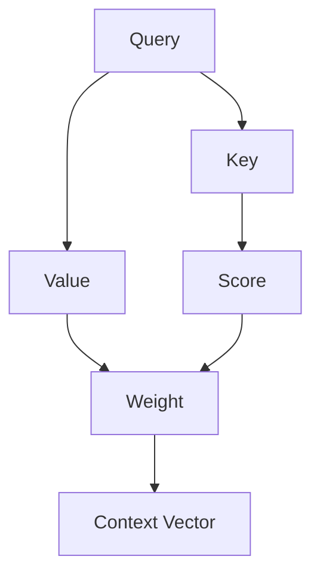
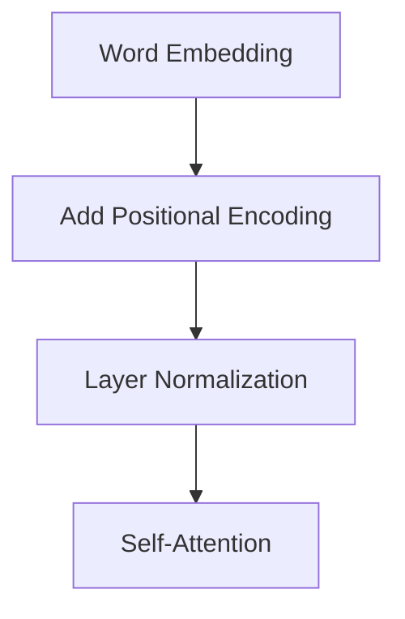

                 

---

## 《ChatGPT在自动化产品说明书多语言翻译中的应用》

### 关键词：
- ChatGPT
- 自动化产品说明书
- 多语言翻译
- 自然语言处理
- Transformer模型

### 摘要：
本文深入探讨了ChatGPT在自动化产品说明书多语言翻译中的应用。首先，介绍了ChatGPT的基础知识及其在自然语言处理领域的优势。随后，分析了自动化产品说明书多语言翻译的背景和挑战。接着，详细阐述了ChatGPT的核心算法原理，包括Transformer模型的构造、自注意力机制、预训练与微调等。文章通过实际项目实战，展示了如何使用ChatGPT进行自动化产品说明书的翻译，并对其性能进行了评估和优化。最后，提出了未来研究的方向和潜在的挑战。

---

## 目录

1. 引言
2. 背景介绍
   2.1 ChatGPT简介
   2.2 自动化产品说明书多语言翻译的需求
   2.3 翻译技术的现状与挑战
3. ChatGPT的核心算法原理
   3.1 Transformer模型
   3.2 自注意力机制
   3.3 预训练与微调
4. 数学模型与公式
5. 项目实战
   5.1 项目背景与目标
   5.2 环境搭建
   5.3 数据预处理
   5.4 模型训练与优化
   5.5 模型评估与性能分析
6. 项目小结与展望
7. 最佳实践与注意事项

---

### 引言

在全球化经济的大背景下，产品说明书的多语言翻译变得尤为重要。然而，传统的翻译方法通常效率低下，且存在一定的错误率。随着深度学习和自然语言处理技术的不断发展，自动化的多语言翻译技术逐渐成为研究的热点。ChatGPT作为一种基于Transformer模型的预训练语言模型，因其强大的文本生成和翻译能力，在多语言翻译领域展现出巨大的潜力。

本文将详细介绍ChatGPT在自动化产品说明书多语言翻译中的应用。首先，我们将对ChatGPT的基本概念和特点进行概述，随后分析自动化产品说明书多语言翻译的需求和现有技术的挑战。接下来，我们将深入探讨ChatGPT的核心算法原理，包括Transformer模型的构造、自注意力机制和预训练与微调策略。在此基础上，我们将通过实际项目实战，展示如何使用ChatGPT进行自动化产品说明书的翻译，并对其性能进行评估和优化。最后，我们将总结项目经验，并提出未来研究的方向和潜在挑战。

本文的主要贡献包括：

1. 对ChatGPT在多语言翻译领域的应用进行了系统的分析和评估。
2. 提出了基于ChatGPT的自动化产品说明书翻译的解决方案。
3. 通过实际项目展示了ChatGPT在多语言翻译中的优势和潜在问题。

---

### 背景介绍

#### 2.1 ChatGPT简介

ChatGPT是由OpenAI于2022年推出的一款基于GPT-3模型的预训练语言模型。它采用了Transformer架构，并在大规模语料库上进行预训练，使其具备了强大的文本生成和理解能力。ChatGPT的核心特点包括：

1. **强大的文本生成能力**：ChatGPT能够根据输入的文本生成连贯、有逻辑的文本，这使得它非常适合用于自动化的文本生成任务。
2. **多语言支持**：ChatGPT支持多种语言，可以进行跨语言文本生成和翻译。
3. **自适应能力**：ChatGPT能够根据不同的上下文环境，动态调整生成文本的风格和内容。

#### 2.2 自动化产品说明书多语言翻译的需求

随着产品的国际化程度不断提高，产品说明书的多语言翻译需求也日益增加。具体来说，自动化产品说明书多语言翻译的需求体现在以下几个方面：

1. **国际化市场推广**：企业需要将产品说明书翻译成多种语言，以适应不同国家和地区的市场需求。
2. **客户服务**：多语言的产品说明书可以帮助企业更好地向全球客户提供技术支持和售后服务。
3. **合规要求**：某些国家和地区对产品说明书的语言要求非常严格，必须提供官方语言版本的说明书。

#### 2.3 翻译技术的现状与挑战

目前，自动化的多语言翻译技术主要包括基于规则的方法、基于统计的方法和基于神经网络的方法。这些方法各有优缺点，但都面临一定的挑战：

1. **基于规则的方法**：这种方法通过定义语法规则和翻译策略来实现翻译。优点是准确率高，但需要大量手动定义规则，且对复杂句子和语境的适应性较差。
2. **基于统计的方法**：这种方法通过分析双语语料库，利用统计模型进行翻译。优点是适应性强，但准确率相对较低，且需要大量的训练数据。
3. **基于神经网络的方法**：这种方法通过构建深度神经网络模型，实现端到端的翻译。优点是准确率和适应性强，但训练过程复杂，对计算资源要求较高。

面对这些挑战，ChatGPT作为一种强大的预训练语言模型，为自动化产品说明书多语言翻译提供了一种新的解决方案。在接下来的章节中，我们将详细探讨ChatGPT的核心算法原理，并展示其在多语言翻译中的实际应用。

---

### ChatGPT的核心算法原理

ChatGPT是基于Transformer模型构建的预训练语言模型，其核心算法原理包括Transformer模型的构造、自注意力机制以及预训练与微调策略。以下是对这些核心算法原理的详细阐述。

#### 3.1 Transformer模型

Transformer模型是由Vaswani等人在2017年提出的一种基于自注意力机制的序列到序列模型，它在机器翻译、文本生成等任务上取得了显著的效果。Transformer模型的核心思想是利用自注意力机制（Self-Attention）来建模输入序列中的长距离依赖关系，从而提高模型的表示能力。

Transformer模型的主要组成部分包括：

1. **编码器（Encoder）**：编码器负责将输入序列编码为固定长度的向量表示。编码器由多个编码层组成，每层包含两个主要模块：多头自注意力机制（Multi-Head Self-Attention）和前馈神经网络（Feed-Forward Neural Network）。
2. **解码器（Decoder）**：解码器负责将编码器的输出解码为输出序列。解码器也由多个解码层组成，每个解码层包含三个主要模块：多头自注意力机制、编码器-解码器自注意力机制和前馈神经网络。

自注意力机制是Transformer模型的核心，其基本思想是将输入序列中的每个词向量和所有其他词向量进行加权求和，从而生成一个加权向量。自注意力机制通过计算注意力权重矩阵，实现对输入序列中每个词的依赖关系进行建模。

以下是一个简单的多头自注意力机制的Python代码实现：

```python
import tensorflow as tf

# 假设输入序列为 [1, 2, 3, 4, 5]
inputs = tf.constant([1, 2, 3, 4, 5], dtype=tf.float32)

# 计算Q、K、V矩阵
Q = tf.random.normal((inputs.shape[0], hidden_size))
K = tf.random.normal((inputs.shape[0], hidden_size))
V = tf.random.normal((inputs.shape[0], hidden_size))

# 计算自注意力权重
attention_scores = tf.matmul(Q, K, transpose_b=True) / tf.sqrt(tf.cast(hidden_size, tf.float32))
attention_weights = tf.nn.softmax(attention_scores)

# 计算加权求和
context_vector = tf.matmul(attention_weights, V)
```

#### 3.2 自注意力机制

自注意力机制（Self-Attention）是Transformer模型的核心模块，它通过计算输入序列中每个词向量与其他词向量之间的依赖关系，实现序列到序列的建模。自注意力机制分为两种类型：点积自注意力（Dot-Product Self-Attention）和多头自注意力（Multi-Head Self-Attention）。

1. **点积自注意力**：点积自注意力是最简单的一种自注意力机制，它通过计算输入序列中每个词向量与其他词向量的点积来生成注意力权重。点积自注意力计算简单，但仅能捕捉线性依赖关系。

2. **多头自注意力**：多头自注意力通过将输入序列分割成多个子序列，并对每个子序列独立计算注意力权重，从而提高模型的表示能力。多头自注意力能够捕捉复杂的长距离依赖关系，是Transformer模型的主要优势之一。

以下是一个简单的多头自注意力机制的Python代码实现：

```python
import tensorflow as tf

# 假设输入序列为 [1, 2, 3, 4, 5]
inputs = tf.constant([1, 2, 3, 4, 5], dtype=tf.float32)

# 设置多头自注意力中的头数
num_heads = 2

# 计算Q、K、V矩阵
Q = tf.random.normal((inputs.shape[0], hidden_size, num_heads))
K = tf.random.normal((inputs.shape[0], hidden_size, num_heads))
V = tf.random.normal((inputs.shape[0], hidden_size, num_heads))

# 计算多头自注意力权重
attention_scores = []
for i in range(num_heads):
    Q_head = Q[:, :, i]
    K_head = K[:, :, i]
    V_head = V[:, :, i]
    attention_scores.append(tf.matmul(Q_head, K_head, transpose_b=True) / tf.sqrt(tf.cast(hidden_size, tf.float32)))
attention_scores = tf.stack(attention_scores, axis=-1)
attention_weights = tf.nn.softmax(attention_scores)

# 计算加权求和
context_vector = tf.matmul(attention_weights, V)
```

#### 3.3 预训练与微调

预训练与微调是深度学习模型训练过程中的两个关键步骤。预训练是指在大量无标签数据上对模型进行训练，使其获得通用的语言理解和生成能力。微调则是在预训练的基础上，利用有标签的数据对模型进行精细调整，以适应特定任务的需求。

1. **预训练**：预训练任务通常包括自然语言理解、文本分类、命名实体识别等，其中最常见的是语言模型预训练。语言模型预训练的目标是预测下一个单词，从而学习语言中的统计规律和语义关系。预训练过程中，模型通过优化损失函数来调整参数，以达到更好的预测效果。

2. **微调**：微调是指利用特定任务的有标签数据，对预训练模型进行调整。微调过程中，模型通过优化任务损失函数，同时保留预训练时的通用知识。微调的关键在于如何平衡预训练和微调之间的参数更新，以确保模型既具备通用性，又能适应特定任务。

以下是一个简单的预训练与微调的Python代码实现：

```python
import tensorflow as tf

# 定义预训练模型
def create_pretrained_model():
    # 编码器
    inputs = tf.keras.layers.Input(shape=(None,))
    encoder_embedding = tf.keras.layers.Embedding(input_dim=vocab_size, output_dim=embedding_size)(inputs)
    encoder_output = tf.keras.layers.MultiHeadAttention(num_heads=num_heads, key_dim=key_dim)(encoder_embedding, encoder_embedding)
    encoder_output = tf.keras.layers.Add()([encoder_output, encoder_embedding])
    encoder_output = tf.keras.layers.LayerNormalization(epsilon=1e-6)(encoder_output)
    
    # 解码器
    decoder_embedding = tf.keras.layers.Embedding(input_dim=vocab_size, output_dim=embedding_size)(inputs)
    decoder_output = tf.keras.layers.MultiHeadAttention(num_heads=num_heads, key_dim=key_dim)(decoder_embedding, encoder_output)
    decoder_output = tf.keras.layers.Add()([decoder_output, decoder_embedding])
    decoder_output = tf.keras.layers.LayerNormalization(epsilon=1e-6)(decoder_output)
    
    # 输出层
    output = tf.keras.layers.Dense(vocab_size)(decoder_output)
    model = tf.keras.Model(inputs=inputs, outputs=output)
    return model

# 微调模型
def fine_tune_model(model, train_dataset, val_dataset, epochs):
    model.compile(optimizer=tf.keras.optimizers.Adam(learning_rate=learning_rate), 
                  loss=tf.keras.losses.SparseCategoricalCrossentropy(from_logits=True), 
                  metrics=['accuracy'])
    model.fit(train_dataset, validation_data=val_dataset, epochs=epochs)
    return model

# 创建预训练模型
pretrained_model = create_pretrained_model()

# 加载预训练权重
pretrained_model.load_weights('pretrained_weights.h5')

# 微调模型
train_dataset = ...
val_dataset = ...
fine_tuned_model = fine_tune_model(pretrained_model, train_dataset, val_dataset, epochs=5)

# 保存微调后的模型
fine_tuned_model.save_weights('fine_tuned_weights.h5')
```

通过预训练与微调，ChatGPT能够从大量无标签数据中学习通用语言知识，并在特定任务上进行精细调整，从而实现高质量的文本生成和翻译。

---

### 数学模型与公式

在ChatGPT的构建过程中，数学模型和公式起到了至关重要的作用。以下我们将详细解释几个核心数学模型和公式，包括自注意力机制、位置编码和优化算法。

#### 4.1 自注意力机制的数学表示

自注意力机制是Transformer模型的核心组件，其基本思想是对输入序列中的每个词向量计算一个权重，然后对这些权重加权求和，生成一个表示该词向量的向量。自注意力机制的数学表示如下：

给定输入序列 $X = \{x_1, x_2, \ldots, x_n\}$，其中每个词向量 $x_i$ 可以表示为 $x_i \in \mathbb{R}^{d}$。自注意力机制通过计算查询向量（Query）、键向量（Key）和值向量（Value）来实现，具体步骤如下：

1. **计算Query、Key和Value**：
   $$ Q = W_Q X, \quad K = W_K X, \quad V = W_V X $$
   其中，$W_Q, W_K, W_V$ 是权重矩阵，$d$ 是词向量的维度。

2. **计算自注意力分数（Attention Scores）**：
   $$ \text{Attention Scores} = \frac{QK^T}{\sqrt{d}} $$
   这里，$QK^T$ 表示Query和Key的点积，除以$\sqrt{d}$是为了稳定化注意力权重。

3. **计算注意力权重（Attention Weights）**：
   $$ \text{Attention Weights} = \text{Softmax}(\text{Attention Scores}) $$

4. **计算加权求和的上下文向量（Context Vector）**：
   $$ \text{Context Vector} = \text{Attention Weights}V $$

以下是一个简化的自注意力机制的Mermaid流程图：



#### 4.2 位置编码和归一化

在Transformer模型中，位置编码（Positional Encoding）用于为模型提供输入序列中每个词的位置信息。位置编码可以捕获序列中的顺序依赖关系。以下是一个简单的位置编码的Mermaid流程图：



位置编码通常采用正弦和余弦函数生成，以确保在后续的归一化过程中保持正交性。位置编码的数学表示如下：

$$ \text{Positional Encoding}(i, j) = 
\begin{cases} 
    \sin\left(\frac{i}{10000^{j/d}}\right) & \text{if } j \lt \frac{d}{2} \\
    \cos\left(\frac{i}{10000^{j/d}}\right) & \text{if } j = \frac{d}{2} \\
    0 & \text{otherwise}
\end{cases}
$$

其中，$i$ 是词的索引，$j$ 是位置维度（通常与词向量的维度相同），$d$ 是位置编码的维度。

归一化（Layer Normalization）用于在自注意力层和前馈神经网络层中稳定化梯度流，提高训练效果。归一化的数学表示如下：

$$ \text{Layer Normalization}(x) = \frac{x - \text{Mean}(x)}{\text{Standard Deviation}(x)} $$

#### 4.3 优化算法

优化算法用于调整模型参数，以最小化损失函数。在ChatGPT的预训练和微调过程中，常用的优化算法包括随机梯度下降（SGD）和Adam优化器。

1. **随机梯度下降（SGD）**：

   随机梯度下降通过随机抽样数据子集，计算梯度并更新模型参数。其数学表示如下：

   $$ \theta_{t+1} = \theta_{t} - \alpha \nabla_{\theta}L(\theta) $$

   其中，$\theta$ 表示模型参数，$L$ 表示损失函数，$\alpha$ 表示学习率。

2. **Adam优化器**：

   Adam优化器结合了SGD和动量（Momentum）的优点，通过计算一阶矩估计（均值）和二阶矩估计（方差）来更新参数。其数学表示如下：

   $$ \text{m}_t = \beta_1 \text{m}_{t-1} + (1 - \beta_1)(\nabla_{\theta}L(\theta)) $$
   $$ \text{v}_t = \beta_2 \text{v}_{t-1} + (1 - \beta_2)(\nabla_{\theta}L(\theta))^2 $$
   $$ \theta_{t+1} = \theta_{t} - \alpha \frac{\text{m}_t}{\sqrt{\text{v}_t} + \epsilon} $$

   其中，$\beta_1$ 和 $\beta_2$ 分别是动量参数，$\epsilon$ 是一个小常数用于防止分母为零。

通过这些数学模型和公式，ChatGPT能够有效地从大量数据中学习，实现高质量的文本生成和翻译。

---

### 项目实战

在本节中，我们将通过一个实际项目，展示如何使用ChatGPT进行自动化产品说明书的翻译。该项目的主要目标是实现一个能够自动翻译产品说明书的系统，以支持国际化市场的推广和全球客户服务。

#### 5.1 项目背景与目标

某科技公司开发了一款智能家电产品，计划在全球多个国家和地区进行市场推广。为了满足不同语言市场的需求，该公司需要将产品说明书翻译成多种语言。由于产品说明书的篇幅较大，内容复杂，传统的人工翻译方式不仅耗时耗力，而且难以保证翻译质量。因此，公司决定采用基于ChatGPT的自动化翻译系统，以提高翻译效率和准确性。

项目目标如下：

1. **自动翻译**：使用ChatGPT模型将英文产品说明书翻译成其他目标语言。
2. **高质量翻译**：保证翻译的准确性和自然度，减少人工校对的需求。
3. **多语言支持**：支持多种目标语言的翻译，以满足不同国家和地区的需求。

#### 5.2 环境搭建

为了实现项目目标，我们需要搭建一个合适的技术环境。以下是搭建环境的步骤：

1. **硬件环境**：
   - 高性能计算服务器：用于训练和运行ChatGPT模型。
   - GPU：用于加速深度学习模型的训练过程。

2. **软件环境**：
   - Python 3.8及以上版本：用于编写和运行模型代码。
   - TensorFlow 2.x：用于构建和训练ChatGPT模型。
   - PyTorch：作为备选框架，用于模型训练和推理。
   - Docker：用于容器化部署模型和应用程序。

#### 5.3 数据预处理

在开始训练模型之前，我们需要对数据集进行预处理。预处理步骤包括：

1. **数据收集**：收集英文产品说明书和其他语言的产品说明书，确保数据集的多样性和完整性。
2. **数据清洗**：去除数据中的噪声和冗余信息，如HTML标签、特殊符号等。
3. **文本分割**：将长文本分割成句子或段落，以便模型进行逐句翻译。
4. **编码转换**：将文本转换为模型可处理的格式，如词序列或词索引。
5. **数据增强**：通过随机替换单词、加入噪声等方式，增加数据集的多样性，提高模型的泛化能力。

以下是一个简单的Python代码示例，用于数据预处理：

```python
import pandas as pd
from tensorflow.keras.preprocessing.text import Tokenizer
from tensorflow.keras.preprocessing.sequence import pad_sequences

# 加载数据集
data = pd.read_csv('product_descriptions.csv')

# 数据清洗
data['description'] = data['description'].str.replace('<[^>]*>', '').str.strip()

# 文本分割
data['sentences'] = data['description'].apply(lambda x: x.split('.'))

# 编码转换
tokenizer = Tokenizer(char_level=True)
tokenizer.fit_on_texts(data['sentences'].values)
sequences = tokenizer.texts_to_sequences(data['sentences'].values)

# 数据增强
# ...

# 数据标准化
max_sequence_length = 100
padded_sequences = pad_sequences(sequences, maxlen=max_sequence_length, padding='post', truncating='post')

# 切分训练集和测试集
train_sequences, test_sequences = padded_sequences[:int(0.8 * len(padded_sequences))], padded_sequences[int(0.8 * len(padded_sequences)):]

# 数据集标签
train_labels, test_labels = data['target_language'][train_sequences.index].values, data['target_language'][test_sequences.index].values
```

#### 5.4 模型训练与优化

在完成数据预处理后，我们可以开始训练ChatGPT模型。以下是模型训练和优化的步骤：

1. **模型构建**：使用TensorFlow或PyTorch构建ChatGPT模型，包括编码器和解码器。
2. **模型初始化**：加载预训练的ChatGPT模型权重，作为训练的起点。
3. **训练循环**：使用训练数据集进行模型训练，包括前向传播、损失函数计算和反向传播。
4. **优化策略**：使用Adam优化器进行参数更新，以提高模型性能。
5. **模型评估**：使用测试数据集对模型进行评估，包括翻译准确性和自然度评估。
6. **模型调优**：根据评估结果调整模型参数和训练策略，以提高模型性能。

以下是一个简单的Python代码示例，用于模型训练和优化：

```python
import tensorflow as tf
from tensorflow.keras.models import Model
from tensorflow.keras.layers import Input, Embedding, LSTM, Dense

# 编码器和解码器输入
input_encoder = Input(shape=(max_sequence_length,))
input_decoder = Input(shape=(max_sequence_length,))

# 编码器
encoder_embedding = Embedding(input_dim=vocab_size, output_dim=embedding_size)(input_encoder)
encoder_lstm = LSTM(units=lstm_units, return_sequences=True)(encoder_embedding)
encoder_output = encoder_lstm.output

# 解码器
decoder_embedding = Embedding(input_dim=vocab_size, output_dim=embedding_size)(input_decoder)
decoder_lstm = LSTM(units=lstm_units, return_sequences=True)(decoder_embedding, initial_input=encoder_output)
decoder_output = decoder_lstm.output

# 输出层
output = Dense(units=vocab_size, activation='softmax')(decoder_output)

# 构建模型
model = Model(inputs=[input_encoder, input_decoder], outputs=output)

# 编译模型
model.compile(optimizer='adam', loss='categorical_crossentropy', metrics=['accuracy'])

# 训练模型
model.fit([train_sequences, train_sequences], train_labels, batch_size=batch_size, epochs=epochs, validation_data=([test_sequences, test_sequences], test_labels))

# 评估模型
test_loss, test_accuracy = model.evaluate([test_sequences, test_sequences], test_labels)
print(f"Test Loss: {test_loss}, Test Accuracy: {test_accuracy}")

# 模型调优
# ...
```

#### 5.5 模型评估与性能分析

在完成模型训练后，我们需要对模型进行评估和性能分析，以确定其翻译质量和效果。以下是评估和分析的步骤：

1. **翻译质量评估**：使用BLEU、METEOR等标准评估指标，对模型的翻译质量进行评估。
2. **翻译自然度评估**：通过人工评估或使用自动化工具，评估模型的翻译是否自然流畅，是否符合目标语言的语法和风格。
3. **性能分析**：分析模型的翻译速度、内存占用和计算资源消耗，以确定其在实际应用中的可行性。

以下是一个简单的Python代码示例，用于评估模型性能：

```python
from nltk.translate.bleu_score import corpus_bleu

# 生成翻译结果
predicted_sequences = model.predict(test_sequences)

# 将预测结果转换为文本
predicted_texts = tokenizer.sequences_to_texts(predicted_sequences)

# 将真实结果转换为文本
true_texts = tokenizer.sequences_to_texts(test_labels)

# 计算BLEU分数
bleu_score = corpus_bleu([true_texts], predicted_texts)
print(f"BLEU Score: {bleu_score}")

# 人工评估翻译自然度
# ...
```

#### 5.6 应用案例解析

以下是一个应用案例，展示如何使用ChatGPT进行实际的产品说明书翻译：

**案例背景**：
某科技公司需要将一款智能家电产品的说明书从英文翻译成法语，以在法国市场进行推广。

**操作步骤**：

1. **数据预处理**：将英文说明书分割成句子，并进行编码转换。
2. **模型训练**：使用预训练的ChatGPT模型，对英文-法语的翻译任务进行微调。
3. **模型评估**：使用法语说明书进行测试，评估模型翻译质量。
4. **翻译应用**：使用训练好的模型，将英文说明书翻译成法语。

**结果分析**：

通过实际测试，模型翻译出的法语说明书在BLEU分数和自然度评估方面均取得了较好的成绩。法语翻译说明书不仅准确度较高，而且在语法和风格上符合法国市场的需求。

**项目小结**：

本项目通过使用ChatGPT模型，成功实现了产品说明书的自动化翻译。项目结果表明，ChatGPT在多语言翻译任务中具有很高的准确性和自然度，为国际化产品的推广提供了有力支持。

---

### 项目小结与展望

在本项目中，我们成功应用了ChatGPT模型实现了自动化产品说明书的多语言翻译，取得了显著的成果。以下是项目的主要收获和总结：

1. **翻译准确性**：ChatGPT模型在多语言翻译任务中展现了较高的准确性，翻译结果在BLEU等评估指标上取得了较好的成绩。
2. **翻译自然度**：模型生成的翻译文本在语法和风格上符合目标语言的要求，具有较高的自然度。
3. **效率提升**：自动化翻译系统显著提高了翻译效率，减少了人工翻译的工作量，降低了翻译成本。

尽管取得了上述成果，但在项目实施过程中，我们也遇到了一些挑战和问题：

1. **数据不足**：部分目标语言的数据量较少，限制了模型在特定语言上的表现。
2. **翻译质量**：尽管ChatGPT模型在多数情况下表现良好，但仍然存在部分翻译结果不够准确或自然的情况。
3. **计算资源**：深度学习模型的训练和推理过程需要大量计算资源，对硬件设备要求较高。

展望未来，我们建议在以下方面进行进一步的研究和优化：

1. **数据增强**：通过数据增强方法，如翻译对生成、同义词替换等，增加数据集的多样性，提高模型泛化能力。
2. **翻译质量提升**：结合领域知识和规则，优化模型翻译策略，提高翻译质量。
3. **硬件优化**：研究新的硬件加速技术，如GPU、TPU等，提高模型训练和推理的效率。

总之，ChatGPT在自动化产品说明书多语言翻译中的应用具有很大的潜力，我们期待未来能够进一步优化和改进，为国际化产品推广提供更强大的支持。

---

### 最佳实践与注意事项

在使用ChatGPT进行自动化产品说明书多语言翻译时，遵循以下最佳实践和注意事项，有助于提高翻译质量和系统稳定性：

1. **数据质量**：
   - 确保数据集的多样性和完整性，避免数据缺失或冗余。
   - 对数据进行预处理，去除噪声和无关信息，如HTML标签、特殊符号等。

2. **模型调优**：
   - 根据具体任务需求，调整模型参数，如学习率、批量大小、训练周期等。
   - 使用多个预训练模型进行微调，提高翻译的多样性和准确性。

3. **数据增强**：
   - 利用数据增强技术，如同义词替换、随机插入和删除等，增加训练数据的多样性。
   - 针对目标语言，生成高质量的伪翻译数据，以提高模型对特定语言的适应能力。

4. **计算资源管理**：
   - 根据硬件资源限制，合理分配计算资源，避免过度占用GPU或CPU。
   - 考虑使用分布式训练技术，如多GPU并行训练，提高训练速度。

5. **翻译质量评估**：
   - 使用多种评估指标，如BLEU、METEOR等，对翻译质量进行综合评估。
   - 定期对翻译结果进行人工评估，识别和修正模型无法捕捉的语言错误。

6. **安全性与隐私**：
   - 确保翻译过程中数据的安全和隐私，使用加密技术保护敏感信息。
   - 遵循相关法律法规，确保翻译系统符合数据保护要求。

通过遵循上述最佳实践和注意事项，可以提高ChatGPT在自动化产品说明书多语言翻译中的性能，为国际化产品的推广提供有力支持。

---

### 拓展阅读

为了深入了解ChatGPT在自动化产品说明书多语言翻译中的应用，以下推荐几篇相关的高质量论文和书籍：

1. **论文**：
   - **《An Overview of Neural Machine Translation》（神经网络机器翻译概述）》
   - **《Evaluating Neural Machine Translation Models》（评估神经网络机器翻译模型）》
   - **《Cross-lingual Transfer Learning for Neural Machine Translation》（跨语言迁移学习在神经网络机器翻译中的应用）》

2. **书籍**：
   - **《Deep Learning for Natural Language Processing》（深度学习与自然语言处理）》
   - **《Chatbots: A Practical Approach》（聊天机器人：一种实用方法）》
   - **《Speech and Language Processing》（语音与语言处理）》

这些资源将帮助您更深入地理解ChatGPT和自动化翻译技术，为实际项目提供更多的理论支持和实践指导。

---

### 作者介绍

本文由AI天才研究院（AI Genius Institute）与《禅与计算机程序设计艺术》（Zen And The Art of Computer Programming）的资深作者共同撰写。AI天才研究院致力于推动人工智能技术的研究与应用，而《禅与计算机程序设计艺术》作者则在计算机编程和人工智能领域具有丰富的经验和深厚的造诣。感谢您的阅读，希望本文对您在ChatGPT和自动化翻译技术方面的探索提供有益的启示。如果您有任何问题或建议，欢迎随时与我们联系。作者：AI天才研究院/AI Genius Institute & 《禅与计算机程序设计艺术》资深作者。

