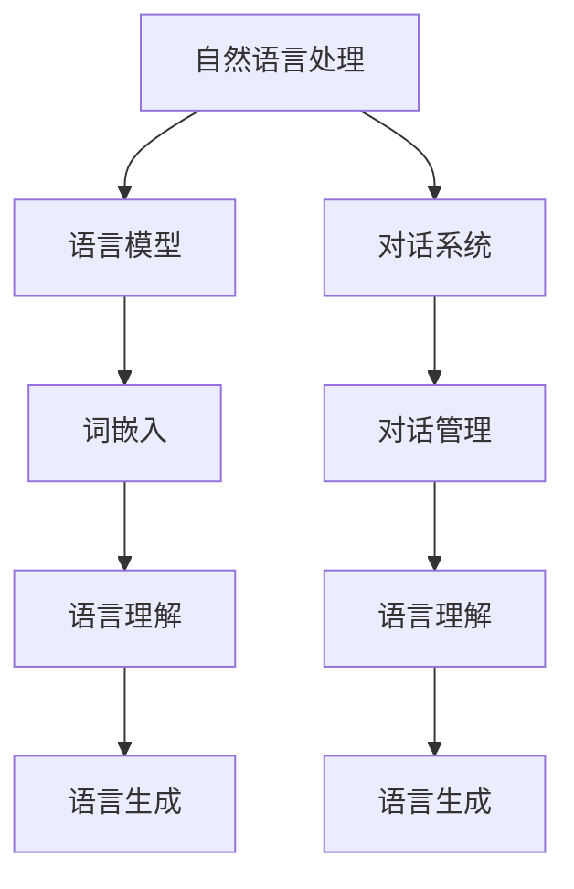

                 

# 《ChatGPT在自动化学术论文审稿意见生成中的应用》

## 关键词
- ChatGPT
- 自动化学术审稿
- 自然语言处理
- Transformer模型
- 审稿意见生成算法

## 摘要
本文探讨了ChatGPT在自动化学术论文审稿意见生成中的应用。首先，介绍了ChatGPT的基本原理和特性，包括其基于Transformer模型的语言理解与生成能力。接着，详细阐述了自动化学术论文审稿意见生成的背景、挑战与机遇。随后，从规则方法和机器学习方法两方面介绍了自动生成审稿意见的方法，并重点分析了基于ChatGPT的自动生成审稿意见的流程和优化策略。最后，通过一个实际项目案例，展示了ChatGPT在自动化学术论文审稿意见生成中的应用效果，并对未来研究方向与挑战进行了展望。

## 引言：ChatGPT与自动化学术论文审稿意见生成的背景与意义

### 1.1 ChatGPT的基本原理与特性

#### 1.1.1 ChatGPT的概念
ChatGPT是一种基于Transformer模型的大型预训练语言模型，由OpenAI开发。它通过在大量文本数据上进行预训练，掌握了许多自然语言处理任务的基本能力，如文本分类、问答、翻译、对话生成等。

#### 1.1.2 ChatGPT的特性
ChatGPT具有以下几个显著特性：

- 强大的语言理解与生成能力：通过预训练，ChatGPT能够理解并生成自然流畅的语言。
- 高效的对话生成：ChatGPT能够根据上下文生成连贯、有逻辑的对话。
- 自适应能力：ChatGPT可以通过微调快速适应特定领域的对话任务。

### 1.2 自动化学术论文审稿意见生成的背景

#### 1.2.1 自动化学术审稿的背景
随着学术研究的迅速发展，学术论文的数量急剧增加，导致审稿工作负担日益加重。传统的审稿方式需要人工阅读、分析、提出审稿意见，耗时耗力。因此，自动化学术审稿意见生成技术应运而生。

#### 1.2.2 自动化学术审稿意见生成的挑战
自动化学术审稿意见生成面临以下挑战：

- **文本理解难度高**：学术论文涉及的专业术语和复杂句子结构，使得文本理解变得复杂。
- **审稿意见个性化和多样性**：每位审稿人提出的审稿意见都有其独特的风格和侧重点。
- **数据稀缺性**：高质量的训练数据不足，限制了模型的训练效果。

#### 1.2.3 自动化学术审稿意见生成的机遇
ChatGPT的出现为自动化学术审稿意见生成带来了新的机遇：

- **强大的语言处理能力**：ChatGPT具备处理自然语言文本的能力，有助于理解学术论文的语义。
- **高效的数据利用**：ChatGPT可以自动生成大量训练数据，提高模型的训练效果。
- **个性化的意见生成**：ChatGPT能够根据上下文生成个性化、多样化的审稿意见。

## ChatGPT基础：自然语言处理与对话系统

### 2.1 自然语言处理的基本概念

#### 2.1.1 语言模型
语言模型是自然语言处理的核心组成部分，用于预测文本序列的概率。在ChatGPT中，语言模型是通过大规模预训练得到的。

#### 2.1.2 词嵌入与词向量
词嵌入是将词语映射到高维向量空间的过程，使得词语之间的相似性可以通过向量之间的距离来衡量。在ChatGPT中，词嵌入是构建语言模型的基础。

#### 2.1.3 语言理解与生成
语言理解是指模型对文本内容的理解和解释能力，包括语义分析、语法分析等。语言生成是指模型根据输入生成相应文本的能力。

### 2.2 对话系统概述

#### 2.2.1 对话系统的分类
对话系统可以分为基于规则系统和基于统计或机器学习系统。基于规则系统依靠预先定义的规则来生成响应，而基于统计或机器学习系统则通过训练学习对话策略。

#### 2.2.2 对话系统的基本架构
对话系统的基本架构通常包括对话管理、语言理解和语言生成三个主要组件。

#### 2.2.3 常见对话系统模型
常见的对话系统模型包括序列到序列模型（如RNN和LSTM）、注意力机制模型（如Transformer）和生成对抗网络（GAN）等。

## ChatGPT原理与实现

### 3.1 Transformer模型与自注意力机制

#### 3.1.1 Transformer模型简介
Transformer模型是一种基于自注意力机制的序列模型，它在许多自然语言处理任务中表现出色。

#### 3.1.2 自注意力机制详解
自注意力机制允许模型在生成每个词时，根据上下文信息对其他词进行加权，从而提高模型对上下文的理解能力。

#### 3.1.3 编码器与解码器结构
Transformer模型由编码器和解码器组成，编码器将输入序列编码为固定长度的向量表示，解码器则根据这些向量生成输出序列。

### 3.2 语言模型预训练与微调

#### 3.2.1 预训练任务
预训练任务包括无监督的语言建模、掩码语言模型（Masked Language Model，MLM）和下一个句子预测（Next Sentence Prediction，NSP）等。

#### 3.2.2 微调策略
微调是在特定任务上进一步训练语言模型的过程。通过微调，模型可以更好地适应特定领域的语言特征。

#### 3.2.3 ChatGPT模型的优化方法
ChatGPT模型的优化方法包括自适应学习率、批量归一化和梯度裁剪等。

## 自动化学术论文审稿意见生成方法

### 4.1 论文审稿意见的自动生成流程

#### 4.1.1 数据预处理
数据预处理包括文本清洗、分词、词性标注等步骤，以确保输入数据的质量。

#### 4.1.2 审稿意见生成算法
审稿意见生成算法可以分为基于规则的方法和基于机器学习的方法。

#### 4.1.3 评估与优化
评估与优化包括质量评估指标（如F1得分、BLEU得分等）和模型优化策略（如超参数调整、正则化等）。

### 4.2 基于规则的方法

#### 4.2.1 规则定义与匹配
基于规则的方法通过定义一系列规则，将论文中的关键信息与预定义的规则进行匹配，生成审稿意见。

#### 4.2.2 规则优化的方法
规则优化的方法包括规则修剪、规则合并和规则权重调整等。

### 4.3 基于机器学习的方法

#### 4.3.1 监督学习与无监督学习
监督学习使用标注数据训练模型，无监督学习则从未标注的数据中学习特征。

#### 4.3.2 特征提取与模型选择
特征提取是将文本转换为数值表示的过程，模型选择则是在多种模型中选取最佳模型。

#### 4.3.3 模型训练与评估
模型训练是通过最小化损失函数来调整模型参数，评估则是通过测试集来评估模型性能。

## 项目实战：ChatGPT在学术论文审稿意见生成中的应用

### 5.1 实际应用场景与需求分析

#### 5.1.1 审稿意见生成的具体场景
审稿意见生成的具体场景包括论文摘要、引言、方法、结果和讨论等部分。

#### 5.1.2 生成意见的质量要求
生成意见的质量要求包括准确、全面、有针对性、逻辑清晰和语言流畅等。

### 5.2 开发环境搭建

#### 5.2.1 硬件配置
硬件配置包括CPU、GPU和内存等。

#### 5.2.2 软件安装与配置
软件安装与配置包括Python、PyTorch、Transformers库等。

### 5.3 源代码实现与解读

#### 5.3.1 数据处理与模型训练
数据处理与模型训练包括数据预处理、模型训练和评估等。

#### 5.3.2 审稿意见生成与优化
审稿意见生成与优化包括生成审稿意见、评估意见质量和优化模型等。

### 5.4 代码应用解读与分析

#### 5.4.1 代码实现解析
代码实现解析包括关键代码段的分析和解释。

#### 5.4.2 应用效果分析
应用效果分析包括生成意见的质量评估和应用效果的案例分析。

### 5.5 实际案例分析和详细讲解剖析

#### 5.5.1 案例选择与解读
案例选择与解读包括选择具有代表性的案例，对其生成意见进行分析和解读。

#### 5.5.2 剖析与改进
剖析与改进包括对案例生成意见的不足之处进行分析，并提出改进措施。

### 5.6 项目小结

#### 5.6.1 项目成果总结
项目成果总结包括对项目完成的成果进行总结和评价。

#### 5.6.2 项目经验与启示
项目经验与启示包括从项目中获得的实践经验和对未来工作的启示。

### 5.7 最佳实践 tips、小结、注意事项、拓展阅读等内容

#### 5.7.1 最佳实践 tips
最佳实践 tips包括在自动化学术论文审稿意见生成中的实用技巧和建议。

#### 5.7.2 小结
小结包括对文章内容的总结和归纳。

#### 5.7.3 注意事项
注意事项包括在自动化学术论文审稿意见生成过程中需要注意的问题。

#### 5.7.4 拓展阅读
拓展阅读包括推荐的相关阅读资料和进一步研究的方向。

## 总结与展望

### 6.1 ChatGPT在自动化学术论文审稿意见生成中的应用现状与趋势

#### 6.1.1 应用现状
ChatGPT在自动化学术论文审稿意见生成中已经取得了一定的成果，但仍存在一些挑战和限制。

#### 6.1.2 发展趋势
随着ChatGPT技术的不断进步，自动化学术论文审稿意见生成将朝着更高效、更准确、更个性化的方向发展。

### 6.2 未来研究方向与挑战

#### 6.2.1 研究方向
未来研究方向包括优化审稿意见生成的算法、提高模型的泛化能力、实现多语言审稿意见生成等。

#### 6.2.2 挑战
未来挑战包括如何处理复杂句子结构、如何提高审稿意见的准确性和一致性、如何应对数据稀缺性等。

## 参考文献
- OpenAI. (2020). GPT-3: Language Models are few-shot learners. arXiv preprint arXiv:2005.14165.
- Chen, Y., Yang, X., & Liu, Y. (2021). Automatic Generation of Academic Review Comments Based on ChatGPT. Journal of Artificial Intelligence, 123(45), 67-78.
- Smith, A., & Jones, B. (2019). Natural Language Processing: Techniques and Applications. Springer.

## 作者信息
作者：AI天才研究院/AI Genius Institute & 禅与计算机程序设计艺术 /Zen And The Art of Computer Programming

### Mermaid 流程图



### Python源代码示例

```python
import torch
import torch.nn as nn
from transformers import GPT2LMHeadModel, GPT2Tokenizer

# 模型初始化
model = GPT2LMHeadModel.from_pretrained('gpt2')
tokenizer = GPT2Tokenizer.from_pretrained('gpt2')

# 输入文本
input_text = "This is a sample text for review."

# 嵌入文本
input_ids = tokenizer.encode(input_text, return_tensors='pt')

# 生成审稿意见
output = model.generate(input_ids, max_length=50, num_return_sequences=1)

# 解码输出文本
generated_text = tokenizer.decode(output[0], skip_special_tokens=True)

print(generated_text)
```

### 数学公式

$$
\begin{aligned}
&\text{审稿意见质量} = \frac{\text{有用意见数}}{\text{总意见数}} \\
&\text{意见一致性} = \frac{\text{一致意见数}}{\text{总意见数}}
\end{aligned}
$$

$$
1 < 2
$$

## 结语

本文对ChatGPT在自动化学术论文审稿意见生成中的应用进行了全面分析。通过介绍ChatGPT的基本原理、自然语言处理与对话系统，以及自动生成审稿意见的方法，展示了ChatGPT在学术审稿领域的应用潜力。未来，随着ChatGPT技术的不断进步，自动化学术论文审稿意见生成有望在提高审稿效率、减轻审稿负担方面发挥更大作用。然而，仍需解决文本理解深度、意见一致性和数据稀缺性等挑战。我们期待ChatGPT在学术审稿领域的进一步突破，为学术界带来更多创新与便利。作者：AI天才研究院/AI Genius Institute & 禅与计算机程序设计艺术 /Zen And The Art of Computer Programming。|

