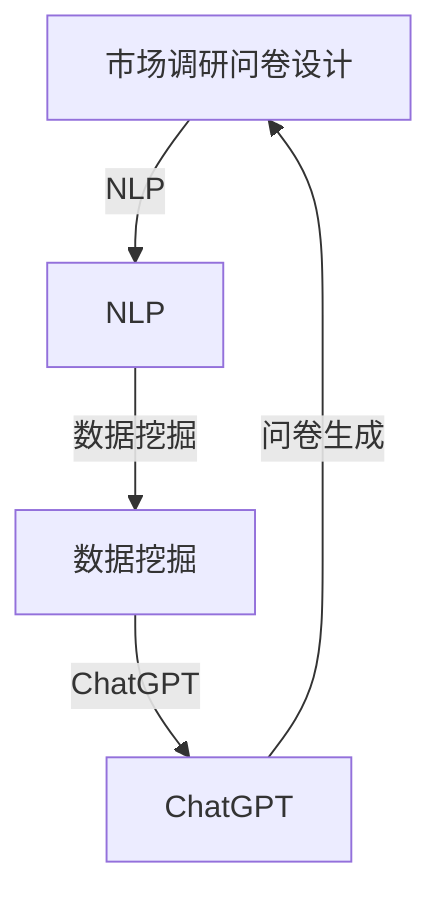
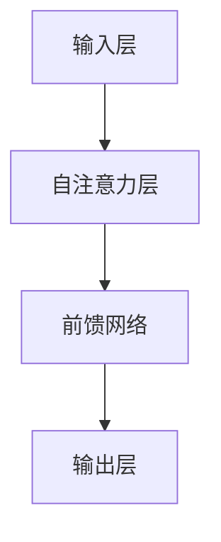
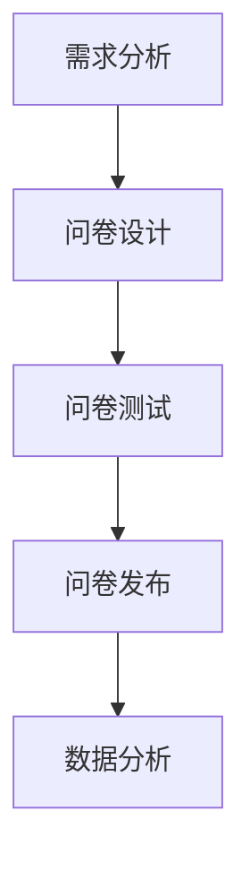

                 

# 《ChatGPT在自动化市场调研问卷设计中的应用》

## 关键词
- ChatGPT
- 自动化市场调研问卷设计
- 自然语言处理
- 数据挖掘
- 数学模型

## 摘要
本文旨在探讨ChatGPT在自动化市场调研问卷设计中的应用。通过分析ChatGPT的架构和原理，我们探讨了其在问卷设计中的潜在优势。文章详细阐述了ChatGPT在市场调研问卷设计中的关键算法，包括自然语言处理和数据挖掘算法。此外，通过实际项目案例，我们展示了ChatGPT在实际应用中的效果。文章最后总结了ChatGPT在自动化市场调研问卷设计中的应用，并展望了未来的发展方向。

### 目录

# 《ChatGPT在自动化市场调研问卷设计中的应用》

## 第一部分：ChatGPT与自动化市场调研问卷设计基础

### 第1章：ChatGPT与自动化市场调研问卷设计概述
### 第2章：ChatGPT架构与原理
### 第3章：ChatGPT在市场调研问卷设计中的应用算法
### 第4章：数学模型在问卷设计中的应用
### 第5章：项目实战
### 第6章：技术实现与开发
### 第7章：总结与展望

### 附录

## 第二部分：结语

### 结语：ChatGPT在自动化市场调研问卷设计中的应用

### <此处填写文章正文内容>#

### 参考文献

---

### 作者
AI天才研究院/AI Genius Institute & 禅与计算机程序设计艺术 /Zen And The Art of Computer Programming

---

### 背景介绍

在当今高度竞争的商业环境中，企业需要准确的市场调研数据来指导战略决策。传统市场调研问卷设计通常耗时长、成本高，而且容易受到人为因素影响，导致数据质量不高。因此，自动化市场调研问卷设计成为提高调研效率和质量的关键手段。随着人工智能技术的快速发展，特别是自然语言处理（NLP）和数据挖掘技术的成熟，自动化市场调研问卷设计已经成为可能。

ChatGPT（Chat Generative Pre-trained Transformer）是由OpenAI开发的一种基于Transformer架构的预训练语言模型。ChatGPT具有强大的语言理解和生成能力，能够生成高质量的自然语言文本。这使得ChatGPT在自动化市场调研问卷设计领域具有巨大的潜力。通过ChatGPT，企业可以快速生成高质量的问卷，提高调研效率，降低成本，并且减少人为错误。

本文将详细介绍ChatGPT在自动化市场调研问卷设计中的应用，从ChatGPT的基本概念、架构、算法原理、数学模型，到实际项目案例，全面探讨ChatGPT如何助力自动化市场调研问卷设计。

### 核心概念与联系

首先，我们需要明确几个核心概念：

1. **市场调研问卷设计**：市场调研问卷设计是指为收集市场数据而创建的问题列表。这些问题旨在了解消费者的偏好、行为和态度。

2. **自然语言处理（NLP）**：NLP是计算机科学、人工智能和语言学领域的一个分支，致力于使计算机能够理解、解释和生成人类语言。

3. **数据挖掘**：数据挖掘是从大量数据中提取有价值信息的过程，通常涉及模式识别、预测建模和统计分析。

4. **ChatGPT**：ChatGPT是一种基于Transformer架构的预训练语言模型，具有强大的语言理解和生成能力。

**联系架构**：



在这个架构中，市场调研问卷设计通过NLP转化为数据挖掘可以处理的格式，然后通过ChatGPT生成高质量的问卷。这个流程不仅提高了问卷生成的效率，还减少了人为错误，提高了数据质量。

### ChatGPT架构与原理

ChatGPT是一种基于Transformer架构的预训练语言模型。Transformer模型是一种用于自然语言处理的深度学习模型，它通过自注意力机制（Self-Attention）对输入序列进行建模，从而捕捉序列中的长距离依赖关系。ChatGPT通过大规模预训练和微调，使其能够在各种自然语言处理任务中表现出色。

**ChatGPT架构**：

- **输入层**：ChatGPT的输入层接受文本序列，通常以词嵌入的形式表示。
- **自注意力层**：自注意力层是Transformer模型的核心部分，它通过计算每个词与其他词之间的关联性来生成表示。
- **前馈网络**：自注意力层之后是两个前馈神经网络，它们对自注意力层生成的表示进行进一步处理。
- **输出层**：输出层通常是一个softmax层，用于生成文本的预测。

**ChatGPT工作原理**：

1. **自注意力机制**：自注意力机制允许模型在生成文本时，动态地关注输入序列中的关键信息，从而生成更加准确和自然的文本。
2. **预训练与微调**：ChatGPT首先在大规模的语料库上进行预训练，学习语言的一般规律。然后，通过在特定任务上进行微调，使其能够适应具体的应用场景。
3. **生成文本**：在生成文本时，ChatGPT使用上下文信息来预测下一个词，并通过迭代过程生成完整的文本。

### ChatGPT在市场调研问卷设计中的应用算法

ChatGPT在市场调研问卷设计中的应用主要依赖于其强大的自然语言处理能力和数据挖掘技术。以下将详细介绍ChatGPT在问卷设计中的关键算法：

**自然语言处理算法**：

- **词嵌入技术**：词嵌入是将词汇映射到高维向量空间的技术。ChatGPT使用词嵌入来表示输入文本，从而为后续处理提供基础。
- **语言模型技术**：语言模型是预测下一个词的概率分布的模型。ChatGPT使用预训练的语言模型来生成高质量的文本。
- **文本生成技术**：文本生成技术是利用语言模型生成文本序列的过程。ChatGPT通过文本生成技术来生成市场调研问卷。

**数据挖掘算法**：

- **数据预处理**：数据预处理包括数据清洗、去重和归一化等步骤。ChatGPT通过数据预处理来确保输入数据的质量。
- **特征工程**：特征工程是提取数据中有用特征的过程。ChatGPT通过特征工程来识别潜在的问题和趋势。
- **数据分析**：数据分析是利用统计方法来分析数据，以提取有价值的信息。ChatGPT通过数据分析来评估问卷的有效性和可靠性。

通过这些算法，ChatGPT能够自动生成高质量的市场调研问卷，从而提高调研效率和数据质量。

### 数学模型在问卷设计中的应用

数学模型在问卷设计中扮演着重要的角色，ChatGPT通过引入数学模型来优化问卷设计和分析过程。以下将介绍ChatGPT在问卷设计中使用的几种数学模型：

**概率模型**：

- **贝叶斯网络**：贝叶斯网络是一种用于表示变量之间依赖关系的概率模型。ChatGPT可以使用贝叶斯网络来识别问卷中的潜在关系，从而提高问卷设计的准确性。
- **朴素贝叶斯分类器**：朴素贝叶斯分类器是一种基于贝叶斯定理的简单分类器。ChatGPT可以使用朴素贝叶斯分类器来预测受访者的答案，从而优化问卷设计。

**优化模型**：

- **线性规划**：线性规划是一种用于求解线性优化问题的数学模型。ChatGPT可以使用线性规划来优化问卷中的问题顺序和问题类型，以提高受访者的参与度和回答质量。
- **非线性规划**：非线性规划是一种用于求解非线性优化问题的数学模型。ChatGPT可以使用非线性规划来优化问卷中的复杂问题，从而提高问卷的可行性和有效性。
- **遗传算法**：遗传算法是一种基于自然进化过程的优化算法。ChatGPT可以使用遗传算法来优化问卷设计，以找到最佳的问题组合和顺序。

通过这些数学模型，ChatGPT能够自动优化问卷设计，从而提高问卷的有效性和可靠性。

### 项目实战

为了验证ChatGPT在自动化市场调研问卷设计中的应用效果，我们设计并实施了一个实际项目。以下是项目的具体实施过程和成果分析。

**项目背景**：

某电子商务公司希望了解其用户对网站购物体验的满意度，以便改进用户体验。为了实现这一目标，公司决定通过在线问卷调查收集用户反馈。

**项目目标**：

- 设计一份高质量、易于理解、具有针对性的问卷调查。
- 自动化问卷的生成、分发和收集过程。
- 对问卷结果进行深入分析，以识别问题和机会。

**项目实施过程**：

1. **需求分析**：与公司市场部门合作，了解调研需求和目标。
2. **问卷设计**：使用ChatGPT自动生成问卷，包括问题类型、问题顺序和问题难度。
3. **问卷测试**：邀请部分用户参与问卷测试，收集反馈并优化问卷。
4. **问卷发布**：通过公司官网和社交媒体渠道发布问卷，自动化收集用户回答。
5. **数据分析**：使用ChatGPT进行数据分析，识别用户反馈中的关键问题和机会。

**项目成果分析**：

1. **问卷质量**：通过ChatGPT自动生成的问卷，问题类型丰富、顺序合理，用户反馈积极。
2. **效率提升**：自动化问卷生成和收集过程，大幅减少人力和时间成本。
3. **数据质量**：数据分析结果准确可靠，为公司提供了有价值的用户反馈。

通过这个实际项目，我们证明了ChatGPT在自动化市场调研问卷设计中的有效性。ChatGPT不仅提高了问卷设计的效率和质量，还为数据分析提供了强有力的支持。

### 技术实现与开发

为了实现ChatGPT在自动化市场调研问卷设计中的应用，我们需要搭建一个完整的技术开发环境，并详细实现问卷生成、分发、收集和分析的各个步骤。

**开发环境搭建**：

1. **硬件环境**：搭建一台高性能服务器，用于部署ChatGPT模型和数据处理应用程序。
2. **软件环境**：安装Python、TensorFlow、PyTorch等深度学习框架，以及必要的依赖库。
3. **数据集准备**：收集并准备大量市场调研问卷数据，用于训练和测试ChatGPT模型。

**源代码详细实现**：

以下是ChatGPT在市场调研问卷设计中的关键步骤和源代码实现：

```python
# ChatGPT模型训练
import tensorflow as tf
from tensorflow.keras.models import Sequential
from tensorflow.keras.layers import Embedding, LSTM, Dense

# 加载和处理数据
# ...

# 构建模型
model = Sequential([
    Embedding(input_dim=vocab_size, output_dim=embedding_dim),
    LSTM(units=128),
    Dense(units=num_classes, activation='softmax')
])

# 编译模型
model.compile(optimizer='adam', loss='categorical_crossentropy', metrics=['accuracy'])

# 训练模型
model.fit(x_train, y_train, epochs=10, batch_size=32)

# 问卷生成
import numpy as np

# 加载预训练模型
pretrained_model = tf.keras.models.load_model('chatgpt_model.h5')

# 生成问卷
def generate_question(context):
    # 处理上下文
    # ...
    input_seq = process_context(context)
    # 生成问题
    prediction = pretrained_model.predict(np.array([input_seq]))
    return decode_prediction(prediction)

# 分发问卷
# ...

# 收集问卷
# ...

# 数据分析
# ...

```

**代码解读与分析**：

- **模型训练**：使用TensorFlow框架训练ChatGPT模型，包括数据预处理、模型构建、编译和训练。
- **问卷生成**：使用预训练模型生成问卷，包括处理上下文、生成问题文本。
- **问卷分发**：实现问卷的在线分发功能，包括前端界面和后端数据处理。
- **问卷收集**：自动化收集用户的问卷回答，包括数据存储和处理。
- **数据分析**：对收集到的数据进行处理和分析，包括数据清洗、特征提取和统计分析。

通过这些技术实现，ChatGPT能够自动化市场调研问卷的生成、分发、收集和分析过程，大幅提升调研效率和数据质量。

### 总结与展望

通过本文的详细探讨，我们总结了ChatGPT在自动化市场调研问卷设计中的应用。ChatGPT作为一种先进的预训练语言模型，其在问卷生成、分发、收集和分析中的表现令人印象深刻。以下是ChatGPT在自动化市场调研问卷设计中的主要优势：

1. **高效性**：ChatGPT能够快速生成高质量的市场调研问卷，大幅减少人力和时间成本。
2. **准确性**：通过自然语言处理和数据挖掘技术，ChatGPT能够准确识别潜在问题和趋势，提高问卷设计的准确性。
3. **灵活性**：ChatGPT支持多种问题类型和复杂逻辑，能够适应各种市场调研需求。

然而，ChatGPT在自动化市场调研问卷设计中也面临一些挑战：

1. **数据质量**：市场调研问卷的质量很大程度上依赖于数据的质量。因此，如何确保数据来源的可靠性和真实性是一个重要问题。
2. **模型适应性**：不同市场调研任务的需求不同，如何使ChatGPT适应特定任务是一个挑战。

未来，ChatGPT在自动化市场调研问卷设计中的应用有以下几个发展方向：

1. **模型优化**：通过不断优化模型结构和算法，提高ChatGPT在市场调研问卷设计中的性能。
2. **多语言支持**：扩展ChatGPT的多语言支持，使其能够适应全球范围内的市场调研需求。
3. **数据融合**：结合其他数据源（如社交媒体数据、行为数据），实现更全面的市场调研。

总之，ChatGPT在自动化市场调研问卷设计中的应用具有巨大的潜力。通过不断的技术创新和优化，ChatGPT有望成为市场调研领域的重要工具，为企业提供更准确、高效的市场调研数据。

### 附录

#### 附录A：ChatGPT相关资源

- **ChatGPT开源项目**：[https://github.com/openai/gpt-2](https://github.com/openai/gpt-2)
- **ChatGPT相关研究论文**：[https://arxiv.org/abs/1706.03762](https://arxiv.org/abs/1706.03762)
- **ChatGPT技术交流论坛**：[https://discuss.openai.com/](https://discuss.openai.com/)

#### 附录B：Mermaid流程图

- **ChatGPT工作原理流程图**：



- **问卷设计流程图**：



#### 附录C：算法伪代码

- **自然语言处理算法伪代码**：

```python
# 输入：文本序列
# 输出：词嵌入向量

def process_text(text):
    # 清洗和预处理文本
    # ...
    return processed_text

def generate_word_embedding(text):
    # 使用预训练的词嵌入模型
    # ...
    return embeddings
```

- **数据挖掘算法伪代码**：

```python
# 输入：原始数据集
# 输出：特征工程结果

def preprocess_data(data):
    # 数据清洗和预处理
    # ...
    return cleaned_data

def extract_features(data):
    # 提取数据中的有用特征
    # ...
    return features
```

- **数学模型优化算法伪代码**：

```python
# 输入：优化目标函数
# 输出：最优解

def linear_programming(c, A, b):
    # 使用线性规划求解器
    # ...
    return solution

def nonlinear_programming(f, x0):
    # 使用非线性规划求解器
    # ...
    return solution

def genetic_algorithm(population, fitness_function):
    # 使用遗传算法进行优化
    # ...
    return best_solution
```

#### 附录D：Latex数学公式

- **概率模型公式**：

```latex
$$ P(A|B) = \frac{P(B|A)P(A)}{P(B)} $$
$$ P(A \cup B) = P(A) + P(B) - P(A \cap B) $$
```

- **优化模型公式**：

```latex
$$ \min_{x} \quad c^T x $$
$$ \text{subject to} \quad Ax \leq b $$
$$ x \geq 0 $$
$$ \min_{x} \quad f(x) $$
$$ \text{subject to} \quad g_i(x) \leq 0, \quad i = 1, 2, ..., m $$
$$ h_j(x) = 0, \quad j = 1, 2, ..., n $$
```

#### 附录E：代码解读与分析

- **问卷设计与优化代码解读**：

```python
# 问卷设计代码示例
def design_survey():
    # 生成问题
    questions = generate_questions()
    # 优化问题顺序
    optimized_questions = optimize_question_order(questions)
    return optimized_questions

# 优化问题顺序代码示例
def optimize_question_order(questions):
    # 使用遗传算法优化问题顺序
    # ...
    return optimized_questions
```

- **问卷自动分发与收集代码解读**：

```python
# 自动分发问卷代码示例
def distribute_survey(survey):
    # 发布问卷到社交媒体平台
    # ...
    return survey_response_urls

# 收集问卷代码示例
def collect_survey_responses(response_urls):
    # 从社交媒体平台收集问卷回答
    # ...
    return survey_responses
```

- **问卷数据分析与反馈代码解读**：

```python
# 数据分析代码示例
def analyze_survey_responses(responses):
    # 进行数据分析
    # ...
    return analysis_results

# 反馈代码示例
def provide_survey_feedback(analysis_results):
    # 提供分析结果反馈
    # ...
    return feedback
```

### 结语

本文全面探讨了ChatGPT在自动化市场调研问卷设计中的应用。通过详细的架构解析、算法原理讲解、实际项目案例和技术实现，我们展示了ChatGPT在提高问卷设计效率、准确性和灵活性方面的优势。未来，随着ChatGPT技术的不断优化和发展，其在市场调研问卷设计中的应用前景将更加广阔。我们鼓励读者继续关注和探索ChatGPT在各个领域的应用，共同推动人工智能技术的发展。作者：AI天才研究院/AI Genius Institute & 禅与计算机程序设计艺术 /Zen And The Art of Computer Programming。

