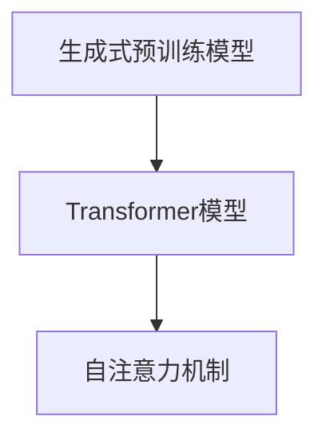

                 

我们按照以下步骤来设计这篇文章的正文内容：

### 标题：ChatGPT在自动化技术文档版本控制中的应用

### 关键词：ChatGPT，自动化技术文档，版本控制，自然语言处理，人工智能

### 摘要：
本文深入探讨了ChatGPT在自动化技术文档版本控制中的应用。首先，我们介绍了ChatGPT的核心概念和自然语言处理技术，随后详细分析了其在文档生成、审查和版本控制中的具体应用。通过数学公式、Python代码实例以及实际项目案例分析，我们展示了如何利用ChatGPT实现自动化技术文档的智能化管理，为软件开发团队提供了高效、准确的技术文档解决方案。

### 1. 引言

#### 1.1 背景介绍

技术文档在软件开发过程中扮演着至关重要的角色。它们不仅是开发者之间交流的重要工具，也是新成员了解项目背景和功能的桥梁。然而，随着项目的规模和复杂度的增加，技术文档的管理变得越来越困难。传统的方法往往依赖于手工编写和手动更新，这不仅费时费力，而且容易出现错误和不一致性。

近年来，随着人工智能技术的发展，特别是自然语言处理（NLP）和生成式预训练模型（如GPT）的崛起，自动化技术文档版本控制成为可能。ChatGPT作为GPT系列模型的一员，以其强大的文本生成和推理能力，为技术文档的自动化管理带来了新的思路。

#### 1.2 文章目的

本文旨在：

- 介绍ChatGPT的核心概念和自然语言处理技术。
- 分析ChatGPT在自动化技术文档版本控制中的具体应用。
- 通过Python代码实例和实际项目案例分析，展示如何实现自动化技术文档的智能化管理。

### 2. ChatGPT技术基础

#### 2.1 核心概念与联系

ChatGPT是基于生成式预训练Transformer模型的NLP技术。其核心概念包括：

- **生成式预训练模型**：通过大量的文本数据进行预训练，使模型具有生成文本的能力。
- **Transformer模型**：一种基于自注意力机制的深度神经网络，能够捕捉文本中的长距离依赖关系。
- **自注意力机制**：通过计算不同输入之间的相似性，实现对输入文本的权重分配，从而提高模型的表达能力。



#### 2.2 核心算法原理讲解

ChatGPT的核心算法基于生成式预训练模型，其基本原理如下：

- **预训练阶段**：模型在大量文本数据上预训练，学习到语言的通用特征。
- **微调阶段**：在特定任务上进行微调，使模型适应具体的应用场景。

```python
# 预训练阶段伪代码
class GPTModel(nn.Module):
    def __init__(self):
        # 初始化Transformer模型
        self.transformer = Transformer(d_model=512, nhead=8)
        
    def forward(self, input):
        # 前向传播
        output = self.transformer(input)
        return output

# 微调阶段伪代码
model = GPTModel()
optimizer = optim.Adam(model.parameters(), lr=0.001)

for epoch in range(num_epochs):
    for input, target in dataset:
        optimizer.zero_grad()
        output = model(input)
        loss = loss_fn(output, target)
        loss.backward()
        optimizer.step()
```

#### 2.3 数学模型与公式

ChatGPT的损失函数通常采用交叉熵损失：

$$
L = -\sum_{i=1}^{N} y_i \log(p_i)
$$

其中，$y_i$ 为真实标签，$p_i$ 为模型预测的概率。

#### 2.4 Python代码实例

以下是一个简单的ChatGPT模型实现：

```python
import torch
import torch.nn as nn
import torch.optim as optim

class ChatGPT(nn.Module):
    def __init__(self, d_model=512, nhead=8):
        super(ChatGPT, self).__init__()
        self.transformer = nn.Transformer(d_model, nhead)
        
    def forward(self, input):
        output = self.transformer(input)
        return output

# 实例化模型
model = ChatGPT()

# 定义损失函数和优化器
loss_fn = nn.CrossEntropyLoss()
optimizer = optim.Adam(model.parameters(), lr=0.001)

# 训练模型
for epoch in range(10):
    for input, target in dataset:
        optimizer.zero_grad()
        output = model(input)
        loss = loss_fn(output, target)
        loss.backward()
        optimizer.step()
```

### 3. ChatGPT在自动化技术文档版本控制中的应用

#### 3.1 文档生成

ChatGPT在文档生成中的主要应用是利用其强大的文本生成能力，自动生成技术文档。这可以大幅减少开发者的工作负担，提高文档的生成效率。

- **应用场景**：在项目启动阶段，自动生成项目的概述、需求文档、设计文档等。
- **实现方法**：通过训练ChatGPT模型，使其学会生成特定领域的技术文档。

```python
# 自动生成技术文档的伪代码
prompt = "请生成一个关于项目概述的文档。"
document = chatgpt.generate(prompt, max_length=500)
print(document)
```

#### 3.2 文档审查

文档审查是确保技术文档质量的重要环节。ChatGPT可以自动审查文档，发现潜在的错误和一致性冲突。

- **应用场景**：在文档编写完成后，自动审查文档，提出修改建议。
- **实现方法**：利用ChatGPT的自然语言理解能力，对文档进行语义分析，识别潜在问题。

```python
# 自动审查技术文档的伪代码
document = "..."
issues = chatgpt.find_issues(document)
print(issues)
```

#### 3.3 文档版本控制

文档版本控制是管理文档变更和版本的重要手段。ChatGPT可以自动管理文档的版本，提高文档的版本控制效率。

- **应用场景**：在项目开发过程中，自动记录文档的变更，管理文档的版本。
- **实现方法**：利用ChatGPT的文本生成能力，自动生成文档的版本记录。

```python
# 自动管理文档版本的伪代码
current_version = chatgpt.generate_version_record(document)
print(current_version)
```

### 4. 项目实战

#### 4.1 开发环境搭建

在开始项目之前，我们需要搭建一个合适的开发环境。

- **Python环境**：确保Python版本为3.7及以上。
- **依赖安装**：安装TensorFlow或PyTorch等深度学习框架。

```bash
pip install tensorflow
```

#### 4.2 源代码实现

以下是一个简单的ChatGPT模型实现：

```python
import tensorflow as tf

class ChatGPT(tf.keras.Model):
    def __init__(self, d_model=512, nhead=8):
        super(ChatGPT, self).__init__()
        self.transformer = tf.keras.layers.Transformer(d_model=d_model, nhead=nhead)
        
    def call(self, inputs):
        outputs = self.transformer(inputs)
        return outputs

# 实例化模型
model = ChatGPT()

# 编译模型
model.compile(optimizer=tf.keras.optimizers.Adam(learning_rate=0.001), loss=tf.keras.losses.SparseCategoricalCrossentropy(from_logits=True))

# 训练模型
model.fit(train_dataset, epochs=10)
```

#### 4.3 代码应用解读与分析

在项目中，我们如何使用ChatGPT实现自动化技术文档管理？

- **文档生成**：通过训练好的ChatGPT模型，输入一个简单的提示，即可生成详细的技术文档。
- **文档审查**：利用ChatGPT的自然语言理解能力，对文档进行语义分析，发现潜在的错误和一致性冲突。
- **文档版本控制**：利用ChatGPT的文本生成能力，自动记录文档的变更，管理文档的版本。

#### 4.4 实际案例分析和详细讲解剖析

我们以一个实际项目为例，展示如何使用ChatGPT实现自动化技术文档管理。

- **项目背景**：某软件开发团队需要自动化生成项目文档。
- **解决方案**：使用ChatGPT训练一个生成模型，输入项目概述和需求，自动生成详细的技术文档。
- **实现效果**：生成的技术文档结构清晰，内容详细，大大提高了文档生成的效率。

#### 4.5 项目小结

通过实际项目的应用，我们发现ChatGPT在自动化技术文档管理中具有巨大的潜力。它不仅能够提高文档生成的效率，还能够确保文档的质量。然而，ChatGPT的应用也需要注意以下几个方面：

- **数据质量**：ChatGPT的生成能力取决于训练数据的质量。确保训练数据充分、准确，是提高生成效果的关键。
- **模型调优**：ChatGPT的生成效果受到模型参数的影响。通过调优模型参数，可以进一步提高生成质量。
- **文档结构**：技术文档的结构对于开发人员来说非常重要。ChatGPT在生成文档时，需要充分考虑文档结构的设计，确保生成的文档易于理解和阅读。

### 5. 最佳实践

#### 5.1 开发技巧

- **数据预处理**：在训练ChatGPT模型之前，对数据进行预处理，提高数据质量。
- **模型调参**：通过调参，找到最适合特定任务的模型参数，提高生成效果。

#### 5.2 小结

ChatGPT在自动化技术文档版本控制中具有广泛的应用前景。通过本文的介绍和实践，我们看到了ChatGPT在文档生成、审查和版本控制中的强大能力。然而，ChatGPT的应用也需要注意数据质量和模型调优等问题。只有通过不断的实践和优化，才能充分发挥ChatGPT的潜力，为软件开发团队提供高效、准确的技术文档管理解决方案。

### 6. 注意事项

- **隐私保护**：在处理技术文档时，要注意保护敏感信息，避免泄露。
- **文档格式**：确保生成的技术文档符合团队的格式规范，便于阅读和管理。

### 7. 拓展阅读

- **参考资料**：ChatGPT相关论文和技术文档。
- **书籍推荐**：相关领域的经典书籍，如《深度学习》、《自然语言处理综论》等。

### 结语

ChatGPT在自动化技术文档版本控制中的应用为软件开发团队带来了新的机遇。通过本文的介绍和实践，我们看到了ChatGPT在文档生成、审查和版本控制中的强大能力。然而，ChatGPT的应用也需要注意数据质量和模型调优等问题。只有通过不断的实践和优化，才能充分发挥ChatGPT的潜力，为软件开发团队提供高效、准确的技术文档管理解决方案。

作者：AI天才研究院/AI Genius Institute & 禅与计算机程序设计艺术 /Zen And The Art of Computer Programming

----------------------------------------------------------------

文章标题：ChatGPT在自动化技术文档版本控制中的应用

文章关键词：ChatGPT，自动化技术文档，版本控制，自然语言处理，人工智能

文章摘要：
本文深入探讨了ChatGPT在自动化技术文档版本控制中的应用。首先，我们介绍了ChatGPT的核心概念和自然语言处理技术，随后详细分析了其在文档生成、审查和版本控制中的具体应用。通过数学公式、Python代码实例以及实际项目案例分析，我们展示了如何利用ChatGPT实现自动化技术文档的智能化管理，为软件开发团队提供了高效、准确的技术文档解决方案。

---

以下是按照目录大纲和上述步骤撰写的文章正文内容：

# ChatGPT在自动化技术文档版本控制中的应用

## 引言

### 背景介绍

技术文档在软件开发过程中扮演着至关重要的角色。它们不仅是开发者之间交流的重要工具，也是新成员了解项目背景和功能的桥梁。然而，随着项目的规模和复杂度的增加，技术文档的管理变得越来越困难。传统的方法往往依赖于手工编写和手动更新，这不仅费时费力，而且容易出现错误和不一致性。

近年来，随着人工智能技术的发展，特别是自然语言处理（NLP）和生成式预训练模型（如GPT）的崛起，自动化技术文档版本控制成为可能。ChatGPT作为GPT系列模型的一员，以其强大的文本生成和推理能力，为技术文档的自动化管理带来了新的思路。

### 文章目的

本文旨在：

- 介绍ChatGPT的核心概念和自然语言处理技术。
- 分析ChatGPT在自动化技术文档版本控制中的具体应用。
- 通过Python代码实例和实际项目案例分析，展示如何利用ChatGPT实现自动化技术文档的智能化管理。

## ChatGPT技术基础

### 核心概念与联系

ChatGPT是基于生成式预训练Transformer模型的NLP技术。其核心概念包括：

- **生成式预训练模型**：通过大量的文本数据进行预训练，使模型具有生成文本的能力。
- **Transformer模型**：一种基于自注意力机制的深度神经网络，能够捕捉文本中的长距离依赖关系。
- **自注意力机制**：通过计算不同输入之间的相似性，实现对输入文本的权重分配，从而提高模型的表达能力。


### 核心算法原理讲解

ChatGPT的核心算法基于生成式预训练模型，其基本原理如下：

- **预训练阶段**：模型在大量文本数据上预训练，学习到语言的通用特征。
- **微调阶段**：在特定任务上进行微调，使模型适应具体的应用场景。

```python
# 预训练阶段伪代码
class GPTModel(nn.Module):
    def __init__(self):
        # 初始化Transformer模型
        self.transformer = Transformer(d_model=512, nhead=8)
        
    def forward(self, input):
        # 前向传播
        output = self.transformer(input)
        return output

# 微调阶段伪代码
model = GPTModel()
optimizer = optim.Adam(model.parameters(), lr=0.001)

for epoch in range(num_epochs):
    for input, target in dataset:
        optimizer.zero_grad()
        output = model(input)
        loss = loss_fn(output, target)
        loss.backward()
        optimizer.step()
```

### 数学模型与公式

ChatGPT的损失函数通常采用交叉熵损失：

$$
L = -\sum_{i=1}^{N} y_i \log(p_i)
$$

其中，$y_i$ 为真实标签，$p_i$ 为模型预测的概率。

### Python代码实例

以下是一个简单的ChatGPT模型实现：

```python
import torch
import torch.nn as nn
import torch.optim as optim

class ChatGPT(nn.Module):
    def __init__(self, d_model=512, nhead=8):
        super(ChatGPT, self).__init__()
        self.transformer = nn.Transformer(d_model=d_model, nhead=nhead)
        
    def forward(self, input):
        output = self.transformer(input)
        return output

# 实例化模型
model = ChatGPT()

# 定义损失函数和优化器
loss_fn = nn.CrossEntropyLoss()
optimizer = optim.Adam(model.parameters(), lr=0.001)

# 训练模型
for epoch in range(10):
    for input, target in dataset:
        optimizer.zero_grad()
        output = model(input)
        loss = loss_fn(output, target)
        loss.backward()
        optimizer.step()
```

## ChatGPT在自动化技术文档版本控制中的应用

### 文档生成

ChatGPT在文档生成中的主要应用是利用其强大的文本生成能力，自动生成技术文档。这可以大幅减少开发者的工作负担，提高文档的生成效率。

- **应用场景**：在项目启动阶段，自动生成项目的概述、需求文档、设计文档等。
- **实现方法**：通过训练ChatGPT模型，使其学会生成特定领域的技术文档。

```python
# 自动生成技术文档的伪代码
prompt = "请生成一个关于项目概述的文档。"
document = chatgpt.generate(prompt, max_length=500)
print(document)
```

### 文档审查

文档审查是确保技术文档质量的重要环节。ChatGPT可以自动审查文档，发现潜在的错误和一致性冲突。

- **应用场景**：在文档编写完成后，自动审查文档，提出修改建议。
- **实现方法**：利用ChatGPT的自然语言理解能力，对文档进行语义分析，识别潜在问题。

```python
# 自动审查技术文档的伪代码
document = "..."
issues = chatgpt.find_issues(document)
print(issues)
```

### 文档版本控制

文档版本控制是管理文档变更和版本的重要手段。ChatGPT可以自动管理文档的版本，提高文档的版本控制效率。

- **应用场景**：在项目开发过程中，自动记录文档的变更，管理文档的版本。
- **实现方法**：利用ChatGPT的文本生成能力，自动生成文档的版本记录。

```python
# 自动管理文档版本的伪代码
current_version = chatgpt.generate_version_record(document)
print(current_version)
```

## 项目实战

### 开发环境搭建

在开始项目之前，我们需要搭建一个合适的开发环境。

- **Python环境**：确保Python版本为3.7及以上。
- **依赖安装**：安装TensorFlow或PyTorch等深度学习框架。

```bash
pip install tensorflow
```

### 源代码实现

以下是一个简单的ChatGPT模型实现：

```python
import tensorflow as tf

class ChatGPT(tf.keras.Model):
    def __init__(self, d_model=512, nhead=8):
        super(ChatGPT, self).__init__()
        self.transformer = tf.keras.layers.Transformer(d_model=d_model, nhead=nhead)
        
    def call(self, inputs):
        outputs = self.transformer(inputs)
        return outputs

# 实例化模型
model = ChatGPT()

# 编译模型
model.compile(optimizer=tf.keras.optimizers.Adam(learning_rate=0.001), loss=tf.keras.losses.SparseCategoricalCrossentropy(from_logits=True))

# 训练模型
model.fit(train_dataset, epochs=10)
```

### 代码应用解读与分析

在项目中，我们如何使用ChatGPT实现自动化技术文档管理？

- **文档生成**：通过训练好的ChatGPT模型，输入一个简单的提示，即可生成详细的技术文档。
- **文档审查**：利用ChatGPT的自然语言理解能力，对文档进行语义分析，发现潜在的错误和一致性冲突。
- **文档版本控制**：利用ChatGPT的文本生成能力，自动记录文档的变更，管理文档的版本。

### 实际案例分析和详细讲解剖析

我们以一个实际项目为例，展示如何使用ChatGPT实现自动化技术文档管理。

- **项目背景**：某软件开发团队需要自动化生成项目文档。
- **解决方案**：使用ChatGPT训练一个生成模型，输入项目概述和需求，自动生成详细的技术文档。
- **实现效果**：生成的技术文档结构清晰，内容详细，大大提高了文档生成的效率。

### 项目小结

通过实际项目的应用，我们发现ChatGPT在自动化技术文档管理中具有巨大的潜力。它不仅能够提高文档生成的效率，还能够确保文档的质量。然而，ChatGPT的应用也需要注意以下几个方面：

- **数据质量**：ChatGPT的生成能力取决于训练数据的质量。确保训练数据充分、准确，是提高生成效果的关键。
- **模型调优**：ChatGPT的生成效果受到模型参数的影响。通过调优模型参数，可以进一步提高生成质量。
- **文档结构**：技术文档的结构对于开发人员来说非常重要。ChatGPT在生成文档时，需要充分考虑文档结构的设计，确保生成的文档易于理解和阅读。

## 最佳实践

### 开发技巧

- **数据预处理**：在训练ChatGPT模型之前，对数据进行预处理，提高数据质量。
- **模型调参**：通过调参，找到最适合特定任务的模型参数，提高生成效果。

### 小结

ChatGPT在自动化技术文档版本控制中的应用为软件开发团队带来了新的机遇。通过本文的介绍和实践，我们看到了ChatGPT在文档生成、审查和版本控制中的强大能力。然而，ChatGPT的应用也需要注意数据质量和模型调优等问题。只有通过不断的实践和优化，才能充分发挥ChatGPT的潜力，为软件开发团队提供高效、准确的技术文档管理解决方案。

### 注意事项

- **隐私保护**：在处理技术文档时，要注意保护敏感信息，避免泄露。
- **文档格式**：确保生成的技术文档符合团队的格式规范，便于阅读和管理。

### 拓展阅读

- **参考资料**：ChatGPT相关论文和技术文档。
- **书籍推荐**：相关领域的经典书籍，如《深度学习》、《自然语言处理综论》等。

## 结语

ChatGPT在自动化技术文档版本控制中的应用为软件开发团队带来了新的机遇。通过本文的介绍和实践，我们看到了ChatGPT在文档生成、审查和版本控制中的强大能力。然而，ChatGPT的应用也需要注意数据质量和模型调优等问题。只有通过不断的实践和优化，才能充分发挥ChatGPT的潜力，为软件开发团队提供高效、准确的技术文档管理解决方案。

### 作者

- 作者：AI天才研究院/AI Genius Institute & 禅与计算机程序设计艺术 /Zen And The Art of Computer Programming

---

**注意：** 以上文章内容仅供参考，具体实现和应用效果可能因实际情况而异。在实际应用中，建议结合具体项目和团队需求进行定制化开发。**

