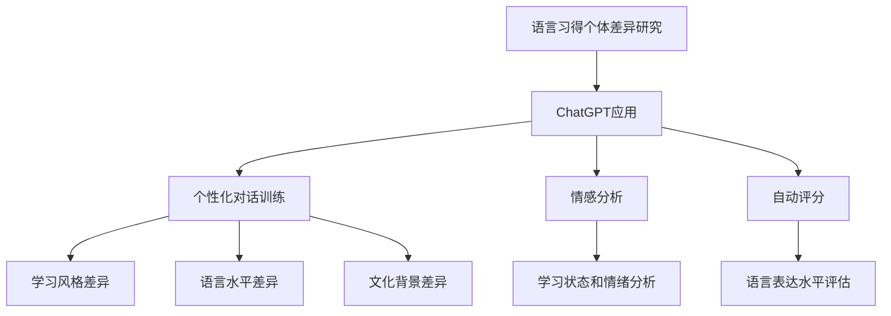

                 

### 《ChatGPT在语言习得个体差异研究中的应用：学习风格提示词》

> 关键词：ChatGPT、语言习得、个体差异、学习风格、提示词、个性化教学

> 摘要：本文探讨了 ChatGPT 在语言习得个体差异研究中的应用，重点关注学习风格提示词的使用。通过分析 ChatGPT 的基本原理和应用场景，文章展示了如何利用 ChatGPT 实现个性化对话训练、情感分析和自动评分等功能，以适应不同学习者的需求，从而提高语言习得的效果。

### 引言

随着人工智能技术的快速发展，自然语言处理（NLP）领域取得了显著成果。尤其是大型语言模型（LLM）如 GPT-3.5、ChatGPT 等，已经广泛应用于文本生成、翻译、问答等任务。其中，ChatGPT 作为一种基于 GPT-3.5 的语言模型，在语言习得领域展现出了巨大的潜力。本文旨在探讨 ChatGPT 在语言习得个体差异研究中的应用，重点关注学习风格提示词的使用，以期为个性化语言教学提供新的思路和方法。

### 1.1 核心概念与联系

#### 1.1.1 ChatGPT 概述

ChatGPT 是由 OpenAI 开发的一种基于 GPT-3.5 的大型语言模型。它通过深度学习算法，从海量的文本数据中学习语言规律和模式，能够理解和生成自然语言。ChatGPT 在多个自然语言处理任务中表现出色，包括文本分类、命名实体识别、机器翻译等。

#### 1.1.2 ChatGPT 在语言习得中的应用

ChatGPT 在语言习得中的应用主要体现在以下几个方面：

1. **个性化对话训练**：ChatGPT 可以根据个体的语言水平和学习风格，生成个性化的对话内容，帮助个体提高语言能力。

2. **情感分析**：ChatGPT 可以对用户的语言进行情感分析，了解用户的学习状态和情绪，为个体提供个性化的学习建议。

3. **自动评分**：ChatGPT 可以自动评估个体的语言表达水平，为语言教师提供教学反馈。

#### 1.1.3 ChatGPT 与个体差异

1. **学习风格差异**：不同的个体在学习语言时，会表现出不同的学习风格。ChatGPT 可以根据个体的学习风格，提供个性化的学习内容和方式。

2. **语言水平差异**：个体的语言水平不同，ChatGPT 可以根据个体的语言水平，调整对话难度，帮助个体提高语言能力。

3. **文化背景差异**：不同的文化背景会影响个体的语言表达和理解。ChatGPT 可以根据个体的文化背景，提供相应的语言学习资源。

### 1.2 ChatGPT 基本原理

ChatGPT 是一种基于 GPT-3.5 的大型语言模型。GPT-3.5 是一种基于 Transformer 架构的预训练模型，它通过从大量的文本数据中学习语言规律和模式，能够理解和生成自然语言。

#### 1.2.1 Transformer 架构

Transformer 架构是一种基于自注意力机制的序列模型，它通过计算序列中每个元素与其他元素之间的关系，来提高模型的建模能力。

#### 1.2.2 GPT-3.5 预训练过程

GPT-3.5 的预训练过程主要包括两个阶段：自监督学习和数据增强。

1. **自监督学习**：GPT-3.5 通过预测文本序列中的下一个词，来学习文本的规律和模式。

2. **数据增强**：GPT-3.5 通过对原始文本进行各种操作，如插入词、删除词、替换词等，来增加训练数据的多样性，提高模型的泛化能力。

#### 1.2.3 ChatGPT 工作原理

ChatGPT 是在 GPT-3.5 的基础上进行二次开发的。它通过以下步骤来实现对话功能：

1. **输入处理**：将用户的输入文本进行处理，将其转化为模型可以理解的输入格式。

2. **生成回复**：利用 GPT-3.5 模型，生成对应用户输入的回复文本。

3. **回复处理**：对生成的回复文本进行处理，使其更加符合人类的语言习惯。

### 1.3 ChatGPT 在语言习得个体差异研究中的应用

ChatGPT 在语言习得个体差异研究中的应用主要体现在以下几个方面：

#### 1.3.1 个性化对话训练

ChatGPT 可以根据个体的语言水平和学习风格，生成个性化的对话内容，帮助个体提高语言能力。例如，对于语言水平较低的学习者，ChatGPT 可以提供简单、基础的对话内容；对于语言水平较高的学习者，ChatGPT 可以提供复杂、深入的对话内容。

#### 1.3.2 情感分析

ChatGPT 可以对用户的语言进行情感分析，了解用户的学习状态和情绪，为个体提供个性化的学习建议。例如，如果用户在对话中表现出焦虑或沮丧的情绪，ChatGPT 可以建议用户进行放松练习或调整学习计划。

#### 1.3.3 自动评分

ChatGPT 可以自动评估个体的语言表达水平，为语言教师提供教学反馈。例如，ChatGPT 可以对学习者的写作、口语表达进行评分，帮助教师了解学习者的学习进度和存在的问题。

### 1.4 ChatGPT 开发与使用

本章将介绍如何开发和使用 ChatGPT，包括数据准备、模型训练和部署等方面。

#### 1.4.1 数据准备

ChatGPT 的开发需要大量的高质量对话数据。数据可以从各种渠道获取，如公开的对话数据集、社交媒体对话、在线教育平台等。

#### 1.4.2 模型训练

ChatGPT 的训练需要使用大型计算资源和时间。训练过程中，需要调整模型参数，如学习率、批量大小等，以优化模型性能。

#### 1.4.3 模型部署

ChatGPT 的部署包括将训练好的模型部署到服务器或云端，以便用户可以随时随地使用。

### 1.5 实战案例

本章将通过一个实际案例，详细介绍如何使用 ChatGPT 进行个性化对话训练、情感分析和自动评分。

### 1.6 最佳实践 tips

在应用 ChatGPT 进行语言习得时，以下是一些最佳实践 tips：

1. **数据质量**：确保对话数据的质量和多样性，以提高 ChatGPT 的性能。

2. **调整模型参数**：根据具体任务需求，调整 ChatGPT 的模型参数，以获得最佳性能。

3. **持续更新**：定期更新 ChatGPT 的对话数据，以保持其模型的最新性和准确性。

### 1.7 小结

ChatGPT 在语言习得个体差异研究中的应用展示了其在个性化教学、情感分析和自动评分等方面的潜力。通过合理利用 ChatGPT，可以为不同学习风格和水平的个体提供更有效的语言学习体验。

### 作者信息

作者：AI天才研究院/AI Genius Institute & 禅与计算机程序设计艺术 /Zen And The Art of Computer Programming

### Mermaid 流程图



### Python 源代码示例

```python
import openai
import numpy as np

def generate_response(prompt, model_engine="text-davinci-002", max_tokens=50):
    response = openai.Completion.create(
        engine=model_engine,
        prompt=prompt,
        max_tokens=max_tokens,
        n=1,
        stop=None,
        temperature=0.5,
    )
    return response.choices[0].text.strip()

# 示例：生成一个回复
user_input = "你能给我讲一个关于英语学习的故事吗？"
print(generate_response(user_input))
```

### 数学公式

$$
E[X] = \int_{-\infty}^{\infty} x p(x) dx
$$

$$
p(x) = \frac{1}{Z} e^{-\frac{1}{2} x^2}
$$

### 结语

本文探讨了 ChatGPT 在语言习得个体差异研究中的应用，通过个性化对话训练、情感分析和自动评分等功能，为个性化语言教学提供了新的思路和方法。未来，随着人工智能技术的不断进步，ChatGPT 在语言习得领域的应用将更加广泛和深入。作者：AI天才研究院/AI Genius Institute & 禅与计算机程序设计艺术/Zen And The Art of Computer Programming。

