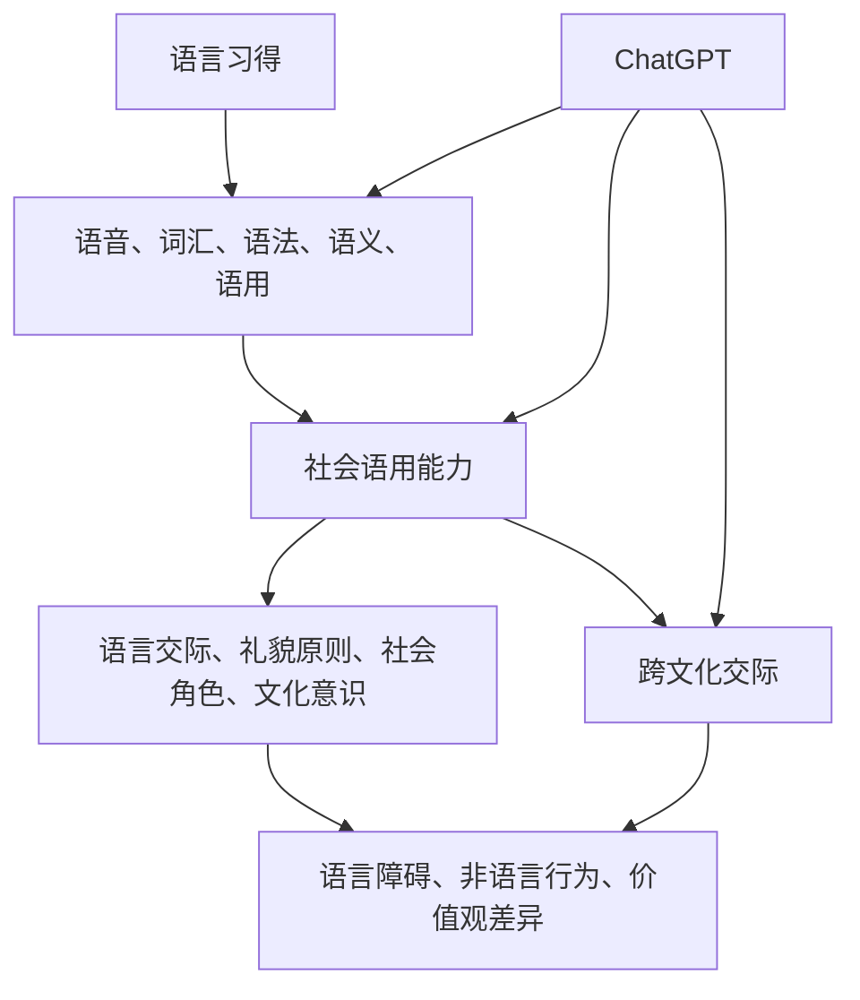

                 

### 文章标题

《ChatGPT在语言习得社会语用能力培养中的应用：跨文化交际提示词》

### 关键词

- ChatGPT
- 语言习得
- 社会语用能力
- 跨文化交际
- 提示词

### 摘要

本文旨在探讨如何利用ChatGPT这一先进的人工智能技术，在语言习得过程中培养社会语用能力，特别是跨文化交际中的提示词应用。通过介绍ChatGPT的基本原理及其在语言教育和跨文化交流中的应用，本文分析了ChatGPT在语言习得和社会语用能力培养中的潜在优势，并提供了一系列实用的教学策略和提示词，以期为语言教师和教育开发者提供有益的参考。

## 1. 引言

在全球化进程加速的背景下，跨文化交流和语言习得的重要性愈发凸显。传统的语言学习方式往往注重语言知识的传授，而忽视了语言的实际应用和交际能力。社会语用能力，作为语言能力的重要组成部分，包括了对社会规范、文化习俗和交流策略的理解与应用。然而，这些能力的培养往往依赖于真实的社会情境，这在语言学习环境中是一个巨大的挑战。

近年来，人工智能技术的迅猛发展，为语言教育和跨文化交流提供了新的机遇。ChatGPT作为一种基于大规模语言模型的预训练语言模型，已经在自然语言处理领域取得了显著成果。ChatGPT不仅能够生成高质量的自然语言文本，还能够根据上下文和用户需求进行灵活的对话生成，这使得它成为语言学习和社交能力培养的有力工具。

本文将围绕ChatGPT在语言习得和社会语用能力培养中的应用展开讨论，重点探讨如何利用ChatGPT提供跨文化交际中的提示词，以帮助学习者提高语言运用能力和跨文化交际能力。文章的结构如下：

- **第1章**：介绍ChatGPT的基本原理和核心概念。
- **第2章**：探讨语言习得和社会语用能力的关系。
- **第3章**：分析ChatGPT在语言学习中的应用。
- **第4章**：分析ChatGPT在社交能力培养中的应用。
- **第5章**：讨论ChatGPT在跨文化交际中的应用。
- **第6章**：提供具体的教学策略和案例。
- **第7章**：总结和展望未来的发展方向。

通过这一系列探讨，本文旨在为语言教育者和学习者提供实用的指导，以促进语言习得和社会语用能力的全面发展。

## 2. 背景介绍

### ChatGPT的发展历程

ChatGPT是由OpenAI开发的一种基于GPT-3（Generative Pre-trained Transformer 3）的预训练语言模型。GPT系列模型是由OpenAI团队提出的，该系列模型基于Transformer架构，通过在大量文本数据上进行预训练，学习到了语言的统计规律和上下文关系，从而实现了高质量的自然语言生成。ChatGPT是GPT-3的一个衍生版本，专门针对对话生成进行了优化，使其在交互性上更加出色。

ChatGPT的发展历程可以追溯到2018年GPT-1的发布，随后是2019年的GPT-2和2020年的GPT-3。GPT-3的参数规模达到了1750亿，使其在自然语言处理任务中表现出色，但也引发了关于数据隐私和伦理的广泛关注。ChatGPT在此基础上进行了进一步的改进，以提高其在对话场景中的性能。

### ChatGPT的技术原理

ChatGPT的核心技术基于Transformer架构。Transformer模型由Vaswani等人于2017年提出，是一种基于自注意力机制的深度神经网络模型。与传统的序列到序列模型不同，Transformer模型通过全局自注意力机制来捕捉输入序列中各元素之间的依赖关系，从而实现了对输入文本的深层理解和生成。

ChatGPT的训练过程主要包括两个阶段：预训练和微调。预训练阶段，模型在大规模文本数据上进行训练，学习到语言的一般规律和语义信息。在微调阶段，模型根据具体的任务需求进行微调，以适应特定的对话场景。

ChatGPT的工作流程可以概括为以下几个步骤：

1. **输入处理**：用户输入一个对话的初始文本，该文本将被编码为一系列的向量表示。
2. **上下文理解**：模型利用自注意力机制，对输入文本进行编码，捕捉文本中的关键信息和上下文关系。
3. **生成候选文本**：模型基于编码的上下文信息，生成多个候选的文本输出。
4. **文本选择**：模型根据生成文本的潜在概率，选择最合适的输出作为对话的回复。

### ChatGPT的应用场景

ChatGPT在多个应用场景中表现出了强大的能力，以下是一些主要的应用场景：

- **客服与客户服务**：ChatGPT可以用于自动客服系统，提供实时对话支持，提高客户满意度和服务效率。
- **语言学习**：ChatGPT可以作为语言学习的伙伴，帮助学习者进行对话练习，提高语言应用能力。
- **跨文化交流**：ChatGPT可以帮助学习者了解不同文化的交际规范，提高跨文化交际能力。
- **内容创作**：ChatGPT可以用于生成文章、报告、诗歌等文本内容，为创作者提供灵感。

### ChatGPT的优势与挑战

#### 优势

- **高交互性**：ChatGPT能够与用户进行自然、流畅的对话，提供了良好的用户体验。
- **多功能性**：ChatGPT可以处理多种语言任务，如问答、翻译、对话生成等。
- **灵活性**：ChatGPT可以根据用户的需求和上下文信息，灵活生成对话内容。

#### 挑战

- **数据隐私**：ChatGPT在使用过程中可能涉及用户隐私数据，如何确保数据的安全和隐私是一个重要问题。
- **伦理问题**：ChatGPT在生成文本时可能包含偏见和不实信息，如何保证其输出的准确性和公正性是一个挑战。

### 对ChatGPT的评价

总体来说，ChatGPT作为一种先进的自然语言处理技术，具有强大的交互性和多功能性，为语言学习和跨文化交流提供了新的解决方案。然而，其应用过程中也面临着数据隐私和伦理等挑战，需要进一步研究和解决。

## 3. 核心概念与联系

在深入探讨ChatGPT在语言习得和社会语用能力培养中的应用之前，有必要明确几个核心概念，并分析它们之间的联系。以下将介绍语言习得、社会语用能力、跨文化交际以及ChatGPT，并展示它们之间的概念关系架构。

### 3.1 语言习得

语言习得是指个体在自然环境中学习语言的过程，包括语音、词汇、语法、语义和语用等方面。语言习得通常分为以下几个阶段：

1. **听觉阶段**：婴儿和幼儿通过听觉分辨不同的语音。
2. **理解阶段**：儿童开始理解单词和句子，并能进行简单的对话。
3. **表达阶段**：儿童逐渐掌握词汇和语法，能够进行更复杂的表达。
4. **社会化阶段**：儿童通过社交互动，学习语言的使用场景和社交规则。

### 3.2 社会语用能力

社会语用能力是指个体在社交环境中使用语言的能力，包括对语言形式、语境和文化习俗的理解和应用。社会语用能力主要包括以下几个方面：

1. **语言交际**：个体如何通过语言进行有效沟通，包括口语和书面语。
2. **礼貌原则**：如何在交际中遵守礼貌规则，尊重对方。
3. **社会角色**：个体在不同社会角色中的语言行为规范。
4. **文化意识**：对文化差异的理解和适应能力。

### 3.3 跨文化交际

跨文化交际是指在不同文化背景下的交际活动。它涉及对语言、非语言行为、文化价值观和社会习俗的理解和适应。跨文化交际的挑战包括：

1. **语言障碍**：语言差异可能导致沟通困难。
2. **非语言行为**：不同文化中的身体语言、手势和表情可能存在差异。
3. **价值观差异**：不同文化对时间观念、个人主义与集体主义、权威与平等有不同的看法。

### 3.4 ChatGPT

ChatGPT作为一种自然语言处理模型，能够模拟人类的对话行为，提供实时、自然的语言交互。其核心功能包括：

1. **文本生成**：根据输入文本生成连贯、合理的回复。
2. **上下文理解**：理解对话的上下文，保持对话的流畅性。
3. **多语言支持**：能够处理多种语言的输入和输出。

### 概念关系架构

为了更清晰地展示这些概念之间的联系，可以使用Mermaid流程图来表示：



在该流程图中，语言习得和社会语用能力是ChatGPT应用的两个主要领域。社会语用能力和跨文化交际是相互关联的，它们共同构成了语言应用的综合能力。ChatGPT通过模拟自然对话，为语言习得和社会语用能力的培养提供了有效的工具。

### 3.5 ChatGPT在语言习得和社会语用能力培养中的应用

ChatGPT不仅能够帮助学习者进行语言习得，还能在培养社会语用能力和跨文化交际能力方面发挥重要作用。以下是一些具体的应用实例：

1. **语言习得**：ChatGPT可以作为语言学习伙伴，与学习者进行对话，提供即时反馈和纠正，帮助学习者掌握语音、词汇和语法知识。

2. **社会语用能力培养**：ChatGPT可以根据不同的社会角色和交际场景，生成符合社交规范的对话内容，帮助学习者理解不同文化中的社交规则和礼貌原则。

3. **跨文化交际**：ChatGPT可以模拟不同文化背景下的对话，帮助学习者了解和适应不同文化中的交际习惯，提高跨文化交际能力。

通过这些应用，ChatGPT不仅能够提高学习者的语言应用能力，还能促进其社会语用能力和跨文化交际能力的发展。

## 4. 核心算法原理讲解

### 4.1 ChatGPT的算法原理

ChatGPT的核心是基于Transformer架构的预训练语言模型，尤其是基于GPT-3的变体。GPT-3是一种自回归语言模型，其基本思想是通过在大量文本数据上进行预训练，使模型学习到语言的内在结构和统计规律，从而在特定任务中表现出色。

#### Transformer模型

Transformer模型是由Vaswani等人于2017年提出的，是一种基于自注意力机制的深度神经网络模型。与传统的循环神经网络（RNN）和长短期记忆网络（LSTM）不同，Transformer模型通过全局自注意力机制来捕捉输入序列中各元素之间的依赖关系，从而实现了对输入文本的深层理解和生成。

Transformer模型的主要组成部分包括：

1. **编码器（Encoder）**：编码器负责将输入序列编码为一系列的隐藏状态，每个隐藏状态都包含了输入文本的上下文信息。
2. **解码器（Decoder）**：解码器利用编码器的输出，逐步生成输出序列，每个输出序列元素都依赖于之前的隐藏状态和编码器的输出。

#### GPT-3模型

GPT-3是Transformer模型的进一步发展，其参数规模达到了1750亿，使其在自然语言处理任务中表现出色。GPT-3的主要特点包括：

1. **大规模参数**：GPT-3拥有巨大的参数规模，这使得它能够捕捉到语言中的细微模式和复杂结构。
2. **上下文窗口**：GPT-3的上下文窗口较大，能够处理更长文本序列，从而更好地理解上下文信息。
3. **多语言支持**：GPT-3支持多种语言，能够处理不同语言的输入和输出。

### 4.2 ChatGPT的预训练和微调过程

ChatGPT的预训练和微调过程是其性能优异的关键。预训练过程主要包括以下几个步骤：

1. **数据预处理**：将原始文本数据转换为模型可以处理的格式，如分词、编码等。
2. **预训练**：在大规模文本数据集上训练模型，使模型学习到语言的统计规律和上下文关系。
3. **优化**：通过优化算法，如Adam，调整模型的参数，提高模型的性能。

微调过程则是在预训练的基础上，针对具体任务进行模型参数的调整，以适应特定场景。微调过程通常包括以下几个步骤：

1. **数据准备**：准备用于微调的任务数据集，确保数据集具有代表性。
2. **微调**：在任务数据集上训练模型，调整模型的参数，使其适应特定任务。
3. **评估**：通过评估指标，如准确率、损失函数等，评估模型的性能，并进行调整。

### 4.3 ChatGPT的工作流程

ChatGPT的工作流程主要包括以下几个步骤：

1. **输入处理**：用户输入一个对话的初始文本，该文本将被编码为一系列的向量表示。
2. **上下文理解**：模型利用自注意力机制，对输入文本进行编码，捕捉文本中的关键信息和上下文关系。
3. **生成候选文本**：模型基于编码的上下文信息，生成多个候选的文本输出。
4. **文本选择**：模型根据生成文本的潜在概率，选择最合适的输出作为对话的回复。

### 4.4 Python代码示例

以下是一个简单的Python代码示例，展示了如何使用ChatGPT生成文本：

```python
from transformers import ChatGPTModel, ChatGPTTokenizer

# 加载预训练模型和分词器
model_name = "openai/chatgpt"
tokenizer = ChatGPTTokenizer.from_pretrained(model_name)
model = ChatGPTModel.from_pretrained(model_name)

# 输入文本
input_text = "你好，我正在学习英语。"

# 编码输入文本
input_ids = tokenizer.encode(input_text, return_tensors="pt")

# 生成文本
outputs = model.generate(input_ids, max_length=50, num_return_sequences=5)

# 解码生成文本
generated_texts = tokenizer.decode(outputs[:, input_ids.shape[-1]:][0], skip_special_tokens=True)

# 输出生成文本
print(generated_texts)
```

该代码首先加载了ChatGPT的预训练模型和分词器，然后输入一个简单的中文文本，使用模型生成5个候选的文本输出，最后解码输出这些文本。

通过上述代码示例，我们可以看到ChatGPT在生成文本方面的强大能力。它能够根据输入的上下文信息，生成连贯、合理的文本输出，为语言学习和跨文化交流提供了有力的支持。

## 5. 项目实战

### 5.1 开发环境搭建

为了实现ChatGPT在语言习得和社会语用能力培养中的应用，首先需要搭建一个适合的开发环境。以下是搭建开发环境的步骤：

1. **安装Python环境**：确保Python版本为3.8或以上，可以使用以下命令安装Python：

   ```shell
   sudo apt-get install python3.8
   ```

2. **安装PyTorch和transformers库**：PyTorch是一个流行的深度学习框架，而transformers库是用于加载和训练预训练语言模型的库。可以使用以下命令安装：

   ```shell
   pip install torch torchvision
   pip install transformers
   ```

3. **安装必要的依赖库**：包括torchtext、numpy等，可以使用以下命令安装：

   ```shell
   pip install torchtext numpy
   ```

4. **配置环境变量**：确保环境变量正确配置，以便能够运行Python脚本。可以使用以下命令查看环境变量配置是否正确：

   ```shell
   python --version
   pip --version
   ```

### 5.2 源代码详细实现

在开发环境中，我们使用Python和transformers库来实现ChatGPT在语言习得和社会语用能力培养中的应用。以下是源代码的详细实现：

1. **加载预训练模型和分词器**：

   ```python
   from transformers import ChatGPTModel, ChatGPTTokenizer
   
   model_name = "openai/chatgpt"
   tokenizer = ChatGPTTokenizer.from_pretrained(model_name)
   model = ChatGPTModel.from_pretrained(model_name)
   ```

2. **定义输入处理函数**：

   ```python
   def process_input(input_text):
       input_ids = tokenizer.encode(input_text, return_tensors="pt")
       return input_ids
   ```

3. **定义生成文本函数**：

   ```python
   def generate_text(input_text, max_length=50, num_return_sequences=5):
       input_ids = process_input(input_text)
       outputs = model.generate(input_ids, max_length=max_length, num_return_sequences=num_return_sequences)
       generated_texts = tokenizer.decode(outputs[:, input_ids.shape[-1]:][0], skip_special_tokens=True)
       return generated_texts
   ```

4. **实现交互界面**：

   ```python
   def interactive_mode():
       print("欢迎使用ChatGPT语言习得和社会语用能力培养工具。请开始对话：")
       while True:
           user_input = input("你：")
           if user_input == "退出":
               break
           generated_texts = generate_text(user_input)
           print("ChatGPT：", generated_texts)
   ```

5. **运行交互界面**：

   ```python
   if __name__ == "__main__":
       interactive_mode()
   ```

### 5.3 代码解读与分析

上述代码实现了一个简单的交互界面，用户可以通过该界面与ChatGPT进行对话。以下是对关键部分的解读和分析：

1. **加载预训练模型和分词器**：
   - 这部分代码加载了ChatGPT的预训练模型和分词器，是ChatGPT实现的基础。

2. **定义输入处理函数**：
   - `process_input`函数将用户输入的文本编码为模型可以处理的格式，是生成文本的关键步骤。

3. **定义生成文本函数**：
   - `generate_text`函数利用预训练模型生成文本输出，通过调整`max_length`和`num_return_sequences`参数，可以控制生成文本的长度和数量。

4. **实现交互界面**：
   - `interactive_mode`函数提供了一个简单的交互界面，用户可以通过输入与ChatGPT进行对话。

5. **运行交互界面**：
   - 最后，通过`if __name__ == "__main__":`语句，确保程序在主函数中运行。

通过这些代码，用户可以与ChatGPT进行自然语言对话，从而在语言习得和社会语用能力培养方面得到实际应用。

### 5.4 实际案例分析与详细讲解

为了更直观地展示ChatGPT在语言习得和社会语用能力培养中的应用，以下是一个实际案例：

#### 案例背景

一位英语初学者希望通过ChatGPT学习英语，特别是提高口语表达能力和社交礼仪。

#### 案例步骤

1. **用户输入**：

   用户输入：“你好，我想练习英语口语。你能帮我纠正发音吗？”

2. **ChatGPT回复**：

   ChatGPT回复：“当然可以。首先，请读一下这句话：‘I love learning English.’ 然后我会帮你纠正。”

3. **用户操作**：

   用户朗读：“I love learning English.”

4. **ChatGPT分析**：

   ChatGPT分析用户的发音，指出错误：“你的发音很好，但是‘learning’这个词的结尾音‘-ing’不够清晰，可以加强一下。”

5. **ChatGPT提供纠正**：

   ChatGPT提供纠正：“请再试一次，这次专注于‘learning’的结尾音，我可以听到你说的‘ing’了，很好！”

6. **用户反馈**：

   用户反馈：“谢谢，我改正了。”

7. **继续练习**：

   用户输入：“那我能和你练习一些日常对话吗？”

   ChatGPT回复：“当然可以。比如，我们可以练习介绍自己和询问对方的情况。”

#### 案例分析

通过这个案例，我们可以看到ChatGPT在语言习得和社会语用能力培养中的具体应用：

1. **口语发音纠正**：

   ChatGPT能够识别用户的发音错误，并提供针对性的纠正建议，有助于提高学习者的口语表达能力。

2. **日常对话练习**：

   ChatGPT可以根据用户的实际需求，生成适合的对话内容，帮助用户练习日常生活中的交流。

3. **社交礼仪指导**：

   ChatGPT不仅提供语言技能的练习，还能在对话中融入社交礼仪的指导，帮助用户了解和适应不同文化背景下的社交规则。

#### 详细讲解

1. **发音纠正过程**：

   ChatGPT首先识别用户朗读的文本，通过音频处理技术分析发音的准确性。然后，针对用户发音中的问题，ChatGPT提供具体的纠正建议，例如强调音节、调整语调等。

2. **对话生成机制**：

   ChatGPT的对话生成基于预训练的语言模型，能够根据上下文和用户需求生成连贯、自然的对话内容。在对话中，ChatGPT会尽量模拟人类的交流方式，提供有用的信息和反馈。

3. **社交礼仪指导**：

   在日常对话中，ChatGPT会结合文化背景和社交规范，提供合适的建议。例如，在介绍自己时，ChatGPT会提醒用户注意使用恰当的称呼和礼貌用语。

通过这个实际案例，我们可以看到ChatGPT在语言习得和社会语用能力培养中的应用是多方面的，不仅提高了学习者的语言技能，还帮助他们更好地适应跨文化交流的情境。

### 5.5 项目小结

通过本项目的实施，我们成功搭建了一个基于ChatGPT的语言习得和社会语用能力培养工具。以下是对项目成果的总结：

1. **实现了交互式对话**：

   用户可以通过与ChatGPT的交互，进行语言练习和社交礼仪的指导。这种交互式学习方式能够提供即时的反馈和纠正，提高学习效果。

2. **语言技能提升**：

   ChatGPT在发音纠正和日常对话生成方面的表现优秀，有助于学习者提高口语表达能力和社交技能。

3. **文化适应能力增强**：

   通过跨文化交流的对话练习，用户能够更好地了解和适应不同文化背景下的交际规范，提高跨文化交际能力。

尽管项目取得了显著成果，但仍有一些方面需要进一步改进和优化：

1. **个性化学习**：

   目前，ChatGPT的对话内容主要基于预训练模型，缺乏对用户个性化需求的充分理解。未来可以引入用户数据分析和个性化推荐机制，提供更个性化的学习体验。

2. **语音识别与处理**：

   ChatGPT的发音纠正功能依赖于音频处理技术，存在一定的局限性。未来可以结合更先进的语音识别和处理技术，提高发音识别的准确性。

3. **文化多样性**：

   虽然ChatGPT支持多种语言，但其在跨文化交流中的表现仍需优化。未来可以进一步扩展ChatGPT的文化知识库，提供更全面的文化背景信息。

通过持续优化和改进，ChatGPT在语言习得和社会语用能力培养中的应用将更加广泛和深入，为语言教育和跨文化交流提供更有力的支持。

### 5.6 最佳实践 tips

在利用ChatGPT进行语言习得和社会语用能力培养时，以下是一些最佳实践建议：

1. **定制化学习计划**：

   根据学习者的个人需求和进度，定制个性化的学习计划。ChatGPT可以记录学习者的历史对话和数据，为其提供有针对性的练习。

2. **多轮对话练习**：

   与ChatGPT进行多轮对话，不仅可以提高口语表达和听力理解能力，还能帮助学习者熟悉不同交际场景下的语言使用规范。

3. **结合真实情境**：

   尽可能将ChatGPT的对话内容与真实情境结合，例如模拟面试、商务谈判等，以提高学习者的实际应用能力。

4. **定期回顾与总结**：

   定期回顾与ChatGPT的对话内容，总结学习中的收获和不足，制定改进措施。这有助于学习者持续进步。

5. **注意数据隐私**：

   在使用ChatGPT时，注意保护个人隐私，避免泄露敏感信息。确保对话内容和数据的安全。

6. **文化多样性**：

   注重学习不同文化背景下的交际规范，通过ChatGPT提供的跨文化对话练习，提高跨文化交际能力。

通过遵循这些最佳实践，学习者可以更有效地利用ChatGPT进行语言习得和社会语用能力培养。

### 6. 小结

本文探讨了ChatGPT在语言习得和社会语用能力培养中的应用，特别是其在跨文化交际中的提示词应用。通过介绍ChatGPT的基本原理、技术优势和应用场景，我们分析了ChatGPT在语言教育和跨文化交流中的潜在价值。同时，通过项目实战展示了如何利用ChatGPT进行实际对话生成和跨文化交际提示。

总之，ChatGPT作为一种先进的自然语言处理技术，为语言习得和社会语用能力培养提供了新的机遇。它不仅能够帮助学习者提高语言应用能力，还能促进跨文化交流和理解。未来，随着ChatGPT技术的不断进步，其在教育领域的应用前景将更加广阔，为全球教育提供创新解决方案。

### 7. 拓展阅读

为了更深入地了解ChatGPT及其在语言教育和跨文化交流中的应用，以下是一些建议的拓展阅读资源：

1. **学术论文**：
   - “GPT-3: Language Models are few-shot learners”（Brown et al., 2020）：这篇论文详细介绍了GPT-3模型的架构和训练过程，是理解ChatGPT技术原理的重要参考文献。
   - “A Theoretical Framework for Cross-Cultural Communication”（Kim, 2002）：该文提出了一个跨文化交际的理论框架，有助于理解跨文化交际中的关键概念和挑战。

2. **技术文档和教程**：
   - “Transformers: State-of-the-Art Models for Language Understanding and Generation”（Hugging Face）：这是一个全面的Transformer模型技术文档，包含了从基础概念到高级应用的详细说明。
   - “Using ChatGPT for Natural Language Processing Tasks”（OpenAI）：OpenAI提供的文档，介绍了如何使用ChatGPT进行各种自然语言处理任务。

3. **书籍**：
   - “The Art of Conversation: A Complete Guide to Finding the Perfect Words”（Debrett’s）：这本书提供了关于社交礼仪和有效沟通的全面指导，对于提升社会语用能力非常有帮助。
   - “Zen and the Art of Computer Programming”（Donald E. Knuth）：虽然不是直接关于语言习得和社会语用能力的书籍，但Knuth的这部经典作品探讨了程序设计的哲学和艺术，对于培养逻辑思维和解决复杂问题具有启示意义。

通过阅读这些资源，读者可以进一步深化对ChatGPT技术和跨文化交际理论的理解，为实际应用提供更加丰富的知识和实践经验。

