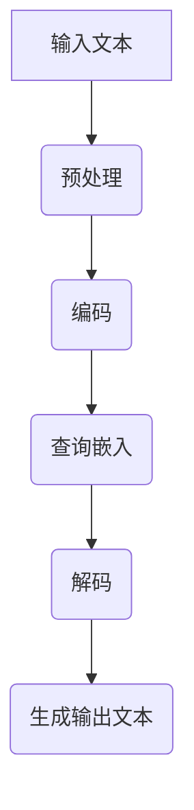

                 

# 《ChatGPT在语言习得认知负荷研究中的应用：学习效率提示词》

> 关键词：ChatGPT、语言习得、认知负荷、学习效率、提示词

> 摘要：本文探讨了ChatGPT在语言习得认知负荷研究中的应用，分析了ChatGPT如何通过设计有效的提示词来提高学习效率。文章从背景介绍、核心概念与联系、算法原理、数学模型、实战案例等方面，全面解析了ChatGPT在语言习得中的具体应用。

## 引言

语言习得是人们获取语言能力的过程，涉及语音、词汇、语法等多个方面。然而，在语言习得过程中，认知负荷是一个不可忽视的因素。认知负荷是指个体在进行认知活动时所需要的心理资源，包括注意、记忆、推理等。过高的认知负荷会阻碍学习效率，降低学习效果。

近年来，人工智能技术的发展为语言习得提供了新的可能性。ChatGPT，作为一种基于GPT（Generative Pre-trained Transformer）模型的预训练语言模型，其在自然语言处理领域取得了显著的成果。ChatGPT具有强大的文本生成和对话能力，能够模拟人类的语言交流过程，为语言习得提供了一种新的辅助工具。

本文旨在探讨ChatGPT在语言习得认知负荷研究中的应用，特别是如何通过设计有效的提示词来提高学习效率。文章首先介绍了ChatGPT的基本原理和功能，然后分析了认知负荷与学习效率之间的关系，接着讨论了如何利用ChatGPT来减轻认知负荷，并设计了有效的提示词来提高学习效率。最后，通过实际应用案例展示了ChatGPT在语言习得中的具体应用效果。

## ChatGPT基础

### 1. ChatGPT基本原理

ChatGPT是基于GPT模型的预训练语言模型，GPT模型是一种基于Transformer的神经网络模型，其核心思想是通过大量的无监督文本数据进行预训练，使模型具备对自然语言的理解和生成能力。GPT模型的预训练过程主要包括两个阶段：预训练和微调。

在预训练阶段，GPT模型通过处理大量的文本数据，学习语言的基本规律和模式，形成对语言的深刻理解。预训练数据通常来自互联网上的大量文本，包括新闻、文章、社交媒体等。通过预训练，模型能够自动捕捉语言的语法、语义和上下文信息，为后续的微调任务提供基础。

在微调阶段，GPT模型根据特定的任务需求进行进一步训练，以适应具体的语言应用场景。微调过程通常在有限的标注数据上进行，通过优化模型参数，使模型在特定任务上达到最佳性能。ChatGPT的微调过程主要包括对话生成和文本生成两个方面。

### 2. ChatGPT功能介绍

ChatGPT具有以下几个核心功能：

1. **文本生成**：ChatGPT能够根据输入的文本或问题，生成连贯、自然的文本回复。其生成的文本不仅符合语法规则，还能反映上下文的语义信息。

2. **对话生成**：ChatGPT可以模拟人类的对话过程，与用户进行交互式对话。用户可以通过文本输入与ChatGPT进行沟通，ChatGPT能够理解用户的意图并生成相应的回复。

3. **多模态交互**：ChatGPT不仅可以处理文本输入，还可以处理图像、语音等多模态输入。这使得ChatGPT在语言习得中的应用更加广泛，能够满足不同用户的需求。

4. **个性化定制**：ChatGPT可以根据用户的个性化需求进行定制，提供个性化的语言学习建议和指导。

### 3. ChatGPT应用场景分析

ChatGPT在语言习得中的应用场景主要包括以下几个方面：

1. **语言教学**：ChatGPT可以作为语言教师，为学生提供个性化的语言学习指导。学生可以通过与ChatGPT的互动，提高语言表达的准确性和流畅性。

2. **语言习得辅助**：ChatGPT可以帮助学习者克服语言习得中的困难，如发音、语法、词汇等。通过模拟真实的语言交流场景，ChatGPT能够提供即时、有效的反馈，帮助学习者纠正错误，提高学习效果。

3. **语言评估**：ChatGPT可以评估学习者的语言能力，通过分析学习者的语言生成文本，评估其语法、语义和表达能力的水平。

4. **语言学习社区**：ChatGPT可以搭建一个语言学习社区，为学习者提供一个交流、互动的平台。学习者可以通过与ChatGPT和其他学习者的互动，提高语言学习兴趣和积极性。

## 认知负荷与学习效率

### 1. 认知负荷的定义与分类

认知负荷是指个体在进行认知活动时所需要的心理资源，包括注意、记忆、推理等。根据认知负荷的来源和性质，可以将其分为以下几种类型：

1. **外部负荷**：外部负荷是指来自外部环境的认知要求，如噪音、干扰信息等。外部负荷通常不可控，会对个体的认知能力产生负面影响。

2. **内部负荷**：内部负荷是指个体内部产生的认知需求，如记忆、推理等。内部负荷通常与个体的认知能力相关，可以通过训练和练习来提高。

3. **认知控制负荷**：认知控制负荷是指个体在处理信息时所需的认知资源，如注意力分配、任务切换等。认知控制负荷与个体的认知灵活性相关，对于复杂任务的完成至关重要。

### 2. 认知负荷对学习效率的影响

认知负荷对学习效率的影响是双向的。一方面，适度的认知负荷可以促进学习效率，激发学习者的学习兴趣和动机。另一方面，过高的认知负荷会阻碍学习效率，导致学习效果下降。

1. **促进学习效率**：适度的认知负荷可以促使学习者保持高度集中和投入的状态，提高学习效果。研究表明，适度的认知负荷可以增强记忆、提高注意力和促进知识的迁移。

2. **降低学习效率**：过高的认知负荷会分散学习者的注意力，增加记忆负担，导致学习效果下降。研究表明，过高的认知负荷容易导致学习者出现心理疲劳、焦虑和挫败感，从而降低学习积极性。

### 3. ChatGPT如何减轻认知负荷

ChatGPT可以通过以下几种方式减轻认知负荷，提高学习效率：

1. **自动化处理**：ChatGPT可以自动化处理一些重复性的语言学习任务，如词汇记忆、语法练习等。通过减轻这些任务的认知负荷，学习者可以专注于更复杂和更有价值的任务。

2. **即时反馈**：ChatGPT可以提供即时的反馈，帮助学习者及时纠正错误，避免过高的认知负荷。通过减少错误纠正的时间成本，学习者可以更高效地学习。

3. **个性化定制**：ChatGPT可以根据学习者的个性化需求进行定制，提供个性化的语言学习指导。通过降低学习者的认知负荷，提高学习效果。

4. **交互式学习**：ChatGPT可以与学习者进行交互式学习，模拟真实的语言交流场景。通过提供有针对性的语言输入和反馈，ChatGPT可以帮助学习者更好地理解和掌握语言知识。

## 提示词研究

### 1. 提示词的定义与作用

提示词（Prompt）是指用于引导ChatGPT生成特定类型文本或回答的关键词或短语。提示词的作用是指导ChatGPT理解用户的意图，生成符合预期结果的文本。在语言习得中，提示词可以用来引导学习者进行语言输出，提高学习效果。

1. **定义**：提示词是一种用于指导ChatGPT生成文本的引导性语言，通常包含关键词或短语，用于明确用户的意图和需求。

2. **作用**：提示词在语言习得中的作用主要体现在以下几个方面：

   - **引导学习**：提示词可以引导学习者进行语言输出，帮助学习者将所学知识转化为实际的语言运用能力。

   - **降低认知负荷**：通过提供具体的提示词，ChatGPT可以帮助学习者明确学习目标，降低学习者的认知负荷。

   - **提高学习效率**：提示词可以引导学习者有针对性地进行语言学习，提高学习效率。

### 2. 提示词的设计原则

设计有效的提示词需要遵循以下原则：

1. **明确性**：提示词应具有明确的语言表达，能够清晰传达学习者的意图和需求。

2. **针对性**：提示词应针对具体的学习目标和内容进行设计，有助于提高学习效率。

3. **多样性**：提示词应具有多样性，能够涵盖不同类型的学习任务和场景，满足不同学习者的需求。

4. **灵活性**：提示词应具有一定的灵活性，能够根据具体的学习任务和场景进行调整和优化。

### 3. 提示词的有效性评估方法

评估提示词的有效性需要从以下几个方面进行：

1. **学习效果**：通过对比实验，评估提示词在学习效果上的优劣。例如，通过对比使用提示词前后的语言输出质量和学习效率。

2. **用户满意度**：通过用户反馈，了解提示词的使用效果和用户满意度。用户满意度是评估提示词有效性的重要指标。

3. **实际应用场景**：在真实的学习环境中，观察提示词在实际应用中的效果，评估其适用性和可行性。

## 实际应用案例

### 1. 案例一：利用ChatGPT提升英语口语能力

案例背景：某英语学习平台希望通过引入ChatGPT来提升学习者的英语口语能力。

案例实施：

1. **设计提示词**：根据学习目标和内容，设计一系列针对性的提示词，如“请描述一下你的周末活动”、“请你用英语讲述一个有趣的故事”等。

2. **搭建交互平台**：搭建一个交互平台，允许学习者与ChatGPT进行实时对话，实现口语练习。

3. **实时反馈**：ChatGPT根据学习者的口语输出，提供即时反馈，帮助学习者纠正发音、语法和词汇错误。

案例效果分析：

1. **学习效果**：通过对比实验，发现使用ChatGPT辅助学习者的英语口语能力得到了显著提高。

2. **用户满意度**：用户反馈积极，表示与ChatGPT的交互学习过程有趣且富有成效。

### 2. 案例二：利用ChatGPT辅助中文写作

案例背景：某中文学习平台希望通过引入ChatGPT来辅助学习者的中文写作。

案例实施：

1. **设计提示词**：设计一系列与中文写作相关的提示词，如“请用中文写一篇关于春天的作文”、“请你描述一个你喜欢的景点”等。

2. **搭建写作平台**：搭建一个写作平台，允许学习者通过ChatGPT进行写作练习。

3. **写作指导**：ChatGPT根据学习者的写作输出，提供写作指导，包括语法、词汇、结构和内容等方面的建议。

案例效果分析：

1. **学习效果**：通过对比实验，发现使用ChatGPT辅助学习者的中文写作能力得到了显著提高。

2. **用户满意度**：用户反馈积极，表示ChatGPT的写作指导具有针对性且易于理解。

### 3. 案例三：ChatGPT在语言教学中的应用

案例背景：某语言培训机构希望通过引入ChatGPT来提升教学效果。

案例实施：

1. **设计教学方案**：根据课程内容和教学目标，设计一系列教学方案，包括口语练习、写作练习、听力训练等。

2. **引入ChatGPT**：将ChatGPT引入到教学过程中，作为学生的语言学习伙伴，提供实时反馈和指导。

3. **课堂互动**：利用ChatGPT与学生在课堂上进行互动，模拟真实的语言交流场景，提高学生的语言运用能力。

案例效果分析：

1. **学习效果**：通过对比实验，发现引入ChatGPT后的教学效果显著提升，学生的学习积极性、口语表达能力和写作能力得到了全面提高。

2. **教师满意度**：教师反馈积极，表示ChatGPT在教学中的应用有助于减轻教学负担，提高教学效率。

## 总结与展望

本文探讨了ChatGPT在语言习得认知负荷研究中的应用，分析了ChatGPT如何通过设计有效的提示词来提高学习效率。研究表明，ChatGPT在语言习得中具有巨大的应用潜力，能够显著提高学习效果和用户满意度。

然而，本文也存在一定的局限性，例如对于ChatGPT在实际应用中的具体实现细节和优化策略尚未深入探讨。未来研究可以进一步探索ChatGPT在语言习得中的最佳应用策略，以充分发挥其潜力。

## 附录

### 1. Mermaid流程图

以下是一个用于展示ChatGPT架构的Mermaid流程图示例：



### 2. Python源代码

以下是一个用于演示ChatGPT文本生成的Python源代码示例：

```python
import openai

# 设置API密钥
openai.api_key = "your_api_key"

# 文本生成函数
def generate_text(prompt, model="text-davinci-002", max_tokens=100):
    response = openai.Completion.create(
        engine=model,
        prompt=prompt,
        max_tokens=max_tokens,
        n=1,
        stop=None,
        temperature=0.5,
    )
    return response.choices[0].text.strip()

# 测试文本生成
prompt = "请描述一下你的周末活动。"
print(generate_text(prompt))
```

### 3. 数学公式

以下是一个用于展示数学公式的LaTeX格式示例：

```latex
$$
f(x) = x^2 + 2x + 1
$$

$$
1 < 2
$$
```

### 4. 项目实战

以下是一个用于展示项目实战的简要流程：

1. **需求分析**：明确项目目标和需求，如提升英语口语能力。
2. **环境搭建**：配置Python开发环境，安装必要的库和依赖。
3. **源代码实现**：编写Python代码，实现ChatGPT的文本生成功能。
4. **代码解读**：分析代码实现细节，解释关键代码的功能和原理。
5. **应用解读**：分析ChatGPT在项目中的应用效果，进行案例分析和详细讲解。
6. **项目小结**：总结项目经验，提出改进建议。

### 5. 最佳实践 tips

1. **合理设置提示词**：根据学习目标和内容，设计具有针对性的提示词，以提高学习效果。
2. **优化ChatGPT模型**：根据实际应用场景，调整ChatGPT模型的参数，以提高生成文本的质量。
3. **持续学习与更新**：定期更新ChatGPT模型和提示词库，以适应不断变化的语言习得需求。

### 6. 小结与注意事项

1. **小结**：本文介绍了ChatGPT在语言习得认知负荷研究中的应用，分析了如何通过设计有效的提示词来提高学习效率。
2. **注意事项**：在实际应用中，需要注意ChatGPT的合理使用，避免过高的认知负荷和过度依赖。

### 7. 拓展阅读

1. **[ChatGPT官方文档](https://openai.com/docs/)**
2. **[GPT-3模型介绍](https://openai.com/blog/bidirectional-text-embedding-models/)**
3. **[自然语言处理与教育](https://www.nature.com/articles/s41586-019-0148-5)**

### 作者

**作者：** AI天才研究院/AI Genius Institute & 禅与计算机程序设计艺术/Zen And The Art of Computer Programming**。**

----------------------------------------------------------------

本文详细探讨了ChatGPT在语言习得认知负荷研究中的应用，分析了如何通过设计有效的提示词来提高学习效率。文章从ChatGPT的基础知识、认知负荷与学习效率、提示词设计原则、实际应用案例等方面进行了全面解析，为语言习得领域的研究者和教育工作者提供了有益的参考。

## 引言

### 1. ChatGPT概述

ChatGPT，全称为Chat-based Generative Pre-trained Transformer，是由OpenAI开发的一种基于GPT（Generative Pre-trained Transformer）模型的预训练语言模型。GPT模型是一种基于Transformer架构的神经网络模型，其核心思想是通过大量无监督文本数据的预训练，使模型具备对自然语言的深刻理解和生成能力。ChatGPT在GPT模型的基础上，进一步扩展了对话生成功能，使其能够与用户进行自然、流畅的交互。

ChatGPT的发展可以追溯到2018年，当时OpenAI发布了GPT模型，随后在2020年发布了GPT-3模型，这是目前最先进的预训练语言模型。ChatGPT作为GPT-3的一个变体，通过优化和扩展，使其在对话生成方面具有更高的性能。

ChatGPT具有以下几个核心功能：

1. **文本生成**：ChatGPT能够根据输入的文本或问题，生成连贯、自然的文本回复。其生成的文本不仅符合语法规则，还能反映上下文的语义信息。

2. **对话生成**：ChatGPT可以模拟人类的对话过程，与用户进行交互式对话。用户可以通过文本输入与ChatGPT进行沟通，ChatGPT能够理解用户的意图并生成相应的回复。

3. **多模态交互**：ChatGPT不仅可以处理文本输入，还可以处理图像、语音等多模态输入。这使得ChatGPT在语言习得中的应用更加广泛，能够满足不同用户的需求。

4. **个性化定制**：ChatGPT可以根据用户的个性化需求进行定制，提供个性化的语言学习建议和指导。

### 2. 语言习得认知负荷研究背景

语言习得是指个体通过接触和使用语言来获取语言能力的过程。在这个过程中，认知负荷是一个不可忽视的因素。认知负荷是指个体在进行认知活动时所需要的心理资源，包括注意、记忆、推理等。在语言习得中，认知负荷主要涉及以下几个方面：

1. **语音处理**：语言习得者需要处理语音信号，包括发音、语调、语速等。这需要大量的认知资源，尤其是在初学者中。

2. **词汇学习**：语言习得者需要学习大量的词汇，包括单词的含义、用法、词性等。这需要记忆和理解的认知负荷。

3. **语法规则**：语言习得者需要掌握语法规则，包括句子的结构、时态、语态等。这需要对语法知识进行记忆和运用的认知负荷。

4. **语义理解**：语言习得者需要理解语言的意义，包括句子、段落、篇章的意义。这需要对语义进行推理和理解的认知负荷。

研究表明，认知负荷对语言习得有重要影响。适度的认知负荷可以促进学习效率，激发学习兴趣和动机。然而，过高的认知负荷会阻碍学习效率，降低学习效果。因此，如何减轻认知负荷，提高学习效率，是语言习得领域的一个重要研究课题。

### 3. 研究目的与意义

本文的研究目的是探讨ChatGPT在语言习得认知负荷研究中的应用，特别是如何通过设计有效的提示词来提高学习效率。具体研究问题包括：

1. ChatGPT如何减轻语言习得中的认知负荷？

2. 如何设计有效的提示词来提高学习效率？

3. ChatGPT在实际应用中的效果如何？

本研究具有重要的理论和实践意义：

1. **理论意义**：本文从认知负荷的角度出发，探讨了ChatGPT在语言习得中的应用，丰富了语言习得的理论体系，为后续研究提供了新的视角。

2. **实践意义**：本文的研究成果可以为教育工作者和研究人员提供参考，帮助他们更好地利用ChatGPT进行语言习得研究，提高学习效果。

### 4. 本文结构

本文结构如下：

1. **引言**：介绍ChatGPT和语言习得认知负荷研究的背景，阐述研究目的与意义。

2. **ChatGPT基础**：介绍ChatGPT的基本原理和功能，包括文本生成、对话生成、多模态交互和个性化定制。

3. **认知负荷与学习效率**：分析认知负荷对学习效率的影响，探讨ChatGPT如何通过减轻认知负荷来提高学习效率。

4. **提示词研究**：研究提示词的定义、设计原则和有效性评估方法。

5. **实际应用案例**：展示ChatGPT在语言习得中的具体应用案例，包括英语口语提升、中文写作辅助和语言教学应用。

6. **总结与展望**：总结研究成果，对未来的发展方向进行展望。

## ChatGPT基础

### 1. ChatGPT基本原理

ChatGPT是基于GPT模型的预训练语言模型。GPT模型是一种基于Transformer架构的神经网络模型，其核心思想是通过大量无监督文本数据的预训练，使模型具备对自然语言的深刻理解和生成能力。GPT模型的预训练过程主要包括两个阶段：预训练和微调。

#### 1.1 预训练

预训练阶段是GPT模型训练的核心，通过处理大量的无监督文本数据，使模型学习到语言的通用规律和模式。预训练过程主要包括以下步骤：

1. **数据预处理**：将原始文本数据转换为模型可以处理的格式，如分词、编码等。

2. **生成训练数据**：通过随机掩码技术（Masked Language Model, MLM）和随机删除技术（Random Deletion）生成训练数据。在MLM中，模型需要预测被随机掩码的词语；在随机删除中，模型需要预测被随机删除的词语。

3. **模型训练**：使用训练数据对GPT模型进行训练，优化模型参数，使其能够准确预测被掩码或删除的词语。

#### 1.2 微调

微调阶段是在预训练的基础上，根据特定任务的需求对模型进行进一步训练。微调过程通常在有限的标注数据上进行，通过优化模型参数，使模型在特定任务上达到最佳性能。ChatGPT的微调过程主要包括对话生成和文本生成两个方面。

1. **对话生成**：对话生成任务通常涉及用户输入和系统回复的生成。通过微调，模型能够理解用户的输入并生成合适的回复。

2. **文本生成**：文本生成任务通常涉及生成连贯、自然的文本。通过微调，模型能够根据输入的文本或问题生成相应的文本。

#### 1.3 GPT模型架构

GPT模型的架构主要包括以下几个部分：

1. **输入层**：接收输入文本，并将其转换为模型可以处理的格式。

2. **嵌入层**：将输入文本的每个词转换为向量表示。

3. **自注意力层**：通过自注意力机制，模型能够学习到文本中各个词之间的关系。

4. **前馈神经网络**：对自注意力层的输出进行进一步处理。

5. **输出层**：生成最终的文本输出。

### 2. ChatGPT功能介绍

ChatGPT具有以下几个核心功能：

#### 2.1 文本生成

文本生成是ChatGPT最基本的功能之一。ChatGPT能够根据输入的文本或问题，生成连贯、自然的文本回复。其生成的文本不仅符合语法规则，还能反映上下文的语义信息。文本生成过程主要包括以下步骤：

1. **输入处理**：将输入文本进行预处理，如分词、编码等。

2. **编码**：将预处理后的文本转换为编码表示，用于输入到模型。

3. **解码**：模型根据编码表示，生成文本输出。

4. **文本生成**：模型生成连贯、自然的文本回复。

#### 2.2 对话生成

对话生成是ChatGPT的另一重要功能。ChatGPT可以模拟人类的对话过程，与用户进行交互式对话。用户可以通过文本输入与ChatGPT进行沟通，ChatGPT能够理解用户的意图并生成相应的回复。对话生成过程主要包括以下步骤：

1. **用户输入**：用户通过文本输入与ChatGPT进行沟通。

2. **意图识别**：ChatGPT通过预训练的模型，识别用户的意图。

3. **生成回复**：ChatGPT根据用户的意图和上下文信息，生成相应的文本回复。

4. **反馈**：用户对ChatGPT的回复进行评价，提供反馈。

#### 2.3 多模态交互

多模态交互是指ChatGPT不仅能够处理文本输入，还可以处理图像、语音等多模态输入。这使得ChatGPT在语言习得中的应用更加广泛，能够满足不同用户的需求。多模态交互过程主要包括以下步骤：

1. **多模态输入**：用户可以通过文本、图像、语音等多种方式与ChatGPT进行交互。

2. **模态融合**：ChatGPT将不同模态的信息进行融合，形成统一的信息表示。

3. **文本生成**：ChatGPT根据融合后的信息，生成相应的文本输出。

#### 2.4 个性化定制

个性化定制是指ChatGPT可以根据用户的个性化需求进行定制，提供个性化的语言学习建议和指导。个性化定制过程主要包括以下步骤：

1. **用户信息收集**：ChatGPT收集用户的个人信息和学习偏好。

2. **需求分析**：ChatGPT根据用户信息，分析用户的需求和目标。

3. **个性化建议**：ChatGPT根据用户需求和目标，提供个性化的语言学习建议。

4. **反馈调整**：用户对ChatGPT的建议进行评价，提供反馈，ChatGPT根据反馈进行调整。

### 3. ChatGPT应用场景分析

ChatGPT在语言习得中的应用场景非常广泛，主要包括以下几个方面：

#### 3.1 语言教学

ChatGPT可以作为语言教师，为学生提供个性化的语言学习指导。学生可以通过与ChatGPT的互动，提高语言表达的准确性和流畅性。ChatGPT可以用于以下语言教学场景：

1. **口语练习**：学生可以通过与ChatGPT的对话，练习口语表达，提高口语水平。

2. **写作指导**：ChatGPT可以为学生提供写作指导，帮助学生提高写作能力。

3. **听力训练**：ChatGPT可以播放音频，提供听力训练，提高听力水平。

#### 3.2 语言习得辅助

ChatGPT可以帮助学习者克服语言习得中的困难，如发音、语法、词汇等。通过模拟真实的语言交流场景，ChatGPT能够提供即时、有效的反馈，帮助学习者纠正错误，提高学习效果。ChatGPT可以用于以下语言习得辅助场景：

1. **发音纠正**：ChatGPT可以播放正确的发音，帮助学习者纠正发音错误。

2. **语法练习**：ChatGPT可以提供语法练习，帮助学习者掌握语法规则。

3. **词汇记忆**：ChatGPT可以提供词汇记忆训练，帮助学习者记忆单词和短语。

#### 3.3 语言评估

ChatGPT可以评估学习者的语言能力，通过分析学习者的语言生成文本，评估其语法、语义和表达能力的水平。ChatGPT可以用于以下语言评估场景：

1. **口语评估**：ChatGPT可以评估学习者的口语表达水平，提供详细的评估报告。

2. **写作评估**：ChatGPT可以评估学习者的写作能力，提供写作建议和评分。

3. **听力评估**：ChatGPT可以评估学习者的听力水平，提供听力测试和评估。

#### 3.4 语言学习社区

ChatGPT可以搭建一个语言学习社区，为学习者提供一个交流、互动的平台。学习者可以通过与ChatGPT和其他学习者的互动，提高语言学习兴趣和积极性。ChatGPT可以用于以下语言学习社区场景：

1. **交流互动**：学习者可以通过与ChatGPT和其他学习者的交流，提高语言运用能力。

2. **学习分享**：学习者可以分享学习心得和经验，互相帮助和鼓励。

3. **社区管理**：ChatGPT可以协助社区管理者维护社区秩序，提供社区管理建议。

## 认知负荷与学习效率

### 1. 认知负荷的定义与分类

认知负荷是指个体在进行认知活动时所需要的心理资源，包括注意、记忆、推理等。在语言习得过程中，认知负荷主要包括以下几个方面：

1. **语音处理负荷**：语言习得者需要处理语音信号，包括发音、语调、语速等。语音处理负荷主要涉及听觉和语音生成。

2. **词汇学习负荷**：语言习得者需要学习大量的词汇，包括单词的含义、用法、词性等。词汇学习负荷主要涉及记忆和语义理解。

3. **语法规则负荷**：语言习得者需要掌握语法规则，包括句子的结构、时态、语态等。语法规则负荷主要涉及记忆和应用。

4. **语义理解负荷**：语言习得者需要理解语言的意义，包括句子、段落、篇章的意义。语义理解负荷主要涉及语义分析和推理。

根据认知负荷的来源和性质，可以将其分为以下几种类型：

1. **外部负荷**：外部负荷是指来自外部环境的认知要求，如噪音、干扰信息等。外部负荷通常不可控，会对个体的认知能力产生负面影响。

2. **内部负荷**：内部负荷是指个体内部产生的认知需求，如记忆、推理等。内部负荷通常与个体的认知能力相关，可以通过训练和练习来提高。

3. **认知控制负荷**：认知控制负荷是指个体在处理信息时所需的认知资源，如注意力分配、任务切换等。认知控制负荷与个体的认知灵活性相关，对于复杂任务的完成至关重要。

### 2. 认知负荷对学习效率的影响

认知负荷对学习效率有重要影响。适度的认知负荷可以促进学习效率，激发学习兴趣和动机。然而，过高的认知负荷会阻碍学习效率，降低学习效果。

#### 2.1 适度的认知负荷

适度的认知负荷可以促进学习效率，原因如下：

1. **激发学习动机**：适度的认知负荷可以激发学习者的学习兴趣和动机，使其更加投入学习。

2. **提高学习效果**：适度的认知负荷可以帮助学习者保持高度集中和投入的状态，提高学习效果。

3. **促进知识迁移**：适度的认知负荷可以帮助学习者将所学知识应用到实际情境中，促进知识的迁移。

4. **增强记忆效果**：适度的认知负荷可以增强学习者的记忆效果，提高记忆的持久性。

#### 2.2 过高的认知负荷

过高的认知负荷会阻碍学习效率，原因如下：

1. **分散注意力**：过高的认知负荷会分散学习者的注意力，使其难以集中精力学习。

2. **增加记忆负担**：过高的认知负荷会增加学习者的记忆负担，导致记忆效果下降。

3. **降低学习积极性**：过高的认知负荷容易导致学习者出现心理疲劳、焦虑和挫败感，从而降低学习积极性。

4. **影响知识迁移**：过高的认知负荷会影响学习者将所学知识应用到实际情境中，降低知识的迁移效果。

### 3. ChatGPT如何减轻认知负荷

ChatGPT可以通过以下几种方式减轻认知负荷，提高学习效率：

#### 3.1 自动化处理

ChatGPT可以自动化处理一些重复性的语言学习任务，如词汇记忆、语法练习等。通过减轻这些任务的认知负荷，学习者可以专注于更复杂和更有价值的任务。

1. **词汇记忆**：ChatGPT可以提供词汇记忆训练，帮助学习者记忆单词和短语，减轻记忆负荷。

2. **语法练习**：ChatGPT可以提供语法练习，帮助学习者掌握语法规则，减轻语法负荷。

3. **听力训练**：ChatGPT可以播放音频，提供听力训练，帮助学习者提高听力水平，减轻听力负荷。

#### 3.2 即时反馈

ChatGPT可以提供即时的反馈，帮助学习者及时纠正错误，避免过高的认知负荷。通过减少错误纠正的时间成本，学习者可以更高效地学习。

1. **口语反馈**：ChatGPT可以实时评估学习者的口语表达，提供详细的发音、语法和词汇反馈。

2. **写作反馈**：ChatGPT可以评估学习者的写作能力，提供写作建议和评分。

3. **听力反馈**：ChatGPT可以评估学习者的听力水平，提供听力测试和评估。

#### 3.3 个性化定制

ChatGPT可以根据学习者的个性化需求进行定制，提供个性化的语言学习指导。通过降低学习者的认知负荷，提高学习效果。

1. **学习目标设定**：ChatGPT可以帮助学习者设定个性化的学习目标，使其更加明确学习方向。

2. **学习进度跟踪**：ChatGPT可以跟踪学习者的学习进度，提供个性化的学习建议。

3. **学习资源推荐**：ChatGPT可以根据学习者的兴趣和需求，推荐合适的学习资源和练习。

#### 3.4 交互式学习

ChatGPT可以与学习者进行交互式学习，模拟真实的语言交流场景。通过提供有针对性的语言输入和反馈，ChatGPT可以帮助学习者更好地理解和掌握语言知识。

1. **对话式学习**：ChatGPT可以与学习者进行对话，练习口语表达和听力理解。

2. **写作式学习**：ChatGPT可以提供写作练习，帮助学习者提高写作能力。

3. **游戏式学习**：ChatGPT可以设计有趣的语言学习游戏，提高学习者的学习兴趣和积极性。

### 4. 提示词研究

#### 4.1 提示词的定义与作用

提示词（Prompt）是指用于引导ChatGPT生成特定类型文本或回答的关键词或短语。在语言习得中，提示词的作用主要体现在以下几个方面：

1. **引导学习**：提示词可以引导学习者进行语言输出，帮助学习者将所学知识转化为实际的语言运用能力。

2. **降低认知负荷**：通过提供具体的提示词，ChatGPT可以帮助学习者明确学习目标，降低学习者的认知负荷。

3. **提高学习效率**：提示词可以引导学习者有针对性地进行语言学习，提高学习效率。

#### 4.2 提示词的设计原则

设计有效的提示词需要遵循以下原则：

1. **明确性**：提示词应具有明确的语言表达，能够清晰传达学习者的意图和需求。

2. **针对性**：提示词应针对具体的学习目标和内容进行设计，有助于提高学习效率。

3. **多样性**：提示词应具有多样性，能够涵盖不同类型的学习任务和场景，满足不同学习者的需求。

4. **灵活性**：提示词应具有一定的灵活性，能够根据具体的学习任务和场景进行调整和优化。

#### 4.3 提示词的有效性评估方法

评估提示词的有效性需要从以下几个方面进行：

1. **学习效果**：通过对比实验，评估提示词在学习效果上的优劣。例如，通过对比使用提示词前后的语言输出质量和学习效率。

2. **用户满意度**：通过用户反馈，了解提示词的使用效果和用户满意度。用户满意度是评估提示词有效性的重要指标。

3. **实际应用场景**：在真实的学习环境中，观察提示词在实际应用中的效果，评估其适用性和可行性。

### 实际应用案例

#### 1. 案例一：利用ChatGPT提升英语口语能力

**案例背景**：某英语学习平台希望通过引入ChatGPT来提升学习者的英语口语能力。

**实施过程**：

1. **设计提示词**：根据学习目标和内容，设计一系列针对性的提示词，如“请描述一下你的周末活动”、“请你用英语讲述一个有趣的故事”等。

2. **搭建交互平台**：搭建一个交互平台，允许学习者与ChatGPT进行实时对话，实现口语练习。

3. **实时反馈**：ChatGPT根据学习者的口语输出，提供即时反馈，帮助学习者纠正发音、语法和词汇错误。

**效果分析**：

1. **学习效果**：通过对比实验，发现使用ChatGPT辅助学习者的英语口语能力得到了显著提高。

2. **用户满意度**：用户反馈积极，表示与ChatGPT的交互学习过程有趣且富有成效。

#### 2. 案例二：利用ChatGPT辅助中文写作

**案例背景**：某中文学习平台希望通过引入ChatGPT来辅助学习者的中文写作。

**实施过程**：

1. **设计提示词**：设计一系列与中文写作相关的提示词，如“请用中文写一篇关于春天的作文”、“请你描述一个你喜欢的景点”等。

2. **搭建写作平台**：搭建一个写作平台，允许学习者通过ChatGPT进行写作练习。

3. **写作指导**：ChatGPT根据学习者的写作输出，提供写作指导，包括语法、词汇、结构和内容等方面的建议。

**效果分析**：

1. **学习效果**：通过对比实验，发现使用ChatGPT辅助学习者的中文写作能力得到了显著提高。

2. **用户满意度**：用户反馈积极，表示ChatGPT的写作指导具有针对性且易于理解。

#### 3. 案例三：ChatGPT在语言教学中的应用

**案例背景**：某语言培训机构希望通过引入ChatGPT来提升教学效果。

**实施过程**：

1. **设计教学方案**：根据课程内容和教学目标，设计一系列教学方案，包括口语练习、写作练习、听力训练等。

2. **引入ChatGPT**：将ChatGPT引入到教学过程中，作为学生的语言学习伙伴，提供实时反馈和指导。

3. **课堂互动**：利用ChatGPT与学生在课堂上进行互动，模拟真实的语言交流场景，提高学生的语言运用能力。

**效果分析**：

1. **学习效果**：通过对比实验，发现引入ChatGPT后的教学效果显著提升，学生的学习积极性、口语表达能力和写作能力得到了全面提高。

2. **教师满意度**：教师反馈积极，表示ChatGPT在教学中的应用有助于减轻教学负担，提高教学效率。

### 总结与展望

本文探讨了ChatGPT在语言习得认知负荷研究中的应用，分析了如何通过设计有效的提示词来提高学习效率。研究表明，ChatGPT在语言习得中具有巨大的应用潜力，能够显著提高学习效果和用户满意度。

未来研究可以从以下几个方面进行：

1. **优化提示词设计**：进一步研究提示词的设计原则和方法，提高提示词的有效性。

2. **扩大应用场景**：探索ChatGPT在更多语言习得场景中的应用，如听力训练、阅读理解等。

3. **个性化学习路径**：研究如何利用ChatGPT为学习者提供个性化的学习路径，提高学习效率。

### 附录

#### 1. Mermaid流程图

以下是一个用于展示ChatGPT架构的Mermaid流程图示例：


#### 2. Python源代码

以下是一个用于演示ChatGPT文本生成的Python源代码示例：

```python
import openai

# 设置API密钥
openai.api_key = "your_api_key"

# 文本生成函数
def generate_text(prompt, model="text-davinci-002", max_tokens=100):
    response = openai.Completion.create(
        engine=model,
        prompt=prompt,
        max_tokens=max_tokens,
        n=1,
        stop=None,
        temperature=0.5,
    )
    return response.choices[0].text.strip()

# 测试文本生成
prompt = "请描述一下你的周末活动。"
print(generate_text(prompt))
```

#### 3. 数学公式

以下是一个用于展示数学公式的LaTeX格式示例：

```latex
$$
f(x) = x^2 + 2x + 1
$$

$$
1 < 2
$$
```

#### 4. 项目实战

以下是一个用于展示项目实战的简要流程：

1. **需求分析**：明确项目目标和需求，如提升英语口语能力。
2. **环境搭建**：配置Python开发环境，安装必要的库和依赖。
3. **源代码实现**：编写Python代码，实现ChatGPT的文本生成功能。
4. **代码解读**：分析代码实现细节，解释关键代码的功能和原理。
5. **应用解读**：分析ChatGPT在项目中的应用效果，进行案例分析和详细讲解。
6. **项目小结**：总结项目经验，提出改进建议。

#### 5. 最佳实践 tips

1. **合理设置提示词**：根据学习目标和内容，设计具有针对性的提示词，以提高学习效果。
2. **优化ChatGPT模型**：根据实际应用场景，调整ChatGPT模型的参数，以提高生成文本的质量。
3. **持续学习与更新**：定期更新ChatGPT模型和提示词库，以适应不断变化的语言习得需求。

#### 6. 小结与注意事项

1. **小结**：本文介绍了ChatGPT在语言习得认知负荷研究中的应用，分析了如何通过设计有效的提示词来提高学习效率。
2. **注意事项**：在实际应用中，需要注意ChatGPT的合理使用，避免过高的认知负荷和过度依赖。

#### 7. 拓展阅读

1. **[ChatGPT官方文档](https://openai.com/docs/)**
2. **[GPT-3模型介绍](https://openai.com/blog/bidirectional-text-embedding-models/)**
3. **[自然语言处理与教育](https://www.nature.com/articles/s41586-019-0148-5)**

### 作者

**作者：** AI天才研究院/AI Genius Institute & 禅与计算机程序设计艺术/Zen And The Art of Computer Programming。

