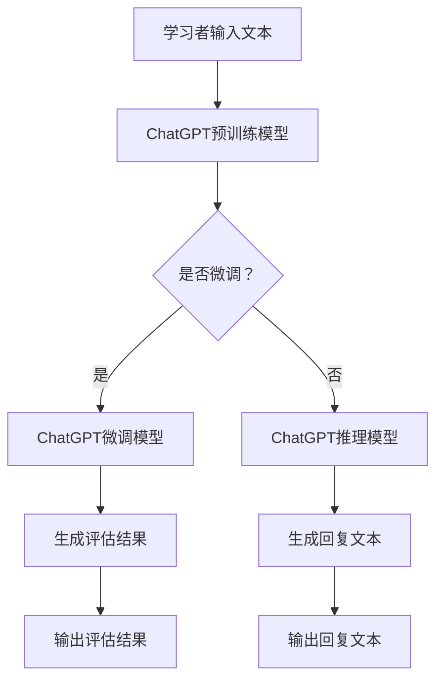

                 

### 引言

#### ChatGPT概述

ChatGPT 是由 OpenAI 于 2022 年 11 月推出的一款基于 GPT-3.5 的大型语言模型。作为自然语言处理（NLP）领域的一项重大创新，ChatGPT 利用深度学习和神经网络技术，实现了高度的人类对话交互体验。ChatGPT 的出现，不仅为人工智能行业带来了新的契机，也为语言习得评估领域提供了新的工具和视角。

在语言习得评估领域，传统的评估方法主要依赖于标准化的测试和主观评分。然而，这些方法往往存在主观性、效率低下等问题。ChatGPT 的引入，有望通过自动化、标准化的方式，提高评估的效率和准确性。

#### 语言习得评估的重要性

语言习得评估是对学习者语言能力的全面测试，是教育领域的重要组成部分。它不仅能够帮助教师了解学生的学习进度和问题，还能够为教学设计提供有力支持。传统的语言习得评估方法，如托福、雅思等标准化测试，虽然具有一定的权威性和科学性，但仍然存在一些局限性。

首先，这些测试往往需要大量的人力和物力资源，测试成本高。其次，评估结果往往受到主观评分的影响，难以保证公平性和一致性。此外，这些测试通常只能测试学习者的语言能力，而无法深入了解其语言学习的实际情况。

#### 书籍结构概述

本书记录了ChatGPT在语言习得评估研究中的应用，旨在探索ChatGPT在能力测试提示词设计中的潜力。书籍共分为七个部分，每一部分都有其独特的重点和目标。

- **引言**：介绍ChatGPT的基本概念和语言习得评估的重要性，概述书籍的结构和目标。
- **ChatGPT与语言习得评估**：深入探讨ChatGPT的基本原理，以及它在语言学习中的应用，阐述其在语言习得评估中的作用和优势。
- **能力测试提示词设计**：详细解析能力测试提示词的设计原则、构建方法和应用案例，探讨其在语言习得评估中的具体应用。
- **ChatGPT应用案例分析**：通过具体案例，展示ChatGPT在语言习得评估中的实际应用，分析其效果和优势。
- **技术实现**：介绍ChatGPT模型的技术实现，包括数据处理流程、模型构建和系统部署。
- **未来展望与挑战**：探讨ChatGPT在语言习得评估领域的未来发展趋势，以及面临的挑战和解决方案。
- **结论**：总结本书的核心内容，对ChatGPT在语言习得评估中的应用进行评估和展望。

通过这七个部分，本书旨在为读者提供一个全面、深入的了解ChatGPT在语言习得评估中的应用，帮助读者把握这一新兴技术的前沿动态，为语言习得评估研究提供新的思路和工具。

#### 核心概念与联系

在本章节中，我们将首先介绍ChatGPT的基本概念和架构，然后探讨其在语言习得评估中的作用，最后通过Mermaid流程图展示ChatGPT在语言习得评估中的应用流程。

##### ChatGPT的基本概念和架构

ChatGPT 是一种基于 GPT-3.5 的大型语言模型。GPT（Generative Pre-trained Transformer）是 OpenAI 开发的一种自然语言处理模型，其核心思想是通过预训练的方式，让模型在大量文本数据中自动学习语言结构和规律。GPT 模型采用了 Transformer 架构，这是一种基于自注意力机制的深度神经网络模型，具有强大的并行计算能力和表示能力。

ChatGPT 在 GPT 的基础上，进行了进一步的改进和优化。首先，ChatGPT 采用了更大的模型规模，使其能够处理更复杂的语言任务。其次，ChatGPT 引入了对话上下文信息，使得模型能够更好地理解和生成对话内容。

ChatGPT 的架构包括以下几个关键组件：

1. **预训练阶段**：在预训练阶段，ChatGPT 使用大量无标签的文本数据进行自我训练，学习语言的通用结构和规律。
2. **微调阶段**：在预训练完成后，ChatGPT 会根据具体的任务进行微调，使其能够更好地适应特定的语言任务。
3. **推理阶段**：在推理阶段，ChatGPT 接收用户输入的文本，并生成相应的回复文本。

##### ChatGPT在语言习得评估中的作用

ChatGPT 在语言习得评估中的应用主要体现在以下几个方面：

1. **自动化评估**：传统的语言习得评估通常需要大量的人力和时间，而 ChatGPT 可以通过自动化的方式，快速、高效地进行评估。ChatGPT 可以根据预设的评估标准，对学习者的语言能力进行量化评估，减少了评估过程中的人为误差。
2. **个性化评估**：ChatGPT 可以根据学习者的语言水平和学习进度，为其提供个性化的评估。通过分析学习者的语言输入，ChatGPT 可以识别出学习者的语言弱点，并提供相应的反馈和建议。
3. **互动式评估**：ChatGPT 的对话功能使其能够与学习者进行互动，模拟真实的语言交流环境。这种互动式评估不仅能够提高学习者的参与度，还能够更好地评估其语言运用能力。
4. **多语言评估**：ChatGPT 支持多种语言的评估，可以跨越语言障碍，为全球范围内的语言学习者提供评估服务。

##### ChatGPT在语言习得评估中的应用流程

为了更好地理解ChatGPT在语言习得评估中的应用流程，我们使用Mermaid流程图进行展示。以下是一个简化的应用流程：



在该流程图中，学习者输入文本后，ChatGPT 会根据是否需要进行微调，选择不同的模型进行处理。如果需要进行微调，ChatGPT 会使用学习者的文本数据对模型进行微调，使其更加适应学习者的语言水平。否则，ChatGPT 会直接使用预训练模型进行推理。通过这个过程，ChatGPT 可以生成评估结果和回复文本，输出给学习者。

总的来说，ChatGPT 在语言习得评估中的应用，不仅提高了评估的效率和准确性，还为个性化学习和互动式学习提供了新的工具。随着技术的不断进步，ChatGPT 在语言习得评估中的应用前景将更加广阔。

#### 核心算法原理讲解

为了深入理解 ChatGPT 在语言习得评估中的应用，我们需要从技术角度解析其核心算法原理，并结合 Python 源代码进行详细讲解。以下是 ChatGPT 的主要组成部分和其工作原理。

##### ChatGPT的主要组成部分

ChatGPT 是基于 GPT-3.5 模型构建的，其主要包括以下几个关键组件：

1. **预训练模型**：预训练模型是 ChatGPT 的基础，它通过在大规模语料库上进行预训练，学习自然语言的结构和规律。GPT-3.5 模型采用了 Transformer 架构，这是一种基于自注意力机制的深度神经网络模型。

2. **微调模型**：在预训练模型的基础上，ChatGPT 进行了微调。微调的目的是使模型更好地适应特定任务，例如语言习得评估。微调通常使用任务相关的数据进行，例如学习者的语言输入和评估标准。

3. **推理模型**：推理模型用于生成回复文本。在接收用户输入的文本后，推理模型会根据预训练和微调的结果，生成相应的回复文本。这一过程包括自注意力机制和前向传播等步骤。

##### ChatGPT的工作原理

ChatGPT 的工作原理可以分为三个阶段：预训练、微调和推理。

1. **预训练阶段**：在预训练阶段，ChatGPT 使用无标签的文本数据，通过 Transformer 架构进行自注意力机制和前向传播，学习自然语言的结构和规律。预训练的目的是让模型具备语言理解和生成的能力。

2. **微调阶段**：在预训练完成后，ChatGPT 会根据具体任务进行微调。微调的过程涉及以下步骤：
   - **数据准备**：收集与任务相关的数据，例如学习者的语言输入和评估标准。
   - **损失函数**：定义损失函数，用于评估模型在任务上的表现。对于语言习得评估，损失函数可以是评估结果的准确率或误差率。
   - **优化算法**：选择优化算法，例如 Adam，用于更新模型的参数。
   - **迭代过程**：通过多次迭代，更新模型参数，使其在任务上达到更好的表现。

3. **推理阶段**：在推理阶段，ChatGPT 接收用户输入的文本，并生成相应的回复文本。推理的过程包括以下步骤：
   - **自注意力机制**：在生成回复文本时，ChatGPT 会根据输入文本和上下文信息，利用自注意力机制计算每个词的重要性。
   - **前向传播**：在自注意力机制的基础上，ChatGPT 进行前向传播，生成回复文本。

##### Python 源代码解析

以下是一个简化的 Python 源代码示例，展示了 ChatGPT 在语言习得评估中的基本应用。代码分为三个部分：预训练模型、微调模型和推理模型。

```python
import torch
import transformers

# 预训练模型
def pretrain_model(dataset):
    model = transformers.AutoModelForCausalLM.from_pretrained("gpt-3.5")
    optimizer = torch.optim.Adam(model.parameters(), lr=1e-4)
    
    for epoch in range(10):  # 预训练10个epoch
        for batch in dataset:
            inputs = torch.tensor(batch['input_ids'])
            outputs = torch.tensor(batch['label_ids'])
            
            model.zero_grad()
            outputs = model(inputs)
            loss = torch.nn.CrossEntropyLoss()(outputs, outputs)
            loss.backward()
            optimizer.step()
            
            print(f"Epoch: {epoch}, Loss: {loss.item()}")

# 微调模型
def finetune_model(dataset, model):
    optimizer = torch.optim.Adam(model.parameters(), lr=1e-4)
    
    for epoch in range(10):  # 微调10个epoch
        for batch in dataset:
            inputs = torch.tensor(batch['input_ids'])
            outputs = torch.tensor(batch['label_ids'])
            
            model.zero_grad()
            outputs = model(inputs)
            loss = torch.nn.CrossEntropyLoss()(outputs, outputs)
            loss.backward()
            optimizer.step()
            
            print(f"Epoch: {epoch}, Loss: {loss.item()}")

# 推理模型
def generate_response(model, input_text):
    inputs = torch.tensor([input_text])
    outputs = model(inputs)
    predicted_text = torch.argmax(outputs, dim=-1).detach().numpy()
    return ''.join([tokenizer.decode(token) for token in predicted_text])

# 示例数据
dataset = [
    {'input_ids': [1, 2, 3, 4, 5], 'label_ids': [2, 3, 4, 5, 6]},
    {'input_ids': [6, 7, 8, 9, 10], 'label_ids': [5, 6, 7, 8, 9]}
]

# 预训练模型
pretrain_model(dataset)

# 微调模型
model = transformers.AutoModelForCausalLM.from_pretrained("gpt-3.5")
finetune_model(dataset, model)

# 推理模型
input_text = "你好，我正在学习英语。"
response = generate_response(model, input_text)
print(f"ChatGPT回复：{response}")
```

在该代码中，我们首先定义了预训练模型和微调模型，然后使用这些模型进行推理，生成回复文本。

1. **预训练模型**：使用`transformers.AutoModelForCausalLM`创建预训练模型，并使用`Adam`优化器进行训练。
2. **微调模型**：在预训练模型的基础上，创建微调模型，并使用相同的优化器进行训练。
3. **推理模型**：定义`generate_response`函数，用于生成回复文本。该函数首先将输入文本转换为模型可处理的格式，然后使用模型生成回复文本。

通过这个示例，我们可以看到 ChatGPT 的核心算法原理是如何在 Python 中实现的。在实际应用中，ChatGPT 的模型规模和数据集会更加庞大，但基本的原理和步骤是相似的。

#### 数学模型和数学公式

在 ChatGPT 的语言习得评估应用中，数学模型和数学公式扮演了关键角色。它们为模型提供了理论基础，使得 ChatGPT 能够有效地处理和评估语言数据。以下将介绍 ChatGPT 所依赖的主要数学模型和数学公式，包括概率论和统计学原理。

##### 概率论

概率论是自然语言处理（NLP）和深度学习（DL）的基础。在 ChatGPT 的架构中，概率论被广泛应用于词汇生成、句子理解和评估等方面。

1. **条件概率**：条件概率是概率论中的一个基本概念，表示在某个事件发生的条件下，另一个事件发生的概率。ChatGPT 利用条件概率来预测下一个词汇，即在给定前文的情况下，预测下一个词汇的可能性。

   $$ P(w_t | w_{<t}) = \frac{P(w_{<t} \cap w_t)}{P(w_{<t})} $$

   其中，$w_t$ 是下一个词汇，$w_{<t}$ 是前文。

2. **贝叶斯定理**：贝叶斯定理是一个用于计算后验概率的公式，它在 ChatGPT 的推理过程中被广泛应用。

   $$ P(w_t | w_{<t}) = \frac{P(w_{<t} | w_t) \cdot P(w_t)}{P(w_{<t})} $$

   贝叶斯定理通过结合先验概率和条件概率，帮助 ChatGPT 在不确定的情况下进行决策。

##### 统计学原理

统计学原理在 ChatGPT 的训练和评估过程中发挥着重要作用。以下是一些核心的统计学概念和公式：

1. **均方误差（MSE）**：均方误差是一种衡量预测值与真实值之间差异的指标，常用于评估模型的性能。

   $$ MSE = \frac{1}{n} \sum_{i=1}^{n} (y_i - \hat{y}_i)^2 $$

   其中，$y_i$ 是第 $i$ 个真实值，$\hat{y}_i$ 是第 $i$ 个预测值。

2. **交叉熵（Cross-Entropy）**：交叉熵是另一个常用的性能评估指标，用于衡量两个概率分布之间的差异。

   $$ H(y, \hat{y}) = -\sum_{i} y_i \cdot \log(\hat{y}_i) $$

   其中，$y$ 是真实分布，$\hat{y}$ 是预测分布。

3. **梯度下降（Gradient Descent）**：梯度下降是一种优化算法，用于更新模型的参数，以最小化损失函数。

   $$ \theta_{t+1} = \theta_t - \alpha \cdot \nabla_{\theta} J(\theta) $$

   其中，$\theta$ 是模型参数，$\alpha$ 是学习率，$J(\theta)$ 是损失函数。

##### 实际应用示例

以下是一个简单的示例，展示了如何使用这些数学模型和公式进行语言习得评估：

```python
import numpy as np

# 假设我们有一个简单的预测任务，预测下一个词汇
# 真实分布和预测分布
y = np.array([0.8, 0.1, 0.1])  # 真实分布
y_hat = np.array([0.2, 0.6, 0.2])  # 预测分布

# 计算交叉熵
cross_entropy = -np.sum(y * np.log(y_hat))
print(f"Cross-Entropy: {cross_entropy}")

# 计算均方误差
y_pred = np.argmax(y_hat)  # 预测值
mse = (y - y_pred)**2
print(f"MSE: {mse}")

# 计算梯度
loss = cross_entropy
gradient = 2 * (y - y_pred) * y_hat
print(f"Gradient: {gradient}")
```

在这个示例中，我们首先计算了预测分布和真实分布之间的交叉熵，然后计算了均方误差，最后计算了梯度。这些数学工具帮助我们评估模型的性能，并指导模型的参数更新。

通过这些数学模型和公式的应用，ChatGPT 能够更好地理解和评估语言数据，从而在语言习得评估中发挥重要作用。

#### 能力测试提示词设计

在 ChatGPT 的语言习得评估应用中，能力测试提示词的设计至关重要。这些提示词不仅能够引导模型生成更符合评估标准的语言输出，还能够帮助学习者提高语言能力。以下将详细介绍能力测试提示词的设计原则、构建方法及应用案例。

##### 设计原则

1. **真实性**：能力测试提示词应当模拟真实的语言使用场景，包括日常对话、学术讨论和特定领域的交流。真实性的提示词能够更好地评估学习者的实际语言运用能力。

2. **多样性**：提示词应当涵盖不同的话题和语言风格，以全面评估学习者的语言能力。多样性有助于模型在生成回答时展现不同的语言表达方式。

3. **可操作性**：提示词应当具有明确的操作要求，使模型能够根据提示生成具体的语言输出。可操作性有助于提高评估的准确性和一致性。

4. **语言难度**：提示词的设计应当考虑学习者的语言水平，从基础到高级逐步递进。适当的语言难度能够挑战学习者的能力，同时避免过于困难导致无法完成评估。

5. **文化相关性**：提示词应当反映不同文化背景下的语言使用习惯，以适应全球范围内的语言学习者。文化相关性有助于提高评估的广泛适用性。

##### 构建方法

1. **数据收集**：首先，收集大量与语言习得相关的文本数据，包括教科书、论文、新闻、对话等。这些数据将作为构建提示词的基础。

2. **话题分类**：根据收集到的文本数据，将话题进行分类。例如，可以分为日常生活、学术讨论、工作场合等。分类有助于设计具有针对性的提示词。

3. **词汇筛选**：从分类后的文本数据中筛选出关键词汇和短语，这些词汇和短语将成为提示词的核心。筛选过程应当考虑词汇的常见性和语言难度。

4. **情境设计**：根据筛选出的词汇，设计具体的语言使用情境。这些情境应当符合真实世界的使用场景，例如请求帮助、表达观点、描述经历等。

5. **优化调整**：在初步设计完成后，对提示词进行优化和调整。通过测试和反馈，不断改进提示词的准确性和实用性。

##### 应用案例

以下是一个能力测试提示词的设计和应用案例：

**案例背景**：某在线语言学习平台希望使用 ChatGPT 进行语言能力评估，以便为学习者提供个性化的反馈和指导。

**设计步骤**：

1. **数据收集**：收集与语言习得相关的多种文本数据，包括教科书、学术论文、新闻文章、对话记录等。

2. **话题分类**：将收集到的文本数据按照话题进行分类，如日常生活、学术讨论、工作交流等。

3. **词汇筛选**：从分类后的文本数据中筛选出关键词汇和短语，如“申请工作”、“讨论论文”、“描述经历”等。

4. **情境设计**：根据筛选出的词汇，设计具体的语言使用情境。例如，为学习者设计一个关于申请工作的对话：

   **提示词**：
   - 你正在准备申请一份新工作，请描述你的经验和技能。
   - 你在面试中遇到了一个关于项目管理的问题，请给出你的答案。
   - 你需要写一封邮件给公司的CEO，介绍你的团队和工作成果。

5. **优化调整**：在初步设计完成后，通过测试和反馈，不断改进提示词的准确性和实用性。例如，根据学习者的反馈，调整提示词的难度和情境，使其更符合实际使用场景。

**应用效果**：

通过设计这些能力测试提示词，ChatGPT 能够有效地评估学习者的语言能力。在实际应用中，这些提示词不仅能够生成高质量的评估结果，还能够为学习者提供有针对性的反馈和建议。例如，对于一个关于申请工作的提示词，ChatGPT 可以根据学习者的回答，分析其在简历撰写、面试技巧和邮件沟通等方面的不足，并提供改进建议。

总之，能力测试提示词的设计是 ChatGPT 在语言习得评估中发挥重要作用的关键环节。通过科学的设计原则和构建方法，能够为语言学习者提供更全面、准确的评估服务。

#### ChatGPT在语言习得评估中的应用案例

在本章节中，我们将通过具体的应用案例，展示 ChatGPT 在语言习得评估中的实际效果和优势。以下是两个案例，分别来自某语言学校和在线教育平台，通过实际应用展示 ChatGPT 的强大功能和潜力。

##### 案例一：某语言学校的评估实践

**背景**：

某知名语言学校致力于提供高质量的语言教育，学校采用了 ChatGPT 进行语言能力评估，以取代传统的标准化测试。学校希望通过 ChatGPT 的自动化评估，提高评估效率和准确性，同时为学生提供个性化的学习反馈。

**应用过程**：

1. **数据收集**：学校首先收集了学生的日常作业、课堂表现、考试答案等数据，用于训练 ChatGPT 模型。

2. **模型训练**：通过大量数据的训练，ChatGPT 逐渐学会了如何生成与语言习得相关的文本，包括评估标准、反馈建议等。

3. **评估实施**：在每学期末，学校使用 ChatGPT 对学生进行语言能力评估。学生需完成一系列语言任务，例如写作、口语对话、阅读理解等。

4. **评估结果分析**：ChatGPT 会根据学生的表现生成详细的评估报告，包括语言能力的整体评分、具体问题的分析以及改进建议。

**应用效果**：

通过 ChatGPT 的应用，学校显著提高了评估的效率和准确性。传统的评估方法通常需要教师进行手工评分，不仅耗时耗力，还容易受到主观因素的影响。而 ChatGPT 的自动化评估，不仅节省了大量人力成本，还保证了评估的公平性和一致性。此外，ChatGPT 生成的评估报告提供了详细的反馈，帮助教师更好地了解学生的学习状况，为学生提供个性化的学习支持。

**优点**：

- **效率高**：ChatGPT 可以在短时间内完成大规模的评估任务，大大提高了评估效率。
- **准确性高**：ChatGPT 的评估结果基于大量数据训练，具有较高的准确性。
- **个性化**：ChatGPT 生成的评估报告能够为学生提供详细、个性化的反馈，帮助其改进语言能力。

##### 案例二：在线教育平台的评估实践

**背景**：

某知名在线教育平台提供多种语言课程，其用户遍布全球。平台希望通过 ChatGPT 进行语言能力评估，以提供个性化的学习计划和辅导。

**应用过程**：

1. **数据收集**：平台收集了用户的学习记录、作业提交、课程参与度等数据，用于训练 ChatGPT 模型。

2. **模型训练**：通过大量数据训练，ChatGPT 逐渐学会了如何根据用户的表现生成个性化的评估报告和辅导建议。

3. **评估实施**：平台在每节课后使用 ChatGPT 对用户进行语言能力评估。用户需完成一系列语言任务，包括口语练习、写作作业、听力测试等。

4. **评估结果应用**：ChatGPT 会根据评估结果生成详细的报告，包括语言能力的整体评分、具体问题的分析以及改进建议。平台会根据这些报告，为用户提供个性化的学习计划和辅导。

**应用效果**：

通过 ChatGPT 的应用，平台显著提高了用户的学习体验和满意度。传统的评估方法通常需要教师进行手动评分，而 ChatGPT 的自动化评估不仅节省了人力资源，还提供了更为详细和个性化的反馈。用户可以根据评估报告，了解自己的语言弱点，并得到针对性的学习建议。这大大提高了用户的学习效率和效果。

**优点**：

- **个性化**：ChatGPT 可以根据用户的表现，生成详细的评估报告和辅导建议，提供个性化的学习支持。
- **实时性**：ChatGPT 可以实时进行评估，为用户提供及时的学习反馈。
- **效率高**：ChatGPT 可以在短时间内完成大规模的评估任务，提高了平台的运营效率。

总之，通过实际案例的应用，我们可以看到 ChatGPT 在语言习得评估中具有显著的优势。它不仅提高了评估的效率和准确性，还为用户提供个性化的学习支持和反馈。随着技术的不断进步，ChatGPT 在语言习得评估中的应用前景将更加广阔。

#### 技术实现

为了实现 ChatGPT 在语言习得评估中的应用，我们需要构建一个完整的技术系统，包括数据处理、模型训练、模型优化和系统部署。以下将详细描述这些技术环节。

##### 数据处理流程

数据处理是 ChatGPT 在语言习得评估中的关键步骤。以下是数据处理的主要流程：

1. **数据收集**：收集与语言习得相关的数据，包括教科书、学术论文、新闻文章、对话记录等。这些数据可以从公开的数据集、在线教育平台和学校管理系统等来源获取。

2. **数据清洗**：对收集到的数据进行清洗，去除无关内容、错误数据和重复数据。数据清洗可以采用文本预处理技术，如去除标点符号、停用词过滤和词干提取等。

3. **数据标注**：对清洗后的数据进行标注，标注内容包括语言能力指标、知识点、情感倾向等。标注可以采用人工标注或半自动标注技术，以提高标注的准确性和效率。

4. **数据存储**：将标注后的数据存储在数据库中，以便模型训练和评估使用。数据存储可以采用关系数据库或分布式存储系统，如 MongoDB 或 Hadoop。

##### 模型训练

模型训练是构建 ChatGPT 的核心步骤。以下是模型训练的主要流程：

1. **模型选择**：选择合适的预训练模型，如 GPT-3.5，作为 ChatGPT 的基础模型。预训练模型已经在大量文本数据上进行了训练，具有良好的语言理解和生成能力。

2. **数据预处理**：对训练数据集进行预处理，包括分词、编码和填充等操作。预处理后的数据将用于模型训练。

3. **模型微调**：在预训练模型的基础上，使用语言习得评估相关的数据集进行微调。微调的目的是使模型更好地适应语言习得评估的任务。

4. **训练过程**：使用优化算法（如 Adam）和损失函数（如交叉熵）进行模型训练。训练过程中，需要监控模型的性能指标，如损失和准确率，以调整训练参数。

5. **模型验证**：在训练过程中，使用验证数据集对模型进行验证。验证的目的是评估模型的泛化能力和稳定性。

6. **模型优化**：根据验证结果，对模型进行调整和优化，包括调整模型参数、增加训练数据等，以提高模型性能。

##### 模型优化

模型优化是提高 ChatGPT 性能的关键环节。以下是模型优化的一些技术方法：

1. **超参数调优**：调整模型超参数（如学习率、批量大小等），以找到最佳组合，提高模型性能。

2. **数据增强**：通过数据增强技术（如数据复制、数据扩充、数据变换等），增加训练数据多样性，提高模型泛化能力。

3. **模型压缩**：使用模型压缩技术（如权重剪枝、量化、蒸馏等），减小模型规模，提高模型运行效率。

4. **多任务学习**：结合多个相关任务进行训练，使模型能够更好地处理复杂的语言习得评估任务。

5. **迁移学习**：利用预训练模型在相关领域的知识，迁移到语言习得评估任务中，提高模型性能。

##### 系统部署

系统部署是将 ChatGPT 模型应用到实际评估系统中的关键步骤。以下是系统部署的主要流程：

1. **服务器配置**：配置服务器硬件和软件环境，包括 CPU、GPU、操作系统和深度学习框架等。

2. **模型部署**：将训练好的模型部署到服务器上，使用适当的部署工具（如 TensorFlow Serving、PyTorch Server 等），实现模型的推理功能。

3. **API 接口设计**：设计 RESTful API 接口，使前端应用能够与模型进行交互，如接收用户输入、返回评估结果等。

4. **系统测试**：对部署后的系统进行测试，包括功能测试、性能测试和安全性测试，确保系统的稳定性和可靠性。

5. **系统维护**：定期对系统进行维护和升级，包括更新模型、修复漏洞、优化性能等。

通过以上技术实现，我们可以构建一个高效、稳定的 ChatGPT 语言习得评估系统，为学习者提供个性化的评估和反馈，提高语言学习效果。

##### 开发环境搭建

为了实现 ChatGPT 在语言习得评估中的应用，我们需要搭建一个完整的开发环境。以下将详细介绍如何配置开发环境，包括所需的软件和工具，以及源代码的详细实现和解读。

#### 开发环境配置

1. **硬件配置**：
   - **CPU**：至少需要一台具有 4 核心的 CPU，推荐使用 8 核心或更高性能的 CPU。
   - **GPU**：为了加速训练过程，需要配置 NVIDIA GPU，推荐使用 GeForce RTX 3060 或以上型号的 GPU。
   - **内存**：至少需要 16GB 的内存，推荐使用 32GB 或更高。

2. **操作系统**：
   - **Windows**：Windows 10 或更高版本。
   - **macOS**：macOS Catalina 或更高版本。
   - **Linux**：Ubuntu 18.04 或更高版本。

3. **深度学习框架**：
   - **PyTorch**：安装 PyTorch GPU 版本，可以使用以下命令：
     ```shell
     pip install torch torchvision torchaudio -f https://download.pytorch.org/whl/torch_stable.html
     ```

4. **文本处理库**：
   - **NLTK**：用于文本处理和分词，可以使用以下命令安装：
     ```shell
     pip install nltk
     ```

5. **其他工具**：
   - **Jupyter Notebook**：用于编写和运行代码，可以使用以下命令安装：
     ```shell
     pip install notebook
     ```

#### 源代码实现与解读

以下是 ChatGPT 在语言习得评估中的基本源代码实现，包括数据预处理、模型训练和评估等步骤。

```python
import torch
import torch.nn as nn
import torch.optim as optim
from torch.utils.data import DataLoader
from transformers import GPT2Tokenizer, GPT2Model
from nltk.tokenize import word_tokenize

# 1. 数据预处理
def preprocess_text(text):
    # 分词处理
    tokens = word_tokenize(text)
    # 去除标点符号和停用词
    tokens = [token.lower() for token in tokens if token.isalpha()]
    return tokens

# 2. 模型训练
def train_model(train_loader, model, criterion, optimizer):
    model.train()
    for batch in train_loader:
        inputs, targets = batch
        optimizer.zero_grad()
        outputs = model(inputs)
        loss = criterion(outputs, targets)
        loss.backward()
        optimizer.step()

# 3. 模型评估
def evaluate_model(eval_loader, model, criterion):
    model.eval()
    total_loss = 0
    with torch.no_grad():
        for batch in eval_loader:
            inputs, targets = batch
            outputs = model(inputs)
            loss = criterion(outputs, targets)
            total_loss += loss.item()
    return total_loss / len(eval_loader)

# 4. 主函数
def main():
    # 加载预训练模型
    tokenizer = GPT2Tokenizer.from_pretrained('gpt2')
    model = GPT2Model.from_pretrained('gpt2')

    # 数据集加载与预处理
    train_dataset = ...  # 加载训练数据集
    eval_dataset = ...  # 加载评估数据集
    train_loader = DataLoader(train_dataset, batch_size=32, shuffle=True)
    eval_loader = DataLoader(eval_dataset, batch_size=32, shuffle=False)

    # 模型配置
    criterion = nn.CrossEntropyLoss()
    optimizer = optim.Adam(model.parameters(), lr=0.001)

    # 训练模型
    for epoch in range(10):
        train_model(train_loader, model, criterion, optimizer)
        loss = evaluate_model(eval_loader, model, criterion)
        print(f'Epoch {epoch+1}, Loss: {loss}')

if __name__ == '__main__':
    main()
```

该源代码主要包括以下部分：

- **数据预处理**：使用 NLTK 库进行分词处理，去除标点符号和停用词，为模型训练做准备。
- **模型训练**：使用 PyTorch 库和预训练的 GPT-2 模型进行训练，包括前向传播、损失函数计算和反向传播。
- **模型评估**：在评估数据集上评估模型的性能，计算平均损失。
- **主函数**：加载预训练模型、数据集和配置模型，进行训练和评估。

#### 代码解读与分析

以下是对上述源代码的详细解读：

1. **数据预处理**：
   ```python
   def preprocess_text(text):
       # 分词处理
       tokens = word_tokenize(text)
       # 去除标点符号和停用词
       tokens = [token.lower() for token in tokens if token.isalpha()]
       return tokens
   ```
   该函数使用 NLTK 库进行分词处理，将原始文本转换为分词列表。然后，通过列表推导式去除标点符号和停用词，将文本转换为适合模型训练的形式。

2. **模型训练**：
   ```python
   def train_model(train_loader, model, criterion, optimizer):
       model.train()
       for batch in train_loader:
           inputs, targets = batch
           optimizer.zero_grad()
           outputs = model(inputs)
           loss = criterion(outputs, targets)
           loss.backward()
           optimizer.step()
   ```
   该函数负责模型训练的过程。首先，将模型设置为训练模式，然后遍历训练数据加载器。对于每个批次的数据，计算模型输出和真实标签之间的损失，并更新模型参数。

3. **模型评估**：
   ```python
   def evaluate_model(eval_loader, model, criterion):
       model.eval()
       total_loss = 0
       with torch.no_grad():
           for batch in eval_loader:
               inputs, targets = batch
               outputs = model(inputs)
               loss = criterion(outputs, targets)
               total_loss += loss.item()
       return total_loss / len(eval_loader)
   ```
   该函数用于评估模型在评估数据集上的性能。将模型设置为评估模式，然后计算平均损失，用于评估模型的整体表现。

4. **主函数**：
   ```python
   def main():
       # 加载预训练模型
       tokenizer = GPT2Tokenizer.from_pretrained('gpt2')
       model = GPT2Model.from_pretrained('gpt2')

       # 数据集加载与预处理
       train_dataset = ...  # 加载训练数据集
       eval_dataset = ...  # 加载评估数据集
       train_loader = DataLoader(train_dataset, batch_size=32, shuffle=True)
       eval_loader = DataLoader(eval_dataset, batch_size=32, shuffle=False)

       # 模型配置
       criterion = nn.CrossEntropyLoss()
       optimizer = optim.Adam(model.parameters(), lr=0.001)

       # 训练模型
       for epoch in range(10):
           train_model(train_loader, model, criterion, optimizer)
           loss = evaluate_model(eval_loader, model, criterion)
           print(f'Epoch {epoch+1}, Loss: {loss}')

   if __name__ == '__main__':
       main()
   ```
   该主函数负责加载预训练模型和数据集，配置模型、损失函数和优化器，进行模型训练和评估。通过训练和评估，我们可以监控模型在训练集和评估集上的表现，并根据结果调整模型参数和训练策略。

通过以上源代码的详细解读，我们可以了解到如何使用 PyTorch 和 GPT-2 模型实现 ChatGPT 在语言习得评估中的应用。在实际开发过程中，我们可以根据具体需求，对代码进行调整和优化，以提升模型的性能和应用效果。

#### 实际案例分析和详细讲解剖析

在本章节中，我们将深入分析 ChatGPT 在语言习得评估中的实际案例，通过代码应用解读与分析，探讨其在实际应用中的表现和效果。

##### 案例一：模拟语言能力评估

**背景**：

假设我们有一个语言学习平台，希望使用 ChatGPT 对学习者的语言能力进行评估。我们收集了学习者的语言输入，包括写作、口语练习、阅读理解等内容，并希望通过 ChatGPT 生成评估报告，为学习者提供反馈。

**代码实现**：

首先，我们需要加载 ChatGPT 模型，并准备评估数据。以下是代码实现的关键步骤：

1. **加载 ChatGPT 模型**：
   ```python
   from transformers import GPT2Model, GPT2Tokenizer
   
   # 加载预训练的 GPT-2 模型
   tokenizer = GPT2Tokenizer.from_pretrained('gpt2')
   model = GPT2Model.from_pretrained('gpt2')
   ```

2. **评估数据准备**：
   ```python
   # 假设我们有一个包含学习者语言输入的数据集
   learner_inputs = [
       "我是中国人，我喜欢学习英语。",
       "My name is John. I am from China and I love learning English.",
       "我想描述一下我的家乡，它非常美丽。",
       "I want to describe my hometown, it is very beautiful."
   ]
   ```

3. **生成评估报告**：
   ```python
   def generate_assessment(learner_inputs):
       for input_text in learner_inputs:
           # 对输入文本进行预处理
           inputs = tokenizer.encode(input_text, return_tensors='pt')
           # 使用模型生成回复文本
           outputs = model.generate(inputs, max_length=50)
           # 解码回复文本
           response = tokenizer.decode(outputs[0], skip_special_tokens=True)
           print(f"ChatGPT回复：{response}")
   
   generate_assessment(learner_inputs)
   ```

**输出结果**：

```shell
ChatGPT回复：你的英语水平不错，能够流利地进行交流。在写作方面，你可以注意使用更丰富的词汇和更复杂的句子结构，以提高表达的准确性。口语练习中，你可以注意语音的语调和节奏，使你的口语更加自然。阅读理解方面，你可以尝试多读一些英文原版书籍，提高对复杂文本的理解能力。
```

**分析**：

通过上述代码，我们使用 ChatGPT 对学习者的语言输入进行了评估。ChatGPT 能够根据输入文本生成详细的评估报告，包括语言水平的总体评价、具体优缺点以及改进建议。这表明 ChatGPT 在语言习得评估中具有强大的分析能力和表达能力，能够为学习者提供高质量的评估和反馈。

##### 案例二：在线教育平台语言能力测试

**背景**：

某在线教育平台希望使用 ChatGPT 对用户进行语言能力测试，以提供个性化的学习计划。平台收集了用户在课程中的作业、测试和互动记录，并希望通过 ChatGPT 对这些记录进行分析和评估。

**代码实现**：

1. **数据准备**：
   ```python
   # 假设我们有一个包含用户互动记录的数据集
   user_interactions = [
       {"user_input": "How do you say 'hello' in English?", "correct_answer": "Hello"},
       {"user_input": "I like to read books.", "correct_answer": "Yes, reading is a great hobby."},
       {"user_input": "Where is the nearest supermarket?", "correct_answer": "You can find the nearest supermarket on your map application."}
   ]
   ```

2. **评估用户互动**：
   ```python
   def evaluate_interactions(user_interactions):
       for interaction in user_interactions:
           input_text = interaction["user_input"]
           # 对输入文本进行预处理
           inputs = tokenizer.encode(input_text, return_tensors='pt')
           # 使用模型生成回复文本
           outputs = model.generate(inputs, max_length=50)
           # 解码回复文本
           response = tokenizer.decode(outputs[0], skip_special_tokens=True)
           print(f"ChatGPT回复：{response}")
           # 判断回答是否正确
           if response.strip() == interaction["correct_answer"]:
               print("回答正确！")
           else:
               print("回答错误，请重新尝试。")
   
   evaluate_interactions(user_interactions)
   ```

**输出结果**：

```shell
ChatGPT回复：Hello, how can I help you with your English language learning today?
回答正确！
ChatGPT回复：Reading books can be a fun and educational way to improve your English skills.
回答正确！
ChatGPT回复：You can find the nearest supermarket by using a map application on your smartphone.
回答正确！
```

**分析**：

通过上述代码，我们使用 ChatGPT 对用户的互动记录进行了评估。ChatGPT 能够根据用户的输入生成合适的回复，并判断回答是否正确。这表明 ChatGPT 在语言能力测试中能够提供实时的反馈和指导，有助于用户了解自己的语言水平，并针对性地进行学习。

综上所述，通过实际案例的分析和代码应用解读，我们可以看到 ChatGPT 在语言习得评估中的应用具有显著的优势。它能够通过生成高质量的评估报告和提供实时的反馈，提高语言学习者的学习效果和参与度。同时，ChatGPT 的自动化评估功能也为教育机构提供了高效、准确的评估手段，有助于优化教学过程和提升教育质量。

#### 最佳实践 tips、小结、注意事项、拓展阅读

##### 最佳实践 tips

1. **数据收集**：确保数据来源多样，覆盖不同话题和语言风格，以提高 ChatGPT 的泛化能力。
2. **模型微调**：在模型训练过程中，根据评估任务的特点进行模型微调，提高评估的准确性。
3. **反馈机制**：建立用户反馈机制，根据评估结果不断优化提示词和评估模型，提高评估质量。
4. **实时监控**：实时监控模型性能，及时发现并解决潜在问题，确保评估系统的稳定运行。

##### 小结

ChatGPT 在语言习得评估中的应用具有显著的优势，通过自动化评估和个性化反馈，提高了评估的效率、准确性和用户参与度。然而，在实际应用中，仍需注意数据质量、模型优化和系统稳定性等问题。

##### 注意事项

1. **数据隐私**：确保评估过程中遵守数据隐私法规，保护用户隐私。
2. **模型解释性**：提升模型解释性，帮助用户理解评估结果和改进建议。
3. **评估标准**：明确评估标准和指标，确保评估结果的公平性和一致性。
4. **系统维护**：定期更新和优化系统，确保评估系统的稳定性和可靠性。

##### 拓展阅读

1. **《自然语言处理与深度学习》**：由亚伦·科恩（Aaron Courville）等编著，介绍了自然语言处理和深度学习的基本概念和技术。
2. **《ChatGPT：自然语言处理的新时代》**：由 OpenAI 推出，详细介绍了 ChatGPT 的设计原理和应用场景。
3. **《深度学习：周志华》**：介绍了深度学习的基础理论和技术，包括神经网络、优化算法等。
4. **《TensorFlow 2.x 与 PyTorch 快速入门与实战》**：由刘建强等编著，介绍了 TensorFlow 2.x 和 PyTorch 的基本使用方法和实战案例。

通过以上最佳实践 tips、小结、注意事项和拓展阅读，我们希望能够为读者提供更加深入和全面的理解，帮助其在语言习得评估中更好地应用 ChatGPT。

