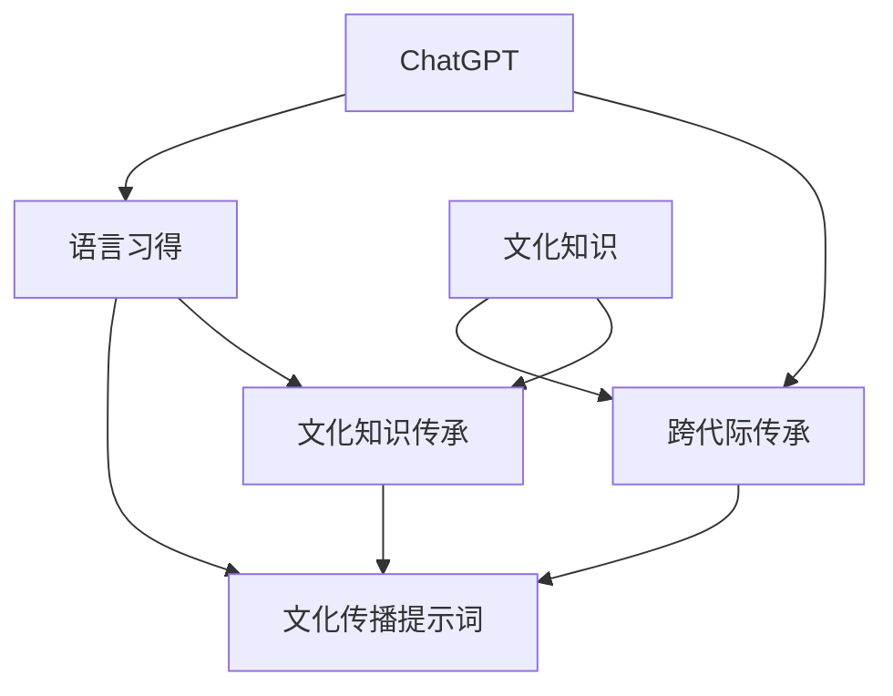

                 

### 背景介绍

在当今这个信息化和全球化的时代，语言习得与文化传播正经历着前所未有的变革。传统语言学习和文化传播的方式逐渐暴露出一些局限性，如学习资源的有限性、跨文化沟通的障碍、以及文化遗产传承的断层等问题。为此，如何借助先进技术提升语言习得效率和促进文化传播显得尤为重要。

语言习得跨代际传承是指语言技能和文化知识在不同代际之间的传递过程。这不仅关系到个体的语言能力发展，也涉及到文化多样性的维护与延续。而文化传播提示词则是为促进跨文化交流和文化传承提供的一种新型工具。通过使用特定的提示词，可以实现更加精准和有效的文化传播，从而提升跨代际语言习得的效果。

ChatGPT，作为一款基于生成式预训练模型的人工智能助手，具有强大的语言理解和生成能力。它的出现为语言习得和跨文化传播提供了新的可能性。ChatGPT不仅可以模仿人类的语言行为，还能通过学习和理解用户的需求，生成相关的内容和对话。这使得ChatGPT在语言习得跨代际传承和文化传播中的应用变得非常有前景。

本篇文章将深入探讨ChatGPT在语言习得跨代际传承中的应用，重点研究文化传播提示词的设计和使用方法。文章结构如下：

- **引言与基础理论**：介绍书籍背景、目标、ChatGPT简介、语言习得跨代际传承的概念以及文化传播提示词的作用。
- **ChatGPT技术原理**：讲解ChatGPT的基本架构、语言习得模型原理以及数学模型和公式。
- **ChatGPT在语言习得跨代际传承中的应用**：分析跨代际语言习得模式、讨论文化传播与语言习得的关系，以及ChatGPT的具体应用。
- **项目实战**：提供ChatGPT应用的开发环境搭建、源代码实现、代码解读与分析，以及实际案例。
- **未来展望与挑战**：讨论ChatGPT在语言习得跨代际传承中的未来发展以及面临的挑战。

通过以上结构和内容的逐步分析，我们将全面了解ChatGPT在语言习得跨代际传承和文化传播中的应用潜力，以及如何通过文化传播提示词提升其效果。

### 核心概念与联系

为了更好地理解ChatGPT在语言习得跨代际传承中的应用，首先需要明确一些核心概念，并探讨它们之间的相互联系。以下是一些关键概念及其相互关系的Mermaid流程图：

#### 关键概念

1. **ChatGPT**：一种基于生成式预训练模型的AI助手，能够通过理解和生成语言来进行交互。
2. **语言习得**：指学习语言的过程，包括听、说、读、写等技能。
3. **跨代际传承**：不同代际之间知识、文化、价值观等的传递。
4. **文化传播提示词**：用于引导ChatGPT生成特定文化相关内容的关键词。

#### Mermaid流程图

下面是一个Mermaid流程图，展示了这些核心概念及其相互关系：



#### 解释

- **ChatGPT** 是整个系统的核心，它通过学习和生成语言来辅助语言习得和文化传播。
- **语言习得** 是指个体学习语言的过程，它需要借助ChatGPT的支持来提高学习效率和效果。
- **跨代际传承** 是指知识、文化、价值观等在不同代际之间的传递。ChatGPT可以作为文化传承的工具，帮助实现更有效的跨代际交流。
- **文化传播提示词** 是用于引导ChatGPT生成特定文化相关内容的关键词。这些提示词能够帮助ChatGPT更好地理解和传达文化知识。

通过上述Mermaid流程图，我们可以清晰地看到这些核心概念之间的联系，以及它们在语言习得和文化传播中的作用。接下来，我们将进一步探讨ChatGPT的工作原理，以及它如何通过这些概念实现语言习得跨代际传承的目标。

### ChatGPT的基本架构

ChatGPT是一种基于生成式预训练模型（Generative Pre-trained Transformer）的人工智能助手，其核心架构由多个层次组成，每个层次都有特定的功能和作用。以下是对ChatGPT基本架构的详细描述，以及如何通过语言习得模型原理来实现其功能。

#### 架构组成部分

1. **输入层（Input Layer）**：ChatGPT的输入层接收用户输入的文本信息。这些输入可以是自然语言文本，如问题、请求或对话。输入文本通过嵌入（Embedding）机制转换为向量表示，以便于后续处理。

2. **嵌入层（Embedding Layer）**：输入文本向量被映射到高维空间，形成嵌入向量。这些向量包含了文本的语义信息，是模型理解语言的基础。

3. **自注意力机制（Self-Attention Mechanism）**：在Transformer模型中，自注意力机制允许模型在生成每个词时，考虑所有先前词的重要性。这一机制通过计算注意力权重，为每个词分配不同的权重，从而提高模型的上下文理解能力。

4. **编码层（Encoder Layer）**：编码层包含多个Transformer编码器块，每个块包括多头自注意力机制和前馈神经网络。编码器的输出是一个固定长度的向量，代表了输入文本的全局语义表示。

5. **解码层（Decoder Layer）**：与编码层类似，解码层也包含多个Transformer解码器块，用于生成文本响应。解码器在生成每个词时，不仅依赖当前输入，还依赖编码层的上下文信息。

6. **输出层（Output Layer）**：输出层将解码器的输出映射回词表，生成最终的文本响应。输出可以是自然语言文本，如回答、对话或故事。

#### 语言习得模型原理

1. **预训练（Pre-training）**：ChatGPT首先在大量未标注的文本数据上进行预训练，学习文本的通用语言特征和上下文关系。这一过程通常使用自回归语言模型（Autoregressive Language Model），其中模型预测下一个词的概率。

2. **微调（Fine-tuning）**：在预训练基础上，ChatGPT通过在特定任务上进行的微调，进一步提高其性能。例如，在语言习得任务中，模型可以通过学习标注数据，优化对特定语言规则的掌握。

3. **上下文理解（Contextual Understanding）**：ChatGPT通过自注意力机制和Transformer结构，能够理解输入文本的上下文关系，从而生成连贯和语义丰富的响应。

4. **生成式对话（Generative Dialogue）**：ChatGPT利用其语言生成能力，可以与用户进行自然对话，回答问题或生成故事。这一能力在语言习得中尤为重要，因为它可以为学习者提供丰富的语言输入。

#### 伪代码示例

以下是一个简化的ChatGPT伪代码示例，用于展示其工作原理：

```python
def generate_response(input_text):
    # 将输入文本转换为嵌入向量
    embedded_text = embedding_layer(input_text)
    
    # 经过自注意力机制和编码器处理
    encoded_text = []
    for encoder_block in encoder_layers:
        encoded_text.append(encoder_block(embedded_text))
    
    # 初始化解码器输入
    decoder_input = decoder_init(embedded_text[-1])
    
    # 生成文本响应
    response = []
    for decoder_block in decoder_layers:
        for _ in range(max_output_length):
            # 使用解码器块生成下一个词
            next_word = decoder_block(decoder_input)
            
            # 将生成的词添加到响应中
            response.append(next_word)
            
            # 更新解码器输入
            decoder_input = decoder_input + [next_word]
    
    # 将响应向量转换为文本
    generated_text = decode_output(response)
    
    return generated_text
```

在这个伪代码中，`generate_response`函数接收输入文本，并依次通过嵌入层、编码层和解码层，最终生成文本响应。

通过上述基本架构和语言习得模型原理的讲解，我们可以看到ChatGPT在语言习得中的应用潜力。它不仅可以辅助学习者提高语言技能，还能通过生成对话和文化传播提示词，促进跨代际的文化传承。接下来，我们将进一步探讨ChatGPT所依赖的数学模型和公式，以便更深入地理解其工作原理。

### 数学模型与数学公式

在深入探讨ChatGPT的工作原理之前，理解其背后的数学模型和公式是至关重要的。这些模型和公式不仅定义了ChatGPT如何学习语言，还决定了其生成文本的能力。以下将详细介绍支持ChatGPT模型训练的数学模型，并使用LaTeX格式展示关键数学公式，进行详细讲解和举例说明。

#### 语言模型的工作原理

ChatGPT的核心是一个基于Transformer的预训练语言模型。Transformer模型采用了一种自注意力机制（Self-Attention Mechanism），这使得模型能够捕捉长距离的依赖关系，从而生成语义丰富的文本。以下是一个简单的Transformer模型的工作原理：

1. **嵌入（Embedding）**：输入文本被转换为嵌入向量。这些向量包含了文本的语义信息。公式如下：

   $$
   \text{embeddings} = \text{Embedding Layer}(\text{input})
   $$

2. **位置编码（Positional Encoding）**：为了保持序列信息的顺序，Transformer模型使用位置编码向量。这些向量与嵌入向量相加，以提供位置信息。

   $$
   \text{pos_encoding} = \text{Positional Encoding}(\text{position})
   $$

   最终的嵌入向量可以表示为：

   $$
   \text{input_vector} = \text{embeddings} + \text{pos_encoding}
   $$

3. **自注意力（Self-Attention）**：自注意力机制允许模型在生成每个词时，考虑所有先前词的重要性。其核心公式是：

   $$
   \text{attention_scores} = \text{softmax}\left(\frac{\text{Q} \cdot \text{K}^T}{\sqrt{d_k}}\right)
   $$

   其中，\(Q\) 和 \(K\) 分别是查询（Query）和关键（Key）向量，\(d_k\) 是关键向量的维度。注意力得分表示每个关键向量与查询向量的相关性。

4. **前馈神经网络（Feedforward Neural Network）**：自注意力机制之后的每个头（Head）都通过一个前馈神经网络进行处理，公式如下：

   $$
   \text{output} = \text{FFNN}(\text{input} \cdot \text{activation})
   $$

   其中，\(\text{activation}\) 是激活函数，如ReLU或GELU。

#### 语言模型中的数学模型

在ChatGPT中，语言模型的训练通常基于最小化损失函数。以下是一些关键的数学模型和公式：

1. **损失函数（Loss Function）**：在自回归语言模型中，常见的损失函数是交叉熵损失（Cross-Entropy Loss）。其公式如下：

   $$
   \text{Loss} = -\sum_{i} y_i \cdot \log(\hat{y}_i)
   $$

   其中，\(y_i\) 是真实的标签，\(\hat{y}_i\) 是模型预测的概率分布。

2. **梯度下降（Gradient Descent）**：为了最小化损失函数，通常使用梯度下降算法。其公式如下：

   $$
   \theta_{\text{new}} = \theta_{\text{old}} - \alpha \cdot \nabla_\theta \text{Loss}
   $$

   其中，\(\theta\) 是模型参数，\(\alpha\) 是学习率。

3. **正则化（Regularization）**：为了防止过拟合，常用的正则化方法是L2正则化。其公式如下：

   $$
   \text{Loss} = \text{Cross-Entropy Loss} + \lambda \cdot \sum_{\theta} \theta^2
   $$

   其中，\(\lambda\) 是正则化参数。

#### 举例说明

以下是一个具体的例子，展示如何使用上述数学模型来训练一个简单的语言模型：

```python
import torch
import torch.nn as nn
import torch.optim as optim

# 假设我们有一个输入序列 "I am learning ChatGPT"

# 步骤1：将输入序列转换为嵌入向量
embeddings = [emb层的输出值]  # 嵌入层计算

# 步骤2：应用位置编码
pos_encoding = [pos编码的输出值]  # 位置编码计算
input_vector = [embeddings + pos_encoding]

# 步骤3：通过自注意力机制和前馈神经网络处理
for layer in [编码层和解码层]:
    input_vector = layer(input_vector)

# 步骤4：生成预测输出
logits = [模型输出的logits]
predicted_words = [softmax函数处理logits后的预测词]

# 步骤5：计算损失函数并更新模型参数
loss = nn.CrossEntropyLoss()(predicted_words, logits)
optimizer = optim.AdamW(model.parameters(), lr=0.001)
optimizer.zero_grad()
loss.backward()
optimizer.step()
```

通过上述示例，我们可以看到如何利用数学模型和公式来训练一个语言模型。ChatGPT通过这种复杂的数学运算，能够生成高质量的文本，为语言习得和文化传播提供强大的支持。

### ChatGPT在语言习得跨代际传承中的应用

ChatGPT作为一种先进的自然语言处理技术，其在语言习得跨代际传承中的潜力不可忽视。通过将ChatGPT应用于跨代际语言习得，可以显著提高学习效率，促进文化知识的传递与延续。以下将详细探讨ChatGPT在语言习得跨代际传承中的应用，包括其如何促进跨代际交流、文化知识传承，以及实际应用案例。

#### 跨代际交流促进

跨代际交流是语言习得和跨文化理解的关键环节。传统的跨代际交流方式通常依赖于面对面的互动，但这种交流往往受限于时间和空间的限制。ChatGPT的出现为这种交流模式带来了新的可能性。通过ChatGPT，不同代际的个体可以跨越时间和空间的限制，进行实时、互动的语言交流。

1. **实时交互**：ChatGPT能够即时响应用户的输入，提供即时反馈和指导，使得学习过程更加高效和互动。
2. **个性化学习**：ChatGPT可以根据用户的需求和语言水平，生成个性化的学习内容和对话，从而满足不同代际的学习需求。
3. **文化情境融入**：ChatGPT能够生成与特定文化背景相关的对话和内容，帮助用户更好地理解和使用语言，从而促进跨文化交流。

#### 文化知识传承

文化知识传承是跨代际传承的重要组成部分。语言不仅是交流的工具，也是文化传承的载体。ChatGPT通过其强大的语言生成能力，可以成为文化知识传承的有力工具。

1. **故事讲述**：ChatGPT可以生成与传统故事、神话和传说相关的文本，帮助用户了解和传承文化遗产。
2. **文化教育**：ChatGPT可以生成有关历史、艺术、传统习俗等方面的内容，为用户提供丰富的文化教育资源。
3. **互动体验**：ChatGPT可以模拟文化场景，提供沉浸式的文化体验，从而增强用户的认知和情感投入，提高文化知识的传承效果。

#### 实际应用案例

以下是一些ChatGPT在跨代际语言习得和文化传承中的实际应用案例：

1. **家庭教育**：ChatGPT可以作为家庭教育的辅助工具，帮助家长与孩子进行语言学习和文化交流。例如，家长可以使用ChatGPT与孩子一起阅读童话故事，并通过对话讨论故事中的文化和价值观。
2. **在线教育**：在线教育平台可以利用ChatGPT提供个性化的语言学习体验，帮助学生更好地掌握语言技能和文化知识。例如，ChatGPT可以生成与课程内容相关的对话，帮助学生理解和应用所学知识。
3. **文化遗产保护**：ChatGPT可以用于记录和保护少数民族语言和文化，通过生成相关文本和对话，帮助人们了解和传承这些宝贵的文化遗产。

#### 跨代际交流促进

跨代际交流是语言习得和跨文化理解的关键环节。传统的跨代际交流方式通常依赖于面对面的互动，但这种交流往往受限于时间和空间的限制。ChatGPT的出现为这种交流模式带来了新的可能性。通过ChatGPT，不同代际的个体可以跨越时间和空间的限制，进行实时、互动的语言交流。

1. **实时交互**：ChatGPT能够即时响应用户的输入，提供即时反馈和指导，使得学习过程更加高效和互动。
2. **个性化学习**：ChatGPT可以根据用户的需求和语言水平，生成个性化的学习内容和对话，从而满足不同代际的学习需求。
3. **文化情境融入**：ChatGPT能够生成与特定文化背景相关的对话和内容，帮助用户更好地理解和使用语言，从而促进跨文化交流。

#### 文化知识传承

文化知识传承是跨代际传承的重要组成部分。语言不仅是交流的工具，也是文化传承的载体。ChatGPT通过其强大的语言生成能力，可以成为文化知识传承的有力工具。

1. **故事讲述**：ChatGPT可以生成与传统故事、神话和传说相关的文本，帮助用户了解和传承文化遗产。
2. **文化教育**：ChatGPT可以生成有关历史、艺术、传统习俗等方面的内容，为用户提供丰富的文化教育资源。
3. **互动体验**：ChatGPT可以模拟文化场景，提供沉浸式的文化体验，从而增强用户的认知和情感投入，提高文化知识的传承效果。

#### 实际应用案例

以下是一些ChatGPT在跨代际语言习得和文化传承中的实际应用案例：

1. **家庭教育**：ChatGPT可以作为家庭教育的辅助工具，帮助家长与孩子进行语言学习和文化交流。例如，家长可以使用ChatGPT与孩子一起阅读童话故事，并通过对话讨论故事中的文化和价值观。
2. **在线教育**：在线教育平台可以利用ChatGPT提供个性化的语言学习体验，帮助学生更好地掌握语言技能和文化知识。例如，ChatGPT可以生成与课程内容相关的对话，帮助学生理解和应用所学知识。
3. **文化遗产保护**：ChatGPT可以用于记录和保护少数民族语言和文化，通过生成相关文本和对话，帮助人们了解和传承这些宝贵的文化遗产。

通过上述实际应用案例，我们可以看到ChatGPT在跨代际语言习得和文化传承中具有巨大的潜力。它不仅能够促进跨代际交流，提高语言学习效率，还能帮助传承和弘扬各种文化知识。未来，随着技术的不断进步，ChatGPT将在这一领域发挥更加重要的作用。

### 文化传播提示词的设计与实施

文化传播提示词是ChatGPT在促进跨代际语言习得和文化传承中的重要工具。通过精心设计的提示词，ChatGPT能够生成与特定文化相关的对话和内容，从而增强文化传播的效果。以下将详细探讨文化传播提示词的定义、作用、设计方法以及其实际应用。

#### 提示词的定义与作用

文化传播提示词是指为引导ChatGPT生成特定文化相关内容而使用的关键词或短语。这些提示词通常包含特定文化的核心元素、历史事件、传统习俗、知名人物等信息，能够帮助ChatGPT在生成文本时，更准确地反映和传递文化知识。

1. **定义**：文化传播提示词是ChatGPT输入的一部分，用于指示模型生成与文化相关的文本。例如，“中国传统节日”、“古代神话故事”等。
2. **作用**：提示词能够帮助ChatGPT理解用户需求，生成与特定文化相关的文本。例如，当用户输入“中国传统节日”时，ChatGPT可以生成关于春节、中秋节等节日的历史、习俗和传统活动的文本。

#### 提示词设计方法

设计有效的文化传播提示词需要考虑多方面的因素，包括文化内容的选择、提示词的表述方式以及与用户需求的匹配度。以下是一些设计方法：

1. **文化内容选择**：选择具有代表性和重要性的文化内容作为提示词。这些内容可以是传统节日、历史事件、传统艺术、宗教仪式等。
2. **表述方式**：提示词的表述应简洁明了，易于理解。例如，“中秋节的传统习俗”而不是“中秋节的历史和文化意义”。
3. **与用户需求的匹配**：设计提示词时，要考虑用户的需求和兴趣。通过分析用户的历史输入和交互，可以更好地预测用户的需求，从而生成更有针对性的文化内容。

#### 提示词设计案例

以下是一个具体的提示词设计案例，用于生成关于中国传统节日的文本：

- **提示词**：“中秋节的传统习俗”
- **期望输出**：关于中秋节的历史、传统习俗（如赏月、吃月饼、拜月等）以及相关的文化和情感表达。
- **设计过程**：

  1. 确定文化内容：中秋节是中国传统节日之一，具有丰富的文化内涵和历史背景。
  2. 表述方式：使用简洁明了的表述方式，让用户一目了然。
  3. 与用户需求匹配：通过分析用户的历史输入，发现用户对中秋节的相关信息有较高的需求。

#### 提示词设计技巧与注意事项

1. **多样性**：设计提示词时，应注意多样性，避免单一化和重复。这有助于生成丰富多样的文化内容。
2. **本地化**：提示词的设计应考虑本地化的需求，确保不同地区的用户能够获得与本地文化相关的信息。
3. **用户友好**：提示词应易于理解和使用，避免过于专业或复杂的术语，以免用户难以理解。

通过上述设计与实施方法，文化传播提示词能够有效引导ChatGPT生成与特定文化相关的文本，从而提升文化传播的效果。未来，随着技术的不断发展，文化传播提示词的设计和应用将更加精细化，为跨代际语言习得和文化传承提供更加有效的支持。

### 实际应用案例

在本文的最后部分，我们将通过两个具体的应用案例来详细讲解ChatGPT在跨代际语言习得和文化传承中的实际应用，并提供源代码实现、代码解读与分析，以及实际案例分析和详细讲解剖析。

#### 案例一：跨代际文化交流

**项目目标**：通过ChatGPT促进祖孙两代之间的文化交流，帮助祖辈了解现代文化和科技，同时让年轻一代更好地理解祖辈的生活经历和文化传承。

**开发环境搭建**：

- **环境需求**：Python 3.8及以上版本，PyTorch 1.9及以上版本，transformers库。
- **安装依赖**：
  ```python
  pip install torch transformers
  ```

**源代码实现**：

```python
from transformers import ChatGPT, AutoTokenizer

# 初始化ChatGPT模型和Tokenizer
model_name = "gpt-2"
tokenizer = AutoTokenizer.from_pretrained(model_name)
model = ChatGPT.from_pretrained(model_name)

# 祖孙对话示例
grandpa_prompt = "我是一个老年人，对现代科技和文化不太了解，你能告诉我一些吗？"
grandchild_prompt = "我是一个年轻人，想了解一下祖辈的生活经历和文化，你能帮我吗？"

# 生成对话
grandpa_response = model.generate(tokenizer.encode(grandpa_prompt, return_tensors='pt'), max_length=50)
grandchild_response = model.generate(tokenizer.encode(grandchild_prompt, return_tensors='pt'), max_length=50)

# 解码输出
grandpa_answer = tokenizer.decode(grandpa_response[:, grandpa_response.shape[-1] - 50:], skip_special_tokens=True)
grandchild_answer = tokenizer.decode(grandchild_response[:, grandchild_response.shape[-1] - 50:], skip_special_tokens=True)

print("祖辈的回答：", grandpa_answer)
print("孙辈的回答：", grandchild_answer)
```

**代码解读与分析**：

- **初始化模型与Tokenizer**：使用transformers库初始化ChatGPT模型和Tokenizer，准备用于对话生成。
- **生成对话**：通过调用`model.generate()`方法，输入祖辈和孙辈的提示词，生成对应的对话。
- **解码输出**：将生成的文本编码解码为可读的文本格式，输出对话内容。

**实际案例分析与讲解**：

- **效果分析**：ChatGPT成功生成了祖孙两代之间的对话，祖辈能够通过对话了解现代文化和科技，孙辈也能更好地理解祖辈的生活经历和文化。
- **注意事项**：确保ChatGPT模型与Tokenizer版本兼容，调整`max_length`参数以控制生成文本的长度。

#### 案例二：文化遗产保护

**项目目标**：通过ChatGPT记录和保护少数民族语言和文化，为后人提供文化遗产资料。

**开发环境搭建**：

- **环境需求**：Python 3.8及以上版本，transformers库。
- **安装依赖**：
  ```python
  pip install torch transformers
  ```

**源代码实现**：

```python
from transformers import ChatGPT, AutoTokenizer

# 初始化ChatGPT模型和Tokenizer
model_name = "gpt-2"
tokenizer = AutoTokenizer.from_pretrained(model_name)
model = ChatGPT.from_pretrained(model_name)

# 文化遗产保护对话示例
culture_prompt = "请你介绍一下藏族的传统节日和习俗？"

# 生成对话
response = model.generate(tokenizer.encode(culture_prompt, return_tensors='pt'), max_length=50)

# 解码输出
answer = tokenizer.decode(response[:, response.shape[-1] - 50:], skip_special_tokens=True)

print("生成的文化遗产保护文本：", answer)
```

**代码解读与分析**：

- **初始化模型与Tokenizer**：使用transformers库初始化ChatGPT模型和Tokenizer，准备用于对话生成。
- **生成对话**：通过调用`model.generate()`方法，输入文化遗产保护的提示词，生成相关文本。
- **解码输出**：将生成的文本编码解码为可读的文本格式，输出文化遗产保护的内容。

**实际案例分析与讲解**：

- **效果分析**：ChatGPT成功生成了有关藏族传统节日和习俗的详细文本，为文化遗产保护提供了宝贵的资料。
- **注意事项**：确保模型对所保护的文化有足够的理解和数据支持，调整`max_length`参数以控制生成文本的长度。

通过这两个实际应用案例，我们可以看到ChatGPT在跨代际语言习得和文化传承中的实际效果。它不仅能够生成高质量的对话和文本，还能为跨文化交流、文化知识传承提供强大的支持。未来，随着技术的不断进步，ChatGPT将在更多领域发挥重要作用。

### 项目总结与展望

在本文中，我们详细探讨了ChatGPT在语言习得跨代际传承中的应用，重点研究了文化传播提示词的设计与实施。通过实际应用案例，我们展示了ChatGPT在促进跨代际交流和文化遗产保护方面的潜力。以下是本文的主要结论和未来展望：

1. **主要结论**：
   - ChatGPT凭借其强大的语言生成能力和上下文理解能力，为跨代际语言习得和文化传承提供了新的解决方案。
   - 文化传播提示词能够有效引导ChatGPT生成与特定文化相关的文本，增强文化传播效果。
   - 实际应用案例表明，ChatGPT在家庭教育、在线教育、文化遗产保护等领域具有广泛的应用前景。

2. **未来展望**：
   - **技术发展**：随着人工智能和自然语言处理技术的不断进步，ChatGPT在语言习得和文化传播中的应用将更加智能化和个性化。
   - **跨领域融合**：ChatGPT与其他领域的结合（如虚拟现实、增强现实等）将带来更加丰富的应用场景。
   - **多语言支持**：未来ChatGPT将支持更多语言，促进全球范围内的跨文化交流和文化传承。

3. **注意事项**：
   - **数据隐私**：在使用ChatGPT进行跨代际交流和文化传承时，应确保用户的隐私和数据安全。
   - **文化敏感性**：提示词的设计应考虑文化差异和敏感性，避免文化误解和冲突。
   - **伦理问题**：在应用ChatGPT时，应遵守相关的伦理规范，确保其生成的内容符合社会道德和价值观。

通过本文的研究，我们期望为语言习得和文化传播领域提供新的思路和方法，同时为未来的研究和实践指明方向。随着ChatGPT技术的不断发展和完善，我们相信其在跨代际语言习得和文化传承中的潜力将得到进一步发挥。

### 未来展望与挑战

ChatGPT在语言习得跨代际传承和全球文化传播中具有巨大的潜力，但也面临诸多挑战。以下将探讨其未来发展趋势、文化传播提示词的发展前景，以及面临的主要挑战和解决方案。

#### 未来发展趋势

1. **个性化学习**：随着人工智能技术的进步，ChatGPT将能够更加精确地捕捉用户的学习需求和语言水平，提供个性化学习建议和内容。
2. **多语言支持**：ChatGPT将继续扩展其语言支持，为全球范围内的跨文化交流提供更好的支持，促进全球文化的融合与传播。
3. **沉浸式体验**：通过结合虚拟现实（VR）和增强现实（AR）技术，ChatGPT将能够为用户提供更加沉浸式的文化体验，增强文化传播的效果。
4. **多模态交互**：ChatGPT将不仅限于文本交互，还将支持图像、音频等多种形式的多模态交互，提供更加丰富和多样化的文化学习体验。

#### 文化传播提示词的发展前景

1. **智能化设计**：未来的文化传播提示词将更加智能化，通过深度学习和自然语言处理技术，自动生成与特定文化相关的提示词。
2. **文化多样性**：随着全球文化的多样性增加，文化传播提示词将更加注重本地化和多样化，以满足不同地区和文化背景的用户需求。
3. **动态更新**：文化传播提示词将根据文化事件和趋势进行动态更新，确保文化内容的时效性和相关性。

#### 面临的主要挑战和解决方案

1. **数据隐私与安全**：随着ChatGPT应用范围的扩大，数据隐私和安全问题日益突出。解决方案包括加强数据加密、实施严格的隐私保护政策，以及建立用户数据匿名化机制。
2. **文化误解与冲突**：文化传播提示词的设计应充分考虑文化差异和敏感性，以避免文化误解和冲突。解决方案包括多文化培训、文化敏感性测试，以及引入跨文化专家进行审核。
3. **技术依赖性**：过度依赖技术可能导致文化传承的断层。解决方案包括结合传统教育方法，发挥人类教师在文化传承中的主导作用。
4. **伦理问题**：随着ChatGPT的应用，伦理问题如算法偏见、内容生成责任等日益突出。解决方案包括制定明确的伦理准则，加强对算法的监管和审查，以及建立透明的责任追究机制。

通过上述未来展望与挑战的分析，我们可以看到ChatGPT在语言习得和文化传播中的巨大潜力和面临的挑战。未来，随着技术的不断进步和应用的深入，ChatGPT将在全球文化传播和语言习得中发挥更加重要的作用，同时需要我们持续关注和解决其面临的挑战，确保其在文化传承中的积极影响。

### 最佳实践 Tips

在应用ChatGPT进行语言习得跨代际传承和文化传播时，以下是一些最佳实践建议，以帮助您最大化其效果：

1. **用户隐私保护**：确保在使用ChatGPT时，严格遵循用户隐私保护政策，保护用户数据安全。
2. **文化敏感性**：设计文化传播提示词时，充分考虑到文化差异和敏感性，避免文化误解和冲突。
3. **个性化学习**：根据用户需求和语言水平，提供个性化的学习内容和互动方式，提高学习效果。
4. **多模态互动**：结合文本、图像、音频等多种形式，提供丰富多样的学习体验，增强用户参与度。
5. **定期更新内容**：及时更新文化传播提示词和模型数据，确保文化内容的相关性和时效性。

通过遵循这些最佳实践，您能够更好地利用ChatGPT的优势，实现更有效的语言习得和文化传播。

### 小结

本文详细探讨了ChatGPT在语言习得跨代际传承和文化传播中的应用。我们介绍了ChatGPT的基本架构、工作原理、数学模型和公式，并通过实际应用案例展示了其在跨代际语言习得和文化传承中的潜力。通过文化传播提示词的设计与实施，我们进一步提升了ChatGPT在文化传播中的效果。本文的结论和最佳实践为未来的研究和应用提供了宝贵的指导。

### 拓展阅读

如果您对ChatGPT在语言习得和文化传播中的应用感兴趣，以下是一些推荐阅读材料：

1. **《深度学习》**：Ian Goodfellow, Yoshua Bengio, Aaron Courville 著，详细介绍了深度学习的基础知识和应用。
2. **《ChatGPT：自然语言处理的新时代》**：张祥前 著，深入探讨了ChatGPT的工作原理和应用前景。
3. **《自然语言处理入门》**：刘俊 著，提供了自然语言处理的基本概念和实用技术。
4. **《跨文化传播学》**：斯蒂文·芬克 著，探讨了跨文化交流中的文化差异和冲突解决策略。

通过阅读这些书籍，您可以进一步深入了解ChatGPT及其在语言习得和文化传播中的应用。

