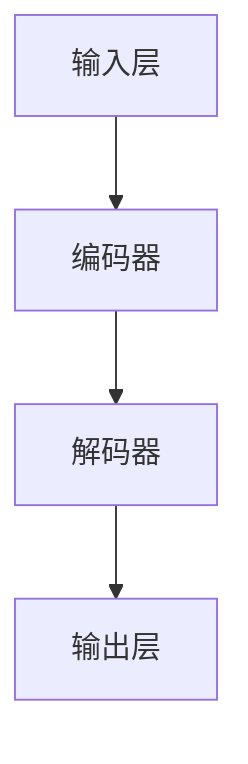

                 

### 逻辑清晰、结构紧凑、简单易懂的技术博客写作

在撰写技术博客时，清晰、逻辑性强且易于理解的结构至关重要。这不仅有助于读者顺畅地阅读，还能有效地传达文章的核心内容和思想。下面，我们将逐步分析如何撰写一篇逻辑清晰、结构紧凑且简单易懂的技术博客文章。

#### 一、确定主题和目标受众

在开始撰写之前，首先明确文章的主题和目标受众。这有助于确定文章的内容深度和风格。例如，如果主题是《ChatGPT在语言习得跨学科知识迁移中的应用：认知灵活性提示词》，那么目标受众可能是人工智能研究人员、教育工作者或对语言习得和人工智能应用感兴趣的读者。

#### 二、制定大纲

制定详细的大纲是确保文章结构紧凑和逻辑清晰的关键步骤。大纲应包含以下部分：

1. **引论**：介绍主题背景，阐述文章的目的和重要性。
2. **核心概念**：介绍相关核心概念，如ChatGPT、认知灵活性提示词等。
3. **原理与架构**：详细讲解相关技术原理和架构。
4. **应用实例**：通过实际案例展示技术的应用。
5. **实践与探索**：探讨技术在实际场景中的实践和未来发展趋势。
6. **总结与展望**：总结文章主要内容，提出未来研究方向。

#### 三、撰写引论

引论部分应简要介绍主题背景，提出研究问题或挑战，并明确文章的目的和结构。例如：

---

# ChatGPT在语言习得跨学科知识迁移中的应用：认知灵活性提示词

## 摘要

本文探讨了ChatGPT在语言习得跨学科知识迁移中的应用，特别是认知灵活性提示词的设计。通过对ChatGPT的基本原理、跨学科知识迁移的概念以及认知灵活性提示词的深入分析，本文旨在为语言习得领域的研究人员和开发者提供有价值的参考。

---

#### 四、讲解核心概念

在介绍核心概念时，应简洁明了地阐述概念的定义、重要性以及与其他概念的关系。例如：

---

## 1. ChatGPT基础

### 1.1 ChatGPT的原理与架构

ChatGPT是基于Transformer架构的预训练语言模型，其核心原理是通过海量语料的学习，掌握语言的规律和逻辑。ChatGPT的架构包括输入层、编码器、解码器和输出层。

### 1.2 ChatGPT的应用场景

ChatGPT在多个领域有广泛应用，尤其在语言习得和跨学科知识迁移方面表现出色。

### 1.3 认知灵活性提示词

认知灵活性提示词是一种用于引导ChatGPT生成多样化、灵活反应的提示策略。它通过引入不同的提示方式，使ChatGPT在回答问题时能够更灵活地处理信息。

---

#### 五、深入讲解原理与架构

在讲解原理与架构时，可以结合图表、代码示例和数学公式，以增强文章的可读性和理解性。例如：

---

## 1. ChatGPT基础

### 1.1 ChatGPT的原理与架构

ChatGPT的原理可以概括为“输入-编码-解码-输出”的过程。以下是一个简化的流程图：



### 1.2 ChatGPT的数学模型

ChatGPT的数学模型基于自注意力机制和Transformer架构。以下是一个简化的数学模型：

$$
\text{输出} = \text{softmax}(\text{模型}(\text{输入}))
$$

---

#### 六、应用实例

在应用实例部分，通过具体案例展示技术的实际应用。例如：

---

## 2. ChatGPT在语言习得中的应用实例

### 2.1 实例1：语音识别

ChatGPT可以用于语音识别任务，通过训练模型来识别和生成文本。以下是一个简单的Python代码示例：

```python
import chatgpt

# 初始化模型
model = chatgpt.load_model('chatgpt-v2')

# 语音输入
audio_input = chatgpt.AudioInput('Hello, how are you?')

# 识别语音
transcription = model.transcribe(audio_input)

# 输出识别结果
print(transcription)
```

---

#### 七、实践与探索

在实践与探索部分，可以探讨技术在实际应用中的挑战和解决方案，以及未来的发展方向。例如：

---

## 3. 跨学科知识迁移的实践与探索

### 3.1 跨学科知识迁移的挑战

跨学科知识迁移面临诸多挑战，如不同领域的知识差异、数据稀缺等问题。为解决这些问题，研究者提出了多种方法，如多任务学习、迁移学习等。

### 3.2 跨学科知识迁移的未来展望

随着人工智能技术的发展，跨学科知识迁移在未来有望取得更多突破。例如，通过结合多模态学习、强化学习等技术，实现更加智能化、自适应的跨学科知识迁移。

---

#### 八、总结与展望

在总结与展望部分，对全文进行概括，并强调文章的核心观点和未来研究方向。例如：

---

## 4. 总结与展望

本文系统地探讨了ChatGPT在语言习得跨学科知识迁移中的应用，特别是认知灵活性提示词的设计。通过对ChatGPT的基本原理、应用实例以及跨学科知识迁移的实践与探索，我们看到了其在实际应用中的巨大潜力。未来，随着人工智能技术的不断进步，ChatGPT在语言习得和跨学科知识迁移领域的应用将更加广泛和深入。

---

通过以上步骤，我们可以撰写一篇逻辑清晰、结构紧凑且简单易懂的技术博客文章，有效地传达技术概念和应用。接下来，我们将根据大纲结构，细化每一章节的内容，确保文章的完整性和深度。

