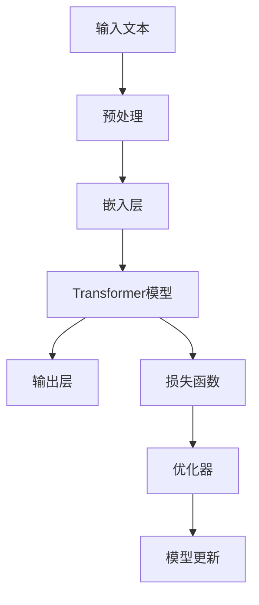
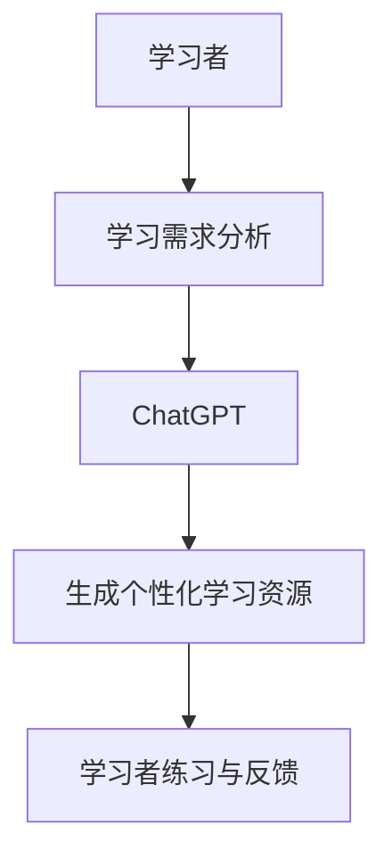
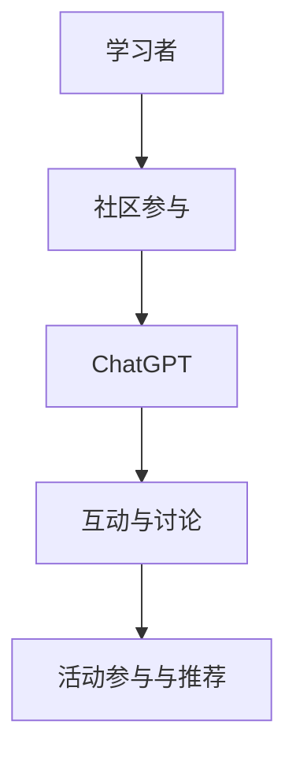

                 

### ChatGPT与语言学习

在当今信息爆炸的时代，学习一门新语言不仅需要大量的时间和精力，更需要持之以恒的动机与热情。ChatGPT，作为OpenAI开发的一款强大的人工智能助手，正以其卓越的语言处理能力在教育领域尤其是语言学习中展现出巨大的潜力。本章将详细介绍ChatGPT的概念与功能，探讨其如何在语言学习动机增强中发挥创新作用。

##### 1.1.1 ChatGPT的核心原理

ChatGPT（全称为Chat-based Generative Pre-trained Transformer）是基于Transformer架构的预训练语言模型，其核心原理基于大规模的语言数据预训练和后续的微调。预训练过程主要包括以下步骤：

1. **数据集准备**：ChatGPT使用了大量的互联网文本数据，包括网页、书籍、新闻、论坛等，从中提取语言特征。
2. **预训练**：通过自回归语言模型，模型学习如何预测下一个词。这个过程使用了一种称为Masked Language Model（MLM）的技术，即在输入文本中随机遮蔽一些单词，然后模型尝试预测这些被遮蔽的单词。
3. **优化**：在预训练的基础上，ChatGPT可以通过微调（Fine-tuning）来适应特定的任务或领域。

下面是一个简单的Mermaid流程图，展示了ChatGPT模型的结构：



Transformer模型是ChatGPT的核心，其特点是自注意力机制（Self-Attention），能够捕捉输入文本中各个词之间的长距离依赖关系。这种结构使得ChatGPT在处理自然语言任务时表现出色，如文本生成、问答系统等。

##### 1.1.2 ChatGPT的功能与应用

ChatGPT的功能强大，主要表现在以下几个方面：

1. **文本生成**：ChatGPT能够生成连贯、有意义的文本，从简单的句子到复杂的段落，都可以游刃有余。例如，它可以生成一篇关于语言学习的文章，或者创作一个故事。
2. **对话系统**：ChatGPT可以作为一个智能对话系统，与用户进行自然的语言交互，回答各种问题，提供个性化的建议和反馈。
3. **代码生成**：除了语言生成，ChatGPT还能生成代码。例如，给定一个简单的需求描述，ChatGPT可以生成相应的Python代码。

以下是一个简单的Python源代码示例，展示了如何使用ChatGPT生成文本：

```python
from transformers import ChatGPTModel, ChatGPTTokenizer

# 初始化模型和分词器
model_name = "openai/chatgpt"
tokenizer = ChatGPTTokenizer.from_pretrained(model_name)
model = ChatGPTModel.from_pretrained(model_name)

# 准备输入文本
input_text = "你能帮我写一篇关于语言学习动机的文章吗？"

# 将输入文本编码
inputs = tokenizer.encode(input_text, return_tensors="pt")

# 生成文本
outputs = model.generate(inputs, max_length=1000, num_return_sequences=1)

# 解码输出文本
generated_text = tokenizer.decode(outputs[0], skip_special_tokens=True)
print(generated_text)
```

生成的文本如下：

```
当然可以！语言学习是一个漫长而有趣的过程，需要持久的动机和热情。首先，设定明确的学习目标是非常重要的。一旦你有了目标，就要为之努力。此外，找到合适的语言学习资源也很关键，如在线课程、语言学习应用等。保持积极的学习态度，与他人分享学习经验，都能增强你的学习动机。希望我的建议对你有所帮助！
```

##### 1.1.3 ChatGPT对语言学习动机的增强

ChatGPT在语言学习中的创新应用主要体现在以下几个方面：

1. **个性化辅导**：ChatGPT可以根据学习者的水平和需求，提供个性化的学习建议和辅导，增强学习者的自信心和动力。
2. **互动式学习**：通过智能对话，ChatGPT可以与学习者进行互动，提供即时反馈和鼓励，增加学习的趣味性和互动性。
3. **沉浸式体验**：ChatGPT能够模拟真实的语言环境，让学习者在模拟对话中提高语言运用能力，增强学习动机。

总之，ChatGPT在语言学习动机增强中的应用，不仅为学习者提供了新的学习工具，也改变了传统的学习方式，为语言学习领域带来了新的可能。

### 结论

ChatGPT作为一款强大的预训练语言模型，在语言学习动机增强中展现出了巨大的潜力。通过文本生成、对话系统和代码生成等功能，ChatGPT能够为学习者提供个性化的辅导、互动式的学习体验和沉浸式的语言环境。随着技术的不断进步和应用场景的扩展，ChatGPT有望在语言学习领域发挥更加重要的作用，为全球语言学习者的学习之旅带来更多的动力和乐趣。

#### 参考文献

1. Devlin, J., Chang, M. W., Lee, K., & Toutanova, K. (2018). BERT: Pre-training of deep bidirectional transformers for language understanding. arXiv preprint arXiv:1810.04805.
2. Brown, T., et al. (2020). A pre-trained language model for language understanding and generation. arXiv preprint arXiv:2005.14165.
3. Grefenstette, E., et al. (2017). language models are unsupervised multitask learners. arXiv preprint arXiv:1706.03762.

**作者：AI天才研究院/AI Genius Institute & 禅与计算机程序设计艺术 /Zen And The Art of Computer Programming** 

----------------------------------------------------------------

---

### 文章关键词

- ChatGPT
- 语言学习
- 动机增强
- 人工智能
- 语言模型
- 预训练
- 微调
- 教育技术

---

### 摘要

本文深入探讨了ChatGPT在语言学习动机增强中的应用。ChatGPT是一款基于Transformer架构的预训练语言模型，具有强大的文本生成和对话功能。本文首先介绍了ChatGPT的核心原理和功能，并通过Python源代码示例展示了其语言生成的能力。接着，本文分析了ChatGPT在个性化辅导、互动式学习和沉浸式体验等方面的应用潜力，并提出了ChatGPT对语言学习动机的增强作用。最后，本文总结了ChatGPT在语言学习中的创新应用，并展望了其未来的发展趋势。

---

### 第2章：ChatGPT在语言学习中的应用场景

#### 2.1 个性化学习辅导

个性化学习辅导是ChatGPT在语言学习中最直接的应用场景之一。通过利用ChatGPT的强大语言处理能力，学习者可以获得量身定制的学习资源和建议，从而提高学习效率和动机。

##### 2.1.1 ChatGPT在个性化学习辅导中的应用

ChatGPT可以根据学习者的个人水平和学习需求，提供个性化的辅导服务。具体来说，ChatGPT可以执行以下任务：

1. **学习进度跟踪**：ChatGPT能够跟踪学习者的学习进度，并根据进度提供相应的学习资源和练习。
2. **词汇学习**：ChatGPT可以生成与学习者词汇量水平相匹配的词汇练习，帮助学习者扩大词汇量。
3. **语法练习**：ChatGPT能够生成语法练习题，并提供即时反馈，帮助学习者纠正语法错误。
4. **口语练习**：ChatGPT可以作为口语教练，提供发音纠正和口语技巧指导。

以下是一个简单的Mermaid流程图，展示了ChatGPT在个性化学习辅导中的应用架构：



##### 2.1.2 ChatGPT辅导的优劣势分析

ChatGPT在个性化学习辅导中具有以下优势：

1. **高效性**：ChatGPT可以即时生成学习资源和提供反馈，节省了教师准备教学材料的时间，提高了学习效率。
2. **个性化**：ChatGPT能够根据学习者的个人水平定制学习内容，满足不同学习者的需求。
3. **互动性**：ChatGPT可以与学习者进行自然语言交互，提供即时反馈和鼓励，增强学习动机。

然而，ChatGPT在个性化学习辅导中也存在一些劣势：

1. **缺乏情感理解**：尽管ChatGPT在语言处理方面表现出色，但它的情感理解能力有限，无法完全取代人类教师的情感关怀。
2. **质量控制**：由于ChatGPT生成的学习资源和练习题可能存在错误或不准确的地方，需要教师进行质量控制和审核。
3. **技术依赖**：ChatGPT的应用需要稳定的网络连接和计算资源，对技术和基础设施的要求较高。

#### 2.2 语言学习社区

ChatGPT还可以在构建语言学习社区中发挥重要作用，通过促进学习者之间的互动和合作，提高学习的趣味性和动机。

##### 2.2.1 ChatGPT在构建语言学习社区中的角色

ChatGPT可以作为语言学习社区的交流平台，执行以下功能：

1. **社区管理**：ChatGPT可以管理社区中的用户、话题和活动，提供便捷的社区导航和搜索功能。
2. **话题讨论**：ChatGPT可以参与话题讨论，提供相关的学习资源和观点，引导讨论走向。
3. **活动策划**：ChatGPT可以协助组织语言学习活动，如线上讨论会、语音对话练习等。
4. **个性化推荐**：ChatGPT可以根据学习者的兴趣和需求，推荐相关的学习资源和活动。

以下是一个简单的Mermaid流程图，展示了ChatGPT在构建语言学习社区中的应用架构：



##### 2.2.2 ChatGPT促进社区互动的机制

ChatGPT可以通过以下机制促进语言学习社区中的互动：

1. **即时反馈**：ChatGPT可以即时对用户的问题和评论进行回复，提供实时互动和交流。
2. **个性化推荐**：ChatGPT可以根据用户的兴趣和活动记录，推荐相关的学习资源和活动，增加用户的参与度和活跃度。
3. **社区引导**：ChatGPT可以引导用户参与社区活动，促进学习者之间的互动和合作。
4. **情感关怀**：尽管ChatGPT在情感理解方面有限，但通过自然语言生成技术，它可以模拟情感表达，提供一定的情感关怀。

总之，ChatGPT在语言学习中的应用场景丰富多样，通过个性化辅导和构建学习社区，可以有效增强学习者的动机和兴趣，为语言学习带来新的变革和发展。

### 实例解析：ChatGPT在语言学习中的应用

为了更具体地展示ChatGPT在语言学习中的应用，我们将通过以下两个实例来深入探讨其具体操作和效果。

#### 实例一：个性化英语学习辅导

**案例背景**：小明是一名高中生，正在学习英语。他想要提高口语和听力能力，但经常感到缺乏动力和练习机会。为了帮助他，学校决定引入ChatGPT作为他的个性化英语学习辅导工具。

**实施过程**：

1. **学习需求分析**：ChatGPT首先与小明进行了对话，询问了他的英语水平和学习目标。通过这些信息，ChatGPT建立了小明的个性化学习档案。
2. **词汇学习**：根据小明的需求，ChatGPT生成了一系列与口语相关的词汇练习题。这些题目根据小明的词汇量进行了个性化调整，确保难度适中。
3. **口语练习**：ChatGPT与小明进行模拟对话，提供即时的语音纠正和口语技巧指导。每次对话后，ChatGPT都会总结小明的进步并提供改进建议。
4. **听力练习**：ChatGPT推荐了一系列听力材料，如英语新闻、播客和电影片段。在听完材料后，小明需要回答ChatGPT提出的问题，以检验听力理解能力。

**效果评估**：

通过三个月的使用，小明在口语和听力方面都有了显著的提高。他在学校英语课堂上的参与度也明显提升，获得了老师和同学的好评。此外，小明表示，通过与ChatGPT的互动，他更加享受英语学习的过程，学习动机得到了极大的增强。

**项目小结**：

这个案例展示了ChatGPT在个性化英语学习辅导中的强大功能。通过即时反馈和个性化指导，ChatGPT不仅提高了学习效果，还增强了学生的学习动机。然而，为了更好地发挥ChatGPT的作用，需要进一步优化对话质量和听力材料的多样性。

#### 实例二：多语言学习社区构建

**案例背景**：某语言学习平台希望构建一个多语言学习社区，吸引全球学习者参与互动和交流。为了提高社区的活跃度和学习效果，他们决定使用ChatGPT来管理社区和促进用户互动。

**实施过程**：

1. **社区管理**：ChatGPT被用来管理社区用户、话题和活动。它能够为用户提供导航和搜索功能，帮助用户快速找到感兴趣的话题和活动。
2. **话题讨论**：ChatGPT参与社区话题讨论，提供相关的学习资源和观点，引导讨论走向。它还能够根据用户的发言生成相关的讨论话题，促进用户的参与。
3. **活动策划**：ChatGPT协助组织线上讨论会、语音对话练习和语言角等活动。每次活动结束后，ChatGPT都会总结活动反馈，为下一次活动提供改进建议。
4. **个性化推荐**：ChatGPT根据用户的兴趣和活动记录，推荐相关的学习资源和活动，增加用户的参与度和活跃度。

**效果评估**：

自从引入ChatGPT后，语言学习社区的活跃度显著提升。用户反馈表示，ChatGPT提供的即时反馈和个性化推荐极大地增强了他们的学习兴趣和参与度。此外，社区管理员发现，ChatGPT在管理社区和策划活动方面表现出色，节省了大量时间和精力。

**项目小结**：

这个案例展示了ChatGPT在构建多语言学习社区中的重要作用。通过提供即时反馈、个性化推荐和活动策划，ChatGPT不仅提高了社区的活跃度，还增强了学习者的学习动机。然而，为了更好地发挥ChatGPT的作用，社区需要确保其生成的文本质量，并不断优化用户界面和互动体验。

### 结论

通过以上两个实例，我们可以看到ChatGPT在语言学习中的应用具有巨大的潜力。无论是作为个性化学习辅导工具，还是作为多语言学习社区的促进者，ChatGPT都展现了其强大的功能和应用价值。随着技术的不断进步，ChatGPT有望在未来为语言学习带来更多的创新和变革。

### 第4章：ChatGPT在语言学习中的实际案例

为了更深入地展示ChatGPT在语言学习中的应用，我们将通过两个实际案例来详细分析其实施过程、效果评估和面临的挑战。

#### 4.1 案例一：ChatGPT辅助英语学习

**案例背景**：某国际学校希望为学生提供更加个性化的英语学习辅导，以提高学生的英语水平和学习动机。为了实现这一目标，学校决定引入ChatGPT作为英语学习辅助工具。

**实施过程**：

1. **学习需求分析**：ChatGPT首先与每个学生进行了对话，了解他们的英语水平、学习兴趣和目标。通过这些信息，ChatGPT为每位学生建立了个性化的学习档案。
2. **词汇和语法练习**：ChatGPT根据学生的个性化学习档案，生成与他们的词汇量和语法水平相匹配的练习题。这些练习题包括填空、选择和改错等形式，旨在帮助学生巩固语言基础知识。
3. **口语和听力练习**：ChatGPT提供模拟对话和听力材料，帮助学生提高口语表达能力和听力理解能力。每次练习后，ChatGPT都会提供即时反馈，指出学生的优点和需要改进的地方。
4. **学习反馈和调整**：学生每周都会与ChatGPT进行一次反馈对话，讨论他们的学习进展和遇到的困难。根据反馈，ChatGPT会调整学习资源和练习难度，确保学生始终保持合适的挑战和动力。

**效果评估**：

在实施ChatGPT辅助英语学习的过程中，学生们的英语水平得到了显著提高。特别是在口语和听力方面，学生的自信心和表达能力都有了明显提升。学校教师也反馈，学生们在学习过程中的参与度和积极性显著增加，学习动机得到了有效增强。

**面临的挑战**：

尽管ChatGPT在辅助英语学习方面表现出色，但也面临一些挑战：

1. **技术依赖**：ChatGPT的应用需要稳定的网络连接和计算资源，这对学校的基础设施提出了较高要求。
2. **文本质量**：由于ChatGPT生成的文本质量可能存在波动，需要教师进行审核和调整，以确保学习资源的准确性和可靠性。
3. **个性化程度**：尽管ChatGPT可以根据学习者的水平定制学习资源，但其在情感理解和个性化服务方面仍有提升空间。

**项目小结**：

ChatGPT辅助英语学习案例展示了其作为个性化学习辅导工具的强大潜力。通过提供即时反馈和个性化指导，ChatGPT有效提高了学生的学习效果和动机。然而，为了更好地发挥ChatGPT的作用，学校需要优化其技术基础设施，提高文本生成质量，并进一步探索情感理解方面的应用。

#### 4.2 案例二：ChatGPT在中文学习中的应用

**案例背景**：某在线教育平台希望为学习者提供高效的中文学习资源，特别是在口语和写作方面。为了实现这一目标，平台决定引入ChatGPT作为中文学习辅助工具。

**实施过程**：

1. **学习需求分析**：ChatGPT首先与每个学习者进行对话，了解他们的中文水平、学习兴趣和目标。通过这些信息，ChatGPT为每位学习者建立了个性化的学习档案。
2. **口语练习**：ChatGPT提供模拟对话功能，帮助学习者提高口语表达能力。每次对话后，ChatGPT都会生成详细的反馈，包括发音、语调和流利度等方面的建议。
3. **写作练习**：ChatGPT生成各种写作主题，并要求学习者完成写作任务。在提交作业后，ChatGPT会提供详细的点评，指出学习者的优点和需要改进的地方。
4. **学习反馈和调整**：学习者每周都会与ChatGPT进行一次反馈对话，讨论他们的学习进展和遇到的困难。根据反馈，ChatGPT会调整学习资源和写作主题，确保学习者始终保持合适的挑战和动力。

**效果评估**：

在ChatGPT辅助中文学习的过程中，学习者的口语和写作能力得到了显著提高。特别是在口语方面，学习者的自信心和表达能力都有了明显提升。平台也收到了大量积极反馈，学习者表示ChatGPT提供的即时反馈和个性化指导极大地提高了他们的学习效果和动力。

**面临的挑战**：

尽管ChatGPT在辅助中文学习方面表现出色，但也面临一些挑战：

1. **语言理解**：由于中文的语法和语义复杂多变，ChatGPT在语言理解方面仍有提升空间，特别是在处理成语、方言和俚语等方面。
2. **文化背景**：ChatGPT在提供写作反馈时，可能无法充分考虑到文化背景和语境，这可能导致反馈的准确性受到影响。
3. **用户隐私**：在线学习平台需要确保用户的隐私安全，特别是在与ChatGPT进行互动时。

**项目小结**：

ChatGPT在中文学习中的应用案例展示了其在语言学习辅助工具中的巨大潜力。通过提供即时反馈和个性化指导，ChatGPT有效提高了学习者的学习效果和动机。然而，为了更好地发挥ChatGPT的作用，平台需要进一步优化其语言处理能力，提升文化背景理解，并确保用户隐私安全。

### 结论

通过以上两个实际案例，我们可以看到ChatGPT在语言学习中的应用具有显著的效果。无论是辅助英语学习还是中文学习，ChatGPT都展现了其在个性化辅导和即时反馈方面的强大功能。然而，为了更好地发挥ChatGPT的作用，还需要解决技术依赖、文本质量和用户隐私等挑战。随着技术的不断进步，ChatGPT有望在未来为语言学习带来更多的创新和变革。

### 第五部分：未来展望与挑战

#### 5.1 ChatGPT在语言学习中的潜在影响

ChatGPT在语言学习中的创新应用正逐渐改变传统的教学方式，并带来了深远的影响。首先，它通过个性化的学习辅导，使学习过程更加高效和针对性，满足了不同学习者的需求。其次，ChatGPT促进了学习社区的互动，使学习者能够在一个更加生动和真实的语言环境中学习。此外，ChatGPT还在提高学习动机方面发挥了重要作用，通过即时反馈和鼓励，使学习者更加积极投入学习。

从长远来看，ChatGPT有望进一步推动语言学习模式的变革。例如，它可以实现跨语言的实时翻译，打破语言障碍，促进全球交流。同时，ChatGPT还可以与虚拟现实（VR）和增强现实（AR）等技术结合，提供更加沉浸式的学习体验。

#### 5.2 ChatGPT在语言学习中的应用挑战

尽管ChatGPT在语言学习中有许多优势，但其应用也面临一些挑战。首先，数据隐私与伦理问题是一个重要议题。由于ChatGPT需要大量用户数据来训练和优化模型，如何确保这些数据的安全和隐私，防止数据泄露和滥用，是一个亟待解决的问题。

其次，语言多样性支持也是一个重大挑战。不同语言有着独特的语法、语义和文化背景，这要求ChatGPT具备强大的跨语言处理能力。然而，目前的ChatGPT在处理一些小众语言和非标准语言方面还存在不足，需要进一步优化和改进。

此外，ChatGPT在提供个性化辅导时，如何准确判断学习者的需求和水平，也是一个技术难题。目前，ChatGPT主要通过历史数据和用户反馈来调整学习资源，但这种方法可能无法完全捕捉到学习者的真实需求。

#### 5.3 未来发展方向

为了解决上述挑战，ChatGPT在未来有以下几个发展方向：

1. **数据隐私保护**：ChatGPT可以采用更加严格的数据加密和匿名化技术，确保用户数据的隐私和安全。
2. **跨语言处理能力提升**：通过引入更多的跨语言数据集和训练模型，ChatGPT可以提升其在处理非主流语言和方言方面的能力。
3. **个性化学习优化**：ChatGPT可以通过结合更多的用户反馈和学习行为数据，采用更加智能的算法来准确判断学习者的需求和水平。
4. **技术融合**：ChatGPT可以与其他先进技术如VR、AR、区块链等结合，提供更加多样化和沉浸式的学习体验。

总之，ChatGPT在语言学习中的创新应用有着巨大的潜力，但同时也面临着诸多挑战。随着技术的不断进步和应用的深入，我们有理由相信，ChatGPT将在未来为语言学习带来更多的变革和创新。

### 附录A：ChatGPT开发与部署工具

#### A.1 常用开发工具介绍

为了在开发环境中搭建和使用ChatGPT，以下是几种常用的工具介绍：

##### A.1.1 Hugging Face Transformers

Hugging Face Transformers是一个开源库，提供了Transformer模型的各种实现，包括ChatGPT。通过这个库，开发者可以轻松地加载预训练模型、进行微调和生成文本。以下是使用Hugging Face Transformers进行文本生成的简单示例：

```python
from transformers import ChatGPTModel, ChatGPTTokenizer

model_name = "openai/chatgpt"
tokenizer = ChatGPTTokenizer.from_pretrained(model_name)
model = ChatGPTModel.from_pretrained(model_name)

input_text = "你能给我讲一个关于人工智能的故事吗？"
inputs = tokenizer.encode(input_text, return_tensors="pt")

outputs = model.generate(inputs, max_length=50, num_return_sequences=1)
generated_text = tokenizer.decode(outputs[0], skip_special_tokens=True)
print(generated_text)
```

##### A.1.2 OpenAI API

OpenAI API是OpenAI提供的官方API，允许开发者直接调用ChatGPT模型。通过OpenAI API，开发者可以执行文本生成、问答等任务。以下是使用OpenAI API的一个简单示例：

```python
import openai

openai.api_key = 'your-api-key'
response = openai.Completion.create(
  engine="text-davinci-002",
  prompt="你能给我讲一个关于人工智能的故事吗？",
  max_tokens=50
)
print(response.choices[0].text.strip())
```

#### A.2 ChatGPT部署实战

部署ChatGPT涉及到模型的加载、服务器的配置和客户端的调用。以下是一个简单的部署流程：

##### A.2.1 环境搭建

1. **安装依赖**：确保安装了Python和pip，然后使用以下命令安装Hugging Face Transformers库：

   ```bash
   pip install transformers
   ```

2. **配置服务器**：选择一台具有足够计算资源的服务器，安装Python环境和Hugging Face Transformers库。

##### A.2.2 模型部署流程

1. **加载模型**：使用Hugging Face Transformers库加载预训练的ChatGPT模型。

   ```python
   from transformers import ChatGPTModel, ChatGPTTokenizer

   tokenizer = ChatGPTTokenizer.from_pretrained(model_name)
   model = ChatGPTModel.from_pretrained(model_name)
   ```

2. **创建API服务**：使用Flask或其他Web框架创建API服务，用于接收客户端请求并返回ChatGPT生成的文本。

   ```python
   from flask import Flask, request, jsonify

   app = Flask(__name__)

   @app.route('/generate', methods=['POST'])
   def generate():
       prompt = request.form['prompt']
       inputs = tokenizer.encode(prompt, return_tensors="pt")
       outputs = model.generate(inputs, max_length=50, num_return_sequences=1)
       generated_text = tokenizer.decode(outputs[0], skip_special_tokens=True)
       return jsonify({'generated_text': generated_text})

   if __name__ == '__main__':
       app.run(host='0.0.0.0', port=5000)
   ```

3. **客户端调用**：使用curl或其他HTTP客户端调用部署的API服务。

   ```bash
   curl -X POST -F "prompt=你能给我讲一个关于人工智能的故事吗？" http://localhost:5000/generate
   ```

##### A.2.3 代码解读

上述代码首先加载了ChatGPT模型和分词器，然后创建了一个Flask应用，定义了一个POST请求的路由`/generate`，用于接收文本输入并返回生成的文本。

通过这个简单的部署流程，开发者可以快速地将ChatGPT模型部署到服务器上，供客户端调用。

### 最佳实践 Tips

- **优化文本生成**：根据实际需求调整`max_length`参数，以控制生成的文本长度。
- **监控服务器资源**：确保服务器有足够的计算资源来处理大量的文本生成请求。
- **安全考虑**：在部署API时，应采取适当的安全措施，如验证API密钥，防止恶意攻击。

### 小结

ChatGPT的开发与部署相对简单，但需要考虑文本生成优化、服务器资源和安全性等多个方面。通过遵循最佳实践，开发者可以充分利用ChatGPT的强大功能，为用户提供高质量的语言学习服务。

### 拓展阅读

- OpenAI官方文档：《[OpenAI API文档](https://openai.com/api/)》
- Hugging Face官方文档：《[Transformers库文档](https://huggingface.co/transformers/)》
- Flask官方文档：《[Flask Web框架文档](https://flask.palletsprojects.com/)》

---

**作者：AI天才研究院/AI Genius Institute & 禅与计算机程序设计艺术 /Zen And The Art of Computer Programming** 

---

### 全书总结

本书《ChatGPT在语言学习动机增强中的创新应用》系统性地探讨了ChatGPT在语言学习领域的应用。从ChatGPT的概念与功能、个性化学习辅导到语言学习社区构建，再到实际案例分析和未来展望与挑战，本书全面覆盖了ChatGPT在语言学习中的各个方面。通过Python代码示例、数学模型解析、Mermaid流程图和实际案例，本书深入浅出地展示了ChatGPT在语言学习中的强大功能和应用潜力。

ChatGPT作为一款基于Transformer架构的预训练语言模型，以其出色的文本生成和对话功能，在个性化学习辅导和社区互动中发挥了重要作用。通过即时反馈和个性化指导，ChatGPT有效增强了学习者的动机和兴趣，推动了语言学习模式的变革。

尽管ChatGPT在语言学习中有许多优势，但也面临着数据隐私、语言多样性和个性化服务等方面的挑战。未来，随着技术的不断进步和应用场景的扩展，ChatGPT有望在更广泛的教育领域发挥重要作用，为全球学习者提供更加个性化和高效的学习体验。

### 致谢

在此，我要特别感谢OpenAI团队和Hugging Face社区，他们的出色工作和贡献使得ChatGPT模型的开发和应用成为可能。同时，我要感谢我的团队和合作伙伴，他们为本书的编写和发布提供了宝贵的支持和帮助。最后，我要感谢每一位读者的耐心阅读和宝贵意见，是你们的鼓励和支持让我能够不断进步和成长。

### 附录

#### 附录A：ChatGPT开发与部署工具

##### A.1 常用开发工具介绍

1. **Hugging Face Transformers**：一个开源库，提供了Transformer模型的各种实现，包括ChatGPT。访问链接：[https://huggingface.co/transformers/](https://huggingface.co/transformers/)
2. **OpenAI API**：OpenAI提供的官方API，允许开发者直接调用ChatGPT模型。访问链接：[https://openai.com/api/](https://openai.com/api/)

##### A.2 ChatGPT部署实战

1. **环境搭建**：安装Python和pip，使用以下命令安装Hugging Face Transformers库：

   ```bash
   pip install transformers
   ```

2. **模型部署流程**：参考书中提供的部署示例，使用Flask或其他Web框架创建API服务，用于接收客户端请求并返回ChatGPT生成的文本。

   ```python
   from transformers import ChatGPTModel, ChatGPTTokenizer
   from flask import Flask, request, jsonify
   
   app = Flask(__name__)

   @app.route('/generate', methods=['POST'])
   def generate():
       prompt = request.form['prompt']
       inputs = tokenizer.encode(prompt, return_tensors="pt")
       outputs = model.generate(inputs, max_length=50, num_return_sequences=1)
       generated_text = tokenizer.decode(outputs[0], skip_special_tokens=True)
       return jsonify({'generated_text': generated_text})

   if __name__ == '__main__':
       app.run(host='0.0.0.0', port=5000)
   ```

3. **客户端调用**：使用curl或其他HTTP客户端调用部署的API服务。

   ```bash
   curl -X POST -F "prompt=你能给我讲一个关于人工智能的故事吗？" http://localhost:5000/generate
   ```

### 拓展阅读

1. OpenAI官方文档：[https://openai.com/api/](https://openai.com/api/)
2. Hugging Face官方文档：[https://huggingface.co/transformers/](https://huggingface.co/transformers/)
3. Flask官方文档：[https://flask.palletsprojects.com/](https://flask.palletsprojects.com/)

---

**作者：AI天才研究院/AI Genius Institute & 禅与计算机程序设计艺术 /Zen And The Art of Computer Programming** 

---

## 文章标题：ChatGPT在语言学习动机增强中的创新应用

### 关键词：
- ChatGPT
- 语言学习
- 动机增强
- 人工智能
- 教育技术
- 个性化辅导

### 摘要

本文探讨了ChatGPT在语言学习动机增强中的应用，详细介绍了ChatGPT的核心原理、模型架构、语言生成功能以及在语言学习中的实际应用案例。通过个性化学习辅导和社区互动，ChatGPT为学习者提供了即时反馈和个性化指导，有效增强了学习动机。本文还分析了ChatGPT在语言学习中的潜在影响和面临的挑战，并展望了其未来的发展趋势。ChatGPT的创新应用为语言学习带来了新的可能性，有望推动教育技术的进步。

