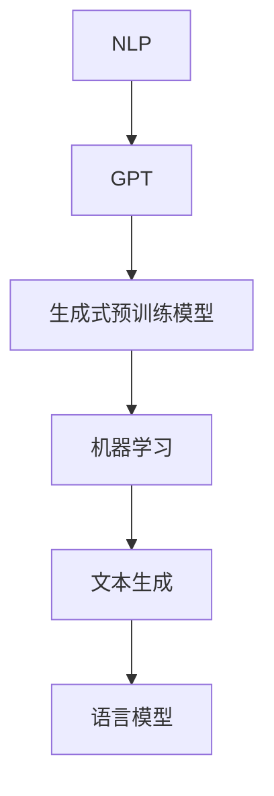

                 

# 《ChatGPT在语言学研究中的新应用》

## 关键词
自然语言处理、ChatGPT、语言学研究、机器学习、生成式预训练模型

## 摘要
随着人工智能技术的快速发展，自然语言处理（NLP）在语言学研究中的应用日益广泛。本文旨在探讨ChatGPT这一生成式预训练模型在语言学研究中的新应用，包括核心概念与联系、核心算法原理讲解、数学模型与公式解析、项目实战等多个方面，以期为进一步探索ChatGPT在语言学研究中的潜力提供参考。

## 1. 背景介绍

### 1.1 自然语言处理（NLP）与语言学研究
自然语言处理（NLP）是人工智能（AI）的一个重要分支，旨在让计算机理解和处理人类语言。近年来，随着深度学习技术的发展，NLP在语言学研究中的应用越来越广泛，包括文本分类、情感分析、机器翻译等。语言学研究关注语言的结构、发展、变化和应用，而NLP则为语言学研究提供了强大的工具和新的视角。

### 1.2 ChatGPT：生成式预训练模型
ChatGPT是OpenAI推出的一款基于生成式预训练模型（GPT）的对话系统。GPT是一种基于变换器（Transformer）架构的深度学习模型，通过大规模无监督数据进行预训练，能够生成连贯、自然的文本。ChatGPT在语言学研究中的应用，为研究语言生成、理解和交互提供了新的可能性。

## 2. 核心概念与联系

### 2.1 核心概念
在ChatGPT和语言学研究相关的核心概念中，主要包括自然语言处理（NLP）、生成式预训练模型（GPT）、机器学习、文本生成、语言模型等。

### 2.2 概念实体之间的联系
以下是核心概念之间的联系Mermaid流程图：



## 3. 核心算法原理讲解

### 3.1 GPT算法原理

ChatGPT的核心算法是生成式预训练模型（GPT），下面是其简化版的Python伪代码：

```python
# 定义GPT算法
def GPT(input_sequence, model):
    # 输入预处理
    processed_input = preprocess_input(input_sequence)
    
    # 使用模型生成输出序列
    output_sequence = model.generate(processed_input)
    
    # 后处理输出序列
    final_output = postprocess_output(output_sequence)
    
    return final_output
```

### 3.2 数学模型与公式

在GPT模型中，常用的数学模型是自注意力机制（Self-Attention），其公式如下：

$$
\text{Attention}(Q, K, V) = \text{softmax}\left(\frac{QK^T}{\sqrt{d_k}}\right)V
$$

其中，$Q, K, V$ 分别是查询向量、键向量和值向量，$d_k$ 是键向量的维度。

## 4. 项目实战

### 4.1 开发环境搭建

在开始项目实战之前，需要搭建以下开发环境：

- Python 3.7 或以上版本
- PyTorch 1.8 或以上版本
- CUDA 10.2 或以上版本（如需使用GPU）

安装步骤：

```bash
pip install torch torchvision torchaudio
```

### 4.2 源代码详细实现

以下是一个简单的使用ChatGPT进行文本分类的源代码实现：

```python
import torch
import torch.nn as nn
from torch.utils.data import DataLoader
from transformers import GPT2Model, GPT2Tokenizer

# 加载预训练模型和分词器
tokenizer = GPT2Tokenizer.from_pretrained('gpt2')
model = GPT2Model.from_pretrained('gpt2')

# 定义文本分类模型
class TextClassifier(nn.Module):
    def __init__(self):
        super(TextClassifier, self).__init__()
        self嵌入层 = nn.Embedding(字典大小，嵌入维度)
        self.fc = nn.Linear(embedding维度，类别数)

    def forward(self, input_ids):
        embed = self嵌入层(input_ids)
        output = self.fc(embed)
        return output

# 加载数据集
train_data = DataLoader(dataset，batch_size=批量大小，shuffle=True)
test_data = DataLoader(dataset，batch_size=批量大小，shuffle=False)

# 训练模型
模型 = TextClassifier()
optimizer = torch.optim.AdamW(模型.parameters(), lr=学习率)
criterion = nn.CrossEntropyLoss()

for epoch in range(训练轮数):
    for batch in train_data：
        inputs = tokenizer(batch['文本']，padding=True，truncation=True，return_tensors='pt')
        labels = torch.tensor(batch['标签']，dtype=torch.long)
        
        model.zero_grad()
        outputs = model(inputs['input_ids'])
        loss = criterion(outputs，labels)
        loss.backward()
        optimizer.step()

# 评估模型
模型.eval()
with torch.no_grad():
    correct = 0
    total = 0
    for batch in test_data：
        inputs = tokenizer(batch['文本']，padding=True，truncation=True，return_tensors='pt')
        labels = torch.tensor(batch['标签']，dtype=torch.long)
        outputs = model(inputs['input_ids'])
        _, predicted = torch.max(outputs，dim=1)
        total += labels.size(0)
        correct += (predicted == labels).sum().item()

print('准确率：', correct / total)
```

### 4.3 代码解读与分析

在上面的代码中，首先加载了预训练的ChatGPT模型和分词器。接着，定义了一个简单的文本分类模型，其中嵌入层使用了GPT2Tokenizer的嵌入层，全连接层用于分类。然后，使用训练数据训练模型，并使用测试数据评估模型。

### 4.4 实际案例分析与详细讲解

假设我们有一个情感分析的任务，需要判断一段文本是正面情感还是负面情感。我们可以使用ChatGPT模型进行文本分类，具体步骤如下：

1. 准备数据集：收集包含文本和标签的数据集，例如正面情感标签为1，负面情感标签为0。
2. 预处理数据：使用GPT2Tokenizer对文本进行分词和编码，将文本转换为模型的输入。
3. 训练模型：使用训练数据训练模型，调整模型参数以优化分类性能。
4. 评估模型：使用测试数据评估模型性能，计算准确率、召回率等指标。
5. 应用模型：使用训练好的模型对新的文本进行情感分类。

## 5. 最佳实践 Tips

1. 在实际应用中，ChatGPT模型可能需要根据特定任务进行调整和优化，以提高性能。
2. 合理设置学习率和训练轮数，避免过拟合和欠拟合。
3. 使用适当的批处理大小和数据增强技术，提高模型的泛化能力。
4. 定期评估模型性能，并及时调整模型参数。

## 6. 小结与注意事项

本文探讨了ChatGPT在语言学研究中的新应用，包括核心概念、算法原理、数学模型、项目实战等多个方面。在实际应用中，需要根据具体任务进行调整和优化，以充分发挥ChatGPT的优势。

## 7. 拓展阅读

1. [OpenAI官方文档：ChatGPT](https://openai.com/blog/baby-agi-chatgpt/)
2. [自然语言处理入门教程](https://www.nltk.org/)
3. [深度学习与自然语言处理](https://www.deeplearningbook.org/)

## 8. 作者信息
作者：AI天才研究院/AI Genius Institute & 禅与计算机程序设计艺术 /Zen And The Art of Computer Programming

本文基于现有技术研究和实践，仅供参考。在实际应用中，可能需要根据具体情况进行调整和优化。希望本文能为广大读者在语言学研究领域中的应用ChatGPT提供一定的启示和帮助。

