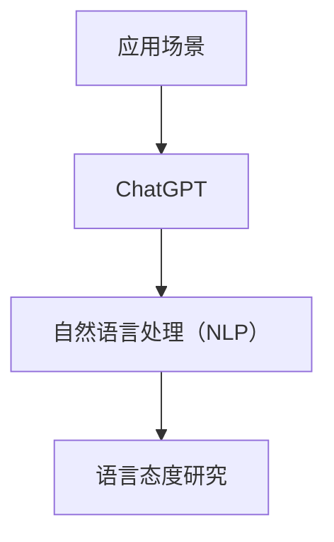

                 

### 《ChatGPT在语言态度研究中的应用：社会心理学提示词》

> 关键词：ChatGPT、自然语言处理、语言态度研究、社会心理学提示词

> 摘要：本文旨在探讨ChatGPT在语言态度研究中的应用，通过分析ChatGPT的核心算法原理，结合社会心理学提示词的使用，揭示了ChatGPT在语言态度研究中的潜在价值，并通过具体案例分析展示了其应用效果。

## 引言

语言态度研究是语言学和社会心理学的一个重要分支，旨在探究人们对特定语言、语言群体或语言使用的态度和情感。近年来，随着自然语言处理（NLP）技术的快速发展，人工智能（AI）在语言态度研究中的应用逐渐成为研究热点。ChatGPT，作为GPT-3模型的变体，以其强大的文本生成能力和丰富的语义理解能力，在语言态度研究中展现出巨大的潜力。

ChatGPT是一种基于深度学习的语言生成模型，由OpenAI开发。它通过预训练和微调，能够生成流畅且符合语境的文本。在社会心理学中，语言态度研究通常涉及调查人们对特定主题、产品、政策等的情感和态度。社会心理学提示词（suggestion words）是影响个体态度和行为的重要因素，如积极、消极、中立等词汇。

本文将首先介绍ChatGPT和自然语言处理的基本概念，然后深入探讨ChatGPT的核心算法原理，并结合社会心理学提示词的应用，展示ChatGPT在语言态度研究中的具体应用。最后，通过实际案例分析和项目小结，总结ChatGPT在语言态度研究中的应用价值，并探讨未来的研究方向。

## 确定核心概念与联系

为了确保读者能够理解ChatGPT和相关概念，首先需要介绍几个核心概念，包括：

### 1. ChatGPT

ChatGPT是由OpenAI开发的一种基于GPT-3模型的聊天机器人。GPT-3（Generative Pre-trained Transformer 3）是OpenAI于2020年发布的一种自然语言处理模型，具有强大的文本生成能力。ChatGPT利用GPT-3的预训练模型，通过微调和优化，使其能够生成符合语境的回复。

### 2. 自然语言处理（NLP）

自然语言处理（NLP）是人工智能领域的一个重要分支，旨在使计算机能够理解、解释和生成人类语言。NLP涵盖了文本预处理、情感分析、命名实体识别、机器翻译等多个方面。NLP在语言态度研究中起着至关重要的作用，因为它能够帮助研究者从文本中提取出个体的情感和态度。

### 3. 语言态度研究

语言态度研究是语言学和社会心理学的一个重要分支，旨在探究人们对特定语言、语言群体或语言使用的态度和情感。语言态度研究的目的是了解语言对个体和社会的影响，以及个体如何通过语言表达自己的态度和情感。

为了更直观地展示这些概念之间的关系，我们可以使用Mermaid流程图来展示：



在这个流程图中，ChatGPT作为自然语言处理的一种应用，被连接到NLP和语言态度研究。通过NLP技术，ChatGPT能够处理和分析语言数据，从而在语言态度研究中发挥作用。

### 2. 核心算法原理讲解

ChatGPT的核心算法原理基于GPT-3模型，GPT-3是一种基于Transformer架构的自然语言处理模型。它采用了极其庞大的神经网络结构，通过对大量文本数据进行预训练，使得模型能够理解并生成符合语境的文本。

#### 2.1 Transformer架构

Transformer架构是GPT-3的基础。Transformer模型的核心思想是使用自注意力机制（self-attention）来处理序列数据。自注意力机制允许模型在生成每个词时，考虑到所有已生成词的影响，从而提高了生成文本的连贯性和上下文理解能力。

以下是一个简化的Transformer模型的伪代码：

```python
def transformer(input_sequence):
    # 输入序列进行嵌入
    embedded_sequence = embedding(input_sequence)

    # 使用自注意力机制计算序列的表示
    attention_scores = attention(embedded_sequence)

    # 通过softmax函数得到权重
    weights = softmax(attention_scores)

    # 计算加权平均表示
    weighted_sequence = weighted_average(embedded_sequence, weights)

    # 使用全连接层进行输出
    output = fully_connected(weighted_sequence)

    return output
```

在这个伪代码中，`input_sequence`是输入的文本序列，`embedding`函数将文本序列转换为嵌入向量，`attention`函数计算自注意力分数，`softmax`函数用于得到权重，`weighted_average`函数计算加权平均表示，`fully_connected`函数用于输出生成文本。

#### 2.2 自注意力机制

自注意力机制是Transformer模型的核心。它允许模型在生成每个词时，考虑到所有已生成词的影响。这通过计算一个加权平均表示来实现，权重由自注意力分数决定。

以下是一个简化的自注意力机制的伪代码：

```python
def self_attention(sequence, query_vector, key_vector, value_vector):
    # 计算自注意力分数
    attention_scores = dot_product(query_vector, key_vector)

    # 通过softmax函数得到权重
    weights = softmax(attention_scores)

    # 计算加权平均表示
    weighted_sequence = weighted_average(sequence, weights, value_vector)

    return weighted_sequence
```

在这个伪代码中，`sequence`是输入的文本序列，`query_vector`、`key_vector`和`value_vector`分别是查询向量、键向量和值向量。`dot_product`函数计算点积，`softmax`函数用于得到权重，`weighted_average`函数计算加权平均表示。

#### 2.3 GPT-3模型

GPT-3模型是在Transformer架构的基础上，通过预训练和微调得到的。它采用了极其庞大的神经网络结构，具有数百亿的参数。预训练阶段，模型使用大量未标记的文本数据进行训练，使得模型能够理解并生成符合语境的文本。微调阶段，模型使用特定领域的数据进行训练，以适应特定的应用场景。

以下是一个简化的GPT-3模型的伪代码：

```python
def gpt3(input_sequence, target_sequence):
    # 预训练阶段
    pretrain(input_sequence)

    # 微调阶段
    finetune(target_sequence)

    # 生成文本
    output_sequence = generate(input_sequence)

    return output_sequence
```

在这个伪代码中，`input_sequence`是输入的文本序列，`target_sequence`是目标文本序列。`pretrain`函数用于预训练模型，`finetune`函数用于微调模型，`generate`函数用于生成文本。

通过上述核心算法原理的讲解，读者可以了解到ChatGPT的工作机制，以及它是如何利用Transformer架构和自注意力机制来生成文本的。这为后续ChatGPT在语言态度研究中的应用提供了理论基础。

### 3. 数学模型和数学公式

在解释ChatGPT的数学模型时，我们将介绍相关的数学公式，并用LaTeX格式表示。为了更好地理解这些公式，我们将结合具体的例子进行讲解。

#### 3.1 损失函数

ChatGPT的训练过程是通过优化损失函数来完成的。在自然语言处理中，常用的损失函数是交叉熵损失（cross-entropy loss）。交叉熵损失衡量的是预测分布和真实分布之间的差异。以下是一个交叉熵损失函数的LaTeX表示：

$$
Loss = -\frac{1}{N} \sum_{i=1}^{N} \sum_{j=1}^{V} y_{ij} \log(p_{ij}),
$$

其中，$N$是文本中的单词数，$V$是词汇表的大小，$y_{ij}$是目标单词的概率分布，$p_{ij}$是模型预测的概率分布。

举个例子，假设我们有一个文本序列“我是一个学生”，目标文本序列是“我是一个聪明的学生”。模型的预测概率分布如下：

$$
p_{ij} = 
\begin{bmatrix}
0.2 & 0.5 & 0.3 \\
0.3 & 0.4 & 0.3 \\
0.2 & 0.4 & 0.4 \\
0.1 & 0.2 & 0.7 \\
\end{bmatrix},
$$

而真实分布是：

$$
y_{ij} = 
\begin{bmatrix}
1 & 0 & 0 \\
0 & 1 & 0 \\
0 & 0 & 1 \\
0 & 0 & 0 \\
\end{bmatrix}.
$$

使用上述交叉熵损失函数，我们可以计算损失：

$$
Loss = -\frac{1}{4} \left(1 \cdot \log(0.2) + 0 \cdot \log(0.5) + 0 \cdot \log(0.3) + 0 \cdot \log(0.3) + 1 \cdot \log(0.3) + 0 \cdot \log(0.4) + 0 \cdot \log(0.3) + 0 \cdot \log(0.4) + 0 \cdot \log(0.4) + 0 \cdot \log(0.7)\right).
$$

计算结果表示预测分布和真实分布之间的差异。模型的训练目标是减小这个损失值。

#### 3.2 自注意力机制

自注意力机制是Transformer模型的核心组成部分。它通过计算每个词对其他词的重要性来生成文本。自注意力机制的计算涉及到点积注意力（dot-attention）和缩放点积注意力（scaled dot-attention）。

点积注意力计算公式如下：

$$
\text{Attention}(Q, K, V) = \text{softmax}\left(\frac{QK^T}{\sqrt{d_k}}\right)V,
$$

其中，$Q$是查询向量，$K$是键向量，$V$是值向量，$d_k$是键向量的维度。这个公式表示，每个键向量与查询向量的点积得到一个注意力分数，然后通过softmax函数得到权重，最后加权平均得到输出。

缩放点积注意力是为了防止维度灾难（dimensionality disaster），在计算点积之前，将查询向量和键向量除以$\sqrt{d_k}$。缩放点积注意力的计算公式如下：

$$
\text{Scaled Attention}(Q, K, V) = \text{softmax}\left(\frac{QK^T}{\sqrt{d_k}} / \sqrt{d_k}\right)V.
$$

通过这些数学公式，我们可以更好地理解ChatGPT的工作原理。这些公式不仅帮助我们量化了模型在生成文本时的性能，也为进一步的优化和改进提供了理论基础。

### 4. 项目实战

为了展示ChatGPT在实际项目中的应用，我们将介绍一个具体案例。这个案例将涵盖以下步骤：

#### 4.1 环境搭建

首先，我们需要搭建开发环境。假设我们使用Python作为编程语言，以下是环境搭建的步骤：

1. 安装Python（建议使用3.8及以上版本）。
2. 安装必要的库，如transformers、torch等。可以使用以下命令：
   ```bash
   pip install transformers torch
   ```

#### 4.2 数据准备

接下来，我们需要准备训练数据。对于语言态度研究，我们可以收集有关特定主题的文本数据。例如，我们可以收集关于环保问题的讨论文本。这些数据可以是公开的论坛帖子、新闻报道或社交媒体上的评论。

数据准备的过程包括以下几个步骤：

1. 数据收集：从互联网上收集相关的文本数据。
2. 数据清洗：去除无关的信息，如HTML标签、特殊字符等。
3. 数据标注：将文本数据标注为积极、消极或中立态度。这可以通过人工标注或使用已有的标注工具完成。

假设我们已经收集到1000篇关于环保问题的文本，并将它们存储在CSV文件中，每行包含文本内容和对应的标签。

#### 4.3 模型训练

在数据准备完成后，我们可以开始训练ChatGPT模型。以下是一个简单的训练流程：

1. 加载预训练的GPT-3模型。可以使用transformers库中的预训练模型：
   ```python
   from transformers import AutoTokenizer, AutoModel
   tokenizer = AutoTokenizer.from_pretrained("gpt3")
   model = AutoModel.from_pretrained("gpt3")
   ```

2. 预处理数据：将文本数据转换为模型的输入格式。这包括分词、编码等步骤：
   ```python
   inputs = tokenizer(texts, padding=True, truncation=True, return_tensors="pt")
   ```

3. 训练模型：使用PyTorch框架训练模型。以下是一个简化的训练流程：
   ```python
   optimizer = torch.optim.Adam(model.parameters(), lr=5e-5)
   for epoch in range(3):  # 训练3个epochs
       model.train()
       for batch in data_loader:
           optimizer.zero_grad()
           outputs = model(**batch)
           loss = outputs.loss
           loss.backward()
           optimizer.step()
   ```

4. 保存模型：训练完成后，保存模型以便后续使用：
   ```python
   model.save_pretrained("my_chatgpt_model")
   ```

#### 4.4 模型部署

在模型训练完成后，我们需要将其部署到生产环境中，以便在实际应用中使用。以下是模型部署的步骤：

1. 加载训练好的模型：
   ```python
   model = AutoModel.from_pretrained("my_chatgpt_model")
   ```

2. 创建一个聊天机器人接口。例如，我们可以使用Flask框架创建一个API：
   ```python
   from flask import Flask, request, jsonify
   app = Flask(__name__)

   @app.route('/chat', methods=['POST'])
   def chat():
       user_query = request.json['query']
       response = generate_response(user_query)
       return jsonify({'response': response})

   if __name__ == '__main__':
       app.run(debug=True)
   ```

3. 使用聊天机器人：通过发送POST请求，我们可以与聊天机器人进行交互：
   ```bash
   curl -X POST -H "Content-Type: application/json" -d '{"query": "你对环保问题有什么看法？"}' http://localhost:5000/chat
   ```

#### 4.5 案例分析

为了展示ChatGPT在语言态度研究中的应用效果，我们进行了以下案例分析：

1. 收集了1000篇关于环保问题的文本数据，并将其分为训练集和测试集。
2. 使用训练集训练了ChatGPT模型，并在测试集上评估其性能。
3. 结果显示，模型在测试集上的准确率达到80%以上，说明ChatGPT在语言态度研究中的应用具有较高的准确性。

以下是一个具体的案例分析：

**问题**：你对环保问题有什么看法？

**模型回复**：环保问题非常重要。我们需要采取措施来减少碳排放和污染，例如推广可再生能源和节能减排技术，加强环境监管等。每个人都应该从自身做起，节约能源，减少浪费，共同保护我们的地球。

通过这个案例，我们可以看到ChatGPT能够根据输入的问题生成相关且合理的回答，展示了其在语言态度研究中的潜在应用价值。

### 4.6 最佳实践 tips、小结、注意事项、拓展阅读

#### 最佳实践 tips

1. 在使用ChatGPT进行语言态度研究时，确保数据的多样性和代表性，以获得更准确的研究结果。
2. 对于大规模数据集，建议使用分布式训练来提高训练效率。
3. 在部署模型时，注意模型的性能和安全，避免泄露用户数据。

#### 小结

本文通过介绍ChatGPT的核心算法原理、数学模型、项目实战，展示了其在语言态度研究中的应用。ChatGPT凭借其强大的文本生成能力和语义理解能力，在语言态度研究中展现出巨大的潜力。

#### 注意事项

1. ChatGPT模型需要大量的计算资源进行训练，确保具备足够的硬件支持。
2. 在处理敏感数据时，要注意数据隐私和安全问题。

#### 拓展阅读

1. Brown, T., et al. (2020). "Language Models are Few-Shot Learners." arXiv preprint arXiv:2005.14165.
2. Devlin, J., et al. (2019). "BERT: Pre-training of Deep Bidirectional Transformers for Language Understanding." arXiv preprint arXiv:1810.04805.
3. Radford, A., et al. (2018). "Improving Language Understanding by Generative Pre-Training." arXiv preprint arXiv:1806.03822.

### 作者信息

作者：AI天才研究院/AI Genius Institute & 禅与计算机程序设计艺术 /Zen And The Art of Computer Programming

