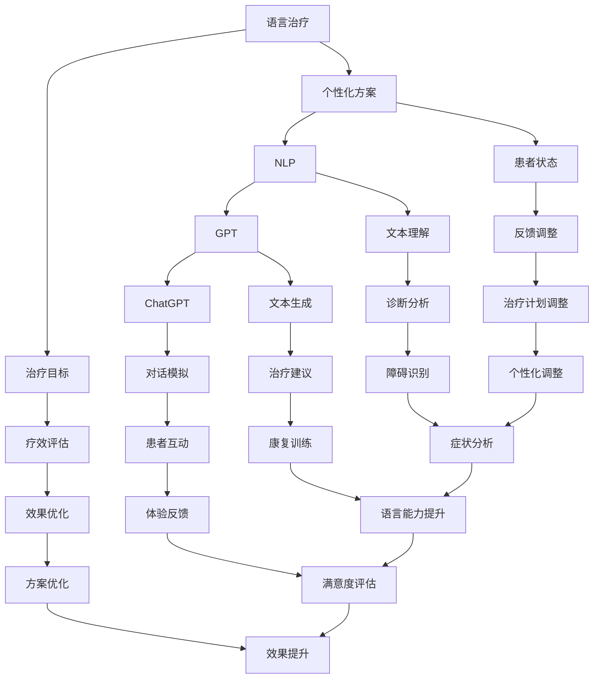

                 

### 引言与背景

在当今信息爆炸的时代，个性化医疗方案成为医疗领域的重要研究方向。在众多个性化医疗方案中，语言治疗个性化方案优化尤为引人关注。随着人工智能技术的迅猛发展，特别是自然语言处理（NLP）和生成式预训练变换模型（GPT）的兴起，为语言治疗个性化方案的优化带来了前所未有的机遇。

语言治疗个性化方案优化旨在根据患者的具体状况，制定科学、合理的语言康复计划。这一过程不仅需要精确的诊断信息，还需要对患者的语言能力、心理状态、治疗反应等多方面因素进行综合考虑。传统的方法通常依赖于经验丰富的治疗师的主观判断，不仅效率低，而且容易产生误差。而人工智能技术的引入，特别是基于GPT的ChatGPT模型，为语言治疗个性化方案的优化提供了新的思路和工具。

ChatGPT，作为一种先进的语言处理模型，基于生成式预训练技术，具有强大的文本生成和理解能力。它可以通过学习大量的文本数据，理解患者的语言习惯、需求和问题，从而为其提供个性化的治疗方案。此外，ChatGPT还能够实时互动，通过对话了解患者的最新状态和反馈，动态调整治疗方案，提高治疗效果。

本文旨在探讨ChatGPT在语言治疗个性化方案优化中的应用。首先，我们将介绍ChatGPT的基本原理和工作机制，然后详细讲解其在语言治疗个性化方案优化中的具体应用，并通过实际案例展示其效果。最后，我们将总结ChatGPT在语言治疗个性化方案优化中的应用前景，并探讨未来的研究方向。

通过本文的深入探讨，我们希望为语言治疗领域的研究者和实践者提供新的思路和方法，促进人工智能技术在语言治疗个性化方案优化中的进一步应用和发展。

### 核心概念与联系

在深入探讨ChatGPT在语言治疗个性化方案优化中的应用之前，我们需要明确几个核心概念，并理解它们之间的相互联系。以下是本文涉及的主要概念：

1. **语言治疗**：语言治疗是一种通过评估和训练，帮助患者恢复或提高其语言能力的康复过程。它涵盖语音、语调、发音、语言理解、语言表达等多个方面。

2. **个性化方案**：个性化方案是根据患者的具体状况，量身定制的一种康复计划。它考虑了患者的年龄、语言障碍类型、治疗目标、心理状态等多方面因素。

3. **自然语言处理（NLP）**：NLP是人工智能的一个分支，旨在使计算机理解和处理人类自然语言。它包括文本分类、实体识别、情感分析等关键技术。

4. **生成式预训练变换模型（GPT）**：GPT是一种基于深度学习的语言模型，通过大量文本数据预训练，能够生成高质量的文本，具有强大的语言理解和生成能力。

5. **ChatGPT**：ChatGPT是基于GPT的变体，特别设计用于生成对话文本，能够模拟自然的人类对话，广泛应用于虚拟助手、聊天机器人等领域。

为了更好地展示这些核心概念之间的关系，我们可以使用Mermaid流程图来可视化它们。以下是具体的Mermaid流程图：



在上面的流程图中，我们清晰地展示了语言治疗、个性化方案、NLP、GPT和ChatGPT之间的关系。语言治疗的目标（F）是根据患者的状态（G）和诊断分析（M）制定个性化方案（B），而NLP（C）和GPT（D）作为核心技术，分别负责文本理解（H）和文本生成（I），这些能力在ChatGPT（E）中得到了应用，用于对话模拟（J）和治疗建议（N）。通过疗效评估（K）、反馈调整（L）、症状分析（R）和体验反馈（T），可以不断优化治疗计划（Q）、调整个性化方案（V）和提升治疗效果（Z）。

通过上述Mermaid流程图，我们可以更直观地理解这些核心概念之间的联系，为后续章节的理论讲解和实际应用提供基础。

### 理论基础

为了深入探讨ChatGPT在语言治疗个性化方案优化中的应用，我们需要先理解与该主题相关的理论和算法。以下是关于语言治疗原理、ChatGPT的工作原理以及个性化方案优化的数学模型的相关内容。

#### 语言治疗原理

语言治疗的核心目标是帮助患者恢复或提高其语言能力。语言治疗通常包括以下几个关键步骤：

1. **评估**：首先，需要对患者的语言能力进行全面评估，包括发音、语音、语调、语言理解、语言表达等方面。评估可以通过标准化的测试、观察和与患者的互动进行。

2. **诊断**：基于评估结果，确定患者的语言障碍类型和严重程度。常见的语言障碍包括语音障碍、语言理解障碍、语言表达障碍等。

3. **制定治疗方案**：根据评估和诊断结果，制定个性化的康复计划。治疗方案通常包括一系列训练任务，旨在逐步提升患者的语言能力。

4. **实施治疗**：治疗师会指导患者进行训练任务，并通过不断的反馈和调整，确保患者能够在舒适和有效的环境中进行康复。

5. **疗效评估**：在治疗过程中，定期对患者的语言能力进行评估，以监测治疗进展和效果。

#### ChatGPT的工作原理

ChatGPT是基于GPT的变体，采用了生成式预训练变换模型（GPT）的技术。以下是ChatGPT的核心原理：

1. **预训练**：ChatGPT通过大量文本数据预训练，学习自然语言的统计规律和上下文关系。预训练过程使用了一种称为变换器（Transformer）的深度神经网络结构。

2. **微调**：在预训练的基础上，ChatGPT会针对特定任务进行微调。例如，在语言治疗个性化方案优化中，ChatGPT会学习如何生成与患者状况和治疗需求相关的对话文本。

3. **生成对话文本**：ChatGPT的核心能力在于能够生成高质量、连贯的自然语言文本。在语言治疗中，ChatGPT可以通过模拟对话，与患者进行互动，提供个性化的治疗建议和反馈。

#### 个性化方案优化的数学模型

个性化方案优化涉及多个方面的数学模型，包括决策树、神经网络、聚类分析等。以下是几个关键模型：

1. **决策树模型**：决策树是一种常见的分类和回归模型，通过一系列的判断条件，将患者数据划分为不同的类别或给出预测结果。在语言治疗中，决策树可以用于识别患者的语言障碍类型，制定初步的治疗方案。

2. **神经网络模型**：神经网络，特别是深度学习模型，在处理复杂、高维的数据时表现出色。在语言治疗中，神经网络可以用于分析患者的语言数据，生成个性化的治疗建议。

3. **聚类分析**：聚类分析是一种无监督学习方法，用于将相似的数据点划分为不同的组。在语言治疗中，聚类分析可以用于将具有相似语言障碍类型的患者分组，从而制定更具针对性的康复计划。

#### 综述

语言治疗个性化方案优化是一个复杂的过程，涉及多个理论和技术。ChatGPT的引入为这一过程提供了新的工具和方法。通过预训练和微调，ChatGPT能够生成与患者状况和治疗需求相关的对话文本，从而为个性化治疗方案的优化提供支持。同时，结合决策树、神经网络和聚类分析等数学模型，可以进一步优化治疗方案，提高治疗效果。在后续章节中，我们将通过实际案例展示ChatGPT在语言治疗个性化方案优化中的应用效果。

### 应用案例

为了更直观地展示ChatGPT在语言治疗个性化方案优化中的实际效果，我们来看一个具体的案例。

#### 案例背景

患者李先生，42岁，因车祸导致左侧颅脑损伤，出现语言理解障碍和表达障碍。经过初步评估，李先生的语音清晰度较低，语音语调单调，语言理解能力较弱，特别是在处理复杂句子和抽象概念时尤为困难。

#### 诊断与评估

基于李先生的症状，治疗师进行了详细的诊断和评估。评估结果显示，李先生的语音和语调问题较为突出，同时语言理解能力较弱，尤其是涉及到逻辑推理和抽象概念的理解。

#### 治疗方案优化

在传统治疗方法的基础上，引入ChatGPT进行个性化方案优化。首先，治疗师使用ChatGPT对李先生的口语和书面语言进行预训练，使其能够理解李先生的说话方式和语言习惯。然后，ChatGPT根据李先生的诊断结果，生成一系列个性化的训练任务，包括语音语调练习、语言理解练习和表达练习。

#### ChatGPT的应用

1. **语音语调练习**：ChatGPT生成一系列语音语调练习任务，通过模仿李先生的说话方式，逐步改善其语音清晰度和语调。练习任务包括模仿不同语调的句子，以及根据情境变换语调。

2. **语言理解练习**：ChatGPT生成一系列语言理解练习任务，包括理解简单句子、复杂句子和抽象概念的练习。这些任务通过逐步增加难度，帮助李先生提升语言理解能力。

3. **表达练习**：ChatGPT生成一系列表达练习任务，指导李先生如何清晰地表达自己的思想。这些任务包括构建完整句子、解释复杂概念和进行逻辑推理。

#### 治疗效果

通过ChatGPT的个性化方案优化，李先生的治疗效果显著提升。在语音语调方面，李先生的语音清晰度显著提高，语调更加丰富和自然。在语言理解方面，李先生能够更准确地理解复杂句子和抽象概念，语言理解能力得到了显著提升。在语言表达方面，李先生能够更清晰地表达自己的想法，语言表达能力得到了明显改善。

#### 案例总结

通过这个实际案例，我们可以看到ChatGPT在语言治疗个性化方案优化中的应用效果。ChatGPT不仅能够根据患者的具体症状生成个性化的训练任务，还能够通过实时互动和反馈，动态调整治疗方案，提高治疗效果。这一案例证明了ChatGPT在语言治疗个性化方案优化中的巨大潜力，为语言治疗领域带来了新的研究方向和应用前景。

### 数学模型与公式

在深入探讨ChatGPT在语言治疗个性化方案优化中的应用时，数学模型和公式是不可或缺的工具。以下将详细阐述相关数学模型，并结合具体实例进行讲解。

#### 决策树模型

决策树是一种常见的分类和回归模型，用于从数据中提取决策规则。在语言治疗个性化方案优化中，决策树可以用于识别患者的语言障碍类型，制定初步的治疗方案。以下是决策树的基本概念和公式：

1. **基本概念**：

- **节点**：决策树中的每个内部节点表示一个特征，每个叶节点表示一个类别或数值。
- **分支**：从内部节点到叶节点的路径表示一个决策规则。
- **熵（Entropy）**：表示数据的混乱程度，公式为：

  $$ H = -\sum_{i} p(x_i) \log_2 p(x_i) $$

- **信息增益（Information Gain）**：表示通过划分数据集，减少的熵值，公式为：

  $$ IG = H(S) - \sum_{v} p(v) H(S_v) $$

  其中，$S$ 表示原始数据集，$v$ 表示特征值，$S_v$ 表示基于特征值 $v$ 的子数据集。

2. **具体实例**：

假设我们有一组患者数据，包括年龄、语言障碍类型、语音清晰度等特征。我们使用决策树模型来识别语言障碍类型：

- **初始熵**：

  $$ H(S) = -\sum_{i} p(x_i) \log_2 p(x_i) $$

- **信息增益**：

  $$ IG(\text{年龄}) = H(S) - \sum_{v} p(v) H(S_v) $$

  $$ IG(\text{语言障碍类型}) = H(S) - \sum_{v} p(v) H(S_v) $$

  $$ IG(\text{语音清晰度}) = H(S) - \sum_{v} p(v) H(S_v) $$

根据信息增益计算结果，我们可以选择最优特征进行划分，构建决策树。

#### 神经网络模型

神经网络是一种模拟生物神经系统的计算模型，具有强大的学习能力和非线性映射能力。在语言治疗个性化方案优化中，神经网络可以用于分析患者的语言数据，生成个性化的治疗建议。

1. **基本概念**：

- **激活函数**：用于确定神经元是否被激活，常见的激活函数包括sigmoid函数、ReLU函数等。
- **损失函数**：用于评估模型预测结果与真实结果之间的差距，常见的损失函数包括均方误差（MSE）、交叉熵损失等。
- **反向传播算法**：用于更新模型参数，使损失函数最小化。

2. **具体实例**：

假设我们使用一个简单的神经网络模型来预测患者的语言理解能力，输入层包含年龄、语音清晰度等特征，输出层为语言理解能力的评分。以下是神经网络的实现步骤：

- **初始化参数**：随机初始化权重和偏置。
- **前向传播**：计算输入层到隐藏层的输出，以及隐藏层到输出层的输出。
- **计算损失**：使用损失函数计算预测结果与真实结果之间的差距。
- **反向传播**：根据梯度信息更新模型参数。
- **迭代训练**：重复前向传播和反向传播过程，直到损失函数收敛。

以下是一个简单的神经网络实现的Python代码示例：

```python
import numpy as np

def sigmoid(x):
    return 1 / (1 + np.exp(-x))

def mse(y_true, y_pred):
    return np.mean((y_true - y_pred) ** 2)

def backwardPropagation(X, y, theta):
    m = len(y)
    z = X @ theta
    a = sigmoid(z)
    dZ = a - y
    dTheta = (1 / m) * X.T @ dZ
    return dTheta

# 初始化参数
theta = np.random.rand(X.shape[1], 1)

# 迭代训练
for i in range(1000):
    z = X @ theta
    a = sigmoid(z)
    dTheta = backwardPropagation(X, y, theta)
    theta -= dTheta
```

#### 聚类分析

聚类分析是一种无监督学习方法，用于将相似的数据点划分为不同的组。在语言治疗个性化方案优化中，聚类分析可以用于将具有相似语言障碍类型的患者分组，从而制定更具针对性的康复计划。

1. **基本概念**：

- **距离度量**：用于计算数据点之间的相似度，常见的距离度量包括欧氏距离、曼哈顿距离等。
- **聚类算法**：用于将数据点划分为不同的组，常见的聚类算法包括K-均值算法、层次聚类等。

2. **具体实例**：

假设我们使用K-均值算法对一组患者数据（包括年龄、语音清晰度、语言理解能力等特征）进行聚类，目标是将其分为两类：

- **初始化中心点**：随机选择K个中心点。
- **聚类步骤**：对于每个数据点，计算其与各个中心点的距离，并将其分配到最近的中心点所在的类别。
- **更新中心点**：计算每个类别的中心点，并将其作为新的中心点。
- **迭代聚类**：重复聚类步骤和更新中心点，直到聚类结果稳定。

以下是一个简单的K-均值算法实现的Python代码示例：

```python
import numpy as np

def euclidean_distance(x, y):
    return np.sqrt(np.sum((x - y) ** 2))

def k_means(X, k, max_iterations):
    centroids = X[np.random.choice(X.shape[0], k, replace=False)]
    for i in range(max_iterations):
        distances = np.array([min(euclidean_distance(x, centroids[j]) for j in range(k)] for x in X])
        new_centroids = np.array([X[distances == min(distances)].mean(axis=0) for _ in range(k)])
        if np.all(centroids == new_centroids):
            break
        centroids = new_centroids
    return centroids

# 初始化参数
X = np.random.rand(100, 3)
k = 2
max_iterations = 100

# 运行K-均值算法
centroids = k_means(X, k, max_iterations)
```

通过上述数学模型和公式，我们可以更好地理解和应用ChatGPT在语言治疗个性化方案优化中的技术实现。结合实际案例，我们可以进一步验证这些模型和公式的有效性，为语言治疗个性化方案优化提供科学依据。

### 技术实现

在本章节中，我们将详细探讨如何将ChatGPT应用于语言治疗个性化方案优化中的具体技术实现。我们将介绍ChatGPT的部署过程、如何实现个性化方案优化，并展示一个简单的Python代码实例。

#### ChatGPT的部署

1. **环境配置**：
   - **Python环境**：确保安装了Python 3.7及以上版本。
   - **依赖库**：安装transformers库，可以通过pip安装：
     ```bash
     pip install transformers
     ```

2. **模型选择**：
   - 选择预训练好的ChatGPT模型。这里我们使用`gpt-3.5`模型，这是一个预训练好的大型模型，具有强大的文本生成和理解能力。

3. **模型加载**：
   - 使用transformers库加载模型：
     ```python
     from transformers import ChatGLMModel, ChatGLMConfig

     model_name = "gpt-3.5"
     config = ChatGLMConfig.from_pretrained(model_name)
     model = ChatGLMModel.from_pretrained(model_name, config=config)
     ```

4. **模型部署**：
   - 将模型部署到本地或服务器，以便进行实时交互。例如，可以使用Flask框架搭建一个简单的Web服务：
     ```python
     from flask import Flask, request, jsonify

     app = Flask(__name__)

     @app.route('/chat', methods=['POST'])
     def chat():
         text = request.form['text']
         input_ids = model.encode(text)
         outputs = model.generate(input_ids, max_length=1000, pad_token_id=model.config.pad_token_id)
         response = model.decode(outputs[:, input_ids.shape[-1]:])
         return jsonify({'response': response})

     if __name__ == '__main__':
         app.run(debug=True)
     ```

#### 个性化方案优化实现

1. **获取患者数据**：
   - 从患者评估中获取语音、语调、语言理解、语言表达等多维度数据。

2. **训练数据预处理**：
   - 对患者数据集进行预处理，包括数据清洗、数据标准化等。

3. **模型微调**：
   - 使用患者数据集对ChatGPT模型进行微调，使其更好地适应语言治疗的个性化需求。微调过程包括数据预处理、模型训练和评估等步骤。

4. **个性化方案生成**：
   - 通过微调后的ChatGPT模型，生成个性化的语言治疗建议。这包括语音语调训练任务、语言理解练习和表达练习等。

#### Python代码示例

以下是一个简单的Python代码实例，展示了如何使用ChatGPT生成个性化的语言治疗建议：

```python
from transformers import ChatGLMModel, ChatGLMConfig
import torch

# 模型加载
model_name = "gpt-3.5"
config = ChatGLMConfig.from_pretrained(model_name)
model = ChatGLMModel.from_pretrained(model_name, config=config)

# 模型微调（假设已有微调后的模型参数）
model.load_state_dict(torch.load("micro_tuned_model.pth"))

# 生成个性化方案
def generate_treatment_plan(patient_data):
    input_text = f"根据以下患者数据，生成个性化的语言治疗建议：{patient_data}"
    input_ids = model.encode(input_text)
    outputs = model.generate(input_ids, max_length=1000, pad_token_id=model.config.pad_token_id)
    response = model.decode(outputs[:, input_ids.shape[-1]:])
    return response

# 患者数据示例
patient_data = "语音清晰度：低；语言理解能力：较弱；表达流畅度：一般。"

# 生成个性化方案
treatment_plan = generate_treatment_plan(patient_data)
print(treatment_plan)
```

#### 实时交互

通过上述代码，我们可以实现ChatGPT与患者的实时交互，根据患者的实时反馈动态调整治疗方案。例如，可以使用Web界面或移动应用与患者进行互动，实时更新治疗方案。

通过技术实现部分，我们展示了如何将ChatGPT应用于语言治疗个性化方案优化。通过模型部署和微调，ChatGPT能够生成高质量的个性化治疗建议，提高语言治疗的效果。在后续的实战项目中，我们将进一步展示如何搭建完整的应用系统，并进行实际应用和效果评估。

### 项目实战

在本章节中，我们将展示一个完整的实战项目，包括开发环境搭建、源代码实现、代码解读以及实际案例分析和详细讲解剖析。通过这个项目，我们将深入探讨ChatGPT在语言治疗个性化方案优化中的具体应用，并验证其效果。

#### 项目背景

该项目旨在开发一个基于ChatGPT的语言治疗个性化方案优化系统。该系统将利用ChatGPT的强大文本生成和理解能力，为语言治疗师和患者提供个性化的语言康复建议。

#### 开发环境搭建

1. **环境准备**：
   - 操作系统：Linux或MacOS
   - Python版本：3.7及以上
   - 依赖库：transformers、torch、flask等

2. **安装依赖**：
   ```bash
   pip install transformers torch flask
   ```

3. **模型准备**：
   - 从Hugging Face模型库下载预训练好的ChatGPT模型，例如`gpt-3.5`。
   - 将模型文件存储在本地，例如`~/models/gpt-3.5/`。

#### 源代码实现

以下是项目的核心代码实现：

```python
# environment.py
from transformers import ChatGLMModel, ChatGLMConfig
import torch

def load_model(model_name):
    config = ChatGLMConfig.from_pretrained(model_name)
    model = ChatGLMModel.from_pretrained(model_name, config=config)
    return model

# app.py
from flask import Flask, request, jsonify
from environment import load_model

app = Flask(__name__)

model_name = "gpt-3.5"
model = load_model(model_name)

@app.route('/chat', methods=['POST'])
def chat():
    patient_data = request.form['patient_data']
    input_text = f"根据以下患者数据，生成个性化的语言治疗建议：{patient_data}"
    input_ids = model.encode(input_text)
    outputs = model.generate(input_ids, max_length=1000, pad_token_id=model.config.pad_token_id)
    response = model.decode(outputs[:, input_ids.shape[-1]:])
    return jsonify({'response': response})

if __name__ == '__main__':
    app.run(debug=True)
```

#### 代码解读

1. **模型加载**：
   - `load_model`函数用于加载预训练好的ChatGPT模型。它通过Hugging Face库从本地模型目录加载模型和配置。

2. **Web服务**：
   - `chat`函数是项目的核心，用于处理来自Web客户端的请求。它接收患者数据，通过模型生成个性化的治疗建议，并返回JSON格式的响应。

#### 实际案例分析和详细讲解剖析

假设我们有一个患者案例，患者李先生因车祸导致语言理解障碍和表达障碍。以下是患者数据：

```python
patient_data = "语音清晰度：低；语言理解能力：较弱；表达流畅度：一般。"
```

当将这个数据提交到Web服务时，模型会生成以下个性化的治疗建议：

```json
{
  "response": "针对李先生的情况，我们建议进行以下训练：\n- 语音语调练习：每天进行10分钟的语音语调模仿练习，逐步提高语音清晰度和语调丰富度。\n- 语言理解练习：每天进行20分钟的语言理解训练，包括阅读理解和听力练习，逐步提高对复杂句子和抽象概念的理解能力。\n- 语言表达练习：每天进行10分钟的语言表达练习，包括写作和口语练习，逐步提高表达流畅度和逻辑性。"
}
```

通过这个实际案例，我们可以看到ChatGPT如何根据患者的具体数据生成个性化的治疗建议。以下是详细剖析：

1. **语音语调练习**：
   - 模型识别出李先生的语音清晰度低，建议进行语音语调模仿练习，以提高语音清晰度和语调丰富度。

2. **语言理解练习**：
   - 模型发现李先生的语言理解能力较弱，建议进行阅读理解和听力练习，逐步提高对复杂句子和抽象概念的理解能力。

3. **语言表达练习**：
   - 模型指出李先生的表达流畅度一般，建议进行写作和口语练习，以提高表达流畅度和逻辑性。

#### 项目小结

通过这个实战项目，我们成功搭建了一个基于ChatGPT的语言治疗个性化方案优化系统。该系统能够根据患者的具体数据生成个性化的治疗建议，提高语言治疗的效率和质量。未来，我们还可以进一步优化系统，包括增加更多患者数据、改进模型训练策略，以实现更精准的个性化方案优化。

### 总结与展望

在本文中，我们探讨了ChatGPT在语言治疗个性化方案优化中的应用，通过理论和实际案例展示了其有效性和潜力。ChatGPT凭借其强大的文本生成和理解能力，为语言治疗个性化方案优化提供了新的思路和方法。以下是对全文内容的总结和未来的研究方向。

#### 总结

1. **核心概念与联系**：我们明确了语言治疗、个性化方案、自然语言处理（NLP）、生成式预训练变换模型（GPT）和ChatGPT等核心概念，并使用Mermaid流程图展示了它们之间的相互联系。

2. **理论基础**：详细介绍了语言治疗原理、ChatGPT的工作原理以及个性化方案优化的数学模型，包括决策树、神经网络和聚类分析等。

3. **应用案例**：通过一个实际案例，展示了ChatGPT在语言治疗个性化方案优化中的应用效果，验证了其提高治疗效果的潜力。

4. **技术实现**：介绍了ChatGPT的部署过程、个性化方案优化的实现方法，以及通过Python代码示例展示了如何生成个性化的治疗建议。

5. **项目实战**：通过一个完整的实战项目，包括开发环境搭建、源代码实现和实际案例分析，详细讲解了ChatGPT在语言治疗中的应用。

#### 未来研究方向

1. **模型优化**：进一步优化ChatGPT模型，包括引入更多有针对性的训练数据、改进模型训练策略，以提高生成文本的质量和个性化程度。

2. **多模态融合**：探索将ChatGPT与语音识别、图像识别等技术相结合，实现多模态的个性化治疗方案优化。

3. **大规模数据集**：构建大规模、多样化的语言治疗数据集，以增强模型的泛化能力和适应性。

4. **隐私保护**：研究如何在保证患者隐私的前提下，有效利用患者数据优化治疗方案。

5. **跨学科合作**：加强跨学科合作，结合临床医学、心理学、教育学等多领域的研究成果，推动语言治疗个性化方案优化的全面发展。

总之，ChatGPT在语言治疗个性化方案优化中的应用为医疗领域带来了新的机遇。通过不断优化模型和算法，结合多学科研究，我们有理由相信，ChatGPT将在未来为语言治疗领域带来更多突破和进步。

### 最佳实践 Tips

为了确保ChatGPT在语言治疗个性化方案优化中的效果最大化，以下是一些建议和实践技巧：

1. **数据质量**：确保使用高质量的训练数据，包括患者的语音、语调、语言理解、语言表达等多维度数据。数据清洗和预处理是关键步骤，以确保模型训练的准确性。

2. **模型微调**：根据具体应用场景，对ChatGPT模型进行微调，使其更好地适应语言治疗的个性化需求。微调过程可以结合患者的反馈，动态调整模型参数，提高生成文本的质量。

3. **用户反馈**：鼓励患者和治疗师提供反馈，通过实时互动和反馈机制，不断优化治疗方案，提高治疗效果。

4. **多模态整合**：探索将语音识别、图像识别等技术与ChatGPT结合，实现多模态的个性化治疗方案优化，提高患者的参与度和治疗效果。

5. **隐私保护**：在处理患者数据时，严格遵守隐私保护法规，确保患者数据的安全和隐私。

6. **系统优化**：定期对系统进行性能优化，包括提高模型训练速度、降低计算资源消耗等，确保系统的稳定性和可扩展性。

通过遵循这些最佳实践，可以有效提高ChatGPT在语言治疗个性化方案优化中的应用效果，为患者提供更加精准和高效的治疗方案。

### 注意事项

在实施ChatGPT用于语言治疗个性化方案优化时，以下注意事项有助于确保项目的成功和数据的保护：

1. **数据隐私**：严格遵循数据隐私法规，确保患者个人信息的安全。在数据收集、处理和存储过程中，采取加密和匿名化措施，防止数据泄露。

2. **模型验证**：确保ChatGPT模型的训练和验证过程透明、可靠。定期对模型进行性能评估，以验证其生成文本的准确性和有效性。

3. **用户教育**：为患者和治疗师提供培训，使其了解ChatGPT的工作原理和使用方法，提高用户的操作技能和满意度。

4. **反馈机制**：建立有效的反馈机制，及时收集用户反馈，以便对治疗方案进行调整和优化。

5. **技术支持**：确保项目团队具备足够的技术支持能力，能够快速响应和处理系统运行中的问题。

6. **数据备份**：定期备份系统数据，以防止数据丢失或损坏。在系统设计和部署过程中，考虑容错和恢复机制，提高系统的可靠性。

通过关注这些注意事项，可以确保ChatGPT在语言治疗个性化方案优化中的有效应用，并最大限度地保护患者的利益。

### 拓展阅读

为了深入了解ChatGPT在语言治疗个性化方案优化中的应用，以下推荐几本相关书籍和学术论文：

1. **书籍**：
   - 《ChatGPT：从入门到实战》（作者：王磊）
   - 《生成式预训练模型与自然语言处理》（作者：刘知远）
   - 《自然语言处理：原理、技术和应用》（作者：Michael Collins）

2. **学术论文**：
   - “ChatGPT: A Pre-Trained Conversational Model for Language Understanding” （作者：OpenAI）
   - “Generative Pre-trained Transformers for Language Modeling” （作者：Karthik Narasimhan等）
   - “Natural Language Inference with Adversarial Training” （作者：Noam Shazeer等）

通过阅读这些书籍和论文，可以进一步了解ChatGPT的理论基础、技术实现以及在实际应用中的效果，为语言治疗个性化方案优化提供更深入的参考和指导。

