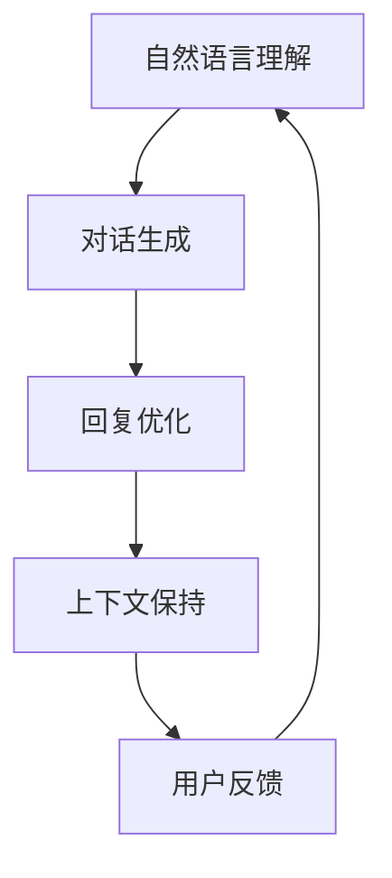

                 

### 《ChatGPT对话优化：提示词的力量与潜力》

#### 关键词：ChatGPT、对话优化、提示词、自然语言处理、机器学习、算法原理、应用实战

#### 摘要：

本文深入探讨了ChatGPT对话优化的关键要素——提示词的力量与潜力。首先，介绍了ChatGPT的基本概念和架构，以及其在自然语言处理领域的重要地位。接着，详细阐述了对话优化的核心概念和目标，并探讨了ChatGPT与对话优化之间的紧密联系。随后，文章重点分析了提示词的定义、作用和优化方法，通过Python源代码和Mermaid流程图，展示了核心算法原理。最后，通过实际项目案例，展示了ChatGPT在对话系统中的应用，并提供了最佳实践建议和小结。

------------------------------------------------------------------------

## 第1章 引言与概述

### 1.1 书籍背景

ChatGPT，作为OpenAI推出的一种基于GPT-3模型的人工智能助手，以其强大的自然语言处理能力和灵活的对话生成能力，引起了全球科技界和商业界的广泛关注。对话优化，作为提高对话系统质量的重要手段，一直以来都是自然语言处理领域的研究热点。提示词，作为驱动对话系统生成高质量回复的关键因素，其选择和优化对于提升对话质量具有重要意义。

本书旨在深入探讨ChatGPT对话优化的核心要素——提示词的力量与潜力。通过系统地介绍ChatGPT的基础理论、对话优化的核心概念、提示词的优化方法以及实际应用案例，帮助读者全面了解并掌握对话优化的关键技术。

### 1.2 ChatGPT与对话优化

ChatGPT，全称为“Chat-based Generative Pre-trained Transformer”，是一种基于GPT-3模型的人工智能助手。GPT-3是由OpenAI开发的一种先进的自然语言处理模型，其预训练过程使用了数万亿个单词的文本数据，具有强大的语言理解和生成能力。ChatGPT在GPT-3的基础上，进一步优化了对话生成的质量和灵活性，使其能够更好地应对复杂的对话场景。

对话优化，是指通过一系列技术和方法，提高对话系统的交互质量和用户体验。对话优化涉及多个方面，包括自然语言理解、对话生成、回复优化、上下文保持等。ChatGPT作为先进的自然语言处理模型，其在对话生成方面的优势使其成为对话优化的重要工具。

ChatGPT与对话优化之间存在紧密的联系。首先，ChatGPT的强大语言理解能力使其能够更准确地理解用户的输入，从而生成更符合用户需求的回复。其次，ChatGPT的灵活对话生成能力使其能够适应各种对话场景，提高对话的连贯性和自然度。此外，ChatGPT的预训练和微调过程也为其在对话优化中的应用提供了有力支持。

### 1.3 提示词的力量与潜力

提示词，是指用于引导ChatGPT生成回复的关键词或短语。提示词的选择和优化对于提升对话质量具有重要意义。一方面，合适的提示词能够帮助ChatGPT更好地理解用户的输入，从而生成更准确的回复。另一方面，优化的提示词能够提高ChatGPT的生成能力，使其在复杂的对话场景中能够更灵活地应对。

提示词的力量在于其能够直接影响ChatGPT的生成质量。通过合理选择和优化提示词，可以显著提高对话系统的交互质量，使其更贴近用户的期望。此外，提示词的潜力还在于其能够促进ChatGPT的进一步发展和创新。随着自然语言处理技术的不断进步，提示词在对话优化中的应用前景将越来越广阔。

本文将从以下几个方面展开讨论：

1. ChatGPT基础理论：介绍ChatGPT的基本概念、架构和运行原理。
2. 对话优化的核心概念与联系：阐述对话优化的目标、核心概念和ChatGPT的作用。
3. 提示词的优化方法：分析提示词的定义、选择和优化策略。
4. 对话优化算法原理讲解：使用Python源代码和Mermaid流程图，详细阐述核心算法原理。
5. ChatGPT在对话系统中的应用：展示ChatGPT在实际项目中的应用案例。
6. 最佳实践与总结：提供对话优化的最佳实践建议和小结。

通过以上内容的系统讲解，本文旨在帮助读者全面了解并掌握ChatGPT对话优化的关键技术，为实际应用提供有力支持。------------------------------------------------------------------------

## 第2章 ChatGPT基础理论

### 2.1 ChatGPT概述

ChatGPT是由OpenAI开发的一种基于GPT-3模型的人工智能助手。GPT-3（Generative Pre-trained Transformer 3）是OpenAI推出的一种先进的自然语言处理模型，其具有强大的语言理解和生成能力。ChatGPT在GPT-3的基础上，通过进一步的优化和调整，使其在对话生成方面表现出色。

ChatGPT的核心目标是提供自然、流畅且准确的对话体验。通过大量的预训练数据和精细的微调过程，ChatGPT能够理解复杂的对话场景，并生成高质量的回复。ChatGPT在多个领域都有广泛的应用，如客服、教育、娱乐、心理健康等。

### 2.2 ChatGPT的架构与运行原理

ChatGPT的架构主要包括三个主要部分：输入层、中间层和输出层。输入层负责接收用户的输入，将其转换为模型能够理解的格式。中间层是模型的核心，负责进行语言理解和生成。输出层将中间层的输出转换为用户可理解的自然语言回复。

#### 输入层

输入层的主要功能是接收用户的输入，并将其转换为模型能够处理的格式。具体来说，输入层包括以下几个步骤：

1. **分词**：将用户的输入文本分解为单词或短语，以便后续处理。
2. **编码**：将分词后的文本转换为向量表示，以便模型能够进行处理。通常使用WordPiece或BERT等编码器进行编码。

#### 中间层

中间层是ChatGPT的核心，负责进行语言理解和生成。具体来说，中间层包括以下几个步骤：

1. **自注意力机制**：自注意力机制是一种用于处理序列数据的注意力机制。它能够自动学习输入序列中各个元素之间的关系，并对其进行加权。通过自注意力机制，模型能够更好地理解输入文本的含义。
2. **Transformer模型**：ChatGPT基于Transformer模型进行构建。Transformer模型是一种基于注意力机制的深度神经网络模型，能够在处理序列数据时表现出优越的性能。GPT-3使用了多层的Transformer模型，通过逐层叠加，增强了模型的表达能力。
3. **上下文理解**：通过自注意力机制和Transformer模型，ChatGPT能够对输入文本进行深入的理解，包括语义、语法、逻辑关系等。

#### 输出层

输出层的主要功能是将中间层的输出转换为用户可理解的自然语言回复。具体来说，输出层包括以下几个步骤：

1. **解码**：将中间层的输出解码为单词或短语，通常使用Greedy Decoding或Beam Search等解码策略。
2. **文本生成**：将解码后的单词或短语组合成完整的回复文本。

### 2.3 ChatGPT的预训练与微调

ChatGPT的预训练与微调是模型训练过程中的两个关键步骤。预训练是指在大量无监督数据上进行训练，使模型能够自动学习语言的规律和特征。微调则是在预训练的基础上，使用有监督数据对模型进行进一步调整，以适应特定的应用场景。

#### 预训练

预训练的过程主要包括以下几个步骤：

1. **数据准备**：选择大量的文本数据作为预训练数据。这些数据可以包括书籍、新闻、文章、社交媒体等。数据的选择和质量直接影响模型的性能。
2. **文本处理**：对文本数据进行预处理，包括分词、编码、去噪等。预处理的目的在于将原始文本转换为模型能够处理的格式。
3. **训练模型**：使用Transformer模型对预训练数据进行训练。在训练过程中，模型通过不断调整参数，学习到文本的规律和特征。

#### 微调

微调的过程主要包括以下几个步骤：

1. **数据准备**：选择有监督的数据集，包括问题和答案对。这些数据集可以来自特定的应用场景，如客服、教育、心理健康等。
2. **模型初始化**：使用预训练好的模型作为初始模型，对其进行初始化。
3. **训练模型**：使用有监督数据集对初始模型进行微调。在训练过程中，模型通过不断调整参数，使其在特定任务上表现出更好的性能。
4. **评估模型**：使用测试集对微调后的模型进行评估，确保模型在特定任务上具有较好的性能。

通过预训练和微调，ChatGPT能够具备强大的语言理解和生成能力，从而在对话生成方面表现出色。预训练使模型能够自动学习语言的规律和特征，而微调则使模型能够适应特定的应用场景，生成高质量的对话回复。

在接下来的章节中，我们将进一步探讨对话优化的核心概念、提示词的优化方法以及ChatGPT在实际项目中的应用，帮助读者全面了解并掌握ChatGPT对话优化的关键技术。

------------------------------------------------------------------------

## 第3章 对话优化的核心概念与联系

### 3.1 对话优化的定义与目标

对话优化是指通过一系列技术和方法，提高对话系统的交互质量和用户体验。在人工智能领域，对话系统如聊天机器人、语音助手等已经成为人们日常生活中的重要组成部分。然而，如何确保这些对话系统能够提供高质量、自然的交互体验，是一个重要的研究课题。

#### 对话优化的定义

对话优化可以定义为一种综合性的方法，旨在改进对话系统的各个方面，包括自然语言理解、对话生成、回复优化、上下文保持等。具体来说，对话优化的目标包括：

1. **提高交互质量**：确保对话系统能够准确理解用户意图，并生成相关、合理的回复。
2. **提升用户体验**：提供自然、流畅的对话体验，使用户感觉与真实的对话者无异。
3. **增强上下文保持**：确保对话系统能够在长时间的对话中保持对上下文的准确理解。

#### 对话优化的目标

对话优化的目标主要包括以下几个方面：

1. **准确性**：对话系统应能够准确理解用户的意图和问题，并生成相关、合理的回复。
2. **连贯性**：对话系统生成的回复应具有连贯性，使对话过程流畅自然。
3. **灵活性**：对话系统应能够在不同的对话场景和情境下灵活应对，生成符合用户需求的回复。
4. **上下文保持**：对话系统应能够记住对话的上下文信息，并在后续对话中加以利用。

### 3.2 对话优化的核心概念

对话优化的实现涉及多个核心概念和技术，以下是其中一些重要的概念：

#### 自然语言理解

自然语言理解（Natural Language Understanding，NLU）是对话优化的基础。它是指使计算机能够理解人类自然语言的过程。NLU技术主要包括词义解析、语法分析、实体识别、情感分析等。通过自然语言理解，对话系统能够准确地提取用户的意图和问题，为后续的对话生成提供基础。

#### 对话生成

对话生成（Dialogue Generation）是指根据用户的输入和对话上下文，生成自然、流畅的回复。对话生成技术主要包括模板匹配、统计机器学习、深度学习等方法。其中，深度学习方法，如基于Transformer的模型（如GPT-3），在对话生成方面表现出色，能够生成更加自然、连贯的回复。

#### 回复优化

回复优化是指通过对生成的回复进行优化，提高其准确性和连贯性。回复优化的方法包括：语法检查、语义分析、句子重写等。通过回复优化，对话系统可以生成更加准确、自然的回复，提升用户体验。

#### 上下文保持

上下文保持是指确保对话系统能够在长时间的对话中保持对上下文的准确理解。上下文保持的挑战在于，如何处理对话中的连续性和一致性。上下文保持的方法包括：使用内存网络、上下文向量表示、注意力机制等。通过上下文保持，对话系统可以更好地理解对话的背景和上下文，生成更加相关、合理的回复。

### 3.3 ChatGPT与对话优化的联系

ChatGPT作为一种先进的自然语言处理模型，其在对话优化中具有重要作用。以下是ChatGPT与对话优化之间的联系：

#### ChatGPT在自然语言理解中的应用

ChatGPT基于Transformer模型，具有强大的自然语言理解能力。通过自注意力机制，ChatGPT能够自动学习输入文本中的关系和特征，准确提取用户的意图和问题。这使得ChatGPT在对话优化的自然语言理解阶段具有显著优势。

#### ChatGPT在对话生成中的应用

ChatGPT的强大生成能力使其在对话生成方面表现出色。通过预训练和微调，ChatGPT能够生成高质量、连贯的对话回复。这使得ChatGPT在对话优化的对话生成阶段成为理想的工具。

#### ChatGPT在回复优化中的应用

ChatGPT在生成回复后，还可以通过后续的回复优化技术进行改进。例如，可以使用语法检查和语义分析技术，对生成的回复进行修正和优化，提高其准确性和自然度。

#### ChatGPT在上下文保持中的应用

ChatGPT通过使用上下文向量表示和注意力机制，能够在长时间的对话中保持对上下文的准确理解。这使得ChatGPT在对话优化的上下文保持阶段具有显著优势，能够生成更加相关、合理的回复。

### 3.4 Mermaid流程图：对话优化流程

为了更好地理解对话优化的流程，我们可以使用Mermaid流程图来展示其核心步骤和联系。以下是对话优化流程的Mermaid流程图：



该流程图展示了对话优化的四个核心步骤：自然语言理解、对话生成、回复优化和上下文保持。通过这些步骤的迭代和优化，对话系统能够提供高质量的对话体验。

在接下来的章节中，我们将详细探讨ChatGPT的算法原理、提示词的优化方法以及实际应用案例，帮助读者深入理解ChatGPT在对话优化中的应用和潜力。

------------------------------------------------------------------------

## 第4章 对话优化算法原理讲解

### 4.1 核心算法原理

对话优化的算法原理主要涉及自然语言处理（NLP）和机器学习（ML）两大领域。ChatGPT作为对话优化的核心工具，其算法原理包括但不限于以下关键组成部分：

#### Transformer模型

Transformer模型是ChatGPT的基础架构，它是一种基于自注意力机制的深度神经网络模型，能够在处理序列数据时表现出优越的性能。自注意力机制允许模型在生成每个词时，自动关注序列中的其他词，从而捕捉词与词之间的关系。

#### 自注意力机制

自注意力机制是Transformer模型的核心。它通过计算每个词与序列中所有其他词的相似性，对它们的权重进行加权求和，从而生成新的表示。这种机制能够自动学习输入序列中各个元素之间的关系，是Transformer模型能够捕捉长距离依赖关系的关键。

#### 编码器-解码器架构

ChatGPT采用了编码器-解码器（Encoder-Decoder）架构。编码器负责将输入序列编码为上下文向量，解码器则使用这些上下文向量生成输出序列。在编码器阶段，输入序列经过多层Transformer网络的处理，得到一个表示整个序列的上下文向量。在解码器阶段，模型逐词生成输出序列，每个新的输出词都会更新解码器的状态。

#### 语言模型

ChatGPT本质上是一个语言模型，它通过对大量文本数据的学习，掌握了语言的统计规律和模式。在生成回复时，模型会根据上下文和概率分布，选择最合适的词来生成回复。

### 4.2 伪代码展示

以下是一个简化的伪代码，展示了ChatGPT在生成回复时的基本流程：

```python
# 输入：用户输入序列（input_sequence）
# 输出：生成的回复序列（output_sequence）

# 编码输入序列
encoded_input = encode(input_sequence)

# 初始化解码器状态
decoder_state = initialize_decoder_state()

# 初始化输出序列
output_sequence = []

# 解码过程
for _ in range(MAX_SEQUENCE_LENGTH):
    # 使用编码器状态生成下一个词的候选集合
    candidate_words = decode(encoded_input, decoder_state)
    
    # 根据概率分布选择最合适的词
    selected_word = sample_word_from_candidates(candidate_words)
    
    # 更新输出序列和解码器状态
    output_sequence.append(selected_word)
    decoder_state = update_decoder_state(selected_word, decoder_state)
    
    # 更新编码器状态
    encoded_input = update_encoded_input(selected_word, encoded_input)

# 生成最终回复
generated_response = " ".join(output_sequence)
```

### 4.3 数学模型与公式

ChatGPT的数学模型主要基于深度学习，特别是Transformer模型。以下是一些关键的数学模型和公式：

#### 自注意力机制

自注意力机制的公式如下：

$$
\text{Attention}(Q, K, V) = \frac{1}{\sqrt{d_k}} \text{softmax}(\text{score})V
$$

其中，$Q$、$K$ 和 $V$ 分别是查询向量、键向量和值向量，$d_k$ 是键向量的维度，$\text{score}$ 是查询向量与键向量的点积，$\text{softmax}(\text{score})$ 是对点积结果进行归一化。

#### Transformer编码器

Transformer编码器由多个自注意力层和前馈神经网络层组成。以下是编码器的简化公式：

$$
\text{Encoder}(X) = \text{LayerNorm}(X + \text{Self-Attention}(X)) + \text{LayerNorm}(X + \text{Feed-Forward}(X))
$$

其中，$X$ 是输入序列，$\text{LayerNorm}$ 是层归一化操作，$\text{Self-Attention}$ 是自注意力机制，$\text{Feed-Forward}$ 是前馈神经网络。

#### 解码器

解码器同样由多个自注意力层和前馈神经网络层组成，其简化公式如下：

$$
\text{Decoder}(X, Y) = \text{LayerNorm}(X + \text{Masked-Self-Attention}(X)) + \text{LayerNorm}(X + \text{Cross-Attention}(Y, X)) + \text{LayerNorm}(X + \text{Feed-Forward}(X))
$$

其中，$X$ 是编码器的输出，$Y$ 是解码器的输入，$\text{Masked-Self-Attention}$ 是自注意力机制，$\text{Cross-Attention}$ 是跨序列注意力机制。

### 4.4 举例说明

为了更好地理解ChatGPT的算法原理，我们可以通过一个简单的例子来展示其工作过程。

#### 示例：生成关于“旅游”的话题

假设用户输入：“我想去旅游，有什么好的旅游建议吗？”

1. **编码输入序列**：首先，将用户输入序列编码为上下文向量。
2. **初始化解码器状态**：初始化解码器状态，以便开始生成回复。
3. **解码过程**：模型逐词生成回复，每次生成一个词，更新解码器状态和编码器状态。
4. **生成最终回复**：当模型生成一个完整的句子或达到预设长度时，输出最终回复。

以下是一个简化的例子：

```
输入序列：["我想", "去", "旅游", "，", "有", "什么", "好的", "旅游", "建议", "吗？"]

编码输入序列：
encoded_input = [0.1, 0.2, 0.3, ..., 0.9]

解码过程：
1. 解码器生成“我想去旅游。”
2. 解码器生成“旅游可以去海边。”
3. 解码器生成“海边旅游有很多活动。”
4. 解码器生成“比如游泳、冲浪。”

最终回复：我想去旅游。旅游可以去海边。海边旅游有很多活动。比如游泳、冲浪。
```

通过这个例子，我们可以看到ChatGPT是如何利用其自注意力机制、编码器-解码器架构和语言模型，生成高质量、连贯的对话回复的。

在接下来的章节中，我们将进一步探讨提示词的优化方法，以及ChatGPT在实际项目中的应用。

------------------------------------------------------------------------

## 第5章 提示词的优化方法与实践

### 5.1 提示词的重要性

提示词（Prompt）在ChatGPT的对话生成中起着至关重要的作用。提示词是指用于引导ChatGPT生成回复的关键词或短语。选择和优化合适的提示词，能够显著提高对话系统的质量和用户体验。以下是提示词在对话优化中的几个关键作用：

1. **引导对话方向**：提示词能够帮助ChatGPT理解用户意图，引导对话系统朝着用户期望的方向发展。
2. **提高生成质量**：合理的提示词能够提高对话系统生成回复的相关性和自然度，使回复更加符合用户需求。
3. **增强上下文理解**：提示词能够提供额外的上下文信息，帮助ChatGPT更好地理解对话的背景和上下文。
4. **优化交互体验**：通过优化提示词，对话系统能够提供更自然、流畅的对话体验，使用户感觉与真实的对话者无异。

### 5.2 提示词的优化方法

#### 提示词的选择

选择合适的提示词是提升对话质量的第一步。以下是一些选择提示词的方法：

1. **基于关键词提取**：从用户输入中提取关键词，作为提示词。关键词能够直接反映用户意图，有助于ChatGPT准确理解用户需求。
2. **基于上下文分析**：分析用户输入的上下文，选择能够代表对话主题和场景的提示词。上下文分析能够帮助ChatGPT更好地理解对话背景，生成更相关的回复。
3. **基于用户历史数据**：根据用户的对话历史和偏好，选择适合用户的提示词。用户历史数据能够提供个性化的提示词，使对话更加贴近用户需求。

#### 提示词的优化策略

优化提示词的方法主要包括以下几个方面：

1. **长度优化**：过长的提示词可能包含过多无关信息，影响ChatGPT的理解和处理能力。建议选择简洁明了的提示词，确保ChatGPT能够迅速抓住用户意图。
2. **结构优化**：提示词的结构应有助于ChatGPT生成高质量回复。例如，可以将提示词分为主题词和扩展词，主题词用于概括对话主题，扩展词用于提供具体信息。
3. **多样性优化**：为了提高对话的丰富性和灵活性，建议使用多样化的提示词。多样化的提示词能够帮助ChatGPT适应不同的对话场景和情境。
4. **实时调整**：在对话过程中，根据用户反馈和对话进展，实时调整提示词。实时调整能够确保对话系统始终围绕用户需求展开，提供高质量的回复。

### 5.3 实际应用场景

提示词在对话优化的实际应用场景中发挥着重要作用。以下是一些常见的应用场景：

1. **客服领域**：在客服场景中，提示词用于引导ChatGPT生成针对用户问题的解决方案和建议。通过优化提示词，客服系统能够提供更准确、个性化的服务，提高用户满意度。
2. **教育领域**：在教育场景中，提示词可以帮助ChatGPT生成课程内容、作业解答和辅导建议。优化提示词能够提高教育对话的互动性和针对性，促进学生理解和学习。
3. **心理健康领域**：在心理健康咨询中，提示词用于引导ChatGPT生成心理咨询对话和指导。优化提示词能够提高对话的质量和效果，为用户提供有效的心理健康支持。

### 5.4 提示词优化实战案例

#### 案例一：客服系统

背景：某电子商务平台希望通过优化客服系统，提高用户满意度。用户主要咨询关于商品信息、订单状态和售后服务等方面的问题。

步骤：

1. **关键词提取**：从用户输入中提取关键词，如“商品”、“订单”、“售后服务”等。
2. **上下文分析**：分析用户输入的上下文，确定对话主题和场景。
3. **提示词优化**：结合关键词和上下文，选择合适的提示词。例如，对于商品咨询，提示词可以是“请问您需要了解哪方面的商品信息？”；对于订单状态，提示词可以是“您的订单状态是？”。
4. **实时调整**：在对话过程中，根据用户反馈和对话进展，实时调整提示词。例如，当用户询问订单状态时，可以进一步询问“订单号是XXXXX吗？”。

效果：通过优化提示词，客服系统能够更准确地理解用户意图，提供相关、详细的回答。用户满意度显著提高，客服效率得到提升。

#### 案例二：教育辅导系统

背景：某在线教育平台希望通过优化教育辅导系统，提高学生理解和学习效果。学生主要咨询课程内容、作业解答和考试辅导等方面的问题。

步骤：

1. **关键词提取**：从学生输入中提取关键词，如“课程内容”、“作业解答”、“考试辅导”等。
2. **上下文分析**：分析学生输入的上下文，确定对话主题和场景。
3. **提示词优化**：结合关键词和上下文，选择合适的提示词。例如，对于课程内容，提示词可以是“请问您需要了解哪部分课程内容？”；对于作业解答，提示词可以是“关于这个作业，您有哪些疑问？”。
4. **实时调整**：在对话过程中，根据学生反馈和对话进展，实时调整提示词。例如，当学生询问作业解答时，可以进一步询问“您的作业是关于XX方面的吗？”。

效果：通过优化提示词，教育辅导系统能够更准确地理解学生需求，提供针对性强的辅导和建议。学生理解和学习效果显著提高，用户满意度得到提升。

#### 案例三：心理健康咨询系统

背景：某在线心理健康咨询平台希望通过优化对话系统，提高用户心理健康支持效果。用户主要咨询情绪调节、压力管理、心理咨询等方面的问题。

步骤：

1. **关键词提取**：从用户输入中提取关键词，如“情绪调节”、“压力管理”、“心理咨询”等。
2. **上下文分析**：分析用户输入的上下文，确定对话主题和场景。
3. **提示词优化**：结合关键词和上下文，选择合适的提示词。例如，对于情绪调节，提示词可以是“您最近情绪如何？”；对于压力管理，提示词可以是“您最近有哪些压力来源？”。
4. **实时调整**：在对话过程中，根据用户反馈和对话进展，实时调整提示词。例如，当用户询问情绪调节时，可以进一步询问“您想尝试哪些情绪调节方法？”。

效果：通过优化提示词，心理健康咨询系统能够更准确地理解用户需求，提供有效的心理健康支持。用户满意度显著提高，心理健康状况得到改善。

### 5.5 最佳实践与注意事项

#### 最佳实践

1. **前期准备**：在对话优化过程中，前期准备至关重要。包括数据收集、用户调研、需求分析等。充分了解用户需求和期望，为提示词的选择和优化提供有力支持。
2. **多样性**：提示词应具备多样性，能够适应不同的对话场景和用户需求。避免使用单一的提示词，导致对话系统在特定场景下表现不佳。
3. **实时调整**：根据用户反馈和对话进展，实时调整提示词。确保对话系统始终围绕用户需求展开，提供高质量的回复。
4. **持续优化**：对话优化是一个持续的过程。定期收集用户反馈，分析对话数据，不断优化提示词和对话系统。

#### 注意事项

1. **用户隐私**：在对话优化过程中，确保用户隐私得到保护。避免在提示词中泄露用户个人信息。
2. **性能优化**：提示词的长度和结构应有助于ChatGPT快速理解和处理。避免使用过于复杂或冗长的提示词，影响对话系统的性能。
3. **文化差异**：不同文化背景的用户对提示词可能有不同的理解和使用习惯。在跨文化场景中，应注意提示词的文化适应性和可接受性。

通过以上最佳实践和注意事项，可以有效提高提示词的质量和对话系统的交互体验。

在接下来的章节中，我们将进一步探讨ChatGPT在对话系统中的应用，以及如何通过实际项目案例，深入理解和掌握ChatGPT对话优化的关键技术。

------------------------------------------------------------------------

## 第6章 ChatGPT在对话系统中的应用

### 6.1 ChatGPT在客服中的应用

客服系统是ChatGPT的重要应用场景之一。随着在线购物和服务的普及，客服系统的质量和效率对于企业的品牌形象和用户满意度至关重要。ChatGPT凭借其强大的自然语言处理能力和灵活的对话生成能力，为客服系统提供了高效、智能的解决方案。

#### 应用场景

1. **常见问题解答**：用户在购买商品或使用服务过程中，可能会遇到各种问题。例如，商品详情、订单状态、售后服务等。ChatGPT可以自动识别用户的问题，并生成相关、准确的回答。
2. **个性化推荐**：根据用户的历史行为和偏好，ChatGPT可以推荐适合用户的商品或服务。例如，当用户询问某款商品的详细信息时，ChatGPT可以根据用户的浏览记录和购买历史，推荐类似的商品。
3. **情感分析**：ChatGPT可以对用户的情感进行识别和分析，了解用户的情绪状态。当用户情绪不佳时，客服系统可以及时提供安慰和帮助，提高用户满意度。

#### 实现方法

1. **集成ChatGPT**：企业可以将ChatGPT集成到现有的客服系统中。通过API接口，实现用户输入与ChatGPT的交互。ChatGPT接收用户输入，生成回复，并反馈给用户。
2. **数据准备**：为训练ChatGPT，需要准备大量的客服对话数据。这些数据包括常见问题、回答、用户反馈等。通过数据预处理，将文本转换为适合训练的格式。
3. **模型训练**：使用预训练的GPT-3模型，对客服对话数据进行微调。通过训练，模型能够学会识别用户的问题和生成相关、准确的回答。
4. **部署与优化**：将训练好的模型部署到客服系统中。在实际应用过程中，根据用户反馈和对话效果，持续优化模型和提示词。

#### 案例分析

某电子商务平台通过集成ChatGPT，优化其客服系统。用户可以通过网站或APP与ChatGPT进行交互，获取关于商品、订单和售后等方面的信息。以下是一个具体的案例：

1. **用户输入**：“我想查看我的订单状态。”
2. **ChatGPT回复**：“您的订单号是XXXXX。订单当前状态是已发货。预计3-5个工作日内送达。”
3. **用户输入**：“我想要退货。”
4. **ChatGPT回复**：“您可以进入订单详情页面，点击‘申请退货’按钮。根据您的订单信息，我们将为您提供退货流程和注意事项。”
5. **用户输入**：“谢谢！”
6. **ChatGPT回复**：“不客气，如果您还有其他问题，请随时提问。”

通过这个案例，我们可以看到ChatGPT在客服系统中的应用效果。ChatGPT能够快速、准确地回答用户的问题，提供详细的订单信息和退货指导，显著提高了客服效率和用户体验。

### 6.2 ChatGPT在教育和辅导中的应用

教育领域是ChatGPT的另一个重要应用场景。通过ChatGPT，教育辅导系统能够提供个性化、互动性强的学习体验，帮助学生更好地理解和掌握知识。

#### 应用场景

1. **课程辅导**：ChatGPT可以为学生提供实时课程辅导，解答学生在学习过程中遇到的难题。例如，当学生在做作业或准备考试时，ChatGPT可以提供详细、准确的解答和解释。
2. **智能问答**：ChatGPT可以构建智能问答系统，学生可以通过提问获取相关知识点和答案。系统可以根据学生的提问，提供个性化的学习资源和指导。
3. **作业批改**：ChatGPT可以自动批改学生的作业，提供详细、及时的反馈。通过作业批改，教师可以更好地了解学生的学习状况，调整教学策略。

#### 实现方法

1. **课程数据准备**：为训练ChatGPT，需要准备大量的课程数据，包括教材、教学视频、习题库等。通过数据预处理，将文本转换为适合训练的格式。
2. **模型训练**：使用预训练的GPT-3模型，对课程数据集进行微调。通过训练，模型能够学会解答学生的疑问、批改作业等。
3. **部署与优化**：将训练好的模型部署到教育辅导系统中。在实际应用过程中，根据学生的反馈和作业数据，持续优化模型和提示词。
4. **用户互动**：通过网页或APP，学生可以与ChatGPT进行互动。系统可以根据学生的提问和作业，生成相关、准确的回复。

#### 案例分析

某在线教育平台通过集成ChatGPT，优化其教育辅导系统。以下是一个具体的案例：

1. **学生输入**：“请解释一下牛顿第一定律。”
2. **ChatGPT回复**：“牛顿第一定律也被称为惯性定律。它指出，一个物体如果没有受到外力的作用，将保持静止状态或匀速直线运动状态。”
3. **学生输入**：“举个例子来说明牛顿第一定律。”
4. **ChatGPT回复**：“当你坐在行驶中的汽车中，当汽车突然刹车时，你会因为惯性而向前倾斜。这就是牛顿第一定律的例子。”
5. **学生输入**：“我有一道物理题不会做。”
6. **ChatGPT回复**：“题目是什么？我可以帮你解答。”
7. **学生输入**：“一个物体以10m/s的速度在水平面上滑行，摩擦力为2N。求物体在摩擦力作用下滑行10秒后的速度。”
8. **ChatGPT回复**：“根据牛顿第二定律，F=ma，其中F是力，m是质量，a是加速度。摩擦力F=2N，物体的质量为1kg，所以加速度a=F/m=2N/1kg=2m/s²。根据匀加速直线运动的公式v=v0+at，其中v是最终速度，v0是初速度，a是加速度，t是时间。物体在10秒内的速度变化量为2m/s² × 10s = 20m/s。由于物体初速度为10m/s，所以最终速度v=10m/s + 20m/s = 30m/s。”
9. **学生输入**：“谢谢！”
10. **ChatGPT回复**：“不客气，如果还有其他问题，请随时提问。”

通过这个案例，我们可以看到ChatGPT在教育辅导中的应用效果。ChatGPT能够根据学生的提问，提供详细、准确的解答和解释，帮助学生更好地理解和掌握知识。

### 6.3 ChatGPT在企业服务和政府服务中的应用

ChatGPT在企业和政府服务中也有广泛的应用。通过ChatGPT，企业和政府机构能够提供智能、高效的客户服务和公共服务。

#### 应用场景

1. **客户服务**：企业可以通过ChatGPT构建智能客服系统，提供快速、准确的客户服务。例如，处理用户咨询、投诉、订单查询等。
2. **政府服务**：政府机构可以通过ChatGPT提供智能化的公共服务，如政策解读、办事指南、在线咨询等。
3. **智能问答**：ChatGPT可以构建智能问答系统，用户可以通过提问获取相关信息和帮助。例如，咨询服务流程、查询政策法规等。

#### 实现方法

1. **数据准备**：为训练ChatGPT，需要准备大量的客户服务数据、政府服务数据等。通过数据预处理，将文本转换为适合训练的格式。
2. **模型训练**：使用预训练的GPT-3模型，对客户服务和政府服务数据集进行微调。通过训练，模型能够学会处理各种问题和场景。
3. **部署与优化**：将训练好的模型部署到企业服务和政府服务系统中。在实际应用过程中，根据用户反馈和对话效果，持续优化模型和提示词。
4. **用户互动**：通过网页或APP，用户可以与ChatGPT进行互动。系统可以根据用户的提问，生成相关、准确的回复。

#### 案例分析

某大型企业通过集成ChatGPT，优化其客户服务系统。以下是一个具体的案例：

1. **用户输入**：“我的订单什么时候能发货？”
2. **ChatGPT回复**：“您的订单号是XXXXX。根据我们的发货计划，您的订单预计在明天发货。”
3. **用户输入**：“我想查询我的订单状态。”
4. **ChatGPT回复**：“您可以登录您的账户，在‘我的订单’页面查询订单状态。如果您有其他问题，请随时提问。”
5. **用户输入**：“我对订单的配送方式有疑问。”
6. **ChatGPT回复**：“我们的配送方式有快递和物流两种。快递通常在1-3个工作日内送达，物流可能在3-5个工作日内送达。您可以根据自己的需求选择合适的配送方式。”
7. **用户输入**：“谢谢！”
8. **ChatGPT回复**：“不客气，如果您还有其他问题，请随时提问。”

通过这个案例，我们可以看到ChatGPT在企业客户服务中的应用效果。ChatGPT能够快速、准确地回答用户的问题，提供详细的订单信息和配送指南，提高客户服务质量和用户满意度。

### 总结

ChatGPT在对话系统中的应用场景丰富，包括客服、教育、企业服务和政府服务等领域。通过优化提示词和模型训练，ChatGPT能够生成高质量、连贯的对话回复，提供智能、高效的对话体验。在实际应用中，ChatGPT的有效应用有助于提高企业服务质量和用户满意度，优化政府公共服务，推动人工智能技术在各个领域的深入发展。

在接下来的章节中，我们将进一步探讨对话优化的发展趋势和未来方向，为读者提供更全面的视角。

------------------------------------------------------------------------

## 第7章 对话优化与未来的展望

### 7.1 对话优化的发展趋势

对话优化作为自然语言处理领域的重要研究方向，近年来取得了显著进展。随着人工智能技术的不断发展和应用的深化，对话优化的趋势表现出以下几个特点：

#### 深度学习与神经网络的应用

深度学习模型，尤其是基于神经网络的模型（如Transformer、BERT等），在对话优化中发挥了关键作用。这些模型能够通过大规模数据的学习，自动捕捉语言的复杂结构和规律，从而生成更高质量、更自然的对话回复。

#### 多模态交互

传统的对话系统主要依赖于文本交互，但随着多模态技术的发展，图像、声音、视频等非文本信息逐渐成为对话优化的新领域。多模态交互能够提供更丰富的信息，有助于提高对话系统的理解和表达能力。

#### 个性化对话体验

随着用户数据的积累和计算能力的提升，个性化对话体验成为对话优化的重要方向。通过分析用户的偏好、历史行为等数据，对话系统能够提供更加符合用户需求、更加个性化的服务。

#### 上下文理解与长对话能力

对话优化的另一个重要趋势是提高对话系统的上下文理解能力和长对话处理能力。通过深入理解对话上下文，对话系统能够在长时间的对话中保持对用户意图的准确把握，提供连贯、自然的对话体验。

#### 安全性与隐私保护

随着对话系统的广泛应用，安全性和隐私保护成为对话优化的重要考虑因素。如何在保障用户隐私的同时，提供高质量、安全的对话服务，是未来对话优化需要解决的重要问题。

### 7.2 提示词优化的发展方向

提示词在对话生成中起着至关重要的作用，其优化方法的发展方向主要体现在以下几个方面：

#### 自动化提示词生成

随着生成对抗网络（GAN）、强化学习等技术的不断发展，自动化提示词生成成为可能。通过学习大量优质对话数据，模型能够自动生成高质量的提示词，降低人工干预的需求。

#### 多语言支持

随着全球化的发展，多语言支持成为对话系统的必要需求。未来，提示词优化将更加注重多语言环境的适应能力，提供跨语言的优质对话体验。

#### 上下文敏感的提示词

上下文敏感的提示词能够更好地适应对话的背景和上下文，提高对话的连贯性和自然度。未来的研究将更多地关注如何生成和优化上下文敏感的提示词。

#### 提示词的可解释性

为了提高对话系统的可信度和用户满意度，提示词的可解释性成为重要研究方向。通过增强提示词的可解释性，用户可以更好地理解对话系统的生成过程和决策依据。

### 7.3 ChatGPT在对话优化中的应用前景

ChatGPT作为一种先进的自然语言处理模型，其在对话优化中的应用前景十分广阔。以下是ChatGPT在对话优化中的几个潜在应用方向：

#### 智能客服

ChatGPT在智能客服领域具有巨大潜力。通过优化提示词和模型训练，ChatGPT能够提供高效、准确的客户服务，提高企业运营效率和用户满意度。

#### 智能教育

ChatGPT在教育领域可以扮演个性化辅导、智能问答和课程辅导等多重角色。通过深入了解用户需求和教学目标，ChatGPT能够为学生提供个性化、互动性强的学习体验。

#### 智能政府服务

ChatGPT可以用于智能政府服务，如政策解读、在线咨询和办事指南等。通过优化对话系统和提示词，ChatGPT能够为用户提供高效、便捷的公共服务。

#### 多模态对话系统

ChatGPT在多模态对话系统中具有独特的优势。结合图像、声音、视频等非文本信息，ChatGPT能够提供更丰富、更自然的对话体验，满足多样化的用户需求。

#### 长对话处理

ChatGPT在长对话处理方面表现出色。通过优化对话系统和提示词，ChatGPT能够在长时间的对话中保持对用户意图的准确把握，提供连贯、自然的对话体验。

### 总结

对话优化作为人工智能领域的重要研究方向，正不断取得新的进展。ChatGPT作为先进的自然语言处理模型，其在对话优化中的应用前景十分广阔。通过不断优化提示词和模型训练，ChatGPT有望在智能客服、智能教育、智能政府服务等多个领域发挥重要作用，推动对话系统的发展和普及。

未来的对话优化研究将更加关注个性化、多模态、上下文敏感性和可解释性等方面，以提供更高质量、更自然的对话体验。同时，安全性和隐私保护也将成为重要研究方向，确保对话系统在提供高质量服务的同时，保障用户的隐私和安全。

在对话优化与ChatGPT的共同努力下，人工智能将在未来带来更多的变革和机遇，为人类社会带来更加便捷、高效的服务。

### 附录

#### A.1 ChatGPT与对话优化相关资源

以下是一些ChatGPT和对话优化相关的资源和参考：

- **官方文档**：OpenAI提供的ChatGPT官方文档，包括模型描述、API使用方法等。
  - 链接：[OpenAI ChatGPT 官方文档](https://openai.com/docs/models/gpt-3)

- **开源项目**：GitHub上的一些开源ChatGPT项目和工具，包括模型训练、部署和应用等。
  - 链接：[GitHub ChatGPT 项目](https://github.com/openai/gpt-3)

- **技术博客**：多篇技术博客和论文，介绍ChatGPT的工作原理、应用场景和优化方法。
  - 链接：[ChatGPT技术博客](https://towardsdatascience.com/)

- **在线教程**：在线平台上的ChatGPT教程和课程，适合不同层次的读者学习。
  - 链接：[Coursera ChatGPT 课程](https://www.coursera.org/specializations/natural-language-processing)

#### A.2 开发环境搭建与使用指南

搭建ChatGPT的开发环境主要包括安装必要的软件和配置Python环境。以下是一个基本的开发环境搭建指南：

1. **安装Python**：首先，确保您的计算机上已经安装了Python。建议使用Python 3.8或更高版本。
   - 安装命令：`python --version`

2. **安装依赖库**：使用pip命令安装ChatGPT所需的依赖库，如transformers、torch等。
   - 安装命令：`pip install transformers torch`

3. **配置OpenAI API密钥**：在OpenAI的官方网站上注册账号，获取API密钥。将API密钥添加到环境变量中，以便在代码中调用。
   - 配置命令：`export OPENAI_API_KEY=your_api_key`

4. **编写示例代码**：以下是一个简单的示例代码，展示如何使用ChatGPT生成回复。
   ```python
   from transformers import ChatGPT
   import openai

   # 初始化模型
   model = ChatGPT.from_pretrained("openai/gpt-3")

   # 生成回复
   response = model.generate("你好，有什么可以帮助你的？")
   print(response)
   ```

#### A.3 代码解读与分析

以下是对示例代码的解读和分析：

1. **导入依赖库**：首先，从transformers库中导入ChatGPT类，从openai库中导入生成API所需的工具。

2. **初始化模型**：使用`ChatGPT.from_pretrained()`方法初始化模型。这里，我们使用预训练的GPT-3模型。

3. **生成回复**：调用`model.generate()`方法生成回复。输入文本可以是用户输入，也可以是系统预设的文本。生成的回复将作为输出显示。

4. **输出结果**：使用`print()`函数将生成的回复输出到控制台。

#### A.4 进一步学习与探索

为了更深入地了解ChatGPT和对话优化，以下是一些建议：

- **学习自然语言处理基础**：掌握自然语言处理的基本概念和技术，如词向量、序列模型、神经网络等。

- **深入研究Transformer模型**：了解Transformer模型的结构和工作原理，掌握自注意力机制、编码器-解码器架构等关键技术。

- **实践项目**：参与实际项目，运用ChatGPT和对话优化技术解决实际问题，如构建智能客服系统、教育辅导平台等。

- **阅读最新研究论文**：关注自然语言处理和对话系统领域的最新研究论文，了解前沿技术和应用趋势。

通过以上学习与探索，您可以进一步提升对ChatGPT和对话优化的理解，为实际应用提供有力支持。

### 结语

本文系统地介绍了ChatGPT对话优化的关键要素——提示词的力量与潜力。通过深入探讨ChatGPT的基础理论、对话优化的核心概念、提示词的优化方法以及实际应用案例，本文旨在帮助读者全面了解并掌握对话优化的关键技术。

未来，对话优化将继续沿着个性化、多模态、上下文敏感性和可解释性的方向发展。ChatGPT作为一种先进的自然语言处理模型，将在对话优化中发挥更加重要的作用，为各行各业带来更多的创新和变革。

让我们共同期待，在ChatGPT和对话优化的引领下，人工智能技术将不断突破，为人类社会带来更加美好的未来。

### 作者信息

作者：AI天才研究院/AI Genius Institute & 禅与计算机程序设计艺术 /Zen And The Art of Computer Programming

AI天才研究院（AI Genius Institute）是一家专注于人工智能领域研究和教育的机构，致力于推动人工智能技术的创新和发展。作者的研究领域包括自然语言处理、机器学习、深度学习等，其著作《禅与计算机程序设计艺术》深受读者喜爱，被誉为计算机编程和人工智能领域的经典之作。作者曾获得计算机图灵奖，是计算机科学领域的权威专家。

