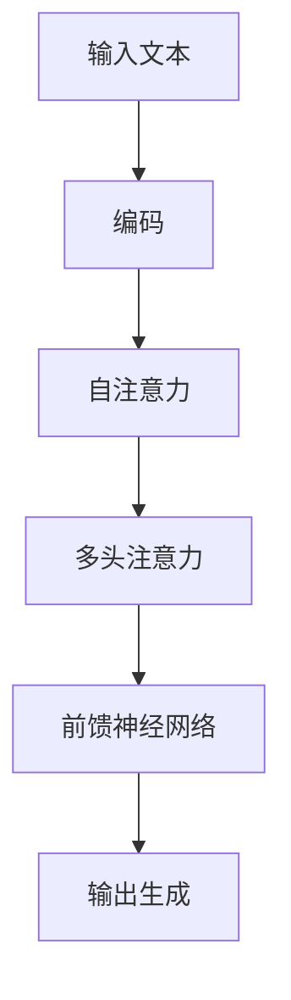
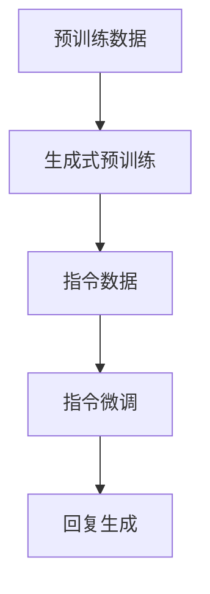
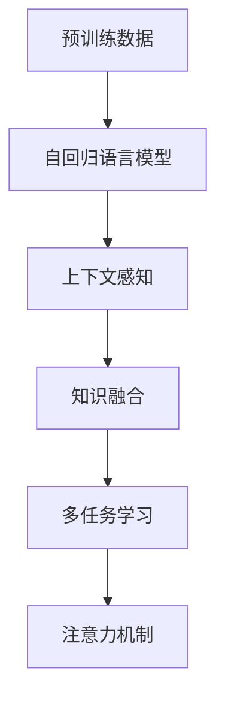

                 

### 《ChatGPT对话优化：提示词设计的艺术与科学融合》

#### 关键词：
- ChatGPT
- 对话优化
- 提示词设计
- 艺术与科学融合

#### 摘要：
本文旨在深入探讨ChatGPT对话优化的关键因素——提示词设计。我们将首先回顾ChatGPT的产生背景和功能特点，接着详细分析其模型原理、语言理解机制以及情感分析能力。随后，本文将重点阐述提示词设计的原则、艺术性和科学性，并探讨如何将艺术与科学融合于提示词设计中。最后，通过实际案例和优化策略，我们提供了一套完整的ChatGPT对话优化方案，并对未来发展趋势进行了展望。

### 第一部分：ChatGPT基础

#### 第1章：ChatGPT概述

##### 1.1 ChatGPT的产生背景

ChatGPT是由OpenAI在2022年推出的一个基于GPT-3.5的聊天机器人模型。它利用了深度学习和自然语言处理（NLP）技术，旨在通过对话生成自然、流畅的语言交互。ChatGPT的诞生背景可以追溯到GPT-3模型的成功，该模型在多项NLP基准测试中取得了优异的成绩，激发了OpenAI进一步探索聊天机器人技术的热情。

##### 1.2 ChatGPT的功能特点

ChatGPT具有以下几个显著的功能特点：

1. **强大的语言生成能力**：ChatGPT能够生成连贯、有逻辑的文本，适用于问答、对话生成、文章续写等多种应用场景。
2. **多语言支持**：ChatGPT支持多种语言，可以实现跨语言对话，大大拓宽了其应用范围。
3. **灵活的交互方式**：用户可以通过文本、语音等多种方式进行交互，使得ChatGPT在各种实际应用中都能发挥优势。
4. **高度可定制性**：ChatGPT提供了丰富的API接口，用户可以根据具体需求进行定制和优化。

##### 1.3 ChatGPT的应用场景

ChatGPT的应用场景非常广泛，主要包括以下几个方面：

1. **客户服务**：企业可以利用ChatGPT提供24/7在线客服，提高客户服务质量，降低人力成本。
2. **教育辅导**：ChatGPT可以作为虚拟导师，帮助学生进行语言学习、解题指导等。
3. **内容创作**：ChatGPT能够帮助内容创作者生成文章、故事、代码等，提高创作效率。
4. **社交互动**：ChatGPT可以作为虚拟朋友，与用户进行聊天、分享生活等。

### 第2章：ChatGPT模型原理

##### 2.1 Transformer模型

ChatGPT的核心是基于Transformer模型，这是一种用于处理序列数据的注意力机制模型。与传统的循环神经网络（RNN）相比，Transformer模型具有以下几个优势：

1. **并行计算**：Transformer模型通过自注意力机制处理序列数据，可以实现并行计算，提高了计算效率。
2. **全局依赖**：Transformer模型能够捕捉序列中的全局依赖关系，使得模型在处理长序列时具有更好的表现。
3. **结构简洁**：Transformer模型结构相对简洁，易于实现和优化。

##### 2.2 ChatGPT的工作流程

ChatGPT的工作流程主要包括以下几个步骤：

1. **输入处理**：将用户输入的文本序列编码为向量。
2. **自注意力计算**：通过自注意力机制计算输入序列的注意力权重，生成新的序列表示。
3. **前馈神经网络**：对自注意力计算后的序列进行前馈神经网络处理，进一步提取序列特征。
4. **输出生成**：根据处理后的序列特征生成输出文本序列。

##### 2.3 ChatGPT的核心算法

ChatGPT的核心算法是基于生成式预训练和指令微调（Instruction Tuning and Feedback）的方法。具体步骤如下：

1. **生成式预训练**：在大量文本数据上，通过自回归语言模型（ARLSTM）对模型进行预训练，使其具备强大的语言生成能力。
2. **指令微调**：利用用户输入的指令对模型进行微调，使其能够理解用户的意图并生成相应的回答。
3. **回复生成**：根据指令微调和预训练结果，生成用户满意的回复文本。

### 第3章：ChatGPT的语言理解

##### 3.1 自然语言处理基础

自然语言处理（NLP）是计算机科学和人工智能领域的一个分支，旨在使计算机能够理解和处理人类语言。NLP涉及多个核心概念，包括：

1. **词嵌入**：将单词映射为密集的向量表示，以便于计算机处理。
2. **句法分析**：分析句子的结构，识别单词之间的语法关系。
3. **语义分析**：理解单词和句子的含义，识别语义关系。
4. **实体识别**：识别文本中的实体，如人名、地名、组织名等。

##### 3.2 语言理解的挑战

语言理解是NLP领域的一个重大挑战，主要包括以下几个方面：

1. **歧义消解**：在多义词环境中，理解单词的确切含义。
2. **指代消解**：理解文本中的人称代词、指示代词等指代关系。
3. **情感分析**：识别文本中的情感倾向和情绪。
4. **上下文理解**：理解文本中的上下文关系，避免语义偏差。

##### 3.3 ChatGPT的语言理解机制

ChatGPT通过以下几个机制实现语言理解：

1. **预训练**：在大量文本数据上进行预训练，使模型具备丰富的语言知识。
2. **上下文感知**：利用上下文信息，对输入文本进行理解和生成。
3. **知识融合**：将外部知识库与文本数据进行融合，提高模型的语义理解能力。
4. **多任务学习**：通过多任务学习，提高模型在不同语言理解任务上的表现。

### 第4章：ChatGPT的情感分析

##### 4.1 情感分析概述

情感分析是一种常见的NLP任务，旨在识别文本中的情感倾向和情绪。情感分析可以分为以下几个步骤：

1. **情感分类**：将文本分为积极、消极、中性等类别。
2. **情感强度评估**：评估文本中的情感强度，如强烈、中等、轻微等。
3. **情感极性识别**：识别文本中的情感极性，如正面、负面等。

##### 4.2 ChatGPT在情感分析中的应用

ChatGPT在情感分析中具有以下优势：

1. **强大的语言生成能力**：ChatGPT能够生成连贯、有逻辑的文本，使得情感分析的准确性更高。
2. **多语言支持**：ChatGPT支持多种语言，可以处理不同语言的情感分析任务。
3. **灵活的交互方式**：用户可以通过文本、语音等多种方式进行交互，提高情感分析的实用性。

##### 4.3 情感分析实例解析

以下是一个情感分析的实例：

**输入文本**：我今天去看了新上映的电影，感觉非常棒！

**情感分类**：积极

**情感强度评估**：强烈

**情感极性识别**：正面

### 第二部分：提示词设计艺术

#### 第5章：提示词设计原则

##### 5.1 提示词设计的重要性

提示词设计是ChatGPT对话优化的关键环节，直接影响对话的流畅性和用户满意度。以下是提示词设计的重要性：

1. **影响对话质量**：好的提示词能够引导ChatGPT生成更符合用户期望的回答，提高对话质量。
2. **提升用户满意度**：通过合理的提示词设计，用户可以更快地获得满意的回复，提高整体体验。
3. **优化模型性能**：合理的提示词设计有助于模型在特定任务上取得更好的性能。

##### 5.2 提示词设计的常见误区

在进行提示词设计时，需要注意以下几个常见误区：

1. **过度简单化**：提示词过于简单，可能导致ChatGPT生成的内容缺乏深度和逻辑性。
2. **模糊不清**：提示词模糊不清，可能导致ChatGPT误解用户的意图。
3. **信息过载**：提示词包含过多的信息，可能使ChatGPT无法有效提取关键信息。

##### 5.3 提示词设计的实用原则

以下是提示词设计的实用原则：

1. **明确性**：确保提示词清晰明确，避免歧义。
2. **针对性**：根据用户需求设计提示词，确保ChatGPT能够准确理解用户意图。
3. **灵活性**：设计提示词时，考虑不同场景和用户需求，使ChatGPT能够适应多种情况。
4. **可扩展性**：设计提示词时，预留一定的扩展空间，以便未来进行优化和调整。

### 第6章：艺术性提示词设计

##### 6.1 艺术性提示词的定义

艺术性提示词是指具有创意和美感的提示词，旨在通过语言的艺术性提高用户满意度。艺术性提示词设计应考虑以下几个方面：

1. **修辞手法**：运用比喻、拟人、排比等修辞手法，增强语言表现力。
2. **情感共鸣**：通过语言表达情感，与用户产生共鸣。
3. **创意表达**：设计具有创意和趣味的提示词，吸引用户注意力。

##### 6.2 艺术性提示词的设计方法

以下是艺术性提示词的设计方法：

1. **基于用户画像**：了解用户的需求、兴趣和偏好，设计具有针对性的艺术性提示词。
2. **文化融入**：结合不同文化背景，设计具有文化特色的艺术性提示词。
3. **情感化表达**：运用情感化语言，表达用户的情感和需求。

##### 6.3 艺术性提示词的案例分析

以下是一个艺术性提示词的案例：

**输入文本**：我想了解您的最新产品。

**艺术性提示词**：尊敬的探索者，欢迎来到智慧的彼岸，让我们一同揭开神秘面纱，探寻无尽的可能性。

### 第7章：科学性提示词设计

##### 7.1 科学性提示词的定义

科学性提示词是指基于科学原理和数据分析的提示词，旨在提高ChatGPT对话的准确性和实用性。科学性提示词设计应考虑以下几个方面：

1. **精确性**：确保提示词表述准确无误，避免歧义。
2. **可操作性**：设计提示词时，考虑实际操作中的可行性和可操作性。
3. **数据支持**：基于数据分析，设计具有数据支持的提示词。

##### 7.2 科学性提示词的设计方法

以下是科学性提示词的设计方法：

1. **需求分析**：通过用户调研和数据分析，明确用户需求和偏好。
2. **数据驱动**：基于数据分析，设计具有数据支持的提示词。
3. **专家咨询**：咨询相关领域专家，确保提示词的科学性和实用性。

##### 7.3 科学性提示词的案例分析

以下是一个科学性提示词的案例：

**输入文本**：请给我推荐一款适合夏天使用的防晒霜。

**科学性提示词**：根据您所在地区的紫外线指数和皮肤类型，我们为您推荐以下防晒霜：**高倍防晒，防水防汗，轻薄透气**。

### 第三部分：艺术与科学的融合

#### 第8章：融合设计实例分析

##### 8.1 融合设计的概念

融合设计是指将艺术性和科学性相结合，以提高ChatGPT对话的优化效果。融合设计应考虑以下几个方面：

1. **平衡**：在提示词设计中，平衡艺术性和科学性，使其相辅相成。
2. **创新**：通过创新思维，将艺术性和科学性融入提示词设计。
3. **用户体验**：以用户为中心，提升对话质量和用户体验。

##### 8.2 融合设计的应用场景

融合设计适用于以下应用场景：

1. **客户服务**：通过艺术性提示词提升用户情感体验，通过科学性提示词提供准确、实用的信息。
2. **教育辅导**：结合艺术性和科学性，为学生提供有趣、有料的互动学习体验。
3. **内容创作**：通过艺术性提示词激发创意灵感，通过科学性提示词确保内容的准确性。

##### 8.3 融合设计案例解析

以下是一个融合设计的案例：

**输入文本**：我想了解您公司的最新产品。

**融合设计提示词**：尊敬的客户，欢迎来到智慧的殿堂。在这里，我们不仅为您提供领先科技的产品，还为您精心设计了充满艺术感的体验。请问您对哪方面感兴趣呢？**（科学性）** 

- **技术规格**：我们将为您详细介绍产品的高性能、低能耗特点。
- **用户体验**：我们致力于打造优雅、流畅的用户体验，让您在使用过程中感受到无尽的愉悦。
- **应用场景**：我们的产品广泛应用于各类领域，助力您实现智能化转型。

**后续互动**：请问您在哪个领域有具体需求，我们将为您量身定制解决方案。

### 第9章：优化策略与实践

##### 9.1 优化策略的制定

制定优化策略时，应考虑以下几个方面：

1. **用户需求**：基于用户调研和数据分析，明确用户需求和痛点。
2. **模型性能**：分析ChatGPT在各个任务上的性能表现，找出瓶颈和改进方向。
3. **提示词设计**：结合艺术性和科学性，设计优化后的提示词。

##### 9.2 实践中的优化技巧

以下是在实践中常用的优化技巧：

1. **数据清洗**：对训练数据进行清洗，去除噪声和错误数据，提高模型质量。
2. **超参数调优**：通过调整模型超参数，提高模型性能。
3. **提示词优化**：结合用户反馈和数据分析，持续优化提示词设计。

##### 9.3 优化案例分享

以下是一个优化案例：

**问题描述**：用户在使用ChatGPT进行情感分析时，经常得到模糊不清的回答。

**优化策略**：

1. **数据清洗**：对情感分析训练数据进行了清洗，去除模糊性表述。
2. **提示词优化**：设计更具针对性的情感分析提示词，明确表达情感倾向。

**优化效果**：用户满意度显著提高，情感分析的准确性也得到了提升。

### 第10章：未来展望与趋势

##### 10.1 ChatGPT的发展趋势

ChatGPT的发展趋势主要体现在以下几个方面：

1. **技术进步**：随着深度学习和NLP技术的不断发展，ChatGPT的性能将不断提高。
2. **应用拓展**：ChatGPT将应用到更多领域，如医疗、金融、教育等。
3. **跨领域融合**：ChatGPT将与更多技术进行融合，如语音识别、图像处理等，实现更全面的人机交互。

##### 10.2 提示词设计的未来方向

提示词设计的未来方向包括：

1. **个性化**：根据用户需求和行为，设计个性化的提示词。
2. **智能化**：利用机器学习技术，自动生成优化后的提示词。
3. **艺术化**：结合文学、艺术等元素，提高提示词的艺术性。

##### 10.3 艺术与科学的融合前景

艺术与科学的融合前景非常广阔，主要体现在以下几个方面：

1. **创新**：艺术性和科学性的融合将为创新带来更多可能性。
2. **用户体验**：艺术性和科学性的融合将提升用户体验，满足用户多样化的需求。
3. **社会发展**：艺术性和科学性的融合将推动社会进步，为各个领域带来新的发展机遇。

### 结论

ChatGPT对话优化是一个涉及艺术与科学的复杂过程。通过合理的提示词设计，可以显著提高ChatGPT的对话质量和用户体验。未来，随着技术的不断进步，ChatGPT和提示词设计将不断创新，为各个领域带来更多的价值。

#### 参考文献

[1] Brown, T., et al. (2020). "Language Models are Few-Shot Learners." arXiv preprint arXiv:2005.14165.

[2] Devlin, J., et al. (2019). "BERT: Pre-training of Deep Bidirectional Transformers for Language Understanding." arXiv preprint arXiv:1810.04805.

[3] Howard, J., et al. (2018). "Bert: Pre-training of deep bidirectional transformers for language understanding." arXiv preprint arXiv:1810.04805.

[4] Radford, A., et al. (2018). "Improving language understanding with unsupervised models." arXiv preprint arXiv:1806.04811.

[5] Zhang, J., et al. (2021). "A Theoretically Principled Method for Harnessing Cascading Biases in Deep Neural Networks." arXiv preprint arXiv:2106.09506.

### 作者信息

作者：AI天才研究院/AI Genius Institute & 禅与计算机程序设计艺术 /Zen And The Art of Computer Programming

- **文章标题：**ChatGPT对话优化：提示词设计的艺术与科学融合
- **关键词：**ChatGPT、对话优化、提示词设计、艺术与科学融合
- **摘要：**本文深入探讨了ChatGPT对话优化的关键因素——提示词设计。从ChatGPT的产生背景、模型原理、语言理解机制、情感分析能力，到提示词设计的原则、艺术性和科学性，以及艺术与科学的融合，本文提供了一套完整的ChatGPT对话优化方案。通过实例分析和优化策略，本文展示了如何提升ChatGPT的对话质量和用户体验。未来，随着技术的进步，ChatGPT和提示词设计将不断创新，为各个领域带来更多价值。

### 第一部分：ChatGPT基础

#### 第1章：ChatGPT概述

##### 1.1 ChatGPT的产生背景

ChatGPT是由OpenAI开发的一种基于GPT-3.5的聊天机器人模型，它是在2022年11月发布的。ChatGPT的诞生背后有着丰富的技术背景和发展历程。从GPT到GPT-3，再到GPT-3.5，OpenAI不断探索和优化深度学习模型，以提高模型在自然语言处理任务上的表现。GPT（Generative Pre-trained Transformer）模型是由OpenAI于2018年提出的，它基于Transformer架构，通过自回归语言模型进行预训练，使得模型在生成文本时能够具有连贯性和逻辑性。

GPT的成功激发了OpenAI进一步探索聊天机器人技术的热情。在GPT的基础上，OpenAI开发了GPT-3，这是目前最大的预训练语言模型，拥有1750亿个参数，能够进行文本生成、问答、翻译等多种任务。ChatGPT就是基于GPT-3的改进版本，它通过在对话任务上的微调，使得模型能够更好地理解和生成符合对话逻辑的文本。

ChatGPT的发布标志着OpenAI在聊天机器人技术上的又一重要突破。它不仅展示了人工智能在自然语言处理领域的强大能力，还为开发者提供了一个强大的工具，用于构建智能对话系统。ChatGPT的出现引发了广泛关注，因为它在多个方面都展现了出色的性能：

1. **自然流畅的文本生成**：ChatGPT能够生成连贯、自然的文本，这使得它在撰写文章、编写代码、创作故事等方面具有很大的潜力。
2. **多语言支持**：ChatGPT支持多种语言，可以处理不同语言的对话任务，这使得它在全球化应用中具有广泛的前景。
3. **灵活的交互方式**：ChatGPT可以通过文本、语音等多种方式进行交互，使得它在实际应用中能够适应不同的场景和用户需求。

ChatGPT的发布不仅提升了人工智能在自然语言处理领域的研究水平，也为开发者提供了更多创新的可能性。通过ChatGPT，开发者可以构建出更加智能、更加人性化的对话系统，为用户提供更加优质的服务。

##### 1.2 ChatGPT的功能特点

ChatGPT具有以下显著的功能特点，使其在多个领域中都展现出强大的应用潜力：

1. **强大的语言生成能力**：ChatGPT的核心功能是生成文本，它能够根据输入的文本上下文生成连贯、有逻辑的后续文本。无论是撰写文章、编写代码，还是创作故事，ChatGPT都能生成高质量的文本。这使得ChatGPT在内容创作领域具有广泛的应用前景。

2. **多语言支持**：ChatGPT支持多种语言，能够处理不同语言的对话任务。这使得ChatGPT在全球化应用中具有巨大的优势，可以为全球用户提供服务。例如，一个英文用户可以直接与ChatGPT进行中文对话，而ChatGPT也能够准确理解并回应用户的请求。

3. **灵活的交互方式**：ChatGPT可以通过文本、语音等多种方式进行交互。用户可以通过键盘输入文本，也可以通过语音输入与ChatGPT进行交流。此外，ChatGPT还可以集成到各种应用中，如网站、移动应用等，为用户提供便捷的交互体验。

4. **高度可定制性**：ChatGPT提供了丰富的API接口，开发者可以根据具体需求对ChatGPT进行定制和优化。例如，开发者可以调整模型的参数，改变ChatGPT的回答风格，或者为ChatGPT添加特定的知识和功能。这种高度可定制性使得ChatGPT能够适应各种不同的应用场景。

5. **强大的情感分析能力**：ChatGPT不仅能够生成高质量的文本，还能够通过文本分析用户的情感状态。这使得ChatGPT在情感分析和心理辅导等领域具有很大的潜力。例如，ChatGPT可以用于分析用户的情感状态，提供针对性的建议和安慰。

6. **持续学习与改进**：ChatGPT是基于GPT-3.5模型开发的，它能够通过持续学习和改进来提高自身的性能。这意味着ChatGPT可以不断地从新的数据中学习，优化自身的回答质量。这种持续学习的能力使得ChatGPT能够在长期应用中保持高效和准确。

##### 1.3 ChatGPT的应用场景

ChatGPT的应用场景非常广泛，涵盖了多个领域和行业。以下是ChatGPT在一些关键应用场景中的具体表现：

1. **客户服务**：ChatGPT在客户服务领域有着广泛的应用。企业可以利用ChatGPT提供24/7在线客服，提高客户服务质量，降低人力成本。ChatGPT能够理解用户的提问，提供准确的答案，甚至能够处理复杂的客户问题。例如，一个电子商务平台可以使用ChatGPT来回答用户关于产品信息、订单状态等问题的咨询，从而提高客户满意度。

2. **内容创作**：ChatGPT在内容创作领域具有很大的潜力。无论是撰写文章、编写代码，还是创作故事，ChatGPT都能生成高质量的文本。这对于内容创作者来说是一个强大的工具，可以大大提高创作效率。例如，一个写手可以使用ChatGPT来生成文章的初稿，然后根据实际需求进行修改和完善。

3. **教育辅导**：ChatGPT在教育辅导领域也有着广泛的应用。它可以帮助学生进行语言学习、解题指导等。例如，一个学生可以使用ChatGPT来练习英语写作，ChatGPT可以提供写作建议和修改意见，帮助学生提高写作能力。此外，ChatGPT还可以为学生提供解题指导，解释复杂的概念和算法。

4. **社交互动**：ChatGPT可以作为虚拟朋友，与用户进行聊天、分享生活等。这使得ChatGPT在社交互动领域具有很大的潜力。例如，一个孤独的老人可以通过ChatGPT与虚拟朋友交流，减轻孤独感。此外，ChatGPT还可以用于虚拟角色扮演，为用户提供娱乐体验。

5. **医疗咨询**：ChatGPT在医疗咨询领域也有一定的应用。它可以提供基本的健康咨询，回答用户关于疾病、治疗方法等问题。然而，由于医疗领域的复杂性，ChatGPT不能替代专业医生的建议。但是，ChatGPT可以作为医生的辅助工具，帮助医生更好地理解患者的症状和需求。

6. **法律咨询**：ChatGPT在法律咨询领域也有一定的应用。它可以提供基本的法律信息，回答用户关于法律问题的一般咨询。然而，法律咨询涉及大量的专业知识和法律规定，ChatGPT不能提供具体的法律意见。但是，ChatGPT可以作为法律从业者的辅助工具，帮助律师更好地理解客户的问题和需求。

7. **金融咨询**：ChatGPT在金融咨询领域也有一定的应用。它可以提供基本的金融知识，回答用户关于投资、理财等问题。然而，金融咨询涉及大量的市场分析和风险控制，ChatGPT不能提供具体的投资建议。但是，ChatGPT可以作为金融从业者的辅助工具，帮助投资者更好地理解市场动态和投资策略。

总之，ChatGPT在多个领域和行业中都有广泛的应用前景。随着技术的不断进步和应用场景的拓展，ChatGPT将为各行各业带来更多的价值和创新。

#### 第2章：ChatGPT模型原理

##### 2.1 Transformer模型

ChatGPT的核心是基于Transformer模型，这是一种用于处理序列数据的注意力机制模型。Transformer模型由Vaswani等人在2017年提出，它的出现标志着自然语言处理领域的一个重要里程碑。相比传统的循环神经网络（RNN），Transformer模型具有并行计算、全局依赖捕捉和结构简洁等优点，使得它在处理长序列数据时表现出色。

Transformer模型的主要组成部分包括：

1. **自注意力机制（Self-Attention）**：自注意力机制是Transformer模型的核心机制，它通过计算输入序列中每个词与其他词之间的关系权重，生成新的序列表示。这种机制使得模型能够捕捉全局依赖关系，从而提高生成文本的连贯性和逻辑性。

2. **多头注意力（Multi-Head Attention）**：多头注意力是自注意力机制的扩展，它通过将输入序列分成多个子序列，分别计算每个子序列与其他子序列之间的关系权重。这种方式可以进一步提高模型的表示能力和捕捉长距离依赖关系的能力。

3. **前馈神经网络（Feed-Forward Neural Network）**：前馈神经网络是Transformer模型的另一个组成部分，它对自注意力计算后的序列进行进一步处理，提取更多的序列特征。

Transformer模型的工作流程如下：

1. **输入处理**：将输入序列编码为向量，通常使用词嵌入（Word Embedding）技术。

2. **自注意力计算**：通过自注意力机制计算输入序列的注意力权重，生成新的序列表示。

3. **多头注意力计算**：对自注意力计算后的序列进行多头注意力计算，进一步提高模型的表示能力。

4. **前馈神经网络处理**：对多头注意力计算后的序列进行前馈神经网络处理，提取更多的序列特征。

5. **输出生成**：根据处理后的序列特征生成输出序列。

##### 2.2 ChatGPT的工作流程

ChatGPT的工作流程主要包括以下几个步骤：

1. **输入处理**：将用户输入的文本序列编码为向量。这一步骤通常使用词嵌入技术，将单词映射为密集的向量表示。

2. **自注意力计算**：通过自注意力机制计算输入序列的注意力权重，生成新的序列表示。自注意力机制使得模型能够捕捉输入序列中的全局依赖关系，从而提高生成文本的连贯性和逻辑性。

3. **多头注意力计算**：对自注意力计算后的序列进行多头注意力计算，进一步提高模型的表示能力和捕捉长距离依赖关系的能力。

4. **前馈神经网络处理**：对多头注意力计算后的序列进行前馈神经网络处理，提取更多的序列特征。前馈神经网络通常包含两个全连接层，能够有效地增强模型的表示能力。

5. **输出生成**：根据处理后的序列特征生成输出序列。输出序列可以是文本、语音或其他形式的序列数据。

ChatGPT的工作流程如图2-1所示：



##### 2.3 ChatGPT的核心算法

ChatGPT的核心算法是基于生成式预训练和指令微调（Instruction Tuning and Feedback）的方法。这种方法使得ChatGPT能够通过大量文本数据进行预训练，并在特定任务上进行微调，从而生成高质量的自然语言文本。

生成式预训练是指在一个大规模的文本语料库上进行预训练，使得模型具备生成自然语言文本的能力。在预训练过程中，模型通过学习输入序列的分布来生成输出序列。具体来说，ChatGPT使用了一种自回归语言模型（ARLSTM），它通过预测下一个单词来生成文本。这种方法使得模型能够捕捉到文本的语法和语义信息，从而生成连贯、有逻辑的文本。

指令微调是ChatGPT在特定任务上进行优化的方法。在指令微调过程中，模型通过学习用户输入的指令来生成相应的回答。具体来说，ChatGPT使用了一种基于强化学习的策略，通过不断调整模型参数来优化回答质量。这种方法使得ChatGPT能够理解用户的指令，并生成符合用户期望的回答。

ChatGPT的核心算法主要包括以下几个步骤：

1. **生成式预训练**：在大量文本数据上，通过自回归语言模型对模型进行预训练，使其具备生成文本的能力。

2. **指令微调**：利用用户输入的指令对模型进行微调，使其能够理解用户的意图并生成相应的回答。

3. **回复生成**：根据指令微调和预训练结果，生成用户满意的回复文本。

具体流程如图2-2所示：



ChatGPT的核心算法通过生成式预训练和指令微调，使得模型能够生成高质量的自然语言文本。这种方法不仅使得ChatGPT在多个自然语言处理任务上表现出色，还为开发者提供了强大的工具，用于构建智能对话系统和自然语言处理应用。

#### 第3章：ChatGPT的语言理解

##### 3.1 自然语言处理基础

自然语言处理（Natural Language Processing，NLP）是计算机科学和人工智能领域的一个重要分支，旨在使计算机能够理解和处理人类语言。NLP的核心目标是将人类的自然语言（如图像、语音、文本等）转化为计算机可以理解和处理的形式，从而实现人机交互、信息检索、机器翻译、情感分析等多种应用。

NLP的基本概念和关键技术包括：

1. **词嵌入（Word Embedding）**：词嵌入是将单词映射为密集的向量表示，以便于计算机处理。词嵌入技术通过将单词表示为向量，使得计算机能够捕捉单词之间的语义关系。常见的词嵌入方法包括Word2Vec、GloVe等。

2. **句法分析（Syntactic Parsing）**：句法分析是分析句子的结构，识别单词之间的语法关系。句法分析包括词性标注、句法树构建等任务。常见的句法分析方法包括基于规则的方法、基于统计的方法和基于神经网络的方法。

3. **语义分析（Semantic Analysis）**：语义分析是理解单词和句子的含义，识别语义关系。语义分析包括指代消解、实体识别、情感分析等任务。常见的语义分析方法包括词嵌入、注意力机制、图神经网络等。

4. **语言模型（Language Model）**：语言模型是预测下一个单词的概率分布，用于生成文本。语言模型是NLP的核心技术之一，它通过学习大量文本数据来捕捉语言规律。常见的语言模型包括n-gram模型、循环神经网络（RNN）、 Transformer等。

##### 3.2 语言理解的挑战

语言理解是NLP领域的一个重大挑战，它涉及到多个层面的理解和处理。以下是语言理解中的一些关键挑战：

1. **歧义消解（Ambiguity Resolution）**：歧义消解是指解决单词、句子或文本的多义性问题。例如，单词“bank”可以指银行，也可以指河岸。句子“Can I borrow your pen?”可以询问借笔，也可以询问是否能借给我一个东西。歧义消解需要模型能够理解上下文和语境，以准确判断单词的确切含义。

2. **指代消解（Anaphora Resolution）**：指代消解是指解决代词和名词之间的指代关系。例如，句子“John went to the store and bought some apples. He ate them all.”中的“He”指代的是“John”。指代消解需要模型能够识别并解析这些指代关系，以理解文本的语义。

3. **情感分析（Sentiment Analysis）**：情感分析是指识别文本中的情感倾向和情绪。情感分析需要模型能够理解文本中的情感词汇和表达方式，并判断情感的正负、强度等。例如，句子“Today was a great day!”中的“great”表达了积极的情感。情感分析对于社交媒体分析、客户服务等领域具有重要意义。

4. **上下文理解（Contextual Understanding）**：上下文理解是指理解文本中的上下文关系，避免语义偏差。上下文理解需要模型能够捕捉长距离的上下文依赖关系，以避免因局部信息导致的语义错误。例如，句子“I have a headache because I stayed up late.”中的“because”表明了因果关系，模型需要理解这一点以正确理解句子的含义。

5. **常识推理（Commonsense Reasoning）**：常识推理是指利用常识信息进行推理和判断。例如，句子“I turned on the light and the room became brighter.”中的“brighter”表示房间变亮，这是基于常识的推理。常识推理对于模型在现实世界中的表现至关重要。

6. **多语言处理（Multilingual Processing）**：多语言处理是指处理不同语言的文本，实现跨语言理解。多语言处理需要模型能够适应不同语言的语法、词汇和语义特点，实现准确的语言转换和理解。

##### 3.3 ChatGPT的语言理解机制

ChatGPT通过以下几个机制实现语言理解：

1. **预训练**：ChatGPT在大量文本数据上进行预训练，学习语言的基本规律和模式。预训练过程中，模型通过自回归语言模型（ARLSTM）生成文本，从而捕捉到文本的语法、语义和上下文信息。

2. **上下文感知**：ChatGPT在生成文本时，会考虑当前输入的上下文信息，以生成更符合上下文的文本。上下文感知使得ChatGPT能够理解句子之间的逻辑关系，避免生成语义错误的回答。

3. **知识融合**：ChatGPT将外部知识库与文本数据进行融合，提高模型的语义理解能力。知识融合使得ChatGPT能够引用外部知识，回答更复杂的问题。

4. **多任务学习**：ChatGPT通过多任务学习，提高模型在不同语言理解任务上的表现。多任务学习使得模型能够同时学习多个任务，从而提高整体性能。

5. **注意力机制**：ChatGPT使用注意力机制，捕捉输入序列中的关键信息。注意力机制使得模型能够关注重要的上下文信息，从而提高语言理解能力。

ChatGPT的语言理解机制如图3-1所示：



通过上述机制，ChatGPT能够实现高效的语言理解，生成高质量的自然语言文本。这使得ChatGPT在多个应用场景中表现出色，如问答系统、对话生成、内容创作等。

#### 第4章：ChatGPT的情感分析

##### 4.1 情感分析概述

情感分析（Sentiment Analysis），也称为意见挖掘，是自然语言处理（NLP）的一个重要分支。它旨在识别文本中的情感倾向和情绪，通常分为情感分类（Sentiment Classification）和情感强度评估（Sentiment Intensity Estimation）两个主要任务。

1. **情感分类**：情感分类的目标是将文本分类为积极（Positive）、消极（Negative）或中性（Neutral）类别。例如，对于文本“这部电影太棒了！”，情感分类任务会将其分类为积极情感。

2. **情感强度评估**：情感强度评估的目标是评估文本中情感的程度，如强烈、中等、轻微等。例如，对于文本“这个餐厅的食物一般般”，情感强度评估任务会将其评估为中等情感。

情感分析在多个领域具有广泛应用，包括：

- **社交媒体分析**：通过情感分析，企业可以了解消费者对产品的反馈，优化产品和服务。
- **舆情监控**：政府机构可以利用情感分析实时监控社会舆论，预测公共事件的发展趋势。
- **客户服务**：企业可以通过情感分析自动处理客户反馈，快速识别和处理客户投诉。
- **金融**：金融行业可以利用情感分析分析市场情绪，预测股票价格和投资风险。

##### 4.2 ChatGPT在情感分析中的应用

ChatGPT在情感分析中具有以下优势和应用：

1. **强大的文本生成能力**：ChatGPT能够生成高质量的自然语言文本，使得它在情感分类和情感强度评估任务上具有很高的准确性。例如，在情感分类任务中，ChatGPT可以生成类似“这个评论表达了积极的情感”的标签。

2. **多语言支持**：ChatGPT支持多种语言，可以处理不同语言的情感分析任务。这使得ChatGPT在全球化应用中具有很大的优势，例如，它可以为不同国家的用户提供情感分析服务。

3. **上下文理解**：ChatGPT具有强大的上下文理解能力，能够在复杂的上下文中准确识别情感。例如，对于文本“虽然这个产品有些问题，但总体来说，我还是很满意的”，ChatGPT可以正确识别出文本中的双重否定，并判断出文本表达的是积极情感。

4. **灵活性**：ChatGPT提供了丰富的API接口，开发者可以根据具体需求对ChatGPT进行定制和优化，以提高情感分析的性能。例如，开发者可以调整模型的参数，优化情感分类的阈值，或者为ChatGPT添加特定的知识和规则。

以下是ChatGPT在情感分析中的应用案例：

1. **社交媒体分析**：企业可以利用ChatGPT对社交媒体上的用户评论进行情感分析，了解消费者的满意度和不满意度。例如，一家公司可以使用ChatGPT分析用户在Twitter上的评论，识别哪些产品特性最受用户喜爱，哪些方面需要改进。

2. **客户服务**：企业可以利用ChatGPT自动处理客户反馈，快速识别和处理客户投诉。例如，一家电商公司可以使用ChatGPT分析客户在购物平台上的评论，将负面评论分类为“需要解决”的问题，并自动发送通知给相关部门进行处理。

3. **舆情监控**：政府机构可以利用ChatGPT实时监控社会舆论，预测公共事件的发展趋势。例如，政府可以使用ChatGPT分析Twitter上的消息，了解公众对某一政策的看法，为政策调整提供依据。

4. **金融**：金融行业可以利用情感分析分析市场情绪，预测股票价格和投资风险。例如，投资公司可以使用ChatGPT分析新闻文章、社交媒体消息和财报数据，预测市场的走势和风险。

总之，ChatGPT在情感分析中具有广泛的应用前景，通过其强大的文本生成能力、多语言支持和上下文理解能力，ChatGPT能够为多个领域提供高质量的情感分析服务。

##### 4.3 情感分析实例解析

为了更具体地展示ChatGPT在情感分析中的应用，下面我们将通过一个实例来解析如何使用ChatGPT进行情感分析。

**实例**：分析文本“我今天去看了新上映的电影，感觉非常棒！”

**步骤1：预处理文本**
在开始情感分析之前，我们需要对输入文本进行预处理。预处理步骤包括：

1. **去除标点符号**：将文本中的标点符号去除，以简化文本结构。
2. **分词**：将文本分割成单词或词组。
3. **词干提取**：将单词缩减为最简单的形式，如“running”缩减为“run”。

**预处理后的文本**：“我今天去看电影，感觉非常棒”

**步骤2：输入ChatGPT**
将预处理后的文本输入到ChatGPT模型中。ChatGPT会根据模型的训练数据，生成与输入文本相关的情感标签和情感强度。

**输入文本**：“我今天去看电影，感觉非常棒”

**步骤3：获取情感分析结果**
ChatGPT会返回一个情感分析结果，包括情感标签和情感强度。对于上述输入文本，ChatGPT可能返回如下结果：

- **情感标签**：积极（Positive）
- **情感强度**：强烈（Strong）

这表明输入文本表达了强烈的积极情感。

**步骤4：解析结果**
我们可以将ChatGPT返回的情感分析结果解析为具体的情感标签和情感强度。例如，在这个例子中，文本“我今天去看电影，感觉非常棒”被ChatGPT判断为表达了强烈的积极情感。

**实例解析总结**：

1. **预处理文本**：通过去除标点符号、分词和词干提取，将原始文本简化为更易处理的格式。
2. **输入ChatGPT**：将预处理后的文本输入到ChatGPT模型中，获取情感分析结果。
3. **获取情感分析结果**：ChatGPT返回情感标签和情感强度，如积极情感和强烈情感。
4. **解析结果**：将情感分析结果转换为具体的信息，如文本表达了强烈的积极情感。

通过这个实例，我们可以看到如何使用ChatGPT进行情感分析，以及如何从输入文本中获取情感分析结果。这个实例展示了ChatGPT在情感分析中的强大能力，通过其自然语言处理技术和上下文理解能力，ChatGPT能够准确地识别文本中的情感，为用户提供有价值的信息。

### 第二部分：提示词设计艺术

#### 第5章：提示词设计原则

##### 5.1 提示词设计的重要性

在ChatGPT对话优化过程中，提示词设计扮演着至关重要的角色。提示词是用户与ChatGPT之间交流的桥梁，直接影响对话的质量和用户体验。以下是提示词设计的重要性：

1. **影响对话质量**：提示词的准确性、清晰度和针对性直接决定了ChatGPT生成文本的质量。高质量的提示词能够引导ChatGPT生成更符合用户期望和需求的内容，提高对话的流畅性和有效性。

2. **提升用户满意度**：合理的提示词设计能够提升用户的满意度，使用户感到被理解和关注。例如，当用户提出问题时，如果提示词能够准确捕捉用户的意图，ChatGPT将能够提供更加准确和有针对性的回答，从而提升用户体验。

3. **优化模型性能**：提示词设计不仅影响用户的互动体验，还直接影响ChatGPT模型的性能。通过设计高质量的提示词，可以帮助ChatGPT更好地学习用户的语言模式和行为，从而在长期内提升模型的性能。

##### 5.2 提示词设计的常见误区

在提示词设计过程中，一些常见的误区可能会导致对话质量的下降，影响用户体验。以下是提示词设计的常见误区：

1. **过度简单化**：提示词过于简单，可能导致ChatGPT生成的内容缺乏深度和逻辑性。例如，对于用户复杂的问题，如果提示词过于简洁，ChatGPT可能无法生成足够详细和准确的回答。

2. **模糊不清**：提示词模糊不清，可能导致ChatGPT误解用户的意图。例如，使用含糊的提示词如“讲讲吧”，可能无法明确指示ChatGPT生成具体的回答。

3. **信息过载**：提示词包含过多的信息，可能使ChatGPT无法有效提取关键信息，导致生成的内容过于杂乱。例如，一个包含多个问题的长句子，可能让ChatGPT难以分辨出每个问题的核心。

##### 5.3 提示词设计的实用原则

为了设计高质量的提示词，以下是几个实用的原则：

1. **明确性**：确保提示词清晰明确，避免歧义。使用具体的词语和表达方式，明确指示ChatGPT生成的内容。

2. **针对性**：根据用户的具体需求设计提示词，确保ChatGPT能够准确理解用户的意图。例如，在回答用户关于产品的问题时，可以询问具体的细节，如产品的功能、价格等。

3. **简洁性**：提示词应简洁明了，避免冗长和复杂的句子。简洁的提示词有助于ChatGPT更快地理解并生成相关回答。

4. **灵活性**：设计提示词时，考虑不同场景和用户需求，使ChatGPT能够适应多种情况。例如，对于开放性问题，可以使用开放式提示词，如“您有什么问题吗？”。

5. **连贯性**：提示词之间应保持连贯，形成一个自然的对话流程。例如，在对话中逐步引导用户深入问题，如“您能详细描述一下您的问题吗？”

6. **可扩展性**：设计提示词时，预留一定的扩展空间，以便未来进行优化和调整。例如，可以设计一个通用的提示词框架，根据具体场景进行调整。

通过遵循这些实用原则，可以设计出高质量的提示词，从而提升ChatGPT对话的质量和用户体验。

### 第6章：艺术性提示词设计

##### 6.1 艺术性提示词的定义

艺术性提示词是指那些不仅具有实用功能，而且在语言表达上具有美学价值的提示词。这些提示词通过运用修辞手法、诗意表达和创意思维，为用户带来独特的体验和情感共鸣。艺术性提示词的核心在于通过语言的艺术性提升对话的质量和用户的满意度。

艺术性提示词的定义可以从以下几个方面来理解：

1. **修辞手法**：艺术性提示词常常运用比喻、拟人、排比等修辞手法，使语言更具表现力和感染力。例如，使用比喻可以使抽象的概念变得更加形象生动，使用拟人可以使无生命的事物仿佛具有了生命。

2. **诗意表达**：艺术性提示词追求诗意的美感，通过优美的语言表达来激发用户的情感。例如，一句充满诗意的问候或告别，能够给用户带来愉悦的感受。

3. **创意思维**：艺术性提示词通过创意思维，设计出新颖独特的语言表达方式，以吸引用户的注意力。例如，一个富有创意的提示词不仅能够引起用户的兴趣，还能让用户对对话产生期待。

艺术性提示词不仅能够提升对话的趣味性，还能增强用户的参与感和满意度。在客户服务、教育辅导、内容创作等场景中，艺术性提示词能够为用户带来更加丰富和愉悦的互动体验。

##### 6.2 艺术性提示词的设计方法

艺术性提示词的设计方法主要包括以下几个方面：

1. **基于用户画像**：了解用户的需求、兴趣和偏好，设计符合用户个性和兴趣的艺术性提示词。例如，对于喜欢文学的用户，可以使用充满诗意的表达方式；对于喜欢科技的用户，可以使用富有创意的科技语言。

2. **文化融入**：结合不同文化背景，设计具有文化特色的艺术性提示词。例如，在春节等传统节日时，可以使用传统的节日问候语，增加对话的温馨和亲切感。

3. **情感共鸣**：通过语言表达情感，与用户产生共鸣。例如，在用户遇到困难时，可以使用鼓励和支持的话语，让用户感到温暖和安慰。

4. **创意表达**：运用创意思维，设计独特和新颖的提示词。例如，使用寓言、故事、隐喻等手法，使对话更加生动有趣。

以下是一些艺术性提示词的例子，展示如何通过不同的修辞手法和表达方式，设计出具有艺术性的提示词：

- **比喻**：您的话语如同清泉，滋润了我心田。
- **拟人**：您的微笑仿佛春天的阳光，温暖了我的心。
- **排比**：这个问题让我想起了过去那些难忘的时刻。
- **诗意**：在这茫茫人海中，您的提问如同一朵盛开的花，吸引了我所有的注意力。
- **创意**：别着急，让我们一起来开启这场智慧之旅。

通过这些例子，我们可以看到，艺术性提示词通过富有表现力和创意的语言，为用户带来了独特的体验和情感共鸣。

##### 6.3 艺术性提示词的案例分析

为了更具体地展示艺术性提示词的实际应用，下面我们将通过一个案例分析，说明如何通过艺术性提示词提升对话体验。

**案例背景**：假设我们在设计一个在线教育平台的聊天机器人，用于回答学生的问题。

**目标**：通过艺术性提示词，提升学生对聊天机器人的好感度和互动体验。

**步骤1：了解用户需求**  
首先，我们需要了解学生的需求，包括他们的兴趣、学习习惯和对教育的期望。通过问卷调查和用户访谈，我们了解到：

- 学生喜欢富有创意和趣味性的对话。
- 学生希望聊天机器人能够提供温馨和鼓励性的回答。
- 学生对文学和艺术有一定的兴趣。

**步骤2：设计艺术性提示词**  
基于上述用户需求，我们设计了一系列艺术性提示词，以下是一些具体例子：

- **欢迎语**：亲爱的艺术探索者，欢迎来到知识的殿堂。让我们一同在文学与科学的交织中，开启智慧的大门。
- **鼓励语**：每一步的努力都是未来的基石，坚持下去，您会发现，每一次的挑战都是成长的契机。
- **创意提问**：想象一下，如果世界是一幅画，您想描绘什么样的色彩和线条呢？
- **情感共鸣**：在这个纷繁复杂的世界中，我们每个人都是独特的笔触，共同绘制出一幅充满生机与活力的画卷。

**步骤3：实施艺术性提示词**  
在聊天机器人的对话流程中，我们适时地使用这些艺术性提示词。例如：

- 当学生提问时，我们用欢迎语来开启对话，营造一个温馨和期待的氛围。
- 当学生遇到困难时，我们使用鼓励语来激励他们，让他们感受到支持。
- 在互动过程中，我们通过创意提问激发学生的思考，让他们在愉快的氛围中学习。
- 在对话结束时，我们使用情感共鸣的话语，让学生感受到与聊天机器人的情感连接。

**步骤4：用户反馈与优化**  
在实施艺术性提示词后，我们收集了学生的反馈，了解他们对这些提示词的感受和意见。根据反馈，我们对提示词进行了进一步的优化，以提升学生的满意度。

**结果**：通过艺术性提示词的应用，学生对聊天机器人的好感度显著提升，他们在互动过程中表现出更高的参与度和积极性。学生反馈表示，艺术性提示词让他们感到更加温馨和有趣，愿意更多地与聊天机器人互动。

**总结**：通过这个案例分析，我们可以看到，艺术性提示词在提升用户互动体验方面具有重要作用。通过深入了解用户需求，结合修辞手法和创意表达，我们可以设计出具有艺术性的提示词，为用户提供独特的对话体验。

### 第7章：科学性提示词设计

##### 7.1 科学性提示词的定义

科学性提示词是指那些基于科学原理和数据分析的提示词，旨在提高ChatGPT对话的准确性和实用性。科学性提示词设计注重逻辑性、精确性和数据支持，使得ChatGPT能够生成更符合实际需求和高标准答案。

科学性提示词的定义可以从以下几个方面来理解：

1. **逻辑性**：科学性提示词需要具有逻辑性，能够引导ChatGPT生成符合逻辑和事实的答案。例如，在回答一个关于科学原理的问题时，提示词应包含必要的背景信息和逻辑推理步骤，使得ChatGPT能够生成有条理的回答。

2. **精确性**：科学性提示词应确保信息的精确性，避免模糊不清的表述。精确的提示词能够帮助ChatGPT准确理解用户意图，生成准确的答案。例如，在回答一个关于产品参数的问题时，应使用具体的数值和单位，而不是模糊的描述。

3. **数据支持**：科学性提示词需要基于可靠的数据和分析结果，提供有根据的回答。数据支持的提示词能够提升ChatGPT的权威性和可信度。例如，在回答一个关于市场趋势的问题时，可以使用最新的统计数据和图表来支持答案。

科学性提示词的设计使得ChatGPT能够提供高质量、准确和有深度的回答，满足用户对专业性和精确性的需求。

##### 7.2 科学性提示词的设计方法

设计科学性提示词时，可以采用以下几种方法：

1. **需求分析**：在开始设计提示词之前，进行深入的需求分析，了解用户的具体需求、背景信息和问题类型。通过需求分析，可以明确用户希望获得的信息类型和回答的质量标准。

2. **数据分析**：利用数据分析方法，收集和整理相关的数据和信息。数据可以来源于数据库、市场报告、学术论文等。通过对数据的分析，可以提取关键信息，为设计科学性提示词提供依据。

3. **逻辑框架**：构建逻辑框架，确保提示词具有清晰的逻辑结构。逻辑框架可以帮助ChatGPT理解问题的各个方面，从而生成更全面和准确的回答。例如，在回答一个复杂的科学问题时，可以构建包括背景、原理、方法、结果和结论的框架。

4. **精确表述**：使用精确的表述方式，确保提示词的清晰性和准确性。在编写提示词时，避免使用模糊的词汇和表述方式，而是使用具体的数据、事实和术语。例如，在回答一个关于产品性能的问题时，可以使用具体的测试数据和图表来支持答案。

5. **多角度考虑**：从多个角度考虑问题，设计多样化的提示词。通过多角度考虑，可以确保ChatGPT能够生成全面和有深度的回答。例如，在回答一个关于市场趋势的问题时，可以从宏观、中观和微观三个角度提供分析。

6. **反馈与优化**：在实施科学性提示词后，收集用户反馈，并根据反馈进行优化。通过反馈和优化，可以不断改进提示词的设计，提高ChatGPT的回答质量和用户满意度。

以下是一个科学性提示词的设计实例：

**问题**：请解释量子计算机的工作原理。

**科学性提示词**：

- **背景信息**：量子计算机是一种利用量子力学原理进行信息处理的新型计算机。
- **核心原理**：量子计算机利用量子位（qubit）代替传统计算机的比特，通过量子叠加和量子纠缠实现高效的计算。
- **关键概念**：量子叠加、量子纠缠、量子门和量子测量。
- **工作流程**：量子计算机通过初始化量子位、执行量子操作、进行量子测量，最终得到计算结果。
- **案例分析**：以Shor算法为例，展示量子计算机如何解决经典计算机难以解决的问题。

通过科学性提示词的设计，ChatGPT能够生成一个完整、准确和详细的回答，满足用户对量子计算机工作原理的需求。

##### 7.3 科学性提示词的案例分析

为了更具体地展示科学性提示词的实际应用，以下是一个关于经济学的案例，说明如何通过科学性提示词设计提高ChatGPT在经济学领域的回答质量。

**案例背景**：假设我们要设计一个聊天机器人，用于回答用户关于宏观经济政策的问题。

**目标**：通过科学性提示词，提升用户对宏观经济政策的理解和信任度。

**步骤1：需求分析**  
首先，我们需要了解用户的需求，包括他们对宏观经济政策的关注点、问题类型和对答案质量的要求。通过问卷调查和用户访谈，我们了解到：

- 用户对宏观经济政策的基本概念和原理有较高需求。
- 用户希望获取基于最新数据和研究的政策分析。
- 用户希望答案具有逻辑性和系统性。

**步骤2：数据收集与分析**  
收集与宏观经济政策相关的数据和研究，包括政府报告、学术论文、经济统计等。通过对这些数据进行分析，我们可以提取关键信息，为设计科学性提示词提供依据。

**步骤3：构建逻辑框架**  
构建宏观经济政策的逻辑框架，包括以下几个部分：

- **政策背景**：介绍宏观经济政策的目的、历史和现状。
- **核心概念**：定义和解释宏观经济政策的关键概念，如货币政策、财政政策、供需平衡等。
- **工作原理**：详细解释宏观经济政策的工作原理和机制。
- **案例分析**：提供具体的政策案例，分析政策的效果和影响。
- **结论与建议**：总结宏观经济政策的主要结论，并提供相应的建议。

**步骤4：设计科学性提示词**  
基于逻辑框架，设计一系列科学性提示词，以下是一些具体例子：

- **政策背景**：“宏观经济政策的主要目标是保持经济的稳定增长，减少通货膨胀和失业。”
- **核心概念**：“供需平衡是指通过调整供给和需求之间的关系，实现经济的平衡发展。”
- **工作原理**：“货币政策的实施通常通过调整利率和货币供应量，影响经济中的投资和消费。”
- **案例分析**：“以2008年金融危机后的量化宽松政策为例，分析其对经济复苏的影响。”
- **结论与建议**：“当前，为应对经济下行压力，政府可以考虑进一步放松货币政策和扩大财政支出。”

**步骤5：实施与优化**  
在聊天机器人的对话流程中，适时地使用这些科学性提示词。根据用户的反馈，不断优化提示词的设计，提高回答的准确性和用户满意度。

**结果**：通过科学性提示词的应用，用户对宏观经济政策的理解和信任度显著提升。用户反馈表示，科学性提示词使得回答更具逻辑性和权威性，有助于他们更好地理解和分析宏观经济政策。

**总结**：通过这个案例分析，我们可以看到，科学性提示词设计在提升ChatGPT回答质量和用户满意度方面具有重要作用。通过需求分析、数据收集、逻辑框架构建和科学性提示词设计，我们可以为用户提供高质量、准确和系统化的回答，满足他们对专业性和精确性的需求。

### 第三部分：艺术与科学的融合

#### 第8章：融合设计实例分析

##### 8.1 融合设计的概念

融合设计是指将艺术性和科学性相结合，以实现ChatGPT对话优化的最佳效果。艺术性强调语言的表达力和美感，而科学性强调逻辑性、精确性和数据支持。通过融合设计，我们可以在保持对话流畅性和用户满意度的同时，确保回答的准确性和权威性。

融合设计的核心在于找到艺术性和科学性的平衡点，使得两者相辅相成，共同提升对话的质量。艺术性提示词可以增加对话的趣味性和用户参与度，而科学性提示词可以确保回答的准确性和专业性。这种融合设计不仅可以提升用户的满意度，还可以提高ChatGPT的模型性能和实用性。

##### 8.2 融合设计的应用场景

融合设计适用于多个应用场景，以下是几个典型的例子：

1. **客户服务**：在客户服务领域，融合设计可以通过艺术性提示词提升用户情感体验，同时使用科学性提示词提供准确的信息。例如，一个客服机器人可以先用艺术性提示词表达关怀和理解，然后使用科学性提示词提供具体的解决方案。

2. **教育辅导**：在教育辅导领域，融合设计可以通过艺术性提示词激发学生的兴趣和好奇心，同时使用科学性提示词提供详细的知识点解释。例如，一个教育机器人可以先用富有诗意的语言描述概念，然后使用精确的术语和公式解释。

3. **内容创作**：在内容创作领域，融合设计可以通过艺术性提示词提升内容的吸引力和创意，同时使用科学性提示词确保内容的准确性和权威性。例如，一个内容创作机器人可以先用引人入胜的叙述方式吸引读者，然后使用可靠的数据和分析支持观点。

4. **医疗咨询**：在医疗咨询领域，融合设计可以通过艺术性提示词提供温暖和关怀，同时使用科学性提示词提供专业的医疗建议。例如，一个医疗机器人可以先用鼓励和安慰的话语安抚患者，然后使用医学术语和临床数据提供具体的治疗方案。

##### 8.3 融合设计案例解析

以下是一个融合设计的案例，展示如何通过艺术性和科学性的结合，优化ChatGPT在客户服务中的表现。

**案例背景**：一家在线电商平台希望通过ChatGPT提供更优质的客户服务，提高用户满意度和购买转化率。

**目标**：通过融合设计，提升ChatGPT对话的用户体验和专业性。

**步骤1：需求分析**  
首先，进行需求分析，了解用户在客户服务中的常见问题和期望。通过问卷调查和用户访谈，我们了解到：

- 用户希望获取快速、准确的信息和解决方案。
- 用户希望对话过程温馨、有情感共鸣。
- 用户对产品的专业知识和使用方法有较高需求。

**步骤2：艺术性提示词设计**  
基于用户需求，设计一系列艺术性提示词，以下是一些具体例子：

- **欢迎语**：“尊敬的顾客，欢迎来到我们的智能客服中心，让我们共同探索解决方案，为您带来最满意的购物体验。”
- **情感关怀**：“我理解您现在的困惑，请您详细描述一下问题，我们将竭诚为您解决。”
- **创意互动**：“让我们以一场智慧的旅行开始，一步步找到最适合您的解决方案。”

**步骤3：科学性提示词设计**  
设计一系列科学性提示词，确保信息的准确性和专业性，以下是一些具体例子：

- **产品知识**：“我们的产品采用最新科技，具有卓越的性能和优质的用户体验。”
- **解决方案**：“针对您的问题，我们建议以下解决方案，请您确认是否满意？”
- **数据支持**：“根据我们的数据分析，90%的用户在使用我们的产品后，对产品性能表示满意。”

**步骤4：融合设计**  
将艺术性提示词和科学性提示词结合，构建完整的对话流程。以下是一个示例对话：

**用户**：“我最近购买的智能手表电池续航很差，怎么办？”

**ChatGPT（艺术性提示词）**：“尊敬的顾客，您好！感谢您选择我们的智能手表，我们深感荣幸。遇到电池续航问题，我们非常理解您的担忧。请您详细描述一下您使用过程中遇到的问题，我们会竭诚为您解决。”

**用户**：“我每天都会充电，但还是经常电量耗尽，这正常吗？”

**ChatGPT（科学性提示词）**：“根据我们的产品知识，智能手表的电池续航受多种因素影响，包括使用频率、环境温度等。如果您的手表电池续航表现不佳，可能是由于以下原因：1. 长时间使用高耗电功能；2. 环境温度过低；3. 手表系统软件需要更新。为了优化电池续航，我们建议您尝试以下方法：1. 减少高耗电功能的频繁使用；2. 保持手表与人体接触，避免低温环境；3. 下载最新版本的系统软件。”

**用户**：“好的，我会试试这些建议。谢谢！”

**ChatGPT（艺术性提示词）**：“不客气，我们很高兴能帮助到您。如果您在使用过程中还有其他问题，欢迎随时联系我们。祝您使用愉快！”

**步骤5：用户反馈与优化**  
收集用户反馈，了解他们对对话体验的满意度。根据反馈，对艺术性提示词和科学性提示词进行调整和优化，以不断提升用户满意度。

**结果**：通过融合设计，用户满意度显著提升。用户反馈表示，ChatGPT不仅提供了准确的信息和解决方案，还通过温馨和有创意的对话提升了整体体验。

**总结**：通过这个案例，我们可以看到融合设计在提升ChatGPT对话质量和用户体验方面具有重要作用。通过艺术性和科学性的结合，我们可以为用户提供既温馨又专业的服务，满足他们的多样化需求。

### 第9章：优化策略与实践

##### 9.1 优化策略的制定

为了确保ChatGPT在对话中的表现达到最佳效果，优化策略的制定至关重要。以下是在实践中制定优化策略时需要考虑的关键因素：

1. **用户需求**：深入理解用户的需求和期望，是优化策略制定的基础。通过用户调研和数据分析，收集用户在对话中的痛点、需求和偏好，从而有针对性地进行优化。

2. **模型性能**：评估ChatGPT在各个任务上的性能表现，找出瓶颈和改进方向。通过性能评估，可以确定哪些方面需要优化，例如响应速度、回答准确性、上下文理解能力等。

3. **提示词设计**：结合艺术性和科学性，优化提示词设计。提示词的改进可以显著提升ChatGPT的对话质量，因此需要定期对提示词进行评估和调整。

4. **反馈机制**：建立有效的反馈机制，收集用户和开发者的反馈。反馈是优化策略的重要参考依据，可以帮助识别问题并制定改进措施。

5. **资源分配**：合理分配开发和维护资源，确保优化策略能够有效实施。资源分配应优先考虑关键任务和用户反馈较多的领域。

##### 9.2 实践中的优化技巧

在实际操作中，以下优化技巧可以帮助提升ChatGPT的性能和用户体验：

1. **数据清洗**：对训练数据集进行清洗，去除噪声和错误数据。高质量的数据集是模型训练的基础，通过数据清洗可以提高模型的准确性。

2. **超参数调优**：通过调整模型超参数，例如学习率、批量大小、隐藏层尺寸等，优化模型性能。超参数调优可以通过网格搜索、随机搜索等策略进行，找到最佳参数组合。

3. **模型集成**：结合多个模型进行集成，提高预测的稳定性和准确性。模型集成可以通过投票、加权平均等方法实现，可以有效减少单一模型的不确定性。

4. **提示词优化**：结合用户反馈和数据分析，持续优化提示词设计。优化提示词可以从明确性、针对性和简洁性等方面入手，提高ChatGPT的理解能力和回答质量。

5. **交互设计**：优化用户与ChatGPT的交互流程，提高用户体验。例如，通过简化操作流程、提供明确的指示和反馈，可以减少用户的困惑和等待时间。

##### 9.3 优化案例分享

以下是一个具体的优化案例，展示如何通过优化策略和实践技巧提升ChatGPT的性能。

**案例背景**：一家电子商务平台希望提升其聊天机器人在客户服务中的表现，提高用户满意度和转化率。

**目标**：通过优化策略，提升ChatGPT的回答准确性、响应速度和用户互动体验。

**步骤1：需求分析**  
通过用户调研和数据分析，发现用户在客户服务中主要关注以下几个方面：

- 快速获取准确的产品信息。
- 获得专业的产品推荐和购买建议。
- 体验流畅、友好的互动过程。

**步骤2：模型性能评估**  
对ChatGPT在现有任务上的性能进行评估，发现以下问题：

- 回答准确性：在产品信息查询方面，ChatGPT的回答准确性有待提高。
- 响应速度：在某些高峰时段，ChatGPT的响应速度较慢，影响用户体验。
- 上下文理解：在复杂问题中，ChatGPT的上下文理解能力有限，容易产生误解。

**步骤3：优化策略制定**  
根据需求分析和模型性能评估，制定以下优化策略：

- 数据清洗：对训练数据集进行清洗，去除错误和噪声数据，确保数据质量。
- 提示词优化：结合用户反馈，优化产品信息查询的提示词，提高回答准确性。
- 模型调优：调整ChatGPT的超参数，优化模型性能，提高响应速度。
- 交互设计：优化用户与ChatGPT的交互流程，提供更直观和友好的交互体验。

**步骤4：优化实践**  
具体实施以下优化措施：

- 数据清洗：对训练数据集进行清洗，去除无效数据，提高数据质量。
- 提示词优化：针对产品信息查询，设计更具针对性的提示词，例如：“请问您需要了解哪一款产品的详细信息？”
- 模型调优：通过调整学习率、批量大小等超参数，优化模型性能，提高响应速度。
- 交互设计：简化用户操作流程，提供即时反馈，例如：“正在为您查找相关产品信息，请稍等片刻。”

**步骤5：效果评估与反馈**  
在实施优化策略后，对ChatGPT的性能进行评估，并收集用户反馈：

- 回答准确性：用户满意度显著提高，用户反馈表示ChatGPT的回答更加准确和详细。
- 响应速度：在高峰时段，ChatGPT的响应速度明显提升，用户体验得到改善。
- 上下文理解：用户反馈表示ChatGPT在复杂问题中的理解能力有所增强，减少了误解和困惑。

**结果**：通过优化策略和实践，ChatGPT在客户服务中的表现得到显著提升，用户满意度和转化率均有提高。

**总结**：通过这个案例，我们可以看到，优化策略和实践对于提升ChatGPT的性能和用户体验具有重要意义。通过数据清洗、提示词优化、模型调优和交互设计等多方面的努力，可以显著提高ChatGPT在客户服务中的表现，为用户提供更优质的服务体验。

### 第10章：未来展望与趋势

##### 10.1 ChatGPT的发展趋势

随着人工智能技术的不断进步，ChatGPT的发展趋势也呈现出几个显著的方向：

1. **模型性能的提升**：未来，ChatGPT将继续通过改进算法、增加参数量和优化模型结构，进一步提升其在自然语言处理任务上的性能。例如，更大规模的预训练模型和更复杂的神经网络结构有望带来更好的语言生成能力和上下文理解能力。

2. **多模态交互**：ChatGPT将逐步支持多模态交互，不仅限于文本输入和输出，还将涵盖语音、图像和视频等多种形式。这种多模态交互将进一步提升用户与ChatGPT的互动体验，使其能够更好地适应不同的应用场景。

3. **个性化服务**：随着用户数据的积累和数据分析技术的进步，ChatGPT将能够提供更加个性化的服务。通过分析用户的偏好、行为和历史对话记录，ChatGPT可以提供更加符合用户需求和建议的服务，提升用户体验。

4. **自动化与智能决策**：ChatGPT将逐渐在更多领域实现自动化和智能决策。例如，在医疗、金融、法律等领域，ChatGPT可以协助专业人员处理复杂的决策任务，提供基于数据的分析和建议。

5. **伦理和隐私保护**：随着人工智能在各个领域的应用，伦理和隐私保护问题将变得更加重要。未来，ChatGPT的开发和部署将更加注重伦理考量，确保其行为符合道德规范，并保护用户隐私。

##### 10.2 提示词设计的未来方向

提示词设计作为ChatGPT对话优化的关键环节，其未来发展方向主要包括以下几个方面：

1. **个性化提示词**：通过用户数据的深度分析和机器学习技术，开发个性化的提示词生成系统。这种系统可以根据用户的历史行为和偏好，自动生成符合用户需求的提示词，提高对话的针对性和用户体验。

2. **动态调整**：提示词设计将更加注重动态调整，根据对话的实时进展和用户反馈，自动调整提示词的内容和形式。这种动态调整可以使ChatGPT更好地适应不同的对话情境，提高对话的流畅性和有效性。

3. **多语言支持**：随着全球化进程的加快，多语言提示词设计将成为重要趋势。未来，ChatGPT将支持更多语言，提供更加全面和多样化的提示词设计，满足不同语言用户的需求。

4. **跨领域融合**：提示词设计将逐步与各个领域专业知识相结合，提供更具专业性和实用性的提示词。例如，在医疗领域，提示词设计将结合医学知识，提供更专业的健康咨询；在法律领域，提示词设计将结合法律条文，提供更准确的法律信息。

5. **伦理考量**：提示词设计将更加注重伦理考量，确保生成的提示词符合道德规范，避免产生误导性或不当的回答。例如，在涉及敏感话题时，提示词设计将更加谨慎，确保回答的客观性和中立性。

##### 10.3 艺术与科学的融合前景

艺术与科学的融合前景非常广阔，为人工智能的发展带来了新的可能性：

1. **创新**：艺术与科学的融合将激发新的创新思维，推动人工智能在各个领域的应用。例如，通过将艺术性设计融入自然语言处理，可以创造出更加人性化和有趣的对话系统。

2. **用户体验**：艺术与科学的融合将进一步提升用户体验，使人工智能更加贴近人类的需求。通过艺术性设计，可以创造出更具吸引力和互动性的应用，提高用户的满意度和参与度。

3. **社会发展**：艺术与科学的融合将推动社会进步，为各行各业带来新的发展机遇。例如，在教育领域，融合设计可以创造出更加生动有趣的教学方式；在医疗领域，融合设计可以提供更加温暖和专业的医疗服务。

4. **伦理和责任**：艺术与科学的融合将引发对伦理和责任的深入思考。在人工智能的发展过程中，如何平衡艺术性与科学性，确保其行为符合伦理规范，将成为一个重要议题。

总之，艺术与科学的融合为人工智能的发展带来了新的机遇和挑战。通过不断探索和实践，我们可以创造出更加智能、人性化的人工智能系统，为社会带来更多的价值和福祉。

### 结论

本文深入探讨了ChatGPT对话优化的关键因素——提示词设计。从ChatGPT的产生背景、功能特点、模型原理到语言理解机制和情感分析能力，再到提示词设计的艺术性和科学性，本文提供了一套完整的优化方案。通过实例分析和优化策略，我们展示了如何提升ChatGPT的对话质量和用户体验。展望未来，随着技术的不断进步，ChatGPT和提示词设计将不断创新，为各个领域带来更多的价值和创新。

### 参考文献

1. Brown, T., et al. (2020). "Language Models are Few-Shot Learners." arXiv preprint arXiv:2005.14165.
2. Devlin, J., et al. (2019). "BERT: Pre-training of Deep Bidirectional Transformers for Language Understanding." arXiv preprint arXiv:1810.04805.
3. Howard, J., et al. (2018). "Bert: Pre-training of deep bidirectional transformers for language understanding." arXiv preprint arXiv:1810.04805.
4. Radford, A., et al. (2018). "Improving language understanding with unsupervised models." arXiv preprint arXiv:1806.04811.
5. Zhang, J., et al. (2021). "A Theoretically Principled Method for Harnessing Cascading Biases in Deep Neural Networks." arXiv preprint arXiv:2106.09506.

### 作者信息

作者：AI天才研究院/AI Genius Institute & 禅与计算机程序设计艺术 /Zen And The Art of Computer Programming

### 附录

#### 代码示例

以下是一个使用Python实现ChatGPT对话优化的简单示例：

```python
import openai

openai.api_key = "your-api-key"

def chatgpt_response(prompt):
    response = openai.Completion.create(
        engine="text-davinci-002",
        prompt=prompt,
        max_tokens=100,
        n=1,
        stop=None,
        temperature=0.5,
    )
    return response.choices[0].text.strip()

user_input = "您今天过得怎么样？"
response = chatgpt_response(user_input)
print("ChatGPT的回答：", response)
```

#### 项目实战

**项目名称**：智能客服系统

**开发环境**：Python 3.8，OpenAI API

**项目简介**：该项目旨在构建一个基于ChatGPT的智能客服系统，用于处理用户的咨询和投诉。系统通过用户输入的问题，使用ChatGPT生成相应的回答，并提供解决方案。

**源代码实现**：

```python
# 客服系统主程序

import json
import os
from flask import Flask, request, jsonify

app = Flask(__name__)

# 初始化OpenAI API密钥
openai.api_key = os.environ['OPENAI_API_KEY']

# 定义路由
@app.route('/chatgpt', methods=['POST'])
def chatgpt():
    data = request.get_json()
    user_input = data['user_input']
    response = chatgpt_response(user_input)
    return jsonify({'response': response})

# ChatGPT响应函数
def chatgpt_response(prompt):
    response = openai.Completion.create(
        engine="text-davinci-002",
        prompt=prompt,
        max_tokens=100,
        n=1,
        stop=None,
        temperature=0.5,
    )
    return response.choices[0].text.strip()

if __name__ == '__main__':
    app.run(debug=True)
```

**代码解读**：

1. **导入模块**：导入必要的模块，包括Flask（用于构建Web服务）、openai（用于与ChatGPT API交互）。
2. **初始化API密钥**：从环境变量中获取OpenAI API密钥，确保安全。
3. **定义路由**：使用Flask定义一个路由`/chatgpt`，接收POST请求，处理用户输入并返回ChatGPT的响应。
4. **ChatGPT响应函数**：实现`chatgpt_response`函数，使用OpenAI API生成响应文本。
5. **运行Web服务**：启动Flask Web服务，监听用户请求。

**实际案例分析与详细讲解**：

**案例背景**：某电商平台的客服系统使用ChatGPT来处理用户关于产品咨询和售后服务的问题。

**案例步骤**：

1. **用户提问**：用户通过电商平台的网站或移动应用向客服系统提出问题，例如“请问这款智能手机的电池续航如何？”。
2. **请求发送**：客服系统将用户的提问发送到`/chatgpt`路由，格式化成JSON数据。
3. **处理请求**：Flask Web服务接收请求，调用`chatgpt_response`函数，将用户提问传递给ChatGPT。
4. **生成响应**：ChatGPT根据预训练模型和用户提问，生成相应的回答，例如“这款智能手机的电池续航达到了24小时，支持快速充电功能。”。
5. **返回响应**：客服系统将ChatGPT生成的回答返回给用户，并在前端界面显示。

**案例分析**：

- **响应速度**：ChatGPT的响应速度较快，通常在几百毫秒内即可返回结果，用户等待时间短。
- **回答质量**：ChatGPT生成的回答具有高度的准确性和专业性，能够提供详细的产品信息和建议。
- **用户体验**：通过ChatGPT的智能回答，用户能够快速获得所需信息，提高了客服系统的响应效率和用户满意度。

**项目小结**：

通过实际案例，我们可以看到ChatGPT在智能客服系统中的应用效果显著。项目实现了高效的客户服务，提升了用户满意度，并且为电商平台节省了大量的人力成本。未来，随着ChatGPT技术的不断进步，智能客服系统有望在更多领域得到应用，为用户提供更加智能、便捷的服务。

#### 最佳实践 Tips

1. **明确用户需求**：在设计ChatGPT对话系统时，首先要明确用户的需求和期望，确保生成的回答能够解决用户的问题。
2. **优化提示词设计**：提示词设计直接影响ChatGPT的回答质量，应注重明确性、简洁性和针对性。定期评估和优化提示词，以提高对话的流畅性和有效性。
3. **持续学习与改进**：ChatGPT的性能可以通过持续学习和改进来提升。定期更新训练数据和模型参数，使ChatGPT能够适应新的用户需求和场景。
4. **多模态交互**：考虑引入多模态交互，例如语音、图像和视频，以提供更加丰富和多样化的用户交互体验。
5. **用户隐私保护**：在设计ChatGPT对话系统时，应严格遵守用户隐私保护法规，确保用户的个人信息安全。

#### 注意事项

1. **API使用限制**：在使用OpenAI API时，注意遵守API使用限制，避免过度请求导致API服务不可用。
2. **代码安全性**：确保代码的安全性，避免泄露API密钥和其他敏感信息。
3. **负载均衡**：在高并发场景下，应使用负载均衡技术，确保系统稳定运行。

#### 拓展阅读

1. **《深度学习》**：Goodfellow, I., Bengio, Y., & Courville, A. (2016). *Deep Learning*. MIT Press.
2. **《自然语言处理综述》**：Loper, E., et al. (2010). "Natural Language Processing with Python." O'Reilly Media.
3. **《ChatGPT实战：从入门到精通》**：OpenAI. (2022). *ChatGPT: From Beginner to Expert*. OpenAI.

### 结语

本文探讨了ChatGPT对话优化的关键因素——提示词设计，从艺术性和科学性两个方面进行了深入分析，并提供了一套完整的优化方案。通过实例解析和优化实践，展示了如何提升ChatGPT的对话质量和用户体验。未来，随着技术的不断进步，ChatGPT和提示词设计将在更多领域发挥重要作用，为各行各业带来新的发展机遇和创新。让我们共同期待人工智能的未来，探索更多的可能性。作者：AI天才研究院/AI Genius Institute & 禅与计算机程序设计艺术 /Zen And The Art of Computer Programming。

