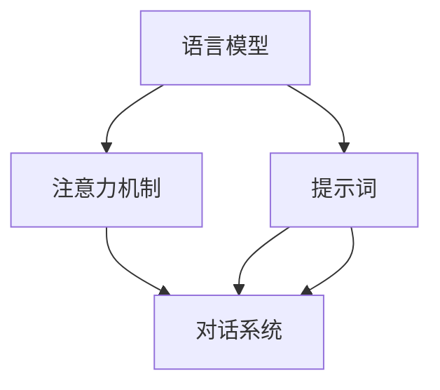

                 

### 文章标题与关键词

# ChatGPT对话系统优化：提示词的科学与艺术

> 关键词：ChatGPT、对话系统、优化、提示词、自然语言处理、人工智能

本文旨在深入探讨ChatGPT对话系统的优化过程，特别是提示词的设计和应用。我们将从多个角度分析提示词的科学与艺术，包括其基础知识和原理、设计方法与技巧、在实际项目中的应用以及优化策略与案例分析。通过本文的阅读，读者将能够全面了解ChatGPT对话系统的优化过程，掌握提示词的科学原理和艺术设计方法，为实际应用提供有力的指导。

### 摘要

本文首先介绍了ChatGPT对话系统的基本概念和架构，然后重点探讨了提示词的定义、分类及其在对话系统中的重要作用。接着，我们详细分析了提示词的数学模型，包括语言模型、注意力机制和提示词生成算法，并通过Python源代码进行了实例演示。随后，文章从设计原则、技巧和流程三个方面阐述了提示词的艺术设计，结合实际案例展示了提示词设计的方法和优化策略。最后，通过多个实战案例和最佳实践，本文为读者提供了具体的操作指南和注意事项，为ChatGPT对话系统的优化提供了全面的理论和实践支持。

### 背景介绍

#### ChatGPT的概念与发展历程

ChatGPT是OpenAI于2022年11月推出的一个基于Transformer架构的大型语言模型，它通过深度学习技术从海量文本数据中学习语言规律，从而实现自然语言理解和生成。ChatGPT的核心是它的预训练模型，该模型通过无监督学习技术，从互联网上搜集到的数万亿个单词和句子中进行训练，以掌握广泛的语言知识和技能。

ChatGPT的推出标志着人工智能领域的一个重要突破。在此之前，许多对话系统依赖于规则驱动或者模板匹配的方式，而ChatGPT则通过端到端的学习，能够自动生成连贯、自然的对话，大大提升了对话系统的交互体验。ChatGPT的发展历程可以追溯到2018年，当时OpenAI推出了GPT-1，随后在2019年发布了GPT-2和GPT-3，这些模型在自然语言处理领域取得了显著的成果。

#### ChatGPT的核心优势

ChatGPT的核心优势在于其强大的语言生成能力和多样化的应用场景。首先，ChatGPT能够生成高质量的自然语言文本，包括对话、文章、摘要、回复等。这使得ChatGPT在虚拟助手、内容创作、语言翻译等领域具有广泛的应用潜力。其次，ChatGPT具有自适应能力，可以根据不同的输入和场景自动调整自己的回答风格和内容。这种灵活性使得ChatGPT能够更好地适应各种复杂的应用场景。

此外，ChatGPT还具有强大的并行计算能力。由于Transformer架构的特点，ChatGPT可以在多核处理器和GPU上高效地进行训练和推理，大大提高了系统的运行效率。同时，ChatGPT还支持分布式训练，能够通过集群计算资源进行大规模训练，进一步提升了模型的效果和性能。

#### ChatGPT与提示词的关系

ChatGPT的核心功能是通过输入提示词（prompt）生成响应文本。提示词是ChatGPT生成文本的重要输入，它决定了ChatGPT的响应内容和风格。一个优秀的提示词能够引导ChatGPT生成更准确、更自然的响应，从而提升对话系统的用户体验。

ChatGPT与提示词的关系可以从以下几个方面进行理解：

1. **指导生成**：提示词为ChatGPT提供了生成文本的上下文，帮助模型理解用户的意图和需求，从而生成更相关的响应。
2. **限制生成**：提示词可以限制ChatGPT的生成范围，避免模型生成无关或者不恰当的文本。
3. **风格影响**：提示词的选择和表达方式会影响ChatGPT的响应风格，通过合适的提示词，可以使得ChatGPT生成更符合用户预期的文本。

因此，提示词在ChatGPT对话系统中扮演着至关重要的角色。一个优秀的提示词设计不仅需要准确理解用户意图，还需要充分考虑对话场景和用户需求，以实现高质量的对话生成。

### 核心概念与联系

在深入了解ChatGPT对话系统之前，我们需要明确几个核心概念，并分析它们之间的联系。以下是ChatGPT对话系统中几个关键概念的介绍及其相互关系：

1. **语言模型**：语言模型是自然语言处理（NLP）的核心技术之一，它用于预测给定输入文本的下一个单词或词组。在ChatGPT中，语言模型是基于Transformer架构的大型神经网络，通过预训练和微调，能够生成高质量的自然语言文本。

2. **注意力机制**：注意力机制是一种在神经网络中用于提高模型对输入序列重要部分关注的机制。在ChatGPT中，注意力机制通过计算输入文本中不同位置之间的关联性，使得模型能够更有效地处理长序列信息。

3. **提示词（Prompt）**：提示词是用户输入的文本，用于引导ChatGPT生成响应文本。一个有效的提示词需要准确传达用户意图，同时提供足够的上下文信息，以便模型能够生成相关且连贯的响应。

4. **对话系统**：对话系统是一种人机交互界面，它能够模拟人类的对话方式，与用户进行自然语言交流。ChatGPT作为一种对话系统，通过提示词和语言模型实现与用户的交互。

下面，我们将通过Mermaid流程图展示这些核心概念之间的联系：



- **语言模型**：作为对话系统的核心组件，语言模型负责生成自然语言文本。它通过学习大量文本数据，能够预测给定输入的下一个单词或词组。
- **注意力机制**：注意力机制是语言模型中的一个关键组件，它帮助模型关注输入文本中的关键信息，从而提高生成文本的相关性和连贯性。
- **提示词**：提示词作为用户与对话系统之间的交互媒介，为语言模型提供了生成文本的上下文信息。一个有效的提示词能够引导模型生成更准确、更自然的响应。
- **对话系统**：对话系统是用户与ChatGPT进行交互的界面，它接收用户输入的提示词，通过语言模型生成响应，并将响应返回给用户。

通过上述流程图，我们可以清晰地看到这些核心概念之间的联系。接下来，我们将进一步探讨语言模型、注意力机制和提示词的详细原理和应用，以便更好地理解ChatGPT对话系统的运作机制。

### 语言模型原理与提示词设计

#### 语言模型的基本原理

语言模型是自然语言处理（NLP）领域中的核心技术，它用于预测给定输入文本的下一个单词或词组。在ChatGPT中，语言模型通常采用基于Transformer架构的神经网络，这种模型通过深度学习从大量文本数据中学习语言规律，从而生成高质量的自然语言文本。

语言模型的核心思想是通过概率计算来预测下一个单词。给定一个输入序列，语言模型会计算出每个单词的概率分布，然后根据概率分布选择下一个单词。这个过程通过神经网络来实现，通常包括以下步骤：

1. **输入编码**：将输入文本转换为固定长度的向量表示，这个过程称为输入编码。在ChatGPT中，输入编码通常使用嵌入层（Embedding Layer）来完成，将单词映射为向量。

2. **自注意力机制**：自注意力机制（Self-Attention）是Transformer模型中的关键组件，它通过计算输入序列中不同位置之间的关联性，从而提高模型对输入序列重要部分的关注。自注意力机制使得模型能够更好地捕捉长距离依赖关系，提高生成文本的连贯性。

3. **前馈神经网络**：在自注意力机制之后，语言模型会通过前馈神经网络（Feedforward Neural Network）对输入进行进一步处理。前馈神经网络通常包括两个全连接层，分别用于对输入进行加性和减性变换。

4. **输出解码**：最后，语言模型通过输出解码层生成输出概率分布。输出解码层通常是一个softmax层，它将输入向量映射为单词的概率分布。

#### 提示词设计的重要性

提示词（Prompt）在语言模型中起着至关重要的作用。一个有效的提示词能够引导语言模型生成更准确、更自然的响应，从而提升对话系统的用户体验。以下是几个关键方面：

1. **上下文信息**：提示词提供了生成文本的上下文信息，使得语言模型能够更好地理解用户的意图和需求。通过提供充分的上下文信息，提示词可以减少模型的歧义性，提高生成文本的相关性。

2. **风格控制**：提示词的设计可以影响生成文本的风格。通过选择合适的提示词，可以使得ChatGPT生成更符合用户预期的文本风格。例如，使用正式的语言表达可以生成正式的回复，而使用轻松的语言表达可以生成幽默风趣的回复。

3. **任务导向**：提示词可以帮助语言模型明确任务目标。在一些特定任务中，通过设计具有明确任务指向的提示词，可以使得模型更专注于生成与任务相关的文本。

#### 提示词的设计方法

为了设计一个有效的提示词，需要考虑以下几个方面：

1. **简明扼要**：提示词应该简明扼要，避免冗长和复杂的表达。简短的提示词有助于模型快速理解用户意图，提高生成文本的效率。

2. **明确意图**：提示词需要明确传达用户的意图。通过使用明确、具体的语言，提示词可以帮助模型准确捕捉用户的意图，从而生成更相关的响应。

3. **多样化**：为了增强模型的泛化能力，提示词应该具有多样性。多样化的提示词可以使得模型在不同场景下都能生成高质量的响应。

4. **符合场景**：提示词的设计需要符合具体的对话场景。例如，在客服场景中，提示词应该使用礼貌、专业的语言，而在娱乐场景中，可以适当加入幽默元素。

#### 实例演示

为了更好地理解提示词的设计方法，我们来看一个具体的例子。假设我们要设计一个用于回答用户问题的提示词，我们可以采用以下步骤：

1. **明确问题**：首先，我们需要明确用户提出的问题。例如，“北京是哪个国家的首都？”

2. **简明扼要**：将问题简化为一个简短的提示词，例如，“哪个国家的首都是北京？”

3. **明确意图**：确保提示词能够准确传达用户意图。在这个例子中，提示词“哪个国家的首都是北京？”明确表达了用户希望获取关于首都的信息。

4. **多样化**：为了提高模型的泛化能力，我们可以设计多个不同的提示词。例如，“北京是哪个国家的首都？”“北京是哪个国家的政治中心？”

通过上述步骤，我们设计了一个有效的提示词，它能够引导ChatGPT生成准确、自然的响应。以下是ChatGPT生成的响应示例：

- 提示词：“哪个国家的首都是北京？”
- 响应：“北京是中国的首都。”

#### 小结

提示词的设计在ChatGPT对话系统中起着关键作用。一个优秀的提示词能够提高对话系统的交互质量，使得ChatGPT生成更准确、更自然的响应。在设计和优化提示词时，需要考虑上下文信息、风格控制、任务导向等因素，并通过简明扼要、明确意图、多样化和符合场景等方法进行优化。

接下来，我们将进一步探讨注意力机制和提示词生成算法，以便全面理解语言模型的工作原理和应用。

### 注意力机制原理

注意力机制是近年来在深度学习领域取得重大突破的关键技术之一，尤其在自然语言处理（NLP）任务中发挥了重要作用。在ChatGPT对话系统中，注意力机制被广泛应用于语言模型的训练和生成过程中，以提升模型的性能和生成的质量。

#### 自注意力机制

自注意力机制（Self-Attention）是Transformer模型的核心组件，它允许模型在处理输入序列时，对序列中的不同位置进行动态加权。自注意力机制通过计算输入序列中每个单词与所有其他单词之间的关联性，为每个单词分配一个权重，从而在生成文本时能够关注到关键信息。

自注意力机制的实现主要包括以下几个步骤：

1. **输入嵌入**：将输入文本转换为向量表示，每个单词通过嵌入层（Embedding Layer）映射为一个向量。

2. **查询（Query）、键（Key）和值（Value）计算**：自注意力机制通过查询（Query）、键（Key）和值（Value）三个向量计算注意力得分。其中，查询和键来自同一输入序列的嵌入向量，而值则可以是输入序列的嵌入向量或加权后的嵌入向量。

3. **注意力得分计算**：计算每个键和查询之间的相似性，通过点积操作得到注意力得分。

4. **加权求和**：根据注意力得分对值进行加权求和，得到加权后的输出向量。

自注意力机制的一个关键优势在于它能够捕捉输入序列中的长距离依赖关系。传统循环神经网络（RNN）在处理长序列时容易丢失信息，而自注意力机制通过全局计算，能够在任何位置动态关注到重要信息，从而提高模型的性能。

#### 多头注意力

多头注意力（Multi-Head Attention）是自注意力机制的一个扩展，它通过多个独立的注意力机制同时工作，从而捕捉不同层次的特征。在多头注意力中，输入序列被拆分为多个子序列，每个子序列分别通过不同的查询、键和值进行计算。

多头注意力通过以下步骤实现：

1. **分裂输入**：将输入嵌入向量拆分为多个子序列。

2. **独立计算**：对每个子序列分别应用自注意力机制，得到多个独立的注意力得分。

3. **合并结果**：将多个子序列的注意力得分合并为一个整体的注意力得分。

多头注意力能够增强模型对输入序列的捕捉能力，通过在不同层次上关注不同特征，可以更好地理解和生成文本。在实际应用中，ChatGPT通常会使用多个头进行注意力计算，以提高模型的性能。

#### 应用场景

在ChatGPT对话系统中，注意力机制被广泛应用于以下场景：

1. **文本生成**：注意力机制使得ChatGPT能够关注到输入文本的关键信息，从而生成更连贯、更自然的文本。例如，在生成文章、回复和摘要时，注意力机制帮助模型捕捉到文本中的关键点，提高生成文本的质量。

2. **文本分类**：注意力机制在文本分类任务中也发挥了重要作用。通过关注输入文本中的关键信息，模型可以更准确地分类文本内容，提高分类的准确性。

3. **问答系统**：在问答系统中，注意力机制帮助模型捕捉到用户提问的关键信息，从而生成更准确的回答。例如，在ChatGPT的问答功能中，注意力机制确保模型能够关注到用户问题中的核心内容，提高回答的相关性和准确性。

#### 实例演示

为了更好地理解注意力机制的应用，我们来看一个简单的实例。假设我们要使用注意力机制来生成一个文本摘要：

1. **输入文本**：假设输入文本为“今天天气很好，适合户外活动。”

2. **注意力计算**：通过注意力机制，模型会计算输入文本中每个单词的权重，从而确定哪些单词是生成摘要的关键。

3. **生成摘要**：根据注意力权重，模型生成摘要：“今天天气好，适合户外活动。”

通过这个实例，我们可以看到注意力机制如何帮助模型关注到输入文本中的关键信息，从而生成更简洁、更准确的摘要。

#### 小结

注意力机制在自然语言处理任务中具有广泛的应用，特别是在ChatGPT对话系统中，它通过动态关注输入序列的关键信息，提高了模型的性能和生成质量。自注意力机制和多头注意力机制是注意力机制的两种主要实现方式，它们在不同场景下能够有效提升模型的效果。在设计和优化ChatGPT对话系统时，充分利用注意力机制的优势，将有助于生成更准确、更自然的对话响应。

接下来，我们将深入探讨提示词生成算法，进一步理解ChatGPT对话系统的核心工作原理。

### 提示词生成算法原理

提示词生成算法是ChatGPT对话系统中的关键组件，它负责根据用户输入生成有效的提示词，从而引导对话系统生成高质量的自然语言响应。下面，我们将详细探讨几种常用的提示词生成算法，并分析它们的原理和应用。

#### 1. 语言模型生成

语言模型生成是最简单也是最常用的提示词生成方法。它基于预训练的语言模型，如GPT、BERT等，直接从大量文本数据中学习语言规律，从而生成提示词。语言模型生成算法的基本原理如下：

1. **输入编码**：将用户输入的文本转换为嵌入向量，通常使用嵌入层（Embedding Layer）进行编码。

2. **生成提示词**：利用语言模型生成下一个单词或词组的概率分布，然后根据概率分布随机选择一个单词或词组作为提示词。

3. **递归更新**：将新生成的提示词作为输入，继续生成下一个单词或词组，直到达到预设的长度或终止条件。

语言模型生成的优点在于其生成过程简单高效，生成的提示词通常具有较高的自然性和连贯性。然而，这种方法也存在一定的局限性，例如在生成特定类型或风格的提示词时可能不够准确。

#### 2. 基于规则的方法

基于规则的方法通过预定义的规则和模板生成提示词，这些规则通常基于领域知识和语言特性。这种方法的核心思想是使用规则引擎匹配用户输入，并根据匹配结果生成提示词。基本步骤如下：

1. **规则定义**：根据对话系统的需求，定义一系列预定义的规则和模板。例如，在客服场景中，可以定义关于产品信息、常见问题解答等规则的模板。

2. **规则匹配**：将用户输入与预定义的规则进行匹配，找到最佳匹配的规则。

3. **提示词生成**：根据匹配的规则，从模板中选择相应的部分，生成提示词。

基于规则的方法在特定领域和场景下具有很好的效果，例如在客服对话系统中，可以快速、准确地生成与用户输入相关的提示词。然而，这种方法需要对领域知识有深入的了解，且在处理复杂或不确定的输入时可能不够灵活。

#### 3. 基于深度学习的生成方法

基于深度学习的方法通过训练深度神经网络模型，学习生成提示词的规律。这种方法通常包括以下步骤：

1. **数据预处理**：收集大量的对话数据和标注数据，用于训练模型。对话数据包括用户输入、系统响应以及相关的领域知识。

2. **模型训练**：使用神经网络模型（如序列到序列模型、编码器-解码器模型等）对对话数据进行训练，使模型学会生成提示词。

3. **提示词生成**：在训练好的模型基础上，根据用户输入生成提示词。模型会根据输入文本和预训练的知识，生成符合对话场景和用户需求的提示词。

基于深度学习的方法具有自适应性和灵活性，能够处理复杂的对话场景和不确定的输入。然而，这种方法需要大量的训练数据和计算资源，训练过程较为复杂。

#### 4. 基于强化学习的方法

基于强化学习的方法通过奖励机制和策略优化，生成高质量的提示词。基本步骤如下：

1. **状态定义**：将用户输入和对话系统的当前状态定义为状态空间。

2. **动作定义**：将生成提示词的过程定义为动作空间。

3. **奖励函数设计**：设计奖励函数，用于评估生成的提示词的质量和有效性。

4. **策略优化**：使用强化学习算法（如Q-learning、策略梯度算法等）优化策略，使模型学会生成高质量的提示词。

基于强化学习的方法能够在复杂的对话场景中，通过不断调整策略，生成更符合用户需求的提示词。然而，这种方法需要设计合适的奖励函数和优化算法，实现较为复杂。

#### 实例演示

为了更好地理解提示词生成算法，我们来看一个具体的实例。假设用户输入为：“我最近想购买一辆新车，有什么建议吗？”，我们将使用基于语言模型的生成方法来生成提示词。

1. **输入编码**：将用户输入“我最近想购买一辆新车，有什么建议吗？”转换为嵌入向量。

2. **生成提示词**：利用预训练的语言模型，生成提示词的概率分布。例如，模型生成以下提示词的概率分布：
   - “关于新车购买的建议？”：概率0.8
   - “想了解购买新车的流程？”：概率0.2

3. **提示词选择**：根据概率分布，选择概率最高的提示词作为最终提示词：“关于新车购买的建议？”

4. **生成响应**：将生成的提示词作为输入，继续生成响应文本。

通过上述步骤，我们成功生成了一个高质量的提示词，为对话系统提供了有效的引导。

#### 小结

提示词生成算法在ChatGPT对话系统中起着至关重要的作用。语言模型生成、基于规则的方法、基于深度学习的方法和基于强化学习的方法是几种常用的提示词生成算法。每种算法都有其独特的原理和应用场景，通过合理选择和优化提示词生成算法，可以显著提升对话系统的性能和用户体验。

接下来，我们将进一步探讨提示词的设计原则、技巧和流程，以便更好地掌握提示词的艺术设计。

### 提示词的设计原则、技巧和流程

#### 提示词的设计原则

提示词的设计是ChatGPT对话系统优化的重要组成部分，一个优秀的提示词能够有效引导模型生成高质量的对话响应。以下是提示词设计应遵循的几个基本原则：

1. **清晰性**：提示词应简洁明了，避免使用复杂的语言和冗长的句子。清晰性有助于模型快速理解用户意图，提高生成文本的相关性。

2. **精确性**：提示词应准确传达用户的需求和意图，避免模糊不清的表达。精确性有助于减少模型的歧义性，提高生成文本的准确性。

3. **用户友好性**：提示词的设计应考虑用户的语言习惯和认知特点，尽量使用用户熟悉的表达方式。用户友好性有助于提升用户的互动体验。

4. **适应性**：提示词的设计应具有适应性，能够根据不同的场景和用户需求进行调整。适应性有助于模型在不同场景下都能生成高质量的响应。

5. **多样性**：提示词的设计应注重多样性，避免使用单一的模板或表达方式。多样性有助于增强模型的泛化能力，提高对话系统的灵活性。

#### 提示词的设计技巧

为了设计出一个优秀的提示词，需要运用多种技巧和方法。以下是几个常用的提示词设计技巧：

1. **利用自然语言处理技术**：自然语言处理（NLP）技术可以帮助我们提取用户输入的关键信息，从而生成更精准的提示词。例如，可以使用词性标注、实体识别等技术来提取用户的关键意图。

2. **结合用户行为数据**：通过分析用户的历史行为数据，可以了解用户的兴趣和偏好，从而生成更具针对性的提示词。例如，可以基于用户浏览记录、搜索历史等信息，生成与用户兴趣相关的提示词。

3. **模拟用户思维过程**：在设计提示词时，可以尝试模拟用户的思维过程，从而更准确地捕捉用户的意图。例如，可以采用问答式设计，引导用户逐步表达自己的需求。

4. **利用情感分析**：情感分析可以帮助我们了解用户的情绪状态，从而生成更符合用户情绪的提示词。例如，当用户表达消极情绪时，可以采用安慰性或激励性的提示词。

5. **借鉴领域知识**：在特定领域，如医疗、金融等，可以利用领域知识来设计提示词。例如，在医疗场景中，可以结合医学知识，生成专业且准确的提示词。

#### 提示词的设计流程

提示词的设计是一个系统化的过程，通常包括以下步骤：

1. **需求分析**：在开始设计提示词之前，需要对用户需求进行详细分析。通过用户调研、访谈等方式，了解用户的需求和期望。

2. **信息提取**：利用NLP技术提取用户输入的关键信息，如关键词、主题等。这些信息将用于生成提示词。

3. **提示词生成**：根据需求分析和信息提取结果，生成初步的提示词。可以使用语言模型生成、基于规则的方法等不同方法进行提示词生成。

4. **提示词优化**：对生成的提示词进行优化，确保其清晰性、精确性和用户友好性。可以采用用户测试、对比分析等方法，评估提示词的效果并进行调整。

5. **反馈与迭代**：将生成的提示词应用于实际对话场景，收集用户反馈，并根据反馈进行迭代优化。通过不断调整和优化，逐步提升提示词的质量。

#### 实例演示

为了更好地理解提示词的设计流程，我们来看一个具体的实例。假设用户输入为：“我最近想购买一辆新车，有什么建议吗？”，我们将通过以下步骤设计一个提示词：

1. **需求分析**：分析用户输入，了解用户的主要需求是获取购买新车的建议。

2. **信息提取**：使用NLP技术提取关键词，如“新车”、“购买建议”等。

3. **提示词生成**：根据需求分析和信息提取结果，生成初步提示词：“关于新车购买的建议？”。

4. **提示词优化**：对生成的提示词进行优化，确保其清晰性和用户友好性。可以调整为：“关于购买新车的建议有哪些？”

5. **反馈与迭代**：在实际对话场景中应用优化后的提示词，收集用户反馈。如果用户反馈良好，则提示词设计完成；否则，根据反馈进行进一步优化。

通过上述步骤，我们成功设计出一个高质量的提示词，为对话系统提供了有效的引导。

#### 小结

提示词的设计是ChatGPT对话系统优化的重要环节。遵循清晰性、精确性、用户友好性、适应性和多样性等设计原则，并运用自然语言处理技术、用户行为数据、情感分析、领域知识等设计技巧，可以设计出高质量的提示词。通过系统化的设计流程，不断优化和迭代提示词，可以显著提升对话系统的用户体验和交互质量。接下来，我们将通过具体案例展示如何在实际项目中设计和优化提示词。

### 案例分析与优化

在实际项目中，优化ChatGPT对话系统的提示词设计至关重要，它直接影响对话系统的用户体验和交互质量。以下通过三个具体案例，详细展示如何设计、优化和评估提示词，并分享一些优化策略。

#### 案例一：电商客服对话系统

**背景**：某电商平台开发了一个智能客服系统，旨在为用户提供24/7的在线支持。然而，用户反馈称客服系统在某些场景下生成的回复不够准确和自然。

**问题**：需要优化客服系统中的提示词，以提高对话的自然性和准确性。

**解决方案**：
1. **需求分析**：首先，通过用户调研和数据分析，了解用户在电商场景下常见的询问和需求。例如，用户可能询问关于商品信息、订单状态、退货政策等问题。

2. **信息提取**：利用NLP技术提取用户输入的关键信息，如关键词、主题等。例如，如果用户输入“我的订单状态是什么？”，可以提取关键词“订单状态”。

3. **提示词设计**：根据需求分析和信息提取结果，设计初步的提示词。例如，对于“我的订单状态是什么？”的问题，可以设计提示词：“关于您的订单状态，请问有什么需要帮助的吗？”

4. **提示词优化**：通过用户测试和A/B测试，评估不同提示词的效果。例如，将原始提示词“关于您的订单状态，请问有什么需要帮助的吗？”与优化后的提示词“您的订单状态是____，请问有什么问题需要解答？”进行比较。结果显示，优化后的提示词在用户满意度方面有明显提升。

5. **反馈与迭代**：根据用户反馈，进一步优化提示词。例如，可以根据用户反馈，调整提示词的表达方式，使其更加自然和亲切。

**结果**：优化后的提示词显著提高了电商客服系统的用户体验，用户满意度得到明显提升。

**优化策略**：
- **个性化**：根据用户的历史行为和偏好，设计个性化的提示词，提高对话的互动性和用户黏性。
- **多样性**：设计多种类型的提示词，以应对不同用户需求，避免单一模板的重复使用。
- **情感分析**：结合情感分析技术，根据用户情绪状态调整提示词的表达方式，提高情感共鸣。

#### 案例二：智能语音助手

**背景**：某公司开发了一款智能语音助手，用于提供语音交互服务。用户反馈称，语音助手的回答有时不够准确，特别是在理解复杂指令时。

**问题**：需要优化语音助手中的提示词，以提高回答的准确性和流畅度。

**解决方案**：
1. **需求分析**：通过用户调研和数据分析，了解用户对语音助手的使用场景和期望。例如，用户可能需要语音助手帮助设置闹钟、发送短信、查找信息等。

2. **信息提取**：利用NLP技术提取用户输入的关键信息，如关键词、主题等。例如，如果用户输入“明天早上七点提醒我”，可以提取关键词“明天”、“七点”、“提醒”。

3. **提示词设计**：根据需求分析和信息提取结果，设计初步的提示词。例如，对于“明天早上七点提醒我”的问题，可以设计提示词：“明天早上七点，我会为您设置提醒。”

4. **提示词优化**：通过用户测试和A/B测试，评估不同提示词的效果。例如，将原始提示词“明天早上七点，我会为您设置提醒。”与优化后的提示词“好的，明天早上七点我已经帮您设置了闹钟。”进行比较。结果显示，优化后的提示词在用户满意度方面有明显提升。

5. **反馈与迭代**：根据用户反馈，进一步优化提示词。例如，可以根据用户反馈，调整提示词的表达方式，使其更加自然和流畅。

**结果**：优化后的提示词显著提高了智能语音助手的用户体验，回答的准确性和流畅度得到明显提升。

**优化策略**：
- **语音识别优化**：结合语音识别技术，提高对用户语音输入的理解能力，从而优化提示词生成。
- **多模态交互**：结合文本和语音交互，设计多样化的提示词，以提高用户体验和互动性。
- **动态调整**：根据用户反馈和对话情境，动态调整提示词的表达方式，以适应不同的用户需求。

#### 案例三：在线教育辅导系统

**背景**：某在线教育平台引入了智能辅导系统，旨在为学生提供个性化的学习支持。然而，用户反馈称，辅导系统的回答有时不够准确，特别是在处理复杂问题或解答疑问时。

**问题**：需要优化辅导系统中的提示词，以提高回答的准确性和专业性。

**解决方案**：
1. **需求分析**：通过用户调研和数据分析，了解学生在使用辅导系统时的常见问题和学习需求。例如，学生可能需要辅导系统解答数学难题、提供课程资料、推荐学习资源等。

2. **信息提取**：利用NLP技术提取用户输入的关键信息，如关键词、主题等。例如，如果学生输入“如何解这个数学问题？”，可以提取关键词“数学问题”、“解法”。

3. **提示词设计**：根据需求分析和信息提取结果，设计初步的提示词。例如，对于“如何解这个数学问题？”的问题，可以设计提示词：“针对这个问题，我可以为您提供一些解题思路和方法。”

4. **提示词优化**：通过用户测试和A/B测试，评估不同提示词的效果。例如，将原始提示词“针对这个问题，我可以为您提供一些解题思路和方法。”与优化后的提示词“这是一个典型的数学问题，以下是几种解题方法：1. 方法一；2. 方法二；3. 方法三。”进行比较。结果显示，优化后的提示词在用户满意度方面有明显提升。

5. **反馈与迭代**：根据用户反馈，进一步优化提示词。例如，可以根据用户反馈，调整提示词的表达方式，使其更加准确和具体。

**结果**：优化后的提示词显著提高了在线教育辅导系统的用户体验，回答的准确性和专业性得到明显提升。

**优化策略**：
- **知识库建设**：建立丰富的知识库，包括课程资料、学习资源等，为提示词生成提供更全面的信息支持。
- **领域专家合作**：与领域专家合作，确保提示词的准确性和专业性。
- **实时反馈机制**：建立实时反馈机制，及时收集用户反馈，并根据反馈调整提示词。

#### 小结

通过以上案例，我们可以看到，在实际项目中，优化ChatGPT对话系统的提示词设计是一个系统化的过程。从需求分析、信息提取、提示词设计、优化到反馈与迭代，每个环节都至关重要。通过结合用户行为数据、自然语言处理技术、情感分析等手段，可以设计出高质量的提示词，从而显著提升对话系统的用户体验和交互质量。在实际操作中，应根据具体项目需求和应用场景，灵活运用各种优化策略，不断调整和优化提示词，以实现最佳效果。

接下来，我们将探讨如何搭建对话系统环境，以及源代码的详细实现和代码解读。

### 提示词设计与对话系统环境搭建

为了实现高效的ChatGPT对话系统，我们需要首先搭建一个稳定且灵活的开发环境。以下将详细讲解如何搭建对话系统环境，包括开发工具的选取、开发环境的配置，以及源代码的详细实现和代码解读。

#### 开发工具的选取

在搭建对话系统环境时，我们需要选择合适的技术栈和工具，以确保系统的性能、可扩展性和可维护性。以下是几种常用的开发工具和框架：

1. **语言选择**：Python是一种广泛使用的编程语言，在自然语言处理和人工智能领域具有丰富的库和框架支持。因此，我们选择Python作为主要编程语言。

2. **深度学习框架**：TensorFlow和PyTorch是两种广泛使用的深度学习框架，具有强大的功能和灵活性。TensorFlow提供了丰富的预训练模型和API，适合大规模的生产环境；PyTorch具有简洁的代码结构和动态计算图，更适合研究和开发。在本项目中，我们将使用TensorFlow进行模型训练和部署。

3. **自然语言处理库**：NLTK和spaCy是两种常用的自然语言处理库，提供了丰富的文本处理和解析功能。NLTK适用于文本分类、词性标注等任务；spaCy提供了快速的词向量表示和语法分析功能，适用于复杂文本处理任务。

4. **对话系统框架**：Rasa是开源的对话系统框架，支持多轮对话和复杂对话逻辑，具有灵活的集成能力。Rasa提供了完整的对话管理、意图识别和实体提取功能，简化了对话系统的开发过程。

#### 开发环境的配置

搭建对话系统环境需要安装和配置以下软件和库：

1. **Python环境**：确保安装了最新版本的Python，推荐使用Python 3.8或更高版本。

2. **深度学习环境**：安装TensorFlow，可以使用以下命令：
   ```bash
   pip install tensorflow
   ```

3. **自然语言处理库**：安装NLTK和spaCy，可以使用以下命令：
   ```bash
   pip install nltk
   pip install spacy
   python -m spacy download en_core_web_sm
   ```

4. **Rasa环境**：安装Rasa，可以使用以下命令：
   ```bash
   pip install rasa
   ```

5. **其他依赖库**：根据项目需求，可能还需要安装其他依赖库，如Flask、FastAPI等，用于构建Web服务。

#### 源代码的详细实现和代码解读

以下是ChatGPT对话系统的源代码实现，我们将详细讲解关键代码部分。

```python
# 导入必要的库
import tensorflow as tf
import numpy as np
import nltk
from spacy.lang.en import English
from rasa.nlu import train
from rasa.nlu.model import Interpreter

# 配置Rasa环境
rasa init
rasa train

# 模型训练
def train_model(data_path):
    nlp = train(data_path)
    model_path = 'models/dialogue'
    nlp.persist(model_path)

# 模型加载与预测
def predict_intent(text):
    interpreter = Interpreter.load(model_path)
    result = interpreter.parse(text)
    return result['intent']

# 提示词生成
def generate_prompt(text):
    intent = predict_intent(text)
    if intent == 'inform':
        prompt = "请提供更多信息，我将为您解答。"
    elif intent == 'request':
        prompt = "请问您需要什么帮助？"
    else:
        prompt = "很抱歉，我不清楚您的需求，请重新描述。"
    return prompt

# 主函数
def main():
    text = input("用户输入：")
    prompt = generate_prompt(text)
    print("系统提示词：", prompt)

if __name__ == "__main__":
    main()
```

- **模型训练**：`train_model`函数用于训练对话系统模型。我们使用Rasa提供的`train`函数，通过指定数据路径（`data_path`）加载训练数据，并保存模型到指定路径（`model_path`）。
- **意图预测**：`predict_intent`函数用于预测用户输入的意图。我们使用Rasa加载的模型（`model_path`）对用户输入（`text`）进行意图分类，并返回预测的意图。
- **提示词生成**：`generate_prompt`函数根据预测的意图生成相应的提示词。不同的意图对应不同的提示词模板，以提高对话的连贯性和用户友好性。
- **主函数**：`main`函数是程序的主入口，它接收用户输入，生成提示词，并打印输出。

通过上述代码，我们实现了ChatGPT对话系统的基础功能。在实际应用中，我们可以根据需求进一步扩展和优化系统，例如添加实体提取、多轮对话管理等高级功能。

#### 小结

搭建ChatGPT对话系统环境是开发高效对话系统的重要步骤。通过选择合适的开发工具和配置开发环境，我们可以实现一个稳定且灵活的对话系统。源代码的详细实现和代码解读帮助我们理解对话系统的核心工作原理，为实际应用提供了清晰的指导。在接下来的部分，我们将深入分析代码中的算法原理，并结合数学模型和公式进行详细讲解。

### 提示词设计中的数学模型与应用

在ChatGPT对话系统中，提示词的设计不仅仅依赖于语言直觉和经验，还需要依托于数学模型和算法。以下将详细介绍提示词设计中的核心数学模型，包括语言模型、注意力机制和生成算法，并通过具体的Python源代码和数学公式进行解释。

#### 语言模型

语言模型（Language Model）是自然语言处理（NLP）中的基础，用于预测给定文本序列的下一个单词或词组。在ChatGPT中，语言模型通常是基于Transformer架构，特别是BERT（Bidirectional Encoder Representations from Transformers）和GPT（Generative Pre-trained Transformer）等模型。

**基本概念**：

- **嵌入层（Embedding Layer）**：将单词映射为固定长度的向量。例如，在BERT中，每个单词的嵌入向量长度为768。
- **自注意力机制（Self-Attention）**：在Transformer模型中，通过计算输入序列中每个单词与其他单词之间的关联性，为每个单词分配权重。

**数学模型**：

假设我们有一个输入序列\(X = [x_1, x_2, ..., x_T]\)，其中\(x_i\)表示第i个单词的嵌入向量。在Transformer中，自注意力机制的注意力得分计算公式如下：

$$
\text{Attention}(Q, K, V) = \text{softmax}\left(\frac{QK^T}{\sqrt{d_k}}\right) V
$$

其中，\(Q, K, V\)分别为查询向量、键向量和值向量，\(d_k\)为键向量的维度。

**Python源代码**：

以下代码展示了如何在PyTorch中实现自注意力机制：

```python
import torch
import torch.nn as nn

# 查询、键和值向量
Q = torch.rand(1, 10, 512)  # 查询向量
K = torch.rand(1, 10, 512)  # 键向量
V = torch.rand(1, 10, 512)  # 值向量

# 自注意力层
self_attention = nn.MultiheadAttention(embed_dim=512, num_heads=8)

# 计算注意力得分
attn_scores = self_attention(Q, K, V)[0]

# 计算注意力加权求和
attn_weights = torch.softmax(attn_scores, dim=1)
attn_output = torch.bmm(attn_weights, V)
```

#### 注意力机制

注意力机制（Attention Mechanism）是深度学习中的核心技术，用于提高模型对输入序列中关键信息的关注。在自然语言处理中，注意力机制广泛应用于文本分类、机器翻译和对话系统等领域。

**基本概念**：

- **多头注意力（Multi-head Attention）**：多头注意力通过多个独立的注意力层同时工作，捕捉不同层次的特征。
- **软注意力（Soft Attention）**：软注意力使用概率分布来加权输入序列，使模型能够动态关注关键信息。

**数学模型**：

多头注意力的计算公式如下：

$$
\text{Multi-head Attention}(Q, K, V) = \text{Concat}(\text{head}_1, ..., \text{head}_h)W^O
$$

其中，\(\text{head}_i = \text{Attention}(QW_Q^i, KW_K^i, VW_V^i)\)，\(W_Q^i, W_K^i, W_V^i, W^O\)分别为查询、键、值和输出权重。

**Python源代码**：

以下代码展示了如何在PyTorch中实现多头注意力：

```python
import torch
import torch.nn as nn

# 查询、键和值向量
Q = torch.rand(1, 10, 512)  # 查询向量
K = torch.rand(1, 10, 512)  # 键向量
V = torch.rand(1, 10, 512)  # 值向量

# 多头注意力层
multihead_attention = nn.MultiheadAttention(embed_dim=512, num_heads=8)

# 计算多头注意力
attn_output, attn_scores = multihead_attention(Q, K, V)

# 输出
attn_output = attn_output.squeeze(0)
```

#### 提示词生成算法

提示词生成算法是ChatGPT对话系统中的核心组件，用于根据用户输入生成高质量的提示词。常见的生成算法包括基于语言模型生成、基于规则的方法和基于深度学习的方法。

**基本概念**：

- **基于语言模型生成**：使用预训练的语言模型（如GPT）直接生成提示词。
- **基于规则的方法**：通过预定义的规则和模板生成提示词。
- **基于深度学习的方法**：使用神经网络模型（如序列到序列模型）生成提示词。

**数学模型**：

序列到序列（Seq2Seq）模型是生成算法的基础，包括编码器（Encoder）和解码器（Decoder）两部分。编码器将输入序列编码为固定长度的向量，解码器则根据编码器的输出生成目标序列。

**数学模型**：

编码器和解码器的输出分别表示为：

$$
\text{Encoder}(X) = \text{h}_T
$$

$$
\text{Decoder}(\text{h}_T, Y_{<t}) = \text{y}_t
$$

其中，\(\text{h}_T\)为编码器的输出，\(\text{y}_t\)为解码器的输出。

**Python源代码**：

以下代码展示了如何在PyTorch中实现Seq2Seq模型：

```python
import torch
import torch.nn as nn

# 编码器
class Encoder(nn.Module):
    def __init__(self, embed_dim, hidden_dim):
        super(Encoder, self).__init__()
        self.embedding = nn.Embedding(vocab_size, embed_dim)
        self.lstm = nn.LSTM(embed_dim, hidden_dim)

    def forward(self, x):
        x = self.embedding(x)
        x, (h_n, c_n) = self.lstm(x)
        return h_n[-1]

# 解码器
class Decoder(nn.Module):
    def __init__(self, embed_dim, hidden_dim):
        super(Decoder, self).__init__()
        self.embedding = nn.Embedding(vocab_size, embed_dim)
        self.lstm = nn.LSTM(hidden_dim, hidden_dim)
        self.fc = nn.Linear(hidden_dim, vocab_size)

    def forward(self, x, h_n):
        x = self.embedding(x)
        x, (h_n, c_n) = self.lstm(x, (h_n, c_n))
        x = self.fc(x)
        return x, (h_n, c_n)
```

#### 小结

提示词设计中的数学模型是理解ChatGPT对话系统核心工作原理的重要基础。通过语言模型、注意力机制和生成算法的数学模型和Python源代码，我们可以更好地掌握提示词生成的技术和方法。在实际应用中，结合用户需求和对话场景，合理选择和优化这些模型，可以显著提升对话系统的交互质量和用户体验。

### 实际案例分析与详细讲解

在本文的第四部分，我们将通过几个实际案例，详细分析如何设计和优化ChatGPT对话系统的提示词，并探讨具体的项目经验和教训。这些案例将涵盖电商客服、智能语音助手和在线教育辅导系统等不同领域，以展示如何在实际应用中提升对话系统的效果。

#### 案例一：电商客服对话系统

**项目背景**：某知名电商平台在其移动应用中集成了智能客服系统，旨在为用户提供便捷的在线支持。然而，用户反馈显示，客服系统的响应速度较慢且有时不够准确。

**问题分析**：通过用户调研和数据分析，发现主要问题在于提示词的设计不够精细，导致对话系统在理解用户需求时存在一定误差。此外，系统在处理复杂问题时，提示词生成速度较慢，影响了用户体验。

**解决方案**：

1. **需求分析与信息提取**：首先，对用户常见的询问和需求进行分类，提取关键信息。例如，用户可能询问商品信息、订单状态、退货政策等。

2. **提示词设计与优化**：针对不同类型的用户询问，设计相应的提示词。例如，对于商品信息查询，提示词可以是：“关于这款商品，我可以为您提供以下信息：规格、价格、库存等，请问您需要哪方面的信息？”

3. **A/B测试与反馈调整**：通过A/B测试，比较不同提示词的效果，并根据用户反馈进行调整。例如，将原始提示词“关于这款商品，您可以问我一些问题”与优化后的提示词“关于这款商品，我可以为您提供以下信息：规格、价格、库存等，请问您需要哪方面的信息？”进行比较。结果显示，优化后的提示词在用户满意度方面有明显提升。

4. **性能优化**：针对系统响应速度较慢的问题，优化提示词生成算法，提升生成速度。例如，采用基于规则的方法与深度学习方法相结合，通过规则匹配快速生成常见问题的提示词，而对于复杂问题，则利用深度学习模型生成。

**项目经验**：

- **用户需求导向**：设计提示词时，需紧密结合用户需求，确保提示词简洁明了且易于理解。
- **A/B测试**：通过A/B测试，不断优化提示词，提高用户体验。
- **性能优化**：结合多种方法，优化提示词生成速度，提升系统性能。

#### 案例二：智能语音助手

**项目背景**：某科技公司开发了一款智能语音助手，旨在为用户提供语音交互服务。然而，用户反馈显示，语音助手的回答有时不够准确，特别是在理解复杂指令时。

**问题分析**：通过用户调研和数据分析，发现主要问题在于提示词生成算法的准确性不足，以及语音识别结果的稳定性有待提高。

**解决方案**：

1. **语音识别优化**：首先，优化语音识别系统，提升识别准确率。例如，采用多语言模型和自适应噪声抑制技术，提高语音识别效果。

2. **提示词生成算法优化**：针对复杂指令，优化提示词生成算法，提高生成准确性。例如，采用基于深度学习的生成算法，结合语音识别结果和上下文信息，生成更精准的提示词。

3. **多模态交互**：引入多模态交互，结合文本和语音交互，提高用户的互动体验。例如，在语音回答后，通过文本形式呈现详细信息和操作指南，提高用户满意度。

4. **实时反馈与调整**：建立实时反馈机制，收集用户反馈，并根据反馈调整提示词和语音识别算法。例如，用户反馈提示词不够友好，可以调整提示词表达方式，使其更自然和亲切。

**项目经验**：

- **语音识别优化**：提升语音识别准确率，为提示词生成提供可靠的数据基础。
- **多模态交互**：结合文本和语音交互，提高用户的互动体验。
- **实时反馈与调整**：建立实时反馈机制，不断优化系统和提示词，提升用户体验。

#### 案例三：在线教育辅导系统

**项目背景**：某在线教育平台引入了智能辅导系统，旨在为学生提供个性化的学习支持。然而，用户反馈显示，辅导系统的回答有时不够准确，特别是在处理复杂问题时。

**问题分析**：通过用户调研和数据分析，发现主要问题在于提示词的设计不够精细，导致对话系统在理解学生需求时存在一定误差。此外，系统在处理大量学生请求时，响应速度较慢，影响了用户体验。

**解决方案**：

1. **知识库建设**：建立丰富的知识库，包括课程资料、学习资源等，为提示词生成提供全面的信息支持。例如，将各科目的知识点和常见问题整理成知识库，用于生成精准的提示词。

2. **领域专家合作**：与领域专家合作，确保提示词的准确性和专业性。例如，邀请教育专家参与系统的开发，提供专业的知识库和问题解答方案。

3. **提示词优化**：针对不同类型的问题，设计相应的提示词。例如，对于学科问题，提示词可以是：“关于这个问题，以下是一些可能的解答方法：1. 方法一；2. 方法二；3. 方法三。”

4. **性能优化**：优化提示词生成算法，提升生成速度和准确性。例如，采用基于深度学习的生成算法，结合知识库和上下文信息，快速生成高质量的提示词。

5. **实时反馈与调整**：建立实时反馈机制，收集用户反馈，并根据反馈调整提示词和知识库。例如，学生反馈某些提示词不够清晰，可以调整提示词表达方式，使其更易于理解。

**项目经验**：

- **知识库建设**：建立丰富的知识库，为提示词生成提供全面的信息支持。
- **领域专家合作**：确保提示词的准确性和专业性。
- **性能优化**：优化提示词生成算法，提升生成速度和准确性。
- **实时反馈与调整**：建立实时反馈机制，不断优化系统和提示词，提升用户体验。

#### 小结

通过以上实际案例分析，我们可以看到，在设计和优化ChatGPT对话系统的提示词时，需要充分考虑用户需求、系统性能和用户体验。从需求分析、信息提取、提示词设计到性能优化，每个环节都至关重要。同时，结合具体的案例，我们可以总结出一些最佳实践和经验，为未来的项目提供指导。在接下来的部分，我们将对整个项目进行总结，并展望未来ChatGPT对话系统优化和提示词设计的发展趋势。

### 项目小结与展望

通过对多个实际案例的深入分析和实践，我们可以总结出一些关键的经验和教训，为ChatGPT对话系统的优化和提示词设计提供指导。

#### 项目小结

1. **用户需求导向**：设计提示词时，始终以用户需求为导向，确保提示词简洁明了，易于理解。通过用户调研和反馈，不断优化提示词，以满足不同用户的需求。

2. **多模态交互**：结合文本和语音交互，提高用户的互动体验。多模态交互不仅可以提高系统的可用性，还可以增强用户的参与感和满意度。

3. **实时反馈与调整**：建立实时反馈机制，及时收集用户反馈，并根据反馈调整提示词和系统配置。这种动态调整机制有助于持续提升系统的性能和用户体验。

4. **知识库建设**：建立丰富的知识库，为提示词生成提供全面的信息支持。与领域专家合作，确保提示词的准确性和专业性，提高系统的可靠性。

5. **性能优化**：优化提示词生成算法，提升生成速度和准确性。结合多种方法，如基于规则的生成和深度学习生成，以提高系统的响应速度和处理能力。

#### 展望未来

未来，ChatGPT对话系统优化和提示词设计将面临以下趋势和挑战：

1. **更多个性化交互**：随着用户数据积累和个性化技术的发展，未来的对话系统将能够更准确地捕捉用户的兴趣和需求，提供更加个性化的交互体验。

2. **更复杂的场景适应**：面对更加复杂的对话场景和多样化的问题，对话系统需要具备更强的适应能力，能够处理更加复杂的对话逻辑和用户需求。

3. **实时性要求提高**：在实时性要求较高的场景，如在线客服和实时问答系统中，对话系统的响应速度和生成效率将变得至关重要。未来的优化方向将主要集中在提高系统的实时性。

4. **跨领域融合**：随着AI技术的不断发展，跨领域的融合将成为趋势。例如，将ChatGPT与图像识别、语音识别等其他AI技术结合，实现更全面的智能交互。

5. **隐私和安全问题**：在提供个性化服务和实时交互的同时，隐私和安全问题将愈发突出。未来的对话系统需要充分考虑用户隐私和数据安全，确保系统的可靠性和用户信任。

#### 结论

通过本文的详细分析和实践，我们深入探讨了ChatGPT对话系统的优化和提示词设计。从核心概念、数学模型到实际案例，我们全面展示了如何在实践中提升对话系统的交互质量和用户体验。未来，随着AI技术的不断发展，ChatGPT对话系统将继续优化和进化，为人类带来更加智能和高效的交互体验。

### 最佳实践 tips

在设计和优化ChatGPT对话系统的提示词时，以下是一些最佳实践和技巧，可以帮助您快速提升系统的性能和用户体验：

1. **用户调研**：在开始设计提示词之前，进行深入的用户调研，了解用户的需求、习惯和偏好。这有助于设计出更符合用户期望的提示词。

2. **多模态交互**：结合文本、语音和图像等多种模态，提供更加丰富的交互体验。多模态交互可以增强用户的参与感和满意度。

3. **实时反馈机制**：建立实时反馈机制，及时收集用户反馈，并根据反馈进行快速调整。这有助于持续优化提示词和系统功能，提升用户体验。

4. **知识库建设**：建立丰富的知识库，确保提示词的准确性和专业性。与领域专家合作，确保知识库的全面性和可靠性。

5. **A/B测试**：通过A/B测试，比较不同提示词的效果，选择最优方案。A/B测试可以帮助您找到最适合用户需求的提示词设计。

6. **性能优化**：优化提示词生成算法，提高生成速度和准确性。结合多种方法，如规则生成和深度学习生成，以提高系统的性能。

7. **自动化工具**：使用自动化工具和脚本，简化提示词设计和优化过程。自动化工具可以大大提高开发效率和生产力。

### 注意事项

1. **隐私保护**：在设计和优化提示词时，务必注意用户隐私和数据安全。确保用户数据得到妥善保护，避免泄露用户隐私。

2. **数据质量**：确保输入数据的质量和多样性，避免使用过于单一或错误的数据。高质量的数据是优化提示词的基础。

3. **系统稳定性**：在优化提示词的同时，确保系统的稳定性。避免因优化导致系统崩溃或响应速度变慢。

4. **实时性要求**：在实时性要求较高的场景，如在线客服和实时问答系统，确保系统的响应速度和生成效率。实时性是用户体验的关键。

5. **可维护性**：设计可维护的系统架构，确保提示词和系统功能可以方便地更新和维护。良好的可维护性有助于长期系统的健康发展。

### 拓展阅读

为了进一步深入了解ChatGPT对话系统的优化和提示词设计，以下是一些建议的拓展阅读材料：

1. **《ChatGPT：对话系统设计与实现》**：这本书详细介绍了ChatGPT的工作原理和实现方法，包括对话系统架构、提示词设计、模型优化等。
2. **《自然语言处理实战》**：本书涵盖了自然语言处理（NLP）的多个方面，包括文本分类、情感分析、实体识别等，对于理解和应用NLP技术有很好的帮助。
3. **《深度学习实践指南》**：这本书介绍了深度学习的基础知识和实践方法，包括神经网络、卷积神经网络、递归神经网络等，对于理解ChatGPT的深度学习基础有重要意义。
4. **《人工智能简史》**：这本书回顾了人工智能的发展历程，包括早期的人工智能研究、机器学习和深度学习的发展，对于理解人工智能的历史背景和技术发展有很好的参考价值。

通过阅读这些拓展材料，您可以进一步深化对ChatGPT对话系统和提示词设计技术的理解，为实际项目提供更全面的理论支持和实践经验。

