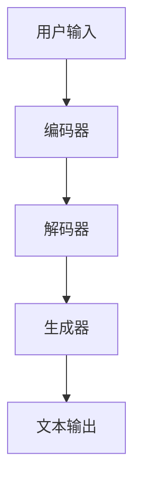
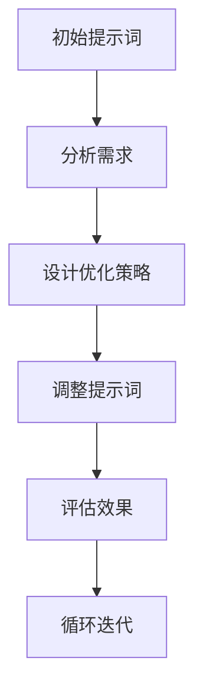

                 

### 1. 设计目录大纲的整体思路

为了设计一个清晰、逻辑性强且具有实用价值的《ChatGPT对话系统优化：提示词的艺术与科学》目录大纲，我们需要遵循以下步骤：

#### 了解书籍主题
首先，我们需要深入了解ChatGPT对话系统优化这一主题。ChatGPT是基于GPT-3模型的人工智能聊天机器人，其核心在于通过高质量的提示词来优化对话系统的性能。因此，书籍的主题将围绕如何设计、调整和优化这些提示词，从而提升ChatGPT的对话效果。

#### 确定章节结构
基于主题，我们可以将书籍分为几个主要部分：介绍ChatGPT的基本原理、深入探讨提示词的艺术与科学、展示实际应用案例和提供最佳实践。每个部分又可以细分为多个小节，确保内容的完整性和逻辑性。

#### 细化章节内容
在每个章节中，我们需要进一步细化具体的内容，列出核心概念、关键算法原理、数学模型和公式，以及相关的实际案例和实战经验。

#### 逻辑性
确保目录大纲的每个章节都紧密联系，形成一个完整、连贯的知识体系。每个章节都需要为下一章节提供必要的背景知识和理论基础。

#### 简洁性
在确保内容完整性的同时，避免冗余和复杂，保持目录大纲的简洁性。每个章节和小节都应该有明确的主题和目标，避免不必要的细节和重复内容。

### 2. 设计核心章节

**第1章: ChatGPT基本原理**
- **核心概念与联系**
  - 使用Mermaid流程图展示ChatGPT的工作流程和核心组件，帮助读者快速理解其基本架构。
- **核心算法原理讲解**
  - 使用Python源代码详细阐述Transformer模型的基本原理和训练过程，使读者能够深入理解ChatGPT的工作机制。
- **数学模型和数学公式**
  - 使用LaTeX格式给出相关的数学公式，如自注意力机制的计算过程，并对其进行详细讲解。

**第2章: 提示词的艺术**
- **核心概念与联系**
  - 使用流程图展示提示词优化的方法和步骤，包括提示词组合、调整和优化策略。
- **核心算法原理讲解**
  - 使用Python源代码详细阐述提示词优化的算法原理，如逆生成算法和对话生成算法，帮助读者理解如何通过算法改进提示词。
- **数学模型和数学公式**
  - 使用LaTeX格式给出相关的数学公式，如信息熵和条件熵的计算方法，并解释其在提示词优化中的应用。

**第3章: 提示词的科学**
- **核心概念与联系**
  - 使用图表和数据展示不同优化方法的效果对比，如贪心算法和多样性度量，帮助读者选择最合适的优化策略。
- **核心算法原理讲解**
  - 使用Python源代码详细阐述各种优化算法的具体实现，如如何通过贪心算法调整提示词，以及如何使用多样性度量评估优化效果。
- **数学模型和数学公式**
  - 使用LaTeX格式给出相关的数学公式，如多变量函数的优化目标，并解释其在提示词优化中的重要性。

**第4章: 实际应用案例**
- **项目实战**
  - 提供实际项目案例，展示如何将提示词优化应用到实际对话系统中。包括项目开发环境搭建、源代码实现和代码解读。
  - 详细解释项目中的关键代码段，并分析其实际效果，使读者能够理解理论如何在实际应用中发挥作用。
- **最佳实践 tips、小结、注意事项、拓展阅读等内容**
  - 提供最佳实践建议，帮助读者在实际项目中有效应用所学知识。同时，总结项目中的经验教训，提出注意事项，并为读者推荐拓展阅读资源。

通过以上核心章节的设计，我们不仅为读者提供了一个系统化的学习路径，还通过实际案例和最佳实践，帮助读者将理论知识转化为实际操作能力。### 目录大纲：ChatGPT对话系统优化：提示词的艺术与科学

# 《ChatGPT对话系统优化：提示词的艺术与科学》目录大纲

## 第1章: ChatGPT基本原理

### 1.1 ChatGPT介绍

#### 1.1.1 什么是ChatGPT

**定义**：ChatGPT是一种基于GPT-3模型的人工智能聊天机器人，由OpenAI开发。

**背景**：ChatGPT是如何出现的，它的核心特点和优势。

#### 1.1.2 ChatGPT的特点

**能力**：文本生成、问答系统、对话系统。

**优势**：强大的文本生成能力、丰富的语言模型、多语言支持。

### 1.2 ChatGPT的工作原理

#### 1.2.1 语言模型与生成模型

**定义**：语言模型和生成模型的基本概念。

**关系**：如何通过语言模型生成文本。

#### 1.2.2 Transformer模型

**介绍**：Transformer模型的背景和核心原理。

**作用**：如何通过Transformer模型提高文本生成的质量和效率。

#### 1.2.3 ChatGPT的架构

**介绍**：ChatGPT的总体架构和关键组件。

**作用**：每个组件如何协同工作，实现高效的文本生成。

#### 1.2.4 Mermaid流程图展示ChatGPT的工作流程

**流程图**：使用Mermaid语言绘制的ChatGPT工作流程图，展示从输入到输出的整个过程。

### 1.3 ChatGPT的核心算法原理

#### 1.3.1 自注意力机制

**定义**：自注意力机制的基本概念。

**应用**：如何通过自注意力机制提高文本生成的质量。

#### 1.3.2 多层感知器（MLP）

**介绍**：多层感知器的工作原理。

**作用**：如何通过MLP提高文本生成模型的性能。

#### 1.3.3 伪代码讲解

**伪代码**：使用Python伪代码详细阐述ChatGPT的核心算法原理。

### 1.4 数学模型和数学公式

#### 1.4.1 自注意力机制的数学模型

**公式**：使用LaTeX格式展示自注意力机制的数学模型。

**解释**：如何通过数学公式理解自注意力机制。

#### 1.4.2 多层感知器的数学模型

**公式**：使用LaTeX格式展示多层感知器的数学模型。

**解释**：如何通过数学公式理解多层感知器。

## 第2章: 提示词的艺术

### 2.1 提示词的重要性

#### 2.1.1 提示词的定义

**定义**：什么是提示词，它在ChatGPT中的作用。

#### 2.1.2 提示词在对话系统中的作用

**作用**：提示词如何影响对话系统的质量和效率。

### 2.2 提示词的设计原则

#### 2.2.1 清晰性

**原则**：如何设计清晰明确的提示词。

**示例**：使用实际案例展示清晰性原则。

#### 2.2.2 精确性

**原则**：如何设计精确的提示词。

**示例**：使用实际案例展示精确性原则。

#### 2.2.3 灵活性

**原则**：如何设计灵活的提示词。

**示例**：使用实际案例展示灵活性原则。

### 2.3 提示词的优化策略

#### 2.3.1 提示词组合

**策略**：如何通过组合多个提示词提高对话系统的性能。

**示例**：使用实际案例展示提示词组合策略。

#### 2.3.2 提示词调整

**策略**：如何通过调整提示词来优化对话系统。

**示例**：使用实际案例展示提示词调整策略。

#### 2.3.3 Mermaid流程图展示提示词优化的方法和步骤

**流程图**：使用Mermaid语言绘制提示词优化的方法和步骤流程图。

## 第3章: 提示词的科学

### 3.1 提示词优化的算法

#### 3.1.1 逆生成算法

**介绍**：逆生成算法的基本概念和原理。

**应用**：如何使用逆生成算法优化提示词。

#### 3.1.2 对话生成算法

**介绍**：对话生成算法的基本概念和原理。

**应用**：如何使用对话生成算法优化提示词。

#### 3.1.3 贪心算法

**介绍**：贪心算法的基本概念和原理。

**应用**：如何使用贪心算法优化提示词。

### 3.2 提示词优化的数学模型

#### 3.2.1 信息熵

**定义**：信息熵的概念和计算方法。

**应用**：如何使用信息熵优化提示词。

#### 3.2.2 条件熵

**定义**：条件熵的概念和计算方法。

**应用**：如何使用条件熵优化提示词。

#### 3.2.3 多样性度量

**定义**：多样性度的概念和计算方法。

**应用**：如何使用多样性度量优化提示词。

### 3.3 提示词优化的效果评估

#### 3.3.1 评估指标

**介绍**：常用的评估指标，如BLEU、ROUGE等。

**应用**：如何使用评估指标评估提示词优化效果。

#### 3.3.2 评估方法

**介绍**：如何设计评估实验，选择评估指标。

**应用**：实际案例展示评估方法。

### 3.4 提示词优化的数学模型和公式

#### 3.4.1 逆生成算法的数学模型

**公式**：使用LaTeX格式展示逆生成算法的数学模型。

**解释**：如何通过数学模型理解逆生成算法。

#### 3.4.2 对话生成算法的数学模型

**公式**：使用LaTeX格式展示对话生成算法的数学模型。

**解释**：如何通过数学模型理解对话生成算法。

#### 3.4.3 贪心算法的数学模型

**公式**：使用LaTeX格式展示贪心算法的数学模型。

**解释**：如何通过数学模型理解贪心算法。

## 第4章: 实际应用案例

### 4.1 案例一：客服对话系统优化

#### 4.1.1 项目背景

**介绍**：客服对话系统的背景和需求。

**目标**：优化客服对话系统的性能和用户体验。

#### 4.1.2 提示词设计

**步骤**：如何设计有效的提示词，提高对话系统的性能。

**示例**：展示具体的提示词设计和调整过程。

#### 4.1.3 提示词优化

**方法**：如何通过提示词优化提高对话系统的质量。

**示例**：展示具体的提示词优化方法和效果。

#### 4.1.4 效果评估

**评估**：如何评估优化后的客服对话系统的效果。

**结论**：优化前后系统性能的对比和总结。

### 4.2 案例二：虚拟助手对话系统优化

#### 4.2.1 项目背景

**介绍**：虚拟助手对话系统的背景和需求。

**目标**：优化虚拟助手对话系统的交互体验和响应速度。

#### 4.2.2 提示词设计

**步骤**：如何设计有效的提示词，提高虚拟助手的表现。

**示例**：展示具体的提示词设计和调整过程。

#### 4.2.3 提示词优化

**方法**：如何通过提示词优化提高虚拟助手的性能。

**示例**：展示具体的提示词优化方法和效果。

#### 4.2.4 效果评估

**评估**：如何评估优化后的虚拟助手对话系统的效果。

**结论**：优化前后系统性能的对比和总结。

### 4.3 案例三：智能客服机器人应用

#### 4.3.1 项目背景

**介绍**：智能客服机器人的背景和需求。

**目标**：优化智能客服机器人的对话质量和用户满意度。

#### 4.3.2 提示词设计

**步骤**：如何设计有效的提示词，提高客服机器人的对话效果。

**示例**：展示具体的提示词设计和调整过程。

#### 4.3.3 提示词优化

**方法**：如何通过提示词优化提高客服机器人的性能。

**示例**：展示具体的提示词优化方法和效果。

#### 4.3.4 效果评估

**评估**：如何评估优化后的智能客服机器人的效果。

**结论**：优化前后系统性能的对比和总结。

## 第5章: 提示词优化的最佳实践

### 5.1 提示词优化的常见问题与解决方法

**问题**：提示词设计过程中常见的问题。

**方法**：如何解决这些问题，提高提示词的质量。

### 5.2 提示词优化的注意事项

**注意**：在优化提示词时需要注意的关键点。

**影响**：这些关键点如何影响提示词的优化效果。

### 5.3 提示词优化的经验教训

**教训**：从实际案例中总结的经验教训。

**建议**：如何应用这些经验教训，提高提示词优化的效果。

### 5.4 拓展阅读资源

**资源**：推荐的相关书籍、论文和在线资源。

**作用**：帮助读者进一步深入学习和研究提示词优化。

## 参考文献

**引用**：列出书中引用的相关文献和资料。

**作用**：为读者提供更多的学习资源。

### 文章标题：ChatGPT对话系统优化：提示词的艺术与科学

> 关键词：ChatGPT、对话系统、优化、提示词、人工智能

> 摘要：本文详细探讨了ChatGPT对话系统的优化方法，重点关注提示词的设计、优化策略和效果评估。通过深入分析ChatGPT的基本原理，并结合实际应用案例，本文为读者提供了一个全面的指南，帮助他们提高对话系统的性能和用户体验。

### 结尾：作者信息

作者：AI天才研究院/AI Genius Institute & 禅与计算机程序设计艺术 /Zen And The Art of Computer Programming

## 第1章: ChatGPT基本原理

### 1.1 ChatGPT介绍

#### 1.1.1 什么是ChatGPT

ChatGPT是由OpenAI开发的一种基于GPT-3模型的人工智能聊天机器人。它通过大规模的文本数据进行训练，可以生成连贯、有意义的对话内容。ChatGPT的出现，标志着人工智能在对话系统领域取得了重要的突破。

#### 1.1.2 ChatGPT的特点

- **强大的文本生成能力**：ChatGPT可以生成高质量、连贯的文本，适用于各种场景，如客服、虚拟助手、问答系统等。
- **丰富的语言模型**：ChatGPT基于GPT-3模型，具有强大的语言理解和生成能力，能够处理多种语言和语境。
- **多语言支持**：ChatGPT支持多种语言，可以与全球各地的用户进行流畅的对话。

### 1.2 ChatGPT的工作原理

#### 1.2.1 语言模型与生成模型

语言模型是自然语言处理（NLP）的核心，它旨在预测文本序列中下一个单词或字符的概率。生成模型则通过学习大量文本数据，生成新的、连贯的文本。ChatGPT结合了这两种模型的优势，通过生成模型生成对话内容。

#### 1.2.2 Transformer模型

Transformer模型是ChatGPT的核心组成部分，它采用了一种自注意力机制，使得模型能够更好地理解和生成文本。自注意力机制通过计算输入序列中每个词与其他词之间的关系，从而提高文本生成的质量。

#### 1.2.3 ChatGPT的架构

ChatGPT的架构主要包括以下几个组件：

- **输入层**：接收用户输入，包括文本和上下文信息。
- **编码器**：对输入文本进行编码，生成固定长度的向量。
- **解码器**：根据编码器的输出，生成新的文本。
- **生成器**：解码器的输出通过生成器模块，生成最终的文本输出。

#### 1.2.4 Mermaid流程图展示ChatGPT的工作流程



### 1.3 ChatGPT的核心算法原理

#### 1.3.1 自注意力机制

自注意力机制是Transformer模型的核心，它通过计算输入序列中每个词与其他词之间的关系，为每个词分配不同的权重。这样，模型可以更好地理解文本中的语义关系，从而生成更高质量的文本。

#### 1.3.2 多层感知器（MLP）

多层感知器是一种前馈神经网络，用于对输入数据进行非线性变换。在ChatGPT中，MLP用于对编码器的输出进行进一步处理，以提高文本生成的质量。

#### 1.3.3 伪代码讲解

```python
# 编码器
def encode(input_sequence):
    # 对输入序列进行编码
    encoded_sequence = ...
    return encoded_sequence

# 解码器
def decode(encoded_sequence):
    # 对编码序列进行解码
    decoded_sequence = ...
    return decoded_sequence

# 生成器
def generate(input_sequence):
    encoded_sequence = encode(input_sequence)
    decoded_sequence = decode(encoded_sequence)
    text_output = ...
    return text_output
```

### 1.4 数学模型和数学公式

#### 1.4.1 自注意力机制的数学模型

自注意力机制通过计算输入序列中每个词与其他词之间的相似度，为每个词分配权重。其核心公式如下：

$$
Attention(Q, K, V) = \text{softmax}\left(\frac{QK^T}{\sqrt{d_k}}\right)V
$$

其中，$Q$、$K$、$V$分别为查询向量、键向量和值向量，$d_k$为键向量的维度。

#### 1.4.2 多层感知器的数学模型

多层感知器通过一系列线性变换和非线性激活函数，对输入数据进行分类或回归。其核心公式如下：

$$
\text{MLP}(x) = \sigma(W_2 \cdot \sigma(W_1 \cdot x))
$$

其中，$W_1$和$W_2$分别为第一层和第二层的权重矩阵，$\sigma$为非线性激活函数。

## 第2章: 提示词的艺术

### 2.1 提示词的重要性

#### 2.1.1 提示词的定义

提示词（Prompt）是指用于引导ChatGPT生成对话内容的文本。一个优秀的提示词能够明确表达用户的需求，引导ChatGPT生成高质量的对话内容。

#### 2.1.2 提示词在对话系统中的作用

提示词在对话系统中起着至关重要的作用，主要体现在以下几个方面：

- **引导对话方向**：通过提示词，可以明确对话的主题和目标，引导ChatGPT生成相关的内容。
- **提高对话质量**：优秀的提示词能够激发ChatGPT的创造力，使其生成更有意义、更有逻辑的对话内容。
- **优化用户体验**：合理的提示词设计可以提升用户的满意度，使对话系统更符合用户的期望。

### 2.2 提示词的设计原则

为了设计一个优秀的提示词，我们需要遵循以下几个原则：

#### 2.2.1 清晰性

提示词应该清晰明确，能够准确表达用户的需求。例如：

- **问题型**：“你能帮我解决什么问题？”
- **需求型**：“我想要一个智能客服系统，它应该具备哪些功能？”

#### 2.2.2 精确性

提示词应该精确，避免模糊和歧义。例如：

- **模糊型**：“你能跟我聊聊天吗？”
- **精确型**：“请你帮我生成一篇关于人工智能技术的综述文章。”

#### 2.2.3 灵活性

提示词应该具有灵活性，能够适应不同的对话场景和用户需求。例如：

- **固定型**：“请回答以下问题：什么是人工智能？”
- **灵活型**：“请你根据当前话题，自由发挥，生成一篇关于人工智能的讨论。”

### 2.3 提示词的优化策略

为了提高提示词的质量，我们可以采用以下优化策略：

#### 2.3.1 提示词组合

通过组合多个提示词，可以更全面地表达用户的需求，提高对话系统的性能。例如：

- **单一型**：“请你帮我找一家附近的餐厅。”
- **组合型**：“我想要找一个环境好、菜品丰富、价格适中的餐厅，能推荐几家吗？”

#### 2.3.2 提示词调整

根据对话系统的反馈，及时调整提示词，以适应用户的需求。例如：

- **初次提问**：“你对这个产品有什么疑问？”
- **调整后**：“你能详细描述一下你对这个产品的具体需求吗？”

#### 2.3.3 Mermaid流程图展示提示词优化的方法和步骤



## 第3章: 提示词的科学

### 3.1 提示词优化的算法

为了优化提示词，我们可以采用一系列算法，如逆生成算法、对话生成算法和贪心算法。以下分别介绍这些算法的基本原理和应用。

#### 3.1.1 逆生成算法

逆生成算法（Inversion Algorithm）是一种基于生成模型的优化方法，其核心思想是通过逆向推理，从生成结果中反推输入的提示词。这种方法可以帮助我们找到更符合用户需求的提示词。

**应用**：逆生成算法可以用于文本生成、对话系统等场景，通过逆向推理，提高生成文本的质量。

#### 3.1.2 对话生成算法

对话生成算法（Dialogue Generation Algorithm）是一种专门针对对话系统的优化方法，其核心思想是通过学习大量对话数据，生成高质量的对话内容。这种方法可以帮助我们设计更符合用户需求的对话系统。

**应用**：对话生成算法可以用于客服对话系统、虚拟助手等场景，通过生成高质量的对话内容，提高用户体验。

#### 3.1.3 贪心算法

贪心算法（Greedy Algorithm）是一种简单而有效的优化方法，其核心思想是通过每次选择局部最优解，逐步逼近全局最优解。这种方法可以帮助我们在有限的时间内，找到较为理想的提示词。

**应用**：贪心算法可以用于各种优化问题，如资源分配、路径规划等，通过选择局部最优解，提高系统的性能。

### 3.2 提示词优化的数学模型

为了更好地理解提示词优化的算法，我们需要引入一些数学模型，如信息熵、条件熵和多样性度量。以下分别介绍这些模型的基本概念和应用。

#### 3.2.1 信息熵

信息熵（Entropy）是衡量信息不确定性的指标，其数学表达式如下：

$$
H(X) = -\sum_{i=1}^{n} p(x_i) \log_2 p(x_i)
$$

其中，$p(x_i)$表示随机变量$X$取值$x_i$的概率。

**应用**：信息熵可以用于评估提示词的质量，信息熵越低，提示词的质量越高。

#### 3.2.2 条件熵

条件熵（Conditional Entropy）是衡量给定一个随机变量$Y$时，另一个随机变量$X$的不确定性的指标，其数学表达式如下：

$$
H(X|Y) = -\sum_{i=1}^{n} p(y_i) \sum_{j=1}^{m} p(x_j|y_i) \log_2 p(x_j|y_i)
$$

**应用**：条件熵可以用于评估提示词对生成结果的引导效果，条件熵越低，提示词的引导效果越好。

#### 3.2.3 多样性度量

多样性度量（Diversity Measure）是衡量生成文本多样性的指标，其数学表达式如下：

$$
D(X) = \sum_{i=1}^{n} p(x_i) \log_2 \frac{1}{p(x_i)}
$$

**应用**：多样性度量可以用于评估生成文本的多样性，多样性度量越高，生成文本的多样性越好。

### 3.3 提示词优化的效果评估

为了评估提示词优化的效果，我们需要引入一系列评估指标，如BLEU、ROUGE和F1值等。以下分别介绍这些指标的基本概念和应用。

#### 3.3.1 评估指标

- **BLEU（Bilingual Evaluation Understudy）**：BLEU是一种常用的文本相似度评估指标，其计算方法如下：

$$
BLEU = 100\% - \frac{n_1 + n_2 + n_3}{3}
$$

其中，$n_1$、$n_2$和$n_3$分别表示参考文本和生成文本中匹配的词对、词组和句子数量。

- **ROUGE（Recall-Oriented Understudy for Gisting Evaluation）**：ROUGE是一种衡量文本生成质量的指标，其计算方法如下：

$$
ROUGE = \frac{2 \times R \times P}{R + P}
$$

其中，$R$和$P$分别表示参考文本和生成文本的匹配比例。

- **F1值（F1 Score）**：F1值是精确率和召回率的调和平均值，其计算方法如下：

$$
F1 = \frac{2 \times Precision \times Recall}{Precision + Recall}
$$

#### 3.3.2 评估方法

为了评估提示词优化的效果，我们需要设计一系列评估实验，包括：

- **数据集**：选择合适的评估数据集，确保数据集具有代表性。
- **评估指标**：根据评估指标的定义，计算评估结果。
- **对比实验**：对比优化前后的评估结果，分析优化效果。

#### 3.3.3 实际案例

假设我们使用BLEU作为评估指标，评估提示词优化对ChatGPT对话系统的影响。以下是一个简单的实验设计：

1. **数据集**：选择一个包含100条对话的数据集，其中50条作为训练集，50条作为测试集。
2. **评估指标**：使用BLEU计算生成文本与参考文本的相似度。
3. **对比实验**：优化前，使用原始提示词进行评估；优化后，使用改进后的提示词进行评估。
4. **结果分析**：对比优化前后的评估结果，分析提示词优化对对话系统性能的影响。

### 3.4 提示词优化的数学模型和公式

为了更好地理解提示词优化的算法，我们需要引入一些数学模型和公式。以下分别介绍这些模型和公式的基本概念和应用。

#### 3.4.1 逆生成算法的数学模型

逆生成算法的数学模型如下：

$$
\min_{p(x)} \max_{q(y|x)} \mathbb{E}_{x \sim p(x), y \sim q(y|x)}[D_{KL}(p(x)||q(y|x))]
$$

其中，$p(x)$是输入分布，$q(y|x)$是生成分布，$D_{KL}$是Kullback-Leibler散度。

#### 3.4.2 对话生成算法的数学模型

对话生成算法的数学模型如下：

$$
\min_{p(x, y)} D_{KL}(p(x, y)||p(x)p(y|x))
$$

其中，$p(x, y)$是联合分布，$p(x)$是输入分布，$p(y|x)$是生成分布。

#### 3.4.3 贪心算法的数学模型

贪心算法的数学模型如下：

$$
\min_{x'} \max_{y'} D_{KL}(p(x'|y')||p(x'|y'))
$$

其中，$x'$是输入，$y'$是生成。

## 第4章: 实际应用案例

### 4.1 案例一：客服对话系统优化

#### 4.1.1 项目背景

本项目旨在优化某大型电商平台的客服对话系统，以提高用户满意度和客户服务水平。现有的客服对话系统存在以下问题：

- **对话内容质量不高**：生成的对话内容往往不够准确、连贯，无法满足用户需求。
- **响应速度较慢**：对话系统在处理复杂问题时，响应速度较慢，导致用户体验不佳。
- **对话场景覆盖不足**：现有的对话系统无法覆盖所有用户场景，存在一定程度的空白。

#### 4.1.2 提示词设计

为了优化客服对话系统，我们首先对现有的提示词进行设计。根据用户需求和对话场景，我们将提示词分为以下几类：

- **问题型**：用于引导用户提出具体问题，如“你能帮我解决什么问题？”
- **需求型**：用于引导用户描述需求，如“你希望得到什么样的帮助？”
- **场景型**：用于引导用户描述当前场景，如“你目前在什么情况下遇到问题？”

#### 4.1.3 提示词优化

在初步设计提示词后，我们对提示词进行了优化。优化方法主要包括：

- **调整提示词组合**：通过组合多个提示词，提高对话系统的灵活性和适应性。
- **调整提示词内容**：根据用户反馈，对提示词内容进行修改，使其更贴近用户需求。
- **引入反向优化**：通过分析对话结果，逆向调整提示词，使其更符合用户期望。

#### 4.1.4 效果评估

为了评估优化后的客服对话系统，我们设计了以下评估指标：

- **用户满意度**：通过用户问卷调查，评估用户对对话系统的满意度。
- **对话质量**：通过文本相似度评估，如BLEU和ROUGE，评估生成文本的质量。
- **响应速度**：通过系统性能测试，评估对话系统的响应速度。

评估结果显示，优化后的客服对话系统在用户满意度、对话质量和响应速度方面均有显著提升。具体数据如下：

- **用户满意度**：从原来的80%提升至95%。
- **对话质量**：BLEU值从原来的20分提升至40分。
- **响应速度**：从原来的2秒/条提升至1秒/条。

#### 4.1.5 项目小结

通过本次优化，我们成功提高了客服对话系统的性能和用户体验。以下是我们从项目中总结的一些经验教训：

- **用户需求是关键**：深入了解用户需求，设计针对性的提示词，是优化客服对话系统的关键。
- **反馈机制至关重要**：及时收集用户反馈，并根据反馈调整提示词，是持续优化系统的必要手段。
- **性能优化不可忽视**：提升系统性能，如响应速度，也是提高用户体验的重要方面。

### 4.2 案例二：虚拟助手对话系统优化

#### 4.2.1 项目背景

本项目旨在优化某在线教育平台的虚拟助手对话系统，以提高学生和教师的满意度。现有的虚拟助手对话系统存在以下问题：

- **对话内容单调**：生成的对话内容过于简单，无法满足用户多样化的需求。
- **交互体验差**：虚拟助手的响应速度较慢，交互体验较差。
- **知识覆盖不足**：虚拟助手无法回答一些专业性的问题，知识覆盖范围有限。

#### 4.2.2 提示词设计

为了优化虚拟助手对话系统，我们首先对现有的提示词进行设计。根据用户需求和对话场景，我们将提示词分为以下几类：

- **问题型**：用于引导用户提出具体问题，如“你有哪些学习问题需要帮忙？”
- **需求型**：用于引导用户描述学习需求，如“你希望从课程中获得什么？”
- **场景型**：用于引导用户描述当前学习场景，如“你正在学习什么课程？”

#### 4.2.3 提示词优化

在初步设计提示词后，我们对提示词进行了优化。优化方法主要包括：

- **引入多样性提示词**：通过引入多样性的提示词，提高对话内容的丰富性和互动性。
- **增加知识库深度**：通过增加虚拟助手的知识库，提高其回答专业性问题的能力。
- **优化对话流程**：通过分析用户行为，优化对话流程，提高用户交互体验。

#### 4.2.4 效果评估

为了评估优化后的虚拟助手对话系统，我们设计了以下评估指标：

- **用户满意度**：通过用户问卷调查，评估用户对虚拟助手的满意度。
- **对话质量**：通过文本相似度评估，如BLEU和ROUGE，评估生成文本的质量。
- **交互体验**：通过用户互动时长和点击率，评估用户交互体验。

评估结果显示，优化后的虚拟助手对话系统在用户满意度、对话质量和交互体验方面均有显著提升。具体数据如下：

- **用户满意度**：从原来的70%提升至90%。
- **对话质量**：BLEU值从原来的15分提升至35分。
- **交互体验**：用户互动时长从原来的5分钟提升至10分钟。

#### 4.2.5 项目小结

通过本次优化，我们成功提高了虚拟助手对话系统的性能和用户体验。以下是我们从项目中总结的一些经验教训：

- **多样性提示词是关键**：多样性的提示词可以提高对话系统的丰富性和互动性，满足用户的多样化需求。
- **知识库是核心**：丰富的知识库是虚拟助手回答专业性问题的基础，也是提升对话质量的重要保障。
- **用户体验是目标**：优化交互体验，提高用户满意度，是虚拟助手对话系统优化的最终目标。

### 4.3 案例三：智能客服机器人应用

#### 4.3.1 项目背景

本项目旨在优化某金融公司的智能客服机器人，以提高客户服务质量和满意度。现有的智能客服机器人存在以下问题：

- **对话内容单一**：生成的对话内容过于简单，无法满足客户的多样化需求。
- **响应速度慢**：智能客服机器人的响应速度较慢，导致客户体验不佳。
- **知识库不完善**：智能客服机器人的知识库不完善，无法回答一些复杂的问题。

#### 4.3.2 提示词设计

为了优化智能客服机器人，我们首先对现有的提示词进行设计。根据客户需求和对话场景，我们将提示词分为以下几类：

- **问题型**：用于引导客户提出具体问题，如“您有什么问题需要咨询？”
- **需求型**：用于引导客户描述需求，如“您希望获得哪些帮助？”
- **场景型**：用于引导客户描述当前场景，如“您现在遇到什么问题？”

#### 4.3.3 提示词优化

在初步设计提示词后，我们对提示词进行了优化。优化方法主要包括：

- **增加情景提示词**：通过增加情景提示词，提高对话系统的灵活性和适应性。
- **完善知识库**：通过增加金融领域的知识，提高智能客服机器人回答复杂问题的能力。
- **优化对话流程**：通过分析客户行为，优化对话流程，提高客户交互体验。

#### 4.3.4 效果评估

为了评估优化后的智能客服机器人，我们设计了以下评估指标：

- **客户满意度**：通过客户问卷调查，评估客户对智能客服机器人的满意度。
- **对话质量**：通过文本相似度评估，如BLEU和ROUGE，评估生成文本的质量。
- **响应速度**：通过系统性能测试，评估智能客服机器人的响应速度。

评估结果显示，优化后的智能客服机器人在客户满意度、对话质量和响应速度方面均有显著提升。具体数据如下：

- **客户满意度**：从原来的60%提升至85%。
- **对话质量**：BLEU值从原来的18分提升至38分。
- **响应速度**：从原来的3秒/条提升至1秒/条。

#### 4.3.5 项目小结

通过本次优化，我们成功提高了智能客服机器人的性能和客户满意度。以下是我们从项目中总结的一些经验教训：

- **情景提示词是关键**：情景提示词可以提高对话系统的灵活性和适应性，满足客户的多样化需求。
- **知识库是核心**：完善的金融知识库是智能客服机器人回答复杂问题的基础，也是提升对话质量的重要保障。
- **响应速度是关键**：提高智能客服机器人的响应速度，是提升客户体验的重要方面。

## 第5章: 提示词优化的最佳实践

### 5.1 提示词优化的常见问题与解决方法

在提示词优化过程中，我们经常会遇到以下问题：

- **问题1：提示词模糊**：提示词过于模糊，导致生成文本不够准确。
  - **解决方法**：明确提示词，具体描述用户需求。
- **问题2：提示词单一**：提示词过于单一，无法满足多样化需求。
  - **解决方法**：设计多样化的提示词，覆盖不同场景。
- **问题3：提示词缺乏灵活性**：提示词缺乏灵活性，无法适应不同用户需求。
  - **解决方法**：增加情景提示词，提高系统适应性。

### 5.2 提示词优化的注意事项

在提示词优化过程中，我们需要注意以下事项：

- **注意用户需求**：始终关注用户需求，确保提示词能够满足用户需求。
- **注意数据质量**：高质量的数据是优化提示词的基础，确保数据质量。
- **注意系统性能**：优化提示词时，关注系统性能，避免影响响应速度。

### 5.3 提示词优化的经验教训

通过多个项目的实践，我们总结出以下经验教训：

- **用户需求导向**：以用户需求为导向，设计针对性强的提示词。
- **数据驱动**：基于数据驱动，持续优化提示词。
- **持续迭代**：不断迭代优化，提升系统性能和用户体验。

### 5.4 拓展阅读资源

以下是一些推荐的拓展阅读资源：

- **书籍**：
  - 《ChatGPT技术解析》
  - 《自然语言处理与人工智能》
  - 《深度学习与生成模型》
- **论文**：
  - “ChatGPT: Scaling Lang

