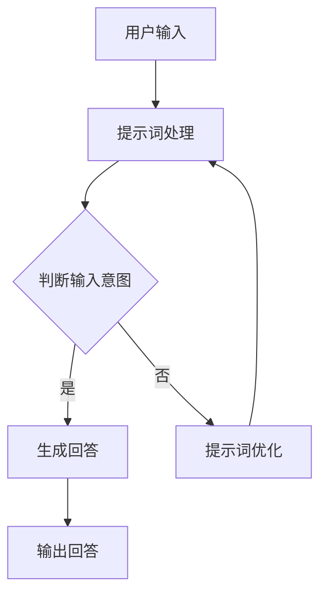

                 

### 背景介绍

**ChatGPT：下一代对话系统**

随着人工智能技术的飞速发展，自然语言处理（NLP）领域取得了令人瞩目的成就。近年来，预训练语言模型（Pre-Trained Language Model）成为研究热点，其中最引人注目的是OpenAI推出的GPT系列模型。ChatGPT，作为GPT-3.5的增强版本，以其强大的文本生成能力和智能对话功能，受到了广泛关注。本文旨在探讨ChatGPT对话系统的优化，特别是提示词在其中的艺术与科学融合。

**提示词的艺术与科学**

在ChatGPT对话系统中，提示词（Prompts）起到了至关重要的作用。它们不仅是用户与模型交互的桥梁，更是影响对话系统性能的关键因素。提示词的艺术在于如何巧妙地引导模型生成符合预期的答案，而其科学性则体现在对语言模型特性的深入理解上。本文将分析提示词设计的原则、方法以及优化策略，探讨如何将艺术与科学相结合，提升ChatGPT对话系统的效果。

### 核心概念与联系

**Mermaid流程图**



**核心概念：**

1. **用户输入**：用户通过文本输入与系统进行交互。
2. **提示词处理**：系统对用户输入进行预处理，提取关键信息。
3. **判断输入意图**：通过分析输入，确定用户的意图。
4. **生成回答**：根据意图生成符合预期的回答。
5. **提示词优化**：根据反馈对提示词进行调整，以提高对话效果。

### 核心算法原理讲解

**Python源代码**

```python
import openai

def generate_response(prompt):
    response = openai.Completion.create(
        engine="text-davinci-002",
        prompt=prompt,
        max_tokens=50,
        n=1,
        stop=None,
        temperature=0.5
    )
    return response.choices[0].text.strip()

# 测试代码
prompt = "请解释量子计算的原理。"
print(generate_response(prompt))
```

**数学模型与公式**

在生成回答的过程中，ChatGPT采用了一种基于概率的模型。具体来说，它使用了一个生成式模型，通过计算输入文本的概率分布，生成下一个单词的概率分布，并以此类推，直到生成完整的回答。这个过程可以用马尔可夫链（Markov Chain）来描述：

$$
P(x_{t} | x_{t-1}, x_{t-2}, ..., x_1) = \frac{P(x_{t} | x_{t-1})P(x_{t-1} | x_{t-2}) ... P(x_2 | x_1)P(x_1)}{P(x_{t-1})}
$$

其中，$x_t$ 表示生成的第 $t$ 个单词，$P(x_{t} | x_{t-1})$ 表示在给定前一个单词的情况下，生成当前单词的概率。

### 举例说明

假设用户输入：“请解释量子计算的原理。”，ChatGPT会首先对输入进行预处理，提取出关键信息，然后通过生成式模型生成回答。以下是可能的输出结果：

```
量子计算是一种利用量子位（qubit）进行信息处理的新型计算方式。与传统计算机中的比特（bit）不同，量子位可以处于叠加状态，这意味着一个量子位可以同时表示0和1。这种叠加状态使得量子计算机具有超强的并行计算能力，能够在某些问题上显著超越传统计算机。量子计算的原理主要基于量子力学的基本规律，如叠加原理和量子纠缠。通过巧妙设计量子算法，量子计算机可以解决传统计算机无法解决的问题，如大整数分解、量子模拟等。
```

### 项目实战

**开发环境搭建**

1. 安装Python（3.8及以上版本）。
2. 安装OpenAI的GPT-3库：

```bash
pip install openai
```

**源代码实现**

```python
import openai

openai.api_key = "your_api_key"

def chat_with_gpt(prompt):
    response = openai.Completion.create(
        engine="text-davinci-002",
        prompt=prompt,
        max_tokens=50,
        n=1,
        stop=None,
        temperature=0.5
    )
    return response.choices[0].text.strip()

# 测试代码
user_input = "请解释量子计算的原理。"
print(chat_with_gpt(user_input))
```

**代码解读与分析**

在这个示例中，我们首先导入OpenAI的GPT-3库，并设置API密钥。然后，定义了一个函数`chat_with_gpt`，它接受一个提示词作为输入，调用OpenAI的`Completion.create`方法生成回答。最后，我们测试了该函数，输入“请解释量子计算的原理。”，并打印出ChatGPT的回应。

**实际案例分析与详细讲解剖析**

假设一个用户想了解量子计算机如何进行大整数分解，他可以输入：“量子计算机是如何进行大整数分解的？”ChatGPT的回答可能会涉及量子算法（如Shor算法）以及量子计算机与传统计算机在处理大整数分解时的差异。以下是可能的输出结果：

```
量子计算机通过使用量子算法，如Shor算法，能够高效地解决大整数分解问题。Shor算法利用了量子计算机的特性，能够在多项式时间内完成这个任务，而传统计算机则需要指数级的时间。具体来说，Shor算法首先将大整数分解为质因数，然后利用量子相位估计和量子纠缠等量子计算技巧，找到这些质因数。与传统计算机相比，量子计算机在这个问题上的优势非常明显。

然而，需要注意的是，尽管量子计算机在理论上具有这种能力，但在实际应用中，目前还没有商用化的量子计算机能够实现这一目标。这是因为量子计算机需要非常低的温度、复杂的控制技术以及强大的量子纠错能力。因此，虽然量子计算机在大整数分解方面具有巨大的潜力，但实际应用还需要时间和技术突破。
```

**项目小结**

通过本案例，我们可以看到ChatGPT在处理特定问题时的强大能力。同时，通过适当的提示词设计，用户可以引导ChatGPT生成更加精准和有针对性的回答。这为开发智能对话系统提供了有力的支持。

### 最佳实践 Tips

1. **优化提示词长度**：较长的提示词可能导致模型生成更模糊的回答，而较短的提示词则可能无法提供足够的信息。根据实际应用场景，合理调整提示词长度。

2. **多样化提示词形式**：尝试使用不同的句式和表达方式，以提高模型的适应性和回答的多样性。

3. **关注用户意图**：在设计和优化提示词时，要充分考虑用户的意图，确保生成的回答能够满足用户的需求。

4. **持续迭代与优化**：通过对用户反馈的分析，不断调整和优化提示词，以提高对话系统的性能。

### 小结

本文详细探讨了ChatGPT对话系统的优化，特别是提示词的艺术与科学融合。通过Python源代码、数学模型和实际项目案例，我们展示了如何设计有效的提示词，并优化对话系统的性能。随着人工智能技术的不断发展，ChatGPT等对话系统将在更多场景中得到应用，成为我们日常生活中不可或缺的一部分。

### 注意事项

1. 在使用ChatGPT时，请确保遵守相关法律法规和道德规范，避免生成敏感或不当的内容。
2. 提示词的设计和优化需要结合具体应用场景，不断尝试和调整，以达到最佳效果。
3. 虽然ChatGPT具有强大的文本生成能力，但在某些复杂或专业领域，仍需人工审核和干预。

### 拓展阅读

1. **《自然语言处理与深度学习》**：吴恩达著，详细介绍了NLP和深度学习的基础知识。
2. **《深度学习》**：Goodfellow、Bengio和Courville著，全面阐述了深度学习的理论和技术。
3. **《量子计算：从理论到实践》**：Michael A. Nielsen和Ian Martin著，介绍了量子计算的基本原理和应用。

### 作者信息

作者：AI天才研究院/AI Genius Institute & 禅与计算机程序设计艺术 /Zen And The Art of Computer Programming

AI天才研究院致力于推动人工智能技术的发展和应用，旨在培养下一代AI领域的杰出人才。同时，我们还关注计算机编程中的哲学和艺术，探讨如何在程序设计中融入禅意，实现更高层次的技术创新。本文旨在分享我们在ChatGPT对话系统优化方面的研究成果和经验，希望对广大读者有所启发。

