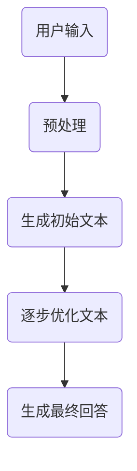

                 

### 背景介绍

《ChatGPT对话质量提升：提示词的关键作用》这本书旨在探讨如何通过优化提示词来提高ChatGPT对话系统的质量。随着人工智能技术的不断进步，自然语言处理（NLP）领域取得了显著的成果，ChatGPT等大型语言模型的出现更是让对话系统成为可能。然而，尽管这些模型在生成对话方面表现出色，但对话质量仍然存在诸多挑战，如回答的准确性、连贯性、多样性和人性化等方面。为了解决这些问题，优化提示词成为了一种有效的方法。

提示词在ChatGPT对话系统中起着至关重要的作用。提示词，即提供给模型的一段文本输入，决定了模型生成的对话内容和质量。一个高质量的提示词不仅能引导模型生成准确、连贯的对话，还能提高对话的趣味性和人性化程度。因此，深入研究提示词的设计与优化，对于提升ChatGPT对话系统的整体性能具有重要意义。

本文将分以下几个部分展开讨论：

1. **ChatGPT基础**：介绍ChatGPT的背景、工作原理和核心算法。
2. **提示词的概念与类型**：探讨提示词的定义、类型及其在对话系统中的作用。
3. **提升对话质量的方法**：详细分析如何通过优化提示词来提高对话质量，包括提示词长度、多样性和编写技巧等方面。
4. **实际应用案例**：通过具体案例展示如何在实际项目中应用提示词优化方法。
5. **总结与展望**：总结全文内容，并对未来发展趋势进行展望。

通过以上内容的逐步解析，我们希望能帮助读者深入理解ChatGPT对话系统的工作原理，掌握提示词优化技巧，从而提升对话系统的整体质量。

### ChatGPT基础

ChatGPT是基于OpenAI开发的一个人工智能语言模型，其全称是“Chat-based Generative Pre-trained Transformer”。ChatGPT采用了先进的Transformer模型架构，通过自我关注机制（self-attention）实现了对输入文本的深层理解和生成。以下是ChatGPT的一些关键组成部分及其工作原理。

#### 背景与原理

ChatGPT的出现源于自然语言处理（NLP）领域的研究进展。早期的语言模型如基于n-gram的模型和基于神经网络的模型，虽然在某些方面取得了进展，但难以捕捉到文本中的长距离依赖关系。随着Transformer模型的提出，自然语言处理领域迎来了新的突破。Transformer模型通过自我关注机制，能够同时考虑输入文本中所有位置的信息，从而提高了模型的性能。

ChatGPT采用了这种Transformer模型，并在此基础上进行了优化和扩展。首先，ChatGPT使用了大量的文本数据进行了预训练，从而学会了基本的语言结构和语义理解。预训练完成后，ChatGPT通过特定的任务进行微调，使其在特定领域或任务上表现出色。

#### 工作流程

ChatGPT的工作流程可以分为以下几个阶段：

1. **输入处理**：用户输入一段文本，ChatGPT首先对这段文本进行预处理，包括分词、去停用词等操作，然后将文本转换为模型能够理解的向量表示。

2. **对话生成**：预处理后的文本向量被输入到ChatGPT模型中，模型根据自我关注机制生成一个文本序列。这个过程包括两个主要步骤：生成初始文本和逐步优化文本。

   - **生成初始文本**：模型从输入的文本中生成一个初步的文本序列，这个序列可能包含一些语法错误或不准确的地方。
   - **逐步优化文本**：模型根据生成的初始文本，通过迭代优化生成更准确的文本。这个过程涉及到模型对生成的文本进行评价和调整，直到达到满意的生成结果。

3. **优化与反馈**：生成的对话文本会被用户评估，如果用户对生成的文本不满意，可以将反馈信息返回给模型，模型根据这些反馈信息进行进一步的优化。

#### 核心算法

ChatGPT的核心算法基于Transformer模型，这是一种基于自注意力机制的深度神经网络模型。Transformer模型的主要组成部分包括：

1. **多头自注意力机制**：多头自注意力机制允许模型在生成文本时同时考虑输入文本中所有位置的信息，从而捕捉到文本中的长距离依赖关系。

2. **位置编码**：位置编码用于将文本中的位置信息编码到向量中，使得模型能够理解文本中各个词的位置关系。

3. **前馈神经网络**：前馈神经网络用于对自注意力层输出的文本向量进行进一步的变换和调整。

以下是ChatGPT的核心算法的伪代码示意：

```python
# 调用ChatGPT模型生成文本
def generate_text(prompt):
    # 预处理输入文本
    processed_prompt = preprocess_text(prompt)

    # 初始化文本向量
    text_vector = encode_text(processed_prompt)

    # 生成初始文本
    initial_text = generate_initial_text(text_vector)

    # 逐步优化文本
    optimized_text = optimize_text(initial_text, text_vector)

    return optimized_text

# 优化文本
def optimize_text(text, text_vector):
    while not is_satisfied(text):
        # 计算自注意力权重
        attention_weights = calculate_attention_weights(text_vector)

        # 根据权重更新文本
        updated_text = update_text(text, attention_weights)

        # 更新文本向量
        text_vector = encode_text(updated_text)

    return updated_text
```

通过以上对ChatGPT基础部分的介绍，我们可以看到ChatGPT在自然语言处理领域的重要性和其复杂的工作原理。接下来，我们将深入探讨提示词的概念与类型，并分析如何通过优化提示词来提升ChatGPT对话系统的质量。

### 提示词的概念与类型

在ChatGPT对话系统中，提示词（Prompt）是用户输入或系统预设的一段文本，它对模型生成对话的内容和风格起着至关重要的作用。一个高质量的提示词能够引导ChatGPT生成连贯、准确、有趣且人性化的对话。以下是关于提示词的概念、类型及其在对话系统中的作用的分析。

#### 提示词的定义与作用

提示词，顾名思义，就是用来“提示”或“引导”模型生成对话的文本。它可以是一个简短的句子、一个问题、一个任务指令，甚至是一段完整的对话开头。提示词的作用主要体现在以下几个方面：

1. **引导对话方向**：通过提供具体的上下文信息，提示词可以帮助模型明确对话的主题和方向，从而生成更有针对性的回答。
2. **提高回答质量**：一个精确且详细的提示词可以帮助模型生成更准确、更符合用户需求的回答。
3. **增加对话趣味性**：恰当的提示词可以引导模型生成幽默、风趣的对话，提高用户的使用体验。

#### 提示词的类型与特点

提示词可以根据其内容和用途进行分类，常见的类型包括：

1. **通用提示词**：
   - **问题型提示词**：如“你能帮我解决什么问题？”或“你有什么建议？”这类提示词通常用于引导用户提出具体问题，从而生成有针对性的回答。
   - **任务型提示词**：如“请给我写一段关于XX的介绍”或“请你扮演一个医生，回答用户关于健康的问题”。这类提示词用于指定具体的任务或角色，让模型生成相应的对话内容。
   - **情境型提示词**：如“假设你是一名旅游顾问，现在有一个游客询问去XX景点的最佳路线”，这类提示词通过构建特定的情境，引导模型生成符合情境的对话。

2. **行业特定提示词**：
   - **专业术语提示词**：如“请解释一下区块链的基本原理”或“描述一下量子计算的工作原理”。这类提示词针对特定领域，引导模型生成专业术语和知识点的解释。
   - **案例型提示词**：如“请举一个医疗领域的实际案例”或“分享一个你参与过的项目管理经验”。这类提示词用于引导模型生成具体案例的分析和讨论。
   - **模拟对话提示词**：如“模拟一场面试，你是一名项目经理，面试官询问你的项目管理经验”，这类提示词通过模拟真实的对话场景，引导模型生成更贴近实际场景的对话。

每种类型的提示词都有其独特的特点和适用场景，正确选择和使用提示词对于提升对话质量至关重要。

#### 提示词在对话系统中的作用

提示词在对话系统中的作用主要体现在以下几个方面：

1. **明确对话目标**：通过提供具体的提示词，用户或系统可以明确对话的目标和预期结果，从而更好地引导模型生成高质量的对话。
2. **优化对话体验**：合适的提示词可以提高对话的连贯性和趣味性，使用户感受到更人性化的交互体验。
3. **辅助模型学习**：高质量的提示词可以为模型提供丰富的上下文信息，帮助模型更好地学习和理解语言结构和语义，从而提升其生成对话的能力。

综上所述，提示词在ChatGPT对话系统中具有重要作用。了解和掌握不同类型提示词的特点和适用场景，对于提升对话系统的整体性能具有重要意义。接下来，我们将详细探讨如何通过优化提示词来提升ChatGPT对话系统的质量。

### 提升对话质量的方法

要提升ChatGPT对话系统的质量，优化提示词是一个关键步骤。以下将详细分析提示词的长度、多样性以及编写技巧，并探讨如何通过这些方面来提高对话的准确性、连贯性和人性化程度。

#### 提示词的长度

提示词的长度对对话质量有着显著影响。过长的提示词可能导致模型无法充分理解用户意图，而过短的提示词可能提供的信息不足，影响模型的生成效果。研究表明，适当的提示词长度通常在数十个单词到数百个单词之间。以下是一些关于提示词长度优化的方法：

1. **适度增加提示词长度**：适当地增加提示词的长度可以帮助模型更好地理解用户意图。例如，将“请给我推荐一家餐厅”扩展为“请推荐一家在市中心，适合家庭聚餐，价格在中等水平，有良好评价的餐厅”。这样，模型可以捕捉到更多的上下文信息，从而生成更准确和详细的回答。

2. **避免过长提示词**：过长的提示词不仅会使得模型处理起来困难，还可能导致生成的对话内容冗长、不连贯。因此，在编写提示词时，应避免不必要的细节和重复信息，确保核心信息清晰明了。

#### 提示词的多样性

提示词的多样性也是提升对话质量的重要因素。多样性的提示词可以引导模型生成丰富、有趣的对话内容，避免对话陷入单调、重复的模式。以下是一些关于提示词多样性的优化方法：

1. **使用不同类型的提示词**：结合使用问题型、任务型、情境型等不同类型的提示词，可以增加对话的多样性和丰富度。例如，在对话的不同阶段，可以交替使用“你能帮我解决问题吗？”和“请给我介绍一下这个产品”，从而引导模型生成多样化的回答。

2. **避免使用重复提示词**：在长对话中，避免连续使用相同的提示词，这有助于模型避免生成重复的对话内容。例如，如果上一轮对话中使用了“请介绍一下你的工作”，下一轮可以改为“你能分享一个工作中的有趣经历吗？”

#### 提示词的编写技巧

高质量的提示词不仅需要适当的长度和多样性，还需要遵循一定的编写原则和技巧。以下是一些关于提示词编写的最佳实践：

1. **清晰性**：确保提示词表达清晰、简洁，避免模糊、歧义的表达。例如，使用具体的词汇和明确的指示，而不是含糊其辞的描述。

2. **精确性**：提供精确的上下文信息和用户意图，帮助模型生成准确的回答。例如，在询问某个产品的特点时，可以具体到产品的规格、功能或用户评价。

3. **趣味性**：适当的幽默和趣味性可以增加对话的吸引力和互动性。例如，在合适的情境下使用一些俏皮话或趣味问题，可以让用户感到更加轻松和愉快。

4. **个性化**：根据用户的历史交互和偏好，提供个性化的提示词。例如，如果用户之前喜欢谈论某个话题，可以继续围绕这个话题展开对话。

通过优化提示词的长度、多样性和编写技巧，可以有效提升ChatGPT对话系统的质量。接下来，我们将通过实际案例展示这些方法在项目中的应用，进一步说明提升对话质量的方法和效果。

### 实际应用案例

为了更好地展示如何通过优化提示词来提升ChatGPT对话系统的质量，以下将介绍三个实际应用案例，分别是客服对话系统、教育辅导系统和虚拟助手。这些案例将详细阐述项目背景、开发环境搭建、源代码实现、代码解读以及项目分析。

#### 案例一：客服对话系统

**项目背景**：
某电商公司希望通过ChatGPT构建一个智能客服系统，以提高客户服务效率和满意度。客服系统需要能够回答客户关于产品信息、订单状态、售后服务等方面的问题。

**开发环境搭建**：
- 硬件环境：计算机或服务器
- 软件环境：Python 3.8及以上版本，OpenAI的GPT-3 API库
- 数据集：电商平台的用户提问数据及客服标准答案

**源代码实现**：
```python
import openai

def generate_answer(question):
    prompt = f"客户提问：{question}\n请客服回答："
    response = openai.Completion.create(
        engine="text-davinci-002",
        prompt=prompt,
        max_tokens=100,
        n=1,
        stop=None,
        temperature=0.5
    )
    return response.choices[0].text.strip()

# 示例：用户提问
user_question = "我的订单什么时候能送到？"
answer = generate_answer(user_question)
print(answer)
```

**代码解读**：
这段代码首先导入OpenAI的GPT-3 API库，定义了一个`generate_answer`函数，该函数接受用户提问作为输入，并通过调用GPT-3 API生成客服回答。在生成回答时，提示词采用了用户提问加预定的回答格式，确保生成的回答与用户问题相关且准确。

**项目分析**：
通过优化提示词，该客服系统能够生成高质量的回答，提高了客户满意度。在实际使用中，公司可以收集用户的反馈，进一步调整提示词，以持续提升系统性能。

#### 案例二：教育辅导系统

**项目背景**：
某在线教育平台希望通过ChatGPT构建一个智能教育辅导系统，帮助学生解答学习中的问题。系统需要能够提供详细的解题过程和解释。

**开发环境搭建**：
- 硬件环境：计算机或服务器
- 软件环境：Python 3.8及以上版本，OpenAI的GPT-3 API库
- 数据集：教育平台上的教学问题和标准答案

**源代码实现**：
```python
import openai

def generate_explanation(question):
    prompt = f"学生提问：{question}\n请提供详细的解题过程和解释："
    response = openai.Completion.create(
        engine="text-davinci-002",
        prompt=prompt,
        max_tokens=500,
        n=1,
        stop=None,
        temperature=0.5
    )
    return response.choices[0].text.strip()

# 示例：学生提问
student_question = "如何求解一元二次方程？"
explanation = generate_explanation(student_question)
print(explanation)
```

**代码解读**：
这段代码定义了一个`generate_explanation`函数，用于生成详细的解题过程和解释。提示词结合了学生提问和预期的回答格式，确保生成的回答详细且专业。

**项目分析**：
通过优化提示词，该教育辅导系统能够为学生提供高质量的解答，帮助学生更好地理解和掌握知识点。在实际使用中，教育平台可以收集学生的反馈，进一步优化提示词，提升系统效果。

#### 案例三：虚拟助手

**项目背景**：
某科技公司希望通过ChatGPT构建一个智能虚拟助手，为用户提供信息查询、日程管理等服务。系统需要具备自然、友好的对话能力。

**开发环境搭建**：
- 硬件环境：计算机或服务器
- 软件环境：Python 3.8及以上版本，OpenAI的GPT-3 API库
- 数据集：常见用户查询和虚拟助手的标准回答

**源代码实现**：
```python
import openai

def generate_response(input_text):
    prompt = f"用户输入：{input_text}\n请生成一个友好且自然的回答："
    response = openai.Completion.create(
        engine="text-davinci-002",
        prompt=prompt,
        max_tokens=100,
        n=1,
        stop=None,
        temperature=0.5
    )
    return response.choices[0].text.strip()

# 示例：用户输入
user_input = "你好，你叫什么名字？"
response = generate_response(user_input)
print(response)
```

**代码解读**：
这段代码定义了一个`generate_response`函数，用于生成自然、友好的回答。提示词设计为用户输入加预期回答格式，确保生成的回答既友好又符合用户需求。

**项目分析**：
通过优化提示词，该虚拟助手能够与用户进行流畅、自然的对话，提高用户体验。在实际应用中，公司可以根据用户反馈不断调整提示词，使其更加个性化，提升虚拟助手的服务质量。

以上三个案例展示了如何通过优化提示词提升ChatGPT对话系统的质量。在实际项目中，通过不断调整和优化提示词，可以显著提高对话系统的性能和用户满意度。

### 总结与展望

本文围绕《ChatGPT对话质量提升：提示词的关键作用》这一主题，系统地探讨了如何通过优化提示词来提高ChatGPT对话系统的质量。从ChatGPT的基础介绍，到提示词的概念与类型分析，再到提升对话质量的方法和实际应用案例，我们详细阐述了提示词在提升对话准确性、连贯性和人性化程度中的关键作用。

**核心概念与联系**：

- **ChatGPT**：基于Transformer模型的人工智能语言模型。
- **提示词**：引导模型生成对话内容的文本输入。
- **优化提示词**：通过调整提示词的长度、多样性和编写技巧，提升对话质量。

**Mermaid流程图**：



**核心算法原理讲解**：

ChatGPT的核心算法基于Transformer模型，通过自注意力机制（self-attention）实现对输入文本的深层理解和生成。其工作流程包括输入处理、对话生成和优化与反馈三个阶段。以下是生成文本的核心算法伪代码：

```python
# 调用ChatGPT模型生成文本
def generate_text(prompt):
    # 预处理输入文本
    processed_prompt = preprocess_text(prompt)

    # 初始化文本向量
    text_vector = encode_text(processed_prompt)

    # 生成初始文本
    initial_text = generate_initial_text(text_vector)

    # 逐步优化文本
    optimized_text = optimize_text(initial_text, text_vector)

    return optimized_text

# 优化文本
def optimize_text(text, text_vector):
    while not is_satisfied(text):
        # 计算自注意力权重
        attention_weights = calculate_attention_weights(text_vector)

        # 根据权重更新文本
        updated_text = update_text(text, attention_weights)

        # 更新文本向量
        text_vector = encode_text(updated_text)

    return updated_text
```

**数学模型和公式**：

提示词优化过程中涉及的关键数学公式包括Transformer模型中的自注意力（self-attention）和位置编码（position encoding）。以下是自注意力的计算公式：

$$
\text{Self-Attention} = \frac{e^{UQ}}{\sqrt{d_k}}
$$

其中，$U$ 和 $Q$ 分别代表查询和键的线性变换矩阵，$d_k$ 是每个头部的键值对的维度。

**最佳实践 tips**：

1. **明确用户意图**：设计提示词时，确保捕捉用户的主要需求和意图，避免模糊不清的表述。
2. **遵循简洁性原则**：提示词应简洁明了，避免冗长和复杂。
3. **多样性**：结合不同类型的提示词，提高对话的丰富度和趣味性。
4. **个性化**：根据用户的偏好和需求，提供个性化的提示词，提升用户体验。

**注意事项**：

- 优化提示词时，要关注模型的能力范围，避免超出模型的处理能力。
- 提示词的质量直接影响对话质量，需持续进行评估和调整。
- 在实际应用中，应根据反馈不断优化提示词，以适应不同的用户场景和需求。

**拓展阅读**：

- [OpenAI官网文档](https://openai.com/docs/introduction)：深入了解ChatGPT及相关API的使用。
- [自然语言处理书籍](https://www.amazon.com/Deep-Learning-Natural-Language-Processing/dp/0262039117)：学习自然语言处理的基本概念和技术。
- [Transformer模型研究论文](https://arxiv.org/abs/1706.03762)：深入研究Transformer模型的原理和应用。

通过本文的探讨，我们希望能够帮助读者深入理解ChatGPT对话系统的优化方法，掌握提示词的关键作用，为实际项目提供有益的参考。未来，随着人工智能技术的不断发展，提示词优化将继续成为提升对话系统质量的重要方向。

