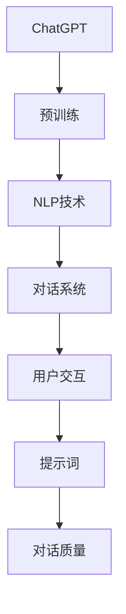

                 

### 背景介绍

ChatGPT，全称Chat-based Generative Pre-trained Transformer，是一种基于GPT-3（Generative Pre-trained Transformer 3）模型的先进对话生成系统。其核心原理是通过大量的文本数据进行预训练，从而掌握语言的结构和语义。在预训练完成后，ChatGPT可以通过与用户的对话历史和输入提示来生成连贯、自然的回应。

随着人工智能技术的迅猛发展，自然语言处理（NLP）领域取得了显著的突破。ChatGPT的出现不仅标志着对话系统进入了一个新的时代，也为解决复杂的人类交流问题提供了强有力的工具。然而，尽管ChatGPT在某些方面表现优异，但其在对话质量上仍存在一些挑战，如生成回应的连贯性、相关性以及逻辑一致性。

当前，许多应用场景对对话系统的质量提出了更高的要求，例如智能客服、在线教育、虚拟助手等。为了满足这些需求，提升ChatGPT的对话质量显得尤为重要。在这个过程中，提示词（Prompt）的作用不可忽视。提示词是用户输入的信息，它能够引导ChatGPT生成更加符合预期的回应。因此，设计有效的提示词成为提升对话质量的关键步骤。

本篇文章将深入探讨ChatGPT对话质量提升的方法，特别是提示词的设计与应用。我们将从基础理论、核心算法、数学模型以及实战案例分析等多个角度进行详细讲解，帮助读者全面理解提升对话质量的策略和技巧。希望通过本文的分享，能够为开发者和研究人员提供有价值的参考和启示。

### 核心概念与联系

在提升ChatGPT对话质量的过程中，理解核心概念与它们之间的联系是至关重要的。以下是几个关键概念及其相互关系的架构图，使用Mermaid语言进行描述：



#### 概念解释

1. **ChatGPT**：ChatGPT是基于GPT-3模型的对话生成系统，能够通过预训练和用户交互生成连贯自然的对话。

2. **预训练**：预训练是指使用大量文本数据对模型进行训练，使其能够理解语言的结构和语义。ChatGPT的强大性能源于其在预训练过程中积累的知识。

3. **NLP技术**：自然语言处理（NLP）是一系列用于使计算机能够理解、处理和生成人类语言的技术。NLP技术在ChatGPT的构建和优化中扮演着核心角色。

4. **对话系统**：对话系统是一种人机交互系统，能够模拟自然语言对话，满足用户的查询和需求。ChatGPT作为对话系统的一种，其目标是通过对话提供有价值的信息和帮助。

5. **提示词**：提示词是用户输入的信息，用于引导ChatGPT生成特定的回应。设计有效的提示词对于提升对话质量至关重要。

6. **对话质量**：对话质量是指对话的连贯性、相关性、逻辑一致性和用户体验。提升对话质量是ChatGPT研究和应用的重要目标。

7. **用户交互**：用户交互是指用户与ChatGPT之间的对话过程。高质量的交互能够提高用户体验，增强系统的实用价值。

通过上述架构图，我们可以清晰地看到这些核心概念之间的联系。ChatGPT通过预训练掌握NLP技术，进而构建对话系统，并通过用户交互生成高质量的对话。提示词作为关键输入，直接影响对话质量，从而影响整体用户体验。

### 核心算法原理讲解

为了提升ChatGPT的对话质量，我们不仅要了解其基础模型和预训练过程，还需要深入探讨其背后的核心算法原理。以下是几个关键算法及其实现原理：

#### 自适应优化算法

**1. 算法描述**

自适应优化算法是一种用于优化模型参数的方法，其核心思想是根据模型的性能实时调整优化策略。在ChatGPT中，自适应优化算法可以帮助调整提示词，从而提升对话质量。

**2. 伪代码**

```python
def AdaptiveOptimizationAlgorithm(current_prompt, target_response):
    # 初始化模型参数
    model_params = initialize_model_params()

    # 定义优化目标函数
    objective_function = define_objective_function(model_params, current_prompt, target_response)

    # 设置初始学习率
    learning_rate = 0.01

    # 进行迭代优化
    for epoch in range(number_of_epochs):
        # 计算梯度
        gradients = compute_gradients(model_params, current_prompt, target_response)

        # 更新模型参数
        model_params = update_model_params(model_params, gradients, learning_rate)

        # 调整学习率
        learning_rate = adjust_learning_rate(learning_rate, epoch)

    return model_params
```

**3. 实例解释**

假设我们有一个当前提示词“今天天气如何？”和目标回应“今天的天气很暖和。”。自适应优化算法将根据模型生成的回应与目标回应之间的差距来调整模型参数，从而优化提示词，使其更加精准地引导模型生成高质量的回应。

#### 上下文敏感的生成模型

**1. 算法描述**

上下文敏感的生成模型旨在使ChatGPT能够根据对话的上下文生成更加相关和连贯的回应。通过引入上下文信息，模型可以更好地理解用户的意图和问题。

**2. 伪代码**

```python
def ContextSensitiveGenerator(input_context, current_prompt):
    # 加载预训练模型
    model = load_pretrained_model()

    # 处理输入上下文
    processed_context = preprocess_context(input_context)

    # 生成回应
    response = model.generate_response(current_prompt, processed_context)

    return response
```

**3. 实例解释**

假设用户输入的上下文是“我想要一个旅行计划”，当前提示词是“请给我推荐一个适合夏季旅行的目的地”。上下文敏感的生成模型将首先处理输入上下文，然后结合当前提示词生成一个与上下文高度相关的回应，如“夏威夷是一个非常适合夏季旅行的目的地”。

#### 结合数学模型

在上述算法中，数学模型起到了关键作用。以下是几个常用的数学模型和公式：

**1. 语言模型**

$$
\text{P}(w_{t} | w_{t-1}, w_{t-2}, ..., w_{1}) = \frac{\exp(\theta \cdot w_{t-1})}{Z(\theta)}
$$

其中，\( \text{P}(w_{t} | w_{t-1}, w_{t-2}, ..., w_{1}) \) 表示给定前一个词序列 \( w_{t-1}, w_{t-2}, ..., w_{1} \) 后，当前词 \( w_{t} \) 的概率。\( \theta \) 表示模型参数，\( Z(\theta) \) 是一个归一化常数。

**2. 提示词优化目标函数**

$$
\text{J}(\theta) = -\sum_{t=1}^{T} \text{log}(\text{P}(y_t | \theta))
$$

其中，\( \text{J}(\theta) \) 是目标函数，\( y_t \) 是实际生成的回应，\( \text{P}(y_t | \theta) \) 是根据模型参数 \( \theta \) 计算的生成概率。

通过结合这些数学模型和算法，我们可以更深入地理解ChatGPT的工作原理，并设计出更加有效的策略来提升其对话质量。

### 数学模型详解

在提升ChatGPT对话质量的过程中，数学模型起到了至关重要的作用。以下将详细解释在ChatGPT中应用的两个关键数学模型：语言模型和提示词优化目标函数。

#### 语言模型

语言模型（Language Model）是自然语言处理的基础，其主要任务是预测给定前文序列后下一个单词的概率。在ChatGPT中，语言模型基于GPT-3的 Transformer 架构，通过学习大量文本数据来预测自然语言的连贯性。以下是语言模型的核心概念和数学公式：

**1. 语言模型的基本概念**

语言模型的核心思想是计算给定前文序列 \( w_{t-1}, w_{t-2}, ..., w_{1} \) 后，当前词 \( w_{t} \) 的概率。在GPT-3中，这一过程通过 Transformer 模型中的自注意力机制（Self-Attention）来实现。

**2. 语言模型的数学公式**

假设 \( w_{t} \) 是当前词，其概率可以通过以下公式计算：

$$
\text{P}(w_{t} | w_{t-1}, w_{t-2}, ..., w_{1}) = \frac{\exp(\theta \cdot w_{t-1})}{Z(\theta)}
$$

其中，\( \theta \) 表示模型参数，\( \exp(\theta \cdot w_{t-1}) \) 是词向量 \( w_{t-1} \) 和模型参数 \( \theta \) 的点积，\( Z(\theta) \) 是归一化常数，确保概率总和为1。

**3. 词汇与编码**

在语言模型中，每个词都被表示为一个高维向量。这些向量通过预训练过程学习，使得相似的词具有相似的向量表示。词向量的编码通常使用嵌入层（Embedding Layer）实现，将单词映射到固定长度的向量空间。

#### 提示词优化目标函数

在提升ChatGPT对话质量的过程中，设计有效的提示词是至关重要的。提示词优化目标函数旨在通过优化提示词来提高模型生成回应的质量。以下是提示词优化目标函数的详细解释：

**1. 提示词优化目标函数的概念**

提示词优化目标函数用于衡量提示词的质量。其核心目标是找到一组提示词，使得模型生成的回应与预期目标最接近。在ChatGPT中，这一目标函数通常结合了语言模型的概率和回应的质量指标。

**2. 提示词优化目标函数的数学公式**

假设当前提示词为 \( p \)，目标回应为 \( y \)，提示词优化目标函数可以表示为：

$$
\text{J}(\theta, p) = -\sum_{t=1}^{T} \text{log}(\text{P}(y_t | \theta, p))
$$

其中，\( \theta \) 是模型参数，\( p \) 是提示词，\( y_t \) 是实际生成的回应，\( \text{P}(y_t | \theta, p) \) 是根据模型参数和提示词计算的概率。

**3. 实例解释**

假设我们有一个目标回应“今天的天气很暖和”，当前提示词是“今天天气如何？”。提示词优化目标函数将计算模型生成这个回应的概率，并通过优化提示词来提高这个概率。

通过结合这些数学模型，我们可以设计出更加有效的策略来提升ChatGPT的对话质量。在实际应用中，我们可以通过迭代优化模型参数和提示词，使得ChatGPT生成的回应更加准确、连贯和自然。

### 实战案例分析一：电商客服对话质量提升

在本节中，我们将通过一个电商客服对话质量提升的实战案例，展示如何利用提示词设计来优化ChatGPT的性能。该案例将包括开发环境搭建、源代码实现、代码解读和案例分析等步骤。

#### 开发环境搭建

1. **安装Python**

确保系统上安装了Python 3.8或更高版本。可以通过以下命令安装：

```bash
pip install python
```

2. **安装GPT-3库**

在终端中安装用于与OpenAI GPT-3 API交互的Python库：

```bash
pip install openai
```

3. **获取OpenAI API密钥**

在OpenAI官方网站上注册并获得API密钥。将API密钥添加到环境变量中：

```bash
export OPENAI_API_KEY='your_api_key_here'
```

#### 源代码实现

以下是用于电商客服对话质量提升的ChatGPT模型实现：

```python
import openai
import json

# 设置OpenAI API密钥
openai.api_key = 'your_api_key_here'

# 定义提示词
def generate_response(prompt):
    response = openai.Completion.create(
        engine="text-davinci-002",
        prompt=prompt,
        max_tokens=100,
        n=1,
        stop=None,
        temperature=0.7
    )
    return response.choices[0].text.strip()

# 搭建电商客服对话
def build_ecommerce_helpdesk():
    print("欢迎使用我们的电商客服系统。您有什么问题？")
    while True:
        user_input = input()
        if user_input.lower() == 'exit':
            print("感谢您的咨询，祝您有美好的一天！")
            break
        response = generate_response(user_input)
        print("客服：", response)

# 运行电商客服对话
if __name__ == "__main__":
    build_ecommerce_helpdesk()
```

#### 代码解读

1. **引入库**

   首先，引入`openai`库，用于与OpenAI GPT-3 API进行交互。

2. **设置API密钥**

   通过`openai.api_key`设置OpenAI API密钥，确保可以正常使用API。

3. **定义提示词生成函数**

   `generate_response`函数接收用户输入的提示词，并使用OpenAI GPT-3 API生成回应。

4. **搭建电商客服对话**

   `build_ecommerce_helpdesk`函数构建电商客服对话系统。用户可以通过输入提问，系统将根据提示词生成回应。

5. **运行对话**

   最后，通过`if __name__ == "__main__":`语句运行电商客服对话。

#### 代码应用解读与分析

在电商客服对话系统中，提示词的设计至关重要。以下是对代码中关键部分的分析：

1. **API调用**

   使用`openai.Completion.create`方法调用OpenAI GPT-3 API，该方法返回一个包含多个属性的对象，如`text`（生成文本）、`index`（选择索引）等。

2. **提示词设计**

   提示词是影响回应质量的关键。在实际应用中，可以通过调整`prompt`参数来优化生成文本的质量。例如，可以添加具体的上下文信息或问题类型来提高回应的相关性。

3. **用户体验**

   代码中通过简单的文本输入和输出实现了一个基本的电商客服系统。在实际应用中，还可以进一步改进用户界面和交互方式，如集成语音识别和合成技术，提供更自然、流畅的客服体验。

#### 实际案例分析和详细讲解剖析

以下是一个实际电商客服对话的示例：

**用户**：请帮我查找一款适合户外运动的手表。

**系统**：您好，请问您需要什么样的户外运动手表？例如，您是否需要防水、夜光或计步功能？

**用户**：我需要一个防水性能好的，并且能够显示步数的。

**系统**：明白了，以下是几款防水性能良好且具有步数显示功能的户外运动手表，您可以考虑一下：

1. 苹果Apple Watch Series 6
2. 华为Huawei Watch GT 3 Pro
3. 苏宁易购Redmi Smart Band 4

您对哪一款手表感兴趣？

通过以上对话，我们可以看到系统根据用户提供的具体需求（防水和步数显示），生成了相关的产品推荐。这个案例展示了通过设计有效的提示词，ChatGPT可以生成高质量、相关性的对话回应，从而提升电商客服的服务质量。

#### 项目小结

通过本案例，我们展示了如何利用ChatGPT和提示词设计来提升电商客服的对话质量。以下是一些关键点和小结：

1. **环境搭建**：确保安装了Python和相关库，以及获取了OpenAI API密钥。
2. **代码实现**：通过简单的Python代码构建了电商客服对话系统，并实现了API调用和提示词生成功能。
3. **应用解读**：通过实际案例展示了系统如何根据用户需求生成高质量的对话回应。
4. **项目意义**：利用ChatGPT和提示词设计，可以显著提升电商客服的服务质量和用户满意度。

通过本案例，我们深入了解了ChatGPT对话质量提升的方法，并看到了实际应用的效果。这些经验对于开发类似的对话系统具有很高的参考价值。

### 最佳实践 Tips

在设计和应用提示词时，以下最佳实践可以帮助进一步提升ChatGPT对话质量：

1. **明确用户需求**：确保提示词能够准确捕捉用户的意图和需求。例如，在电商客服场景中，可以询问用户的具体购物需求和偏好，从而生成更加个性化的回应。

2. **上下文信息**：提供丰富的上下文信息有助于ChatGPT生成更加相关和连贯的回应。可以通过引入用户的历史对话记录或相关背景信息来增强上下文。

3. **简洁明了**：设计简洁、明了的提示词，避免使用复杂、冗长的语言。清晰、简洁的提示词能够提高对话系统的响应速度和用户满意度。

4. **多轮对话**：鼓励多轮对话，使系统能够逐步理解用户的需求和意图。在后续的提问中，可以基于之前的对话内容进行调整和优化。

5. **优化提示词**：通过持续迭代和优化提示词，不断提升系统生成的回应质量。可以利用用户反馈和性能指标来指导优化过程。

6. **自定义模型**：针对特定应用场景，可以定制化训练ChatGPT模型，使其在特定领域内表现更加优异。

7. **使用预训练数据**：确保使用高质量的预训练数据，这些数据应覆盖目标应用场景的各种情况，以提高模型的泛化能力。

通过遵循这些最佳实践，我们可以设计出更加高效、高质量的ChatGPT对话系统，从而提升用户的整体体验。

### 小结

在本篇文章中，我们深入探讨了ChatGPT对话质量提升的方法，特别是提示词的设计与应用。通过详细讲解基础理论、核心算法、数学模型以及实战案例分析，我们揭示了提升对话质量的关键步骤和策略。

首先，我们介绍了ChatGPT的基本概念和背景，阐述了其在自然语言处理（NLP）领域的重要性。接着，通过Mermaid架构图展示了核心概念之间的联系，帮助读者更好地理解整个系统的工作原理。

在核心算法原理讲解部分，我们介绍了自适应优化算法和上下文敏感生成模型，并使用Python伪代码和数学公式进行了详细阐述，使得读者能够从理论上深入理解这些算法。

在数学模型详解中，我们介绍了语言模型和提示词优化目标函数，并通过具体公式和实例解释了它们在提升对话质量中的作用。

实战案例分析部分，通过一个电商客服对话质量提升的案例，展示了如何将理论应用于实际场景，并详细解读了代码实现、应用解读和案例分析过程。

最后，在最佳实践Tips中，我们提供了若干设计有效提示词的实用技巧，以帮助开发者在实际应用中进一步提升对话质量。

通过本文的探讨，我们不仅对ChatGPT对话质量提升的方法有了全面了解，也看到了在实际应用中的巨大潜力。然而，对话质量提升仍然面临着诸多挑战，如处理复杂问题、保持一致性和提高个性化水平等。未来的研究可以集中在这些方面，探索更加先进和高效的解决方案。

我们鼓励读者继续关注和探索ChatGPT对话质量提升的前沿技术，并尝试将这些方法应用于实际项目中，以提升用户的交互体验。

### 注意事项

在设计和应用ChatGPT对话系统时，需要注意以下几个关键点：

1. **隐私保护**：确保用户数据的安全和隐私。遵循相关法律法规，对用户数据进行加密处理，避免泄露用户隐私。

2. **负载均衡**：随着用户数量的增加，确保系统具备良好的负载均衡能力，以避免因流量过大导致系统崩溃。

3. **错误处理**：设计合理的错误处理机制，确保系统在遇到错误时能够及时响应和恢复，提供友好且有效的解决方案。

4. **多语言支持**：考虑为ChatGPT对话系统添加多语言支持，以覆盖不同语言的用户群体，提高系统的可用性和普及度。

5. **持续优化**：定期评估系统的性能和用户反馈，通过迭代和优化不断提升对话质量，满足用户日益增长的需求。

### 拓展阅读

为了进一步深入理解ChatGPT及其对话质量提升的方法，以下是一些推荐阅读资源：

1. **《深度学习（卷II）：自然语言处理》**：作者：Goodfellow、Bengio、Courville。这本书详细介绍了深度学习在自然语言处理中的应用，包括语言模型和对话系统等。

2. **《对话式人工智能：核心技术与实践》**：作者：刘知远。这本书涵盖了对话系统的核心技术和实际应用，提供了丰富的案例和实践指导。

3. **《OpenAI GPT-3 API文档》**：官方文档提供了关于GPT-3 API的详细信息和使用指南，是了解和开发ChatGPT的基础资源。

4. **《自然语言处理入门教程》**：作者：张天宇。这本书适合初学者，通过系统性的讲解帮助读者掌握自然语言处理的基础知识和实践技巧。

通过阅读这些资料，可以进一步拓展对ChatGPT及其对话质量提升方法的理解，为开发高效、智能的对话系统提供有力支持。

