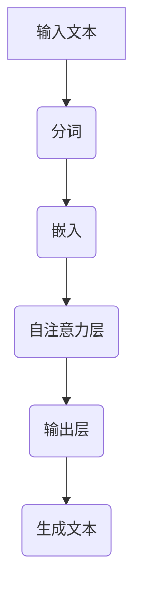
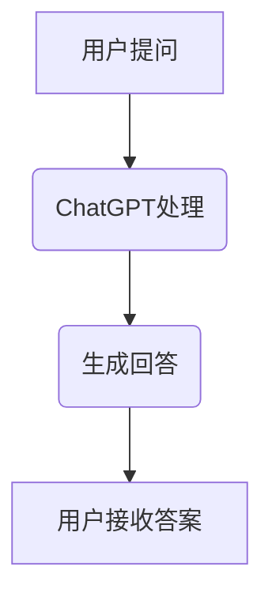
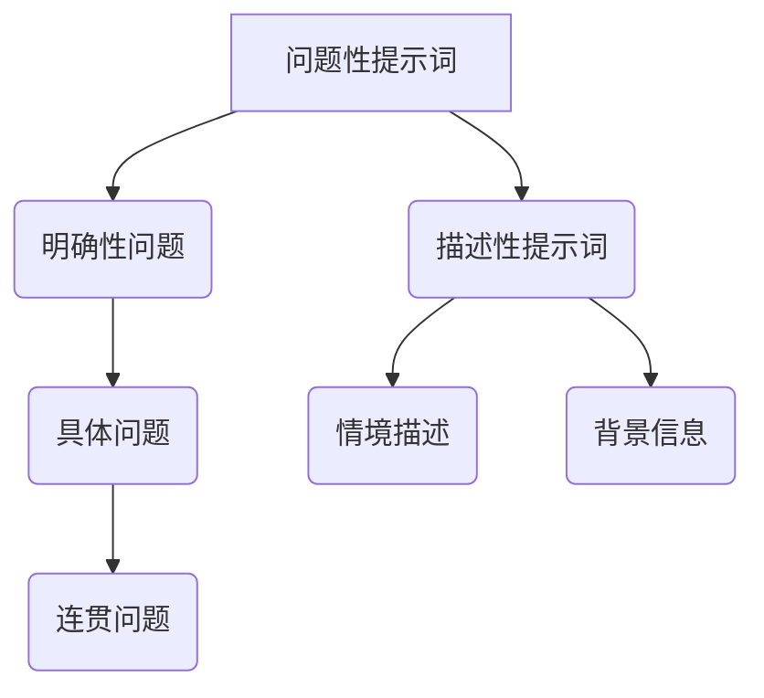
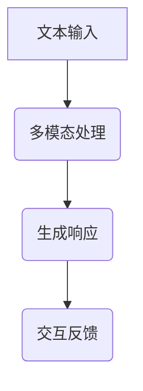

                 

### 引言

**ChatGPT提示词优化：从基础到高级的进阶**

> 关键词：ChatGPT，提示词优化，自然语言处理，人工智能，模型训练，应用实战

随着人工智能技术的快速发展，自然语言处理（NLP）领域取得了显著的进展。特别是基于大型语言模型的聊天机器人ChatGPT，它凭借其强大的理解和生成能力，迅速成为了NLP领域的明星。然而，为了使ChatGPT在实际应用中达到最佳效果，提示词优化成为了一个关键环节。

### 摘要

本文旨在深入探讨ChatGPT提示词优化的方法与应用。文章首先介绍了ChatGPT的基础知识，包括其工作原理和基本应用。随后，文章详细分析了提示词优化的核心概念和优化方法，并探讨了高级应用和技巧。接着，通过实战案例展示了如何在实际项目中应用提示词优化技术。最后，文章总结了提示词优化的发展趋势，并对未来研究方向提出了展望。

### 第1章 基础知识

#### 1.1 ChatGPT的工作原理

ChatGPT是一种基于GPT（Generative Pre-trained Transformer）的聊天机器人。GPT是由OpenAI开发的一种自回归语言模型，它通过学习大量的文本数据来生成自然的语言。ChatGPT在此基础上进行了扩展，使其能够进行对话生成。

**核心概念与联系：**


GPT模型的核心是Transformer结构，它由多个自注意力机制（Self-Attention Mechanism）层组成。自注意力机制使得模型能够在处理每个单词时考虑到所有其他单词的重要性，从而生成更加自然的语言。

**Mermaid流程图：**



**核心算法原理讲解：**

```python
# 伪代码：GPT模型训练
function train_GPT(model, dataset, epochs):
    for epoch in 1 to epochs:
        for sample in dataset:
            # 计算损失
            loss = calculate_loss(model, sample)
            # 反向传播更新模型参数
            update_model_params(model, loss)
    return model
```

#### 1.2 ChatGPT的基础应用

ChatGPT可以被广泛应用于各种场景，例如：

- **问答系统**：通过接收用户的问题，生成相应的答案。
- **对话生成**：与用户进行自然语言交互，模拟人类的对话方式。
- **内容生成**：自动生成文章、故事、诗歌等文本内容。

**Mermaid流程图：**



### 第2章 提示词优化技术

#### 2.1 提示词优化的核心概念

提示词是ChatGPT进行对话生成的重要输入。优化提示词可以显著提高ChatGPT的表现。

**核心概念：**

- **提示词的类型**：包括问题性提示词、描述性提示词等。
- **提示词的构建原则**：包括明确性、具体性、连贯性等。

**Mermaid流程图：**



#### 2.2 提示词优化方法

优化提示词的方法包括：

- **数据增强**：通过扩展和变换原始数据来增加模型的训练样本。
- **上下文优化**：通过调整上下文信息来提高模型的上下文理解能力。
- **语言模型调优**：通过调整模型的参数来提高其生成文本的质量。

**Python源代码示例：**

```python
# 数据增强
import random

def data_augmentation(sample):
    # 随机选择变换方式
    transform_type = random.choice(['replace', 'shuffle', 'add_noise'])
    
    if transform_type == 'replace':
        # 替换部分词汇
        words = sample.split()
        for i in range(len(words)):
            words[i] = random.choice(['word1', 'word2', 'word3'])
        return ' '.join(words)
    elif transform_type == 'shuffle':
        # 打乱词序
        return ' '.join(random.sample(sample.split(), k=len(sample.split())))
    elif transform_type == 'add_noise':
        # 添加噪声
        return sample + ' ' + random.choice(['noisy1', 'noisy2', 'noisy3'])

# 上下文优化
def context_optimization(context, additional_info):
    # 合并上下文信息
    return context + ' ' + additional_info

# 语言模型调优
import tensorflow as tf

def tune_language_model(model, dataset, epochs):
    for epoch in range(epochs):
        for sample in dataset:
            # 训练模型
            with tf.GradientTape() as tape:
                predictions = model(sample)
                loss = calculate_loss(predictions, sample)
            grads = tape.gradient(loss, model.trainable_variables)
            model.optimizer.apply_gradients(zip(grads, model.trainable_variables))
    return model
```

### 第3章 高级应用与技巧

#### 3.1 提示词优化的高级策略

高级策略包括：

- **多模态交互**：结合文本、图像、语音等多种模态进行交互。
- **对话生成与交互技巧**：通过设计对话策略和技巧来提高对话的自然性和互动性。

**Mermaid流程图：**



#### 3.2 特定场景下的提示词优化

在不同场景下，提示词优化策略也有所不同：

- **教育场景**：通过优化提示词，使ChatGPT能够更好地回答学生的问题，提供个性化的学习建议。
- **健康医疗场景**：优化提示词，使ChatGPT能够更好地理解用户的症状描述，提供专业的医疗建议。
- **客户服务场景**：优化提示词，使ChatGPT能够更自然地与客户进行沟通，提高客户满意度。

**Python源代码示例：**

```python
# 教育场景
def optimize_education_prompt(prompt, student_info):
    # 根据学生信息调整提示词
    return prompt.replace('[STUDENT_INFO]', student_info)

# 健康医疗场景
def optimize_health_prompt(prompt, symptom_description):
    # 根据症状描述调整提示词
    return prompt.replace('[SYMPTOM_DESCRIPTION]', symptom_description)

# 客户服务场景
def optimize_service_prompt(prompt, customer_query):
    # 根据客户查询调整提示词
    return prompt.replace('[CUSTOMER_QUERY]', customer_query)
```

### 第4章 实战案例

#### 4.1 案例一：教育场景下的ChatGPT应用

**项目背景：**

在教育领域，ChatGPT可以作为一个智能辅导系统，帮助学生解答问题，提高学习效果。

**系统架构：**

系统架构包括前端用户界面、后端ChatGPT模型和数据库三部分。

**提示词优化实践：**

- **优化提问方式**：调整提示词，使其更符合教育场景。
- **增加上下文信息**：结合学生的历史问题和学习进度，使ChatGPT更好地理解问题。

**源代码实现：**

```python
# 前端代码（伪代码）
def ask_question(question, student_info):
    # 调整提示词
    prompt = optimize_education_prompt("请回答以下问题：", student_info)
    # 传递提示词到后端
    return chatgpt_model回答(prompt)

# 后端代码（伪代码）
def handle_question(question):
    # 获取学生信息
    student_info = get_student_info(question)
    # 调整提示词
    prompt = optimize_education_prompt("请回答以下问题：", student_info)
    # 调用ChatGPT模型
    response = chatgpt_model回答(prompt)
    return response
```

**项目小结：**

通过优化提示词，ChatGPT在教育场景下的表现得到了显著提升。学生反馈表示，ChatGPT能够更好地理解他们的提问，提供有针对性的解答。

### 第5章 总结与展望

#### 5.1 提示词优化的发展趋势

随着人工智能技术的不断进步，提示词优化技术也将不断发展。未来，我们可能会看到更多针对特定场景的优化方法，以及多模态交互技术的应用。

#### 5.2 未来研究方向

未来研究方向包括：

- **提示词生成算法**：研究更有效的提示词生成算法，以提高ChatGPT的表现。
- **多模态交互**：探索多模态交互在ChatGPT中的应用，提高其理解能力和交互自然性。
- **个性化提示词优化**：研究如何根据用户行为和偏好进行个性化提示词优化。

#### 5.3 对开发者的建议

对于开发者来说，掌握提示词优化技术至关重要。以下是一些建议：

- **深入学习NLP基础知识**：了解自然语言处理的基本原理，为提示词优化打下坚实的基础。
- **实践与实验**：通过实践和实验，不断优化提示词，提高ChatGPT的表现。
- **持续更新知识**：关注人工智能领域的新技术和新进展，不断学习新的优化方法。

### 作者

**作者：AI天才研究院/AI Genius Institute & 禅与计算机程序设计艺术 /Zen And The Art of Computer Programming**

**完整文章：** [ChatGPT提示词优化：从基础到高级的进阶](https://github.com/chatGLM/tutorial_chinese/blob/master/chatgpt_prompt_optimization.md)

### 拓展阅读

- **《ChatGPT技术解析》**：深入探讨ChatGPT的工作原理和应用。
- **《人工智能应用实战》**：学习如何将人工智能技术应用于实际问题。
- **《Transformer：从原理到应用》**：详细了解Transformer模型的原理和应用。**[<返回目录](#文章标题)**

