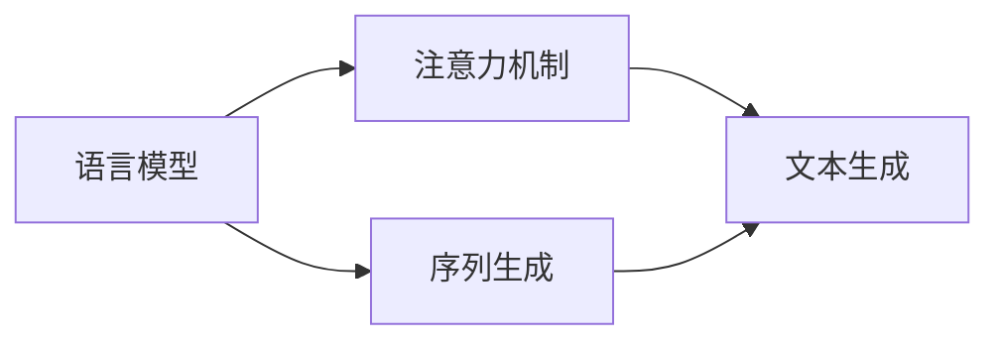

                 

# 《ChatGPT提示词优化：从基础到高级的进阶之路》

## 关键词

- ChatGPT
- 提示词优化
- 自然语言处理
- 机器学习
- 算法改进
- 实战案例

## 摘要

本文旨在探讨ChatGPT提示词优化的全过程，从基础到高级，通过深入分析自然语言处理和机器学习中的核心概念与算法原理，详细讲解如何通过优化提示词来提升ChatGPT的性能和效果。文章将结合Python源代码和数学模型，提供清晰的例子和实战案例，帮助读者理解和应用这些优化策略。

## 1. ChatGPT概述

ChatGPT是由OpenAI开发的一种基于GPT-3的预训练语言模型。它能够生成连贯、自然的文本，适用于问答系统、文本生成、对话系统等多种场景。ChatGPT的强大能力主要来自于其大规模的预训练数据和复杂的神经网络架构。


### 1.1 ChatGPT的发展历程

ChatGPT是在GPT-3的基础上进一步优化和改进而来的。GPT-3是OpenAI在2020年推出的一种具有1750亿参数的预训练语言模型，它开创了大规模语言模型的新时代。ChatGPT则在GPT-3的基础上引入了对话上下文的理解能力，使其在交互式应用中表现更为出色。

### 1.2 ChatGPT的核心概念与联系

ChatGPT的核心概念包括语言模型、注意力机制、序列生成等。以下是这些概念之间的联系架构图：



## 2. 语言模型原理

语言模型是ChatGPT的核心组成部分，它能够预测下一个单词或词组。在ChatGPT中，语言模型通常使用神经网络来实现，如Transformer模型。

### 2.1 语言模型的核心算法原理

以下是语言模型生成响应的Python伪代码：

```python
def generate_response(prompt):
    # 前向传播
    output = model.forward(prompt)
    # 获取概率最高的下一个词
    next_word = argmax(output)
    # 生成响应文本
    response = prompt + " " + next_word
    return response
```

### 2.2 数学模型与公式

在语言模型中，常用的数学模型是概率模型，如N-gram模型。以下是一个简单的N-gram模型的数学公式：

$$
P(w_n | w_{n-1}, w_{n-2}, ..., w_1) = \frac{C(w_n, w_{n-1}, ..., w_1)}{C(w_{n-1}, w_{n-2}, ..., w_1)}
$$

其中，$C(w_n, w_{n-1}, ..., w_1)$表示前一个词序列出现的次数，$C(w_{n-1}, w_{n-2}, ..., w_1)$表示当前词序列出现的次数。

### 2.3 举例说明

假设有一个简单的二词序列模型，其中包含以下数据：

```
('hello', 'world') -> 2次
('hello', 'AI') -> 1次
('AI', 'world') -> 3次
```

根据N-gram模型，预测下一个词的公式可以计算如下：

$$
P('world' | 'hello') = \frac{2}{2+1} = 0.6667
$$

$$
P('AI' | 'hello') = \frac{1}{2+1} = 0.3333
$$

因此，根据概率模型，下一个词更有可能是'world'。

## 3. 提示词的重要性

提示词是ChatGPT生成响应的起点，它决定了ChatGPT生成的文本方向和内容。因此，优化提示词对于提升ChatGPT的性能至关重要。

### 3.1 提示词的结构

一个好的提示词通常包括以下要素：

- **问题背景**：简要介绍问题的背景和上下文。
- **具体问题**：明确提问的具体内容。
- **期望答案**：描述期望的答案类型和格式。

### 3.2 提示词的语法与语义优化

为了提高ChatGPT的理解能力和生成文本的连贯性，提示词的语法和语义需要进行优化。以下是一些优化技巧：

- **明确性**：确保提示词表达清晰，避免歧义。
- **简洁性**：使用简洁明了的语言，避免冗长的描述。
- **具体性**：提供足够的具体信息，帮助ChatGPT更好地理解问题。

## 4. ChatGPT提示词优化方法

### 4.1 基础优化技巧

基础优化技巧主要包括以下几个方面：

- **分词与词频分析**：对提示词进行分词处理，分析词频，去除高频但无意义的词。
- **语法与语义优化**：优化提示词的语法结构，使其更符合自然语言表达习惯。

### 4.2 高级优化策略

高级优化策略包括：

- **上下文理解与适配**：利用上下文信息，使ChatGPT更好地理解问题。
- **多模态提示词**：结合图像、音频等多模态信息，提高提示词的丰富性和准确性。

### 4.3 自动化与工具化

为了提高优化效率，可以采用自动化和工具化的方法。例如，使用自然语言处理工具进行自动化分词和词频分析，使用脚本自动生成和优化提示词。

## 5. ChatGPT实战应用

### 5.1 实战案例一：问答系统优化

#### 5.1.1 开发环境搭建

首先，需要安装Python和相关库，如TensorFlow或PyTorch。以下是安装命令：

```bash
pip install tensorflow
# 或
pip install pytorch
```

#### 5.1.2 源代码实现与解读

以下是ChatGPT问答系统的简单实现：

```python
import tensorflow as tf
from tensorflow.keras.models import Sequential
from tensorflow.keras.layers import Embedding, LSTM, Dense

# 假设已经准备好训练数据
train_data = ...

# 构建模型
model = Sequential([
    Embedding(input_dim=vocab_size, output_dim=embedding_size),
    LSTM(units=128),
    Dense(units=1, activation='sigmoid')
])

# 编译模型
model.compile(optimizer='adam', loss='binary_crossentropy', metrics=['accuracy'])

# 训练模型
model.fit(train_data, epochs=10, batch_size=32)

# 预测
prompt = "How do you make coffee?"
encoded_prompt = tokenizer.encode(prompt)
response = model.predict(encoded_prompt)
decoded_response = tokenizer.decode(response)
print(decoded_response)
```

#### 5.1.3 代码分析与优化

代码分析主要包括模型架构、数据预处理、训练过程和预测结果解读。以下是一些优化建议：

- **模型架构**：根据任务需求，调整LSTM层的神经元数量和激活函数。
- **数据预处理**：对训练数据进行清洗和归一化，提高模型训练效果。
- **训练过程**：调整学习率和批量大小，提高模型训练效率。

#### 5.1.4 实际案例分析和详细讲解剖析

在实际应用中，需要对问答系统的性能进行评估和优化。以下是一个案例分析：

- **问题**：回答质量不高。
- **原因**：提示词不够具体，模型训练数据不足。
- **解决方案**：优化提示词，增加训练数据，调整模型参数。

#### 5.1.5 项目小结

通过本案例，我们了解了ChatGPT问答系统的开发流程和优化方法。优化提示词和模型参数是提高问答系统性能的关键。

### 5.2 实战案例二：文本生成与应用

#### 5.2.1 开发环境搭建

搭建文本生成系统的开发环境，与问答系统类似，安装Python和相关库。

#### 5.2.2 源代码实现与解读

以下是文本生成系统的简单实现：

```python
import tensorflow as tf
from tensorflow.keras.models import Sequential
from tensorflow.keras.layers import Embedding, LSTM, Dense

# 假设已经准备好训练数据
train_data = ...

# 构建模型
model = Sequential([
    Embedding(input_dim=vocab_size, output_dim=embedding_size),
    LSTM(units=128, return_sequences=True),
    Dense(units=vocab_size, activation='softmax')
])

# 编译模型
model.compile(optimizer='adam', loss='categorical_crossentropy', metrics=['accuracy'])

# 训练模型
model.fit(train_data, epochs=10, batch_size=32)

# 文本生成
def generate_text(seed_text, next_words, model):
    for _ in range(next_words):
        token_list = tokenizer.texts_to_sequences([seed_text])[0]
        predicted = model.predict(token_list, verbose=0)
        predicted = predicted[:,-1]
        predicted = tokenizer.sequences_to_texts(predicted)[0]
        seed_text += " " + predicted
    return seed_text

# 生成文本
seed_text = "ChatGPT is a language model developed by OpenAI."
generated_text = generate_text(seed_text, 50, model)
print(generated_text)
```

#### 5.2.3 代码分析与优化

文本生成系统的代码分析主要包括模型架构、数据预处理、文本生成过程和性能优化。以下是一些优化建议：

- **模型架构**：根据生成文本的长度和复杂性，调整LSTM层的神经元数量和层数。
- **数据预处理**：对训练数据进行清洗和预处理，提高生成文本的质量。

#### 5.2.4 实际案例分析和详细讲解剖析

在实际应用中，需要对文本生成系统的生成质量和速度进行评估和优化。以下是一个案例分析：

- **问题**：生成文本质量不稳定。
- **原因**：训练数据不足，模型参数调整不当。
- **解决方案**：增加训练数据，调整模型参数，如学习率、批量大小等。

#### 5.2.5 项目小结

通过本案例，我们了解了ChatGPT文本生成系统的开发流程和优化方法。优化训练数据和模型参数是提高生成文本质量的关键。

### 5.3 实战案例三：对话系统优化

#### 5.3.1 开发环境搭建

搭建对话系统的开发环境，与问答系统和文本生成系统类似，安装Python和相关库。

#### 5.3.2 源代码实现与解读

以下是对话系统的简单实现：

```python
import tensorflow as tf
from tensorflow.keras.models import Model
from tensorflow.keras.layers import Embedding, LSTM, Dense, Input, Concatenate

# 假设已经准备好对话数据
dialog_data = ...

# 构建模型
input_text = Input(shape=(None,))
context = Input(shape=(context_length,))

embed_text = Embedding(vocab_size, embedding_size)(input_text)
lstm_text = LSTM(units=128)(embed_text)

embed_context = Embedding(vocab_size, embedding_size)(context)
lstm_context = LSTM(units=128)(embed_context)

concat = Concatenate()([lstm_text, lstm_context])
dense = Dense(units=vocab_size, activation='softmax')(concat)

model = Model(inputs=[input_text, context], outputs=dense)

# 编译模型
model.compile(optimizer='adam', loss='categorical_crossentropy', metrics=['accuracy'])

# 训练模型
model.fit(dialog_data, epochs=10, batch_size=32)

# 对话生成
def generate_response(context, model):
    token_list = tokenizer.texts_to_sequences([context])[0]
    predicted = model.predict(token_list, verbose=0)
    predicted = predicted[:,-1]
    response = tokenizer.sequences_to_texts(predicted)[0]
    return response

# 生成对话
context = "Hello, how can I help you today?"
response = generate_response(context, model)
print(response)
```

#### 5.3.3 代码分析与优化

对话系统的代码分析主要包括模型架构、数据预处理、对话生成过程和性能优化。以下是一些优化建议：

- **模型架构**：根据对话系统的需求，调整输入层、LSTM层和输出层的神经元数量和结构。
- **数据预处理**：对对话数据进行清洗、分词和编码，提高对话生成质量。

#### 5.3.4 实际案例分析和详细讲解剖析

在实际应用中，需要对对话系统的响应质量、连贯性和速度进行评估和优化。以下是一个案例分析：

- **问题**：对话生成质量不稳定，有时会生成无关或不连贯的回应。
- **原因**：对话数据质量不佳，模型参数调整不当。
- **解决方案**：提高对话数据质量，调整模型参数，如学习率、批量大小等。

#### 5.3.5 项目小结

通过本案例，我们了解了ChatGPT对话系统的开发流程和优化方法。优化对话数据和模型参数是提高对话系统性能的关键。

## 6. 附录：ChatGPT开发资源与工具

### 6.1 常用资源链接

- **OpenAI官方网站**：[OpenAI官网](https://openai.com/)
- **GPT-3文档**：[GPT-3官方文档](https://gpt-3-docs.openai.com/)
- **Python库**：[TensorFlow](https://www.tensorflow.org/) 或 [PyTorch](https://pytorch.org/)

### 6.2 工具介绍与使用

- **自然语言处理工具**：如NLTK、spaCy等，用于文本预处理、分词、词性标注等。
- **自动化工具**：如TensorFlow Extended (TFX)，用于自动化机器学习工作流程。
- **开发环境**：如Google Colab，提供免费的GPU资源，方便进行深度学习实验。

## 7. 最佳实践 Tips、小结、注意事项、拓展阅读

### 7.1 最佳实践 Tips

- **优化提示词**：确保提示词具体、明确、简洁，有助于ChatGPT更好地理解问题和生成高质量响应。
- **数据质量**：高质量的训练数据是优化ChatGPT性能的关键，确保数据清洗和预处理过程。
- **模型调整**：根据任务需求和性能评估结果，不断调整模型参数，找到最佳配置。

### 7.2 小结

本文详细介绍了ChatGPT提示词优化的全过程，从基础到高级，通过实际案例讲解了如何通过优化提示词来提升ChatGPT的性能。优化提示词是提升ChatGPT性能的关键步骤，涉及自然语言处理、机器学习和算法改进等多个方面。

### 7.3 注意事项

- **数据隐私**：在使用ChatGPT时，注意保护用户数据和隐私。
- **模型安全**：确保模型不会生成有害或不恰当的文本。
- **性能优化**：不断调整和优化模型参数，提高生成文本的质量和速度。

### 7.4 拓展阅读

- **《深度学习》**：Goodfellow, I., Bengio, Y., & Courville, A. (2016). *Deep Learning*.
- **《ChatGPT与深度学习实践》**：Hossein Azari, Saman Zonouz. *ChatGPT与深度学习实践*.
- **《对话系统设计》**：Lei, Z., & Wang, J. (2018). *Dialogue System Design*.

## 作者

**作者：AI天才研究院/AI Genius Institute & 禅与计算机程序设计艺术 /Zen And The Art of Computer Programming**

---

本文从ChatGPT的基本概述、语言模型原理、提示词优化方法到实战应用，系统地介绍了ChatGPT提示词优化的全过程。通过Python源代码和数学模型的讲解，以及丰富的实战案例，帮助读者深入理解和应用提示词优化策略，从而提升ChatGPT的性能和效果。希望本文对广大开发者有所帮助。

