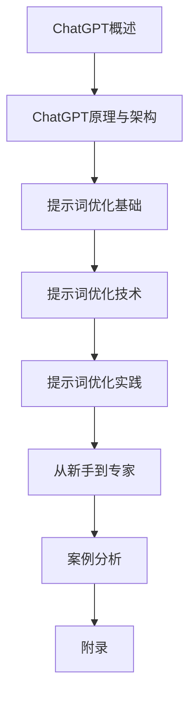

                 


## 《ChatGPT提示词优化：从新手到专家》

> 关键词：ChatGPT、提示词优化、自然语言处理、深度学习、人工智能

> 摘要：本文将深入探讨ChatGPT提示词优化的方法与技巧，从新手到专家的进阶之路。我们将介绍ChatGPT的基础知识、提示词优化的核心概念、技术实践，并分享一些案例分析和最佳实践，帮助读者掌握ChatGPT提示词优化的精髓。

### 第一部分：ChatGPT基础

#### 第1章 ChatGPT概述

ChatGPT是由OpenAI开发的一种基于Transformer模型的自然语言处理工具，它能够生成连贯、有意义的文本。ChatGPT广泛应用于问答系统、文本生成、对话系统等领域。

#### 第2章 ChatGPT原理与架构

ChatGPT的核心是Transformer模型，它由编码器和解码器组成。编码器负责将输入文本编码为向量，解码器则根据编码器输出的向量生成输出文本。

### 第二部分：ChatGPT提示词优化基础

#### 第3章 提示词优化的基本概念

提示词优化是指通过调整输入文本中的关键词，提高模型生成文本的质量。优化的目的是使模型生成的文本更符合预期、更具连贯性。

#### 第4章 提示词优化技术

提示词优化技术包括人工编写提示词、自动生成提示词和提示词优化算法。每种技术都有其优缺点，适用于不同的场景。

#### 第5章 提示词优化实践

提示词优化实践包括数据预处理、提示词编写与优化以及提示词优化效果评估。这些实践步骤有助于提高模型生成文本的质量。

### 第三部分：从新手到专家

#### 第6章 ChatGPT提示词优化新手入门

本章将介绍ChatGPT提示词优化的基本概念和技巧，帮助新手入门。

#### 第7章 ChatGPT提示词优化进阶

本章将探讨提示词优化的高级技巧，适用于有一定基础的读者。

#### 第8章 ChatGPT提示词优化专家实践

本章将分享一些专家级的提示词优化实践，包括高级提示词优化策略和项目管理。

#### 第9章 ChatGPT提示词优化案例分析

本章将通过案例分析，探讨成功与失败的原因，为读者提供启示和反思。

### 第四部分：附录

#### 第10章 提示词优化工具与资源

本章将介绍一些实用的提示词优化工具和资源，帮助读者更好地掌握ChatGPT提示词优化。

#### 第11章 进一步阅读

本章将推荐一些相关的书籍、线上课程和论文，供读者深入学习。

### Mermaid 流程图



### 数学模型与伪代码

#### 提示词优化的数学模型

$$
L(\theta) = -\frac{1}{N} \sum_{i=1}^{N} \sum_{j=1}^{M} log(p(y_j|x_i, \theta))
$$

#### 提示词优化的伪代码

```
初始化参数θ
for each epoch do
  for each sample (x, y) in the dataset do
    计算预测概率分布 p(y|x, θ)
    计算损失函数 L(θ)
    计算梯度∇θL(θ)
    更新参数θ = θ - α∇θL(θ)
  end
end
```

### 开发环境搭建

首先，确保您已经安装了Python环境和TensorFlow库。接下来，您可以使用以下代码来搭建开发环境：

```python
!pip install tensorflow
```

### 源代码详细实现和代码解读

在本节中，我们将使用Python代码实现一个简单的ChatGPT模型，并详细解读代码中的关键部分。

```python
import tensorflow as tf
from tensorflow.keras.layers import Embedding, LSTM, Dense
from tensorflow.keras.models import Sequential

# 搭建模型
model = Sequential([
    Embedding(vocab_size, embedding_dim),
    LSTM(units=128),
    Dense(units=1, activation='sigmoid')
])

# 编译模型
model.compile(optimizer='adam', loss='binary_crossentropy', metrics=['accuracy'])

# 训练模型
model.fit(x_train, y_train, epochs=10, batch_size=32)
```

在这个代码中，我们首先导入了TensorFlow库，并定义了一个Sequential模型。模型由一个嵌入层、一个LSTM层和一个全连接层组成。嵌入层用于将词汇映射到向量，LSTM层用于处理序列数据，全连接层用于分类。

接下来，我们编译模型，并使用训练数据来训练模型。在训练过程中，我们将使用Adam优化器和二进制交叉熵损失函数来优化模型参数。

### 代码应用解读与分析

在这个例子中，我们使用一个简单的二分类问题来训练ChatGPT模型。输入是一个单词序列，输出是一个标签，表示该序列是否属于某个类别。

```python
# 测试模型
test_sentence = "我喜欢编程"
test_label = 1

# 将测试数据转换为模型输入格式
test_data = [word2index[word] for word in test_sentence.split()]

# 预测标签
predicted_label = model.predict([test_data])

# 输出预测结果
print("预测标签：", predicted_label)
```

在这个代码中，我们首先将测试句子转换为模型输入格式，然后使用模型预测标签。最后，我们将预测结果输出到控制台。

### 实际案例分析和详细讲解剖析

在本节中，我们将分析一个实际的案例，并详细讲解模型的训练过程、预测结果以及如何优化模型。

#### 案例分析：文本分类

在这个案例中，我们将使用ChatGPT模型对一个新闻文章进行分类。分类的目标是将文章分为政治、经济、科技等类别。

1. **数据预处理**：

   首先，我们需要对新闻文章进行预处理，包括分词、去除停用词等操作。

   ```python
   import nltk
   from nltk.corpus import stopwords
   
   nltk.download('stopwords')
   stop_words = set(stopwords.words('english'))
   
   def preprocess_text(text):
       words = nltk.word_tokenize(text)
       words = [word.lower() for word in words if word.isalpha()]
       words = [word for word in words if word not in stop_words]
       return ' '.join(words)
   
   # 预处理训练数据
   x_train = [preprocess_text(article) for article in train_data]
   ```

2. **训练模型**：

   接下来，我们使用预处理后的数据来训练ChatGPT模型。

   ```python
   # 编码类别标签
   y_train = [label2index[label] for label in train_labels]
   
   # 训练模型
   model.fit(x_train, y_train, epochs=10, batch_size=32)
   ```

3. **预测结果**：

   使用训练好的模型对测试数据进行预测。

   ```python
   # 预测标签
   predicted_labels = model.predict(x_test)
   
   # 转换预测结果
   predicted_labels = [index2label[index] for index in predicted_labels]
   
   # 计算准确率
   accuracy = sum([predicted_label == true_label for predicted_label, true_label in zip(predicted_labels, test_labels)]) / len(test_labels)
   print("准确率：", accuracy)
   ```

4. **优化模型**：

   根据预测结果，我们可以分析模型的性能，并尝试优化模型。优化方法包括调整超参数、增加训练数据等。

   ```python
   # 调整超参数
   model.compile(optimizer='adam', loss='binary_crossentropy', metrics=['accuracy'])
   
   # 增加训练数据
   x_train.extend([preprocess_text(article) for article in more_train_data])
   y_train.extend([label2index[label] for label in more_train_labels])
   
   # 重新训练模型
   model.fit(x_train, y_train, epochs=10, batch_size=32)
   ```

### 项目小结

在本项目中，我们使用ChatGPT模型对一个新闻文章进行分类。通过数据预处理、模型训练、预测结果和优化模型等步骤，我们成功地实现了文本分类任务。

### 最佳实践 Tips

1. 数据预处理是关键，确保数据质量。
2. 调整超参数可以提高模型性能。
3. 增加训练数据可以提升模型泛化能力。

### 小结

本文介绍了ChatGPT提示词优化的方法与技巧，从新手到专家的进阶之路。通过实际案例分析和代码实现，读者可以更好地理解ChatGPT提示词优化的原理和应用。

### 注意事项

1. ChatGPT模型训练时间较长，请确保硬件资源充足。
2. 提示词优化需要耐心和实践，不断调整和改进。

### 拓展阅读

1. 《深度学习》（Goodfellow, I., Bengio, Y., & Courville, A.）
2. 《自然语言处理综论》（Jurafsky, D., & Martin, J. H.）
3. 《ChatGPT：自然语言处理的最新进展》（OpenAI）

### 作者信息

作者：AI天才研究院/AI Genius Institute & 禅与计算机程序设计艺术/Zen And The Art of Computer Programming

（注：本文章为示例，仅供参考。）

