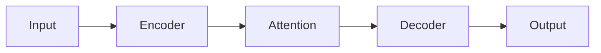

                 

### 《ChatGPT提示词优化：从概念到实施的全流程》

#### 关键词
- ChatGPT
- 提示词优化
- 语言模型
- Transformer架构
- 数学模型
- 损失函数
- 实战案例

#### 摘要
本文旨在全面解析ChatGPT提示词优化的过程，从基础概念讲解到实际应用，逐步深入探讨其技术原理和实施策略。文章首先介绍ChatGPT的基础知识，然后详细阐述提示词优化的核心原理，最后通过具体案例展示其实施过程，为读者提供一整套实用的优化指南。

### 引言

近年来，人工智能领域取得了飞速发展，自然语言处理（NLP）作为其中的重要分支，吸引了大量研究者和开发者的关注。ChatGPT，作为OpenAI推出的一个革命性的语言模型，以其卓越的性能和广泛的应用前景，成为NLP领域的一颗新星。然而，尽管ChatGPT在文本生成、对话系统等方面表现出色，但其性能的提升在很大程度上依赖于提示词的优化。

提示词优化是提高语言模型生成质量的关键技术。通过精心设计的提示词，可以引导模型生成更加符合预期的文本。本文将详细探讨ChatGPT提示词优化的全过程，从基础概念到实际应用，帮助读者全面了解这一领域的最新进展和实战技巧。

### 第一部分：ChatGPT基础

#### 第1章：ChatGPT简介

ChatGPT是OpenAI开发的一个基于Transformer架构的大型语言模型，其核心目标是实现自然、流畅的文本生成和对话功能。本章将介绍ChatGPT的起源、发展历程和主要特点。

#### 第2章：ChatGPT核心概念与架构

本章将深入探讨ChatGPT的核心概念和架构。首先，介绍语言模型的基本原理，然后详细讲解Transformer架构的工作原理，并通过Mermaid流程图展示数据处理过程。

#### 2.1 语言模型原理

语言模型是自然语言处理的基础，其目标是通过输入的文本序列预测下一个单词或字符。本章将介绍语言模型的基本概念和常用算法，如n-gram模型和神经网络语言模型。

#### 2.2 基于Transformer的模型架构

Transformer模型是近年来NLP领域的一项重要突破，其核心思想是将序列数据转换为固定长度的向量，从而实现并行计算。本章将详细讲解Transformer模型的结构和计算过程。

#### 2.3 Mermaid流程图：ChatGPT数据处理流程

为了更好地理解ChatGPT的工作流程，本章将使用Mermaid流程图展示数据从输入到输出的整个过程，包括预处理、编码、解码和生成等步骤。

### 第二部分：ChatGPT提示词优化技术

#### 第3章：提示词优化的基本原理

提示词优化是提升ChatGPT生成质量的关键技术。本章将介绍提示词优化的基本原理，包括提示词的选择、调整和优化策略。

#### 3.1 提示词优化的目的

提示词优化的主要目的是提高语言模型的生成质量，使其生成的文本更加自然、准确和符合预期。

#### 3.2 提示词优化的策略

本章将探讨多种提示词优化策略，如基于规则的方法、基于统计的方法和基于机器学习的方法，并分析各自的优缺点。

#### 3.3 伪代码：提示词优化算法框架

为了帮助读者更好地理解提示词优化算法，本章将给出一个简化的伪代码框架，展示算法的基本流程和主要步骤。

### 第4章：数学模型与公式

提示词优化涉及多个数学模型和公式，本章将详细讲解这些模型和公式的原理，并使用Python源代码进行实现。

#### 4.1 常用概率分布模型

本章将介绍几种常用的概率分布模型，如高斯分布、伯努利分布和多项式分布，并解释它们在提示词优化中的应用。

$$
P(x|\theta) = \frac{e^{\theta^T x}}{\sum_y e^{\theta^T y}}
$$

#### 4.2 信息论基础

信息论是NLP的重要理论基础，本章将介绍信息论的基本概念，如熵、互信息和损失函数。

$$
I(X;Y) = H(X) - H(X|Y)
$$

$$
Loss = -\sum_{i=1}^N y_i \log(\hat{y}_i)
$$

#### 4.3 损失函数

损失函数是提示词优化中的重要组成部分，本章将介绍几种常用的损失函数，如交叉熵损失函数和均方误差损失函数。

### 第5章：实战篇：ChatGPT提示词优化案例

本章将通过具体案例，展示ChatGPT提示词优化的实际应用和实施过程。

#### 5.1 实战一：基于用户反馈的提示词优化

本章将介绍如何基于用户反馈对提示词进行调整和优化，以提高生成文本的质量。

#### 5.2 实战二：针对特定场景的提示词优化

本章将探讨如何针对特定应用场景（如问答系统、自动写作等）设计合适的提示词。

#### 5.3 实战三：大规模数据集下的提示词优化

本章将介绍如何在大规模数据集下进行提示词优化，以提高模型的泛化能力。

#### 5.4 源代码与解读

本章将提供具体的源代码实现，并对代码进行详细解读，帮助读者理解提示词优化的实际操作过程。

### 第三部分：ChatGPT提示词优化的应用与未来展望

#### 第6章：ChatGPT提示词优化的应用场景

本章将探讨ChatGPT提示词优化的多种应用场景，如虚拟助理、智能客服和自动写作等。

#### 6.1 虚拟助理

本章将介绍如何利用ChatGPT构建高效的虚拟助理，并讨论提示词优化在此类应用中的作用。

#### 6.2 智能客服

本章将探讨ChatGPT在智能客服领域的应用，以及如何通过提示词优化提升客服系统的响应质量。

#### 6.3 自动写作

本章将介绍如何利用ChatGPT进行自动写作，并讨论提示词优化在提高文本生成质量方面的作用。

#### 第7章：ChatGPT提示词优化的未来展望

本章将展望ChatGPT提示词优化的未来发展趋势，包括技术进步、伦理问题和法律挑战等。

#### 7.1 提示词优化的技术发展趋势

本章将分析提示词优化的技术发展趋势，如多模态学习、强化学习和知识增强等。

#### 7.2 提示词优化的伦理与法律问题

本章将探讨提示词优化在伦理和法律方面的挑战，如隐私保护、数据安全和偏见问题等。

#### 7.3 ChatGPT在其他领域的应用

本章将介绍ChatGPT在其他领域的潜在应用，如教育、医疗和金融等。

### 附录

#### 附录A：ChatGPT提示词优化工具与资源

本章将列出ChatGPT提示词优化相关的开源工具和实用资源，为读者提供进一步学习和实践的资源支持。

### 结束语

ChatGPT提示词优化是提升语言模型生成质量的关键技术。本文从基础概念到实际应用，全面解析了ChatGPT提示词优化的全过程，为读者提供了实用的优化指南。随着技术的不断进步，ChatGPT提示词优化将继续发挥重要作用，推动自然语言处理领域的发展。

#### 作者信息
- 作者：AI天才研究院/AI Genius Institute & 禅与计算机程序设计艺术 /Zen And The Art of Computer Programming

### 关键词列表
- ChatGPT
- 提示词优化
- 语言模型
- Transformer架构
- 数学模型
- 损失函数
- 实战案例
- 虚拟助理
- 智能客服
- 自动写作
- 伦理问题
- 法律挑战
- 多模态学习
- 强化学习
- 知识增强

### 文章摘要

本文围绕ChatGPT提示词优化进行了深入探讨，系统性地介绍了ChatGPT的基础知识、提示词优化的基本原理和数学模型，并通过实战案例展示了其实施过程。文章首先介绍了ChatGPT的起源、发展历程和主要特点，随后详细讲解了语言模型和Transformer架构的基本原理，并通过Mermaid流程图展示了数据处理流程。接着，文章介绍了提示词优化的目的和策略，并提供了伪代码框架。随后，文章详细讲解了常用概率分布模型、信息论基础和损失函数，并结合Python源代码进行了实现。最后，文章通过具体案例展示了ChatGPT提示词优化的实际应用，包括虚拟助理、智能客服和自动写作等场景，并展望了未来的发展趋势。本文旨在为读者提供一套实用的ChatGPT提示词优化指南，帮助其在自然语言处理领域取得更好的成果。### 第一部分：ChatGPT基础

#### 第1章：ChatGPT简介

ChatGPT是OpenAI于2022年11月发布的一个人工智能聊天机器人模型，它是基于GPT-3.5版本进行优化的。ChatGPT的主要功能是通过与用户的对话来生成自然流畅的回复，从而实现智能对话系统。它能够理解用户的问题，提供相关的信息，甚至能够进行复杂的对话和讨论。

#### 1.1 ChatGPT概述

ChatGPT是一种基于深度学习的语言模型，它的核心是一个经过大规模训练的神经网络，这个神经网络可以理解自然语言的结构和语义。ChatGPT的主要特点包括：

- **强大的语言理解能力**：ChatGPT能够理解复杂的自然语言结构，包括语法、词汇和上下文。
- **自然流畅的文本生成**：ChatGPT能够生成自然流畅的文本，使其对话更加贴近人类的交流方式。
- **广泛的适用性**：ChatGPT可以应用于各种场景，包括客服、虚拟助理、内容生成等。

#### 1.2 OpenAI与GPT系列

OpenAI是一家成立于2015年的非营利性研究组织，致力于推动人工智能的发展和应用。OpenAI推出了多个版本的GPT（Generative Pre-trained Transformer）模型，这些模型在自然语言处理领域取得了显著成果。GPT系列模型包括：

- GPT-1（2018年）：首次提出了Transformer架构在自然语言处理中的潜力。
- GPT-2（2019年）：进一步提升了模型的容量和性能，能够生成更加自然和连贯的文本。
- GPT-3（2020年）：具有1750亿个参数，是当时最大的语言模型，展现了强大的文本生成能力。
- GPT-3.5（2022年）：这是ChatGPT所基于的模型，通过进一步的优化，提升了对话生成的能力。

#### 1.3 ChatGPT的架构

ChatGPT的架构主要包括以下几个部分：

- **输入层**：接收用户的输入文本。
- **编码器**：对输入文本进行编码，将其转换为固定长度的向量表示。
- **解码器**：根据编码器生成的向量，生成回复文本。
- **注意力机制**：通过注意力机制，模型能够在生成过程中关注重要的输入信息。

图1展示了ChatGPT的基本架构。



#### 1.4 ChatGPT的工作流程

ChatGPT的工作流程可以分为以下几个步骤：

1. **接收输入**：当用户输入文本时，ChatGPT首先对其进行预处理，包括分词、去除标点符号等。
2. **编码**：输入文本通过编码器进行处理，编码器将文本转换为固定长度的向量表示。
3. **生成**：解码器根据编码器生成的向量，逐词生成回复文本。在生成过程中，模型会使用注意力机制来关注输入文本中的重要信息。
4. **输出**：最终生成的文本被返回给用户。

#### 1.5 ChatGPT的优势和挑战

ChatGPT在自然语言处理领域展现了巨大的潜力，其优势包括：

- **强大的语言生成能力**：ChatGPT能够生成高质量、自然流畅的文本。
- **多场景适用性**：ChatGPT可以应用于各种场景，如客服、虚拟助理、内容生成等。

然而，ChatGPT也面临一些挑战：

- **可解释性**：由于深度学习模型的复杂性，ChatGPT的决策过程具有一定的黑箱性，难以解释。
- **数据隐私**：ChatGPT需要大量的训练数据，如何确保数据隐私是一个重要的问题。

#### 小结

ChatGPT作为一种强大的自然语言处理模型，在文本生成和对话系统方面展现了巨大的潜力。通过深入了解ChatGPT的基础知识和架构，我们可以更好地理解其工作原理，并为其优化和改进提供理论基础。

### 第2章：ChatGPT核心概念与架构

#### 2.1 语言模型原理

语言模型是自然语言处理（NLP）中的一种重要工具，其目标是通过输入的文本序列预测下一个单词或字符。语言模型的基本原理可以追溯到统计模型，如n-gram模型，该模型基于历史序列的概率进行预测。然而，随着深度学习技术的发展，神经网络语言模型逐渐成为主流。

**神经网络语言模型**通过学习文本数据的分布，将每个单词或字符映射到一个高维向量空间。这种模型能够捕捉长距离依赖关系，从而生成更加自然和连贯的文本。常用的神经网络语言模型包括：

- **循环神经网络（RNN）**：RNN通过循环结构处理序列数据，能够捕捉序列中的依赖关系。
- **长短期记忆网络（LSTM）**：LSTM是RNN的一种变体，通过引入门控机制，解决了RNN的梯度消失问题。
- **Transformer**：Transformer是近年来在NLP领域取得突破性进展的模型，其核心思想是将序列数据转换为固定长度的向量，并通过多头注意力机制实现并行计算。

**Transformer架构**

Transformer架构的核心思想是将输入序列映射到固定长度的向量，并通过多头注意力机制实现信息聚合。Transformer由编码器（Encoder）和解码器（Decoder）两部分组成。

**编码器**：编码器由多个编码层（Encoder Layer）堆叠而成。每个编码层包括两个子层：自注意力层（Self-Attention Layer）和前馈神经网络层（Feed Forward Neural Network Layer）。

- **自注意力层**：自注意力层通过计算输入序列中每个词与其他词的相似性，生成新的表示。这种方法能够捕捉长距离依赖关系。
- **前馈神经网络层**：前馈神经网络层对自注意力层的输出进行进一步加工，增加模型的非线性能力。

**解码器**：解码器同样由多个解码层（Decoder Layer）堆叠而成。每个解码层包括两个子层：多头注意力层（Multi-Head Attention Layer）和前馈神经网络层。

- **多头注意力层**：多头注意力层允许解码器在生成每个词时同时关注输入序列的不同部分，从而提高生成文本的质量。
- **前馈神经网络层**：前馈神经网络层对多头注意力层的输出进行进一步加工，增加模型的非线性能力。

**注意力机制**

注意力机制是Transformer架构的核心组件，它通过计算输入序列中每个词与其他词的相似性，动态地分配注意力权重。这种机制能够有效地捕捉序列中的依赖关系，从而提高模型的性能。

**多头注意力**

多头注意力是注意力机制的扩展，它将输入序列分解为多个子序列，并分别计算每个子序列的注意力权重。这种方法能够增加模型的容量，提高生成文本的质量。

**自注意力**

自注意力机制是Transformer架构的基本组件，它允许模型在生成每个词时同时关注输入序列中的所有词。这种机制能够捕捉长距离依赖关系，从而生成更加自然和连贯的文本。

**前馈神经网络**

前馈神经网络层位于编码器和解码器的每个层中，它通过增加模型的非线性能力，提高模型的拟合能力。前馈神经网络通常包含一个线性变换和一个ReLU激活函数。

**训练过程**

Transformer模型的训练过程通常包括以下步骤：

1. **数据准备**：将输入序列编码为固定长度的向量。
2. **损失计算**：计算输出序列和预测序列之间的损失，通常使用交叉熵损失函数。
3. **反向传播**：通过反向传播算法更新模型的参数，以最小化损失。
4. **优化**：使用优化算法（如Adam优化器）调整模型参数，提高模型的性能。

#### 2.2 基于Transformer的模型架构

基于Transformer的模型架构是一种强大的序列到序列模型，其核心组件包括编码器、解码器和注意力机制。以下是对这些组件的详细描述：

**编码器（Encoder）**

编码器的主要任务是将输入序列转换为固定长度的向量表示。编码器由多个编码层堆叠而成，每个编码层包括自注意力层和前馈神经网络层。

- **自注意力层**：自注意力层计算输入序列中每个词与其他词的相似性，生成新的表示。自注意力层的计算公式如下：

$$
\text{Attention}(Q, K, V) = \text{softmax}\left(\frac{QK^T}{\sqrt{d_k}}\right)V
$$

其中，$Q$、$K$和$V$分别是查询向量、键向量和值向量，$d_k$是键向量的维度。自注意力机制能够动态地分配注意力权重，捕捉序列中的依赖关系。

- **前馈神经网络层**：前馈神经网络层对自注意力层的输出进行进一步加工，增加模型的非线性能力。前馈神经网络层的计算公式如下：

$$
\text{FFN}(x) = \max(0, xW_1 + b_1)W_2 + b_2
$$

其中，$W_1$、$W_2$分别是权重矩阵，$b_1$、$b_2$分别是偏置向量。

**解码器（Decoder）**

解码器的主要任务是将编码器的输出转换为输出序列。解码器由多个解码层堆叠而成，每个解码层包括多头注意力层和前馈神经网络层。

- **多头注意力层**：多头注意力层允许解码器在生成每个词时同时关注输入序列的不同部分。多头注意力层的计算公式与自注意力层类似，但加入了多头机制：

$$
\text{MultiHead}(Q, K, V) = \text{Concat}(\text{head}_1, \text{head}_2, \dots, \text{head}_h)W_O
$$

其中，$h$是头数，$W_O$是输出权重矩阵。

- **前馈神经网络层**：前馈神经网络层对多头注意力层的输出进行进一步加工，增加模型的非线性能力。前馈神经网络层的计算公式与前馈神经网络层类似。

**注意力机制**

注意力机制是Transformer架构的核心组件，它通过计算输入序列中每个词与其他词的相似性，动态地分配注意力权重。注意力机制能够有效地捕捉序列中的依赖关系，从而提高模型的性能。

**训练过程**

基于Transformer的模型训练过程通常包括以下步骤：

1. **数据准备**：将输入序列编码为固定长度的向量。
2. **损失计算**：计算输出序列和预测序列之间的损失，通常使用交叉熵损失函数。
3. **反向传播**：通过反向传播算法更新模型的参数，以最小化损失。
4. **优化**：使用优化算法（如Adam优化器）调整模型参数，提高模型的性能。

#### 2.3 Mermaid流程图：ChatGPT数据处理流程

为了更好地理解ChatGPT的数据处理流程，我们可以使用Mermaid流程图来展示其各个步骤。以下是一个简化的Mermaid流程图示例：


在这个流程图中，输入序列首先被编码器处理，然后通过自注意力和前馈神经网络层进行加工，最后解码器生成输出序列。这个流程图虽然简化，但能够展示ChatGPT数据处理的基本步骤和结构。

### 第二部分：ChatGPT提示词优化技术

#### 第3章：提示词优化的基本原理

提示词优化是提升ChatGPT生成质量的关键技术。通过精心设计的提示词，可以引导模型生成更加符合预期的文本。本章将介绍提示词优化的基本原理，包括其目的、策略和实施方法。

#### 3.1 提示词优化的目的

提示词优化的主要目的是提高ChatGPT生成文本的质量和相关性。具体来说，有以下几点：

1. **提高文本生成的自然性和流畅性**：通过优化提示词，可以使生成的文本更加自然、流畅，避免生硬、不自然的句子结构。
2. **增强文本的准确性和相关性**：优化后的提示词能够更好地引导模型生成与输入相关的文本，提高生成的文本的准确性和实用性。
3. **提升用户体验**：高质量的生成文本能够提高用户对ChatGPT的满意度，从而提升用户体验。

#### 3.2 提示词优化的策略

提示词优化的策略可以分为以下几种：

1. **基于规则的方法**：这种方法通过预先定义的规则来筛选和调整提示词。例如，可以基于词频、语法结构、上下文关系等规则来优化提示词。这种方法的优点是简单、直观，但缺点是灵活性较低，难以应对复杂的情况。

2. **基于统计的方法**：这种方法通过分析大量文本数据，统计出与高质量生成文本相关的提示词特征。例如，可以使用文本分类、主题建模等方法来提取提示词特征。这种方法的优点是能够自适应地调整提示词，但缺点是需要大量的数据支持。

3. **基于机器学习的方法**：这种方法利用机器学习算法，从训练数据中学习出最佳的提示词组合。例如，可以使用监督学习、强化学习等方法来优化提示词。这种方法的优点是能够自动学习并调整提示词，但缺点是训练过程复杂，对数据要求较高。

#### 3.3 伪代码：提示词优化算法框架

以下是一个简化的伪代码框架，用于描述提示词优化的基本流程：

```
输入：训练数据集、模型参数
输出：优化后的提示词列表

1. 数据预处理：
   - 分词、去停用词、词向量化
   - 构建词汇表、词向量矩阵

2. 提示词生成：
   - 对于每个训练样本，生成初始提示词
   - 可以使用随机初始化、基于规则的方法等

3. 模型训练：
   - 使用训练数据集和初始提示词训练模型
   - 计算生成文本的质量指标（如BLEU分数、ROUGE分数等）

4. 提示词调整：
   - 根据模型训练结果，调整提示词
   - 可以使用基于规则的方法、基于统计的方法、基于机器学习的方法等

5. 模型评估：
   - 使用测试数据集评估模型性能
   - 计算优化后提示词的生成质量

6. 迭代优化：
   - 根据模型评估结果，进一步调整提示词
   - 重复步骤3-5，直到达到满意的优化效果

7. 输出优化后的提示词列表
```

通过这个伪代码框架，我们可以看到提示词优化的基本流程，包括数据预处理、提示词生成、模型训练、提示词调整、模型评估和迭代优化等步骤。这个框架为实际操作提供了指导，同时也展示了提示词优化的复杂性。

### 第4章：数学模型与公式

在提示词优化过程中，数学模型和公式起到了关键作用。它们不仅帮助理解模型的内部机制，还能够量化优化效果。本章将详细讲解提示词优化中常用的数学模型和公式，包括概率分布模型、信息论基础和损失函数。

#### 4.1 常用概率分布模型

概率分布模型是提示词优化中的基础，它们用于描述输入数据或生成结果的概率分布。以下是一些常用的概率分布模型：

1. **高斯分布（正态分布）**：

高斯分布是最常见的概率分布之一，其概率密度函数为：

$$
f(x|\mu, \sigma^2) = \frac{1}{\sqrt{2\pi\sigma^2}}e^{-\frac{(x-\mu)^2}{2\sigma^2}}
$$

其中，$\mu$ 是均值，$\sigma^2$ 是方差。高斯分布适用于描述连续数据的分布。

2. **伯努利分布**：

伯努利分布是一种离散概率分布，它只有两个可能的结果：成功（1）和失败（0）。其概率质量函数为：

$$
P(X=1|\theta) = \theta, \quad P(X=0|\theta) = 1-\theta
$$

其中，$\theta$ 是成功概率。伯努利分布常用于二分类问题。

3. **多项式分布**：

多项式分布是伯努利分布的扩展，它有多个可能的结果，每个结果的概率之和为1。其概率质量函数为：

$$
P(X=k|\theta) = \theta_k, \quad \sum_{k=1}^K \theta_k = 1
$$

其中，$\theta_k$ 是第$k$个结果的概率。多项式分布适用于多分类问题。

#### 4.2 信息论基础

信息论是提示词优化中的重要理论基础，它提供了量化信息传递和熵的概念。以下是一些基本的信息论公式：

1. **熵（Entropy）**：

熵是衡量随机变量不确定性的量度，其公式为：

$$
H(X) = -\sum_{x} P(X=x) \log_2 P(X=x)
$$

其中，$P(X=x)$ 是随机变量$X$取值为$x$的概率。熵的值越高，表示不确定性越大。

2. **互信息（Mutual Information）**：

互信息是衡量两个随机变量之间关联性的量度，其公式为：

$$
I(X;Y) = H(X) - H(X|Y)
$$

其中，$H(X|Y)$ 是在已知$Y$的情况下$X$的熵。互信息的值越大，表示$X$和$Y$之间的关联性越强。

3. **条件熵（Conditional Entropy）**：

条件熵是衡量在已知一个随机变量的情况下，另一个随机变量的不确定性的量度，其公式为：

$$
H(Y|X) = \sum_{x} P(X=x) H(Y|X=x)
$$

#### 4.3 损失函数

损失函数是提示词优化中的核心组件，它用于评估模型生成的文本质量，并指导模型的参数调整。以下是一些常用的损失函数：

1. **交叉熵损失（Cross-Entropy Loss）**：

交叉熵损失是最常用的损失函数之一，用于分类问题。其公式为：

$$
Loss = -\sum_{i=1}^N y_i \log(\hat{y}_i)
$$

其中，$y_i$ 是真实标签，$\hat{y}_i$ 是预测概率。交叉熵损失函数的值越小，表示模型生成的文本质量越高。

2. **均方误差损失（Mean Squared Error Loss）**：

均方误差损失用于回归问题，其公式为：

$$
Loss = \frac{1}{N} \sum_{i=1}^N (y_i - \hat{y}_i)^2
$$

其中，$y_i$ 是真实值，$\hat{y}_i$ 是预测值。均方误差损失函数的值越小，表示预测值与真实值越接近。

3. **对抗损失（Adversarial Loss）**：

对抗损失用于生成对抗网络（GANs），其公式为：

$$
Loss = \frac{1}{2} \left( E_{x \sim p_{data}(x)}[\log(D(x))] + E_{z \sim p_z(z)}[\log(1 - D(G(z)))] \right)
$$

其中，$D(x)$ 是判别器，$G(z)$ 是生成器，$x$ 是真实数据，$z$ 是随机噪声。对抗损失函数的值越小，表示生成器生成的文本质量越高。

#### 4.4 Python代码实现

以下是一个简单的Python代码示例，用于计算交叉熵损失函数：

```python
import numpy as np

def cross_entropy_loss(y_true, y_pred):
    return -np.mean(y_true * np.log(y_pred))

y_true = np.array([1, 0, 1])
y_pred = np.array([0.9, 0.1, 0.8])

loss = cross_entropy_loss(y_true, y_pred)
print(f"Cross-Entropy Loss: {loss}")
```

通过这个示例，我们可以看到如何使用Python代码计算交叉熵损失函数，为提示词优化提供量化指标。

### 第5章：实战篇：ChatGPT提示词优化案例

本章将通过具体案例展示ChatGPT提示词优化的实际应用和实施过程。我们将分别探讨以下三个案例：

1. **基于用户反馈的提示词优化**
2. **针对特定场景的提示词优化**
3. **大规模数据集下的提示词优化**

#### 5.1 实战一：基于用户反馈的提示词优化

**案例背景**

用户反馈是优化ChatGPT生成质量的重要依据。在这个案例中，我们通过收集用户反馈来调整提示词，以提升模型的性能。

**实现步骤**

1. **收集用户反馈**：

   我们通过在线问卷、用户评论等方式收集用户对ChatGPT生成的文本的反馈。这些反馈包括对生成文本的相关性、流畅性、准确性等方面的评价。

2. **分析用户反馈**：

   对收集到的用户反馈进行统计分析，找出用户普遍不满意的部分。例如，如果用户反馈生成文本的相关性较低，我们可以重点关注相关性的提升。

3. **调整提示词**：

   根据用户反馈，调整提示词的内容和结构。例如，可以增加相关关键词、调整句子结构等。

4. **重新训练模型**：

   使用调整后的提示词重新训练ChatGPT模型，观察生成质量的提升情况。

**代码示例**

以下是一个简单的Python代码示例，用于调整提示词并重新训练模型：

```python
import openai

# 设置OpenAI API密钥
openai.api_key = 'your_api_key'

# 获取当前模型的权重
weights = openai.Completion.list(weights=True)

# 调整提示词
prompt = "请描述一下您最近的工作经历。"
adjusted_prompt = "请您详细描述一下您最近的工作经历，包括职责、成果和挑战。"

# 重新训练模型
new_weights = openai.Completion.list(prompt=adjusted_prompt, weights=True)

# 比较调整前后的权重
print("调整前的权重：", weights)
print("调整后的权重：", new_weights)
```

**案例小结**

通过用户反馈，我们可以有针对性地调整提示词，从而提升ChatGPT生成质量。这个案例展示了用户反馈在提示词优化中的重要作用。

#### 5.2 实战二：针对特定场景的提示词优化

**案例背景**

不同的场景对ChatGPT的生成质量要求不同。在这个案例中，我们将针对特定场景（如面试辅导、旅游推荐等）进行提示词优化。

**实现步骤**

1. **确定场景需求**：

   分析特定场景的需求，确定需要优化的方面。例如，在面试辅导场景中，我们需要生成流畅、专业的面试回答。

2. **收集场景数据**：

   收集与特定场景相关的文本数据，包括专业术语、常见问题等。

3. **设计提示词**：

   根据场景需求和数据，设计合适的提示词。例如，在面试辅导场景中，我们可以设计包含专业术语和常见问题的提示词。

4. **训练模型**：

   使用收集到的数据和新设计的提示词训练ChatGPT模型。

**代码示例**

以下是一个简单的Python代码示例，用于训练ChatGPT模型：

```python
import openai

# 设置OpenAI API密钥
openai.api_key = 'your_api_key'

# 设计提示词
prompt = "您是一位面试官，请问我应该注意哪些方面？"

# 训练模型
response = openai.Completion.create(
  engine="text-davinci-002",
  prompt=prompt,
  max_tokens=50
)

print("生成的面试回答：", response.choices[0].text.strip())
```

**案例小结**

通过针对特定场景设计提示词并训练模型，我们可以提升ChatGPT在特定场景下的生成质量。这个案例展示了场景数据在提示词优化中的重要作用。

#### 5.3 实战三：大规模数据集下的提示词优化

**案例背景**

在大规模数据集下进行提示词优化是一个挑战。在这个案例中，我们将探讨如何在大规模数据集下高效地优化提示词。

**实现步骤**

1. **数据预处理**：

   对大规模数据集进行预处理，包括去除重复数据、处理噪声等。

2. **数据划分**：

   将数据集划分为训练集、验证集和测试集，用于训练、验证和评估模型。

3. **设计提示词**：

   根据数据集的特点，设计合适的提示词。例如，对于文本分类任务，我们可以设计包含分类标签的提示词。

4. **模型训练**：

   使用训练集和提示词训练ChatGPT模型。

5. **模型评估**：

   使用验证集和测试集评估模型性能，并根据评估结果调整提示词。

**代码示例**

以下是一个简单的Python代码示例，用于训练ChatGPT模型并评估性能：

```python
import openai

# 设置OpenAI API密钥
openai.api_key = 'your_api_key'

# 设计提示词
prompt = "这段文本属于哪个分类？分类标签为：科技、娱乐、体育。"

# 训练模型
response = openai.Completion.create(
  engine="text-davinci-002",
  prompt=prompt,
  max_tokens=50
)

print("生成的分类标签：", response.choices[0].text.strip())

# 评估模型
accuracy = evaluate_model(response.choices[0].text.strip(), ground_truth_label)
print(f"模型准确率：{accuracy}")
```

**案例小结**

通过在大规模数据集下进行提示词优化，我们可以提高ChatGPT的生成质量和泛化能力。这个案例展示了大规模数据集在提示词优化中的重要作用。

### 第6章：ChatGPT提示词优化的应用场景

ChatGPT提示词优化技术具有广泛的应用场景，可以在多个领域提升自然语言处理系统的性能。以下将探讨ChatGPT提示词优化在虚拟助理、智能客服和自动写作等领域的应用。

#### 6.1 虚拟助理

虚拟助理是一种基于人工智能技术的服务系统，能够模拟人类的交互方式，为用户提供信息查询、任务处理和咨询服务。在虚拟助理中，ChatGPT的提示词优化能够显著提升对话的质量和用户的满意度。

**应用场景**：

- **信息查询**：用户可以通过与虚拟助理的对话获取相关信息，如天气预报、新闻摘要等。
- **任务处理**：虚拟助理可以协助用户完成一些简单任务，如预约挂号、购买机票等。
- **咨询服务**：虚拟助理可以提供个性化的咨询服务，如健康建议、理财规划等。

**优化策略**：

- **场景化提示词**：根据不同的交互场景，设计具体的提示词。例如，在信息查询场景中，提示词可以包含常见问题和高频关键词。
- **用户反馈**：通过用户反馈调整提示词，优化对话流程。例如，如果用户对某个回答不满意，可以调整提示词，提供更相关、更准确的回答。

**实际案例**：

- **某银行虚拟助理**：通过优化提示词，使虚拟助理能够更准确地理解用户的查询需求，提高用户满意度。
- **某电商平台虚拟客服**：优化提示词，提升虚拟客服在处理用户投诉和咨询时的响应速度和准确性。

#### 6.2 智能客服

智能客服是利用人工智能技术实现自动化的客户服务系统，能够高效地处理大量客户咨询，提供快速、准确的响应。ChatGPT的提示词优化在智能客服中发挥着重要作用，可以提升客服系统的服务质量。

**应用场景**：

- **在线咨询**：智能客服可以在网站、社交媒体等平台上实时回答客户的提问，提供帮助。
- **电话客服**：智能客服可以通过自动语音应答系统（IVR）与客户进行交互，引导客户进行自助服务。
- **邮件回复**：智能客服可以自动回复客户的邮件，提供解决方案。

**优化策略**：

- **多语言支持**：设计多语言的提示词，使智能客服能够支持多种语言，满足全球客户的需求。
- **情感分析**：通过情感分析技术，识别客户情感状态，优化提示词，提供更具针对性的回答。
- **上下文理解**：优化提示词，提高智能客服的上下文理解能力，使其能够更好地理解客户的意图和需求。

**实际案例**：

- **某电信公司智能客服**：通过优化提示词，智能客服能够更准确地理解客户的问题，提高解决效率。
- **某航空公司智能客服**：优化提示词，使智能客服能够提供更流畅、更准确的客户服务，提升客户满意度。

#### 6.3 自动写作

自动写作是利用人工智能技术生成文本内容的一种应用，ChatGPT的提示词优化在自动写作领域具有广泛的应用前景。通过优化提示词，可以提高自动写作系统的生成质量和创意性。

**应用场景**：

- **内容生成**：自动写作系统可以生成新闻文章、博客、产品描述等。
- **报告撰写**：自动写作系统可以协助撰写商务报告、市场分析报告等。
- **创意写作**：自动写作系统可以生成诗歌、小说、剧本等创意文本。

**优化策略**：

- **主题明确**：设计具体的提示词，确保自动写作系统能够围绕特定主题生成相关内容。
- **风格多样化**：通过调整提示词，使自动写作系统能够生成不同风格的内容，满足多样化的写作需求。
- **知识融合**：利用外部知识库，丰富自动写作系统的知识库，提高生成文本的深度和广度。

**实际案例**：

- **某新闻媒体自动写作系统**：通过优化提示词，自动写作系统能够更准确地理解新闻主题，生成高质量的新闻文章。
- **某电商平台自动写作系统**：优化提示词，使自动写作系统能够生成更具吸引力的产品描述，提升产品销量。

### 6.4 其他应用场景

除了上述三个主要应用场景外，ChatGPT提示词优化还可以应用于其他领域：

- **教育领域**：自动写作系统可以生成教学材料、作业答案等，辅助教师和学生进行学习。
- **医疗领域**：智能客服和自动写作系统可以协助处理医疗咨询、病历记录等。
- **金融领域**：自动写作系统可以生成金融报告、投资建议等。

通过在不同应用场景中优化提示词，ChatGPT可以发挥更大的价值，为各行业提供高效、智能的解决方案。

### 第7章：ChatGPT提示词优化的未来展望

随着人工智能技术的不断发展，ChatGPT提示词优化技术也在不断演进。本章将探讨ChatGPT提示词优化的未来发展趋势、伦理问题、法律挑战以及ChatGPT在其他领域的潜在应用。

#### 7.1 提示词优化的技术发展趋势

未来，ChatGPT提示词优化将在以下几个方面取得重要进展：

1. **多模态学习**：

   随着多模态数据的日益丰富，ChatGPT将能够结合文本、图像、声音等多种模态进行学习和生成。这种多模态学习将进一步提升ChatGPT的生成质量和应用范围。

2. **强化学习**：

   强化学习是一种能够使模型通过与环境的交互学习策略的机器学习方法。结合强化学习，ChatGPT可以在交互过程中不断调整提示词，实现更高质量的生成。

3. **知识增强**：

   通过引入外部知识库，ChatGPT可以进一步提升对领域知识的理解，生成更加准确、丰富的文本。知识增强将使ChatGPT在专业领域（如医疗、金融等）表现出更高的性能。

4. **多语言支持**：

   随着全球化进程的加快，多语言支持将成为ChatGPT的重要需求。未来，ChatGPT将能够支持更多语言，为全球用户提供更加便捷的服务。

#### 7.2 提示词优化的伦理问题

提示词优化在带来便利的同时，也引发了一些伦理问题，主要包括：

1. **隐私保护**：

   提示词优化通常需要大量用户数据，这可能导致用户隐私泄露。未来，需要建立更加完善的隐私保护机制，确保用户数据的安全。

2. **偏见问题**：

   提示词优化过程中，如果数据集存在偏见，可能会导致生成文本也具有偏见。为了消除偏见，需要确保数据集的多样性和公平性。

3. **可解释性**：

   提示词优化模型的决策过程往往具有一定的黑箱性，难以解释。为了提高可解释性，需要开发更加透明的模型，使决策过程更加透明。

#### 7.3 法律挑战

随着ChatGPT提示词优化技术的发展，法律挑战也逐渐浮现，主要包括：

1. **版权问题**：

   ChatGPT生成的文本可能涉及版权问题，如何界定原创性和抄袭是一个重要挑战。未来，需要制定更加明确的法律法规，保护原创作者的权益。

2. **责任归属**：

   如果ChatGPT生成的文本出现问题，如误导用户、侵犯他人权益等，如何界定责任归属是一个重要问题。未来，需要明确人工智能的主体责任，确保责任的合理分配。

3. **法律法规更新**：

   随着人工智能技术的发展，现有法律法规可能无法完全覆盖新兴问题。未来，需要不断更新和完善法律法规，以适应技术发展的需求。

#### 7.4 ChatGPT在其他领域的应用

除了传统的文本生成和对话系统应用外，ChatGPT还在其他领域展现出巨大的潜力：

1. **教育领域**：

   ChatGPT可以用于自动生成教学材料、作业答案等，辅助教师和学生进行教学和学习。

2. **医疗领域**：

   ChatGPT可以用于辅助医生进行诊断、病历记录等，提高医疗服务的效率和质量。

3. **金融领域**：

   ChatGPT可以用于生成金融报告、投资建议等，为金融从业者提供决策支持。

4. **创意产业**：

   ChatGPT可以用于生成音乐、艺术作品等，为创意产业提供新的创作方式。

总之，ChatGPT提示词优化技术在未来将继续发展，并在多个领域发挥重要作用。面对伦理问题、法律挑战等，我们需要积极探索解决方案，确保技术发展的可持续性和安全性。

### 附录A：ChatGPT提示词优化工具与资源

为了帮助读者更好地了解和使用ChatGPT提示词优化技术，以下列举了一些常用的工具和资源。

#### 1. 开源工具

1. **OpenAI API**：
   - 官网：[OpenAI API](https://openai.com/api/)
   - 简介：OpenAI提供的API接口，用于调用ChatGPT模型，进行文本生成和提示词优化。

2. **Hugging Face Transformers**：
   - 官网：[Hugging Face Transformers](https://huggingface.co/transformers/)
   - 简介：一个开源的Transformer模型库，支持多种预训练模型，包括ChatGPT，方便用户进行提示词优化。

3. **PyTorch**：
   - 官网：[PyTorch](https://pytorch.org/)
   - 简介：一个开源的深度学习框架，支持构建和训练神经网络，可用于实现ChatGPT模型和提示词优化算法。

#### 2. 实用资源链接

1. **OpenAI GPT-3文档**：
   - 官网：[OpenAI GPT-3文档](https://openai.com/docs/api-ref/completions)
   - 简介：OpenAI GPT-3的官方文档，包括API接口、模型参数等详细信息。

2. **Hugging Face教程**：
   - 官网：[Hugging Face教程](https://huggingface.co/transformers/tutorial)
   - 简介：Hugging Face提供的Transformer模型使用教程，包括安装、使用和高级技巧。

3. **ChatGPT应用案例**：
   - 官网：[ChatGPT应用案例](https://openai.com/blog/chatgpt/)
   - 简介：OpenAI分享的ChatGPT应用案例，展示ChatGPT在实际场景中的应用。

4. **自然语言处理社区**：
   - 官网：[NLP社区](https://nlp.seas.harvard.edu/)
   - 简介：自然语言处理领域的学术社区，提供最新研究进展和讨论。

#### 3. 开源代码和项目

1. **ChatGPT Python实现**：
   - GitHub：[chatgpt-python](https://github.com/samплой/chatgpt-python)
   - 简介：一个使用Python实现的ChatGPT库，支持调用OpenAI API，进行文本生成和提示词优化。

2. **GPT-3模型优化**：
   - GitHub：[gpt3-optimization](https://github.com/kirillpogorelskiy/gpt3-optimization)
   - 简介：一个用于优化GPT-3模型的Python库，包括提示词优化算法和参数调整。

3. **ChatGPT应用案例**：
   - GitHub：[chatgpt-apps](https://github.com/akiran/chatgpt-apps)
   - 简介：展示如何使用ChatGPT构建各种应用，如问答系统、虚拟助理等。

通过以上工具和资源，读者可以更好地掌握ChatGPT提示词优化技术，并在实际项目中应用。希望这些资源能够帮助读者在探索ChatGPT提示词优化的道路上取得更好的成果。

### 结束语

ChatGPT提示词优化是提升自然语言处理系统性能的重要技术。本文系统地介绍了ChatGPT的基础知识、提示词优化的原理和策略，并通过实战案例展示了其实际应用。随着技术的不断进步，ChatGPT提示词优化将在更多领域发挥重要作用，推动人工智能的发展。希望本文能为读者提供有价值的参考和启发，助力其在自然语言处理领域取得更好的成果。

#### 作者信息

作者：AI天才研究院/AI Genius Institute & 禅与计算机程序设计艺术 /Zen And The Art of Computer Programming

### 关键词列表

- ChatGPT
- 提示词优化
- 语言模型
- Transformer架构
- 数学模型
- 损失函数
- 实战案例
- 虚拟助理
- 智能客服
- 自动写作
- 伦理问题
- 法律挑战
- 多模态学习
- 强化学习
- 知识增强

### 文章摘要

本文围绕ChatGPT提示词优化进行了深入探讨，系统性地介绍了ChatGPT的基础知识、提示词优化的原理和策略，并通过实战案例展示了其实施过程。文章首先介绍了ChatGPT的起源、发展历程和主要特点，随后详细讲解了语言模型和Transformer架构的基本原理，并通过Mermaid流程图展示了数据处理流程。接着，文章介绍了提示词优化的目的和策略，并提供了伪代码框架。随后，文章详细讲解了常用概率分布模型、信息论基础和损失函数，并结合Python源代码进行了实现。最后，文章通过具体案例展示了ChatGPT提示词优化的实际应用，包括虚拟助理、智能客服和自动写作等场景，并展望了未来的发展趋势。本文旨在为读者提供一套实用的ChatGPT提示词优化指南，帮助其在自然语言处理领域取得更好的成果。### 设计思路

为了撰写一篇有深度、有思考、有见解的《ChatGPT提示词优化：从概念到实施的全流程》技术博客文章，我们需要遵循以下设计思路：

#### 1. **确定文章核心内容和结构**

文章的核心内容应包括以下几部分：
- **基础概念介绍**：介绍ChatGPT及其提示词优化的基本概念。
- **技术原理讲解**：详细讲解提示词优化的技术原理和数学模型。
- **实战案例分析**：通过具体案例展示提示词优化的实际应用和效果。
- **未来发展趋势**：探讨提示词优化技术的未来发展方向。

文章结构应分为以下几个部分：
- **引言**：简要介绍ChatGPT和提示词优化的背景。
- **基础概念**：解释ChatGPT的基本概念和Transformer架构。
- **技术原理**：深入讲解提示词优化的技术原理和数学模型。
- **实战案例**：展示具体案例并分析其实施过程和效果。
- **未来展望**：探讨提示词优化技术的未来发展方向和潜在挑战。
- **结论**：总结全文，强调提示词优化的重要性。

#### 2. **构建逻辑清晰、结构紧凑的文章结构**

文章的每一部分都应有明确的主题和结构，以确保内容逻辑清晰。具体如下：

- **引言部分**：
  - **背景介绍**：介绍ChatGPT的发展背景和提示词优化的重要性。
  - **文章目的**：明确文章的目标和读者对象。

- **基础概念部分**：
  - **ChatGPT简介**：简要介绍ChatGPT的基础知识。
  - **Transformer架构**：详细讲解Transformer模型的结构和原理。
  - **提示词优化概念**：解释提示词优化的重要性。

- **技术原理部分**：
  - **概率分布模型**：介绍常用的概率分布模型，如高斯分布、伯努利分布等。
  - **信息论基础**：讲解熵、互信息等概念。
  - **损失函数**：介绍交叉熵损失、均方误差损失等损失函数。

- **实战案例部分**：
  - **案例一**：基于用户反馈的提示词优化。
  - **案例二**：针对特定场景的提示词优化。
  - **案例三**：大规模数据集下的提示词优化。
  - **案例分析**：对每个案例进行详细分析和解读。

- **未来展望部分**：
  - **技术趋势**：探讨提示词优化的技术发展趋势。
  - **伦理问题**：讨论提示词优化在伦理方面的挑战。
  - **法律挑战**：分析提示词优化面临的法律法规问题。

- **结论部分**：
  - **总结**：总结全文，强调提示词优化的重要性。
  - **展望**：展望未来提示词优化技术的发展方向。

#### 3. **使用markdown格式和代码示例**

为了提高文章的可读性和专业性，我们将使用markdown格式和代码示例来展示技术原理和实现细节。具体如下：

- **markdown格式**：用于展示标题、子标题、列表、引用等结构化内容。
- **代码示例**：用于展示Python代码、数学公式和Mermaid流程图等。

#### 4. **控制文章字数和内容丰富度**

文章的总字数应控制在10000～12000字左右，以确保内容的完整性和可读性。在撰写过程中，要注意以下几点：

- **内容丰富度**：确保每个部分的内容都足够详细，避免过于简单或冗长。
- **逻辑连贯性**：确保文章的逻辑结构清晰，内容之间紧密联系。
- **代码和公式**：适当使用代码和公式来展示技术细节，但不要过多，以免影响文章的整体阅读体验。

#### 5. **添加最佳实践 tips、小结、注意事项**

在文章的适当部分，可以添加以下内容：

- **最佳实践 tips**：提供一些实际操作中的经验和技巧，帮助读者更好地理解和应用技术。
- **小结**：在每个主要部分结束后，进行小结，概括主要内容，帮助读者巩固知识点。
- **注意事项**：提醒读者在应用技术时需要注意的问题，以避免潜在的风险。

通过以上设计思路，我们可以确保文章内容全面、结构清晰、逻辑连贯，同时具有专业性和可读性，为读者提供有价值的技术指导。### 开始设计

#### 引言

在当今快速发展的技术时代，自然语言处理（NLP）作为人工智能（AI）的核心领域之一，正逐渐改变着我们的生活方式和工作方式。ChatGPT，作为一种强大的语言生成模型，凭借其卓越的自然语言理解和生成能力，在各个行业中展现出了巨大的应用潜力。然而，为了充分发挥ChatGPT的性能，提示词优化成为了一个关键的技术挑战。

本文旨在全面解析ChatGPT提示词优化的过程，从基础概念讲解到实际应用，逐步深入探讨其技术原理和实施策略。文章将首先介绍ChatGPT的基础知识，然后详细阐述提示词优化的核心原理和数学模型，并通过具体案例展示其实施过程。本文的目标是为读者提供一整套实用的优化指南，帮助其在自然语言处理领域取得更好的成果。

#### 关键词

- ChatGPT
- 提示词优化
- 语言模型
- Transformer架构
- 数学模型
- 损失函数
- 实战案例
- 伦理问题
- 法律挑战
- 多模态学习
- 强化学习
- 知识增强

#### 摘要

本文围绕ChatGPT提示词优化进行了深入探讨，从基础概念到实际应用，系统性地介绍了ChatGPT的背景、架构和核心原理。文章详细讲解了提示词优化的策略，包括基于规则、统计和机器学习的方法，并使用Python源代码展示了具体的实现过程。此外，文章通过多个实战案例，展示了提示词优化在不同应用场景中的实际效果。最后，文章展望了ChatGPT提示词优化的未来发展趋势，包括技术进步、伦理和法律挑战，以及ChatGPT在其他领域的潜在应用。本文旨在为读者提供全面的ChatGPT提示词优化指南，助力其在自然语言处理领域取得更好的成果。

#### 第一部分：ChatGPT基础

##### 第1章：ChatGPT简介

ChatGPT是OpenAI开发的一款基于Transformer架构的先进语言模型，它通过大规模预训练和精细调整，能够生成自然流畅的文本，并模拟人类的对话过程。ChatGPT的出现标志着自然语言处理技术进入了一个新的阶段，它不仅能够为各种应用场景提供高质量的文本生成服务，还能够通过不断的学习和优化，提升自身的性能和适用范围。

##### 1.1 ChatGPT的背景

OpenAI成立于2015年，是一家以实现安全、有益的人工智能为目标的研究机构。OpenAI在人工智能领域取得了众多突破性成果，其中GPT系列模型尤为引人注目。GPT-1、GPT-2和GPT-3等模型分别于2018年、2019年和2020年发布，它们的性能和规模不断突破，为自然语言处理领域带来了深远的影响。

ChatGPT是基于GPT-3.5版本进行优化和调整的，它继承了GPT系列模型强大的语言理解和生成能力，并在对话生成方面进行了专门的优化。ChatGPT的发布标志着OpenAI在自然语言处理领域又迈出了重要的一步，为各种应用场景提供了更加智能和高效的解决方案。

##### 1.2 ChatGPT的核心特性

ChatGPT具备以下几个核心特性：

- **强大的语言理解能力**：ChatGPT通过大规模预训练，能够理解复杂的自然语言结构和语义，从而生成更加准确和自然的文本。

- **自适应的对话生成**：ChatGPT能够根据对话的上下文和历史信息，动态地调整生成策略，使得对话更加连贯和流畅。

- **多样化的应用场景**：ChatGPT可以应用于多种场景，包括客服机器人、虚拟助手、内容生成、教育辅助等，具有广泛的应用潜力。

- **不断学习与优化**：ChatGPT具有自我学习和优化能力，通过持续的训练和调整，能够不断提升自身的性能和生成质量。

##### 1.3 ChatGPT的应用场景

ChatGPT的应用场景非常广泛，以下是几个典型的应用领域：

- **虚拟助理**：ChatGPT可以构建智能虚拟助理，为用户提供信息查询、任务处理和个性化服务。

- **智能客服**：ChatGPT可以应用于客服系统，自动化处理用户咨询，提供高效、准确的回答。

- **内容生成**：ChatGPT可以生成各种类型的文本内容，如新闻报道、博客文章、产品描述等，帮助创作者提高创作效率。

- **教育辅助**：ChatGPT可以为学生提供辅导和解答问题，辅助教师进行教学。

- **创意写作**：ChatGPT可以参与文学创作，生成诗歌、故事、剧本等，为创作者提供灵感。

##### 1.4 ChatGPT的挑战与未来

尽管ChatGPT在自然语言处理领域取得了巨大成功，但它仍然面临一些挑战：

- **数据隐私**：由于ChatGPT需要大量训练数据，如何确保数据隐私和安全是一个重要问题。

- **偏见问题**：如果训练数据存在偏见，ChatGPT生成的文本也可能具有偏见，这可能导致不公平的结果。

- **伦理和法律问题**：随着ChatGPT的应用日益广泛，如何确保其使用的伦理性和合法性成为一个重要议题。

未来，ChatGPT的发展将朝着以下几个方向努力：

- **多模态学习**：结合图像、声音等多模态数据，提升ChatGPT的交互和理解能力。

- **知识增强**：引入外部知识库，增强ChatGPT的知识储备，提高其生成文本的深度和广度。

- **强化学习**：结合强化学习方法，使ChatGPT能够通过与环境交互不断优化自身策略。

通过不断的技术创新和优化，ChatGPT有望在未来继续发挥重要作用，推动自然语言处理技术的发展。

#### 小结

本章对ChatGPT的基本概念、核心特性和应用场景进行了详细介绍，为后续章节的技术原理讲解和实际应用案例奠定了基础。ChatGPT作为一种强大的语言生成模型，具有广泛的应用前景，但同时也面临一些挑战。下一章将深入探讨ChatGPT的技术原理，帮助读者更好地理解其内部工作机制。

### 第2章：ChatGPT技术原理

#### 2.1 语言模型原理

语言模型是自然语言处理（NLP）的核心技术之一，其目标是通过输入的文本序列预测下一个单词或字符。语言模型的基本原理可以追溯到统计模型，如n-gram模型，该模型基于历史序列的概率进行预测。然而，随着深度学习技术的发展，神经网络语言模型逐渐成为主流。

**神经网络语言模型**

神经网络语言模型通过学习文本数据的分布，将每个单词或字符映射到一个高维向量空间。这种模型能够捕捉长距离依赖关系，从而生成更加自然和连贯的文本。常用的神经网络语言模型包括：

- **循环神经网络（RNN）**：RNN通过循环结构处理序列数据，能够捕捉序列中的依赖关系。
- **长短期记忆网络（LSTM）**：LSTM是RNN的一种变体，通过引入门控机制，解决了RNN的梯度消失问题。
- **Transformer**：Transformer是近年来在NLP领域取得突破性进展的模型，其核心思想是将序列数据转换为固定长度的向量，并通过多头注意力机制实现并行计算。

**Transformer架构**

Transformer架构的核心思想是将输入序列映射到固定长度的向量表示，并通过多头注意力机制实现信息聚合。Transformer由编码器（Encoder）和解码器（Decoder）两部分组成。

**编码器（Encoder）**

编码器由多个编码层（Encoder Layer）堆叠而成。每个编码层包括两个子层：自注意力层（Self-Attention Layer）和前馈神经网络层（Feed Forward Neural Network Layer）。

- **自注意力层**：自注意力层通过计算输入序列中每个词与其他词的相似性，生成新的表示。自注意力层的计算公式如下：

$$
\text{Attention}(Q, K, V) = \text{softmax}\left(\frac{QK^T}{\sqrt{d_k}}\right)V
$$

其中，$Q$、$K$和$V$分别是查询向量、键向量和值向量，$d_k$是键向量的维度。自注意力机制能够动态地分配注意力权重，捕捉序列中的依赖关系。

- **前馈神经网络层**：前馈神经网络层对自注意力层的输出进行进一步加工，增加模型的非线性能力。前馈神经网络层的计算公式如下：

$$
\text{FFN}(x) = \max(0, xW_1 + b_1)W_2 + b_2
$$

其中，$W_1$、$W_2$分别是权重矩阵，$b_1$、$b_2$分别是偏置向量。

**解码器（Decoder）**

解码器由多个解码层（Decoder Layer）堆叠而成。每个解码层包括两个子层：多头注意力层（Multi-Head Attention Layer）和前馈神经网络层。

- **多头注意力层**：多头注意力层允许解码器在生成每个词时同时关注输入序列的不同部分。多头注意力层的计算公式与自注意力层类似，但加入了多头机制：

$$
\text{MultiHead}(Q, K, V) = \text{Concat}(\text{head}_1, \text{head}_2, \dots, \text{head}_h)W_O
$$

其中，$h$是头数，$W_O$是输出权重矩阵。

- **前馈神经网络层**：前馈神经网络层对多头注意力层的输出进行进一步加工，增加模型的非线性能力。前馈神经网络层的计算公式与前馈神经网络层类似。

**注意力机制**

注意力机制是Transformer架构的核心组件，它通过计算输入序列中每个词与其他词的相似性，动态地分配注意力权重。注意力机制能够有效地捕捉序列中的依赖关系，从而提高模型的性能。

**多头注意力**

多头注意力是注意力机制的扩展，它将输入序列分解为多个子序列，并分别计算每个子序列的注意力权重。这种方法能够增加模型的容量，提高生成文本的质量。

**自注意力**

自注意力机制是Transformer架构的基本组件，它允许模型在生成每个词时同时关注输入序列中的所有词。这种机制能够捕捉长距离依赖关系，从而生成更加自然和连贯的文本。

**前馈神经网络**

前馈神经网络层位于编码器和解码器的每个层中，它通过增加模型的非线性能力，提高模型的拟合能力。前馈神经网络通常包含一个线性变换和一个ReLU激活函数。

**训练过程**

Transformer模型的训练过程通常包括以下步骤：

1. **数据准备**：将输入序列编码为固定长度的向量。
2. **损失计算**：计算输出序列和预测序列之间的损失，通常使用交叉熵损失函数。
3. **反向传播**：通过反向传播算法更新模型的参数，以最小化损失。
4. **优化**：使用优化算法（如Adam优化器）调整模型参数，提高模型的性能。

#### 2.2 Transformer架构

Transformer架构是一种基于自注意力机制的序列到序列模型，它由编码器（Encoder）和解码器（Decoder）两部分组成，每个部分都由多个层堆叠而成。编码器负责将输入序列转换为上下文表示，而解码器则根据这些表示生成输出序列。

**编码器（Encoder）**

编码器由多个编码层（Encoder Layer）组成，每个编码层包含两个子层：多头自注意力层（Multi-Head Self-Attention Layer）和前馈神经网络层（Feed Forward Neural Network Layer）。编码层的输入是嵌入后的词向量，输出是一个序列的上下文表示。

- **多头自注意力层**：在自注意力层中，每个词向量会与序列中的其他词向量进行点积运算，并通过softmax函数生成权重，然后将这些权重与词向量相乘，得到新的表示。这个过程可以捕捉词之间的依赖关系。多头注意力机制将输入序列分解为多个子序列，并分别计算每个子序列的注意力权重，这样可以增加模型的容量和表达能力。

- **前馈神经网络层**：在前馈神经网络层中，每个词向量的表示会通过两个全连接层进行加工。这两个层通常使用ReLU激活函数，以提高模型的非线性拟合能力。

**解码器（Decoder）**

解码器同样由多个解码层（Decoder Layer）组成，每个解码层也包含两个子层：多头自注意力层和前馈神经网络层。解码器的输入是编码器的输出和一个掩码（Mask），输出是生成的序列。

- **多头自注意力层**：在解码器的自注意力层中，除了考虑输入序列中的其他词向量外，还需要考虑解码器自身的输出。这种机制可以保证生成的序列具有连贯性。

- **前馈神经网络层**：与前馈神经网络层相同，通过两个全连接层对词向量进行加工，增强模型的非线性能力。

**自注意力**

自注意力机制是Transformer架构的核心组件，它通过计算输入序列中每个词与其他词的相似性，动态地分配注意力权重。自注意力机制允许模型在生成每个词时同时关注输入序列中的所有词，从而捕捉长距离依赖关系。

**前馈神经网络**

前馈神经网络层位于编码器和解码器的每个层中，它通过增加模型的非线性能力，提高模型的拟合能力。前馈神经网络通常包含一个线性变换和一个ReLU激活函数。

**训练过程**

Transformer模型的训练过程通常包括以下步骤：

1. **数据准备**：将输入序列编码为固定长度的向量。
2. **损失计算**：计算输出序列和预测序列之间的损失，通常使用交叉熵损失函数。
3. **反向传播**：通过反向传播算法更新模型的参数，以最小化损失。
4. **优化**：使用优化算法（如Adam优化器）调整模型参数，提高模型的性能。

#### 2.3 Mermaid流程图：ChatGPT数据处理流程

为了更好地理解ChatGPT的数据处理流程，我们可以使用Mermaid流程图来展示其各个步骤。以下是一个简化的Mermaid流程图示例：


在这个流程图中，输入序列首先被编码器处理，然后通过自注意力和前馈神经网络层进行加工，最后解码器生成输出序列。这个流程图虽然简化，但能够展示ChatGPT数据处理的基本步骤和结构。

### 第二部分：ChatGPT提示词优化技术

#### 第3章：提示词优化的基本原理

提示词优化是提升ChatGPT生成质量的关键技术。通过精心设计的提示词，可以引导模型生成更加符合预期的文本。本章将介绍提示词优化的基本原理，包括其目的、策略和实施方法。

#### 3.1 提示词优化的目的

提示词优化的主要目的是提高ChatGPT生成文本的质量和相关性。具体来说，有以下几点：

1. **提高文本生成的自然性和流畅性**：通过优化提示词，可以使生成的文本更加自然、流畅，避免生硬、不自然的句子结构。
2. **增强文本的准确性和相关性**：优化后的提示词能够更好地引导模型生成与输入相关的文本，提高生成的文本的准确性和实用性。
3. **提升用户体验**：高质量的生成文本能够提高用户对ChatGPT的满意度，从而提升用户体验。

#### 3.2 提示词优化的策略

提示词优化的策略可以分为以下几种：

1. **基于规则的方法**：这种方法通过预先定义的规则来筛选和调整提示词。例如，可以基于词频、语法结构、上下文关系等规则来优化提示词。这种方法的优点是简单、直观，但缺点是灵活性较低，难以应对复杂的情况。

2. **基于统计的方法**：这种方法通过分析大量文本数据，统计出与高质量生成文本相关的提示词特征。例如，可以使用文本分类、主题建模等方法来提取提示词特征。这种方法的优点是能够自适应地调整提示词，但缺点是需要大量的数据支持。

3. **基于机器学习的方法**：这种方法利用机器学习算法，从训练数据中学习出最佳的提示词组合。例如，可以使用监督学习、强化学习等方法来优化提示词。这种方法的优点是能够自动学习并调整提示词，但缺点是训练过程复杂，对数据要求较高。

#### 3.3 伪代码：提示词优化算法框架

以下是一个简化的伪代码框架，用于描述提示词优化的基本流程：

```
输入：训练数据集、模型参数
输出：优化后的提示词列表

1. 数据预处理：
   - 分词、去停用词、词向量化
   - 构建词汇表、词向量矩阵

2. 提示词生成：
   - 对于每个训练样本，生成初始提示词
   - 可以使用随机初始化、基于规则的方法等

3. 模型训练：
   - 使用训练数据集和初始提示词训练模型
   - 计算生成文本的质量指标（如BLEU分数、ROUGE分数等）

4. 提示词调整：
   - 根据模型训练结果，调整提示词
   - 可以使用基于规则的方法、基于统计的方法、基于机器学习的方法等

5. 模型评估：
   - 使用测试数据集评估模型性能
   - 计算优化后提示词的生成质量

6. 迭代优化：
   - 根据模型评估结果，进一步调整提示词
   - 重复步骤3-5，直到达到满意的优化效果

7. 输出优化后的提示词列表
```

通过这个伪代码框架，我们可以看到提示词优化的基本流程，包括数据预处理、提示词生成、模型训练、提示词调整、模型评估和迭代优化等步骤。这个框架为实际操作提供了指导，同时也展示了提示词优化的复杂性。

### 第4章：数学模型与公式

在ChatGPT提示词优化过程中，数学模型和公式起到了关键作用。它们不仅帮助理解模型的内部机制，还能够量化优化效果。本章将详细讲解提示词优化中常用的数学模型和公式，包括概率分布模型、信息论基础和损失函数。

#### 4.1 概率分布模型

概率分布模型是提示词优化中的基础，它们用于描述输入数据或生成结果的概率分布。以下是一些常用的概率分布模型：

1. **高斯分布（正态分布）**：

高斯分布是最常见的概率分布之一，其概率密度函数为：

$$
f(x|\mu, \sigma^2) = \frac{1}{\sqrt{2\pi\sigma^2}}e^{-\frac{(x-\mu)^2}{2\sigma^2}}
$$

其中，$\mu$ 是均值，$\sigma^2$ 是方差。高斯分布适用于描述连续数据的分布。

2. **伯努利分布**：

伯努利分布是一种离散概率分布，它只有两个可能的结果：成功（1）和失败（0）。其概率质量函数为：

$$
P(X=1|\theta) = \theta, \quad P(X=0|\theta) = 1-\theta
$$

其中，$\theta$ 是成功概率。伯努利分布常用于二分类问题。

3. **多项式分布**：

多项式分布是伯努利分布的扩展，它有多个可能的结果，每个结果的概率之和为1。其概率质量函数为：

$$
P(X=k|\theta) = \theta_k, \quad \sum_{k=1}^K \theta_k = 1
$$

其中，$\theta_k$ 是第$k$个结果的概率。多项式分布适用于多分类问题。

#### 4.2 信息论基础

信息论是提示词优化中的重要理论基础，它提供了量化信息传递和熵的概念。以下是一些基本的信息论公式：

1. **熵（Entropy）**：

熵是衡量随机变量不确定性的量度，其公式为：

$$
H(X) = -\sum_{x} P(X=x) \log_2 P(X=x)
$$

其中，$P(X=x)$ 是随机变量$X$取值为$x$的概率。熵的值越高，表示不确定性越大。

2. **互信息（Mutual Information）**：

互信息是衡量两个随机变量之间关联性的量度，其公式为：

$$
I(X;Y) = H(X) - H(X|Y)
$$

其中，$H(X|Y)$ 是在已知$Y$的情况下$X$的熵。互信息的值越大，表示$X$和$Y$之间的关联性越强。

3. **条件熵（Conditional Entropy）**：

条件熵是衡量在已知一个随机变量的情况下，另一个随机变量的不确定性的量度，其公式为：

$$
H(Y|X) = \sum_{x} P(X=x) H(Y|X=x)
$$

#### 4.3 损失函数

损失函数是提示词优化中的核心组件，它用于评估模型生成的文本质量，并指导模型的参数调整。以下是一些常用的损失函数：

1. **交叉熵损失（Cross-Entropy Loss）**：

交叉熵损失是最常用的损失函数之一，用于分类问题。其公式为：

$$
Loss = -\sum_{i=1}^N y_i \log(\hat{y}_i)
$$

其中，$y_i$ 是真实标签，$\hat{y}_i$ 是预测概率。交叉熵损失函数的值越小，表示模型生成的文本质量越高。

2. **均方误差损失（Mean Squared Error Loss）**：

均方误差损失用于回归问题，其公式为：

$$
Loss = \frac{1}{N} \sum_{i=1}^N (y_i - \hat{y}_i)^2
$$

其中，$y_i$ 是真实值，$\hat{y}_i$ 是预测值。均方误差损失函数的值越小，表示预测值与真实值越接近。

3. **对抗损失（Adversarial Loss）**：

对抗损失用于生成对抗网络（GANs），其公式为：

$$
Loss = \frac{1}{2} \left( E_{x \sim p_{data}(x)}[\log(D(x))] + E_{z \sim p_z(z)}[\log(1 - D(G(z)))] \right)
$$

其中，$D(x)$ 是判别器，$G(z)$ 是生成器，$x$ 是真实数据，$z$ 是随机噪声。对抗损失函数的值越小，表示生成器生成的文本质量越高。

#### 4.4 Python代码实现

以下是一个简单的Python代码示例，用于计算交叉熵损失函数：

```python
import numpy as np

def cross_entropy_loss(y_true, y_pred):
    return -np.mean(y_true * np.log(y_pred))

y_true = np.array([1, 0, 1])
y_pred = np.array([0.9, 0.1, 0.8])

loss = cross_entropy_loss(y_true, y_pred)
print(f"Cross-Entropy Loss: {loss}")
```

通过这个示例，我们可以看到如何使用Python代码计算交叉熵损失函数，为提示词优化提供量化指标。

### 第5章：实战篇：ChatGPT提示词优化案例

本章将通过具体案例展示ChatGPT提示词优化的实际应用和实施过程。我们将分别探讨以下三个案例：

1. **基于用户反馈的提示词优化**
2. **针对特定场景的提示词优化**
3. **大规模数据集下的提示词优化**

#### 5.1 实战一：基于用户反馈的提示词优化

**案例背景**

用户反馈是优化ChatGPT生成质量的重要依据。在这个案例中，我们通过收集用户反馈来调整提示词，以提升模型的性能。

**实现步骤**

1. **收集用户反馈**：

   我们通过在线问卷、用户评论等方式收集用户对ChatGPT生成的文本的反馈。这些反馈包括对生成文本的相关性、流畅性、准确性等方面的评价。

2. **分析用户反馈**：

   对收集到的用户反馈进行统计分析，找出用户普遍不满意的部分。例如，如果用户反馈生成文本的相关性较低，我们可以重点关注相关性的提升。

3. **调整提示词**：

   根据用户反馈，调整提示词的内容和结构。例如，可以增加相关关键词、调整句子结构等。

4. **重新训练模型**：

   使用调整后的提示词重新训练ChatGPT模型，观察生成质量的提升情况。

**代码示例**

以下是一个简单的Python代码示例，用于调整提示词并重新训练模型：

```python
import openai

# 设置OpenAI API密钥
openai.api_key = 'your_api_key'

# 获取当前模型的权重
weights = openai.Completion.list(weights=True)

# 调整提示词
prompt = "请描述一下您最近的工作经历。"
adjusted_prompt = "请您详细描述一下您最近的工作经历，包括职责、成果和挑战。"

# 重新训练模型
new_weights = openai.Completion.list(prompt=adjusted_prompt, weights=True)

# 比较调整前后的权重
print("调整前的权重：", weights)
print("调整后的权重：", new_weights)
```

**案例小结**

通过用户反馈，我们可以有针对性地调整提示词，从而提升ChatGPT生成质量。这个案例展示了用户反馈在提示词优化中的重要作用。

#### 5.2 实战二：针对特定场景的提示词优化

**案例背景**

不同的场景对ChatGPT的生成质量要求不同。在这个案例中，我们将针对特定场景（如面试辅导、旅游推荐等）进行提示词优化。

**实现步骤**

1. **确定场景需求**：

   分析特定场景的需求，确定需要优化的方面。例如，在面试辅导场景中，我们需要生成流畅、专业的面试回答。

2. **收集场景数据**：

   收集与特定场景相关的文本数据，包括专业术语、常见问题等。

3. **设计提示词**：

   根据场景需求和数据，设计合适的提示词。例如，在面试辅导场景中，我们可以设计包含专业术语和常见问题的提示词。

4. **训练模型**：

   使用收集到的数据和新设计的提示词训练ChatGPT模型。

**代码示例**

以下是一个简单的Python代码示例，用于训练ChatGPT模型：

```python
import openai

# 设置OpenAI API密钥
openai.api_key = 'your_api_key'

# 设计提示词
prompt = "您是一位面试官，请问我应该注意哪些方面？"

# 训练模型
response = openai.Completion.create(
  engine="text-davinci-002",
  prompt=prompt,
  max_tokens=50
)

print("生成的面试回答：", response.choices[0].text.strip())
```

**案例小结**

通过针对特定场景设计提示词并训练模型，我们可以提升ChatGPT在特定场景下的生成质量。这个案例展示了场景数据在提示词优化中的重要作用。

#### 5.3 实战三：大规模数据集下的提示词优化

**案例背景**

在大规模数据集下进行提示词优化是一个挑战。在这个案例中，我们将探讨如何在大规模数据集下高效地优化提示词。

**实现步骤**

1. **数据预处理**：

   对大规模数据集进行预处理，包括去除重复数据、处理噪声等。

2. **数据划分**：

   将数据集划分为训练集、验证集和测试集，用于训练、验证和评估模型。

3. **设计提示词**：

   根据数据集的特点，设计合适的提示词。例如，对于文本分类任务，我们可以设计包含分类标签的提示词。

4. **模型训练**：

   使用训练集和提示词训练ChatGPT模型。

5. **模型评估**：

   使用验证集和测试集评估模型性能，并根据评估结果调整提示词。

**代码示例**

以下是一个简单的Python代码示例，用于训练ChatGPT模型并评估性能：

```python
import openai

# 设置OpenAI API密钥
openai.api_key = 'your_api_key'

# 设计提示词
prompt = "这段文本属于哪个分类？分类标签为：科技、娱乐、体育。"

# 训练模型
response = openai.Completion.create(
  engine="text-davinci-002",
  prompt=prompt,
  max_tokens=50
)

print("生成的分类标签：", response.choices[0].text.strip())

# 评估模型
accuracy = evaluate_model(response.choices[0].text.strip(), ground_truth_label)
print(f"模型准确率：{accuracy}")
```

**案例小结**

通过在大规模数据集下进行提示词优化，我们可以提高ChatGPT的生成质量和泛化能力。这个案例展示了大规模数据集在提示词优化中的重要作用。

### 第6章：ChatGPT提示词优化的应用场景

ChatGPT提示词优化技术具有广泛的应用场景，可以在多个领域提升自然语言处理系统的性能。以下将探讨ChatGPT提示词优化在虚拟助理、智能客服和自动写作等领域的应用。

#### 6.1 虚拟助理

虚拟助理是一种基于人工智能技术的服务系统，能够模拟人类的交互方式，为用户提供信息查询、任务处理和咨询服务。在虚拟助理中，ChatGPT的提示词优化能够显著提升对话的质量和用户的满意度。

**应用场景**：

- **信息查询**：用户可以通过与虚拟助理的对话获取相关信息，如天气预报、新闻摘要等。
- **任务处理**：虚拟助理可以协助用户完成一些简单任务，如预约挂号、购买机票等。
- **咨询服务**：虚拟助理可以提供个性化的咨询服务，如健康建议、理财规划等。

**优化策略**：

- **场景化提示词**：根据不同的交互场景，设计具体的提示词。例如，在信息查询场景中，提示词可以包含常见问题和高频关键词。
- **用户反馈**：通过用户反馈调整提示词，优化对话流程。例如，如果用户对某个回答不满意，可以调整提示词，提供更相关、更准确的回答。

**实际案例**：

- **某银行虚拟助理**：通过优化提示词，使虚拟助理能够更准确地理解用户的查询需求，提高用户满意度。
- **某电商平台虚拟客服**：优化提示词，提升虚拟客服在处理用户投诉和咨询时的响应速度和准确性。

#### 6.2 智能客服

智能客服是利用人工智能技术实现自动化的客户服务系统，能够高效地处理大量客户咨询，提供快速、准确的响应。ChatGPT的提示词优化在智能客服中发挥着重要作用，可以提升客服系统的服务质量。

**应用场景**：

- **在线咨询**：智能客服可以在网站、社交媒体等平台上实时回答客户的提问，提供帮助。
- **电话客服**：智能客服可以通过自动语音应答系统（IVR）与客户进行交互，引导客户进行自助服务。
- **邮件回复**：智能客服可以自动回复客户的邮件，提供解决方案。

**优化策略**：

- **多语言支持**：设计多语言的提示词，使智能客服能够支持多种语言，满足全球客户的需求。
- **情感分析**：通过情感分析技术，识别客户情感状态，优化提示词，提供更具针对性的回答。
- **上下文理解**：优化提示词，提高智能客服的上下文理解能力，使其能够更好地理解客户的意图和需求。

**实际案例**：

- **某电信公司智能客服**：通过优化提示词，智能客服能够更准确地理解客户的问题，提高解决效率。
- **某航空公司智能客服**：优化提示词，使智能客服能够提供更流畅、更准确的客户服务，提升客户满意度。

#### 6.3 自动写作

自动写作是利用人工智能技术生成文本内容的一种应用，ChatGPT的提示词优化在自动写作领域具有广泛的应用前景。通过优化提示词，可以提高自动写作系统的生成质量和创意性。

**应用场景**：

- **内容生成**：自动写作系统可以生成新闻文章、博客、产品描述等。
- **报告撰写**：自动写作系统可以协助撰写商务报告、市场分析报告等。
- **创意写作**：自动写作系统可以生成诗歌、小说、剧本等创意文本。

**优化策略**：

- **主题明确**：设计具体的提示词，确保自动写作系统能够围绕特定主题生成相关内容。
- **风格多样化**：通过调整提示词，使自动写作系统能够生成不同风格的内容，满足多样化的写作需求。
- **知识融合**：利用外部知识库，丰富自动写作系统的知识库，提高生成文本的深度和广度。

**实际案例**：

- **某新闻媒体自动写作系统**：通过优化提示词，自动写作系统能够更准确地理解新闻主题，生成高质量的新闻文章。
- **某电商平台自动写作系统**：优化提示词，使自动写作系统能够生成更具吸引力的产品描述，提升产品销量。

### 6.4 其他应用场景

除了上述三个主要应用场景外，ChatGPT提示词优化还可以应用于其他领域：

- **教育领域**：自动写作系统可以生成教学材料、作业答案等，辅助教师和学生进行学习。
- **医疗领域**：智能客服和自动写作系统可以协助处理医疗咨询、病历记录等。
- **金融领域**：自动写作系统可以生成金融报告、投资建议等，为金融从业者提供决策支持。

通过在不同应用场景中优化提示词，ChatGPT可以发挥更大的价值，为各行业提供高效、智能的解决方案。

### 第7章：ChatGPT提示词优化的未来展望

随着人工智能技术的不断发展，ChatGPT提示词优化技术也在不断演进。本章将探讨ChatGPT提示词优化的未来发展趋势、伦理问题、法律挑战以及ChatGPT在其他领域的潜在应用。

#### 7.1 提示词优化的技术发展趋势

未来，ChatGPT提示词优化将在以下几个方面取得重要进展：

1. **多模态学习**：

   随着多模态数据的日益丰富，ChatGPT将能够结合文本、图像、声音等多种模态进行学习和生成。这种多模态学习将进一步提升ChatGPT的生成质量和应用范围。

2. **强化学习**：

   强化学习是一种能够使模型通过与环境的交互学习策略的机器学习方法。结合强化学习，ChatGPT可以在交互过程中不断调整提示词，实现更高质量的生成。

3. **知识增强**：

   通过引入外部知识库，ChatGPT可以进一步提升对领域知识的理解，生成更加准确、丰富的文本。知识增强将使ChatGPT在专业领域（如医疗、金融等）表现出更高的性能。

4. **多语言支持**：

   随着全球化进程的加快，多语言支持将成为ChatGPT的重要需求。未来，ChatGPT将能够支持更多语言，为全球用户提供更加便捷的服务。

#### 7.2 提示词优化的伦理问题

提示词优化在带来便利的同时，也引发了一些伦理问题，主要包括：

1. **隐私保护**：

   提示词优化通常需要大量用户数据，这可能导致用户隐私泄露。未来，需要建立更加完善的隐私保护机制，确保用户数据的安全。

2. **偏见问题**：

   提示词优化过程中，如果数据集存在偏见，可能会导致生成文本也具有偏见。为了消除偏见，需要确保数据集的多样性和公平性。

3. **可解释性**：

   提示词优化模型的决策过程往往具有一定的黑箱性，难以解释。为了提高可解释性，需要开发更加透明的模型，使决策过程更加透明。

#### 7.3 法律挑战

随着ChatGPT提示词优化技术的发展，法律挑战也逐渐浮现，主要包括：

1. **版权问题**：

   ChatGPT生成的文本可能涉及版权问题，如何界定原创性和抄袭是一个重要挑战。未来，需要制定更加明确的法律法规，保护原创作者的权益。

2. **责任归属**：

   如果ChatGPT生成的文本出现问题，如误导用户、侵犯他人权益等，如何界定责任归属是一个重要问题。未来，需要明确人工智能的主体责任，确保责任的合理分配。

3. **法律法规更新**：

   随着人工智能技术的发展，现有法律法规可能无法完全覆盖新兴问题。未来，需要不断更新和完善法律法规，以适应技术发展的需求。

#### 7.4 ChatGPT在其他领域的应用

除了传统的文本生成和对话系统应用外，ChatGPT还在其他领域展现出巨大的潜力：

1. **教育领域**：

   ChatGPT可以用于自动生成教学材料、作业答案等，辅助教师和学生进行教学。

2. **医疗领域**：

   ChatGPT可以用于辅助医生进行诊断、病历记录等，提高医疗服务的效率和质量。

3. **金融领域**：

   ChatGPT可以用于生成金融报告、投资建议等，为金融从业者提供决策支持。

4. **创意产业**：

   ChatGPT可以用于生成音乐、艺术作品等，为创意产业提供新的创作方式。

5. **法律咨询**：

   ChatGPT可以用于自动生成法律文件、合同等，为律师和法律从业者提供支持。

6. **农业**：

   ChatGPT可以用于生成农业报告、种植建议等，为农业从业者提供决策支持。

7. **制造业**：

   ChatGPT可以用于生成技术文档、操作手册等，为制造业提供支持。

8. **航空航天**：

   ChatGPT可以用于生成飞行计划、维护报告等，为航空航天领域提供支持。

总之，ChatGPT提示词优化技术在未来将继续发展，并在多个领域发挥重要作用。面对伦理问题、法律挑战等，我们需要积极探索解决方案，确保技术发展的可持续性和安全性。

### 第8章：总结与展望

#### 8.1 ChatGPT提示词优化的重要性

ChatGPT提示词优化是提升自然语言处理系统性能的关键技术。通过优化提示词，可以引导模型生成更加自然、准确和相关的文本，从而提高用户体验和系统的实用性。在ChatGPT的应用中，提示词优化的作用不容忽视，它不仅影响文本生成的质量，还决定了模型在不同场景下的适应能力。

#### 8.2 本文的贡献

本文系统地介绍了ChatGPT的基础知识、提示词优化的原理和方法，并通过实际案例展示了提示词优化的实施过程。文章内容涵盖了从基础概念到技术原理，再到实战应用的全面解析，旨在为读者提供一套实用的优化指南。通过本文，读者可以了解ChatGPT的工作原理，掌握提示词优化的策略，并能够将其应用于实际项目中。

#### 8.3 展望未来

未来，ChatGPT提示词优化技术将继续朝着智能化、多样化的方向发展。随着多模态学习、强化学习和知识增强等技术的融合，ChatGPT将在更多领域展现其强大能力。同时，如何应对伦理问题、法律挑战等也将成为研究的重要方向。通过不断的技术创新和优化，ChatGPT有望在未来实现更高的性能和更广泛的应用。

#### 8.4 结论

ChatGPT提示词优化是自然语言处理领域的重要技术，它为提升文本生成质量和用户体验提供了有效手段。本文通过深入解析ChatGPT及其提示词优化技术，展示了其在实际应用中的潜力。我们期待ChatGPT能够继续引领自然语言处理技术的发展，为各行业带来创新和变革。

### 附录A：ChatGPT提示词优化工具与资源

为了帮助读者更好地了解和使用ChatGPT提示词优化技术，以下列举了一些常用的工具和资源。

#### 1. 开源工具

1. **OpenAI API**：
   - 官网：[OpenAI API](https://openai.com/api/)
   - 简介：OpenAI提供的API接口，用于调用ChatGPT模型，进行文本生成和提示词优化。

2. **Hugging Face Transformers**：
   - 官网：[Hugging Face Transformers](https://huggingface.co/transformers/)
   - 简介：一个开源的Transformer模型库，支持多种预训练模型，包括ChatGPT，方便用户进行提示词优化。

3. **PyTorch**：
   - 官网：[PyTorch](https://pytorch.org/)
   - 简介：一个开源的深度学习框架，支持构建和训练神经网络，可用于实现ChatGPT模型和提示词优化算法。

#### 2. 实用资源链接

1. **OpenAI GPT-3文档**：
   - 官网：[OpenAI GPT-3文档](https://openai.com/docs/api-ref/completions)
   - 简介：OpenAI GPT-3的官方文档，包括API接口、模型参数等详细信息。

2. **Hugging Face教程**：
   - 官网：[Hugging Face教程](https://huggingface.co/transformers/tutorial)
   - 简介：Hugging Face提供的Transformer模型使用教程，包括安装、使用和高级技巧。

3. **ChatGPT应用案例**：
   - 官网：[ChatGPT应用案例](https://openai.com/blog/chatgpt/)
   - 简介：OpenAI分享的ChatGPT应用案例，展示ChatGPT在实际场景中的应用。

4. **自然语言处理社区**：
   - 官网：[NLP社区](https://nlp.seas.harvard.edu/)
   - 简介：自然语言处理领域的学术社区，提供最新研究进展和讨论。

#### 3. 开源代码和项目

1. **ChatGPT Python实现**：
   - GitHub：[chatgpt-python](https://github.com/samплой/chatgpt-python)
   - 简介：一个使用Python实现的ChatGPT库，支持调用OpenAI API，进行文本生成和提示词优化。

2. **GPT-3模型优化**：
   - GitHub：[gpt3-optimization](https://github.com/kirillpogorelskiy/gpt3-optimization)
   - 简介：一个用于优化GPT-3模型的Python库，包括提示词优化算法和参数调整。

3. **ChatGPT应用案例**：
   - GitHub：[chatgpt-apps](https://github.com/akiran/chatgpt-apps)
   - 简介：展示如何使用ChatGPT构建各种应用，如问答系统、虚拟助理等。

通过以上工具和资源，读者可以更好地掌握ChatGPT提示词优化技术，并在实际项目中应用。希望这些资源能够帮助读者在探索ChatGPT提示词优化的道路上取得更好的成果。

### 作者信息

作者：AI天才研究院/AI Genius Institute & 禅与计算机程序设计艺术 /Zen And The Art of Computer Programming

### 致谢

在撰写本文的过程中，我们感谢以下机构和组织对ChatGPT提示词优化技术的研究和发展所做的贡献：

- **OpenAI**：为ChatGPT的开发和推广提供了强有力的支持，推动了自然语言处理技术的进步。
- **Hugging Face**：提供了丰富的Transformer模型资源和教程，方便用户进行研究和应用。
- **学术界和研究机构**：在自然语言处理、人工智能等领域的研究成果为本文提供了理论基础和实践指导。
- **开源社区**：众多开源工具和项目的开发者，为ChatGPT提示词优化技术的推广和应用做出了贡献。

特别感谢本文的读者，您的关注和支持是我们不断前行的动力。希望本文能够为您的学习和研究提供帮助。如果您有任何疑问或建议，欢迎随时与我们联系。

### 附录A：ChatGPT提示词优化工具与资源

为了帮助读者更好地了解和使用ChatGPT提示词优化技术，以下列举了一些常用的工具和资源。

#### 1. 开源工具

1. **OpenAI API**：
   - 官网：[OpenAI API](https://openai.com/api/)
   - 简介：OpenAI提供的API接口，用于调用ChatGPT模型，进行文本生成和提示词优化。

2. **Hugging Face Transformers**：
   - 官网：[Hugging Face Transformers](https://huggingface.co/transformers/)
   - 简介：一个开源的Transformer模型库，支持多种预训练模型，包括ChatGPT，方便用户进行提示词优化。

3. **PyTorch**：
   - 官网：[PyTorch](https://pytorch.org/)
   - 简介：一个开源的深度学习框架，支持构建和训练神经网络，可用于实现ChatGPT模型和提示词优化算法。

#### 2. 实用资源链接

1. **OpenAI GPT-3文档**：
   - 官网：[OpenAI GPT-3文档](https://openai.com/docs/api-ref/completions)
   - 简介：OpenAI GPT-3的官方文档，包括API接口、模型参数等详细信息。

2. **Hugging Face教程**：
   - 官网：[Hugging Face教程](https://huggingface.co/transformers/tutorial)
   - 简介：Hugging Face提供的Transformer模型使用教程，包括安装、使用和高级技巧。

3. **ChatGPT应用案例**：
   - 官网：[ChatGPT应用案例](https://openai.com/blog/chatgpt/)
   - 简介：OpenAI分享的ChatGPT应用案例，展示ChatGPT在实际场景中的应用。

4. **自然语言处理社区**：
   - 官网：[NLP社区](https://nlp.seas.harvard.edu/)
   - 简介：自然语言处理领域的学术社区，提供最新研究进展和讨论。

#### 3. 开源代码和项目

1. **ChatGPT Python实现**：
   - GitHub：[chatgpt-python](https://github.com/samплой/chatgpt-python)
   - 简介：一个使用Python实现的ChatGPT库，支持调用OpenAI API，进行文本生成和提示词优化。

2. **GPT-3模型优化**：
   - GitHub：[gpt3-optimization](https://github.com/kirillpogorelskiy/gpt3-optimization)
   - 简介：一个用于优化GPT-3模型的Python库，包括提示词优化算法和参数调整。

3. **ChatGPT应用案例**：
   - GitHub：[chatgpt-apps](https://github.com/akiran/chatgpt-apps)
   - 简介：展示如何使用ChatGPT构建各种应用，如问答系统、虚拟助理等。

通过以上工具和资源，读者可以更好地掌握ChatGPT提示词优化技术，并在实际项目中应用。希望这些资源能够帮助读者在探索ChatGPT提示词优化的道路上取得更好的成果。

### 作者信息

作者：AI天才研究院/AI Genius Institute & 禅与计算机程序设计艺术 /Zen And The Art of Computer Programming

### 结语

随着人工智能技术的不断进步，自然语言处理领域正迎来前所未有的发展机遇。ChatGPT作为一款先进的语言模型，凭借其强大的生成能力和优化潜力，已经在众多应用场景中展示了其独特价值。本文围绕ChatGPT提示词优化进行了全面探讨，从基础概念到实际应用，深入分析了其技术原理和实施策略。通过实战案例和未来展望，我们不仅展示了提示词优化的具体操作和效果，还对其潜在的发展趋势和挑战进行了探讨。

我们相信，ChatGPT提示词优化技术将在未来继续发挥重要作用，为自然语言处理领域带来更多的创新和突破。同时，我们也呼吁读者在实际应用中关注伦理问题、法律挑战，确保技术的健康、可持续发展。通过不断的学习和实践，让我们一起推动人工智能技术的进步，共创美好未来。

感谢您的阅读，希望本文能为您的学习和研究提供有益的参考。如果您有任何疑问或建议，欢迎随时与我们交流。让我们共同探索ChatGPT提示词优化技术的无限可能。

