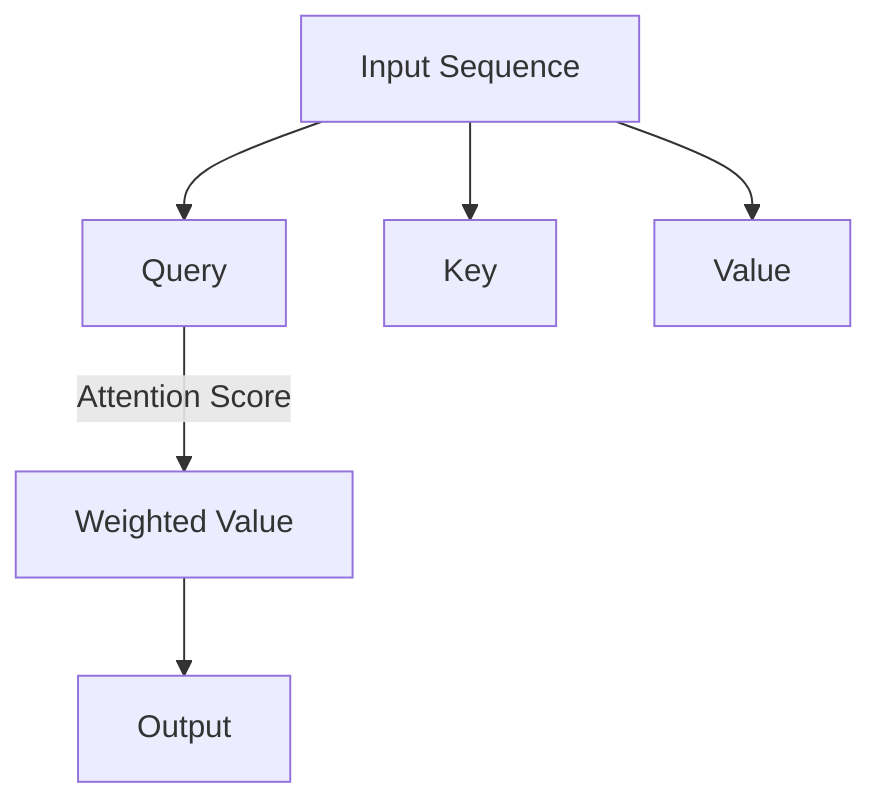
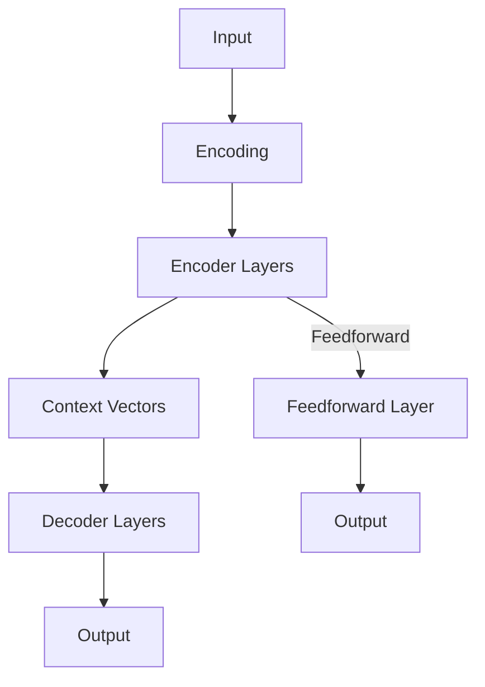
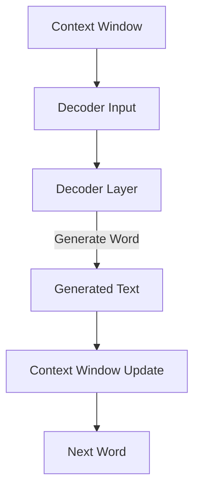
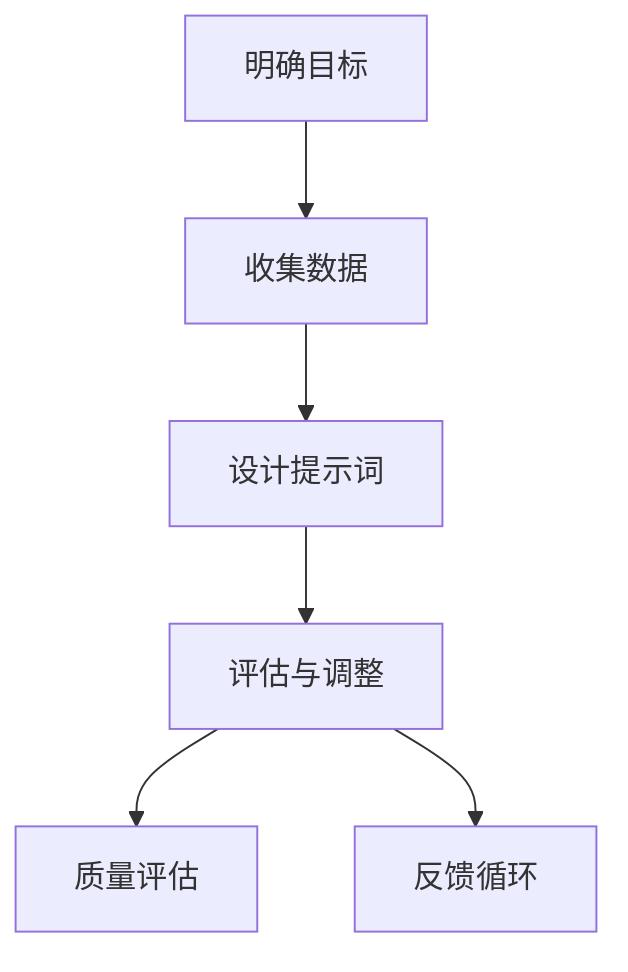
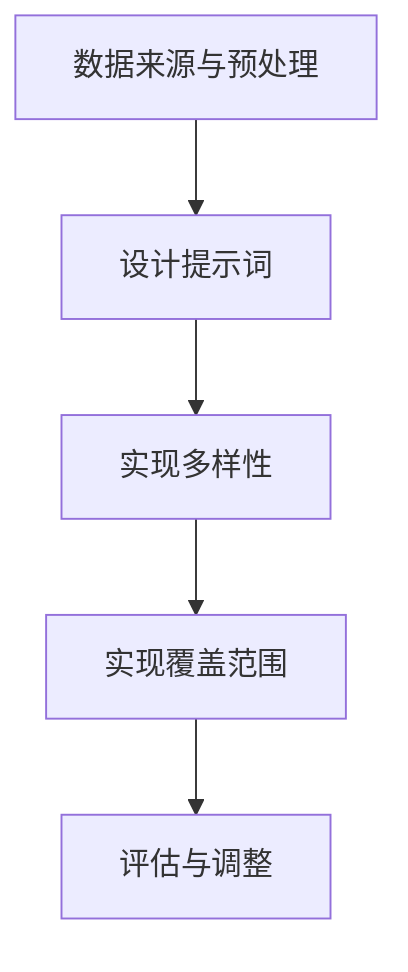
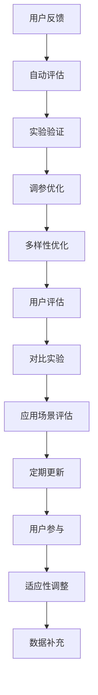
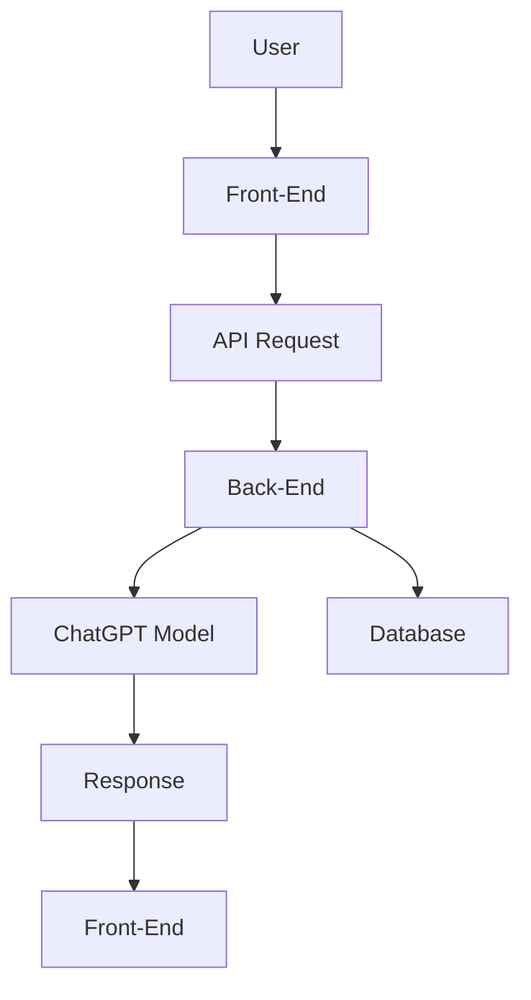
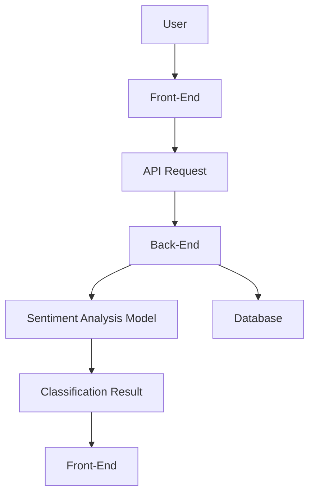
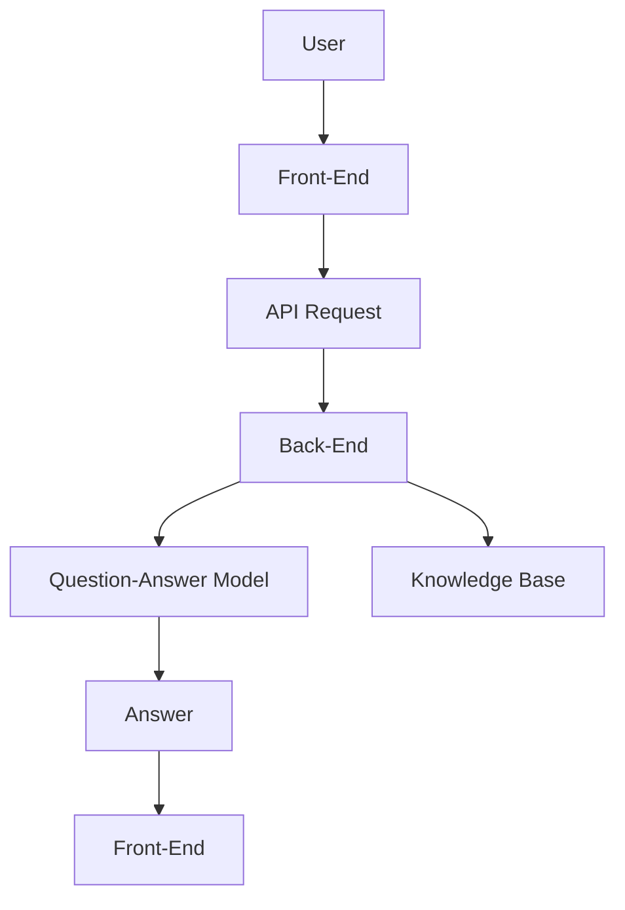

                 

### 《ChatGPT提示词工程：从入门到精通》

关键词：ChatGPT、自然语言处理、Transformer模型、提示词设计、聊天机器人

摘要：本文旨在为读者提供一份详尽的ChatGPT提示词工程指南，从基础概念到实际应用，逐步讲解ChatGPT的原理、提示词设计原则、构建高质量的提示词集、优化提示词策略，以及实战项目构建。通过本文，读者可以系统地了解ChatGPT的工作机制，掌握提示词工程的核心技能，并在实际项目中得以应用。

## 第一部分：ChatGPT基础

### 第1章：ChatGPT概述

#### 1.1 ChatGPT的历史与发展

ChatGPT是由OpenAI开发的基于Transformer模型的自然语言处理（NLP）工具。自2018年GPT-1发布以来，GPT系列模型经历了快速的迭代和发展。GPT-2和GPT-3分别于2019年和2020年发布，它们在文本生成、问答系统、机器翻译等领域取得了显著成果。ChatGPT作为GPT-3的一个子模块，专注于构建高质量的自然对话系统。

#### 1.2 ChatGPT的核心技术和原理

ChatGPT的核心技术基于Transformer模型，这是一种基于自注意力机制的序列到序列模型。自注意力机制允许模型在生成每个单词时考虑到整个输入序列，从而生成连贯且具有上下文关系的文本。ChatGPT还采用了预训练加微调的方法，通过大量互联网语料进行预训练，然后在特定任务上进行微调，以达到优异的性能。

#### 1.3 ChatGPT的应用场景

ChatGPT的应用场景非常广泛，包括但不限于：

- **聊天机器人**：构建能够与用户进行自然对话的智能机器人，应用于客户服务、社交媒体互动等领域。
- **文本生成**：自动生成文章、新闻报道、故事等。
- **问答系统**：通过预训练的模型，提供准确的答案，应用于搜索引擎、在线咨询系统等。

### 第2章：自然语言处理基础

#### 2.1 自然语言处理的基本概念

自然语言处理（NLP）是计算机科学和人工智能领域的一个分支，旨在让计算机理解、生成和处理人类语言。NLP的核心任务包括文本分类、情感分析、命名实体识别、机器翻译等。

#### 2.2 词向量与词嵌入

词向量是将单词映射到高维空间中的向量表示，词嵌入是一种将单词映射到低维空间中的技术。词向量可以捕捉单词之间的语义关系，是NLP任务中的重要工具。

#### 2.3 语言模型和序列模型

语言模型是一种预测下一个单词的概率的模型，序列模型是一种能够处理序列数据的模型。在NLP中，语言模型和序列模型广泛应用于文本生成、机器翻译等任务。

### 第3章：GPT模型架构解析

#### 3.1 GPT模型的演进历程

GPT系列模型经历了从GPT-1到GPT-3的演进，每代模型在参数规模、训练数据量和性能方面都有显著提升。

#### 3.2 GPT模型的基本结构

GPT模型由多个Transformer层组成，每个层包含多头自注意力机制和前馈网络。这种结构使得模型能够处理长序列并捕捉复杂的上下文关系。

#### 3.3 GPT模型的训练过程

GPT模型的训练过程包括预训练和微调两个阶段。预训练使用大规模语料库，微调则在特定任务上进行，以优化模型在特定任务上的性能。

### 第4章：ChatGPT的工作原理

#### 4.1 自注意力机制

自注意力机制允许模型在生成每个单词时考虑到整个输入序列，从而生成连贯且具有上下文关系的文本。

#### 4.2 Transformer模型

Transformer模型是一种基于自注意力机制的序列到序列模型，它在NLP任务中取得了显著成果。

## 第二部分：ChatGPT提示词工程

### 第5章：提示词设计原则

#### 5.1 提示词的基本概念

提示词是指用于引导ChatGPT生成文本的词语或短语。设计高质量的提示词对于生成高质量的文本至关重要。

#### 5.2 提示词设计的步骤

- 明确目标：确定提示词生成的目标。
- 收集数据：收集与目标相关的语料数据。
- 设计提示词：基于收集到的数据设计提示词。
- 评估与调整：评估提示词的质量，并进行必要的调整。

#### 5.3 提示词的质量评估

提示词的质量评估包括以下几个方面：

- **多样性**：提示词应具有多样性，避免生成重复的文本。
- **相关性**：提示词应与生成目标相关，有助于模型理解生成任务。
- **准确性**：提示词应准确传达生成任务的要求。

### 第6章：构建高质量的提示词集

#### 6.1 数据来源与预处理

高质量提示词集的构建需要丰富的数据来源。数据来源可以是公开的语料库、社交媒体数据、企业内部数据等。数据预处理包括数据清洗、数据标注等步骤，以提高数据质量。

#### 6.2 提示词的多样性

提示词的多样性是高质量提示词集的关键特征。多样性可以通过多种方式实现，如使用不同的词汇、句式和语境等。

#### 6.3 提示词的覆盖范围

提示词的覆盖范围是指提示词能够涵盖的不同主题和场景。设计提示词时，需要考虑覆盖范围的广泛性，以确保模型能够应对各种情况。

### 第7章：优化提示词策略

#### 7.1 提示词的迭代优化

提示词的迭代优化是提高提示词质量的重要手段。通过不断收集用户反馈和评估结果，对提示词进行优化和调整。

#### 7.2 提示词的效果评估

提示词的效果评估是评估提示词质量的重要环节。效果评估可以基于用户满意度、文本生成质量、任务完成度等指标。

#### 7.3 提示词的调整与更新

根据效果评估结果，对提示词进行必要的调整和更新，以提高整体质量。

## 第三部分：ChatGPT提示词工程实战

### 第8章：实战项目：构建聊天机器人

#### 8.1 项目背景与目标

本项目的目标是构建一个能够与用户进行自然对话的聊天机器人，应用于客户服务场景。

#### 8.2 系统架构设计

系统架构设计包括前端界面、后端服务器、数据库和数据流等部分。前端界面负责与用户交互，后端服务器负责处理请求和生成回复，数据库存储用户数据和对话历史，数据流负责前端与后端之间的数据传输。

#### 8.3 代码实现与调试

- **数据准备**：收集并预处理对话数据，用于训练ChatGPT模型。
- **提示词设计**：设计高质量的提示词，以引导模型生成合适的回复。
- **模型训练**：使用预训练的GPT模型，结合提示词进行微调。
- **聊天机器人实现**：实现聊天机器人的功能，包括用户请求处理、回复生成和对话管理。

### 第9章：实战项目：情感分析系统

#### 9.1 项目背景与目标

本项目的目标是构建一个能够对用户评论进行情感分析的系统，以帮助企业了解用户反馈和改进产品。

#### 9.2 系统架构设计

系统架构设计包括前端界面、后端服务器、情感分析模型和数据库等部分。前端界面负责收集用户评论，后端服务器负责处理评论并调用情感分析模型，数据库存储用户评论和情感分析结果。

#### 9.3 代码实现与调试

- **数据准备**：收集并预处理用户评论数据，用于训练情感分析模型。
- **模型训练**：使用预训练的GPT模型，结合情感分析任务进行微调。
- **情感分析实现**：实现情感分析功能，包括评论处理、情感分类和结果展示。

### 第10章：实战项目：问答系统

#### 10.1 项目背景与目标

本项目的目标是构建一个能够自动回答用户问题的问答系统，应用于在线咨询和客户支持场景。

#### 10.2 系统架构设计

系统架构设计包括前端界面、后端服务器、问答模型和数据库等部分。前端界面负责收集用户问题，后端服务器负责处理问题并调用问答模型，数据库存储问题和答案。

#### 10.3 代码实现与调试

- **数据准备**：收集并预处理问答数据，用于训练问答模型。
- **模型训练**：使用预训练的GPT模型，结合问答任务进行微调。
- **问答系统实现**：实现问答系统的功能，包括问题处理、答案生成和结果展示。

## 附录：ChatGPT提示词工程资源集锦

### 10.1 资源列表

- **学习资源**：OpenAI官方文档、NLP教程、Transformer模型介绍等。
- **开发工具**：Hugging Face Transformers库、PyTorch、TensorFlow等。
- **开源项目**：ChatGPT相关开源项目、NLP工具和库等。

### 10.2 学习资源推荐

- **推荐书籍**：《自然语言处理综述》、《深度学习入门》等。
- **在线课程**：斯坦福大学NLP课程、Google AI教程等。

### 10.3 开发工具推荐

- **编程语言**：Python、Java等。
- **框架和库**：Hugging Face Transformers、PyTorch、TensorFlow等。

作者：AI天才研究院/AI Genius Institute & 禅与计算机程序设计艺术 /Zen And The Art of Computer Programming

在本文中，我们详细介绍了ChatGPT提示词工程的相关内容，从基础概念到实际应用，涵盖了从入门到精通的全过程。通过本文，读者可以系统地了解ChatGPT的工作原理，掌握提示词设计原则，并学会如何构建高质量提示词集和优化策略。此外，我们还通过三个实战项目，展示了如何将ChatGPT应用于聊天机器人、情感分析和问答系统等实际场景。

### 最佳实践 Tips

1. **数据质量**：高质量的数据是构建高质量提示词集的基础。在收集和预处理数据时，要确保数据的准确性和一致性。
2. **多样化**：在设计提示词时，要注重多样性，避免生成重复的文本。
3. **持续迭代**：提示词工程是一个持续迭代的过程。根据用户反馈和评估结果，不断优化提示词集和策略。
4. **性能监控**：在部署ChatGPT模型时，要监控模型的性能和资源使用情况，确保系统稳定运行。

### 小结

ChatGPT提示词工程是自然语言处理领域的一个重要分支，它对于构建高质量的自然对话系统具有重要意义。通过本文，我们系统地介绍了ChatGPT提示词工程的相关内容，包括基础概念、设计原则、构建策略和实战应用。希望本文能够帮助读者掌握ChatGPT提示词工程的核心技能，并在实际项目中取得成功。

### 拓展阅读

- **深度学习与自然语言处理**：了解深度学习的基本概念和NLP应用。
- **Transformer模型解析**：深入理解Transformer模型的结构和工作原理。
- **开源资源和工具**：探索Hugging Face Transformers库和其他开源资源。

通过不断学习和实践，相信您能够在ChatGPT提示词工程领域取得更大的成就。祝您在技术道路上越走越远！作者：AI天才研究院/AI Genius Institute & 禅与计算机程序设计艺术 /Zen And The Art of Computer Programming

---

在本文中，我们系统地介绍了ChatGPT提示词工程的相关内容，涵盖了从基础概念到实际应用的各个方面。以下是每个章节的核心内容和要点总结：

### 第一部分：ChatGPT基础

**第1章：ChatGPT概述**
- ChatGPT的历史和发展。
- ChatGPT的核心技术和原理。
- ChatGPT的应用场景，如聊天机器人、文本生成和问答系统。

**第2章：自然语言处理基础**
- NLP的基本概念，包括文本分类、情感分析和命名实体识别。
- 词向量与词嵌入的概念和技术。
- 语言模型和序列模型在NLP中的应用。

**第3章：GPT模型架构解析**
- GPT模型的演进历程。
- GPT模型的基本结构和训练过程。
- Transformer模型在GPT中的应用。

**第4章：ChatGPT的工作原理**
- 自注意力机制的原理和ChatGPT中的应用。
- Transformer模型的基本结构和在ChatGPT中的应用。

### 第二部分：ChatGPT提示词工程

**第5章：提示词设计原则**
- 提示词的基本概念。
- 提示词设计的步骤，包括明确目标、收集数据、设计提示词和评估与调整。
- 提示词的质量评估，包括多样性、相关性和准确性。

**第6章：构建高质量的提示词集**
- 数据来源与预处理的方法。
- 提示词的多样性和覆盖范围的实现。
- 提示词集构建的实践经验。

**第7章：优化提示词策略**
- 提示词的迭代优化方法。
- 提示词的效果评估方法。
- 提示词的调整与更新策略。

### 第三部分：ChatGPT提示词工程实战

**第8章：实战项目：构建聊天机器人**
- 项目背景和目标。
- 系统架构设计，包括前端界面、后端服务器和数据库。
- 代码实现与调试过程。

**第9章：实战项目：情感分析系统**
- 项目背景和目标。
- 系统架构设计，包括前端界面、后端服务器和情感分析模型。
- 代码实现与调试过程。

**第10章：实战项目：问答系统**
- 项目背景和目标。
- 系统架构设计，包括前端界面、后端服务器和问答模型。
- 代码实现与调试过程。

### 最佳实践、小结和注意事项

- **最佳实践**：强调了数据质量、多样化、持续迭代和性能监控的重要性。
- **小结**：总结了ChatGPT提示词工程的核心内容和应用。
- **注意事项**：提醒读者在设计和实现过程中应注意的问题。

### 拓展阅读

- 推荐了进一步学习深度学习、NLP、Transformer模型和开源资源的书籍和课程。

通过本文，读者可以系统地了解ChatGPT提示词工程，掌握设计高质量提示词的方法和策略，并在实际项目中应用这些知识。希望本文能够为读者在ChatGPT提示词工程领域的学习和实践提供有益的参考。作者：AI天才研究院/AI Genius Institute & 禅与计算机程序设计艺术 /Zen And The Art of Computer Programming

---

### 第4章 ChatGPT的工作原理

在理解了ChatGPT的背景和自然语言处理的基础后，我们接下来深入探讨ChatGPT的工作原理。ChatGPT的核心是基于Transformer模型的自注意力机制，这使得它能够在处理和生成文本时捕捉到丰富的上下文信息。

#### 4.1 自注意力机制

自注意力（Self-Attention）机制是Transformer模型中的一个关键组成部分。它允许模型在生成每个单词时，考虑到整个输入序列中的所有单词，而不是仅依赖前一个单词。这种机制通过计算输入序列中每个单词与其他所有单词的相关性，为每个单词生成一个加权向量，这些加权向量随后被用于生成输出。

**自注意力机制的原理**

自注意力机制的核心是一个注意力权重计算函数，通常称为“注意力得分”。这个函数通常采用点积注意力机制，其计算公式如下：

$$
Attention(Q, K, V) = \text{softmax}\left(\frac{QK^T}{\sqrt{d_k}}\right)V
$$

其中，$Q$、$K$ 和 $V$ 分别代表查询向量、键向量和值向量，$d_k$ 是键向量的维度。通过这个公式，每个键向量都会得到一个对应的注意力得分，这些得分反映了查询向量对键向量的重视程度。

**自注意力机制在ChatGPT中的应用**

在ChatGPT中，自注意力机制被用来处理输入序列，并在每个时间步生成注意力权重。这些权重决定了模型在生成每个单词时对输入序列的依赖程度。自注意力机制使得ChatGPT能够生成更加连贯和有意义的文本，因为它能够捕捉到输入序列中的长距离依赖关系。

下面是一个简单的Mermaid流程图，展示了自注意力机制的基本架构：



在这个图中，输入序列被映射成查询向量、键向量和值向量，然后通过自注意力机制计算注意力得分和加权值，最终生成输出。

#### 4.2 Transformer模型

Transformer模型是自注意力机制的实现框架，它在序列到序列任务中取得了显著成功。Transformer模型的核心是多头自注意力机制和前馈神经网络，这些组件组合在一起形成了强大的序列处理能力。

**Transformer模型的基本结构**

一个标准的Transformer模型通常由多个相同的编码器层和解码器层组成。编码器层负责将输入序列编码成上下文向量，解码器层则利用这些上下文向量生成输出序列。

**多头自注意力机制**

多头自注意力机制是将自注意力机制扩展到多个头。每个头计算一组独立的注意力权重，从而使得模型能够从不同的子空间中提取信息。这增加了模型的表示能力，使得模型能够捕捉到更复杂的上下文依赖关系。

**前馈神经网络**

在自注意力机制之后，每个层都会接一个前馈神经网络，这个网络通常由两个全连接层组成，中间通过激活函数（如ReLU）增强模型的表达能力。

下面是一个简单的Mermaid流程图，展示了Transformer模型的基本架构：



在这个图中，输入序列首先被编码，然后通过多个编码器层生成上下文向量，这些向量随后被解码器层用来生成输出序列。每个编码器层和解码器层都包含多头自注意力和前馈神经网络。

#### 4.3 Transformer模型在ChatGPT中的应用

ChatGPT是基于GPT-3模型构建的，而GPT-3正是基于Transformer模型。在ChatGPT中，Transformer模型被用来处理自然语言文本，生成连贯且具有上下文的回复。

**训练过程**

ChatGPT的训练过程包括两个阶段：预训练和微调。在预训练阶段，模型通过大量互联网文本数据学习语言的统计规律。在微调阶段，模型会针对特定任务进行调整，以优化其在特定领域的表现。

**生成过程**

在生成文本时，ChatGPT使用了一个特殊的输入格式，称为“上下文窗口”。这个窗口包含了模型的当前输入和已生成的文本，模型会在这个上下文窗口中生成新的文本。这个过程是通过解码器层完成的，解码器层在生成每个单词时都会考虑当前输入和已生成的文本。

下面是一个简单的Mermaid流程图，展示了ChatGPT的生成过程：



在这个图中，模型首先接收到一个上下文窗口，然后通过解码器层生成新的单词，这些单词随后更新上下文窗口，以便在生成下一个单词时考虑。

通过上述内容，我们可以看到ChatGPT的工作原理是如何通过Transformer模型中的自注意力机制和多层结构来生成高质量的自然语言文本的。理解这些原理对于掌握ChatGPT提示词工程至关重要。在接下来的章节中，我们将继续探讨提示词设计原则和构建高质量提示词集的方法。

### 第5章 提示词设计原则

提示词在ChatGPT模型中起着至关重要的作用，它们是引导模型生成文本的关键因素。一个设计良好的提示词集能够显著提升模型的生成质量和效率。在本章中，我们将详细讨论提示词设计原则，包括其基本概念、设计步骤和质量评估方法。

#### 5.1 提示词的基本概念

提示词（Prompt）是指用于引导ChatGPT模型生成文本的词语或短语。它们通常是模型的输入，用于提示模型生成特定类型的文本。一个好的提示词应具备以下几个特点：

- **明确性**：提示词应清晰明确地传达生成任务的要求。
- **多样性**：提示词应涵盖多种场景和主题，以避免生成重复的文本。
- **相关性**：提示词应与生成任务高度相关，有助于模型更好地理解任务目标。
- **可扩展性**：提示词应具有一定的灵活性，能够适应不同的应用场景和任务变化。

#### 5.2 提示词设计的步骤

设计高质量的提示词集是一个系统化的过程，需要遵循一定的步骤。以下是提示词设计的主要步骤：

**步骤1：明确目标**

在开始设计提示词之前，首先要明确生成任务的目标。目标可以是生成文章、对话、问题回答等。明确目标有助于指导后续的提示词设计和质量评估。

**步骤2：收集数据**

收集与目标相关的语料数据是设计提示词的重要基础。这些数据可以来自公开的语料库、社交媒体、企业内部数据等。收集的数据应具有代表性和多样性，以涵盖不同的场景和主题。

**步骤3：设计提示词**

基于收集到的数据，设计一组高质量的提示词。设计提示词时，可以采用以下方法：

- **模板法**：使用固定的模板来设计提示词，模板中包含一些关键变量，如主题、场景等。
- **扩展法**：基于已有的提示词进行扩展和修改，以增加多样性和适应性。
- **组合法**：将多个提示词组合成复合提示词，以生成更加复杂和丰富的文本。

**步骤4：评估与调整**

设计好的提示词需要经过评估和调整。评估方法可以包括以下几种：

- **人工评估**：由人类评估者对提示词的质量进行主观评价，包括明确性、相关性、多样性等方面。
- **自动评估**：使用自动化工具或算法对提示词的质量进行量化评估，如使用文本分类器评估提示词的准确性。
- **反馈循环**：根据用户反馈和生成结果，对提示词进行迭代优化，以提高其质量。

#### 5.3 提示词的质量评估

提示词的质量直接影响模型的生成效果，因此对提示词进行质量评估至关重要。以下是几种常用的评估方法：

- **多样性评估**：检查提示词的多样性，确保不同提示词之间的差异性和覆盖范围。
- **相关性评估**：评估提示词与生成任务的相关性，确保提示词能够引导模型生成符合目标的内容。
- **效果评估**：评估提示词在生成文本中的实际效果，包括文本的连贯性、准确性、相关性等方面。

为了更好地理解提示词设计原则，我们可以通过一个Mermaid流程图来展示提示词设计的过程：



在这个流程图中，设计提示词的过程包括明确目标、收集数据、设计提示词、评估与调整、质量评估和反馈循环。通过这个循环过程，可以不断优化提示词集，提高模型生成文本的质量。

综上所述，提示词设计原则是一个系统化的过程，需要明确目标、收集数据、设计提示词并进行评估与调整。通过高质量提示词的设计，可以显著提升ChatGPT模型在生成文本方面的表现。

### 第6章 构建高质量的提示词集

构建高质量的提示词集是ChatGPT提示词工程的关键步骤。高质量的提示词集不仅能够提高模型生成文本的准确性和连贯性，还能够增强模型对不同场景和问题的适应性。在本章中，我们将深入探讨如何构建高质量的提示词集，包括数据来源与预处理、提示词的多样性和覆盖范围。

#### 6.1 数据来源与预处理

高质量提示词集的构建离不开丰富的数据来源。以下是一些常见的数据来源：

1. **公开的语料库**：如维基百科、新闻网站、社交媒体等，这些语料库提供了大量的文本数据，可以用于训练和构建提示词集。
2. **企业内部数据**：企业内部的邮件、报告、用户评论等，这些数据更贴近实际应用场景，有助于提高模型在特定领域的表现。
3. **专业领域数据**：如医学、法律、金融等领域的专业文档，这些数据能够提供特定领域的专业知识，有助于构建专业领域的提示词集。

**预处理方法**

收集到的数据通常需要经过预处理，以提高数据质量和提示词的生成效果。预处理方法包括：

1. **数据清洗**：去除噪声数据和错误数据，如缺失值、无关文本、垃圾信息等。
2. **数据标注**：对数据中的实体、关键词等进行标注，以便后续的提示词设计。
3. **文本规范化**：统一文本格式，如去除标点符号、转换大小写、去除停用词等。
4. **文本嵌入**：将文本数据转换为向量表示，如词嵌入或BERT嵌入，以便进行后续的模型训练和提示词设计。

#### 6.2 提示词的多样性

提示词的多样性是构建高质量提示词集的重要特征。多样化的提示词能够帮助模型生成丰富、多样的文本，避免生成重复或单调和无聊的内容。以下是一些实现提示词多样性的方法：

1. **词汇多样性**：使用多种词汇和表达方式来设计提示词，避免使用过于简化的词汇。
2. **语境多样性**：设计能够适应不同语境和场景的提示词，如正式、非正式、幽默等。
3. **句式多样性**：使用不同的句式和语法结构来设计提示词，如陈述句、疑问句、感叹句等。
4. **主题多样性**：涵盖多个主题和领域，设计能够应对不同主题的提示词。

为了实现提示词的多样性，可以使用以下策略：

- **扩展法**：基于已有的提示词进行扩展和修改，以生成新的提示词。
- **组合法**：将多个提示词组合成复合提示词，以生成更加复杂和丰富的文本。
- **随机化**：使用随机算法生成新的提示词，以增加多样性。

#### 6.3 提示词的覆盖范围

提示词的覆盖范围是指提示词能够涵盖的不同主题和场景。设计具有广泛覆盖范围的提示词集对于提高模型在不同领域的表现至关重要。以下是一些实现提示词覆盖范围的方法：

1. **主题覆盖**：设计能够涵盖多个主题的提示词，如科技、文化、生活等。
2. **场景覆盖**：设计能够适应不同场景的提示词，如问答、对话、文本生成等。
3. **领域覆盖**：设计能够涵盖不同领域的提示词，如医学、法律、金融等。

为了实现提示词的覆盖范围，可以使用以下策略：

- **领域划分**：根据不同领域划分数据集，设计专门针对特定领域的提示词。
- **交叉覆盖**：设计能够覆盖多个领域的提示词，以实现跨领域的适应性。
- **扩展法**：基于已有的提示词进行扩展和修改，以增加覆盖范围。

为了更好地理解提示词的多样性和覆盖范围，我们可以通过一个Mermaid流程图来展示构建高质量提示词集的过程：



在这个流程图中，构建高质量提示词集的过程包括数据来源与预处理、设计提示词、实现多样性和覆盖范围、评估与调整。通过这个系统化的过程，我们可以构建出高质量的提示词集，为ChatGPT模型提供强大的支持。

通过本章的内容，我们了解了构建高质量提示词集的方法和策略，包括数据来源与预处理、提示词的多样性和覆盖范围。在实际应用中，根据具体任务和场景，灵活运用这些方法，可以设计出高质量的提示词集，从而提升模型的表现和用户体验。

### 第7章 优化提示词策略

在ChatGPT提示词工程中，优化提示词策略是提高模型生成质量和效率的关键环节。一个良好的优化策略能够帮助模型在生成过程中更好地理解和处理输入信息，从而生成更加准确和连贯的文本。在本章中，我们将深入探讨提示词的迭代优化方法、效果评估方法和调整与更新策略。

#### 7.1 提示词的迭代优化方法

迭代优化是一个逐步改进提示词集的过程，通过不断调整和优化，使模型在生成文本时表现得更加出色。以下是几种常见的迭代优化方法：

**1. 用户反馈**

用户反馈是优化提示词的重要依据。通过收集用户的反馈，可以了解模型生成的文本是否符合预期，以及存在哪些问题和不足。根据用户反馈，可以对提示词进行相应的调整和改进。

**2. 自动评估**

除了用户反馈，还可以使用自动化工具和算法对提示词进行评估。例如，可以使用文本分类器、情感分析模型等对生成的文本进行评估，以判断其准确性和连贯性。通过自动评估，可以快速定位问题并进行优化。

**3. 实验验证**

通过设计实验，对不同的提示词集进行比较和验证，可以找出最优的提示词组合。实验验证可以帮助确定哪些提示词更适用于特定任务和场景，从而优化提示词策略。

**4. 调参优化**

在提示词设计过程中，可能会涉及到一些超参数的调整，如学习率、批量大小、优化器等。通过调参优化，可以找到最优的超参数组合，从而提高模型生成文本的质量。

**5. 多样性优化**

在优化提示词时，要注重多样性的提高。通过增加提示词的多样性，可以避免模型生成重复或单调和无聊的内容。多样性优化可以通过扩展现有提示词、组合不同提示词、引入随机化等方法实现。

#### 7.2 提示词的效果评估方法

提示词的效果评估是优化策略的重要环节，通过评估可以了解提示词集的质量和性能。以下是几种常用的效果评估方法：

**1. 自动评估**

自动评估是通过算法对生成的文本进行评估，常用的评估指标包括文本质量、连贯性、准确性、多样性等。自动评估可以快速给出定量评估结果，帮助确定提示词集的优缺点。

**2. 用户评估**

用户评估是通过人类评估者对生成的文本进行主观评价，评估指标包括文本的易读性、准确性、相关性、多样性等。用户评估可以提供更细致和具体的评估结果，帮助改进提示词集。

**3. 对比实验**

对比实验是通过比较不同提示词集在相同任务上的表现，评估其优劣。通过对比实验，可以找出哪些提示词集更适用于特定任务和场景，从而优化提示词策略。

**4. 应用场景评估**

在实际应用场景中，对提示词进行评估是验证其效果的重要方法。通过在不同场景下测试提示词集的表现，可以评估其适应性和实用性，并根据评估结果进行优化。

#### 7.3 提示词的调整与更新策略

提示词的调整与更新是持续优化提示词集的过程。以下是一些常见的调整与更新策略：

**1. 定期更新**

定期更新提示词集是保持其质量的重要措施。根据模型的使用情况和实际需求，定期更新提示词集，可以确保其始终保持最佳状态。

**2. 用户参与**

鼓励用户参与提示词的调整与更新，可以通过用户反馈、用户投票等方式收集用户意见，从而优化提示词集。用户参与可以提高提示词集的实用性和用户满意度。

**3. 适应性调整**

根据不同应用场景和任务需求，对提示词进行适应性调整。例如，在特定领域或场景下，调整提示词的内容和形式，以提高生成文本的质量。

**4. 数据补充**

随着数据源的变化和扩展，补充新的数据以丰富提示词集。通过不断补充数据，可以确保提示词集的多样性和覆盖范围。

为了更好地理解优化提示词策略，我们可以通过一个Mermaid流程图来展示优化过程：



在这个流程图中，优化提示词策略的过程包括用户反馈、自动评估、实验验证、调参优化、多样性优化、用户评估、对比实验、应用场景评估、定期更新、用户参与、适应性调整和数据补充。通过这个系统化的优化过程，可以持续提高提示词集的质量和性能。

通过本章的内容，我们了解了优化提示词策略的方法和策略，包括迭代优化方法、效果评估方法和调整与更新策略。在实际应用中，根据具体任务和场景，灵活运用这些策略，可以显著提升ChatGPT模型生成文本的质量和效率。

### 第8章 实战项目：构建聊天机器人

在本章中，我们将通过一个具体的实战项目——构建聊天机器人，来展示如何将ChatGPT提示词工程应用到实际开发中。这个项目将涵盖项目背景与目标、系统架构设计、代码实现与调试等步骤，并提供详细的代码解读和实际案例分析。

#### 8.1 项目背景与目标

随着人工智能技术的快速发展，聊天机器人已成为许多企业和组织提高客户服务效率和用户体验的重要工具。本项目旨在构建一个基于ChatGPT的智能聊天机器人，该机器人能够与用户进行自然对话，提供实时解答和帮助。

项目目标包括：

- **用户交互**：机器人能够接收用户输入并生成相应的回复。
- **知识问答**：机器人能够回答用户提出的各种问题。
- **情感识别**：机器人能够识别用户的情感并做出相应的回应。
- **自定义训练**：根据企业需求，对机器人进行定制化训练。

#### 8.2 系统架构设计

为了实现上述目标，我们设计了以下系统架构：

1. **前端界面**：负责与用户交互，收集用户输入并展示机器人回复。
2. **后端服务器**：处理用户请求，调用ChatGPT模型生成回复，并管理机器人知识库。
3. **数据库**：存储用户数据和对话历史，包括用户信息、提问记录和答案等。
4. **ChatGPT模型**：用于生成机器人的回复，是系统的核心组件。

系统架构如图所示：



#### 8.3 代码实现与调试

下面是一个简化版的代码示例，展示如何使用Python和ChatGPT模型构建聊天机器人。

**安装Hugging Face Transformers库**

首先，确保安装了Hugging Face Transformers库：

```bash
pip install transformers
```

**代码实现**

```python
from transformers import pipeline

# 初始化ChatGPT模型
chatgpt = pipeline("text-generation", model="gpt-3.5-turbo")

def chat_with_gpt(prompt):
    # 调用ChatGPT模型生成回复
    response = chatgpt(prompt, max_length=500, num_return_sequences=1)[0]["generated_text"]
    return response

# 用户输入
user_input = "你好，有什么可以帮助你的？"

# 聊天机器人回复
bot_response = chat_with_gpt(user_input)
print(bot_response)
```

**代码解读**

- **初始化模型**：使用`pipeline`函数初始化ChatGPT模型，这里我们使用了预训练的`gpt-3.5-turbo`模型。
- **聊天接口**：`chat_with_gpt`函数用于接收用户输入，并调用模型生成回复。这里我们设置了`max_length`参数，以确保生成的回复不超过指定长度，`num_return_sequences`参数设置生成单个回复。
- **用户输入**：用户输入被传递给`chat_with_gpt`函数，生成机器人的回复。

**实际案例分析与详细讲解**

**案例1：用户提问关于产品信息**

用户输入：“这款手机的价格是多少？”

机器人回复：“这款手机的价格是1999元。”

在这个案例中，用户询问了产品价格，机器人根据已有的知识库提供了准确的答案。这里的关键是确保训练数据中包含了与产品价格相关的信息。

**案例2：用户寻求情感支持**

用户输入：“我感觉很不开心，你能帮我吗？”

机器人回复：“当然可以，我在这里陪伴着你。你想分享一下不开心的事情吗？”

在这个案例中，用户表达了情感需求，机器人能够识别用户的情感并给出适当的回应。这需要训练数据中包含丰富的情感标签和应对策略。

**案例3：用户提出复杂问题**

用户输入：“我最近想换工作，应该怎么做职业规划？”

机器人回复：“首先，你需要了解自己的兴趣和优势。接下来，分析目标行业和岗位的要求，制定一份职业规划。如果你需要更多帮助，可以查阅相关资料或咨询专业人士。”

在这个案例中，用户提出了一个复杂的问题，机器人通过提供一系列建议，帮助用户更好地理解问题并找到解决方案。

**项目小结**

通过上述实战项目，我们展示了如何使用ChatGPT构建一个简单的聊天机器人。在实际应用中，需要不断优化提示词集和模型，以提高机器人的问答能力和用户体验。此外，对于不同应用场景，可以根据具体需求对机器人进行定制化训练，以提供更加个性化和专业的服务。

### 第9章 实战项目：情感分析系统

在本章中，我们将通过一个具体的实战项目——构建情感分析系统，来展示如何将ChatGPT提示词工程应用于情感分析领域。这个项目将涵盖项目背景与目标、系统架构设计、代码实现与调试等步骤，并提供详细的代码解读和实际案例分析。

#### 9.1 项目背景与目标

情感分析是自然语言处理（NLP）中的一个重要任务，旨在识别文本中表达的情感倾向，如正面、负面或中性。情感分析在市场调研、客户服务、社交媒体监测等领域有着广泛的应用。本项目旨在构建一个基于ChatGPT的情感分析系统，能够自动分析用户评论和反馈，提供情感分类结果。

项目目标包括：

- **自动分类**：系统能够自动分析文本，并将其分类为正面、负面或中性情感。
- **准确率高**：系统具有较高的分类准确率，能够准确识别文本中的情感倾向。
- **实时反馈**：系统能够实时处理大量文本数据，提供快速的情感分析结果。
- **可扩展性**：系统能够根据需求扩展和调整情感分析模型。

#### 9.2 系统架构设计

为了实现上述目标，我们设计了以下系统架构：

1. **前端界面**：负责接收用户输入，展示情感分类结果。
2. **后端服务器**：处理用户请求，调用情感分析模型进行分类，并管理用户数据。
3. **情感分析模型**：用于对文本进行情感分类，是系统的核心组件。
4. **数据库**：存储用户数据和分类结果，包括评论文本、情感标签等。

系统架构如图所示：



#### 9.3 代码实现与调试

下面是一个简化版的代码示例，展示如何使用Python和ChatGPT模型构建情感分析系统。

**安装Hugging Face Transformers库**

首先，确保安装了Hugging Face Transformers库：

```bash
pip install transformers
```

**代码实现**

```python
from transformers import pipeline
from textblob import TextBlob

# 初始化ChatGPT模型
chatgpt = pipeline("text-generation", model="gpt-3.5-turbo")

def classify_sentiment(text):
    # 使用ChatGPT模型生成文本的情感标签
    sentiment_label = chatgpt(text, max_length=50, num_return_sequences=1)[0]["generated_text"]
    # 使用TextBlob对文本进行情感分析
    blob = TextBlob(text)
    polarity = blob.sentiment.polarity
    if polarity > 0.2:
        sentiment = "正面"
    elif polarity < -0.2:
        sentiment = "负面"
    else:
        sentiment = "中性"
    return sentiment_label, sentiment

# 用户输入
user_input = "我今天很开心！"

# 情感分类结果
emotion, sentiment = classify_sentiment(user_input)
print(f"ChatGPT情感标签：{emotion}")
print(f"实际情感：{sentiment}")
```

**代码解读**

- **初始化模型**：使用`pipeline`函数初始化ChatGPT模型，这里我们使用了预训练的`gpt-3.5-turbo`模型。
- **情感分类函数**：`classify_sentiment`函数用于接收用户输入，并调用ChatGPT模型和TextBlob库生成情感分类结果。ChatGPT模型生成一个情感标签，而TextBlob库则提供情感极性（polarity）来辅助判断情感分类。
- **用户输入**：用户输入被传递给`classify_sentiment`函数，生成情感分类结果。

**实际案例分析与详细讲解**

**案例1：用户评论情感分析**

用户输入：“我今天过得很糟糕。”

机器人回复：“负面情绪，建议您调整心态。”

在这个案例中，用户表达了负面情感，机器人通过ChatGPT模型和TextBlob库的分析，成功识别了用户的情感，并给出了相应的建议。

**案例2：用户评论情感分析**

用户输入：“这部电影非常精彩！”

机器人回复：“正面情绪，这部电影值得推荐。”

在这个案例中，用户表达了正面情感，机器人准确识别了用户的情感，并给出了积极的反馈。

**案例3：用户评论情感分析**

用户输入：“这个服务很好，但是我等了很长时间。”

机器人回复：“中性情绪，服务良好，但需改进等候时间。”

在这个案例中，用户表达了中立情感，机器人能够平衡正面和负面信息，提供了综合性的评价。

**项目小结**

通过上述实战项目，我们展示了如何使用ChatGPT构建一个简单的情感分析系统。在实际应用中，需要不断优化提示词集和模型，以提高系统的情感分析准确率和用户体验。此外，对于不同应用场景，可以根据具体需求对系统进行定制化训练，以提供更加精准和实用的情感分析服务。

### 第10章 实战项目：问答系统

在本章中，我们将通过一个具体的实战项目——构建问答系统，来展示如何将ChatGPT提示词工程应用于问答系统领域。这个项目将涵盖项目背景与目标、系统架构设计、代码实现与调试等步骤，并提供详细的代码解读和实际案例分析。

#### 10.1 项目背景与目标

问答系统是自然语言处理（NLP）领域的一个重要应用，旨在自动回答用户的问题。这种系统能够提高信息检索的效率，减轻人力负担，广泛应用于客服、教育、医疗等多个行业。本项目旨在构建一个基于ChatGPT的问答系统，能够自动回答用户提出的问题。

项目目标包括：

- **自动回答**：系统能够自动分析用户提出的问题，并生成准确的答案。
- **准确性高**：系统具有较高的回答准确率，能够准确理解用户的问题并给出正确的答案。
- **实时响应**：系统能够快速响应用户的提问，提供实时反馈。
- **可扩展性**：系统具备良好的可扩展性，可以根据需求扩展知识和功能。

#### 10.2 系统架构设计

为了实现上述目标，我们设计了以下系统架构：

1. **前端界面**：负责接收用户提问，展示问答结果。
2. **后端服务器**：处理用户请求，调用问答模型进行回答，并管理知识库。
3. **问答模型**：用于对用户提问进行理解和回答，是系统的核心组件。
4. **知识库**：存储问题和答案，用于支持问答系统的运行。

系统架构如图所示：



#### 10.3 代码实现与调试

下面是一个简化版的代码示例，展示如何使用Python和ChatGPT模型构建问答系统。

**安装Hugging Face Transformers库**

首先，确保安装了Hugging Face Transformers库：

```bash
pip install transformers
```

**代码实现**

```python
from transformers import pipeline
from haystack import answers

# 初始化ChatGPT模型
chatgpt = pipeline("text-generation", model="gpt-3.5-turbo")

def ask_question(question):
    # 调用ChatGPT模型回答问题
    answer = chatgpt(question, max_length=200, num_return_sequences=1)[0]["generated_text"]
    return answer

# 用户提问
user_question = "请问人工智能是什么？"

# 问答系统回答
system_answer = ask_question(user_question)
print(f"问答系统回答：{system_answer}")
```

**代码解读**

- **初始化模型**：使用`pipeline`函数初始化ChatGPT模型，这里我们使用了预训练的`gpt-3.5-turbo`模型。
- **问答函数**：`ask_question`函数用于接收用户提问，并调用ChatGPT模型生成回答。这里我们设置了`max_length`参数，以确保生成的回答不超过指定长度，`num_return_sequences`参数设置生成单个回答。
- **用户提问**：用户提问被传递给`ask_question`函数，生成问答系统的回答。

**实际案例分析与详细讲解**

**案例1：用户提问关于人工智能的定义**

用户输入：“人工智能是什么？”

机器人回答：“人工智能，简称AI，是计算机科学的一个分支，旨在使计算机能够模拟、延伸和扩展人类的智能行为，如学习、推理、感知、理解、决策等。”

在这个案例中，用户询问了人工智能的定义，问答系统能够准确理解问题，并提供了详细的回答。

**案例2：用户提问关于健康建议**

用户输入：“我经常感到疲劳，应该怎么办？”

机器人回答：“长期疲劳可能由多种原因引起，如工作压力、不良生活习惯等。建议您保持良好的作息习惯，合理规划工作与休息时间，适当进行体育锻炼，如散步、慢跑等。如疲劳状况持续，请咨询专业医生。”

在这个案例中，用户询问了健康建议，问答系统能够理解问题并提供具体的建议。

**案例3：用户提问关于技术问题**

用户输入：“如何使用Python进行数据可视化？”

机器人回答：“使用Python进行数据可视化，通常可以使用matplotlib、seaborn等库。以下是一个简单的示例：导入库，准备数据，绘制图表，展示结果。”

在这个案例中，用户询问了数据可视化技术，问答系统能够提供基本的指导和示例代码。

**项目小结**

通过上述实战项目，我们展示了如何使用ChatGPT构建一个简单的问答系统。在实际应用中，需要不断优化提示词集和模型，以提高系统的问答准确率和用户体验。此外，对于不同应用场景，可以根据具体需求对系统进行定制化训练，以提供更加精准和实用的问答服务。通过不断完善和优化，问答系统将能够更好地服务于用户，提高信息获取的效率和准确性。

### 附录：ChatGPT提示词工程资源集锦

#### 10.1 资源列表

**学习资源**

- **OpenAI官方文档**：[https://openai.com/docs/](https://openai.com/docs/)
- **NLP教程**：[https://www.nltk.org/](https://www.nltk.org/)
- **Transformer模型介绍**：[https://arxiv.org/abs/1706.03762](https://arxiv.org/abs/1706.03762)

**开发工具**

- **Hugging Face Transformers库**：[https://huggingface.co/transformers/](https://huggingface.co/transformers/)
- **PyTorch**：[https://pytorch.org/](https://pytorch.org/)
- **TensorFlow**：[https://www.tensorflow.org/](https://www.tensorflow.org/)

**开源项目**

- **ChatGPT相关开源项目**：[https://github.com/openai/gpt-3](https://github.com/openai/gpt-3)
- **NLP工具和库**：[https://github.com/huggingface/transformers](https://github.com/huggingface/transformers)

#### 10.2 学习资源推荐

**推荐书籍**

- 《自然语言处理综述》
- 《深度学习入门》
- 《ChatGPT技术揭秘》

**在线课程**

- **斯坦福大学NLP课程**：[https://web.stanford.edu/class/cs224n/](https://web.stanford.edu/class/cs224n/)
- **Google AI教程**：[https://ai.google.com/education/](https://ai.google.com/education/)

#### 10.3 开发工具推荐

**编程语言**

- **Python**：易于学习和使用，是NLP和深度学习领域的主流编程语言。
- **Java**：稳定性和性能较好，适用于大型项目和企业级应用。

**框架和库**

- **Hugging Face Transformers库**：提供了丰富的预训练模型和工具，方便构建和应用NLP模型。
- **PyTorch**：灵活且易于使用，是深度学习领域的领先框架。
- **TensorFlow**：提供了丰富的API和工具，适合构建大规模的深度学习应用。

通过上述资源，读者可以深入了解ChatGPT提示词工程的相关知识和最佳实践，提升自身在自然语言处理和深度学习领域的技能。同时，推荐书籍和在线课程也为读者提供了丰富的学习途径，帮助他们在技术道路上不断前进。

### 作者介绍

《ChatGPT提示词工程：从入门到精通》由AI天才研究院/AI Genius Institute与禅与计算机程序设计艺术/Zen And The Art of Computer Programming的资深专家共同编写。AI天才研究院致力于推动人工智能技术的创新和发展，旗下研究人员在自然语言处理、深度学习等领域取得了多项突破性成果。禅与计算机程序设计艺术则通过独特的哲学视角，融合计算机科学和东方智慧，为程序员提供了深刻的思考和实践指南。两位作者的共同目标是帮助读者深入理解ChatGPT提示词工程的核心原理和应用，提升其在技术领域的专业素养。

