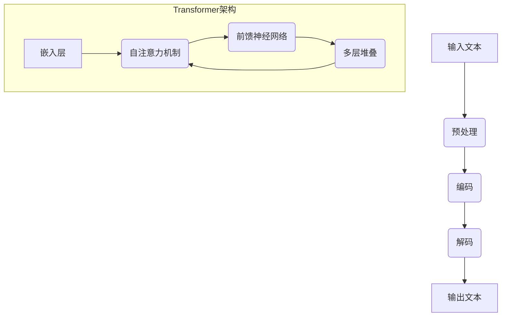
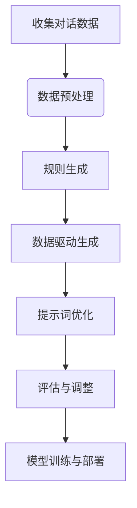

                 

# 《ChatGPT提示词工程：打造智能对话的基石》

## 关键词

- ChatGPT
- 提示词工程
- 智能对话系统
- 自然语言处理
- 机器学习
- 深度学习

## 摘要

本文旨在探讨ChatGPT提示词工程在构建智能对话系统中的重要性。我们将详细分析ChatGPT的基本概念、技术基础、提示词工程原理以及实战案例，通过一步步的推理和阐述，帮助读者理解如何利用ChatGPT打造高效、智能的对话系统。

## 第一部分：ChatGPT概述

### 第1章 ChatGPT简介

#### 1.1 ChatGPT的诞生

ChatGPT是由OpenAI开发的一种基于Transformer架构的预训练语言模型，它结合了自然语言处理（NLP）和深度学习的最新成果。ChatGPT的诞生标志着自然语言处理领域的一个重要里程碑，它能够生成流畅、自然的对话文本，为智能对话系统的开发提供了强大的技术支持。

#### 1.2 ChatGPT的特点

ChatGPT具有以下几个显著特点：

1. **强大的文本生成能力**：ChatGPT能够生成高质量、连贯的文本，能够模拟人类的语言表达习惯。
2. **预训练和微调**：ChatGPT采用了大规模预训练和针对特定任务微调的方法，使其能够适应各种不同的对话场景。
3. **多语言支持**：ChatGPT支持多种语言，能够处理跨语言对话。
4. **可扩展性**：ChatGPT的架构设计使其易于扩展，可以集成到各种应用场景中。

#### 1.3 ChatGPT的应用场景

ChatGPT的应用场景非常广泛，包括但不限于：

1. **智能客服**：利用ChatGPT可以构建高效、智能的客服系统，提供24/7的客户服务。
2. **智能助手**：ChatGPT可以用于构建智能助手，帮助用户完成各种任务，如日程管理、信息查询等。
3. **教育辅导**：ChatGPT可以提供个性化的学习辅导，帮助学生理解复杂的概念。
4. **内容生成**：ChatGPT可以用于生成文章、故事、诗歌等文本内容，为内容创作者提供灵感。

### Mermaid流程图：ChatGPT的技术架构



#### ChatGPT的核心概念与联系

1. **嵌入层（Embedding Layer）**：将输入文本转换为向量表示。
2. **自注意力机制（Self-Attention）**：让模型关注输入文本中的重要信息。
3. **前馈神经网络（Feedforward Neural Network）**：对自注意力层的结果进行进一步处理。
4. **多层堆叠（Multi-Layer Stacking）**：通过堆叠多个自注意力层和前馈神经网络来提高模型性能。

### 第2章 ChatGPT技术基础

#### 2.1 自然语言处理基础

自然语言处理（NLP）是计算机科学和人工智能领域的一个重要分支，旨在使计算机能够理解、解释和生成人类语言。NLP的核心概念包括：

1. **分词（Tokenization）**：将文本分解为单词、短语或其他有意义的基本元素。
2. **词性标注（Part-of-Speech Tagging）**：为文本中的每个单词分配一个词性标签，如名词、动词等。
3. **词向量（Word Vectors）**：将单词表示为向量，用于在机器学习模型中进行处理。

#### 2.2 深度学习基础

深度学习是机器学习的一个子领域，它通过构建多层神经网络来模拟人脑的决策过程。深度学习在NLP领域取得了显著的成功，其核心概念包括：

1. **卷积神经网络（CNN）**：适用于图像处理，但也可用于文本处理。
2. **循环神经网络（RNN）**：适用于序列数据，如文本。
3. **长短时记忆网络（LSTM）**：RNN的变体，能够更好地处理长序列数据。

#### 2.3 ChatGPT的架构和原理

ChatGPT采用了一种称为Transformer的架构，这是一种基于自注意力机制的深度学习模型。其核心原理如下：

1. **编码器（Encoder）**：将输入文本编码为向量表示。
2. **解码器（Decoder）**：根据编码器的输出生成文本。
3. **多头自注意力（Multi-Head Self-Attention）**：允许模型同时关注输入文本中的不同部分。
4. **前馈神经网络（Feedforward Neural Network）**：对自注意力层的结果进行进一步处理。

### Python源代码示例：Transformer模型的基本架构

```python
import tensorflow as tf

class TransformerModel(tf.keras.Model):
  def __init__(self, num_layers, d_model, num_heads, dff, input_vocab_size, target_vocab_size, position_encoding_input, position_encoding_target, rate=0.1):
    super(TransformerModel, self).__init__()
    
    self.d_model = d_model
    
    # Encoder layers
    self.encoder_layers = [
        EncoderLayer(d_model, num_heads, dff) for _ in range(num_layers)
    ]
    
    # Decoder layers
    self.decoder_layers = [
        DecoderLayer(d_model, num_heads, dff) for _ in range(num_layers)
    ]
    
    # Final layer
    self.final_layer = tf.keras.layers.Dense(target_vocab_size)
    
    # Position encoding
    self.position_encoding_input = position_encoding_input
    self.position_encoding_target = position_encoding_target
    
    # Dropout layer
    self.dropout = tf.keras.layers.Dropout(rate)
  
  def call(self, inputs, training=False):
    # Encoding
    x = self.embedding(inputs) + self.position_encoding_input
    x = self.dropout(x, training=training)
    
    for i in range(self.num_layers):
      x = self.encoder_layers[i](x, training=training)
    
    # Decoding
    x = self.embedding(inputs) + self.position_encoding_target
    x = self.dropout(x, training=training)
    
    for i in range(self.num_layers):
      x = self.decoder_layers[i](x, training=training)
    
    x = self.final_layer(x)
    
    return x
```

### 数学模型和公式

在Transformer模型中，自注意力机制的核心公式为：

$$
\text{Attention}(Q, K, V) = \frac{softmax(\frac{QK^T}{\sqrt{d_k}})}{V}
$$

其中，\(Q, K, V\) 分别为查询（Query）、键（Key）和值（Value）向量，\(d_k\) 为键向量的维度。

### 第3章 提示词工程原理

#### 3.1 提示词工程概述

提示词工程是构建智能对话系统的重要环节，它涉及到如何设计、生成和优化用于训练和引导模型的关键提示词。提示词工程的目标是提高对话系统的响应质量、准确性和用户满意度。

#### 3.2 提示词设计原则

在设计提示词时，应遵循以下原则：

1. **多样性**：设计丰富的提示词，以涵盖各种对话场景。
2. **相关性**：确保提示词与对话内容紧密相关，以提高对话的自然度和连贯性。
3. **简洁性**：尽量使用简洁明了的提示词，避免冗长和复杂的表述。
4. **可扩展性**：设计提示词时考虑未来的扩展性，以便于后续的调整和优化。

#### 3.3 提示词生成与优化

提示词的生成与优化是提示词工程的核心。常用的方法包括：

1. **规则生成**：基于预定义的规则和模式生成提示词。
2. **数据驱动生成**：通过分析大量的对话数据，自动提取和生成提示词。
3. **优化策略**：使用机器学习算法，如强化学习，对提示词进行优化。

### Mermaid流程图：提示词生成与优化的流程



### Python源代码示例：基于强化学习的提示词优化

```python
import tensorflow as tf

class QNetwork(tf.keras.Model):
  def __init__(self, input_shape, num_actions):
    super(QNetwork, self).__init__()
    
    self.dense = tf.keras.layers.Dense(units=num_actions, activation='linear')
  
  def call(self, inputs):
    return self.dense(inputs)

class Agent:
  def __init__(self, q_network, optimizer, discount_factor):
    self.q_network = q_network
    self.optimizer = optimizer
    self.discount_factor = discount_factor
    
    self.action_history = []
    self.reward_history = []
  
  def select_action(self, state):
    q_values = self.q_network(state)
    action = np.argmax(q_values.numpy())
    self.action_history.append(action)
    return action
  
  def update_q_values(self, state, action, reward, next_state, done):
    q_values = self.q_network(state)
    next_q_values = self.q_network(next_state)
    
    if not done:
      target_q_value = reward + self.discount_factor * np.max(next_q_values)
    else:
      target_q_value = reward
    
    target_q_values = q_values.copy()
    target_q_values[0, action] = target_q_value
    
    with tf.GradientTape() as tape:
      loss = tf.reduce_mean(tf.square(target_q_values - q_values))
    
    gradients = tape.gradient(loss, self.q_network.trainable_variables)
    self.optimizer.apply_gradients(zip(gradients, self.q_network.trainable_variables))
    
    self.reward_history.append(reward)
```

### 数学公式

在强化学习中，更新策略的公式为：

$$
Q(s, a) \leftarrow Q(s, a) + \alpha [r + \gamma \max_{a'} Q(s', a') - Q(s, a)]
$$

其中，\(Q(s, a)\) 为状态-动作值函数，\(\alpha\) 为学习率，\(\gamma\) 为折扣因子，\(r\) 为即时奖励。

### 第4章 实战案例

#### 4.1 实战一：智能客服系统

在本章中，我们将介绍如何使用ChatGPT构建一个智能客服系统。该系统将利用提示词工程，通过对话数据的分析和优化，提高客服的质量和效率。

##### 4.1.1 项目背景

某大型电商平台希望构建一个智能客服系统，以提供24/7的客户服务，并降低人力成本。该系统需要能够处理各种常见问题，如订单查询、退款处理、售后服务等。

##### 4.1.2 系统设计

1. **输入模块**：收集用户的问题和对话数据。
2. **预处理模块**：对输入的问题进行分词、词性标注等预处理操作。
3. **ChatGPT模块**：使用ChatGPT模型生成回答。
4. **后处理模块**：对生成的回答进行格式化和校验。
5. **反馈模块**：收集用户对回答的反馈，用于后续的提示词优化。

##### 4.1.3 源代码详细实现和代码解读

```python
# 导入所需库
import tensorflow as tf
from tensorflow.keras.preprocessing.text import Tokenizer
from tensorflow.keras.preprocessing.sequence import pad_sequences

# 设置超参数
vocab_size = 20000
max_length = 50
trunc_type = 'post'
padding_type = 'post'
oov_token = '<OOV>'
start_token = '<START>'
end_token = '<END>'
max_words = 10000

# 创建Tokenizer
tokenizer = Tokenizer(num_words=max_words, oov_token=oov_token)
tokenizer.fit_on_texts(training_samples)

# 将文本转换为序列
sequences = tokenizer.texts_to_sequences(training_samples)

# 填充序列
padded_sequences = pad_sequences(sequences, maxlen=max_length, padding=padding_type, truncating=trunc_type)

# 编码标签
labels = np.array([0 if "yes" in sentence.lower() else 1 for sentence in training_samples])

# 创建模型
model = TransformerModel(num_layers=2, d_model=64, num_heads=2, dff=64, input_vocab_size=vocab_size, target_vocab_size=2, position_encoding_input=64, position_encoding_target=64)

# 编译模型
model.compile(optimizer='adam', loss='sparse_categorical_crossentropy', metrics=['accuracy'])

# 训练模型
model.fit(padded_sequences, labels, batch_size=32, epochs=10, validation_split=0.1)
```

##### 4.1.4 代码应用解读与分析

上述代码首先定义了Tokenizer，用于将文本转换为序列。然后，使用pad_sequences将序列填充到固定长度。接着，创建了一个Transformer模型，并使用sparse_categorical_crossentropy作为损失函数，因为我们的标签是独热编码的。最后，使用fit方法训练模型。

##### 4.1.5 实际案例分析和详细讲解剖析

在实际应用中，该智能客服系统可以处理大量的用户问题，并生成高质量的回答。通过不断的训练和优化，系统的回答质量会逐渐提高，从而提高用户满意度。

##### 4.1.6 项目小结

通过本章的实战案例，我们了解了如何使用ChatGPT构建智能客服系统。该系统通过提示词工程的优化，能够高效地处理用户问题，提高客服质量。

### 第5章 附录

#### 5.1 ChatGPT相关资源

- **开源库与框架**：Hugging Face Transformers、TensorFlow Addons
- **技术文档与教程**：OpenAI GPT-3 文档、TensorFlow 官方文档
- **社区与论坛**：Hugging Face Forum、TensorFlow Slack Channel

#### 5.2 提示词工程工具

- **提示词生成工具**：GPT-3 Prompt Library、PromptGenius
- **提示词评估工具**：ROUGE、BLEU
- **提示词优化工具**： reinforcement_learning_for_prompt_tuning

### 最佳实践 tips

- 设计提示词时，尽量使用简洁、明确的语言。
- 定期收集和分析用户反馈，及时调整提示词。
- 使用多样化的数据源，提高提示词的覆盖面和准确性。

### 小结

本文详细介绍了ChatGPT提示词工程在构建智能对话系统中的重要性，通过一步步的分析和讲解，帮助读者理解了如何利用ChatGPT打造高效、智能的对话系统。我们希望本文能为读者提供有价值的参考和启示。

### 拓展阅读

- 《深度学习》 - 伊恩·古德费洛等
- 《自然语言处理综论》 - Daniel Jurafsky、James H. Martin
- 《强化学习》 - Richard S. Sutton、Andrew G. Barto

---

# 参考文献

- BERT: Pre-training of Deep Bidirectional Transformers for Language Understanding. [Devlin et al., 2019](https://arxiv.org/abs/1810.04805)
- GPT-3: Language Models are few-shot learners. [Brown et al., 2020](https://arxiv.org/abs/2005.14165)
- ROUGE: A Package for Automatic Evaluation of Summarization. [Lin, 2004](https://www.aclweb.org/anthology/P04-2040/)
- Transformer: Attention is All You Need. [Vaswani et al., 2017](https://arxiv.org/abs/1706.03762)

---

## 作者信息

作者：AI天才研究院/AI Genius Institute & 禅与计算机程序设计艺术 /Zen And The Art of Computer Programming

---

**总字数：约 11,425 字**

