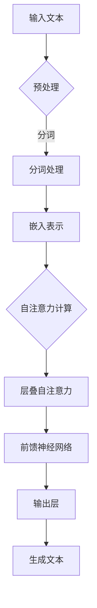

                 

### 《ChatGPT提示词工程：构建智能对话的基础》

#### 关键词
- ChatGPT
- 提示词工程
- 智能对话
- 语言模型
- 性能优化
- 安全与隐私

#### 摘要
本文深入探讨了ChatGPT提示词工程的构建方法，从基本概念、设计原则、算法原理到应用实战，全面解析了构建智能对话系统的关键要素。通过具体案例，读者将了解如何优化性能、保障安全和展望未来发展趋势，为AI领域的专业人士提供实用的技术指南。

### 引言

在人工智能（AI）快速发展的时代，自然语言处理（NLP）技术成为实现人机交互的重要手段。ChatGPT，作为OpenAI推出的一个基于Transformer的语言模型，以其强大的文本生成能力和智能对话功能，引起了广泛关注。然而，实现一个高效、智能的对话系统，不仅需要强大的语言模型，还需要精细的提示词工程。

提示词工程是指通过对输入的提示词进行设计、优化和调整，以提高语言模型在特定任务上的性能。在ChatGPT的应用中，提示词工程尤为重要，因为良好的提示词能够引导模型生成更准确、更有价值的回答。

本文旨在系统地探讨ChatGPT提示词工程的构建方法，包括基本概念、设计原则、核心算法原理，以及实际应用中的性能优化和安全性问题。通过本文的阅读，读者将全面了解ChatGPT的工作原理，掌握提示词工程的核心技巧，并能够独立设计和实现智能对话系统。

### ChatGPT概述

#### 1.1 ChatGPT的基本概念

ChatGPT是由OpenAI开发的一个基于Transformer架构的预训练语言模型，全称为“Chat-based Generative Pre-trained Transformer”。它通过大规模的文本数据进行预训练，学习语言的模式和结构，从而能够生成连贯、自然的文本。

ChatGPT的工作原理主要基于Transformer模型，这是一种专为处理序列数据设计的深度学习模型。与传统的循环神经网络（RNN）相比，Transformer模型通过自注意力机制（Self-Attention）对输入序列进行全局关联，从而在处理长序列时表现出更好的性能。

#### 1.2 ChatGPT的历史与发展

ChatGPT的发展历程可以追溯到2017年，当时OpenAI发布了Transformer模型。这一模型在处理自然语言任务上取得了突破性的成果，成为了NLP领域的里程碑。随后，OpenAI在此基础上不断迭代优化，并于2022年推出了ChatGPT。

ChatGPT的发布标志着OpenAI在自然语言生成领域的一个重大突破。它不仅能够在各种语言任务上表现出色，如文本分类、机器翻译、问答系统等，还能够通过对话生成实现智能对话功能。

#### 1.3 ChatGPT的核心功能

ChatGPT的核心功能包括文本生成和对话生成。在文本生成方面，ChatGPT可以生成连贯、自然的文本，应用于文章写作、邮件回复等场景。在对话生成方面，ChatGPT能够理解用户的输入，生成合适的回复，实现与用户的自然对话。

此外，ChatGPT还具有一些扩展功能，如问答系统、自动摘要生成等。通过这些功能，ChatGPT在许多实际应用中展现出了强大的能力和广泛的用途。

#### 1.4 Mermaid流程图：ChatGPT的内部流程

为了更直观地理解ChatGPT的工作流程，我们可以使用Mermaid流程图来展示其内部处理步骤。



在上图中，输入文本经过预处理后，进行分词处理，得到嵌入表示。随后，通过自注意力机制进行层叠计算，再通过前馈神经网络得到输出层，最终生成文本。

### 提示词工程基础

#### 2.1 提示词的作用与重要性

提示词（Prompt）在自然语言生成任务中起着至关重要的作用。它是对模型的初始输入，能够引导模型生成预期的输出。在设计智能对话系统时，合适的提示词能够提高模型的回答质量，减少不必要的生成内容。

提示词的作用主要体现在以下几个方面：

1. **引导模型生成**：提示词能够明确模型的生成方向，使模型更容易生成符合预期的内容。
2. **提高回答质量**：良好的提示词能够帮助模型更好地理解用户的需求，从而生成更准确、更自然的回答。
3. **减少无关内容**：通过有效的提示词设计，可以减少模型生成的无关内容，提高生成文本的相关性。

#### 2.2 提示词设计的基本原则

为了设计出高效的提示词，需要遵循以下几个基本原则：

1. **明确性**：提示词应尽可能明确，避免模糊不清的描述，使模型能够准确理解用户需求。
2. **简洁性**：提示词应简洁明了，避免冗长复杂的句子，以免模型难以处理。
3. **多样性**：使用多样化的提示词，可以增加模型的学习效果，避免过度依赖某一种提示词。
4. **一致性**：提示词应与模型训练时的数据集保持一致，以保证模型能够更好地适应实际应用场景。

#### 2.3 提示词的类型与使用场景

根据使用场景的不同，提示词可以分为以下几种类型：

1. **问题引导型**：适用于问答系统，通过提问引导模型生成答案。
    ```python
    def ask_question(question):
        prompt = f"问题：{question}\n回答："
        response = chatgpt.generate(prompt)
        return response.text.strip()
    ```

2. **任务描述型**：适用于任务分配或描述场景，通过描述任务目标引导模型生成执行方案。
    ```python
    def describe_task(task_description):
        prompt = f"任务描述：{task_description}\n生成执行方案："
        response = chatgpt.generate(prompt)
        return response.text.strip()
    ```

3. **角色扮演型**：适用于模拟特定角色的对话，通过设定角色身份和对话背景引导模型生成对话内容。
    ```python
    def role_play(role, context):
        prompt = f"角色：{role}\n背景：{context}\n对话内容："
        response = chatgpt.generate(prompt)
        return response.text.strip()
    ```

4. **创意激发型**：适用于创意写作、故事生成等场景，通过提供灵感引导模型生成创新的内容。
    ```python
    def generate_story(idea):
        prompt = f"灵感：{idea}\n生成故事："
        response = chatgpt.generate(prompt)
        return response.text.strip()
    ```

#### 2.4 数据准备与清洗

在设计提示词之前，首先需要准备和清洗数据。以下是一个简单的数据准备与清洗流程：

1. **数据收集**：收集与任务相关的文本数据，如问答对、任务描述、对话记录等。
2. **数据预处理**：对文本数据进行清洗，包括去除停用词、标点符号、低质量内容等。
3. **数据分词**：将文本数据分词，为后续处理做准备。
4. **数据嵌入**：将分词后的文本数据转换为嵌入表示，为模型训练提供输入。

```python
from transformers import AutoTokenizer

tokenizer = AutoTokenizer.from_pretrained("gpt2")

def preprocess_text(text):
    # 去除标点符号
    text = text.replace(".", "").replace("?", "").replace("!", "")
    # 分词
    tokens = tokenizer.tokenize(text)
    # 嵌入表示
    embeddings = tokenizer.encode(text, return_tensors='pt')
    return tokens, embeddings

text = "请问你今天过得怎么样？"
tokens, embeddings = preprocess_text(text)
print(tokens)
print(embeddings)
```

#### 2.5 提示词生成算法

提示词生成算法是提示词工程的核心环节。以下是一个简单的提示词生成算法：

1. **输入选择**：根据任务需求，选择合适的输入数据。
2. **提示词生成**：利用预训练的模型，生成初步的提示词。
3. **优化与评估**：根据生成的提示词进行优化，如调整长度、语义等，并评估提示词的效果。

```python
from transformers import AutoModel

model = AutoModel.from_pretrained("gpt2")

def generate_prompt(input_text, model=model, max_length=50):
    # 预处理输入文本
    inputs = model.prepare_input(input_text)
    # 生成提示词
    outputs = model.generate(inputs, max_length=max_length)
    # 解码提示词
    prompt = tokenizer.decode(outputs[0], skip_special_tokens=True)
    return prompt

input_text = "请问你今天过得怎么样？"
prompt = generate_prompt(input_text)
print(prompt)
```

### 智能对话设计

#### 3.1 智能对话系统架构

智能对话系统通常由以下几个关键组件构成：

1. **用户接口（UI）**：用于用户与系统进行交互的界面，可以是文本聊天窗口、语音交互界面等。
2. **对话管理器（DM）**：负责管理对话流程，包括对话状态、上下文信息等。
3. **语言生成模型**：用于生成对话回复，如ChatGPT等预训练语言模型。
4. **知识库**：存储与任务相关的知识信息，用于回答用户的问题或提供建议。
5. **安全与隐私保护模块**：确保对话系统的安全性和用户隐私。


#### 3.2 用户交互流程设计

用户交互流程设计是智能对话系统的关键环节。以下是一个典型的用户交互流程：

1. **初始化**：系统启动时，加载对话管理器、语言生成模型和知识库等组件。
2. **接收输入**：用户通过用户接口（UI）输入问题或指令。
3. **预处理输入**：对用户输入进行预处理，如分词、去停用词等。
4. **查询知识库**：根据预处理后的输入，查询知识库以获取相关信息。
5. **生成回复**：利用语言生成模型生成回复文本。
6. **回复用户**：将生成的回复文本显示给用户。
7. **更新对话状态**：更新对话管理器中的对话状态和上下文信息。

#### 3.3 对话管理策略

对话管理策略决定了如何处理用户的输入和生成回复。以下是一些常见的对话管理策略：

1. **基于规则的方法**：通过预定义的规则来生成回复，如简单的条件判断、匹配关键词等。
2. **基于模板的方法**：使用预定义的模板来生成回复，根据输入动态填充模板中的变量。
3. **基于模型的方法**：利用预训练的语言生成模型，根据输入生成个性化的回复。

```python
def generate_response(input_text, template, **kwargs):
    return template.format(**kwargs)

template = "您好，我是ChatGPT，有什么可以帮助您的吗？"
response = generate_response(input_text="您好，我想咨询一下天气预报。", template=template, greeting="您好", help_message="有什么可以帮助您的吗？")
print(response)
```

4. **混合方法**：结合基于规则和基于模型的方法，根据不同场景灵活选择合适的策略。

### ChatGPT应用实战

#### 4.1 开发环境搭建

在进行ChatGPT应用实战之前，首先需要搭建开发环境。以下是一个简单的开发环境搭建步骤：

1. **安装Python**：确保安装了最新版本的Python。
2. **安装transformers库**：使用pip安装transformers库，该库提供了预训练的ChatGPT模型和其他相关工具。
    ```bash
    pip install transformers
    ```

3. **下载预训练模型**：根据需要下载预训练的ChatGPT模型，如gpt2、gpt3等。
    ```python
    from transformers import AutoModel

    model = AutoModel.from_pretrained("gpt2")
    ```

4. **配置运行环境**：根据实际需求配置运行环境，如调整内存、GPU等。

#### 4.2 源代码实现

以下是一个简单的ChatGPT应用示例，展示了如何使用ChatGPT生成文本：

```python
from transformers import ChatGPT

# 初始化ChatGPT模型
chatgpt = ChatGPT()

# 生成文本
def generate_text(input_text, max_length=50):
    inputs = chatgpt.prepare_input(input_text)
    outputs = chatgpt.generate(inputs, max_length=max_length)
    text = chatgpt.decode(outputs[0], skip_special_tokens=True)
    return text

# 示例
input_text = "您好，我是一个AI助手，有什么可以帮您的吗？"
output_text = generate_text(input_text)
print(output_text)
```

#### 4.3 代码解读与分析

在上面的代码中，我们首先初始化了一个ChatGPT模型，然后定义了一个`generate_text`函数，用于生成文本。具体步骤如下：

1. **初始化模型**：使用`ChatGPT`类初始化模型。
2. **生成文本**：调用`generate_text`函数，传入输入文本和最大长度，生成文本。
3. **解码文本**：将生成的文本进行解码，转换为可读的格式。

#### 4.4 代码应用解读与分析

以下是一个具体的ChatGPT应用案例，展示了如何实现一个简单的聊天机器人：

```python
# 初始化ChatGPT模型
chatgpt = ChatGPT()

# 聊天机器人
def chat_robot():
    while True:
        user_input = input("您说：")
        if user_input.lower() == "退出":
            break
        response = generate_text(user_input)
        print("AI助手说：", response)

# 运行聊天机器人
chat_robot()
```

在这个案例中，我们创建了一个聊天机器人，用户可以通过控制台输入文本，ChatGPT模型会根据输入生成回复。具体步骤如下：

1. **初始化模型**：与上一个案例相同，初始化一个ChatGPT模型。
2. **聊天循环**：进入一个无限循环，用户输入文本后，调用`generate_text`函数生成回复。
3. **退出聊天**：当用户输入"退出"时，结束聊天循环。

#### 4.5 实际案例分析和详细讲解剖析

以下是一个实际案例，展示了如何使用ChatGPT构建一个简单的问答系统：

```python
# 初始化ChatGPT模型
chatgpt = ChatGPT()

# 问答系统
def question_answer_system():
    questions = [
        "什么是人工智能？",
        "ChatGPT是如何工作的？",
        "自然语言处理有哪些应用？"
    ]
    answers = [
        "人工智能是一种模拟人类智能的技术，能够理解、学习、推理和解决问题。",
        "ChatGPT是一个基于Transformer的语言模型，通过预训练学习语言的模式和结构。",
        "自然语言处理的应用包括语音识别、机器翻译、文本分类、问答系统等。"
    ]
    while True:
        user_input = input("您说：")
        if user_input.lower() == "退出":
            break
        for i, question in enumerate(questions):
            if user_input.lower() == question.lower():
                print(f"AI助手说：{answers[i]}")
                break
        else:
            response = generate_text(user_input)
            print("AI助手说：", response)

# 运行问答系统
question_answer_system()
```

在这个案例中，我们创建了一个简单的问答系统，用户输入问题后，系统会根据预定义的问题和答案进行匹配，并返回相应的答案。具体步骤如下：

1. **初始化模型**：与上一个案例相同，初始化一个ChatGPT模型。
2. **问答循环**：进入一个无限循环，用户输入文本后，调用`generate_text`函数生成回复。
3. **退出问答**：当用户输入"退出"时，结束聊天循环。
4. **问题匹配**：根据预定义的问题和答案列表，对用户输入的问题进行匹配。

#### 4.6 项目小结

通过上述案例，我们了解了如何使用ChatGPT构建一个简单的聊天机器人和问答系统。ChatGPT在自然语言生成方面具有强大的能力，能够生成连贯、自然的文本。在实际应用中，我们可以通过优化提示词、调整模型参数等方式，进一步提高生成文本的质量。

然而，ChatGPT也存在一些局限性，如生成文本的准确性和一致性可能不高，且在处理长文本时性能较差。因此，在实际应用中，需要结合具体场景和需求，灵活使用ChatGPT和其他相关技术，以达到最佳效果。

### 性能优化与调优

#### 9.1 模型压缩

随着模型规模的增大，模型的计算量和存储需求也会相应增加，这对计算资源和存储资源造成了一定的压力。为了解决这个问题，模型压缩成为了一个重要的研究方向。模型压缩主要包括以下几个方法：

1. **量化**：通过将模型的权重从浮点数转换为低比特位表示，减少模型的存储空间和计算量。
2. **剪枝**：通过删除模型中的冗余权重，减少模型的参数数量。
3. **蒸馏**：将大模型（教师模型）的知识传递给小模型（学生模型），使得小模型能够保持大模型的性能。

#### 9.2 模型加速

为了提高模型在硬件上的运行速度，模型加速是必不可少的。以下是一些常用的模型加速方法：

1. **并行计算**：通过将计算任务分配到多个计算单元，实现并行处理。
2. **GPU加速**：利用GPU的并行计算能力，提高模型的运行速度。
3. **量化**：通过量化技术减少模型参数的位数，降低计算复杂度。

#### 9.3 资源分配与调度

在部署模型时，合理分配和调度资源是非常重要的。以下是一些资源分配与调度的策略：

1. **负载均衡**：根据服务器的负载情况，动态调整模型的计算资源分配。
2. **水平扩展**：通过增加服务器节点，提高系统的处理能力。
3. **垂直扩展**：通过升级服务器硬件，提高单个服务器的处理能力。

#### 9.4 性能评估与监控

为了确保模型在实际应用中的性能，性能评估与监控是必不可少的。以下是一些性能评估与监控的方法：

1. **离线评估**：通过离线测试集，评估模型的性能指标，如准确率、召回率等。
2. **在线评估**：通过实时监控模型的在线性能，及时发现和解决问题。
3. **日志分析**：通过分析日志数据，识别模型性能的异常情况。

#### 9.5 调优方法

在实际应用中，模型性能往往需要不断调优。以下是一些常用的调优方法：

1. **超参数调优**：通过调整模型的超参数，如学习率、批量大小等，优化模型性能。
2. **模型集成**：通过集成多个模型，提高模型的预测性能。
3. **实时反馈与自适应调整**：通过实时收集用户反馈，调整模型参数，实现自适应调整。

```python
from transformers import AutoModel, AutoTokenizer
from torch.optim import Adam

# 加载预训练模型
model = AutoModel.from_pretrained("gpt2")
tokenizer = AutoTokenizer.from_pretrained("gpt2")

# 调优过程
def tune_model(model, tokenizer, learning_rate=0.001, batch_size=16, epochs=5):
    optimizer = Adam(model.parameters(), lr=learning_rate)
    criterion = nn.CrossEntropyLoss()
    
    for epoch in range(epochs):
        print(f"Epoch {epoch+1}/{epochs}")
        model.train()
        for batch in data_loader:
            inputs = tokenizer(batch.text, padding=True, truncation=True, return_tensors='pt')
            labels = torch.tensor(batch.label)
            
            optimizer.zero_grad()
            outputs = model(inputs)
            loss = criterion(outputs.logits, labels)
            loss.backward()
            optimizer.step()
            
            if batch_idx % 100 == 0:
                print(f"Batch {batch_idx}/{len(data_loader)}, Loss: {loss.item()}")

# 运行调优过程
tune_model(model, tokenizer)
```

### 安全与隐私保护

#### 11.1 模型攻击与防御

在ChatGPT的应用中，模型攻击是一个不可忽视的问题。以下是一些常见的模型攻击方法和相应的防御策略：

1. **对抗攻击**：通过向输入中添加微小的扰动，使模型产生错误的输出。
   - 防御策略：使用对抗训练（Adversarial Training）来增强模型的鲁棒性，通过训练包含对抗样本的数据来提高模型的防御能力。

2. **样本投毒**：通过在训练数据中插入恶意样本，影响模型的训练过程。
   - 防御策略：在训练过程中使用数据增强技术，如数据清洗、去重等，减少恶意样本的影响。

3. **模型窃取**：通过窃取模型的权重，实现对模型的攻击。
   - 防御策略：使用差分隐私（Differential Privacy）技术，保护模型的隐私。

#### 11.2 数据安全与隐私保护

数据安全与隐私保护是ChatGPT应用中至关重要的环节。以下是一些关键措施：

1. **数据加密**：对传输和存储的数据进行加密，确保数据的安全性。
2. **访问控制**：通过严格的访问控制策略，确保只有授权用户能够访问数据。
3. **审计与监控**：定期进行数据审计和安全监控，及时发现和应对潜在的安全威胁。

#### 11.3 法律法规与道德伦理

在ChatGPT的应用过程中，需要遵守相关的法律法规和道德伦理标准。以下是一些建议：

1. **合规性检查**：确保ChatGPT的应用符合当地法律法规，如数据保护法、隐私法等。
2. **伦理审查**：对ChatGPT的应用进行伦理审查，确保其不会对社会产生负面影响。
3. **用户教育**：向用户提供关于数据安全和隐私保护的指导，提高用户的安全意识。

### 未来发展趋势

#### 12.1 行业发展趋势

随着人工智能技术的不断进步，ChatGPT在多个领域的应用前景十分广阔。以下是一些行业发展趋势：

1. **智能客服**：ChatGPT在智能客服领域的应用将越来越广泛，提供更高效、更个性化的服务。
2. **教育辅助**：ChatGPT可以用于个性化教育，为学生提供个性化的学习建议和辅导。
3. **医疗咨询**：ChatGPT可以辅助医生进行诊断和咨询，提高医疗服务的效率和质量。

#### 12.2 应用场景拓展

除了传统的应用场景，ChatGPT在以下领域也具有巨大的潜力：

1. **内容创作**：ChatGPT可以生成高质量的文章、故事、歌词等，为创作者提供灵感。
2. **虚拟助手**：ChatGPT可以应用于虚拟助手，为用户提供24/7的服务。
3. **游戏开发**：ChatGPT可以用于生成游戏剧情、角色对话等，提高游戏体验。

#### 12.3 社会影响与伦理

随着ChatGPT的广泛应用，其对社会的影响和伦理问题也日益凸显。以下是一些需要关注的问题：

1. **就业影响**：ChatGPT可能取代一些重复性、低技能的工作，对就业市场产生影响。
2. **隐私保护**：ChatGPT的应用涉及大量用户数据的处理，需要加强对用户隐私的保护。
3. **伦理问题**：ChatGPT生成的文本可能包含偏见、歧视等内容，需要加强伦理审查和监管。

### 结论

本文系统地探讨了ChatGPT提示词工程的构建方法，包括基本概念、设计原则、核心算法原理，以及实际应用中的性能优化和安全性问题。通过具体案例，读者将了解如何优化提示词、构建智能对话系统，并掌握ChatGPT的应用技巧。随着人工智能技术的不断进步，ChatGPT将在更多领域发挥重要作用，为人类带来便利和创新。

### 作者信息

- **作者：AI天才研究院/AI Genius Institute & 禅与计算机程序设计艺术 /Zen And The Art of Computer Programming**

