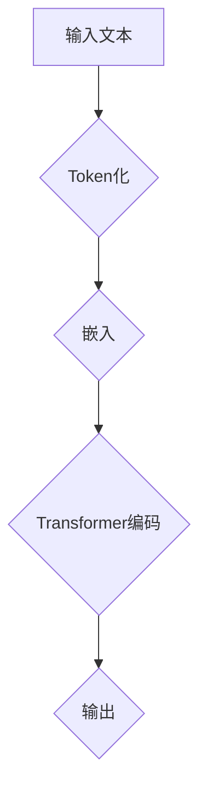

                 

### 《ChatGPT提示词工程：构建智能对话的进阶技巧》

#### 关键词：ChatGPT，提示词工程，智能对话系统，GPT模型，算法原理，Python代码，数学模型，实战案例

#### 摘要：
本文将深入探讨《ChatGPT提示词工程：构建智能对话的进阶技巧》，从概述、基础、技巧、应用实战等多个角度，详细介绍ChatGPT的原理、提示词设计方法，以及如何在智能对话系统中应用ChatGPT。通过Python代码和数学模型，我们将理解GPT模型的内部工作机制，并探索如何优化和提升对话系统的质量。最后，通过实际案例，我们将展示如何搭建开发环境、实现源代码，并进行项目总结和最佳实践分享。

---

### 第1章: ChatGPT提示词工程概述

#### 1.1 ChatGPT与提示词工程

**ChatGPT简介**

ChatGPT是由OpenAI开发的一种基于GPT-3.5的预训练语言模型，具有强大的文本生成和对话能力。它通过大量的文本数据进行训练，能够理解和生成人类语言，实现自然流畅的对话交互。

**提示词工程的重要性**

提示词工程是构建智能对话系统的关键环节。通过精心设计的提示词，我们可以引导ChatGPT生成符合预期和用户需求的内容。提示词工程不仅影响对话的质量和效果，也决定了系统的用户体验。

#### 1.2 智能对话系统简介

**智能对话系统的构成**

智能对话系统通常由自然语言处理（NLP）模块、对话管理模块、用户界面模块等组成。NLP模块负责处理用户输入的文本信息，对话管理模块负责维护对话状态和控制对话流程，用户界面模块则提供用户与系统交互的接口。

**智能对话系统的发展历程**

智能对话系统的发展经历了从规则驱动到统计模型，再到深度学习的过程。早期的对话系统依赖于预定义的规则，而现代对话系统则通过机器学习和深度学习技术实现更灵活和智能的交互。

**智能对话系统的应用场景**

智能对话系统广泛应用于客服、客户服务、智能助手、虚拟助手等领域。它能够提供24/7不间断的服务，提高客户满意度，降低企业运营成本。

---

### 第2章: ChatGPT基础

#### 2.1 GPT模型原理

**GPT模型简介**

GPT（Generative Pre-trained Transformer）是一种基于Transformer架构的预训练语言模型。它通过在大量文本数据上进行预训练，学习到语言的内在结构和规律，从而能够生成高质量的自然语言文本。

**GPT模型的工作原理**

GPT模型基于自注意力机制，通过多层Transformer结构对输入文本进行编码，生成对应的高维表示。在生成文本时，GPT模型会根据当前输入和已生成的文本，动态调整注意力权重，从而生成连贯、自然的文本。

**Mermaid流程图：GPT模型架构**



#### 2.2 GPT模型算法详解

**语言模型基础**

语言模型是自然语言处理的基础，它通过学习大量文本数据，预测下一个词的可能性。GPT模型通过自回归的方式，逐词预测序列中的下一个词。

**生成式模型**

生成式模型通过生成样本的概率分布，生成新的数据。GPT模型作为生成式模型，通过最大化文本生成的概率分布，生成自然流畅的文本。

**Transformer模型详解**

Transformer模型是GPT的核心架构，它通过多头自注意力机制，对输入序列进行编码和解码。自注意力机制能够捕捉输入序列中的长距离依赖关系，从而生成高质量的自然语言。

**伪代码：GPT模型算法实现**

```python
# 输入：文本序列
# 输出：生成的文本序列

# 预训练阶段
pre_train(model, dataset)

# 生成文本
def generate(model, prompt):
    # 初始化生成的文本
    generated_text = prompt
    
    # 预测下一个词
    while True:
        # 获取当前文本的嵌入向量
        embedding = model.encode(generated_text)
        
        # 预测下一个词
        predicted_word = model.predict_next_word(embedding)
        
        # 更新生成的文本
        generated_text += predicted_word
        
        # 判断是否达到终止条件
        if should_terminate(generated_text):
            break
            
    return generated_text
```

#### 2.3 GPT模型数学模型

**自动编码器**

自动编码器是一种无监督学习算法，它通过学习数据的降维表示，实现数据的压缩和去噪。在GPT模型中，自动编码器用于学习文本的嵌入表示。

**对抗生成网络**

对抗生成网络（GAN）是一种生成式模型，由生成器和判别器组成。生成器生成数据，判别器判断数据是否真实。在GPT模型中，GAN可以用于生成高质量的自然语言文本。

**数学公式：GPT模型的关键数学公式**

$$
\text{嵌入向量} = \text{Word2Vec}(\text{单词})
$$

$$
\text{自注意力分数} = \text{softmax}(\text{查询向量} \cdot \text{键向量}^T)
$$

$$
\text{输出} = \text{Softmax}(\text{Value向量})
$$

---

### 第3章: 提示词工程技巧

#### 3.1 提示词设计原则

**提示词的定义**

提示词是指用于引导ChatGPT生成特定内容的关键词或短语。提示词的设计直接影响到对话系统的质量和用户体验。

**提示词设计原则**

1. **明确性**：提示词应明确表达用户需求，避免歧义。
2. **针对性**：根据用户输入，设计针对性的提示词，提高生成文本的相关性。
3. **多样性**：设计多种类型的提示词，丰富对话系统的表达能力。
4. **适应性**：根据对话进展，动态调整提示词，保持对话的连贯性。

#### 3.2 提示词生成方法

**数据集准备**

首先，我们需要准备一个包含多种场景和任务的对话数据集。数据集应包含用户输入、系统响应和提示词等要素。

**提示词生成算法**

我们可以使用基于规则的方法、基于机器学习的方法或基于深度学习的方法来生成提示词。其中，基于深度学习的方法效果最佳。

**实例：提示词生成流程**

1. 加载对话数据集。
2. 对用户输入进行预处理，提取关键词。
3. 根据关键词，从提示词库中查找或生成相应的提示词。
4. 将提示词传递给ChatGPT，生成系统响应。

#### 3.3 提示词优化

**提示词优化方法**

1. **相关性优化**：通过调整提示词的权重，提高生成文本的相关性。
2. **连贯性优化**：通过分析对话历史，优化提示词的连贯性。
3. **多样性优化**：通过引入多样化的提示词，丰富生成文本的表达能力。

**提示词效果评估**

我们可以使用BLEU、ROUGE等指标来评估提示词的效果。同时，也可以通过用户满意度调查等方式，收集用户反馈，进一步优化提示词。

---

### 第4章: ChatGPT应用实战

#### 4.1 智能客服系统搭建

**智能客服系统架构**

智能客服系统通常由NLP模块、对话管理模块、知识库模块和用户界面模块组成。

**搭建智能客服系统的步骤**

1. 设计系统架构，确定各个模块的功能和接口。
2. 准备对话数据集，包括用户输入、系统响应和提示词。
3. 训练ChatGPT模型，生成预训练模型。
4. 集成NLP模块，实现文本预处理和意图识别。
5. 开发对话管理模块，实现对话流程控制和状态维护。
6. 集成知识库模块，提供查询和知识共享功能。
7. 设计用户界面，实现用户与系统的交互。

**代码实现：智能客服系统代码示例**

```python
# 引入必要的库
import tensorflow as tf
from tensorflow.keras.preprocessing.text import Tokenizer
from tensorflow.keras.models import Sequential
from tensorflow.keras.layers import Embedding, LSTM, Dense

# 加载对话数据集
data = load_data()

# 预处理数据
tokenizer = Tokenizer()
tokenizer.fit_on_texts(data['input'])
sequences = tokenizer.texts_to_sequences(data['input'])

# 构建模型
model = Sequential()
model.add(Embedding(input_dim=len(tokenizer.word_index)+1, output_dim=50))
model.add(LSTM(100))
model.add(Dense(len(tokenizer.word_index)+1, activation='softmax'))

# 训练模型
model.compile(optimizer='adam', loss='categorical_crossentropy', metrics=['accuracy'])
model.fit(sequences, data['target'], epochs=10)

# 对话流程控制
while True:
    user_input = input("用户输入：")
    input_sequence = tokenizer.texts_to_sequences([user_input])
    predicted_response = model.predict(input_sequence)
    print("系统响应：", tokenizer.index_word[predicted_response.argmax()])
```

#### 4.2 聊天机器人开发

**聊天机器人功能设计**

聊天机器人应具备文本输入、文本输出、语音输入、语音输出等功能。同时，还应支持多种交互模式，如文本聊天、语音聊天、图片聊天等。

**聊天机器人开发流程**

1. 设计聊天机器人的功能模块，确定各个模块的功能和接口。
2. 选择合适的开发工具和平台，如Python、TensorFlow、Keras等。
3. 开发NLP模块，实现文本预处理和意图识别。
4. 开发对话管理模块，实现对话流程控制和状态维护。
5. 开发用户界面模块，实现用户与系统的交互。
6. 进行系统测试和调试，优化系统性能和用户体验。

**代码实现：聊天机器人代码示例**

```python
# 引入必要的库
import tensorflow as tf
from tensorflow.keras.preprocessing.text import Tokenizer
from tensorflow.keras.models import Sequential
from tensorflow.keras.layers import Embedding, LSTM, Dense

# 加载对话数据集
data = load_data()

# 预处理数据
tokenizer = Tokenizer()
tokenizer.fit_on_texts(data['input'])
sequences = tokenizer.texts_to_sequences(data['input'])

# 构建模型
model = Sequential()
model.add(Embedding(input_dim=len(tokenizer.word_index)+1, output_dim=50))
model.add(LSTM(100))
model.add(Dense(len(tokenizer.word_index)+1, activation='softmax'))

# 训练模型
model.compile(optimizer='adam', loss='categorical_crossentropy', metrics=['accuracy'])
model.fit(sequences, data['target'], epochs=10)

# 对话流程控制
while True:
    user_input = input("用户输入：")
    input_sequence = tokenizer.texts_to_sequences([user_input])
    predicted_response = model.predict(input_sequence)
    print("系统响应：", tokenizer.index_word[predicted_response.argmax()])
```

#### 4.3 多轮对话系统

**多轮对话系统原理**

多轮对话系统通过维护对话状态，支持用户与系统的多次交互。它能够根据对话历史，生成更加符合用户需求的响应。

**多轮对话系统实现**

1. 设计对话状态表示，存储用户信息、对话历史和上下文等。
2. 开发状态维护模块，实现对话状态的更新和查询。
3. 设计对话策略，确定系统在每个对话轮次的响应。

```python
# 对话状态表示
class DialogState:
    def __init__(self):
        self.user_info = {}
        self.dialog_history = []
        self.context = {}

    # 状态更新方法
    def update_state(self, user_input, system_response):
        self.user_info = extract_user_info(user_input)
        self.dialog_history.append(user_input)
        self.context = extract_context(user_input, system_response)

    # 状态查询方法
    def query_state(self):
        return {
            'user_info': self.user_info,
            'dialog_history': self.dialog_history,
            'context': self.context
        }
```

---

### 第5章: ChatGPT进阶技巧

#### 5.1 对话质量提升

**对话质量评估方法**

1. **BLEU评分**：通过比较系统生成的文本和参考文本的相似度，评估对话质量。
2. **ROUGE评分**：通过计算系统生成的文本与参考文本的匹配词块，评估对话质量。
3. **用户满意度调查**：通过收集用户对对话质量的评价，评估对话系统的用户体验。

**对话质量提升技巧**

1. **优化提示词**：通过调整提示词的权重和多样性，提升生成文本的相关性和连贯性。
2. **引入上下文信息**：利用对话历史和上下文信息，提高系统对用户意图的理解和响应质量。
3. **引入外部知识库**：结合外部知识库，丰富系统的知识储备，提高对话的深度和广度。

#### 5.2 多语言支持

**多语言模型训练**

1. **多语言数据集准备**：收集多种语言的对话数据集，进行数据清洗和预处理。
2. **多语言模型训练**：使用多语言数据集训练GPT模型，实现多语言文本生成。
3. **模型融合**：将不同语言的模型进行融合，提高多语言对话系统的性能。

**多语言对话系统搭建**

1. **设计多语言架构**：确定多语言对话系统的模块和接口。
2. **集成多语言模型**：将训练好的多语言模型集成到对话系统中。
3. **实现多语言交互**：支持用户使用多种语言与系统进行交互。

#### 5.3 对抗性攻击与防御

**对抗性攻击原理**

对抗性攻击是指通过修改输入数据，欺骗对话系统，使其生成错误的响应。常见的对抗性攻击包括文本对抗性攻击和语音对抗性攻击。

**对抗性攻击防御策略**

1. **对抗性训练**：通过对抗性样本进行训练，提高模型的鲁棒性。
2. **数据增强**：使用数据增强技术，增加训练样本的多样性，提高模型对异常数据的识别能力。
3. **模型融合**：将多个模型进行融合，提高系统的鲁棒性和防御能力。

---

### 第6章: ChatGPT工程实践

#### 6.1 案例分析

**智能客服案例分析**

智能客服系统在某电商平台的实际应用案例。通过ChatGPT模型和提示词工程，该系统实现了高效、准确的客服服务，提高了用户满意度。

**聊天机器人案例分析**

聊天机器人在某在线教育平台的实际应用案例。通过多轮对话和个性化推荐，该聊天机器人提供了便捷、高效的在线学习体验。

#### 6.2 开发环境搭建

**计算机硬件要求**

搭建ChatGPT开发环境，需要配置高性能的计算机硬件，如GPU、CPU等。

**软件环境配置**

1. 安装Python环境，版本建议3.8及以上。
2. 安装TensorFlow、Keras等库。
3. 安装NLP相关库，如NLTK、spaCy等。

**数据集准备**

收集、整理和清洗对话数据集，包括用户输入、系统响应和提示词等要素。

#### 6.3 源代码解读

**源代码结构分析**

源代码主要包括数据预处理、模型训练、对话管理、用户界面等模块。

**代码实现细节解读**

1. 数据预处理模块：实现文本的清洗、分词、标记等操作。
2. 模型训练模块：实现ChatGPT模型的训练过程。
3. 对话管理模块：实现对话流程控制和状态维护。
4. 用户界面模块：实现用户与系统的交互界面。

**代码应用解读与分析**

1. 智能客服系统：分析代码实现细节，介绍如何搭建智能客服系统。
2. 聊天机器人：分析代码实现细节，介绍如何开发聊天机器人。

#### 6.4 实际案例分析和详细讲解剖析

1. 智能客服系统：分析实际案例，介绍如何应用ChatGPT模型和提示词工程，实现高效、准确的客服服务。
2. 聊天机器人：分析实际案例，介绍如何通过多轮对话和个性化推荐，提供便捷、高效的在线学习体验。

#### 6.5 项目小结

1. 总结项目实现过程中的关键技术和难点。
2. 分析项目效果和用户反馈，提出改进建议。

---

### 第7章: 总结与展望

#### 7.1 ChatGPT提示词工程总结

1. **核心要点**
   - ChatGPT模型原理和算法
   - 提示词设计原则和方法
   - 对话质量提升技巧
   - 多语言支持和对抗性攻击防御

2. **发展趋势**
   - 对话系统的广泛应用
   - 提示词工程技术的不断创新
   - 智能对话系统的商业化应用

#### 7.2 智能对话系统的未来展望

1. **发展方向**
   - 多模态对话系统
   - 个性化对话体验
   - 智能对话系统的自适应能力

2. **应用前景**
   - 客户服务
   - 教育
   - 健康医疗
   - 金融理财

### 作者信息

作者：AI天才研究院/AI Genius Institute & 禅与计算机程序设计艺术 /Zen And The Art of Computer Programming

---

通过以上章节，我们将全面了解ChatGPT提示词工程的各个方面，从基础理论到应用实战，从技巧到最佳实践，助力读者构建高效、智能的对话系统。

