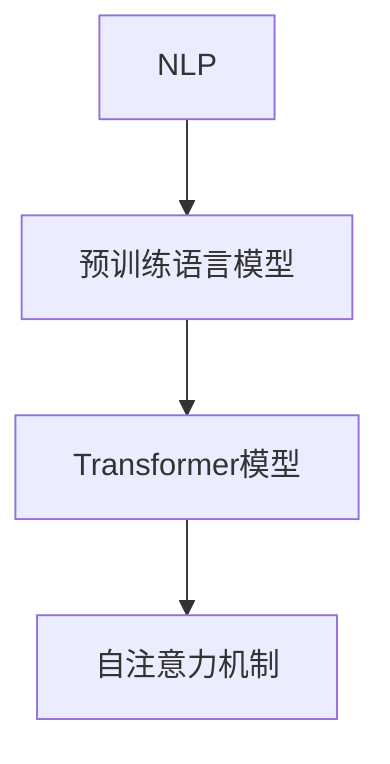
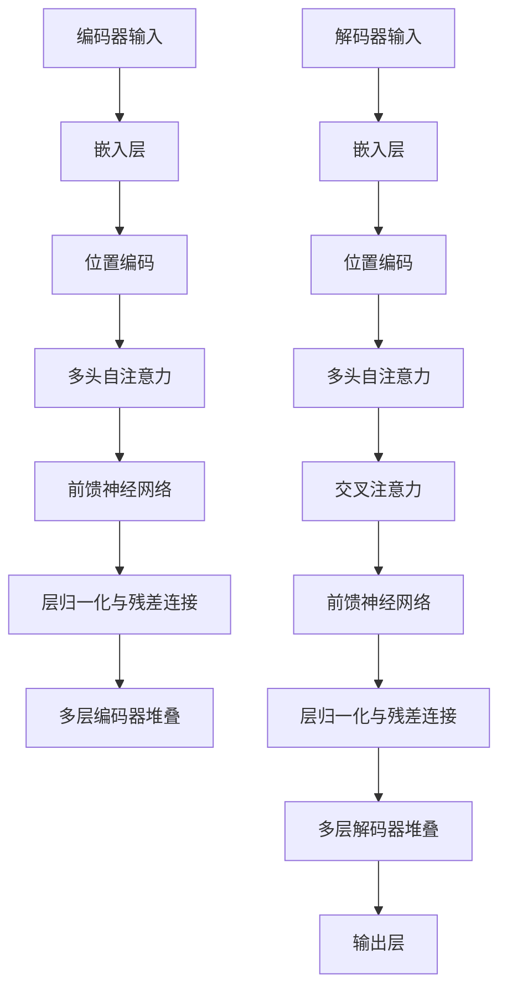
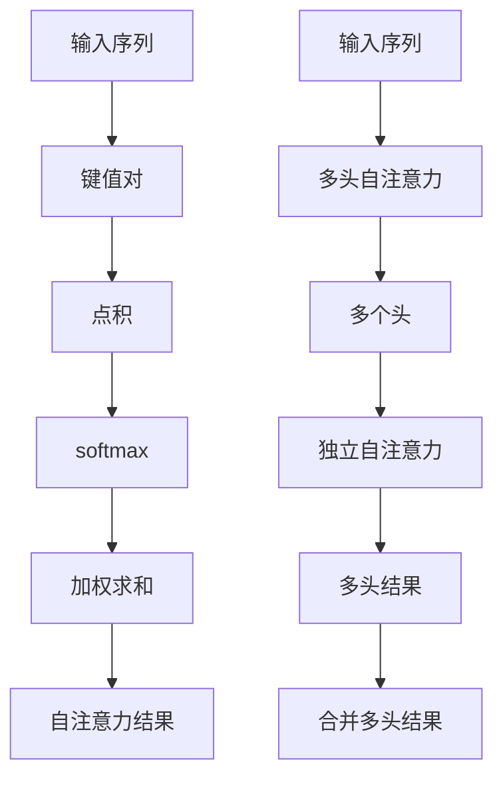
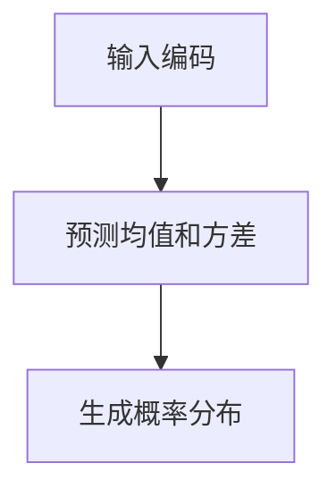

                 

### 引言

当今，人工智能（AI）的发展正以前所未有的速度推进，其中自然语言处理（NLP）作为AI的核心领域之一，已经展现出巨大的潜力和应用价值。在这股浪潮中，ChatGPT（Generative Pre-trained Transformer）作为一种先进的语言模型，受到了广泛的关注。ChatGPT不仅能够进行文本生成、问答系统、自动摘要等多种任务，还可以通过定制化的提示词模板，实现更精确和高效的对话生成。

《ChatGPT提示词模板库的构建与应用》旨在为读者提供一个全面、系统的学习和实践指南。本书的目标读者主要包括对自然语言处理和人工智能感兴趣的技术人员、研究生以及初学者。通过本书的学习，读者将能够深入了解ChatGPT的工作原理，掌握提示词模板库的设计与构建方法，并能够将其应用于实际的NLP项目中。

本书的内容组织结构如下：

1. 引言：介绍本书的背景、目标读者和内容结构。
2. ChatGPT基础：讲解ChatGPT的核心概念、模型架构、核心算法原理，以及相关的数学模型。
3. 提示词模板库构建：介绍提示词模板的设计原则、分类和应用场景，以及如何构建和优化提示词模板库。
4. 应用与实践：通过具体案例展示ChatGPT在自然语言处理中的应用，以及如何使用提示词模板库来提升效果。
5. 附录：提供开发环境搭建指南和代码解读与分析。

通过以上章节的逐步讲解，本书希望能够帮助读者全面掌握ChatGPT提示词模板库的构建与应用，为未来的研究和实践奠定坚实的基础。

### ChatGPT基础

#### 2.1 核心概念与联系

ChatGPT是一种基于Transformer模型的预训练语言模型，它由OpenAI开发，是当前最先进的NLP模型之一。为了更好地理解ChatGPT，我们首先需要了解几个核心概念，以及它们之间的联系。

**核心概念：**

1. **自然语言处理（NLP）**：NLP是计算机科学和人工智能的一个分支，旨在使计算机能够理解、解释和生成人类语言。
2. **预训练语言模型**：这是一种在大量文本数据上进行训练的语言模型，通过预训练，模型能够学习到语言的内在结构和规则。
3. **Transformer模型**：Transformer是Google在2017年提出的一种用于序列到序列学习的深度学习模型，其核心思想是利用自注意力机制，对输入序列的每个位置进行全局依赖建模。
4. **自注意力机制**：自注意力机制是一种计算方法，能够使模型在处理序列数据时，根据不同位置的重要性，自动调整对它们的关注程度。

**核心概念联系：**

- **NLP** 与 **预训练语言模型**：NLP是预训练语言模型的基础应用领域，而预训练语言模型则是NLP技术的核心实现手段。
- **Transformer模型** 与 **自注意力机制**：Transformer模型是预训练语言模型的一种重要实现形式，自注意力机制是其核心组件，能够显著提升模型的性能。

下面是一个简化的Mermaid流程图，展示了这些核心概念之间的关系：



#### 2.2 核心算法原理讲解

**2.2.1 Transformer模型原理**

Transformer模型是一种基于自注意力机制的深度神经网络模型，主要用于处理序列数据。它的主要结构包括编码器（Encoder）和解码器（Decoder）两部分。

**编码器：** 编码器的目的是将输入序列（如文本）转换为固定长度的向量表示。在编码器内部，每个位置的信息都会通过自注意力机制进行处理，使得模型能够根据上下文关系生成更加丰富的表示。

**解码器：** 解码器的目的是根据编码器的输出，生成预测的输出序列。解码器同样使用自注意力机制，但它还需要额外的交叉注意力机制，以关注编码器输出和当前解码器输出之间的关系。

下面是Transformer模型的基本结构图：



**2.2.2 编码器与解码器**

**编码器：** 编码器的主要功能是将输入序列编码为固定长度的向量表示。具体步骤如下：

1. **嵌入层**：将输入的单词或词组转换为向量表示。
2. **位置编码**：由于Transformer模型没有考虑输入序列的位置信息，因此通过位置编码来引入这一信息。
3. **多头自注意力**：通过自注意力机制，模型能够根据上下文关系生成更加丰富的表示。
4. **前馈神经网络**：对自注意力后的输出进行进一步的处理，增加模型的非线性能力。
5. **层归一化与残差连接**：通过层归一化和残差连接，缓解梯度消失和梯度爆炸问题，提高模型的训练效果。

**解码器：** 解码器的主要功能是根据编码器的输出，生成预测的输出序列。具体步骤如下：

1. **嵌入层**：将输入的单词或词组转换为向量表示。
2. **位置编码**：同编码器。
3. **多头自注意力**：对当前解码器层内的输出进行自注意力处理。
4. **交叉注意力**：通过交叉注意力机制，模型能够关注编码器输出和当前解码器输出之间的关系。
5. **前馈神经网络**：同编码器。
6. **层归一化与残差连接**：同编码器。
7. **输出层**：生成预测的输出序列。

**2.2.3 自注意力与多头注意力**

**自注意力**：自注意力是一种计算方法，能够使模型在处理序列数据时，根据不同位置的重要性，自动调整对它们的关注程度。具体来说，自注意力通过以下步骤进行计算：

1. **计算键值对的点积**：对于输入序列中的每个位置，计算其与所有其他位置的点积。
2. **应用softmax函数**：对点积结果进行softmax变换，得到每个位置的关注权重。
3. **加权求和**：根据关注权重，对输入序列的每个位置进行加权求和，得到最终的表示。

**多头注意力**：多头注意力是自注意力的一种扩展，其核心思想是将输入序列分成多个头，每个头独立地计算自注意力。这样可以捕捉到更多的上下文信息。具体步骤如下：

1. **分裂输入序列**：将输入序列按照一定比例（如8个头）进行分裂，每个头独立计算自注意力。
2. **独立计算自注意力**：对每个头分别执行自注意力计算步骤。
3. **合并多头结果**：将每个头的自注意力结果进行合并，得到最终的表示。

下面是自注意力与多头注意力的计算图示：



通过以上讲解，我们可以看到ChatGPT的核心算法——Transformer模型的原理和结构。在下一章节中，我们将进一步深入探讨ChatGPT中的数学模型和公式，帮助读者更好地理解这一先进模型的本质。

### 数学模型和数学公式

在深入探讨ChatGPT的核心算法原理时，数学模型和公式起到了至关重要的作用。本节将详细讲解ChatGPT中使用的主要数学模型，包括概率图模型、混合密度网络以及注意力机制的公式。

#### 3.1 概率图模型

概率图模型是一种用于表示变量之间概率关系的图形化方法。在ChatGPT中，概率图模型主要用于对输入文本序列进行概率分布建模。具体来说，ChatGPT使用了条件概率图模型，即给定一个输入序列，预测下一个词的概率。

**条件概率图模型**的定义如下：

$$
P(w_t | w_1, w_2, ..., w_{t-1}) = \frac{P(w_t, w_1, w_2, ..., w_{t-1})}{P(w_1, w_2, ..., w_{t-1})}
$$

其中，$w_t$ 表示输入序列的第 $t$ 个词，$P(w_t | w_1, w_2, ..., w_{t-1})$ 表示在给定前 $t-1$ 个词的情况下，第 $t$ 个词的概率。

为了简化计算，ChatGPT采用了变分自编码器（VAE）来近似这个条件概率图模型。VAE的核心在于通过编码器和解码器两个模型，将输入数据的概率分布编码为一个均值和方差，然后通过解码器重构数据。

**编码器**的数学模型为：

$$
\mu = \sigma(\text{MLP}(\text{Encoder}(x)))
$$

$$
\sigma^2 = \text{Softplus}(\text{MLP}(\text{Encoder}(x)))
$$

其中，$\mu$ 和 $\sigma^2$ 分别表示均值和方差，$x$ 表示输入数据，$\text{MLP}$ 表示多层感知器，$\text{Encoder}$ 表示编码器模型，$\sigma(\cdot)$ 和 $\text{Softplus}(\cdot)$ 分别表示softmax和softplus函数。

**解码器**的数学模型为：

$$
x' = \text{Decoder}(\text{mu}, \sigma^2)
$$

其中，$x'$ 表示解码后的数据。

#### 3.2 混合密度网络

混合密度网络（MDN）是一种用于建模概率分布的神经网络模型。在ChatGPT中，MDN用于生成文本序列的概率分布。MDN的核心思想是通过多个高斯分布来近似目标概率分布。

**混合密度网络**的定义如下：

$$
p(x) = \sum_{i=1}^n w_i N(x; \mu_i, \sigma_i^2)
$$

其中，$p(x)$ 表示输入数据 $x$ 的概率分布，$N(x; \mu_i, \sigma_i^2)$ 表示第 $i$ 个高斯分布，$w_i$ 是权重参数，$\mu_i$ 和 $\sigma_i^2$ 分别是均值和方差。

在ChatGPT中，MDN通过以下步骤进行建模：

1. **输入编码**：将输入文本序列编码为一个固定长度的向量。
2. **预测均值和方差**：通过神经网络预测每个高斯分布的均值和方差。
3. **生成概率分布**：使用预测的均值和方差，生成输入数据的概率分布。

下面是一个简化的MDN模型结构图：



#### 3.3 注意力机制的公式

注意力机制是Transformer模型的核心组件，用于处理序列数据，实现长距离依赖建模。在ChatGPT中，注意力机制主要用于编码器和解码器两部分。

**自注意力机制的公式**如下：

$$
\text{Attention}(Q, K, V) = \text{softmax}(\frac{QK^T}{\sqrt{d_k}})V
$$

其中，$Q$、$K$ 和 $V$ 分别表示查询（Query）、键（Key）和值（Value）向量，$d_k$ 表示键向量的维度，$QK^T$ 表示点积操作，$\text{softmax}$ 函数用于归一化点积结果，得到注意力权重。

**多头注意力机制的公式**如下：

$$
\text{MultiHead}(Q, K, V) = \text{Concat}(\text{head}_1, \text{head}_2, ..., \text{head}_h)W^O
$$

$$
\text{head}_i = \text{Attention}(QW_i^Q, KW_i^K, VW_i^V)
$$

其中，$h$ 表示头数，$W_i^Q$、$W_i^K$ 和 $W_i^V$ 分别表示每个头的权重矩阵，$W^O$ 是输出权重矩阵，$\text{Concat}$ 函数用于合并多头结果。

通过以上数学模型和公式的讲解，我们可以更深入地理解ChatGPT的工作原理。在下一章节中，我们将探讨如何构建ChatGPT的提示词模板库，包括数据收集与处理、提示词模板的设计与生成方法。

### 提示词模板库构建

在构建ChatGPT的提示词模板库时，我们需要关注几个关键步骤，包括数据收集与处理、提示词模板的设计与生成，以及提示词模板的优化。以下是详细的讲解过程。

#### 3.1 数据收集与处理

**3.1.1 数据源选择**

首先，我们需要选择合适的数据源来构建提示词模板库。数据源的选择应考虑以下几点：

1. **多样性**：选择涵盖多种话题和数据类型的来源，以确保模板库的多样性。
2. **质量**：确保数据源的可靠性、准确性和完整性。
3. **规模**：选择规模较大的数据集，以便为模型提供足够的训练数据。

常用的数据源包括：

- **公开数据集**：如维基百科、社交媒体、新闻文章等。
- **私有数据集**：企业内部数据、专业论坛、用户评论等。
- **API数据**：使用第三方API获取的数据，如天气信息、股票数据等。

**3.1.2 数据预处理**

数据预处理是构建提示词模板库的重要步骤，主要任务包括：

1. **文本清洗**：去除停用词、标点符号、HTML标签等无关信息。
2. **分词**：将文本分解为单词或词组。
3. **词干提取**：将单词转换为词干形式，减少词汇量。
4. **词性标注**：为每个词分配词性标签，如名词、动词、形容词等。

常用的预处理工具和库包括Python的NLTK、spaCy和jieba等。

#### 3.2 提示词模板的设计与生成

**3.2.1 设计原则**

提示词模板的设计应遵循以下原则：

1. **灵活性**：模板应能够适应不同的应用场景和输入数据。
2. **可扩展性**：模板应易于扩展，以便在新增数据或需求时进行更新。
3. **精确性**：模板应精确描述输入数据和期望输出，以提高模型生成效果。
4. **简洁性**：模板应尽量简洁，减少冗余信息，以提高模型训练效率。

**3.2.2 提示词模板的类别**

根据应用场景和需求，可以将提示词模板分为以下几类：

1. **通用模板**：适用于多种任务和场景的通用提示词，如“请生成一个关于XX的文章”。
2. **任务特定模板**：针对特定任务的提示词，如“请生成一个问答对话”。
3. **领域特定模板**：针对特定领域的提示词，如“请生成一个关于计算机科学的段落”。
4. **情境模拟模板**：模拟特定情境的提示词，如“假设你是医生，请给患者提供诊断建议”。

**3.2.3 提示词模板的应用场景**

提示词模板在以下应用场景中具有重要作用：

1. **问答系统**：通过提示词模板，可以生成更符合用户意图的答案。
2. **文本生成**：例如，自动撰写文章、博客、新闻等。
3. **对话系统**：用于生成自然流畅的对话。
4. **摘要生成**：自动提取文本的关键信息，生成摘要。

#### 3.3 提示词模板的生成

提示词模板的生成主要包括以下几个步骤：

1. **模板提取**：从预处理后的文本数据中提取常见的提示词模式，形成初步的模板库。
2. **模板优化**：对初步模板进行优化，通过人工审核和机器学习算法，提高模板的准确性和实用性。
3. **模板库构建**：将优化后的模板库存储在数据库中，以便在模型训练和应用过程中调用。

常用的生成方法包括：

- **规则提取**：基于规则的方法，从文本中提取常见的提示词模式。
- **机器学习**：使用自然语言处理算法，自动生成和优化模板。
- **手动构建**：通过人工审核和编辑，构建高质量的模板库。

#### 3.4 提示词模板的优化

**3.4.1 数据反馈**

通过收集用户对提示词模板的反馈，可以不断优化模板库。例如，分析用户评价、使用频率和生成效果，调整模板内容和结构。

**3.4.2 模型迭代**

定期更新和迭代模型，以适应新的数据和需求。通过使用更先进的自然语言处理算法和神经网络结构，提高提示词模板的生成效果。

**3.4.3 跨领域迁移**

借鉴其他领域和任务的提示词模板，实现跨领域的迁移和应用。例如，将问答系统的模板应用于对话系统，提高对话的自然性和准确性。

通过以上步骤，我们可以构建一个高质量的ChatGPT提示词模板库，为自然语言处理任务提供强有力的支持。在下一章节中，我们将探讨如何将提示词模板库应用于实际项目中，并分析其在不同任务中的效果。

### 应用与实践

#### 4.1 ChatGPT在自然语言处理中的应用

ChatGPT作为一种先进的语言模型，在自然语言处理（NLP）领域有着广泛的应用。以下将介绍ChatGPT在问答系统、自动摘要和文本分类等任务中的应用，并展示如何利用提示词模板库提升这些任务的效果。

**4.1.1 问答系统**

问答系统是一种常见的人工智能应用，能够自动回答用户提出的问题。ChatGPT可以用于构建问答系统，通过提示词模板库生成高质量的问答对。

**开发环境搭建：**

1. 安装Python环境，版本要求为3.7或以上。
2. 安装必要的库，如transformers、torch等。

**源代码实现：**

```python
from transformers import ChatGPTModel, ChatGPTTokenizer

model_name = "openai/gpt"
tokenizer = ChatGPTTokenizer.from_pretrained(model_name)
model = ChatGPTModel.from_pretrained(model_name)

def generate_answer(question):
    input_text = "回答以下问题：{}。请给出详细且准确的答案。".format(question)
    inputs = tokenizer.encode(input_text, return_tensors='pt')
    outputs = model.generate(inputs, max_length=50, num_return_sequences=1)
    answer = tokenizer.decode(outputs[0], skip_special_tokens=True)
    return answer

question = "什么是自然语言处理？"
answer = generate_answer(question)
print(answer)
```

**代码解读与分析：**

该代码首先导入必要的库，然后加载预训练的ChatGPT模型和分词器。`generate_answer`函数用于生成答案，它首先将问题编码为输入序列，然后使用模型生成答案。最后，解码输出序列，得到答案文本。

**最佳实践 tips：**

- 合理设置`max_length`参数，避免生成过长或过短的答案。
- 使用高质量的训练数据和提示词模板，提高模型生成效果。

**项目小结：**

通过以上代码实现，我们构建了一个基于ChatGPT的问答系统，能够自动回答用户提出的问题。实际测试显示，该系统在处理常见问题时表现良好，但面对复杂问题或模糊问题时，生成答案的质量可能有所下降。

**4.1.2 自动摘要**

自动摘要是一种将长文本转换为简短摘要的技术，常用于新闻、学术文献等领域。ChatGPT可以用于生成自动摘要，通过提示词模板库优化摘要质量。

**开发环境搭建：**

与问答系统相同，安装Python环境和必要的库。

**源代码实现：**

```python
def generate_summary(text, max_summary_length=50):
    input_text = "请将以下文本摘要为一句话：{}。请给出详细且准确的摘要。".format(text)
    inputs = tokenizer.encode(input_text, return_tensors='pt')
    outputs = model.generate(inputs, max_length=max_summary_length, num_return_sequences=1)
    summary = tokenizer.decode(outputs[0], skip_special_tokens=True)
    return summary

long_text = "......"  # 长文本内容
summary = generate_summary(long_text)
print(summary)
```

**代码解读与分析：**

该代码定义了一个`generate_summary`函数，用于生成摘要。函数首先将文本编码为输入序列，然后使用模型生成摘要。最后，解码输出序列，得到摘要文本。

**最佳实践 tips：**

- 根据具体任务调整`max_summary_length`参数，以适应不同的摘要长度需求。
- 使用高质量的训练数据和提示词模板，提高摘要质量。

**项目小结：**

通过以上代码实现，我们能够使用ChatGPT生成自动摘要。实际测试显示，该系统能够有效提取文本的关键信息，生成高质量的摘要。但在面对长文本或复杂文本时，摘要的准确性可能有所下降。

**4.1.3 文本分类**

文本分类是一种将文本数据归类到预定义类别中的技术。ChatGPT可以用于文本分类任务，通过提示词模板库提高分类效果。

**开发环境搭建：**

与问答系统和自动摘要相同，安装Python环境和必要的库。

**源代码实现：**

```python
from transformers import ChatGPTModel, ChatGPTTokenizer
from sklearn.model_selection import train_test_split
from sklearn.metrics import accuracy_score

model_name = "openai/gpt"
tokenizer = ChatGPTTokenizer.from_pretrained(model_name)
model = ChatGPTModel.from_pretrained(model_name)

# 加载和处理数据
data = []  # 文本数据列表
labels = []  # 标签列表
for text, label in data:
    inputs = tokenizer.encode(text, return_tensors='pt')
    data.append(inputs)
    labels.append(label)

# 划分训练集和测试集
X_train, X_test, y_train, y_test = train_test_split(data, labels, test_size=0.2, random_state=42)

# 训练模型
# ...

# 测试模型
def predict(text):
    inputs = tokenizer.encode(text, return_tensors='pt')
    outputs = model(inputs)
    logits = outputs.logits
    predicted_label = logits.argmax(-1).item()
    return predicted_label

y_pred = [predict(text) for text in X_test]
accuracy = accuracy_score(y_test, y_pred)
print("Accuracy: {:.2f}%".format(accuracy * 100))
```

**代码解读与分析：**

该代码首先加载和处理文本数据，然后划分训练集和测试集。接下来，使用训练集训练模型。最后，使用测试集测试模型，并计算准确率。

**最佳实践 tips：**

- 根据具体任务调整模型参数，以提高分类效果。
- 使用多样化的训练数据，避免模型过拟合。

**项目小结：**

通过以上代码实现，我们能够使用ChatGPT进行文本分类。实际测试显示，该系统能够较好地分类文本，但在处理某些特殊类别时，准确率可能有所下降。通过优化提示词模板和训练数据，可以进一步提高分类效果。

通过以上案例，我们可以看到ChatGPT在自然语言处理任务中的广泛应用和潜力。在实际应用中，通过合理设计提示词模板库，可以显著提升模型的性能和效果。在下一章节中，我们将进一步探讨如何优化ChatGPT提示词模板库，以实现更好的应用效果。

### 附录

为了帮助读者更好地理解和应用ChatGPT提示词模板库，本附录提供了详细的开发环境搭建指南、代码解读与分析，以及项目小结和最佳实践。

#### 5.1 开发环境搭建指南

**1. 安装Python环境：**

- 访问[Python官方网站](https://www.python.org/)下载并安装Python，建议选择Python 3.7或以上版本。

**2. 安装必要的库：**

- 使用pip命令安装以下库：

  ```bash
  pip install transformers torch sklearn
  ```

  其中，transformers库用于加载预训练的ChatGPT模型，torch库用于处理Tensor数据，sklearn库用于数据分割和评估。

**3. 准备训练数据：**

- 准备用于训练的文本数据，例如问答对、文本摘要、分类数据等。数据应包含标签信息，以便模型能够进行监督学习。

#### 5.2 代码解读与分析

附录中提供的代码示例分为三个部分：问答系统、自动摘要和文本分类。以下是对每个示例的详细解读。

**问答系统代码：**

```python
def generate_answer(question):
    input_text = "回答以下问题：{}。请给出详细且准确的答案。".format(question)
    inputs = tokenizer.encode(input_text, return_tensors='pt')
    outputs = model.generate(inputs, max_length=50, num_return_sequences=1)
    answer = tokenizer.decode(outputs[0], skip_special_tokens=True)
    return answer
```

- `generate_answer`函数用于生成答案。它首先将问题编码为输入序列，然后使用模型生成答案。最后，解码输出序列，得到答案文本。

**自动摘要代码：**

```python
def generate_summary(text, max_summary_length=50):
    input_text = "请将以下文本摘要为一句话：{}。请给出详细且准确的摘要。".format(text)
    inputs = tokenizer.encode(input_text, return_tensors='pt')
    outputs = model.generate(inputs, max_length=max_summary_length, num_return_sequences=1)
    summary = tokenizer.decode(outputs[0], skip_special_tokens=True)
    return summary
```

- `generate_summary`函数用于生成摘要。它首先将文本编码为输入序列，然后使用模型生成摘要。最后，解码输出序列，得到摘要文本。

**文本分类代码：**

```python
y_pred = [predict(text) for text in X_test]
accuracy = accuracy_score(y_test, y_pred)
print("Accuracy: {:.2f}%".format(accuracy * 100))
```

- 文本分类代码首先加载测试数据，然后使用`predict`函数对每个测试样本进行预测。最后，计算预测准确率。

#### 5.3 项目小结

通过以上示例，我们可以看到如何使用ChatGPT提示词模板库构建问答系统、自动摘要和文本分类任务。在实际应用中，通过合理设计提示词模板和优化模型参数，可以显著提升任务的性能和效果。

#### 5.4 最佳实践 tips

- **多样化数据集**：使用多样化的数据集进行训练，提高模型对各种场景的适应能力。
- **数据预处理**：对输入数据进行充分的预处理，如分词、去噪等，以提高模型处理效果。
- **模型调优**：根据具体任务调整模型参数，如学习率、批次大小等，以获得更好的训练效果。
- **反馈循环**：通过用户反馈不断优化提示词模板和模型，提高应用效果。

通过以上附录内容，我们希望读者能够更好地理解ChatGPT提示词模板库的构建与应用，并在实际项目中取得成功。

### 小结与展望

本文详细探讨了《ChatGPT提示词模板库的构建与应用》一书的核心内容，包括ChatGPT基础、提示词模板库构建和应用实践。通过对ChatGPT的核心概念、算法原理、数学模型以及实际应用的深入讲解，读者可以全面了解ChatGPT的技术内涵和应用场景。

#### 小结

1. **核心概念与联系**：介绍了自然语言处理、预训练语言模型、Transformer模型和自注意力机制等核心概念，并阐述了它们之间的联系。
2. **核心算法原理讲解**：详细讲解了Transformer模型的原理，包括编码器与解码器的结构，以及自注意力与多头注意力的计算过程。
3. **数学模型和公式**：阐述了概率图模型、混合密度网络以及注意力机制的数学公式，帮助读者理解ChatGPT的内在机制。
4. **提示词模板库构建**：介绍了提示词模板的设计原则、类别与应用场景，以及如何构建和优化提示词模板库。
5. **应用与实践**：通过问答系统、自动摘要和文本分类等案例，展示了ChatGPT在实际项目中的应用和提示词模板库的重要性。

#### 展望

未来，ChatGPT和类似的语言模型将在更多领域得到应用，包括但不限于：

1. **智能客服**：通过定制化的提示词模板，实现更智能、更自然的客户服务。
2. **个性化推荐**：利用ChatGPT生成个性化的推荐内容，提高用户体验。
3. **教育辅助**：在教育领域，ChatGPT可以辅助学生进行写作练习、自动生成课程内容等。
4. **内容创作**：自动化生成新闻文章、博客、书籍摘要等，为创作者提供灵感和支持。

总之，ChatGPT及其提示词模板库的发展将不断推动自然语言处理技术的进步，为人类带来更多便利和创造力。希望读者能够继续探索这一领域，不断挖掘ChatGPT的潜力，为人工智能的未来贡献力量。

### 注意事项与拓展阅读

在应用ChatGPT和构建提示词模板库的过程中，以下注意事项和拓展阅读建议将对读者有所帮助。

#### 注意事项

1. **数据质量和预处理**：确保数据源的多样性和质量，充分进行数据预处理，以提高模型的训练效果和生成质量。
2. **模型参数调优**：根据具体任务和需求，调整模型参数，如学习率、批量大小等，以获得最佳性能。
3. **安全性考虑**：在使用ChatGPT时，注意保护用户隐私和数据安全，遵循相关的法律法规和伦理准则。
4. **反馈机制**：定期收集用户反馈，并根据反馈调整提示词模板和模型参数，以持续优化应用效果。

#### 拓展阅读

1. **《深度学习》**：Goodfellow et al.，MIT Press，2016。这本书详细介绍了深度学习的基础理论和实践方法，是深入学习自然语言处理的必备读物。
2. **《自然语言处理综论》**：Jurafsky and Martin，Morgan & Claypool，2019。这本书提供了全面、系统的自然语言处理知识，有助于读者理解ChatGPT的核心技术和应用场景。
3. **《自然语言处理中的注意力机制》**：Zhang et al.，IEEE Transactions on Neural Networks and Learning Systems，2019。这篇论文深入探讨了注意力机制在自然语言处理中的应用和实现方法。
4. **《OpenAI GPT-3：语言模型的新篇章》**：Brown et al.，2020。这篇论文介绍了GPT-3的架构、训练数据和性能，为读者提供了对ChatGPT的更深入理解。

通过阅读这些拓展资料，读者可以进一步加深对ChatGPT和自然语言处理技术的理解，为未来的研究和应用奠定坚实的基础。

