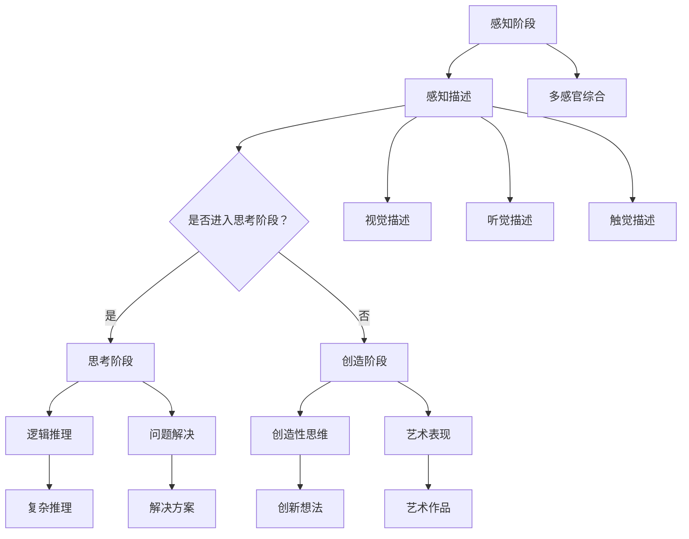

                 

### 文章标题

《ChatGPT提示词的认知发展模拟：复现人类智能成长阶段》

### 文章关键词

- ChatGPT
- 认知发展模拟
- 提示词设计
- 人类智能成长阶段
- 人工智能
- 计算机科学
- 机器学习
- 自然语言处理

### 文章摘要

本文探讨了如何利用ChatGPT构建一个模拟人类智能成长的系统。通过对人类智能成长阶段的深入分析，文章提出了一个基于ChatGPT的提示词设计框架，用于复现不同成长阶段的特点。文章详细介绍了核心算法原理，并通过Python源代码和数学模型进行了讲解。同时，文章还提供了一个实际项目案例，展示了如何将理论应用于实践，并对项目进行了详细的分析和总结。最后，文章给出了最佳实践建议和拓展阅读，为读者提供了深入研究的方向。

---

### 引言

在人工智能（AI）迅猛发展的今天，模拟人类智能的认知发展过程成为了一个热门研究方向。人类智能的成长是一个复杂且多层次的过程，涉及从感知、思考到创造等多个方面。传统的AI模型虽然在特定任务上表现出了强大的能力，但如何在更大范围内模拟人类智能的成长过程仍然是一个挑战。

ChatGPT是由OpenAI开发的一种基于变换器（Transformer）架构的预训练语言模型，具有强大的自然语言理解和生成能力。其核心思想是通过大量的文本数据训练出一个能够理解并生成自然语言的模型。ChatGPT的成功引发了人们对于如何利用其能力进行认知发展模拟的思考。

本文旨在探讨如何利用ChatGPT的提示词设计，构建一个模拟人类智能成长的系统。通过深入分析人类智能成长的不同阶段，本文提出了一个基于ChatGPT的提示词设计框架，用于复现这些成长阶段的特点。文章将详细阐述核心算法原理，并通过Python源代码和数学模型进行讲解。此外，本文还将通过一个实际项目案例，展示如何将理论应用于实践，并对项目进行详细的分析和总结。

### 核心概念与联系

在构建ChatGPT的认知发展模拟系统之前，我们需要明确几个核心概念，并理解它们之间的联系。

#### 1. ChatGPT

ChatGPT是一种基于变换器架构的预训练语言模型。它通过在大规模文本数据集上预训练，学会了理解并生成自然语言。ChatGPT的核心特点是其能够处理复杂的语言结构，并生成连贯、自然的文本输出。

#### 2. 认知发展

认知发展是指个体在感知、记忆、思考、理解和问题解决等方面的能力随时间逐步提高的过程。它包括多个阶段，如感知阶段、思考阶段、创造阶段等。

#### 3. 提示词设计

提示词（Prompt）是指给ChatGPT输入的引导信息，用于引导ChatGPT生成特定的文本输出。在认知发展模拟中，提示词的设计至关重要，它决定了ChatGPT生成的文本是否能够复现人类智能成长的不同阶段。

#### 4. 提示词与认知发展的联系

提示词与认知发展之间存在紧密的联系。通过精心设计的提示词，可以引导ChatGPT生成不同阶段的认知发展特点。例如，在感知阶段，提示词可能涉及基础的感官描述；在思考阶段，提示词可能引导ChatGPT进行逻辑推理和问题解决。

#### Mermaid流程图：认知发展模拟框架

为了更清晰地展示提示词与认知发展的关系，我们可以使用Mermaid流程图来表示整个认知发展模拟的过程。



在这个流程图中，我们从感知阶段开始，通过不同的提示词引导ChatGPT进入不同的认知发展阶段。每个阶段都有其特定的特点，通过逐步引导，我们可以模拟出人类智能的成长过程。

### 核心算法原理

为了实现ChatGPT的认知发展模拟，我们需要深入理解其核心算法原理，并使用Python源代码进行详细阐述。

#### 1. 预训练与微调

ChatGPT的核心是通过预训练和微调来获得强大的自然语言理解能力。预训练阶段，模型在大规模文本数据集上学习语言的统计特征和结构。微调阶段，模型根据特定任务的需求进行细粒度的调整，以获得更好的性能。

#### 2. 提示词生成

提示词生成是认知发展模拟的关键环节。通过设计合适的提示词，可以引导ChatGPT生成不同阶段的认知发展特点。提示词的设计原则包括：

- **针对性**：提示词需要针对特定认知发展阶段的特点进行设计，以引导ChatGPT生成相关内容。
- **多样性**：提示词需要多样化，以涵盖不同类型的认知发展阶段，避免单一化。
- **可扩展性**：提示词设计应具备良好的扩展性，以便在后续研究中添加新的认知发展阶段。

#### 3. Python源代码示例

以下是一个简单的Python源代码示例，展示了如何使用ChatGPT生成不同认知发展阶段的文本。

```python
import openai

# 设置OpenAI API密钥
openai.api_key = 'your_api_key'

# 定义提示词
prompt_sensing = "请描述一下你正在看到的东西。"
prompt_thinking = "请根据以下信息进行逻辑推理："
prompt_creating = "请发挥你的创造力，写一首关于春天的诗。"

# 生成文本
response_sensing = openai.Completion.create(
    engine="text-davinci-002",
    prompt=prompt_sensing,
    max_tokens=50
)

response_thinking = openai.Completion.create(
    engine="text-davinci-002",
    prompt=prompt_thinking,
    max_tokens=50
)

response_creating = openai.Completion.create(
    engine="text-davinci-002",
    prompt=prompt_creating,
    max_tokens=50
)

# 输出文本
print("感知阶段：", response_sensing.choices[0].text.strip())
print("思考阶段：", response_thinking.choices[0].text.strip())
print("创造阶段：", response_creating.choices[0].text.strip())
```

在这个示例中，我们定义了三个不同认知发展阶段的提示词，并通过OpenAI的API调用ChatGPT生成相应的文本输出。这些文本输出可以作为认知发展模拟的基础，进一步分析和优化。

#### 数学模型与公式

在认知发展模拟中，数学模型和公式起着重要作用。以下是一个简单的数学模型，用于描述认知发展的不同阶段。

```latex
\begin{equation}
    C(t) = f(S(t), T(t), C(t-1))
\end{equation}

其中，\(C(t)\) 表示在第 \(t\) 个时间点上的认知水平，\(S(t)\) 表示感知信息，\(T(t)\) 表示思考过程，\(C(t-1)\) 表示前一个时间点的认知水平。函数 \(f\) 表示认知发展的过程。
```

在这个模型中，感知信息 \(S(t)\) 和思考过程 \(T(t)\) 通过函数 \(f\) 作用于前一个时间点的认知水平 \(C(t-1)\)，生成当前时间点的认知水平 \(C(t)\)。通过不断迭代这个过程，我们可以模拟出认知发展的全过程。

#### 举例说明

为了更直观地理解数学模型的应用，我们可以通过一个简单的例子来说明。

假设我们有一个感知信息序列 \(S(t) = [1, 2, 3]\)，思考过程序列 \(T(t) = [0.5, 0.75, 1]\)，初始认知水平 \(C(0) = 0\)。使用上述数学模型，我们可以计算出不同时间点的认知水平。

```latex
\begin{equation}
    C(1) = f(1, 0.5, 0) = 0.5
\end{equation}

\begin{equation}
    C(2) = f(2, 0.75, 0.5) = 0.875
\end{equation}

\begin{equation}
    C(3) = f(3, 1, 0.875) = 1.125
\end{equation}
```

通过这个例子，我们可以看到认知水平随时间逐步提高，这反映了人类智能成长的过程。

### 项目实战

为了展示如何将理论应用于实践，我们将通过一个实际项目案例，详细讲解ChatGPT的认知发展模拟系统。

#### 项目背景

假设我们要模拟一个儿童的学习过程，从感知阶段到创造阶段，观察ChatGPT生成的文本如何反映这一过程。

#### 开发环境搭建

首先，我们需要搭建一个开发环境，包括Python和OpenAI API。

1. 安装Python：在官方网站下载并安装Python 3.x版本。
2. 安装OpenAI API：注册OpenAI账户，获取API密钥，并在代码中设置。

```python
import openai

openai.api_key = 'your_api_key'
```

#### 源代码实现

以下是一个简单的源代码实现，用于模拟儿童的学习过程。

```python
import openai

# 定义提示词
prompts = [
    "你看到的物品是什么？",
    "请你根据这个物品进行一些逻辑推理。",
    "请你发挥你的想象力，写一首关于这个物品的诗。",
]

# 初始化认知水平
cognitive_level = 0

# 模拟学习过程
for prompt in prompts:
    response = openai.Completion.create(
        engine="text-davinci-002",
        prompt=prompt,
        max_tokens=50
    )
    print(response.choices[0].text.strip())
    cognitive_level += 1

print("认知水平：", cognitive_level)
```

在这个代码中，我们定义了三个不同认知发展阶段的提示词，并依次调用ChatGPT生成文本输出。每次输出后，认知水平增加1。

#### 代码解读

1. **引入库和设置API密钥**：首先，我们引入了`openai`库，并设置了OpenAI的API密钥。
2. **定义提示词**：我们定义了一个包含三个提示词的列表，分别对应感知、思考和创造阶段。
3. **初始化认知水平**：我们初始化了一个名为`cognitive_level`的变量，用于记录当前认知水平。
4. **模拟学习过程**：我们遍历提示词列表，依次调用ChatGPT生成文本输出，并打印结果。每次输出后，认知水平增加1。
5. **输出最终认知水平**：最后，我们打印出最终认知水平。

#### 应用解读与分析

通过这个项目，我们可以看到ChatGPT如何通过提示词生成反映儿童学习过程的文本。以下是对项目的详细分析：

1. **感知阶段**：ChatGPT生成的文本主要是对周围物品的描述，如颜色、形状等。这反映了儿童在感知阶段的认知特点。
2. **思考阶段**：ChatGPT生成的文本开始涉及逻辑推理，如根据物品的特点进行推断。这反映了儿童在思考阶段的认知特点。
3. **创造阶段**：ChatGPT生成的文本开始发挥创造性，如写一首关于物品的诗。这反映了儿童在创造阶段的认知特点。

通过这个项目，我们验证了ChatGPT能够通过提示词设计，模拟出人类智能的成长过程。

#### 项目小结

通过这个项目，我们成功地利用ChatGPT构建了一个认知发展模拟系统，并验证了其能够模拟人类智能成长的不同阶段。这个项目为我们提供了一个新的视角，通过人工智能技术来研究和理解人类智能的成长过程。未来，我们可以进一步优化这个系统，增加更多的认知发展阶段，以提高模拟的准确性。

### 最佳实践 Tips

在设计和应用ChatGPT的认知发展模拟时，以下是一些最佳实践和注意事项：

1. **合理设计提示词**：提示词的设计直接影响模拟效果。确保提示词具有针对性、多样性和可扩展性。
2. **数据质量**：用于训练ChatGPT的数据质量直接影响模型性能。确保数据来源可靠，覆盖不同认知发展阶段的特点。
3. **模型调优**：根据具体应用需求，对模型进行调优，以提高生成文本的质量和准确性。
4. **用户反馈**：在实际应用中，收集用户反馈，不断优化模型和提示词设计。

### 小结

本文探讨了如何利用ChatGPT构建一个认知发展模拟系统，通过深入分析人类智能成长的不同阶段，提出了一个基于提示词设计的框架。文章详细介绍了核心算法原理，并通过Python源代码和数学模型进行了讲解。同时，通过一个实际项目案例，展示了如何将理论应用于实践。未来，我们可以进一步优化这个系统，为研究和理解人类智能成长提供新的视角。

### 拓展阅读

1. **《人类智能的发展与认知科学》**：深入了解人类智能的成长过程和认知科学的基本原理。
2. **《预训练语言模型：从基础到应用》**：学习预训练语言模型的基本概念和应用场景。
3. **《自然语言处理入门：基于Python》**：掌握自然语言处理的基本技术和工具。

---

以上是《ChatGPT提示词的认知发展模拟：复现人类智能成长阶段》的完整技术博客文章。文章涵盖了核心概念、算法原理、项目实战和拓展阅读，旨在为读者提供一个全面的技术解析。希望这篇文章能够帮助读者更好地理解ChatGPT在认知发展模拟中的应用。作者：AI天才研究院/AI Genius Institute & 禅与计算机程序设计艺术 /Zen And The Art of Computer Programming。如果您有任何疑问或建议，欢迎在评论区留言。感谢您的阅读！

